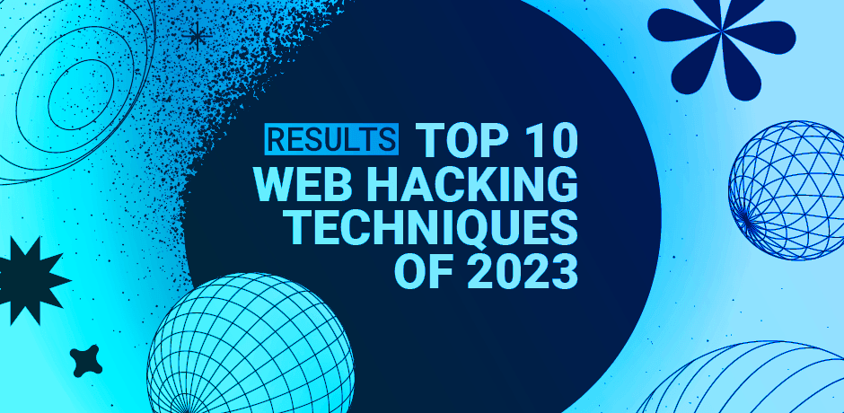

# 2023 年十大网络黑客技术|PortSwigger 研究 --- Top 10 web hacking techniques of 2023 | PortSwigger Research

# Top 10 web hacking techniques of 2023  
2023 年十大网络黑客技术

-   [↓↓↓](https://twitter.com/share?url=https%3A%2F%2Fportswigger.net%2Fresearch%2Ftop-10-web-hacking-techniques-of-2023&text=Top+10+web+hacking+techniques+of+2023%20-%20%40PortSwiggerRes%0A)  
      
      
      
    [↑↑↑](https://twitter.com/share?url=https%3A%2F%2Fportswigger.net%2Fresearch%2Ftop-10-web-hacking-techniques-of-2023&text=Top+10+web+hacking+techniques+of+2023%20-%20%40PortSwiggerRes%0A)
    
-   [↓↓↓](https://api.whatsapp.com/send?text=https%3A%2F%2Fportswigger.net%2Fresearch%2Ftop-10-web-hacking-techniques-of-2023)  
      
      
      
    [↑↑↑](https://api.whatsapp.com/send?text=https%3A%2F%2Fportswigger.net%2Fresearch%2Ftop-10-web-hacking-techniques-of-2023)
    
-   [↓↓↓](https://reddit.com/submit?url=https%3A%2F%2Fportswigger.net%2Fresearch%2Ftop-10-web-hacking-techniques-of-2023)  
      
      
      
    [↑↑↑](https://reddit.com/submit?url=https%3A%2F%2Fportswigger.net%2Fresearch%2Ftop-10-web-hacking-techniques-of-2023)
    
-   [↓↓↓](https://www.linkedin.com/sharing/share-offsite?url=https%3A%2F%2Fportswigger.net%2Fresearch%2Ftop-10-web-hacking-techniques-of-2023)  
      
      
      
    [↑↑↑](https://www.linkedin.com/sharing/share-offsite?url=https%3A%2F%2Fportswigger.net%2Fresearch%2Ftop-10-web-hacking-techniques-of-2023)
    
-   [↓↓↓](mailto:?subject=Top+10+web+hacking+techniques+of+2023&body=Top+10+web+hacking+techniques+of+2023%0A%0AWelcome+to+the+Top+10+Web+Hacking+Techniques+of+2023%2C+the+17th+edition+of+our+annual+community-powered+effort+to+identify+the+most+innovative+must-read+web+security+research+published+in+the+last+year%0A%0Ahttps://portswigger.net/research/top-10-web-hacking-techniques-of-2023)  
      
      
      
    [↑↑↑](mailto:?subject=Top+10+web+hacking+techniques+of+2023&body=Top+10+web+hacking+techniques+of+2023%0A%0AWelcome+to+the+Top+10+Web+Hacking+Techniques+of+2023%2C+the+17th+edition+of+our+annual+community-powered+effort+to+identify+the+most+innovative+must-read+web+security+research+published+in+the+last+year%0A%0Ahttps://portswigger.net/research/top-10-web-hacking-techniques-of-2023)
    
-   [↓↓↓](https://portswigger.net/research/rss)  
      
      
      
    [↑↑↑](https://portswigger.net/research/rss)
    

### 

[↓↓↓](https://portswigger.net/research/james-kettle)  
  
James Kettle  詹姆斯·凯特尔  
  
[↑↑↑](https://portswigger.net/research/james-kettle)

Director of Research 研究主任

[@albinowax](https://twitter.com/albinowax)

-   **Published:** 19 February 2024 at 14:31 UTC  
    发布时间：2024 年 2 月 19 日 14:31 UTC
    
-   **Updated:** 19 February 2024 at 15:58 UTC  
    更新时间：2024 年 2 月 19 日 15:58 UTC
    

  

Welcome to the Top 10 Web Hacking Techniques of 2023, the [17th edition](https://portswigger.net/research/top-10-web-hacking-techniques) of our annual community-powered effort to identify the most innovative must-read web security research published in the last year.  
欢迎来到 2023 年十大网络黑客技术，这是我们年度社区动力努力的第 17 版，旨在确定去年发表的最具创新性的必读网络安全研究。

This year, in response to our call for nominations the community [submitted a record 68 entries](https://portswigger.net/research/top-10-web-hacking-techniques-of-2023-nominations-open), and cast votes to select 15 finalists. The finalists were then analysed over two weeks and voted on by an expert panel of researchers [Nicolas Grégoire](https://twitter.com/Agarri_FR), [Soroush Dalili](https://twitter.com/irsdl), [Filedescriptor](https://twitter.com/filedescriptor), and [myself](https://twitter.com/albinowax) to select the top ten new web hacking techniques of 2023! As usual, we haven't excluded our own research, but panellists can't vote for anything they're affiliated with.  
今年，为了响应我们的提名呼吁，社区提交了创纪录的 68 个参赛作品，并投票选出 15 个决赛选手。然后，决赛选手经过两周的分析，并由研究人员 Nicolas Grégoire，Soroush Dalili，Filedescriptor 和我自己组成的专家小组投票选出 2023 年十大新网络黑客技术！像往常一样，我们没有排除我们自己的研究，但小组成员不能投票给任何他们所属的。

The standard of competition has once again been extremely fierce, with many posts I personally rate failing to even survive the community vote. I highly recommend that everyone with time to spare peruse the [entire nomination list](https://portswigger.net/research/top-10-web-hacking-techniques-of-2023-nominations-open), and we've added AI-generated summaries for every entry to help you evaluate which ones to dive into.  
竞争的标准再次变得非常激烈，我个人认为许多帖子甚至无法通过社区投票。我强烈建议每个有时间的人仔细阅读整个提名名单，我们为每个条目添加了 AI 生成的摘要，以帮助您评估哪些条目需要深入研究。

With all that said, let's start the countdown!  
说了这么多，让我们开始倒计时吧！

#### 10\. can I speak to your manager? hacking root EPP servers to take control of zones  
10.我能和你们经理谈谈吗？入侵 EPP 根服务器以控制区域

In tenth place, we have a beautiful insight into some overlooked and incredibly valuable attack-surface. In [can I speak to your manager? hacking root EPP servers to take control of zones](https://hackcompute.com/hacking-epp-servers/), Sam Curry, Brett Buerhaus, Rhys Elsmore, and Shubham Shah give us a timeless lesson that critical internet infrastructure can be shockingly fragile, and the easiest route to hack something might be many layers away.  
在第十位，我们对一些被忽视的和令人难以置信的有价值的攻击面有了很好的了解。我能和你们经理谈谈吗？攻击根 EPP 服务器以控制区域，Sam 咖喱，Brett Buerhaus，Rhys Elsmore 和 Shubham Shah 给予我们一个永恒的教训，即关键的互联网基础设施可能非常脆弱，最简单的攻击路径可能是许多层。

#### 9\. Cookie Crumbles: Breaking and Fixing Web Session Integrity  
9\. Cookie Crumbles：破坏和修复 Web 会话完整性

In ninth, [Cookie Crumbles: Breaking and Fixing Web Session Integrity](https://www.usenix.org/conference/usenixsecurity23/presentation/squarcina) takes a harsh look at the state of web cookies from numerous angles. One standout technique is CSRF token fixation - a cousin of session fixation, which they use to exploit numerous authentication libraries, notably including popular PHP framework Symfony. If you want to perform a [CSRF attack](https://portswigger.net/web-security/csrf) in 2024, read this paper. Excellent work from Marco Squarcina, Pedro Adão, Lorenzo Veronese and Matteo Maffei.  
第九，Cookie Crumbles：打破和修复 Web 会话完整性从多个角度对 Web Cookie 的状态进行了严厉的审视。一个突出的技术是 CSRF 令牌固定 - 会话固定的表亲，他们使用它来利用许多身份验证库，特别是包括流行的 PHP 框架 Symfony。如果你想在 2024 年进行 CSRF 攻击，请阅读本文。Marco Squarcina，Pedro Adão，Lorenzo Veronese 和 Matteo Maffei 的出色作品。

#### 8\. From Akamai to F5 to NTLM... with love.  
8.从 Akamai 到 F5 再到 NTLM.带着爱

In eighth place, [From Akamai to F5 to NTLM... with love](https://blog.malicious.group/from-akamai-to-f5-to-ntlm/) offers proof that HTTP Desync Attacks still haunt the internet. D3d's deadvolvo's work stands out thanks to a rich exploration of the research thought process, sharing the whole journey and capturing the sheer scope and impact of this bug class. Both vulnerable server vendors refuse to pay bounties, and instead rely on their exposed customers paying out bounties to incentivize this kind of research, which creates some interesting dynamics. Best not to think about it.  
排名第八的是从 Akamai 到 F5 再到 NTLM.《with love》提供了 HTTP Desync 攻击仍然困扰互联网的证据。D3d 的 deadvolvo 的工作之所以脱颖而出，是因为它对研究思维过程进行了丰富的探索，分享了整个过程，捕捉了这个 bug 类的范围和影响。这两家易受攻击的服务器供应商都拒绝支付奖金，而是依靠他们暴露的客户支付奖金来激励这种研究，这创造了一些有趣的动态。最好不要去想它。

#### 7\. How I Hacked Microsoft Teams and got $150,000 in Pwn2Own  
7.我是如何入侵微软团队并在 Pwn2Own 中获得 15 万美元的

[How I Hacked Microsoft Teams](https://speakerdeck.com/masatokinugawa/how-i-hacked-microsoft-teams-and-got-150000-dollars-in-pwn2own) takes you through the conception and development of a $150,000 exploit chain. This presentation by Masato Kinugawa is meticulously crafted to let the reader rediscover the exploit themselves, so I won't spoil it by describing the techniques involved. Rather than introducing a novel class of attack, it's a holistic insight into his innovative approach to bypassing protections. I'd recommend everyone read it, but it's particularly worth reading if you want to find non-trivial bugs in Electron applications.  
How I Hacked Microsoft Teams 带您了解 15 万美元漏洞利用链的概念和开发。Masato Kinugawa 的这个演示是精心制作的，让读者自己重新发现漏洞，所以我不会通过描述所涉及的技术来破坏它。这不是介绍一种新的攻击类型，而是对他绕过保护的创新方法的全面洞察。我建议每个人都阅读它，但如果你想在 Electron 应用程序中找到重要的 bug，它特别值得阅读。

#### 6\. HTTP Request Splitting vulnerabilities exploitation  
6\. HTTP 请求拆分漏洞利用

It's easy to under-estimate the scope of HTTP Request Splitting because frankly, it shouldn't exist in any mainstream server in 2023. However, nginx apparently thinks otherwise, making this vulnerability a common and high-impact goldmine for hackers. In [HTTP Request Splitting vulnerabilities exploitation](https://offzone.moscow/upload/iblock/11a/sagouc86idiapdb8f29w41yaupqv6fwv.pdf), Sergey Bobrov provides a broad range of case-studies showing creative pathways to maximum impact. You can expect this to remain valuable until nginx changes their position, or HTTP/1.1 fades out of existence. I'll write them an email.  
很容易低估 HTTP 请求拆分的范围，因为坦率地说，到 2023 年，它不应该存在于任何主流服务器中。然而，nginx 显然不这么认为，这使得这个漏洞成为黑客常见的高影响力金矿。在 HTTP 请求分割漏洞利用中，Sergey Bobrov 提供了广泛的案例研究，展示了最大影响的创造性途径。你可以期待它仍然有价值，直到 nginx 改变他们的位置，或者 HTTP/1.1 消失。我给他们写封邮件。

#### 5\. Exploiting HTTP Parsers Inconsistencies  
5.利用 HTTP 解析器入侵

In fifth place, [Exploiting HTTP Parsers Inconsistencies](https://rafa.hashnode.dev/exploiting-http-parsers-inconsistencies) by Rafael da Costa Santos takes familiar parser confusion techniques and reapplies them in new contexts, discovering ACL bypasses, [SSRF](https://portswigger.net/web-security/ssrf), cache poisoning, and of course WAF bypasses. It takes serious skill to make research look this easy.  
排在第五位的是 Rafael da Costa 桑托斯的 Exploiting HTTP Parsers Includes，它采用了熟悉的解析器混淆技术，并在新的上下文中重新应用它们，发现了 ACL 旁路、SSRF、缓存中毒，当然还有 WAF 旁路。让研究看起来如此简单需要很高的技巧。

#### 4\. PHP filter chains: file read from error-based oracle  
4\. PHP 过滤器链：从基于错误的 Oracle 读取文件

In 2022, hash\_kitten invented an [extremely creative technique](https://github.com/DownUnderCTF/Challenges_2022_Public/blob/main/web/minimal-php/solve/solution.py) to leak the contents of files by repeatedly using PHP filters to trigger conditional out-of-memory exceptions, but the community struggled to replicate it and the technique largely escaped attention. In [PHP filter chains: file read from error-based oracle](https://www.synacktiv.com/publications/php-filter-chains-file-read-from-error-based-oracle), Rémi Matasse gives this amazing technique the in-depth explanation, optimisations, and accompanying toolkit that it so badly deserves. This technique is fascinating and we're intrigued to see if it gets taken further in PHP or other languages.  
2022 年，hash\_kitten 发明了一种极具创造性的技术，通过反复使用 PHP 过滤器触发条件内存不足异常来泄漏文件内容，但社区很难复制它，该技术在很大程度上没有引起注意。在 PHP 过滤器链中：从基于错误的 oracle 读取文件，RémiMatasse 给了这个惊人的技术深入的解释，优化，和配套的工具包，它是如此的不值得。这项技术很吸引人，我们很想看看它是否会在 PHP 或其他语言中得到进一步的应用。

#### 3\. SMTP Smuggling - Spoofing E-Mails Worldwide  
3\. SMTP 走私 - 欺骗电子邮件全球

In well-earned third place comes [SMTP Smuggling - Spoofing E-Mails Worldwide](https://sec-consult.com/blog/detail/smtp-smuggling-spoofing-e-mails-worldwide/) by Timo Longin. This research continues the parser discrepancy storm by adapting [HTTP request smuggling](https://portswigger.net/web-security/request-smuggling) techniques to exploit SMTP instead. It contains all the hallmarks of outstanding research: innovative ideas, high-impact case-studies targeting well-known software, in-depth explanations, tools, and ample potential for further research. We think it could serve as a solid foundation for identifying smuggling issues in different protocols or even for discovering additional techniques within SMTP itself. It also offers a clear lesson; if you're using a text-based protocol with multiple parsers, beware!  
在当之无愧的第三位是 SMTP 走私 - 欺骗电子邮件全球蒂莫隆金。这项研究继续解析器的差异风暴，采用 HTTP 请求走私技术，而不是利用 SMTP。它包含了优秀研究的所有标志：创新的想法，针对知名软件的高影响力案例研究，深入的解释，工具和进一步研究的充足潜力。我们认为它可以作为一个坚实的基础，以确定走私问题在不同的协议，甚至发现额外的技术在 SMTP 本身。它还提供了一个明确的教训;如果您正在使用基于文本的协议和多个解析器，请小心！

Massive congrats to Timo Longin and SEC Consult for this contribution to internet security!  
祝贺 Timo Longin 和 SEC Consult 为互联网安全做出的贡献！

#### 2\. Exploiting Hardened .NET Deserialization  
2.利用强化的.NET 虚拟化

[Exploiting Hardened .NET Deserialization](https://github.com/thezdi/presentations/blob/main/2023_Hexacon/whitepaper-net-deser.pdf) by Piotr Bazydło provides an absolute deserialization masterclass. The introduction lays out the goal: "show that targets that appear not to be exploitable, may be in fact vulnerable". The subsequent 100 pages achieve it. Invest your time in these pages and they will reward you by destroying any faith you might have had in blocklist-based deserialization mitigations, and equipping you with the means to personally get that RCE. It's available as a [conference presentation](https://www.youtube.com/watch?v=_CJmUh0_uOM) too. Highlights for the panel included the beautiful gadgets CredentialIntializer and SettingsPropertyValue, and the insecure serialization attack on the the deserialize->serialize pattern.  
Piotr Bazhetzio 的 Exploiting Hardened .NET 实现提供了一个绝对的实现大师班。导言列出了目标：“表明看似不可利用的目标实际上可能是脆弱的”。接下来的 100 页就可以实现了。在这些页面上投入你的时间，他们会通过摧毁你对基于阻止列表的远程化缓解的任何信心来奖励你，并为你提供个人获得 RCE 的方法。它也可以作为会议演示文稿。该小组的亮点包括漂亮的小工具 CredentialIntializer 和 SettingsPropertyValue，以及对序列化->序列化模式的不安全序列化攻击。

This is an outstanding contribution to the community from Piotr Bazydło and Trend Micro ZDI - awesome work!  
这是来自 Piotr Bazhetzio 和趋势科技 ZDI 对社区的杰出贡献 - 真棒工作！

#### 1\. Smashing the state machine: the true potential of web [race conditions](https://portswigger.net/web-security/race-conditions)  
1.粉碎状态机：Web 竞争条件的真正潜力

Well, this is awkward. I always knew there was a risk to rating research when I also publish it myself, and after seven years it's happened - I now have to declare that my own research is the best. Next year I'm going to figure out a strategy for reclaiming some resemblance of integrity but for now, let's hear from the rest of the panel:  
好吧，这很尴尬。我一直知道，当我自己发表研究时，给研究评级是有风险的，七年后，它发生了--我现在不得不宣布我自己的研究是最好的。明年我会想出一个策略来恢复一些正直的相似性，但现在，让我们听听小组其他成员的看法：

*In recent years, there was not much to say about web race conditions - testers have a good idea where they are, establish whether they work or not, and move on. Not anymore. [Smashing the state machine](https://portswigger.net/research/smashing-the-state-machine) by James Kettle highlights previously overlooked aspects of race condition attacks in everyday applications. It focuses on the multi-step aspect of race condition attacks to achieve greater impact, and adapts recent techniques abusing the latest HTTP stacks to maximise exploitability. Although executing some of these attacks may prove challenging, I believe this research holds great potential for the future!  
最近几年，关于网络竞争的情况没有太多可说的--测试人员知道他们在哪里，确定他们是否工作，然后继续前进。James Kettle 的 Smashing the State Machine 强调了以前在日常应用程序中被忽视的竞争条件攻击方面。它专注于竞争条件攻击的多步骤方面，以实现更大的影响，并采用最新的技术滥用最新的 HTTP 堆栈，以最大限度地利用。虽然执行其中一些攻击可能具有挑战性，但我相信这项研究在未来具有巨大的潜力！*

### Conclusion 结论

2023 saw the security community publish a huge quantity of quality research, resulting in fierce competition in both the community vote and the panel vote phases.  
2023 年，安全社区发布了大量高质量的研究，导致社区投票和小组投票阶段的竞争激烈。

The community engagement is what gives this project spark so if you have opinions about our rankings, or would simply like to share your personal top ten, feel free to post them and tag us on [X](https://twitter.com/portswiggerres)/[Mastodon](https://infosec.exchange/@albinowax)/[LinkedIn](https://www.linkedin.com/company/portswigger/posts/?feedView=all). One thing we can all agree on is that any possible selection of ten winners from 78 nominations is going to leave a lot of good techniques behind so it's well worth revisiting the [nomination list](https://portswigger.net/research/top-10-web-hacking-techniques-of-2023-nominations-open) too!  
社区参与是这个项目的火花，所以如果你对我们的排名有意见，或者只是想分享你个人的前十名，随时发布它们并在 X/ Mastodon/ LinkedIn 上标记我们。我们都同意的一件事是，从 78 项提名中选出 10 名获奖者将留下很多好的技术，所以也值得重新审视提名名单！

Part of what lands an entry in the top 10 is its expected longevity, so it's well worth getting caught up with past year's top 10s too. If you're interested in getting a preview of what might win from 2024, you can [subscribe to our RSS](https://portswigger.net/research/rss), join [r/websecurityresearch](https://www.reddit.com/r/websecurityresearch/), or follow us on social. If you're interested in doing this kind of research yourself, I've shared a few lessons I've learned over the years in [Hunting Evasive Vulnerabilities](https://portswigger.net/research/hunting-evasive-vulnerabilities), and [So you want to be a web security researcher?](https://portswigger.net/research/so-you-want-to-be-a-web-security-researcher)  
进入前十名的部分原因是它的预期寿命，所以它也值得赶上去年的前十名。如果您有兴趣预览 2024 年可能获胜的内容，您可以订阅我们的 RSS，加入 r/websecurityresearch，或在社交网站上关注我们。如果你有兴趣自己做这种研究，我已经分享了我多年来在寻找规避漏洞方面学到的一些经验教训，所以你想成为一名网络安全研究员？

Thanks again to everyone who took part! Without your nominations, votes, and most-importantly research, this wouldn't be possible.  
再次感谢所有参与的人！没有你们的提名、投票和最重要的研究，这是不可能的。

Till next time! 下次见！
