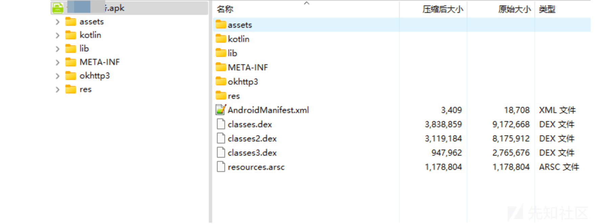
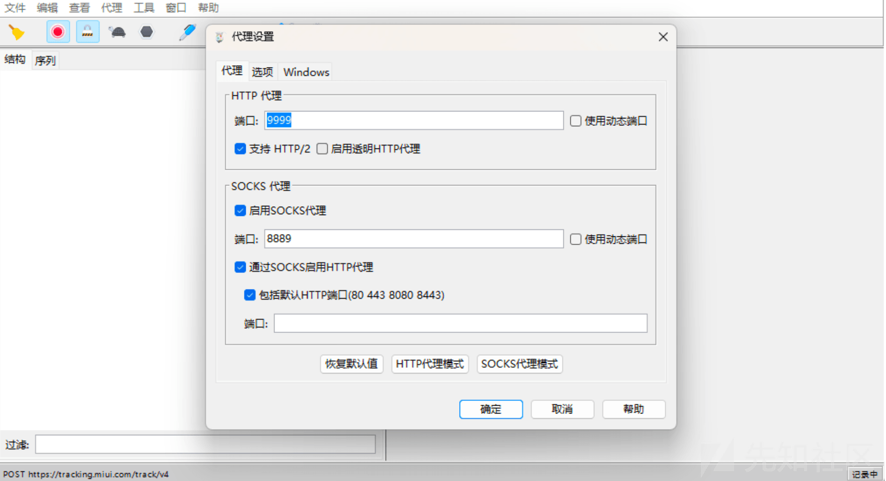

APP 测试保姆级教程

- - -

# **APP 测试保姆级教程**

## **0x1 APP 相关基础**

​ 首先需要认识 APP 是怎么构成的。APK 本身是一个 zip 压缩包，因此可以通过压缩包的方式来打开，这里介绍几个常见的结构。

> assets：这是常见的资源文件目录，通常会存放一些图片类似的静态资源，有时候也会存放 app 的证书（证书是用来干啥的，往后看就明白了），有的 APP 只是丹丹封装了 H5 网页，那么其前端代码也会存放在这个目录底下。
> 
> kotlin：这个也是比较常见的文件夹，是 APP 的一个依赖包，这里一般不需要去分析。
> 
> lib：这里是存放.so 文件的地方，.so 文件又称为动态加载库，和 windows 的 dll 文件差不多，里面也会写一些函数方法，这个文件夹也不需要挨个去看。
> 
> META-INF：不用看
> 
> okhttp3：也是一个依赖包，不需要看。
> 
> res：这里是一些 app 前端会用到的图形组件库，一般也不用看，有些时候 APP 的证书会放在里面的 raw 目录底下。
> 
> AndroidManifest.xml：这里面可以看到 APP 需要用的一些权、APP 的包名以及 APP 的主函数
> 
> classes\[n\].dex：这是 java 的二进制文件，也就是 APP 会加载的代码，这个可以反编译成 java 代码，然后分析代码
> 
> resources.arsc：这个文件通常不看，不用了解。

[](https://xzfile.aliyuncs.com/media/upload/picture/20240303143623-5aa3c1ee-d928-1.png)

​ 对以上 APP 结构有了初步的认识后，这里再简单了解一下 APP 的基础信息

> 包名：APP 开发的名称，一般是唯一的
> 
> 加固状态：这里我一般喜欢在 MT 管理器里看加固信息，个人感觉还是比较准的
> 
> 数据目录 1：这里是 APP 的数据目录，经常会用到
> 
> 数据目录 2：这里一般是辅助存放信息的，很少用到
> 
> APK 路径：这就是 APP 安装后，会将自身的安装包以及 so 文件放在这里，运行的时候会取这里的文件。

[](https://xzfile.aliyuncs.com/media/upload/picture/20240303143634-61436fd6-d928-1.png)

​ 以上就是简单学习了 APP 的基础内容，那么接下来便开始讲解如何对 APP 进行渗透测试了。

## **0x2 APP 分析阶段**

### 0x2.1 H5 套壳 APP

​ 什么是 H5 套壳 APP 呢？不懂可以再回头看一遍 APP 相关基础部分，我们可以在 assets 目录里发现有 www 目录或者该目录底下的其他目录里有 html 文件、js 文件、css 文件这种。这种的 APP 就是套壳的 H5 网页，这种我们可以学习 WebViewPP 插件动态调试 js，去官网学习即可，我也不咋用这个；不动态调试 js 也可以将这些 js 文件拖到电脑上使用 vscode 进行静态分析，拼接 API 接口参数啥的去进行测试。

### 0x2.2 脱壳

​ 拿到 APP，首先使用 MT 管理器查壳，不会的请看上一节的基础。一般我喜欢把 APP 放在 /sdcard/Download/ 目录下，这里就分两种情况了，无和有，无壳的情况下，可以用 Jadx 反编译 APP，然后查看代码就完事了。那么这里讲一下有壳的情况下怎么弄呢，有壳那就脱壳呀，好好好，第一步，看看 MT 管理器分析的是什么壳，若非最新版的企业壳（如 360 付费壳，梆梆企业壳，娜迦），只说是最新的哈，如果都不是以上最新的，这里就不去踩坑学什么 frida-dexdump 了，能脱的太少了，那么这里介绍一个：Fundex 可以通杀。使用方法也很简单，LSPosed 里找到 Fundex，搜索要目标 APP 名，勾选上，然后打开 Fundex，搜索目标 APP 名，点一下，接着打开 APP 即可**（这里需要注意的是如果有 Root 检测，需要用 magisk+shamiko 屏蔽 Root）**。若打开 APP 闪退，那么，可以试试把 Magisk 和 LSPosed 都更新到最新版再试试，如果还不信，那就扔进垃圾箱吧，哈哈哈哈哈。

​ 如果顺利打开 APP，那么可以在 MT 管理器里打开 APP 的数据目录 1，就可以看到脱出来的一些 classes\[n\].dex，这里通常看看如果某一个和 APP 安装包里的 classes.dex 大小一致，那就不要它，把剩下的拷到/sdcard/Download/目录下，然后发到电脑上等待反编译就行。**（这里需要注意一点，如果电脑上使用 Jadx 反编译不了脱出来的 dex 文件，那么需要使用 MT 管理器的 dex 修复功能，把对应的 dex 文件修复了再反编译，这个功能是收费的哦，需要买 MT 管理器的会员）**

​ 那么这里就介绍完脱壳部分了。

### 0x2.3 抓包

​ 既然我们是脚本小子~. ~ ，那么用完珍惜大佬的 Fundex 脱壳成功后，最重要的一点当然是抓包了，这里抓包也分好几种情况，且听我一一道来。

#### 0x2.3.1 正常抓包

​ 如果你在测试的时候，运气非常好，碰到一个抓包很顺利的 APP，那么恭喜你。

​ 什么情况算得上正常抓包呢？这里同样分两点，WIFI 代理和 VPN 代理。

> 在使用这俩代理之前，需要安装证书，Burp 证书、Charles 证书、Yakit 证书、小黄鸟证书等；前三者已经够了，面具需要刷入 Move Certificates 模块，然后在系统设置里搜索证书，安装 CA 证书就行，安装完了一定要重启手机。
> 
> WIFI 代理：在 WIFI 那里能设置，就不叭叭了
> 
> VPN 代理：用 ProxyDroid 就行

​ WIFI 代理若是抓不到，就用 VPN 代理，若还是抓不到，推荐使用 Yakit 代理流量给 Burp（特殊时可以试试勾选国密劫持）

[](https://xzfile.aliyuncs.com/media/upload/picture/20240303143649-69e965c8-d928-1.png)

​ 同理可以使用 Charles 代理给 Burp

[](https://xzfile.aliyuncs.com/media/upload/picture/20240303143700-70647e56-d928-1.png)

[](https://xzfile.aliyuncs.com/media/upload/picture/20240303143709-7616c0c0-d928-1.png)

​ 若还是抓不到，也可以试试 Socks5 代理，在 ProxyDroid 里可以设置，同理 Charles 和 Yakit 均可接收 Socks5 流量。

#### 0x2.3.2 SSL 单向校验

​ 讲完正常抓包的流程，这里就不得不讲非正常抓包了，首先是 SSL 单向验证，那么，什么是 SSL 呢？其实 SSL 就是在 http 上加了个证书，也就是所谓的 https。如果抓包的时候发现抓不到包，可以试试绕过 SSL 单向验证，这里推荐两个插件：TrustMeAlready 和 SSLUnpinning。通常这俩我会用前面那个勾选目标 APP，无效的话我会俩都勾选目标 APP，若还是无效的话，可以试试 frida 的 sslunpinning 脚本**（需要用的时候网上自行搜索，一般那俩插件都能解决，并且 frida 这个脚本还不一定能解决）**。

#### 0x2.3.3 双向校验

​ 有单向校验，那么就一定会有双向校验了，双向校验的原理其实就是 APP 和服务器之间用一个证书来绑定，二者只能互相信任，其它任何设备，任何人要跟他说话都是不可信的。怎么识别双向校验呢？首先映入眼帘的应该是抓包的时候返回 400 状态码，并且能在请求包里看到 No required SSL certificate was sent

[](https://xzfile.aliyuncs.com/media/upload/picture/20240303143722-7db472b4-d928-1.png)

#### 0x2.3.3 不走 HTTP 走 Socket

​ 说实话，这么恶心的 APP 我确实遇到过一次，网上也有人遇到过这样的 APP，他运气挺好，只需要 HOOK 一下是否走 HTTP 报文为是就完事了。。。。。那么这里讲一下我们遇到这种 APP 怎么办？Frida RPC 了解一下，这里就不多说了哈哈哈哈，网上也有文章：[https://www.adminxe.com/4367.html](https://www.adminxe.com/4367.html)

​ 当然，第二部分 APP 分析阶段抓包部分若仍然抓不到，那么也可以尝试 Frida RPC，有时候连加解密的地方都可以省略，缺点就是没法爆破。。。。

## 0x3 加解密分析

​ 这是一个比较大的板块，需要会的东西比较多，最重要的就是代码阅读能力以及函数调用顺序的理解程度，是否认识形参和实参之间的联系。

​ 如果在抓包的时候遇到了密文，就是那种 base64 编码的或者 hex 编码的一堆看不懂的字符串，那么这里就认为它是进行了加密，我们需要去分析它的加密过程，然后去模拟这个加密过程，接着才能去继续渗透测试。

​ 前面我们已经讲过了脱壳部分以及 H5 套壳的 APP 了，第二者可以分析 js 里的加密流程，前者可以使用 Jadx 分析脱出来的 dex 文件反编译得到的 Java 代码，寻找加密过程，这里讲一下 x 按键，点击对应函数，按下 x 按键可以查找谁调用了这个函数，Jadx 更多功能可以试试右键某一处你想看的函数名试试（比如生成 Frida 代码这个功能就非常好用）。

​ 这里有几个方式了解一下：

> 全局搜索 encrypt，然后挨个地方分析
> 
> 搜索抓到包的 url 字段，然后分析周围代码，寻找加密方法
> 
> 搜索特征字符串，比如抓到的包里请求包里是这样的：encStr=xxxxxxx，那么我们就可以搜索 encStr，然后分析它是怎么运算得到的即可

​ 加密方法常见的有：

> 对称加密：AES、SM4、DES、RC4、Rabbit，常用的是前三者
> 
> 非对称加密：RSA、SM2
> 
> Hash 加密：MD5、SM3、SHA256....

​ 如果有防篡改**（相同数据包只能请求一次，请求第二次无效）**，那么也是同样的思路去分析防篡改的字段是怎么生成的，随后模拟一遍即可。

## 0x4 Frida 讲解

​ Frida 是一个可以用来动态 Hook 的工具，通常分为客户端和服务端这两种，服务端装在手机里，通常放在/data/local/tmp/目录下，需要 su 之后再启动 frida 服务；客户端装在 windows 电脑上，用如下两条指令**(需要确保手机和电脑上的 frida 版本一致，推荐都是最新版即可)**：

```plain
pip install frida
pip install frida-tools
```

​ 这里推荐一下 hluda，是 frida 一个去特征版本，可以过部分壳的检测。

​ frida 一个非常简单的代码如下：

```plain
Java.perform(function(){
    console.log("frida 注入成功")

    let Response = Java.use("com.xxx.EncryptAESJsonHandler");
    Response["encryptJSon"].implementation = function () {
        console.log(`Response.body is called`);
        let result = this["encryptJSon"]();
        console.log(`Response.body result=${result}`);
        return result;
    };
})
```

​ 仔细看以上代码，这里逐个讲解，其实就是 js 代码，保存为 xxx.js 即可。首先必须有 Java.perform()，然后这个里面放上一个 function，这里面全是 js 的写法。然后不一样的在于 Java.use("com.xxx.EncryptAESJsonHandler") 是使用 APP 里的某个类，然后 Response\["encryptJSon"\]里的 encryptJSon 是前面那个类里的函数，我们使用 implementation 对其进行重载，然后有几个参数就写几个参数就行，最后记得返回的时候，要执行一下本身这个函数。

​ 以上这个过程其实 Jadx 里右键生成 Frida 代码就都有了，只需要替换中间代码部分即可。

[](https://xzfile.aliyuncs.com/media/upload/picture/20240303143736-85d10548-d928-1.png)

​ 启动方法也很简单，首先 USB 连接手机和电脑

​ 启动服务端（记得给 frida 或 hluda 可执行权限 chmod +x hluda）：

```plain
adb shell
su
/data/local/tmp/hluda
```

​ 客户端：

```plain
frida -U -f com.xxx.xxxx -l xxx.js
```

> \-U 代表 USB 链接
> 
> \-f 后面跟上需要启动的 APP 包名
> 
> \-l 后面跟上要执行的脚本

​ 学习完 Frida 的基础部分，我们可以用其来获取我们反编译的 APP 在某个函数执行时的形参以及结果，这样我们可以更快获得加解密的 key 等信息。如果文章内提到的一些插件或者脚本你没有，请在 github 或者百度里搜索下载，最后，APP 渗透讲完了，Good Luck。
