# APT 组织“蔓灵花“RPC”后门武器样本逆向分析 - 先知社区

APT 组织“蔓灵花“RPC”后门武器样本逆向分析

- - -

# 一、前言

此篇是“APT 组织“蔓灵花”恶意邮件附件 5 种手法分析”（[https://xz.aliyun.com/t/13789）](https://xz.aliyun.com/t/13789%EF%BC%89) 的续篇，前文介绍了恶意附件执行的常见手法，包括：

-   恶意“.chm”文件投放
-   恶意"DDE"隐藏域代码执行
-   “.ppt”文件 PowerPoint 单击鼠标事件
-   恶意宏文档  
    \-公式编辑器漏洞利用  
    本篇继续介绍恶意附件的后续远控武器“ORPCBackdoor”，该武器样本于 2023 年 5 月被首次曝光。文章记录分析流程较为详尽，如果你也在分析学习此样本，本文会很有帮助。  
    \# 二、样本概述  
    \## 1.样本执行流程

[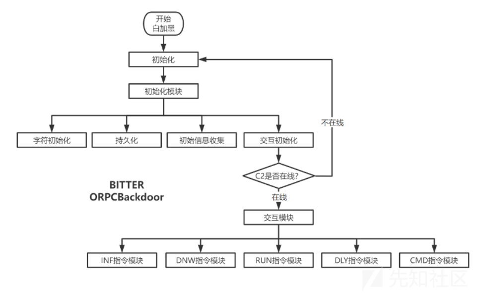](https://xzfile.aliyuncs.com/media/upload/picture/20240301093532-fe4acacc-d76b-1.png)

## 2.样本特性

-   使用 dll 劫持技术。白加黑有一定的免杀效果。
    
-   交互初始化和持久化均通过文件是否存在，来判断流程是否重复执行。
    
-   系统信息搜集罕见的详尽。
    
-   通过多层 if-else 来完成指定指令功能。而不是 switch..case..
    
-   通过远程过程调用（RPC）完成通讯。不再使用从前 socket、http 等。
    
-   字符初始化特殊。内置的关键字符以 HEX 转码形式硬编码于样本中，使用时解码。包括路径、文件名、指令等。  
    \## 3.远控指令功能  
    功能数量不多，但该有的都有了。
    
-   ID 指令，保存服务端生成 ID
    
-   INF 指令，上传系统基本信息
    
-   RUN 指令，文件执行
    
-   DLY 指令，休眠指令
    
-   CMD 指令，执行 shell
    
-   DWN 指令，文件下载  
    \# 三、样本分析  
    \## 1.初始化  
    “MSOutlookServices.exe”执行会加载和执行包含恶意程序的动态链接库“OLMAPI32.dll”，exe 文件本身不包含恶意功能。
    

[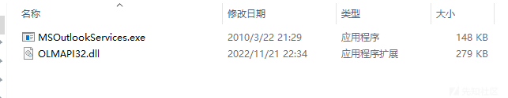](https://xzfile.aliyuncs.com/media/upload/picture/20240301093751-5102105e-d76c-1.png)  
从“OLMAPI32.dll”导出函数情况来看，”蔓灵花“组织使用了 dll 劫持技术，以白加黑的形式，在安全的”version.dll“中封装了恶意程序。

安全的”version.dll“（左）与包含恶意程序“OLMAPI32.dll”（右）导出函数结构对比如图。

[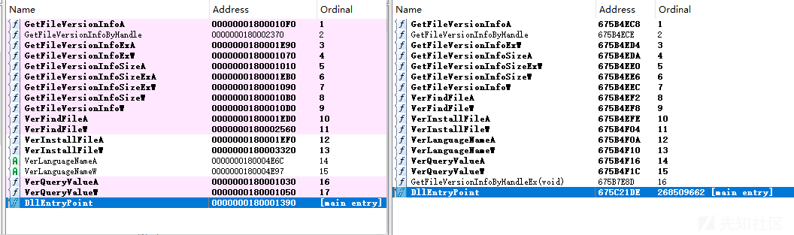](https://xzfile.aliyuncs.com/media/upload/picture/20240301093801-56f908fa-d76c-1.png)  
恶意程序包含在 GetFileVersionInfoByHandleEx()、DllMain() 两个函数中。DllMain() 运行即会调用 GetFileVersionInfoByHandleEx()，主要的恶意功能模块也在其中。

[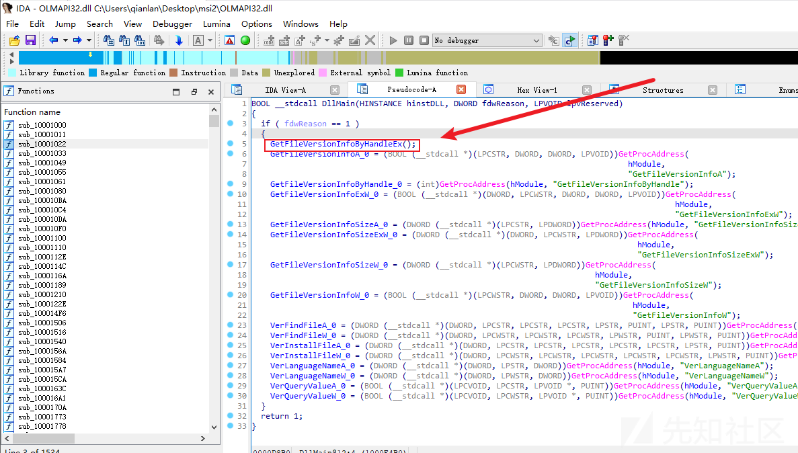](https://xzfile.aliyuncs.com/media/upload/picture/20240301093811-5d25b4bc-d76c-1.png)

## 2.持久化

开始执行恶意功能，首先 ORPCBackdoor 通过当前路径“ts.dat”文件是否存在，防止多次执行持久化操作。

样本内字符硬编码以 hex 形式存储在文件中，后续字符获取也常见于此方法，包括路径、文件名、远控指令等。

[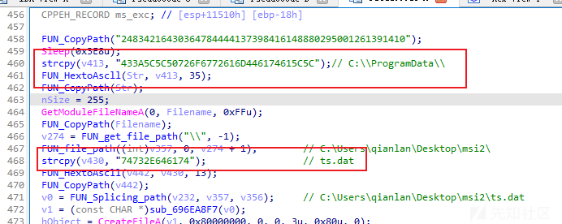](https://xzfile.aliyuncs.com/media/upload/picture/20240301093827-66ace258-d76c-1.png)  
进入功能函数，在当前路径查看文件“ts.dat”是否存在，如果不存在则休眠 1 分钟。

[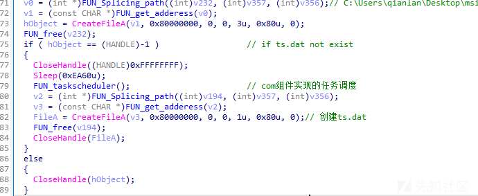](https://xzfile.aliyuncs.com/media/upload/picture/20240301093837-6cae0736-d76c-1.png)  
休眠结束创建任务调度流程，初始化 COM 组件后调用 TaskScheduler CLSID 创建计划任务“Microsoft Update”，每日零时执行“MSOutlookServices.exe”。

[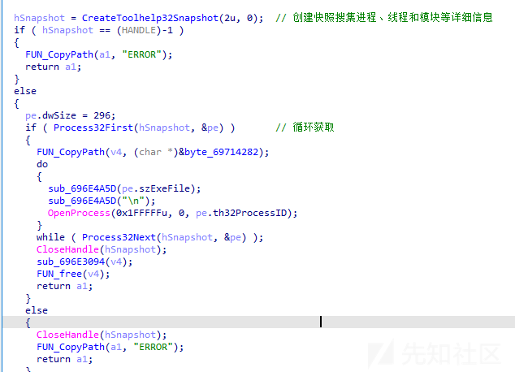](https://xzfile.aliyuncs.com/media/upload/picture/20240301093845-7151da88-d76c-1.png)  
任务结束后在当前路径创建“ts.dat”

## 3.详尽的系统信息搜集

样本继续执行，调用 CreateToolhelp32Snapshot、Process32First 函数获取系统中的进程、线程和模块等详细信息。

[](https://xzfile.aliyuncs.com/media/upload/picture/20240301093949-9792cbc6-d76c-1.png)  
动态调试查看获取状态。

[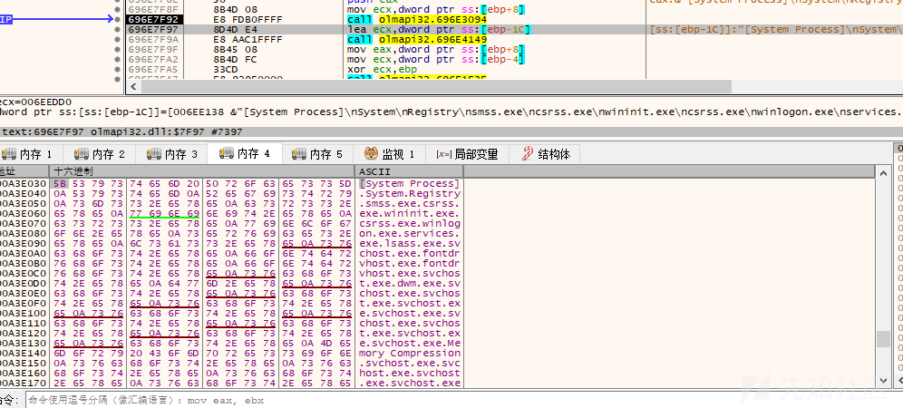](https://xzfile.aliyuncs.com/media/upload/picture/20240301093956-9bde3d46-d76c-1.png)  
后续一个函数调用大量的 WindowsApi 和注册表读取等形式详尽的搜集了系统基本信息，并格式化和标注了搜集信息类型。

[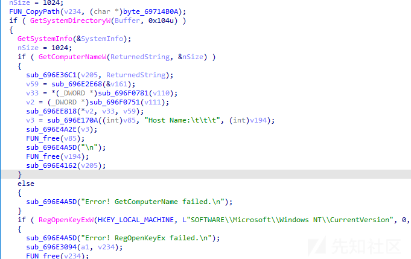](https://xzfile.aliyuncs.com/media/upload/picture/20240301094009-a34a5876-d76c-1.png)  
动态调试查看获取状态。

[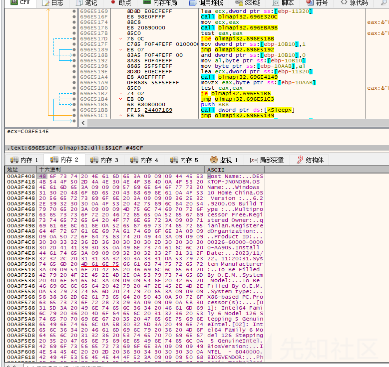](https://xzfile.aliyuncs.com/media/upload/picture/20240301094028-af25d990-d76c-1.png)

## 4.远控指令初始化

样本继续执行，初始化服务端远控指令。

[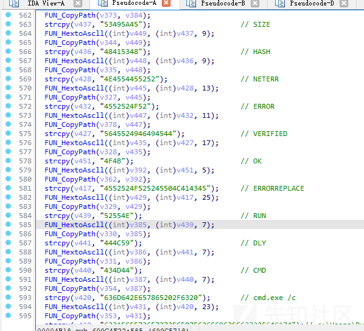](https://xzfile.aliyuncs.com/media/upload/picture/20240301094048-ba9f3b0e-d76c-1.png)

## 5.与服务端通讯初始化

交互初始化也是判断路径"C:\\ProgramData\\$cache.dat"文件是否存在，防止与服务端同时多进程交互。（同时只存在一个通讯会话）。

如果文件不存在将创建“$cache.dat”并且初始化 RPC 调用，初始化 pct\_pi\_ncacn、ncacn\_ip\_tcp 两种远程过程调用（RPC）的协议。APT 组织使用的域名“outlook-services.ddns.net”硬编码在这里。调用 RpcStringBindingComposeA 构建 RPC 绑定字符串。

```plain
ncacn_ip_tcp:outlook-services.ddns.net[443]
```

[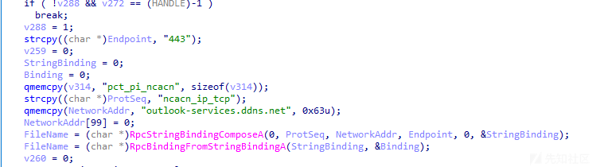](https://xzfile.aliyuncs.com/media/upload/picture/20240301094144-dc11644c-d76c-1.png)  
没有服务端可以简单写一个 RPC 服务端，改好 hosts 表，捕获一个简单的初始化通讯。

[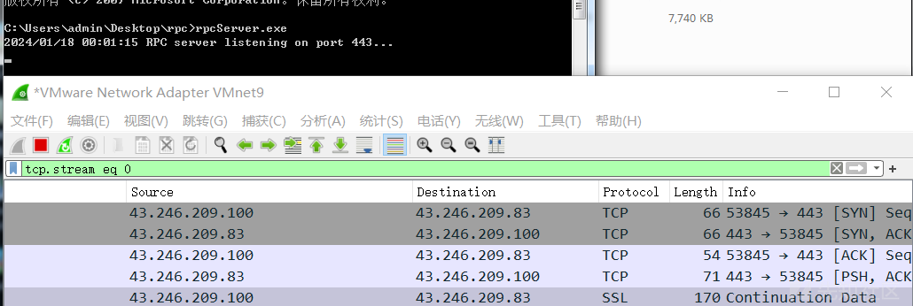](https://xzfile.aliyuncs.com/media/upload/picture/20240301094152-e0b9e492-d76c-1.png)  
如果在尝试 RPC 调用后服务端无数据返回则休眠 5 分钟后继续尝试，当服务端返回命令后进入交互模块。

## 6.RPC 通讯

通讯采用远程过程调用（RPC）协议，通过 rpcrt4.dll 中的导出函数 NdrClientCall2() 完成与服务端的通讯。

[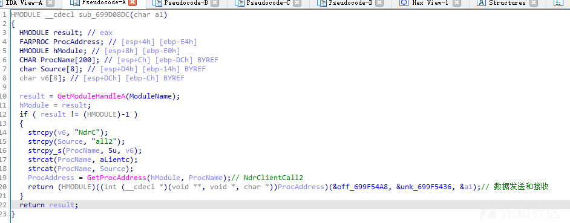](https://xzfile.aliyuncs.com/media/upload/picture/20240301094229-f719df76-d76c-1.png)

## 7.指令功能模块

### 7.1 ID 指令，获取 ID

判断“c:\\ProgramData\\$tmp.txt”是否存在，若存在则删除，然后重新创建$tmp.txt。

[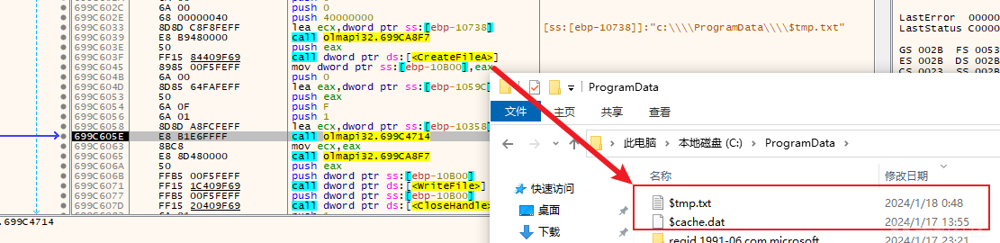](https://xzfile.aliyuncs.com/media/upload/picture/20240301094315-12572db6-d76d-1.png)  
随后在$tmp.txt 文件中写入从服务端获取的 ID 值，此 ID 值后续在客户端别无他用。

### 7.2 INF 指令，上传系统基本信息

读取此前采集的详细的系统基本信息，并且上传至受控端。

[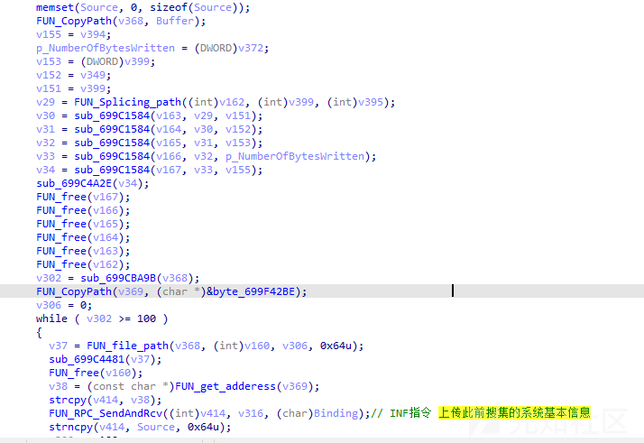](https://xzfile.aliyuncs.com/media/upload/picture/20240301094346-25067692-d76d-1.png)  
上传的基本信息在内存情况如下。

[](https://xzfile.aliyuncs.com/media/upload/picture/20240301094357-2b7d89de-d76d-1.png)

### 7.3 DWN 指令，文件下载

DWN 指令功能为下载文件，根据对代码的分析，DWN 功能模块写的十分完善，包括但不限于采集和回传报错详细、下载状态等。

[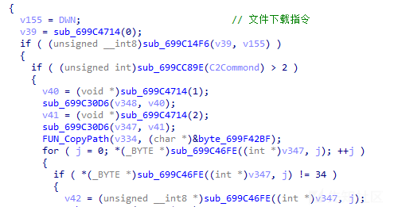](https://xzfile.aliyuncs.com/media/upload/picture/20240301094425-3c34b1bc-d76d-1.png)

### 7.4 RUN 指令，指定文件执行

调用 Windows API WinExecAPI 执行文件，返回执行状态。

[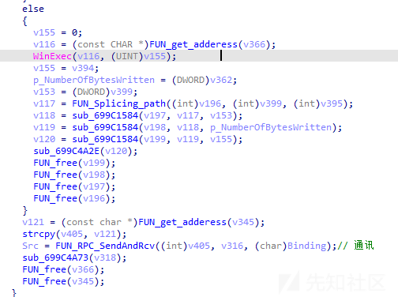](https://xzfile.aliyuncs.com/media/upload/picture/20240301094444-47b1923a-d76d-1.png)

### 7.5 DLY 指令，休眠指令

从服务端获取一个时长，做 sleep 操作再运行。

[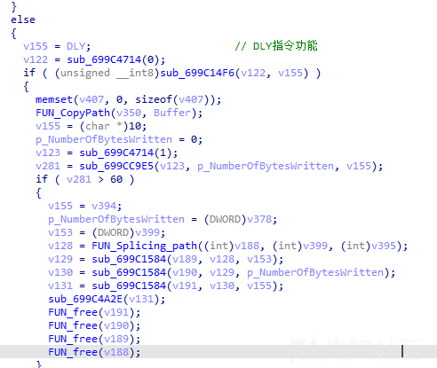](https://xzfile.aliyuncs.com/media/upload/picture/20240301094502-51f25a9a-d76d-1.png)

### 7.6 CMD 指令，执行 shell

获取从服务端下发的 Shell 指令后进行指令拼接，拼接格式为 cmd.exe /c |服务端下发的指令|>> c:\\Users\\Public\\cr.dat。

```plain
cmd.exe /c systeminfo >> c:\Users\Public\cr.dat
cmd.exe /c whoami >> c:\Users\Public\cr.dat
```

随后调用 WinExec()API 执行，执行完成后将 cr.dat 的内容发送至服务端，后续删除 cr.dat 文件。

[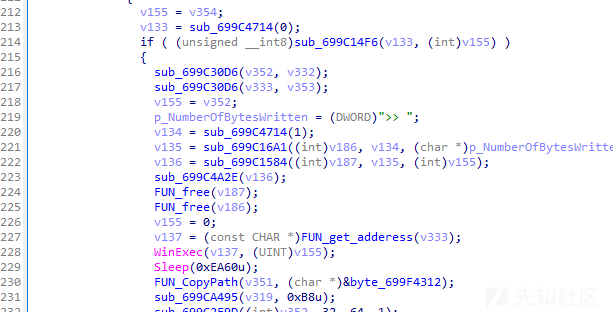](https://xzfile.aliyuncs.com/media/upload/picture/20240301094545-6be85030-d76d-1.png)  
动态调试查看命令拼接。

[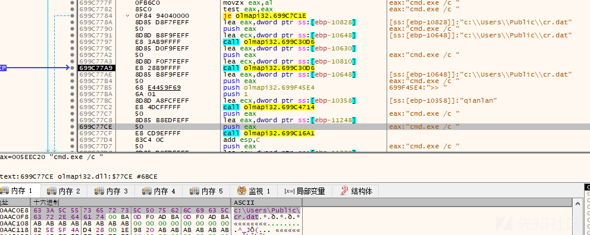](https://xzfile.aliyuncs.com/media/upload/picture/20240301094612-7ba4e2a4-d76d-1.png)  
动态调试查看调用 WinExec()API 执行该条执行。

[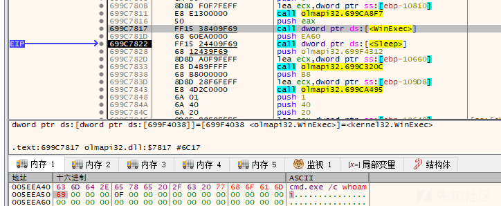](https://xzfile.aliyuncs.com/media/upload/picture/20240301094618-7fb9123e-d76d-1.png)
