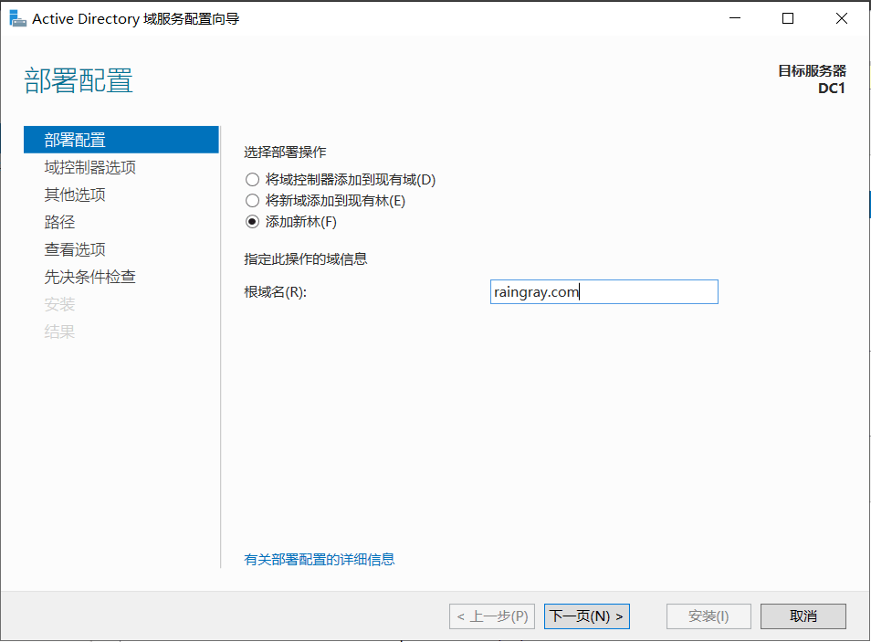
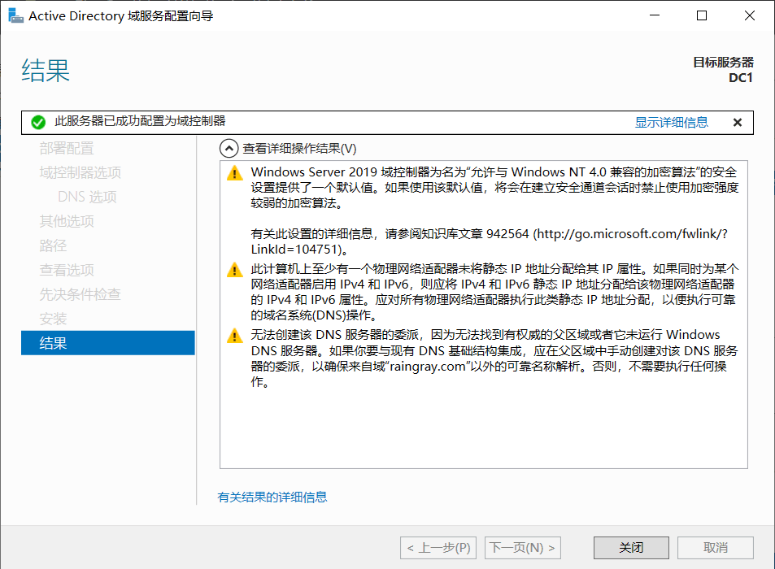
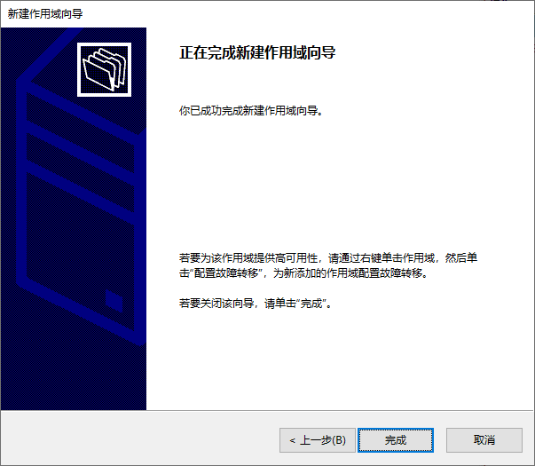
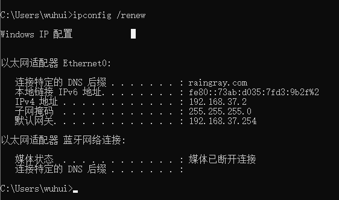
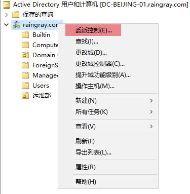
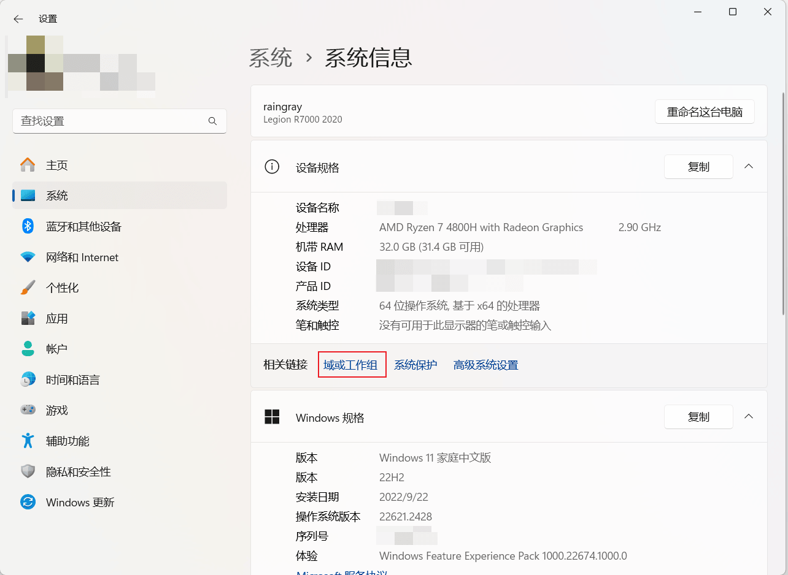

# [Active Directory 基本使用](https://www.raingray.com/archives/4645.html)

## 目录

-   [目录](#%E7%9B%AE%E5%BD%95)
-   [Active Directory 实验室搭建](#Active+Directory+%E5%AE%9E%E9%AA%8C%E5%AE%A4%E6%90%AD%E5%BB%BA)
    -   [Windows Server 安装](#Windows+Server+%E5%AE%89%E8%A3%85)
    -   [AD DS 安装](#AD+DS+%E5%AE%89%E8%A3%85)
    -   [网络规划](#%E7%BD%91%E7%BB%9C%E8%A7%84%E5%88%92)
    -   [将机器加入域](#%E5%B0%86%E6%9C%BA%E5%99%A8%E5%8A%A0%E5%85%A5%E5%9F%9F)
-   [Active Directory 基本使用](#Active+Directory+%E5%9F%BA%E6%9C%AC%E4%BD%BF%E7%94%A8)
    -   [User⚒️](#User%E2%9A%92%EF%B8%8F)
        -   [SPN](#SPN)
    -   [Group⚒️](#Group%E2%9A%92%EF%B8%8F)
    -   [OU⚒️](#OU%E2%9A%92%EF%B8%8F)
    -   [GPO⚒️](#GPO%E2%9A%92%EF%B8%8F)
    -   [ACL⚒️](#ACL%E2%9A%92%EF%B8%8F)
    -   [ADDS Delegation](#ADDS+Delegation)
    -   [Kerberos Delegation⚒️](#Kerberos+Delegation%E2%9A%92%EF%B8%8F)
        -   [Unconstrained Delegation](#Unconstrained+Delegation)
        -   [Constrained Delegation](#Constrained+Delegation)
        -   [Resource-Based Constrained Delegation](#Resource-Based+Constrained+Delegation)
    -   [Domain Trusts⚒️](#Domain+Trusts%E2%9A%92%EF%B8%8F)
        -   [Tree](#Tree)
        -   [Forest](#Forest)
    -   [Certificate Services⚒️](#Certificate+Services%E2%9A%92%EF%B8%8F)
-   [Active Directory Search Technology](#Active+Directory+Search+Technology)
-   [参考资料](#%E5%8F%82%E8%80%83%E8%B5%84%E6%96%99)

这篇文章的出现是为了学习 AD 域渗透，而前期熟悉环境和搭建 Home Lab 用的，仅作记录。

## Active Directory 实验室搭建

### Windows Server 安装

Window Server 配置：

-   4Gb 内存
    
-   2 处理器，2 核心
    
-   60 Gb 硬盘
    

安装方式有完整图形化桌面和纯靠命令行配置服务器两种方式，建议看下面的描述信息来选择。

  


> **Installation options:**
> 
> -   **Server Core:** This is the recommended installation option. It’s a smaller installation that includes the core components of Windows Server and supports all server roles but does not include a local graphical user interface (GUI). It is used for “headless” deployments which are managed remotely through Windows Admin Center, PowerShell, or other server management tools.
> -   **Server with Desktop Experience:** This is the complete installation and includes a full GUI for customers who prefer this option.
> 
> [Windows Server 2019 | Microsoft Evaluation Center](https://www.microsoft.com/zh-cn/evalcenter/evaluate-windows-server-2019)

其中 Windows Server Standard 和 Datacenter 区别在哪里，详细的功能对比可以看[Windows Server 2019 标准版和数据中心版的比较](https://learn.microsoft.com/en-us/windows-server/get-started/editions-comparison-windows-server-2019?tabs=full-comparison)文章，简单来说几乎没差别，数据中心版本只是多了 Hyper-V、SDN 等功能，没用到这些功能可以安标准版。

系统安装完成后建立 Windows Server 模板，当我们想创建多个 Server 可以直接通过链接的方式克隆，快速创建机器占用硬盘也小。

1.  Server 安装完关机拍摄快照。
2.  开启“编辑虚拟机设置 -> 选项 -> 高级 -> 启用模板模式 (用于克隆)(T)”。是为了防止克隆时误选成克隆子虚拟机中的当前状态。但是需要注意的，这个模板机器快照被删除了，后续所有克隆过此快照的机器都无法正常运行。  
    
3.  新建 Machine Template 文件夹，将 Windows Server 虚拟机放进去，重命名未 Base Windows Server 2019，做好分类。
    
    ```plaintext
    我的计算机
    └─Active Directory Lab
     ├─Client
     │      Base Windows 10 x64 的克隆
     │      Windows 10 x64 WorkStation
     │
     ├─Machine Template
     │      Base Windows 10 x64
     │      Base Windows Server 2019
     │
     └─Server
             raingray.com Domain Controller
    ```
    

为了方便管理账户，可以在 Vmware 机器描述中添加账户信息，或者是单独维护一张账户表格。

### AD DS 安装

从模板中使用“创建链接克隆 (L)”，避免虚拟机文件占用硬盘过大。取名为 raingray.com Domain Controller


安装完 Windows Server 后使用添加角色和功能，为 Server 添加 AD 域服务。


下一页。


选中当前服务器，DC1 是当前服务器的主机名。为了更有辨识度可以设置为“类型 - 城市 - 编号”，比如 DC-BEIJING-01，就是北京的域控 01。选中后，下一页。


添加“Active Directory 域服务”——英文是 Active Directory Domain Services 功能。


下一页。


下一页。


一些提示信息。下一页。


最后给出安装的清单，让你确认有没选错，没问题我们就点安装，如果有选错功能请返回上一步取消选择。

其中还有个复选框，告诉你在安装过程中如果需要重启，就不提示直接自动重启，这在第一次安装过程中可以省点心，如果是服务器还有运行其他服务，最好不要勾选，贸然重启可能导致服务中断。


安装完成后，会在面板上看到 AD DS。


进入域配置导航有三种路径。第一种，在安装完成时就直接点击“将此服务器提升为域控制器”。


第二个找右上角的 Flag 进。


第三个是进入 AD DS 面板详情中进。


不管选择哪种最终都进入到[配置向导](https://learn.microsoft.com/zh-cn/windows-server/identity/ad-ds/deploy/ad-ds-installation-and-removal-wizard-page-descriptions#BKMK_ViewInstallOptionsPage)中。由于是配置第一个域控，选择添加新林。其他的选项是在多域控的情况下才会选择，这里暂时忽略。在根域名就填写企业域名即可，方便标识这是哪个企业。



域控制器选项中，[林功能级别和域功能级别](https://learn.microsoft.com/zh-cn/windows-server/identity/ad-ds/active-directory-functional-levels)可以选择 Windows Server 2016 版本或者其他版本功能，不是用来限制你加入域的机器系统版本，含义是你的域控可以使用 Windows Server 2016 版本的功能，意味着你要使用 Windows Server 2016 功能，安装域的时候就不能安装低于这个 Server 版本。

域名系统服务器是。这个 DSRM 密码是，就是 Active Directory 安全模式，用于恢复数据用的安全密码。


DNS 选项，忽略，可以下一步。

  


其他选项限制 NetBIOS 域名被占用（域名是 raingray.com，NetBIOS 应该是 raingray，不过被占用了），自动给了个新名字。NetBIOS 是 Windows 内网之间相互用来通信的协议，每台计算机都有一个名字，通过名字来做唯一标识通信。


路径是用来存放数据的，数据库文件夹是存放域中的所有用户账户，日志则是域运行的日志，SYSVOL 则是域用来同步信息的文件夹，比如下发策略，或者文件，都是从这个目录读取的。


查看选项是告诉你选的配置，让你确认有没有用。


甚至给了你一个 PowerShell 脚本用来自动化安装。

```powershell
#
# 用于 AD DS 部署的 Windows PowerShell 脚本
#

Import-Module ADDSDeployment
Install-ADDSForest `
-CreateDnsDelegation:$false `
-DatabasePath "C:\Windows\NTDS" `
-DomainMode "WinThreshold" `
-DomainName "raingray.com" `
-DomainNetbiosName "RAINGRAY0" `
-ForestMode "WinThreshold" `
-InstallDns:$true `
-LogPath "C:\Windows\NTDS" `
-NoRebootOnCompletion:$false `
-SysvolPath "C:\Windows\SYSVOL" `
-Force:$true
```

先决条件检查，是看符不符合安装条件。没有任何问题就安装。

  


安装完成会自动重启。



重启后登录你会发现，已经使用域登录。


并且域控的 DNS 自动改成 127.0.0.1。

```plaintext
C:\Users\Administrator>ipconfig /all

Windows IP 配置

   主机名  . . . . . . . . . . . . . : WIN-08J3USI7CCN
   主 DNS 后缀 . . . . . . . . . . . : raingray.com
   节点类型  . . . . . . . . . . . . : 混合
   IP 路由已启用 . . . . . . . . . . : 否
   WINS 代理已启用 . . . . . . . . . : 否
   DNS 后缀搜索列表  . . . . . . . . : raingray.com
                                       localdomain

以太网适配器 Ethernet0:

   连接特定的 DNS 后缀 . . . . . . . : localdomain
   描述. . . . . . . . . . . . . . . : Intel(R) 82574L Gigabit Network Connection
   物理地址. . . . . . . . . . . . . : 00-0C-29-38-33-CF
   DHCP 已启用 . . . . . . . . . . . : 是
   自动配置已启用. . . . . . . . . . : 是
   本地链接 IPv6 地址. . . . . . . . : fe80::304d:c86f:1845:4d4%6(首选)
   IPv4 地址 . . . . . . . . . . . . : 192.168.52.133(首选)
   子网掩码  . . . . . . . . . . . . : 255.255.255.0
   获得租约的时间  . . . . . . . . . : 2023年10月16日 11:10:53
   租约过期的时间  . . . . . . . . . : 2023年10月16日 11:40:53
   默认网关. . . . . . . . . . . . . : 192.168.52.2
   DHCP 服务器 . . . . . . . . . . . : 192.168.52.254
   DHCPv6 IAID . . . . . . . . . . . : 100666409
   DHCPv6 客户端 DUID  . . . . . . . : 00-01-00-01-2C-BE-48-11-00-0C-29-38-33-CF
   DNS 服务器  . . . . . . . . . . . : ::1
                                       127.0.0.1
   主 WINS 服务器  . . . . . . . . . : 192.168.52.2
   TCPIP 上的 NetBIOS  . . . . . . . : 已启用
```

### 网络规划

为了模拟真实环境中的网络状态，这里将简单规划下网络为内网的办公网段和能上外网的上网网段。

一、办公网段

添加主机模式 VMnet18 重命名为 Intranet 模拟内网，规划网段 192.168.37.0/24，IP 地址可用范围是 192.168.37.1-192.168.37.254。在表中也规划了 IP 如何分配，这给后面配置 DHCP 作参考。

| IP  | 使用者 | 说明  |
| --- | --- | --- |
| 192.168.37.1 | DC-BEIJING-01 | 域控 -01 |
| 192.168.37.254 | DHCP | 网关  |
| 192.168.37.244-192.168.37.253 | 保留地址 | 后续给其他设备使用 |

需要注意 Vmware 中的 Intranet 需要关闭 VMware 的 DHCP 服务，后面自行搭建 DHCP 服务分配地址。


二、上网网段

使用默认 NAT 模式 VMnet8 模拟上网区域。网段为 192.168.52.0/24，默认使用 VMware 的 DHCP 服务分配地址，范围是 192.168.52.128-192.168.52.254

三、在 ADDS 上搭建 DHCP 服务

域控虚拟机网络设置为主机模式 Intranet，根据办公网段设置如下静态 IP。

```plaintext
IP Address: 192.168.37.1
NetMask: 255.255.255.0
Gatway: 192.168.37.254
```

如果配置完查询 IP 发现首选 IP 是 169.254.1.193，而我们设置的是显示复制，这说明地址已经被使用产生冲突。

```plaintext
C:\Users\Administrator>ipconfig /all

Windows IP 配置

   主机名  . . . . . . . . . . . . . : DC-BEIJING-01
   主 DNS 后缀 . . . . . . . . . . . : raingray.com
   节点类型  . . . . . . . . . . . . : 混合
   IP 路由已启用 . . . . . . . . . . : 否
   WINS 代理已启用 . . . . . . . . . : 否
   DNS 后缀搜索列表  . . . . . . . . : raingray.com

以太网适配器 Ethernet0:

   连接特定的 DNS 后缀 . . . . . . . :
   描述. . . . . . . . . . . . . . . : Intel(R) 82574L Gigabit Network Connection
   物理地址. . . . . . . . . . . . . : 00-0C-29-B2-67-76
   DHCP 已启用 . . . . . . . . . . . : 否
   自动配置已启用. . . . . . . . . . : 是
   本地链接 IPv6 地址. . . . . . . . : fe80::3402:329a:64e1:b0f3%15(首选)
   自动配置 IPv4 地址  . . . . . . . : 169.254.176.243(首选)
   子网掩码  . . . . . . . . . . . . : 255.255.0.0
   IPv4 地址 . . . . . . . . . . . . : 192.168.37.1(复制)
   子网掩码  . . . . . . . . . . . . : 255.255.255.0
   默认网关. . . . . . . . . . . . . : 192.168.37.254
   DHCPv6 IAID . . . . . . . . . . . : 100666409
   DHCPv6 客户端 DUID  . . . . . . . : 00-01-00-01-2C-F5-FE-B1-00-0C-29-B2-67-76
   DNS 服务器  . . . . . . . . . . . : ::1
                                       127.0.0.1
   TCPIP 上的 NetBIOS  . . . . . . . : 已启用
```

这个原因也许是因为 Intranet 的虚拟网卡 DHCP 服务默认占用 192.168.37.1。就算没开启 DHCP 也占用。


需要更改下虚拟网卡的网段，最后重启 ADDS 机器网卡即可解决。


搭建 DHCP 服务，让所有内网办公机器自动获取 IP，需要添加 DHCP 角色。


直接勾选自动重启复选框，自动完成安装。


安装完成后配置 DHCP。


这个配置向导说会创建 DHCP Administrators、DHCP Users 两个本地用户组。下一步。


这里是要使用域管理员做授权，这里的授权只有在 Windows Server 加入域或者启用的 ADDS 才会出现，我们这是在 ADDS 服务器中搭建 DHCP，所以才会出现，在工作组中不会有此提示。

ADDS 中的 [DHCP 授权](https://learn.microsoft.com/en-us/windows-server/networking/technologies/dhcp/quickstart-install-configure-dhcp-server?tabs=powershell#authorize-the-dhcp-server-in-active-directory)，是防止这台 DHCP 随便收到客户端的广播，就发放 IP 地址导致网络问题，就自己在发 IP 前向 ADDS 查询自己的 IP 是不是在授权列表中，不在就不发 IP。


安装完成提示要手动重启 DHCP 服务。


在服务器管理器中找到 DHCP 右键重启。或者根据图中服务名称到 services.msc 找 DHCP Server 重启，不然命令重启也行。


接下来打开“服务器管理器 -> 工具 (T) -> DHCP”，对 IPv4 右键新建作用域，去分配客户端自动获取的 DNS、Gateway、NetMask、IP。

输入作用域名称，就是给这个 IP 范围做个标记和备注，后续查询方便知道这个段分配给谁。下一步。


IP 地址范围是指定 DHCP 能够获取的网段，上面是网段，下面是子网掩码。这里根据前面网络规划的地址填写即可。下一步。


这里是设置 DHCP 分配 IP 时要排除哪些 IP。这里我写了网关（192.168.37.254）、ADDS（192.168.37.1）和保留地址（192.168.37.244-192.168.37.253）。下一步


IP 地址租用期限，这里默认 8 天即可，到期让它自动续，只是期限较短一台设备重新获取 IP 有可能地址发生变化。


配置 DHCP 选项，就是 Gateway 和 DNS。

  


DNS 这里由于只是域内的 DHCP 服务，就填的 ADDS 的 DNS 地址。添加时会验证验证服务是不是可用，由于刚配置静态 IP 无法解析到 IP，直接忽略添加即可。


WINS 服务是 NetBIOS 名称和对应的 IP 地址解析服务，这里没有 WINS 服务，忽略。下一步


一切配置完直接启用。

  


这里启动客户端机器，自动广播获取网络配置信息，这里主动获取成功。



回到 DHCP 服务器上查看，确实有机器租用地址。


### 将机器加入域

安装域环境后会自动也安装 DNS 服务，是通过 DNS 解析域名与域控通信的。首先要把机器的 DNS 设置为域控 IP，现实中如果是域控和 DNS 分离搭建的，那就设置为单独的 DNS IP，不过通常是 DHCP 自动获取的无需手动。在我们的实验中为了方便把 DNS 和域控都搭建在一台服务器上，也有 DHCP 自动分配，所以无需手动指定。

使用域账户加域需要注意的是，普通域账户加域被 ms-DS-MachineAccountQuota 属性默认值限制为 10，最多只能加入 10 台机器到域中。但实际情况通常设置为 0，不允许使用域账户加域。


如果使用[域管理员则不受此属性限制](https://learn.microsoft.com/en-us/troubleshoot/windows-server/identity/default-workstation-numbers-join-domain)，但不会使用域管去加域，这样会导致凭证在机器中缓存，增加被窃取的可能，不够安全。一般都创建普通域账户通过委派赋予加域的权限，专门用来加域，不受加入数量的限制。

为了方便管理用户，这里创建组织单位来分类用户，简单来理解就像是文件夹归类用户。打开“服务器管理器 -> 工具 (T) -> Active Directory 用户和计算机”右键创建。


之后在组织单位里新建域用户。


用户名为 svc-joindomain。


这个密码是在 Default Domain Policy 组策略中默认启用，要求长度最少 7 位，包含大写字母、小写字母、数字、特殊字符。


右键对运维部委派加入域的权限。

  


赋予将计算机加入域的权限。


使用 svc-joindomain join@Domain1! 账户加域。Windows 10/11 加入域的功能点位置不同。Windows 10 路径“设置 -> 系统 -> 关于 -> 高级系统设置 -> 计算机名 -> 更改”。


Windows 11 在“设置 -> 系统信息 -> 域或工作组 -> 计算机名 -> 更改”



加入时还会提示计算机名重复，这里我会将要加入域的两台 Windows 10 命名成 PC-01、PC-2。另一个问题是克隆的机器加入域提示 SID 相同，可以用 sysprep 重新生成 SID。

```plaintext
sysprep.exe /quiet /generalize /oobe
```

**域架构需要后期补**

## Active Directory 基本使用

单个域如果配置了子域，那么就形成域树（Domain tree）。

两个域之间想要通信必须配置域信任，两个域有了信任关系（Trust Relation）后，又叫做域林（Domain forest）。

**待整理开始**

用户用 AD 域中定义账号登录后在本地存下自己更改的密码 -> 服务端更改密码 -> 用户如果连着网再次登录会要求输入服务器更改的新密码重新登录 (与域服务器同步密码)

用户如果断网 -> 服务器更改密码 -> 用户重新登录还是可以用旧密码

ITIL 管理流程 ITSM 桌面标准化

DLP 防数据泄露

要把机器加到域中管理得把机器 DNS 改成域 Server IP，因为 AD 域需要解析。

找到“计算机属性 -> 高级系统设置 -> 计算机名 -> 网络 ID(N)”，输入 AD 域管理员密码将机器添加到域里。

本地权限

1.  本地所有机器 administrator 密码严格保密 (可在本地账号增加权限)
2.  AD 域账号登录后可在用户账户中修改

如何添加管理权限安装软件

远程权限

1.  AD 域中创建用户后数据会存在服务器中，在客户端登录后同步到本地 PC 中，一旦断网后本地数据就不会同步。
2.  在服务器更改账号数据，并不会立即返回到客户端，注销或重启可以解决 (这样会重新从 server 上获取数据)。

账户登录到域需要加前缀，不然就是登录本地系统。

```plaintext
Domian\Username
```

**待整理结束**

Active Directory（AD）用于管理大数量计算机而产生的。

安装 Active Directory Domain Service（AD DS）的 Windows Server 叫 Domain Controller（DC）。

域验证是采用 Kerberos。

本地验证是 SAM，NTLM。

DC（Domain Control），一个域内可能有两个域控，其中一个是备份用。多个域是不是叫域林，两个单域之间组件信任关系。

Active Directory 容器：

-   Builtin，域中安全组
    -   Domain Admins，域管理员组
-   Users，域中所有账户，可以用这些账户登录域中计算机
    -   Domain Users，域内所有用户
    -   Enterprise Admins，域中企业管理员组
-   Computers，域中所有机器
-   Domain Controllers，域中所有域控机器。
-   ForeginSecurityPrincipals
-   Managed Service Accounts，存放服务账户

有域，说明管理存在批量操作，系统、应用、补丁、服务都是通过域可以下发。

说明域怎么管理计算机

域森林怎么搭建

域就就是一个数据库（存放在 %SystemRoot%\\NTDS\\ntds.dit）。现在已经 Azure 已经支持云上存储此数据库。这个数据库里面存放各种对象，如 OU、User、Gourp。

只是数据就会存在单点故障，可能存在多个域控，其中部分用于备份数据。

要先学会使用 AD 域，后面再看如何利用。

### User⚒️

四类账户：

-   本地管理员账户，
    
-   域管理员，用于管理域控的账户
    
-   域账户，可以登录系统，相当于普通用户。
    
-   服务账户（设置了 SPN 的用户），只用于运行服务。
    

用户存放哪些信息。

UPN 登录方式：[用户名格式 - Win32 apps | Microsoft Learn](https://learn.microsoft.com/zh-cn/windows/win32/secauthn/user-name-formats?redirectedfrom=MSDN)

默认账户：

-   Administrator
-   Guest
-   KRBTGT

你会在计算机对象（叫 computer object 或 machine object）属性编辑器中 samAccountName 属性的值见到 `$`，叫 machine account，名称带有 dollar sign，比如 `test$`。你可以在 Computers 容器中看到这些加入域自动创建的计算机账户（computer account）。

要注意机器账户它也是账户，和正常的域账户没区别，但是默认情况下你不知道密码（默认 [30 天自动更改密码](https://learn.microsoft.com/en-us/troubleshoot/windows-server/windows-security/disable-machine-account-password)，[Machine Account Password Process](https://techcommunity.microsoft.com/t5/ask-the-directory-services-team/machine-account-password-process/ba-p/396026) 这篇文章详细介绍了机器账户密码内容），登录不了系统，如果导出哈希这个机器账户又在什么管理员组就可以 PtH 利用一波。

创建账户时的几个选项：

-   用户下次登录时必须更改密码。使用 join@Domain1! 登录后强制改密码
-   用户不能更改密码 (S)。用户没办法登录后自己修改密码。
-   密码永不过期 (W)。密码不受策略影响不会过期。
-   账户已禁用 (O)。禁用后无法登录。

常规选项卡：

-   显示名称 (S)。就是登录界面会展示的名称。

账户选项卡：

-   账户禁用无法登录。
-   密码永不过期。风险 [https://learn.microsoft.com/en-us/defender-for-identity/security-assessment-do-not-expire-passwords](https://learn.microsoft.com/en-us/defender-for-identity/security-assessment-do-not-expire-passwords)

新建账户命名规则“前缀 - 名称”，比如 svc-iis。

要想一个域账户无法登录，或加入域，可以设置用户属性中设置可以登录的工作站，这个计算机名取一个伪随机数，这样  
登录就会提示“你的账户配置不允许你使用这台电脑，请试一下其他电脑”。

#### SPN

为什么设置 SPN？

-   [什么是 SPN，您为什么要关心？ |微软学习 (microsoft.com)](https://learn.microsoft.com/en-us/archive/blogs/autz_auth_stuff/what-is-a-spn-and-why-should-you-care)
    
-   [服务主体名称 - Win32 应用 |微软学习 (microsoft.com)](https://learn.microsoft.com/en-us/windows/win32/ad/service-principal-names)
    
-   想要服务不开放访问，可以设置 SPN，以后访问时需要身份验证。
    

怎么设置 SPN？

-   [服务如何注册其 SNS - Win32 apps | Microsoft Learn](https://learn.microsoft.com/zh-cn/windows/win32/ad/how-a-service-registers-its-spns)
    
-   设置 SPN 有个小规则
    
    ```xml
      <service class>/<host>[:<Port>]
    ```
    
    service class 是服务名称，像是别名，host 则填这个服务的 FQDM 或者主机名，方便能从 DNS 找到对应主机，最后一个 Port 是服务对应端口，这个是可选的，可写可不写。
    

可以对谁设置：

-   在计算机对象 Attribute Editor 中 servicePrincipaName 属性中设置。
    
-   在用户对象 Attribute Editor 中 servicePrincipaName 属性中设置。
    

SPN 可以设置多个。

### Group⚒️

组是用于给用户赋予权限的。比如某些文件或目录只允许特定组使用。

创建组时几个选项

组作用域（Group Scope）：

-   本地域（Domain Local）
-   全局（Global Groups）
-   通用（Universal Groups）

组类型（Group type）：

-   Security Groups
-   Distribution Groups，用于给组内成员批量发送邮件用

一个组还以以成员的方式加入另外一个组内，这是嵌套组。

Builtin 容器内存放默认安全组

[Active Directory 安全组 | Microsoft Learn](https://learn.microsoft.com/zh-cn/windows-server/identity/ad-ds/manage/understand-security-groups)

### OU⚒️

Organizational Unit（OU）用于对用户进行分组，方便管理，和组不同，OU 仅仅是用于管理，方便后续用组策略（GPO）对它做限制。

一个用户只能加入一个 OU。

OU 怎么创建，通常遵循公司内部组织架构，按照部门名称创建。

默认 OU：

-   Domain Controllers，域控主机

新建组织单位。

| 组织单位 | 描述  |
| --- | --- |
| 运维部 |     |
| 研发一部 |     |
| 安全部 |     |

### GPO⚒️

Group Policy Object（GPO）组策略用于对 OU 的限制。

GPO 会继承。在 Group Policy Inheritance 面板查看。可以在子 OU 上禁止继承 GPO。在父 OU 上 Enforced 开启 Yes，就可以强制子 OU 继承 GPO

点击 GPO 时，可以查看 Scope 选项卡，里面展示了 GPO 链接到哪些 OU 上。

设置完 GPO 后，机器不会立即生效，会定时自动从域控 sysvol 共享中读取策略更新。

想立即生效要在目标机器上强制更新 GPO。

```plaintext
gpupdate /force
```

这个 sysvol 共享在域控目录。

```undefined
%SystemRoot%\SSVOL\sysvol
```

**组策略中以 AppLocker 限制为案例，限制 PowerShell 运行**

“Computer Configuration -> Policies -> Windows Settings -> Security Settings -> Application Control Policies -> AppLocker”

**域账户自动添加进本地 Administrators 组**

有时候加域后使用普通域账户登录，就是普通用户权限，没有权限对本地计算机有管理权，比如以管理员运行就会弹出 UAC 框，要么输入域管理员账户 `<Domain>\<UserName>`，不然就是本地管理员 `.\<UserName>`。

有两种解决方案，一个是手动将当前登录的用户加入本地 Administrators 管理员组。加入后需注销重新登录才能获取权限。

```plaintext
net localgroup Administrators <Domain>\<UserName> /add
```

另一个是手动添加组策略，将某些用户添加到本地管理员组。

[https://blog.51cto.com/dufei/1657656](https://blog.51cto.com/dufei/1657656)

> 第一次登陆后，需要注销一下，再重新登录后，管理员权限才能应用，卡了我好久在别的博客里面看到这句话试了下确实如此

> 这里追加一下，配置域的组策略基于计算机配置需要将域用户和组里面的 计算机放入到创建的用户组里面才能配合 基于计算机配置---首选项---控制面板设置---本地用户和组 这样的操作
> 
> 用户配置---首选项---控制面板设置---本地用户和组 这样的情况下是可以配置，但是实际在计算机上虽然加入到了本地管理员组，但是还是没有权限，配置域的组策略基于计算机配置才能真正在计算机上有本地管理员权限，否则只是有加入到而没有实际的权限，

[https://blog.csdn.net/annita2019/article/details/114845564](https://blog.csdn.net/annita2019/article/details/114845564)

### ACL⚒️

授权某些权限给 OU 内指定用户或机器，让它有权限做事。

可以对组和用户做权限限制。

ACL

DACL，拒绝或允许

SACL

ACE，具体条目

Security Principals

### ADDS Delegation

委派。生活中委派的概念很好理解，电视剧里的封建帝王让太监宣圣旨时所有人见圣旨如见皇帝，这时候太监就是被委派以皇帝身份做事，相当于太监做的事等同于以皇帝身份做的。

也可以举代表团的例子，比如外交谈判，代表团就是代表一个国家。

委派控制向导。

一般会创建个专门的域账户用于加域，而不是拿域管的账户登录，这样密码会缓存在机器上，风险大。

### Kerberos Delegation⚒️

~只给了部分权限就是约束委派，没做权限限制就是非约束委派。~

在域里被设置委派的机器或服务账户，以客户端身份去请求域内其他资源。

[https://learn.microsoft.com/en-us/openspecs/windows\_protocols/MS-SFU/3bff5864-8135-400e-bdd9-33b552051d94](https://learn.microsoft.com/en-us/openspecs/windows_protocols/MS-SFU/3bff5864-8135-400e-bdd9-33b552051d94)

机器和服务账户对象可以直接设置委派。

#### Unconstrained Delegation

在属性 Delegation 选项卡，勾选 "Trust this XXX for delegation to any service (Kerberos only)"。

#### Constrained Delegation

#### Resource-Based Constrained Delegation

### Domain Trusts⚒️

公司大了，新建了一分公司，新的一个域想要和本公司域通信，它俩需要做域信任（domain trusts）。

#### Tree

#### Forest

多树成林。

一个林内的域，活两个不同的林要互相访问对方资源，需要配置信任关系。

信任方向：

-   Directional
    
    -   Bidirectional，双向信任
        
    -   Inbound，单向信任，即 SourceName 可以访问 TargetName
        
    -   Outbound，单向信任，即 TargetName 可以访问 SourceName
        

信任传递：

-   Transitive
    -   Forest Transitive
    

只能端到端信任，不能多个端串联信任关系。比如 a 信任 b，b 信任 c，不能直接通过 a 访问到 c。

### Certificate Services⚒️

## Active Directory Search Technology

Active Directory 使用 LDAP 查询数据。

[https://learn.microsoft.com/en-us/previous-versions/windows/it-pro/windows-server-2003/cc775686(v=ws.10)#active-directory-search-and-publication-architecture](https://learn.microsoft.com/en-us/previous-versions/windows/it-pro/windows-server-2003/cc775686(v=ws.10)#active-directory-search-and-publication-architecture)

[https://learn.microsoft.com/en-us/windows/win32/ad/searching-in-active-directory-domain-services](https://learn.microsoft.com/en-us/windows/win32/ad/searching-in-active-directory-domain-services)

LDAP 客户端：Active Directory Explorer（Sysinternals 套件内的工具）

## 参考资料

Active Directory

-   [TryHackMe | Active Directory Basics](https://tryhackme.com/room/winadbasics)
-   [TryHackMe | Active Directory Basics](https://tryhackme.com/room/activedirectorybasics)
-   [Active Directory 域服务 | Microsoft Learn](https://learn.microsoft.com/zh-cn/windows-server/identity/ad-ds/active-directory-domain-services)
-   WindowsServer 下载：[Windows Server 2022 | Microsoft Evaluation Center](https://www.microsoft.com/en-us/evalcenter/download-windows-server-2022)
-   [Learn Microsoft Active Directory (ADDS) in 30mins - YouTube](https://www.youtube.com/watch?v=85-bp7XxWDQ)
-   [(2) Active Directory - YouTube](https://www.youtube.com/playlist?list=PL1H1sBF1VAKVoU6Q2u7BBGPsnkn-rajlp)
-   [Creating a Home Active Directory Lab (heartburn.dev)](https://heartburn.dev/creating-a-home-active-directory-red-team-lab/)
-   [Active Directory 域服务 - Training | Microsoft Learn](https://learn.microsoft.com/zh-cn/training/paths/active-directory-domain-services/)
-   [Building an Active Directory Lab - Part 1](https://blog.spookysec.net/ad-lab-1/)  
    [Building an Active Directory Lab - Part 2](https://blog.spookysec.net/ad-lab-2/)

最近更新：2023 年 12 月 24 日 00:49:44

发布时间：2023 年 03 月 16 日 20:26:00
