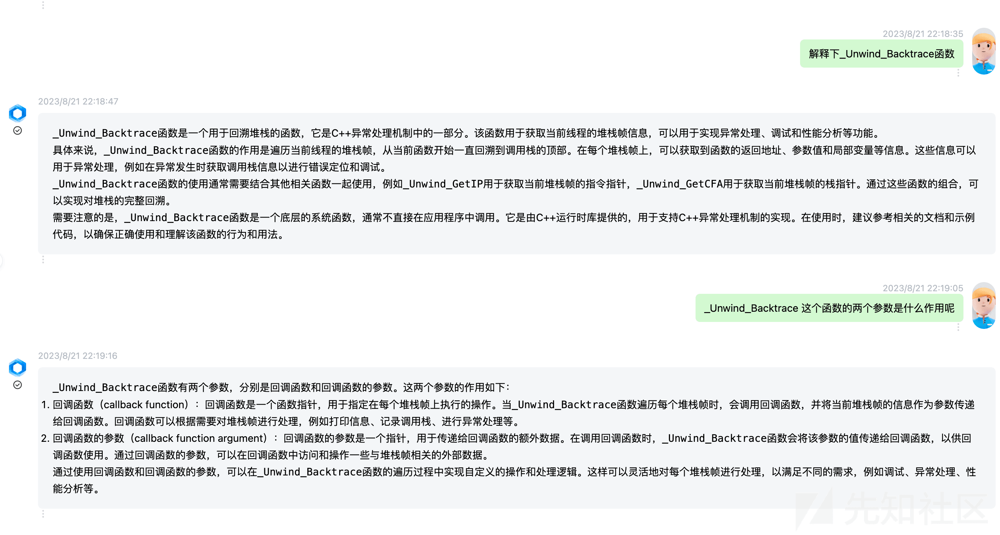
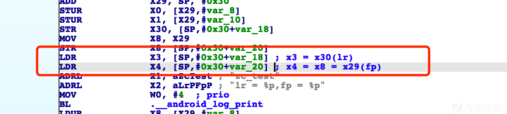
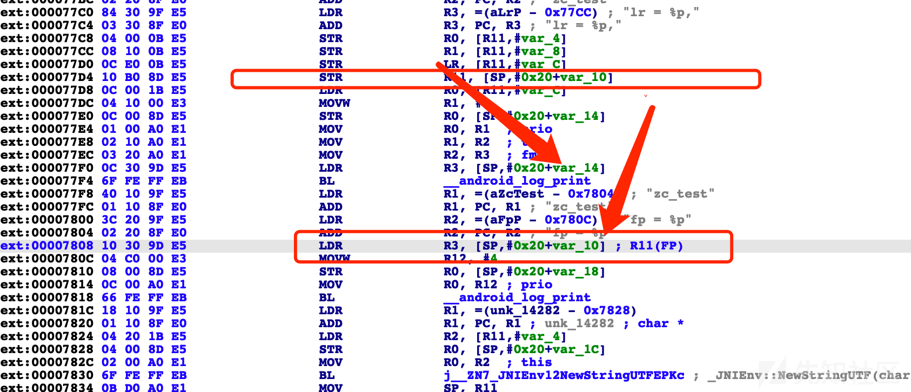
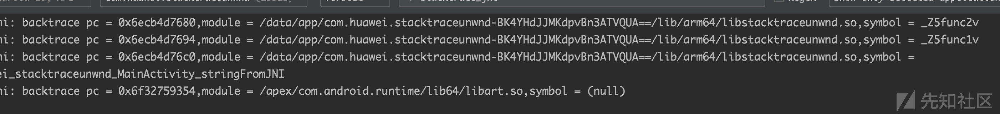
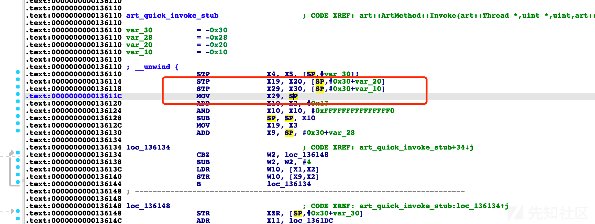
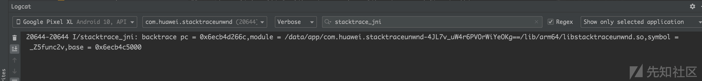

Android backtrace 探索（一）

- - -

## Android backtrace 探索（一）

在逆向分析过程中，获取调用栈往往是辅助分析的一大手段，同样的也存在一些对抗打印调用栈的方式，为了学习如何对抗堆栈打印的方案，痛下决心从正向开始了解这个技术。本系列也将从 Android 的 Java 层和 Native 层探索 backtrace 的正向和逆向过程。

## Java backtrace

Java 层的堆栈打印比较简单，构造异常 print 出来即可，这里不再赘述。仅展示简单的代码如下：

```plain
Exception e = new Exception();
e.printStackTrace();
```

## Android native BackTrace

各版本的 AOSP 都有系统自用的 backtrace 库，主要作用是配合系统 debuggerd 进程和调试器的工作。  
（1）libcorkscrew：只用于 Android 4.1 - 4.4W。  
（2）libunwind：只用于 Android 5.0 - 7.1.1。  
（3）libunwindstack：只用于 Android 8.0 及以上版本。

### C++ backtrace

整个 backtrace 的核心实际上在\_Unwind\_Backtrace 函数上，该函数的原型为

```plain
_Unwind_Reason_Code _Unwind_Backtrace(_Unwind_Trace_Fn, void *);
```

该函数的运行机制是在获取到每一个堆栈帧上调用第一个参数指定的回调函数，而第二个参数则是回调函数的参数是一个指针，用于传递给回调函数的额外数据。  
万卷如是回答：  
[](https://xzfile.aliyuncs.com/media/upload/picture/20231108215508-6d372b7e-7e3e-1.png)

而回调函数的函数原型固定为

```plain
typedef _Unwind_Reason_Code (*_Unwind_Trace_Fn)(struct _Unwind_Context * context, void * arg);
```

其中 context 变量表示进程的上下文，主要是一些寄存器的信息。其声明如下：

```plain
typedef _Unwind_Word _Unwind_Context_Reg_Val;

struct _Unwind_Context
{
  _Unwind_Context_Reg_Val reg[__LIBGCC_DWARF_FRAME_REGISTERS__+1];
  void *cfa;
  void *ra;
  void *lsda;
  struct dwarf_eh_bases bases;
  /* Signal frame context.  */
#define SIGNAL_FRAME_BIT ((~(_Unwind_Word) 0 >> 1) + 1)
  /* Context which has version/args_size/by_value fields.  */
#define EXTENDED_CONTEXT_BIT ((~(_Unwind_Word) 0 >> 2) + 1)
  _Unwind_Word flags;
  /* 0 for now, can be increased when further fields are added to
     struct _Unwind_Context.  */
  _Unwind_Word version;
  _Unwind_Word args_size;
  char by_value[__LIBGCC_DWARF_FRAME_REGISTERS__+1];
};
```

从参考资料来看，均无法支持手动的 stack trace

## 手动 stacktrace 实现

### 基础补充

ARM64 中一共 31 个基础寄存器 X0-X30，另外还有一些特殊寄存器，比如 SP、PC 寄存器，其中

1.  X0-X7 前 8 个寄存器可用于存储函数参数
2.  SP 寄存器，即 Stack Pointer 寄存器，指向栈的顶部；
3.  X29 寄存器，即 FP（Frame Pointer）寄存器，指向栈的底部；
4.  X30 寄存器，即 LR（Link Register）寄存器，存储着函数调用完成后的返回地址；
5.  PC（Program Counter）寄存器，保存的是将要执行的下一行地址。

[](https://xzfile.aliyuncs.com/media/upload/picture/20231108215508-6d6e5a72-7e3e-1.png)

ARM 指令集则有 8 个通用寄存器 r0-r7，r8-r14 被认为是分组寄存器，其中

1.  r0-r3 用于存储函数参数
2.  r11 寄存器，通常被认为是 FP 寄存器
3.  r13 寄存器，即 SP 寄存器，通常用于指向堆栈地址
4.  r14 寄存器，也称作子程序连接寄存器（Subroutine Link Register）或连接寄存器 LR，同样是函数的返回地址
5.  r15 寄存器即为 pc 寄存器。

[](https://xzfile.aliyuncs.com/media/upload/picture/20231108215508-6db7d878-7e3e-1.png)

而 thumb 模式又不大一样，thumb 模式下 r7 寄存器则为 fp 寄存器。  
暂时先不管

### 手动实现 backtrace--基于 fp 指针

> 其实从上述的分析以及 linux 内核的一些代码实现来看，栈回溯只需要 lr 指针和 fp 即可。  
> lr 指针记录了当前的函数的返回地址  
> fp 指针则记录了当前栈帧的地址。  
> 一层一层向上回溯则可以完成栈回溯

以下面的代码作为例子进行栈回溯

```plain
void func2(){
    // dump_backtrace();
}
void func1(){
    func2();
}
extern "C" JNIEXPORT jstring   JNICALL
Java_com_huawei_stacktraceunwnd_MainActivity_stringFromJNI(
        JNIEnv* env,
        jobject /* this */) {
    func1();
    return env->NewStringUTF("");
}
```

ARM64 的函数入口代码

```plain
SUB             SP, SP, #0x50
 STP             X29, X30, [SP,#0x40]
 ADD             X29, SP, #0x40
```

而函数出口则为

```plain
LDP             X29, X30, [SP,#0x40]
 ADD             SP, SP, #0x50 ; 'P'
 RET
```

从上述的汇编指令可以发现，实际上我们在函数中获取的 fp 指针对应的是 sp 指针，而 sp 指针中则存储着 fp 和 lr 指针，其中 lr 指针即为函数的返回地址，也近乎可以作为 pc 寄存器的值了，fp 指针则对应 caller 的 sp 指针。如此迭代下去是不是就可以实现栈回溯呢？尝试一下

```plain
auto lr = (uint64_t) __builtin_return_address(0);
auto fp = (uint64_t) __builtin_frame_address(0);
while ((0 != fp) && (0 != *(unsigned long *) fp) &&
       (fp != *(unsigned long *) fp)) {
    lr = *(uint64_t *) (fp + sizeof(char *));
    Dl_info info;
    if (!dladdr((void *) lr, &info)) {
        break;
    }
    if (!info.dli_fname) {
        break;
    }
    LOG("backtrace pc = %p,module = %s", lr, info.dli_fname);
    fp = *((uint64_t *) fp);
}
```

测试效果  
[](https://xzfile.aliyuncs.com/media/upload/picture/20231108215509-6df18bd6-7e3e-1.png)

验证下来发现确实比我们正常看到的 crash 调用堆栈少很多，这部分看大佬们文章原因结合自己实践发现，主要有以下几种原因。

1、不能穿过 JNI 和 OAT，这部分是因为在系统库中并未遵循上述规则，捞下 libart.so 反编译看下其中的函数，可以发现实际上此时获取的 x29 寄存器是 sp 寄存器，但是 lr 寄存器的位置却在 sp + 0x20 的位置，因此要获取 pc 的指针的值需要先将获取得到的 fp 寄存器先加上 0x20 后才是我们正常认为的 fp 寄存器。这样就导致我们用上述方式回溯到系统库中。

[](https://xzfile.aliyuncs.com/media/upload/picture/20231108215509-6e37da6e-7e3e-1.png)

2、众多文章都表示 fp 寄存器可以通过 -fomit-frame-pointer 编译参数优化掉，那么具体效果是什么呢？答案是只能获取到当前函数信息。

[](https://xzfile.aliyuncs.com/media/upload/picture/20231108215510-6e7149ac-7e3e-1.png)

如何实现这样的效果呢？  
这里我使用的如下 cmake 编译命令

```plain
set(CMAKE_C_FLAGS "${CMAKE_C_FLAGS}  -fomit-frame-pointer ")
set(CMAKE_CXX_FLAGS "${CMAKE_CXX_FLAGS}    -fomit-frame-pointer")
// or
target_compile_options(${target} PUBLIC -fomit-frame-pointer)
```

下篇再见（如果还有的话）！

## 参考

[https://stackoverflow.com/questions/8115192/android-ndk-getting-the-backtrace](https://stackoverflow.com/questions/8115192/android-ndk-getting-the-backtrace)  
[https://github.com/aosp-mirror/platform\_bionic/blob/master/libc/malloc\_debug/backtrace.cpp](https://github.com/aosp-mirror/platform_bionic/blob/master/libc/malloc_debug/backtrace.cpp)  
[https://zhuanlan.zhihu.com/p/336916116](https://zhuanlan.zhihu.com/p/336916116)  
[https://developer.aliyun.com/article/815064](https://developer.aliyun.com/article/815064)  
[https://zhuanlan.zhihu.com/p/460686470](https://zhuanlan.zhihu.com/p/460686470)
