# Apache OFBiz 路径遍历致权限绕过漏洞分析(CVE-2024-25065) - 先知社区

Apache OFBiz 路径遍历致权限绕过漏洞分析(CVE-2024-25065)

- - -

# 漏洞描述

Apache OFBiz是一个著名的电子商务平台，提供了创建基于最新 J2EE/ XML规范和技术标准，构建大中型企业级、跨平台、跨数据库、跨应用服务器的多层、分布式电子商务类WEB应用系统的框架。

Apache OFBiz 中存在路径遍历漏洞，漏洞原因在于未充分验证用户输入的 contextPath 参数，未授权的攻击者可以通过构造恶意请求绕过认证，进而访问系统中的文件。

# 影响版本

Apache OFBiz < 18.12.12

# 环境搭建

这里我们下载的版本为18.12.05。

配置gradle目录后，执行build。

[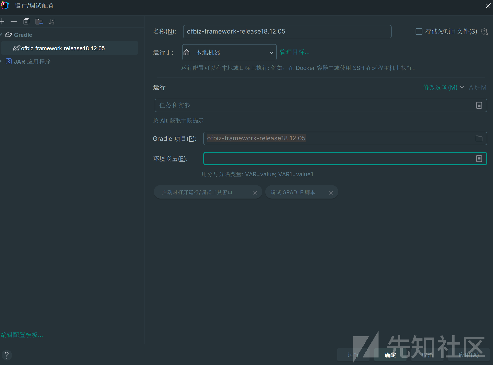](https://xzfile.aliyuncs.com/media/upload/picture/20240301231354-5133f4d0-d7de-1.png)

完成后会在build/lib目录下生成ofbiz.jar文件。

[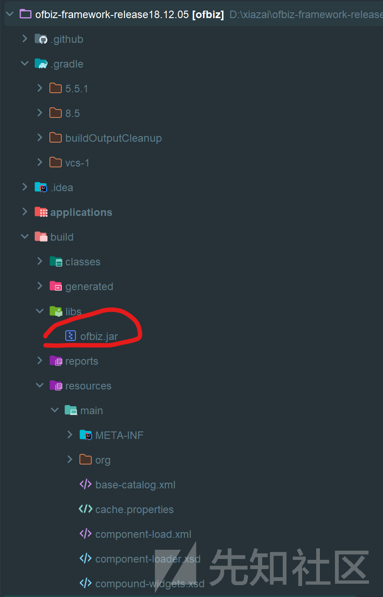](https://xzfile.aliyuncs.com/media/upload/picture/20240301230829-8ffda3b0-d7dd-1.png)

然后我们添加JAR Application，就可以直接调试项目。

[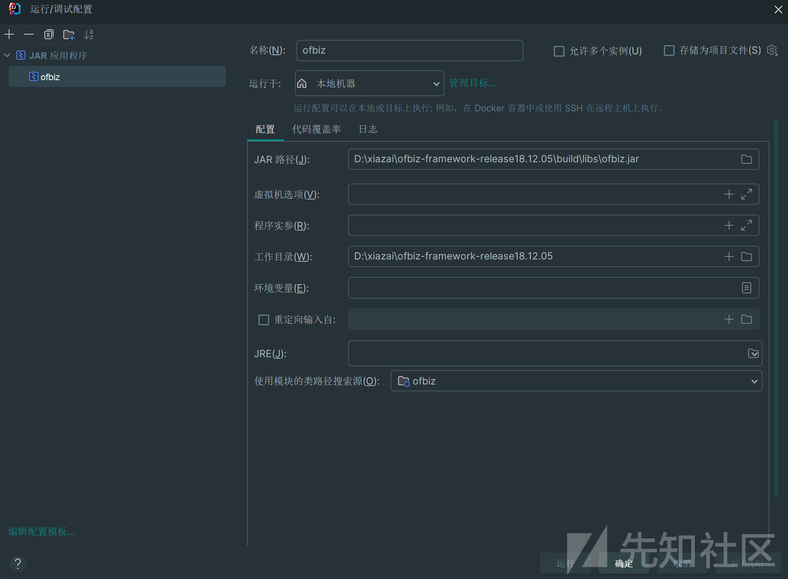](https://xzfile.aliyuncs.com/media/upload/picture/20240301230848-9b5f2c10-d7dd-1.png)

[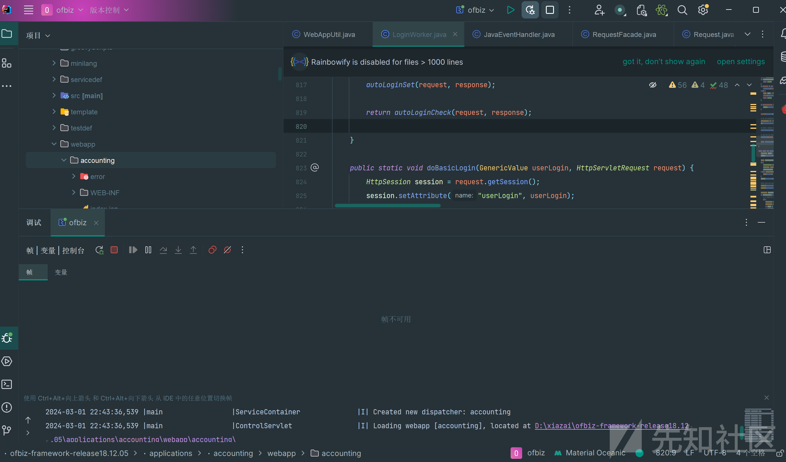](https://xzfile.aliyuncs.com/media/upload/picture/20240301230901-a2d21f5c-d7dd-1.png)

# 漏洞原理分析

查看漏洞代码

```plain
public static boolean hasBasePermission(GenericValue userLogin, HttpServletRequest request) {
        Security security = (Security) request.getAttribute("security");
        if (security != null) {
            ServletContext context = request.getServletContext();
            String serverId = (String) context.getAttribute("_serverId");
            // get a context path from the request, if it is empty then assume it is the root mount point
            String contextPath = request.getContextPath();
            if (UtilValidate.isEmpty(contextPath)) {
                contextPath = "/";
            }
            ComponentConfig.WebappInfo info = ComponentConfig.getWebAppInfo(serverId, contextPath);
            if (info != null) {
                return hasApplicationPermission(info, security, userLogin);
            } else {
                if (Debug.infoOn()) {
                    Debug.logInfo("No webapp configuration found for : " + serverId + " / " + contextPath, module);
                }
            }
        } else {
            if (Debug.warningOn()) {
                Debug.logWarning("Received a null Security object from HttpServletRequest", module);
            }
        }
        return true;
    }
```

根据名称我们可以知道`hasBasePermission`的方法，是用于检查用户是否具有访问Web应用部分的基本权限的校验方法。方法中首先通过`request.getAttribute("security");`从请求中获取安全管理器，当安全管理器不为空时再获取当前Web应用的上下文和服务器ID，获取请求的contextPath为空就设置为根路径。

然后就是使用服务器ID和上下文路径从ComponentConfig中获取对应的Web应用信息`ComponentConfig.getWebAppInfo(serverId, contextPath);`。当如果获取到了Web应用信息，则调用hasApplicationPermission方法检查用户是否有权访问该应用。如果没有找到对应的Web应用配置信息，则进行信息日志记录。如果从请求中获取不到Security对象，则记录一条警告日志。

以下的分析我们使用创建的订单账号ggb无管理员权限。

[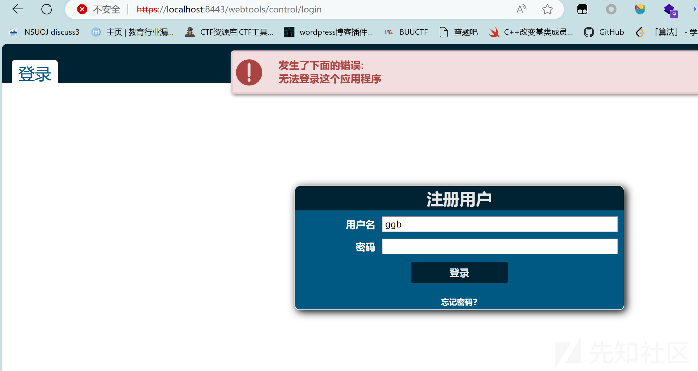](https://xzfile.aliyuncs.com/media/upload/picture/20240301230917-ac3859ee-d7dd-1.png)

当我们访问`/ordermgr/control/login/webtools/control/login`路由，其中/webtools/control/login为web管理工具的登录路由，/ordermgr/control/login为订单的登录路由。会直接进入不到`hasBasePermission`方法进行权限检测，直接提示路由错误。

[](https://xzfile.aliyuncs.com/media/upload/picture/20240301230945-bd566fae-d7dd-1.png)

当我们访问`/ordermgr/control/login/../../../webtools/control/login`,使用../进行路径穿越。此时可以进入到`hasBasePermission`检测方法。我们将断点设置在`String contextPath = request.getContextPath();`查看此时获取到的`contextPath`。可以发现此时`contextPath`为`/ordermgr/control/login/../../../webtools`。

[](https://xzfile.aliyuncs.com/media/upload/picture/20240301231021-d28c2080-d7dd-1.png)

继续调试，系统会通过`ComponentConfig.getWebAppInfo(serverId, contextPath);`获取web应用的配置信息，当获取的信息不为空着进入`hasBasePermission`方法进行权限检测。那么这里当我们通过../进行路由跳转后，可以发现其获取不到配置信息。从而跳过`hasBasePermission`方法进行的权限检测。

[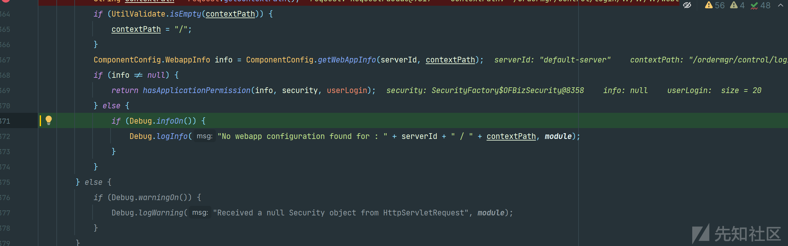](https://xzfile.aliyuncs.com/media/upload/picture/20240301231035-dafa909e-d7dd-1.png)

最后返回为true，通过hasBasePermission方法的校验。

[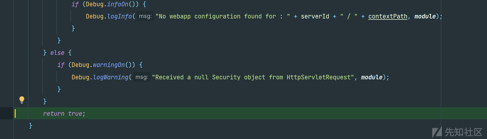](https://xzfile.aliyuncs.com/media/upload/picture/20240301231048-e2e2b232-d7dd-1.png)

其中hasBasePermission方法只是doMainLogin登录逻辑中的一个检验方法，详细代码如下。

```plain
public static String doMainLogin(HttpServletRequest request, HttpServletResponse response, GenericValue userLogin, Map<String, Object> userLoginSession) {
        HttpSession session = request.getSession();
        boolean authoriseLoginDuringImpersonate = EntityUtilProperties.propertyValueEquals("security", "security.login.authorised.during.impersonate", "true");
        if (!authoriseLoginDuringImpersonate && checkImpersonationInProcess(request, response) != null) {
            return "error";
        }
        if (userLogin != null && hasBasePermission(userLogin, request)) {
            doBasicLogin(userLogin, request);
        } else {
            String errMsg = UtilProperties.getMessage(resourceWebapp, "loginevents.unable_to_login_this_application", UtilHttp.getLocale(request));
            request.setAttribute("_ERROR_MESSAGE_", errMsg);
            return "error";
        }

        if (userLoginSession != null) {
            session.setAttribute("userLoginSession", userLoginSession);
        }

        request.setAttribute("_LOGIN_PASSED_", "TRUE");

        // run the after-login events
        RequestHandler rh = RequestHandler.getRequestHandler(request.getSession().getServletContext());
        rh.runAfterLoginEvents(request, response);

        // Create a secured cookie with the correct userLoginId
        createSecuredLoginIdCookie(request, response);

        // make sure the autoUserLogin is set to the same and that the client cookie has the correct userLoginId
        autoLoginSet(request, response);

        return autoLoginCheck(request, response);

    }
```

其中我们主要分析hasBasePermission方法通过后的代码，hasBasePermission方法存在`if (userLogin != null && hasBasePermission(userLogin, request))`判断逻辑中，其中表示当userLogin对象不为空且通过`hasBasePermission`方法校验用户具有基本权限，就执行基本登录操作。这里我们通过判断，执行登录操作，成功通过登录。

[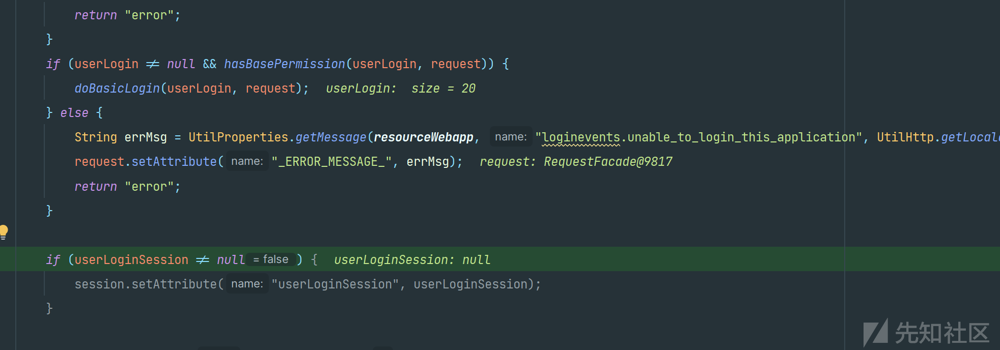](https://xzfile.aliyuncs.com/media/upload/picture/20240301231109-eef38d94-d7dd-1.png)

然后进行判断当传入的用户会话信息不为空，则将其设置到会话属性中。这里为空，不设置到会话中。

[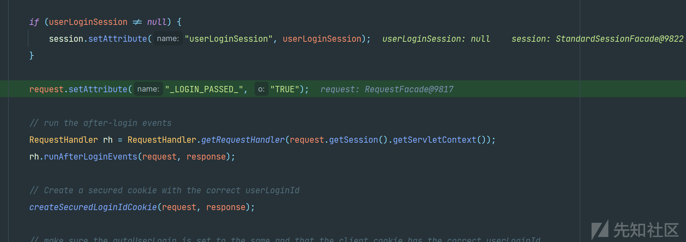](https://xzfile.aliyuncs.com/media/upload/picture/20240301231125-f8af228a-d7dd-1.png)

然后设置一个属性，表示登录过程已通过

然后运行登录后事件，并创建一个安全的cookie，包含正确的userLoginId，将客户端cookie设置为正确的正确的userLoginId

[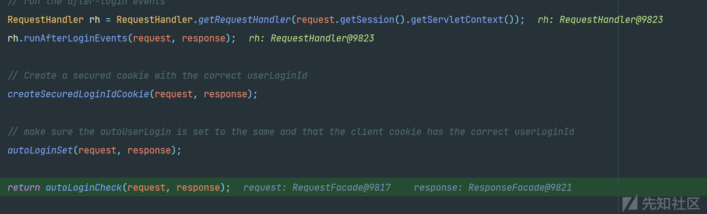](https://xzfile.aliyuncs.com/media/upload/picture/20240301231140-0190c200-d7de-1.png)

自此我们以及成功绕过安全校验，通过../进行路径穿越，拿到了webtools路径的cookie。

[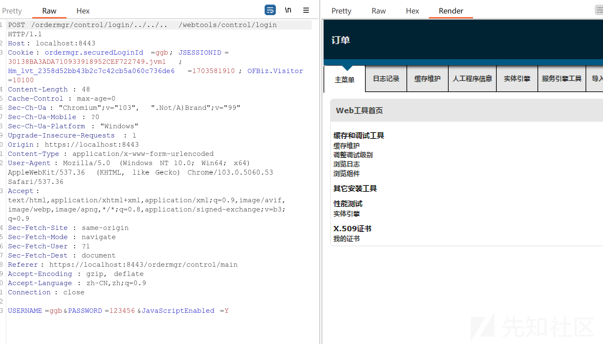](https://xzfile.aliyuncs.com/media/upload/picture/20240301231200-0d4087ac-d7de-1.png)

[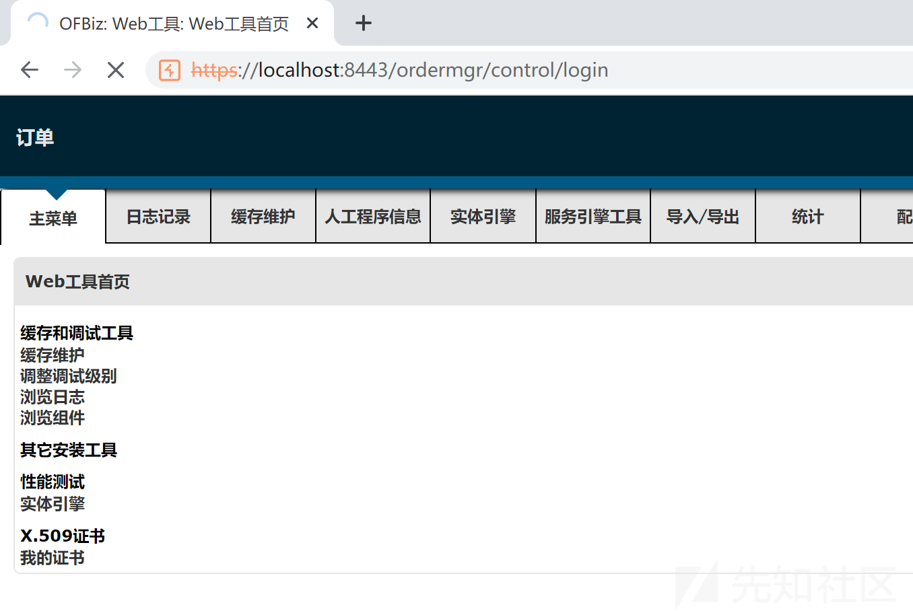](https://xzfile.aliyuncs.com/media/upload/picture/20240301231220-1946827c-d7de-1.png)

可以看到成功跳转至webtools首页。

# 漏洞利用

这里我们直接点击进行利用，会被提示没有权限。直接利用时，新的路由还是会进入上方的权限校验中。这里我们在路由前方继续加上`/ordermgr/control/login/../../..`，重复上面分析的流程绕过权限校验，同时请求体中提交低权限的用户名和密码。这里我们创建新用户，发出如下请求，会得到以下页面。提示我们没有权限浏览。

[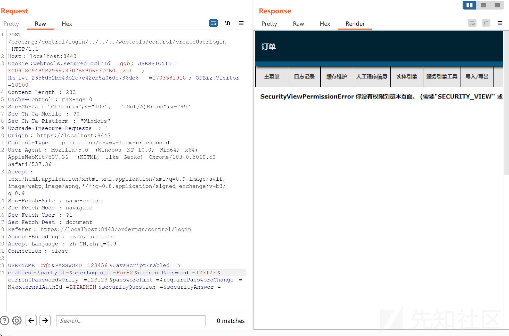](https://xzfile.aliyuncs.com/media/upload/picture/20240301231243-273f5c46-d7de-1.png)

但此时我们已经成功执行了操作，创建了新用户。

[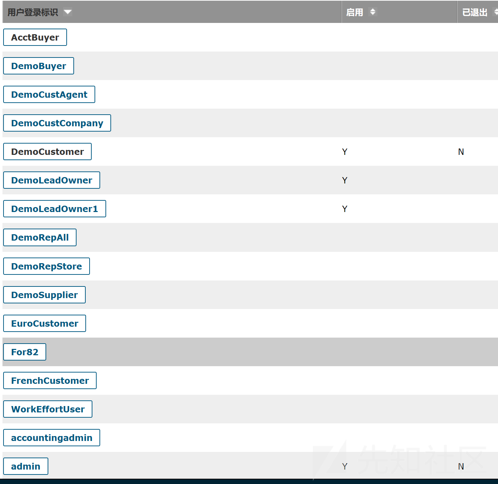](https://xzfile.aliyuncs.com/media/upload/picture/20240301231300-311ef758-d7de-1.png)

# 修复建议

厂商已发布补丁修复漏洞，用户请尽快更新至安全版本  
将 ofbiz 升级至 18.12.12 及以上版本

# 来源

[https://avd.aliyun.com/detail?id=AVD-2024-25065](https://avd.aliyun.com/detail?id=AVD-2024-25065)
