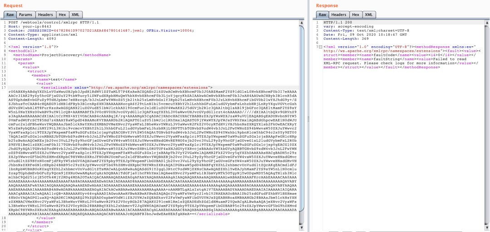
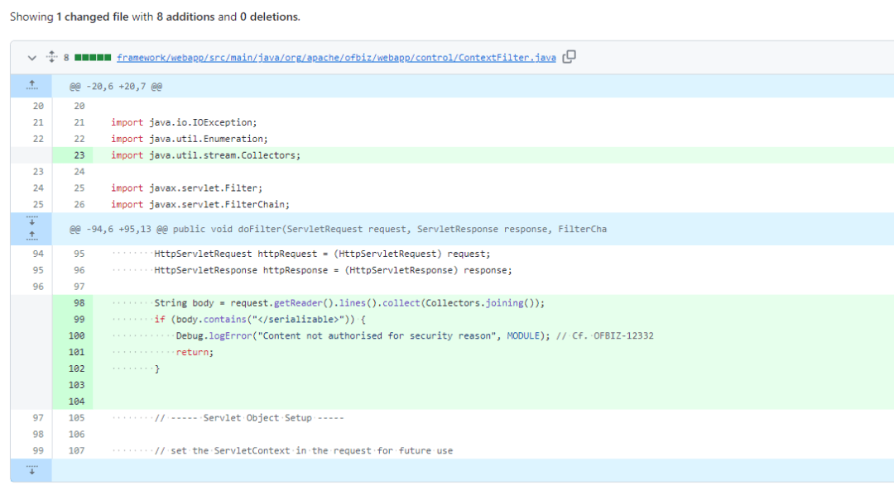
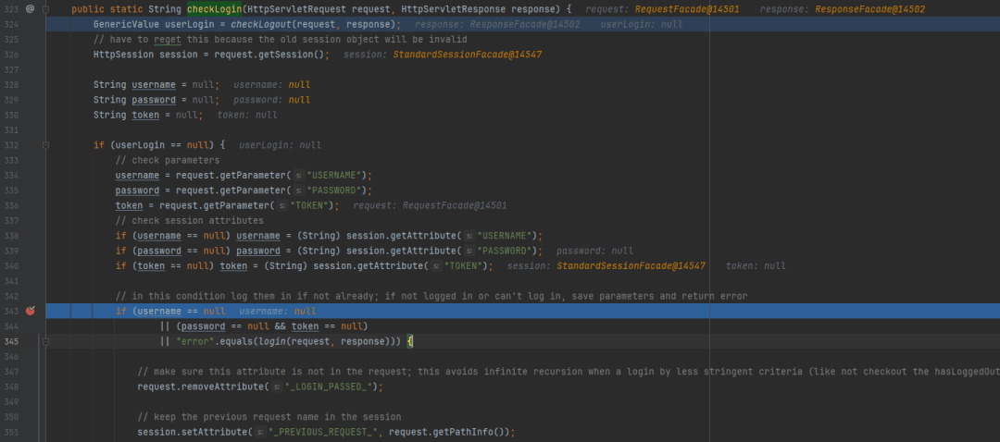
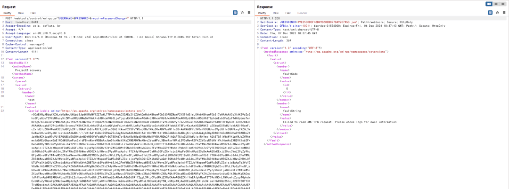
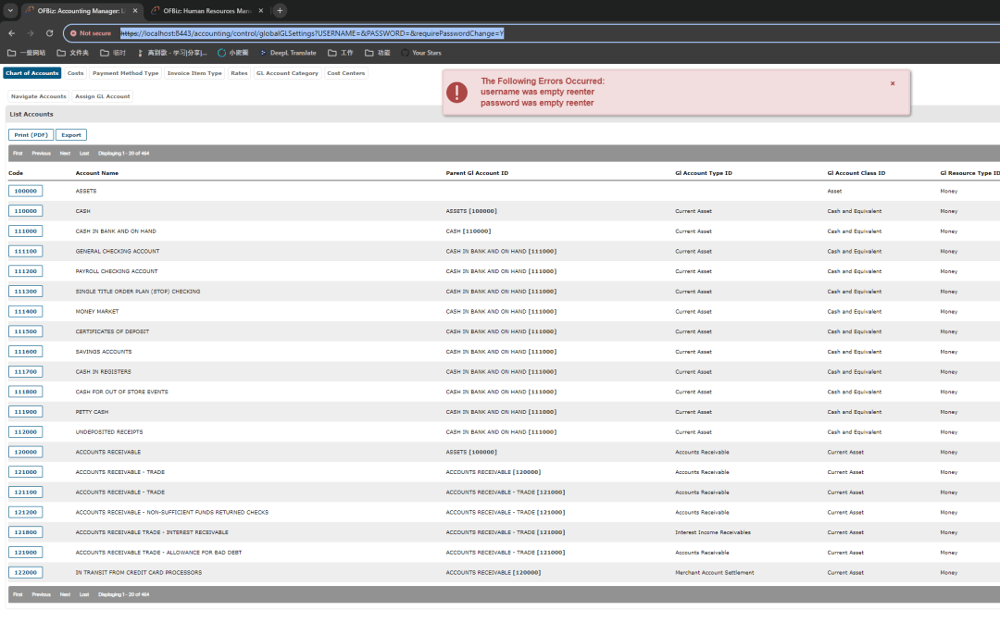
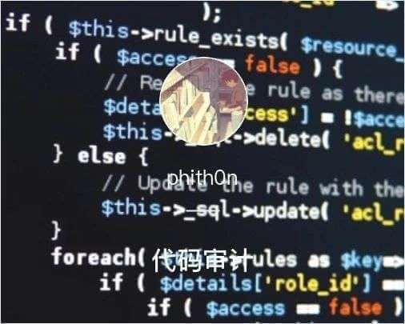

# Apache OFBiz 漏洞 CVE-2023-49070 的前世今生

最新的 Apache OFBiz XML-RPC 反序列化漏洞，讲讲它的前世今生。

## 前世

Apache OFBiz 是一个开源的开发框架，它提供了一些预置的逻辑用于开发企业级的业务流程。早在 2020 年，Apache OFBiz 就曾出现过一个反序列化漏洞（CVE-2020-9496），问题出现在 XML-RPC 这个组件中。

XML-RPC 也是 Apache 基金会旗下的一个项目，但基本上在 2010 年前后就不更新了，历史上出现过多个反序列化漏洞（如 CVE-2016-5003、CVE-2019-17570），但都没有被修复。Apache OFBiz 由于使用了 XML-RPC 组件所以受到了影响。

CVE-2020-9496 这个漏洞在 Vulhub 中也有环境：https://github.com/vulhub/vulhub/tree/master/ofbiz/CVE-2020-9496。利用方式很简单，向`/webtools/control/xmlrpc`接口发送 POST 包，包含 XML 格式的 RPC 请求体。其中，`<serializable>`这个对象中包含了 base64 格式的 Payload：

  

2020 年 5 月，漏洞出现后，OFBiz 官方在 https://github.com/apache/ofbiz-framework/commit/d955b03fdc226d600d81d19d273e773f84b5c000 这个提交中提交了第一次补丁，这个补丁的作用是为 XML-RPC 的接口增加鉴权：

很显然这个补丁并不能完全解决问题，但至少提高了漏洞利用门槛，不再是“Pre-Auth RCE”漏洞。

在 2021 年 10 月，一个叫 Jie Zhu 的人向官方反应了这个“Post-Auth RCE 漏洞”，可以在当时最新的 17.12.08 版本上复现。官方也很无奈呀：这个漏洞本不是 OFBiz 导致，但因为 XML-RPC 不再维护，无法从根本上修复这个漏洞。

官方只能退而求其次，使用 filter 的方式对请求做了一次检测，只要发现 Body 中存在`</serializable>`这个关键字就报错：

  

这个修复方法很快被 Jie Zhu 绕过，因为攻击者可以增加一个空格，使用`</serializable >`的方式绕过检测。

于是，官方在 https://github.com/apache/ofbiz-framework/commit/25293e4cf6f334a2ae33b3041acba45113dddce9 这个提交中再次进行加固，将检测关键词更改为`</serializable`：

  

那么，最新的 CVE-2023-49070 又是怎么回事呢？其实，CVE-2023-49070 就是对上述官方提供的两个加固方式进行了绕过：

-   绕过对于`</serializable`这个关键词的检测
    
-   绕过对 XML-RPC 这个接口的认证
    

有了这两个绕过，最新的漏洞重新变回一个 Pre-Auth RCE 漏洞。

## 今生

那么，来看看这两个补丁都是怎么被绕过的。

使用 Vulhub 启动 CVE-2023-49070 的环境，然后下载 Apache OFBiz 源码，切换到`7935a14627a86325440516ac6b892a5f9d635e4d`这个 commit。在 IDEA 中打开，并增加远程调试的配置，端口是 Vulhub 的 5005 端口。

由于前面已经分析出补丁的位置，我们直接在`org.apache.ofbiz.base.util.CacheFilter#doFilter`这个函数中下断点。

然后，先发送老的 CVE-2020-9496 的 POC，已经断下：

  

这个函数里有两个关键的 if 语句，第一个 if 语句判断当前的 path 是不是等于`/control/xmlrpc`，第二个 if 语句判断 body 中是否包含`</serializable`，如果两个 if 语句都满足，则 filter 退出，不执行后续逻辑。

在 Java 中，我们多次提到，部分中间件如 Tomcat 可以通过`;`的方式可以在路径中增加 Matrix Parameters：https://www.baeldung.com/cs/url-matrix-vs-query-parameters。

所以，我们也可以尝试在 XML-RPC 请求的路径中增加分号：`/webtools/control/xmlrpc;/`。

断点再次断下，此时`uri.toLowerCase()`已经变成`/control/xmlrpc;/`，再不等于`/control/xmlrpc`，绕过了这里的限制：

  

第一个限制绕过，服务器返回了登录页面：

  

接着，我们还需要绕过认证的限制，否则漏洞还是一个 Post-Auth RCE。

我们在`org.apache.ofbiz.webapp.control.LoginWorker#checkLogin`下断点，这个函数用于检查用户是否登录：

  

第 343 行有一个很关键的判断`"error".equals(login(request, response))`，当`login()`函数的返回值等于`error`时进入 if 语句。

那么，单步进入`login()`函数看看逻辑。这个函数中有这样几行：

  

`requirePasswordChange`这个参数的值如果等于`Y`，则返回`requirePasswordChange`，否则返回`error`。

而前面的逻辑，只要`login(request, response)`返回的不是 error，则认为认证成功。很显然，这里存在一个逻辑 Bug。

所以，只要我们在发送 XML-RPC 请求的时候，将`requirePasswordChange`设置成`Y`，即可绕过权限检测，最后的 POC 就呼之欲出了：

  

## 修复

抛开 XML-RPC 这个组件的漏洞来看，`requirePasswordChange`这个逻辑 Bug 本来就是 Apache OFBiz 的一个认证绕过的漏洞，只是这个漏洞被用于访问 XML-RPC 了。

在最新发行版 18.12.10 中，对于 CVE-2023-49070 的修复方式是直接移除了 XML-RPC 相关的逻辑：https://github.com/apache/ofbiz-framework/commit/c59336f604f503df5b2f7c424fd5e392d5923a27。

但是认证绕过的问题其实并没有处理，虽然程序后续逻辑中仍然有垂直权限相关的检查，但这一步的权限绕过，仍然导致可以看到一些非预期的页面，比如

  

这个权限绕过的问题，仍然有待深入研究。

喜欢这篇文章，点个**在看**再走吧~

加入「代码审计」，学习更多安全知识。一次付费，终身学习免续费。

知识星球， ， ，

「代码审计」星球，一次付费，终身学习

小程序
