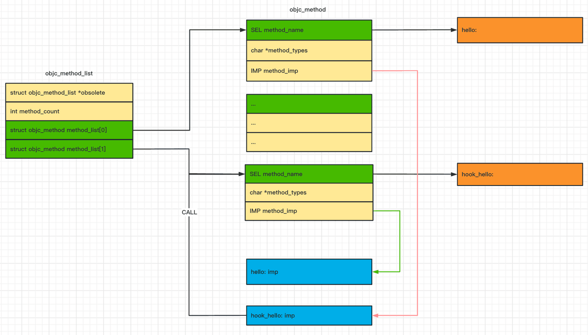
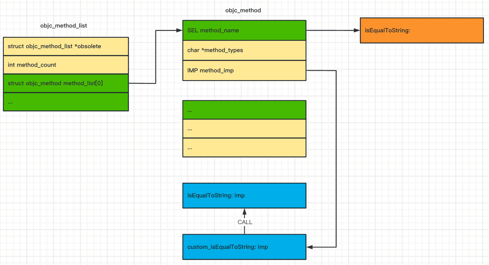

## Break frida-objc-bridge

- - -

# [前言](#toc_)

回顾上上上…篇发布的文章《[打造 macOS 下”最强”的微信取证工具](https://blog.macoder.tech/macOS-6faf0534323c42259f5277bd95d35c43)》中使用 frida 工具从内存中获取到了关键数据，frida objc 的能力都来自于 [frida-objc-bridge](https://github.com/frida/frida-objc-bridge) ，本着好奇探索心理想研究下原理，也没找到相关文章资料，倒是找到不少 frida-java-bridge 的文章。那么本文将从了解 Objective-C Runtime 开始，例如它的消息发送机制、Method Swizzling 等，再去探索 frida 中的 frida-objc-bridge 实现原理以及它最关键的 choose 方法的实现。

# [Objective-C Runtime](#toc_objective-c-runtime)

[Objective-C Runtime](https://developer.apple.com/documentation/objectivec/objective-c_runtime?language=objc) 是一个运行时库，它为 Objective-C 语言的动态属性提供支持，因此所有 Objective-C 应用程序都链接到它。Objective-C 运行时库支持函数在共享库中实现，位于`/usr/lib/libobjc.A.dylib`。

### [消息发送机制](#toc__1)

Objective-C 是一种动态语言，这意味着对象类型是在运行时确定的，包括查找给定的函数名称。

在 Objective-C 中，调用类的方法需要向对象发送一条消息，其中包含方法的名称和它期望的参数。在运行时，函数根据其名称查找，然后调用。这意味着编译后的代码还必须维护所有相关对象方法的名称，因为这些方法在运行时使用。

- - -

```plain
// message_send_demo.m
#import <Foundation/Foundation.h>

@interface AClass : NSObject
@end
@implementation AClass : NSObject
@end

int main() {
  id a = @"this is NSString";
  [a characterAtIndex:1];

  id acls = [AClass new];
  [acls characterAtIndex:2];
}
```

如上 `objc` 代码，即使调用一个不存在的方法也能正确编译，不过在运行时会抛出异常：

```plain
$ clang -framework Foundation message_send_demo.m -o demo
$ ./demo
2023-04-18 11:38:07.537 demo[15135:508503] -[AClass characterAtIndex:]: unrecognized selector sent to instance 0x156e0bbc0
2023-04-18 11:38:07.538 demo[15135:508503] *** Terminating app due to uncaught exception 'NSInvalidArgumentException', reason: '-[AClass characterAtIndex:]: unrecognized selector sent to instance 0x156e0bbc0'
*** First throw call stack:
(
        0   CoreFoundation                      0x00000001c4d35148 __exceptionPreprocess + 240
        1   libobjc.A.dylib                     0x00000001c4a7fe04 objc_exception_throw + 60
        2   CoreFoundation                      0x00000001c4dc8ef8 -[NSObject(NSObject) __retain_OA] + 0
        3   CoreFoundation                      0x00000001c4c94494 ___forwarding___ + 1764
        4   CoreFoundation                      0x00000001c4c93cf0 _CF_forwarding_prep_0 + 96
        5   demo                                0x0000000104797f64 main + 84
        6   dyld                                0x000000010482508c start + 520
)
libc++abi: terminating with uncaught exception of type NSException
[1]    15135 abort      ./demo
```

Objective-C 中的方法调用通过使用 `objc_msgSend(void /* id self, SEL op, ... */)` 函数向对象发送消息，上面的代码：`[a characterAtIndex:1]` 在运行时转换为：`objc_msgSend(id self, @selector(characterAtIndex:), 1)` 。接下来继续剖析`id`和`SEL`数据类型，来揭开 `objc` 消息发送机制的神秘面纱。

- - -

[id](https://developer.apple.com/documentation/objectivec/id?language=objc) 是 objc 中指向任何 (NSObject) 类实例的指针（和 C 中的 `void*`还是有所区别的 `void*`指一个未知类型或未知内容的指针），id 定义在 **[runtime/objc.h](https://github.com/apple-oss-distributions/objc4/blob/main/runtime/objc.h#L38)** 头文件中**：**

```plain
/// An opaque type that represents an Objective-C class.
typedef struct objc_class *Class;

/// Represents an instance of a class.
struct objc_object {
    Class _Nonnull isa  OBJC_ISA_AVAILABILITY;
};

/// A pointer to an instance of a class.
typedef struct objc_object *id;
```

id 是个指向 `objc_object` 结构体的指针，其成员 isa 指向 `objc_class` 结构体，`objc_class` 定义在 [runtime.h](https://github.com/opensource-apple/objc4/blob/master/runtime/runtime.h#L55) 头文件下：

```plain
struct objc_class {
    Class isa  OBJC_ISA_AVAILABILITY;

#if !__OBJC2__
    Class super_class                                        OBJC2_UNAVAILABLE;
    const char *name                                         OBJC2_UNAVAILABLE;
    long version                                             OBJC2_UNAVAILABLE;
    long info                                                OBJC2_UNAVAILABLE;
    long instance_size                                       OBJC2_UNAVAILABLE;
    struct objc_ivar_list *ivars                             OBJC2_UNAVAILABLE;
    struct objc_method_list **methodLists                    OBJC2_UNAVAILABLE;
    struct objc_cache *cache                                 OBJC2_UNAVAILABLE;
    struct objc_protocol_list *protocols                     OBJC2_UNAVAILABLE;
#endif

} OBJC2_UNAVAILABLE;
```

`objc_class` 结构它具有名称 ( name ) 、指向其超类 ( super\_class ) 的指针、指向实例变量的指针 ( ivars )、方法列表 ( methodLists )、缓存 ( cache )，最后是协议列表 ( protocols )。

就把 `objc_method_list` 结构体看作一个数组就行了，成员类型是 `objc_method` 结构体：

```plain
struct objc_method {
    SEL method_name                                          OBJC2_UNAVAILABLE;
    char *method_types                                       OBJC2_UNAVAILABLE;
    IMP method_imp                                           OBJC2_UNAVAILABLE;
}                                                            OBJC2_UNAVAILABLE;

struct objc_method_list {
    struct objc_method_list *obsolete                        OBJC2_UNAVAILABLE;

    int method_count                                         OBJC2_UNAVAILABLE;
#ifdef __LP64__
    int space                                                OBJC2_UNAVAILABLE;
#endif
    /* variable length structure */
    struct objc_method method_list[1]                        OBJC2_UNAVAILABLE;
}                                                            OBJC2_UNAVAILABLE;
```

可以看到 `objc_method` 结构体有三个成员：

-   method\_name 函数选择器 `SEL(@selector)`。
-   method\_types 不重要，想了解的看看官方文档：**[Type Encodings](https://developer.apple.com/library/archive/documentation/Cocoa/Conceptual/ObjCRuntimeGuide/Articles/ocrtTypeEncodings.html)**。
-   method\_imp 指向实际方法地址的指针，可接受可变数量的参数，第一个是表示对象的 id 类型，而第二个是 selector。

[SEL](https://developer.apple.com/documentation/objectivec/sel) 全称是方法选择器 (method selector)，定义如下：

```plain
typedef struct objc_selector *SEL;
```

没看到定义 `objc_selector` 的代码，不过从官方文档 [ocSelectors](https://developer.apple.com/library/archive/documentation/Cocoa/Conceptual/ObjectiveC/Chapters/ocSelectors.html) 来看，将其理解为：”选择器是用于选择对象执行的方法的名称，或者是在编译源代码时替换名称的唯一标识符”就行了。

当调用 `objc_msgSend` 函数时，它会使用对象的 `isa` 指针，并在 `methodLists` 数组中枚举其所有方法，数组中的每个元素都有一个指向 `obj_method` 结构的指针，其中包含一个指向 `method_name` 选择器的指针，然后 `objc_msgSend` 函数搜索我们用选择器指定的方法。如下图更加直观表示查找过程以及结构体间的关系：

[](https://storage.tttang.com/media/attachment/2023/04/23/1f14de5f-7bc0-48fd-b7aa-46551ccda88b.png)

## [Method Swizzling](#toc_method-swizzling)

objc swizzling 那是老朋友了，经常使用比如之前的微信插件开发、软件逆向都有它的身影，常见写法如下：

```plain
...
void hookMethod(Class originalClass, SEL originalSelector, Class swizzledClass, SEL swizzledSelector){
    Method originalMethod = class_getInstanceMethod(originalClass, originalSelector);
    Method swizzledMethod = class_getInstanceMethod(swizzledClass, swizzledSelector);
    if (originalMethod && swizzledMethod){
        method_exchangeImplementations(originalMethod, swizzledMethod);
    }
}
...
@interface NSObject (TargetClass)
+ (void) hookApp;
@end

@implementation NSObject (TargetClass)
- (void)hook_hello:(char)arg2
{
    // TODO ...
    // [self hook_hello:arg2] now hook_hello -> hello imp
}

+ (void) hookApp
{
    hookMethod(objc_getClass("TargetClass"),
               @selector(hello:),
               [self class],
               @selector(hook_hello:));
}
@end
```

如上代码首先将需要扩展或 Hook 的类 `TargetClass` 定义一个新的 Objective-C [Categories](https://developer.apple.com/library/archive/documentation/Cocoa/Conceptual/ProgrammingWithObjectiveC/CustomizingExistingClasses/CustomizingExistingClasses.html)。

Categories 提供了向对象添加功能的能力，这意味着我们可以用最少的代码扩展一个类的方法，新方法将适用于所有的实例。

比如这里使用 `method_exchangeImplementations` 交换了 `hello`，`hook_hello` 的 imp，这时在 hook\_hello 方法中调用 `[self hook_hello:arg2]` 就是在调用之前的 `hello`，因为它两的 imp 以及交换过了，看图更加直观：  
[](https://storage.tttang.com/media/attachment/2023/04/23/4108f62d-f0cb-45d4-a09a-bba2b4af78c3.png)

- - -

还有第二种方式，不需要定义类 Categories，通过 `method_setImplementation` 替换原始函数 imp 指针，测试代码如下：

```plain
static IMP real_isEqualToString = NULL;
static BOOL custom_isEqualToString(id self, SEL _cmd, NSString *s) {
    // TODO ...
    return ((BOOL(*)(id, SEL, NSString *))real_isEqualToString)(self, _cmd, s);
}

real_isEqualToString = method_setImplementation(
      class_getInstanceMethod(NSClassFromString(@"__NSCFString"),
                              @selector(isEqualToString:)),
      (IMP)custom_isEqualToString);
```

`class_getInstanceMethod(NSClassFromString(@"__NSCFString"), @selector(isEqualToString:))` 获取`__NSCFString` 类的原始`isEqualToString:` 选择器，通过调用 `method_setImplementation` 函数将其替换为 `custom_isEqualToString` 并保存原始函数地址赋予给了 real\_isEqualToString 变量。

`real_isEqualToString` 是一个简单的 imp 类型，先转换为原始函数再调用：`((BOOL(*)(id, SEL, NSString *))real_isEqualToString)(self, _cmd, s)` 。

第二种方式调用图如下：

[](https://storage.tttang.com/media/attachment/2023/04/23/3a7dcdb4-80ab-4190-96d6-571fdfcb61c0.png)

# [Frida Objc Bridge](#toc_frida-objc-bridge)

frida 项目偏低层又复杂，所以在看 [frida-objc-bridge](https://github.com/frida/frida-objc-bridge) 源码前先去学习 evilpan 师傅写的 [Frida Internal](https://evilpan.com/2022/04/05/frida-internal/) 系列文章，通过文章了解可以按照封装层级将 frida 分为四级，分别是：

1.  CPU 指令集级别的 inline-hook 框架：frida-gum；
2.  使用 JavaScript 引擎对 gum 进行封装实现脚本拓展的能力：gum-js；
3.  运行时进程注入、脚本加载、RPC 通信管理等功能：frida-core；
4.  针对特殊运行环境的 js 模块及其接口，如 frida-java-bridge、frida-objc-bridge 等；

其中 frida-objc-bridge 处于最上一级，实际上它是在 `gum-js` 的基础上针对对应高级语言的 Runtime 进行 hack 而实现的，统一称为对应语言的 bridge。[gumjs](https://github.com/frida/frida-gum/blob/main/bindings/gumjs/runtime/objc.js) 在 runtime 中引入 objc-bridge 库 `Frida._objc = require('frida-objc-bridge')` ，这就是我们在编写 frida js 脚本时使用的 `Objc.*` 等接口实现。

objc-bridge 在 [index.js](https://github.com/frida/frida-objc-bridge/blob/main/index.js) 中暴露许多接口，本文只重点关注下 `/lib/api` 和 `/lib/fastpaths` 代码。`api.js` 加载 libobjc.A.dylib 动态库导入 objc api 如：`objc_getClassList`、`class_getInstanceMethod` 等：

```plain
...
function getApi() {
...
    const pending = [
        {
            module: "libsystem_malloc.dylib",
            functions: {
                "free": ['void', ['pointer']]
            }
        }, {
            module: "libobjc.A.dylib",
            functions: {
                "objc_msgSend": function (address) {
                    this.objc_msgSend = address;
                },
                "objc_msgSend_stret": function (address) {
                    this.objc_msgSend_stret = address;
                },
                "objc_msgSend_fpret": function (address) {
                    this.objc_msgSend_fpret = address;
                },
                "objc_msgSendSuper": function (address) {
                    this.objc_msgSendSuper = address;
                },
                "objc_msgSendSuper_stret": function (address) {
                    this.objc_msgSendSuper_stret = address;
                },
                "objc_msgSendSuper_fpret": function (address) {
                    this.objc_msgSendSuper_fpret = address;
                },
                "objc_getClassList": ['int', ['pointer', 'int']],
                "objc_lookUpClass": ['pointer', ['pointer']],
                "objc_allocateClassPair": ['pointer', ['pointer', 'pointer', 'pointer']],
                "objc_disposeClassPair": ['void', ['pointer']],
                "objc_registerClassPair": ['void', ['pointer']],
                "class_isMetaClass": ['bool', ['pointer']],
                "class_getName": ['pointer', ['pointer']],
                "class_getImageName": ['pointer', ['pointer']],
                "class_copyProtocolList": ['pointer', ['pointer', 'pointer']],
                "class_copyMethodList": ['pointer', ['pointer', 'pointer']],
                "class_getClassMethod": ['pointer', ['pointer', 'pointer']],
                "class_getInstanceMethod": ['pointer', ['pointer', 'pointer']],
                "class_getSuperclass": ['pointer', ['pointer']],
                "class_addProtocol": ['bool', ['pointer', 'pointer']],
                "class_addMethod": ['bool', ['pointer', 'pointer', 'pointer', 'pointer']],
                "class_copyIvarList": ['pointer', ['pointer', 'pointer']],
                "objc_getProtocol": ['pointer', ['pointer']],
                "objc_copyProtocolList": ['pointer', ['pointer']],
                "objc_allocateProtocol": ['pointer', ['pointer']],
                "objc_registerProtocol": ['void', ['pointer']],
                "protocol_getName": ['pointer', ['pointer']],
                "protocol_copyMethodDescriptionList": ['pointer', ['pointer', 'bool', 'bool', 'pointer']],
                "protocol_copyPropertyList": ['pointer', ['pointer', 'pointer']],
                "protocol_copyProtocolList": ['pointer', ['pointer', 'pointer']],
                "protocol_addProtocol": ['void', ['pointer', 'pointer']],
                "protocol_addMethodDescription": ['void', ['pointer', 'pointer', 'pointer', 'bool', 'bool']],
                "ivar_getName": ['pointer', ['pointer']],
                "ivar_getTypeEncoding": ['pointer', ['pointer']],
                "ivar_getOffset": ['pointer', ['pointer']],
                "object_isClass": ['bool', ['pointer']],
                "object_getClass": ['pointer', ['pointer']],
                "object_getClassName": ['pointer', ['pointer']],
                "method_getName": ['pointer', ['pointer']],
                "method_getTypeEncoding": ['pointer', ['pointer']],
                "method_getImplementation": ['pointer', ['pointer']],
                "method_setImplementation": ['pointer', ['pointer', 'pointer']],
                "property_getName": ['pointer', ['pointer']],
                "property_copyAttributeList": ['pointer', ['pointer', 'pointer']],
                "sel_getName": ['pointer', ['pointer']],
                "sel_registerName": ['pointer', ['pointer']],
                "class_getInstanceSize": ['pointer', ['pointer']]
            },
            optionals: {
                "objc_msgSend_stret": 'ABI',
                "objc_msgSend_fpret": 'ABI',
                "objc_msgSendSuper_stret": 'ABI',
                "objc_msgSendSuper_fpret": 'ABI',
                "object_isClass": 'iOS8'
            }
        },
            ...
    ];
}
```

`/lib/fastpaths.js` 就实现一个 choose 方法可以从内存中搜索类的实例，非常实用的一个函数，源码主要分为 c 和 js 两部分，js 部分对 c 代码进行调用封装等操作：

```plain
...
function compileModule() {
    const {
        objc_getClassList,
        class_getSuperclass,
        class_getInstanceSize,
    } = getApi();

    const selfTask = Memory.alloc(4);
    selfTask.writeU32(Module.getExportByName(null, 'mach_task_self_').readU32());

    const cm = new CModule(code, {
        objc_getClassList,
        class_getSuperclass,
        class_getInstanceSize,
        malloc_get_all_zones: Module.getExportByName('/usr/lib/system/libsystem_malloc.dylib', 'malloc_get_all_zones'),
        selfTask,
    });

    const _choose = new NativeFunction(cm.choose, 'pointer', ['pointer', 'bool', 'pointer']);
    const _destroy = new NativeFunction(cm.destroy, 'void', ['pointer']);

    return {
        handle: cm,
        choose(klass, considerSubclasses) {
            const result = [];

            const countPtr = Memory.alloc(4);
            const matches = _choose(klass, considerSubclasses ? 1 : 0, countPtr);
            try {
                const count = countPtr.readU32();
                for (let i = 0; i !== count; i++)
                    result.push(matches.add(i * pointerSize).readPointer());
            } finally {
                _destroy(matches);
            }

            return result;
        },
    };
}
```

解释下关键代码：

-   `selfTask` 就是调用 `mach_task_self()` 获取自身进程（当前线程）任务。
-   从 /usr/lib/system/libsystem\_malloc.dylib 动态库导入 malloc\_get\_all\_zones 函数，函数的主要作用是获取所有的堆区内存空间。
-   \_choose 就是 c 代码中的 choose 函数通过 NativeFunction 引用，在通过 `choose(klass, considerSubclasses)` 封装，就成了我们使用的 `ObjC.choose(ObjC.classes.NSString)` 。

接下来跟着巴斯来拆解另一部分的 C 代码，为了更好的分析原理我裁剪出了关键代码：

1.  通过 objc runtime api `objc_getClassList` 遍历所有类以及它们的超类，如果与输入类相等就插入到 `ctx.classes` 中：

```plain
typedef struct _ChooseContext
{
    GHashTable *classes;
    GArray *matches;
} ChooseContext;
...
// 要搜索的类 klass 
Class *klass;
// 全局上下文
ChooseContext ctx;
...
collect_subclasses(klass, ctx.classes);
...
static void collect_subclasses(Class klass, GHashTable *result)
{
    Class *all_classes;
    count = objc_getClassList(all_classes, count);
    for (i = 0; i != count; i++)
    {
        Class candidate = all_classes[i];
        Class c;

        c = candidate;
        do
        {
            if (c == klass)
            {
                g_hash_table_insert(result, candidate, GSIZE_TO_POINTER(class_getInstanceSize(candidate)));
                break;
            }
                        // class_getSuperclass 返回该类的超类
                        // https://developer.apple.com/documentation/objectivec/1418498-class_getsuperclass?language=objc
            c = class_getSuperclass(c);
        } while (c != NULL);
    }
}
```

1.  获取当前进程中所有堆区内存空间：

```plain
...
vm_address_t *malloc_zone_addresses;
unsigned malloc_zone_count;
malloc_zone_count = 0;
malloc_get_all_zones(mach_task_self(), read_local_memory, &malloc_zone_addresses, &malloc_zone_count);
...
```

1.  遍历堆区已分配的内存：

`zone->introspect->enumerator(…)` 枚举指定内存区域中所有内存块，`MALLOC_PTR_IN_USE_RANGE_TYPE`表示只枚举被占用的内存块：

```plain
for (i = 0; i != malloc_zone_count; i++)
{
    vm_address_t zone_address = malloc_zone_addresses[i];
    malloc_zone_t *zone = (malloc_zone_t *)zone_address;
        ...
        zone->introspect->enumerator(mach_task_self(), &ctx, MALLOC_PTR_IN_USE_RANGE_TYPE, zone_address, read_local_memory, collect_matches_in_ranges)
}
```

1.  收集类的实例，遍历 vm\_ranges 获取 isa 地址判断是否存在上下文中的 classes 中，如果是那就此类的实例插入 matches 列表中：

```plain
static void collect_matches_in_ranges(task_t task,
                                                    void *user_data,
                          unsigned type,
                          vm_range_t *ranges,
                          unsigned count)
{
    ChooseContext *ctx = user_data;
    GHashTable *classes = ctx->classes;
    unsigned i;

    for (i = 0; i < count; i++)
    {
        vm_range_t *range = &ranges[i];
                gconstpointer candidate = GSIZE_TO_POINTER(range->address);
        isa = *(gconstpointer *)candidate;
                ...
        instance_size = GPOINTER_TO_UINT(g_hash_table_lookup(classes, isa));
        if (instance_size != 0 && range->size >= instance_size)
        {
            g_array_append_val(ctx->matches, candidate);
        }
    }
}
```

不过对于 `read_local_memory` 函数不明白它的作用，`read_local_memory` 的实现对应的是 memory\_reader\_t 类型，以下是 `zone->introspect`结构体的定义：

```plain
typedef struct {
...
kern_return_t (*enumerator)(task_t task, void *, unsigned type_mask, vm_address_t zone_address, memory_reader_t reader, vm_range_recorder_t recorder); /* enumerates all the malloc pointers in use */
...
} malloc_introspection_t; 
```

找到了关于 memory\_reader\_t 定于如下：

```plain
typedef kern_return_t memory_reader_t(task_t remote_task, vm_address_t remote_address, vm_size_t size, void **local_memory);
    /* given a task, "reads" the memory at the given address and size
local_memory: set to a contiguous chunk of memory; validity of local_memory is assumed to be limited (until next call) */
```

结合函数本体来看，我猜就是如注释所说“local\_memory：设置为连续的内存块；local\_memory 的有效性被认为是有限的（直到下一次调用）“🤡：

```plain
static kern_return_t read_local_memory(task_t remote_task,
                  vm_address_t remote_address,
                  vm_size_t size,
                  void **local_memory)
{
    *local_memory = (void *)remote_address;
    return KERN_SUCCESS;
}
```

# [总结](#toc__2)

到此很粗糙地一次分析 frida-objc-bridge 源码旅程就结束了。用一句话总结下：frida 先 ptrace 占住目标进程，加载 /usr/lib/libobjc.A.dylib 动态库就能获取到 objc runtime 的能力，至于 choose（扫描内存类的实例）大概逻辑如下：先使用 malloc\_get\_all\_zones API 获取所有堆区内存空间，然后通过`zone->introspect->enumerator` 遍历堆区已分配的内存地址对比目标类的 isa 地址判断是否相同，相同则为它的实例。

# [参考链接](#toc__3)

-   [https://developer.apple.com/documentation/objectivec/objective-c\_runtime](https://developer.apple.com/documentation/objectivec/objective-c_runtime?language=objc)
-   [https://tech.meituan.com/2015/08/12/deep-understanding-object-c-of-method-caching.html](https://tech.meituan.com/2015/08/12/deep-understanding-object-c-of-method-caching.html)
-   [https://evilpan.com/2022/04/05/frida-internal/](https://evilpan.com/2022/04/05/frida-internal/)
-   [https://www.todayios.com/find-ios-heap-object/](https://www.todayios.com/find-ios-heap-object/)

- - -
