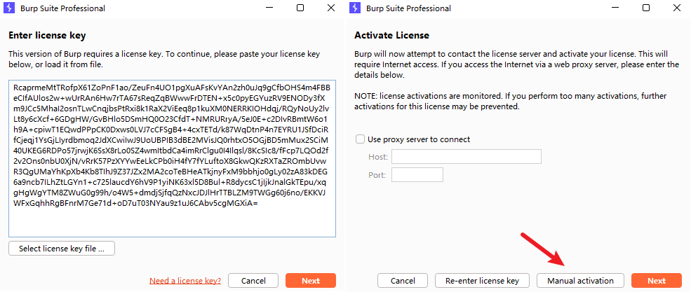
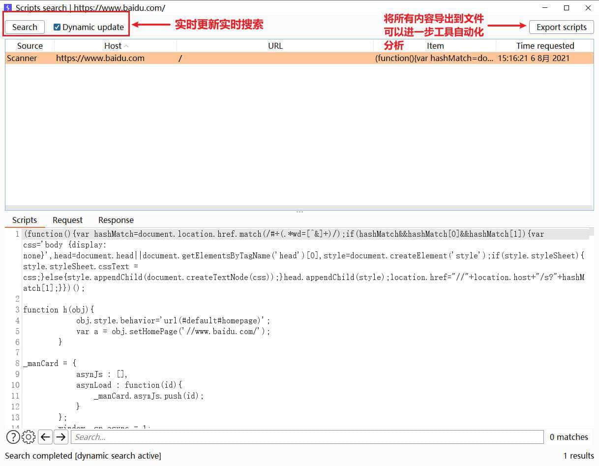
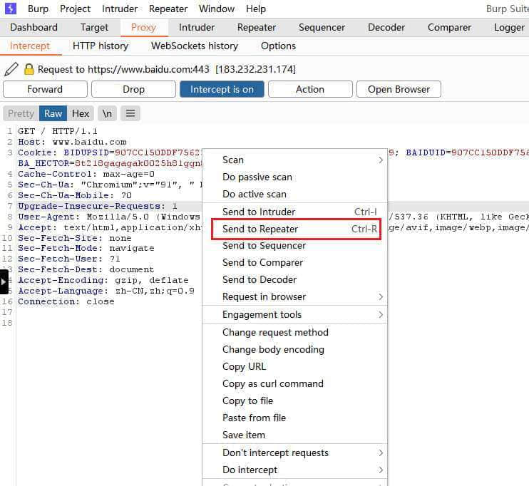
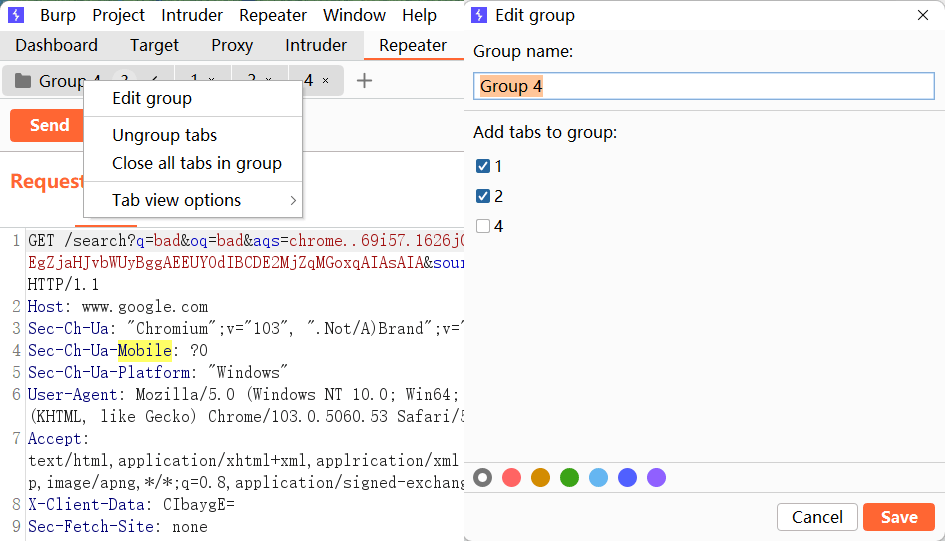

# [BurpSuite](https://www.raingray.com/archives/2179.html)

BurpSuite 集成 Web 渗透测试大部分测试需求，最主要核心功能是作为代理调试 HTTP 数据包，类似的工具有 Fiddler、OWASP ZAP、Caido 等。

学习时先优先掌握基本抓包、改包核心功能，对应 Proxy 和 Repeater 模块，Proxy 用于拦截，Repeater 用于重复发送请求快速调试。它俩日常使用频率最高需要熟练使用，其他模块之后有需求再一个个进行熟悉，有精力再学不迟。

## 目录

-   [目录](#%E7%9B%AE%E5%BD%95)
-   [安装](#%E5%AE%89%E8%A3%85)
-   [模块使用](#%E6%A8%A1%E5%9D%97%E4%BD%BF%E7%94%A8)
    -   [Target](#Target)
        -   [Site map](#Site+map)
        -   [Filter](#Filter)
        -   [Scope](#Scope)
        -   [Issue definitions](#Issue+definitions)
    -   [DashBoard](#DashBoard)
    -   [Proxy](#Proxy)
        -   [Intercept](#Intercept)
        -   [HTTP history](#HTTP+history)
        -   [WebSockets history](#WebSockets+history)
        -   [Proxy Options](#Proxy+Options)
            -   [Intercept Client Responses](#Intercept+Client+Responses)
            -   [Match and Replace](#Match+and+Replace)
            -   [Miscellaneous](#Miscellaneous)
    -   [Repeater](#Repeater)
        -   [标签管理](#%E6%A0%87%E7%AD%BE%E7%AE%A1%E7%90%86)
    -   [Intruder](#Intruder)
        -   [Positions](#Positions)
            -   [Payload Positions](#Payload+Positions)
            -   [Attack type](#Attack+type)
        -   [Payloads（待完成）](#Payloads%EF%BC%88%E5%BE%85%E5%AE%8C%E6%88%90%EF%BC%89)
            -   [Payload Sets](#Payload+Sets)
            -   [Payload Options](#Payload+Options)
            -   [Payload Processing](#Payload+Processing)
            -   [Payload Encoding](#Payload+Encoding)
        -   [Resource Pool](#Resource+Pool)
        -   [Intruder Options](#Intruder+Options)
    -   [Decoder](#Decoder)
    -   [Comparer](#Comparer)
    -   [Logger](#Logger)
    -   [Organizer](#Organizer)
-   [其他功能](#%E5%85%B6%E4%BB%96%E5%8A%9F%E8%83%BD)
    -   [Burp Collaborator](#Burp+Collaborator)
    -   [Upstream Proxy Servers](#Upstream+Proxy+Servers)
    -   [SOCKS Proxy](#SOCKS+Proxy)
    -   [Burp Extensions](#Burp+Extensions)
    -   [录制宏](#%E5%BD%95%E5%88%B6%E5%AE%8F)
-   [快捷键](#%E5%BF%AB%E6%8D%B7%E9%94%AE)
-   [https 原理&CA 证书](#https%E5%8E%9F%E7%90%86%26amp%3BCA%E8%AF%81%E4%B9%A6)
    -   [TLS](#TLS)
    -   [数字证书 (Certificate Authority)+数字签名](#%E6%95%B0%E5%AD%97%E8%AF%81%E4%B9%A6%28Certificate+Authority%29%2B%E6%95%B0%E5%AD%97%E7%AD%BE%E5%90%8D)
    -   [Burp 为什么导入证书就能够解密 HTTPS?](#Burp+%E4%B8%BA%E4%BB%80%E4%B9%88%E5%AF%BC%E5%85%A5%E8%AF%81%E4%B9%A6%E5%B0%B1%E8%83%BD%E5%A4%9F%E8%A7%A3%E5%AF%86+HTTPS%3F)
-   [参考链接](#%E5%8F%82%E8%80%83%E9%93%BE%E6%8E%A5)

## 安装

安装很简单，首先安装 JRE 17 LTS 版本依赖环境，完成后去下载 [Burp Suite Jar 包](https://portswigger.net/burp/releases#professional)和[加载器](https://github.com/h3110w0r1d-y/BurpLoaderKeygen)，不使用 [googleweb/loader](https://github.com/googleweb/loader/releases) 加载器原因是 BurpSuite v2023.2.1 预览版无法使用。

激活工具对应 SHA1 Hash：

```plaintext
PS C:\Users\raingray\Desktop\Burpsuite> certutil -hashfile BurpLoaderKeygen.jar SHA1
SHA1 的 BurpLoaderKeygen.jar 哈希:
f9fb9175a901f4fede20b9d61eb4fadafdd1feea
CertUtil: -hashfile 命令成功完成。
```

将工具和 BurpSuite 都放入同一文件夹。


打开激活码工具。

```plaintext
java -jar BurpLoaderKeygen.jar
```


运行激活码工具 Loader Command 命令打开 BurpSuite。

```plaintext
java -javaagent:BurpLoaderKeygen.jar --add-opens=java.desktop/javax.swing=ALL-UNNAMED --add-opens=java.base/java.lang=ALL-UNNAMED --add-opens=java.base/jdk.internal.org.objectweb.asm=ALL-UNNAMED --add-opens=java.base/jdk.internal.org.objectweb.asm.tree=ALL-UNNAMED --add-opens=java.base/jdk.internal.org.objectweb.asm.Opcodes=ALL-UNNAMED -jar burpsuite_pro_v2023.2.1.jar
```

让你输入 license key。


复制 license。


填入刚刚复制的 license 到 BurpSuite 中点击 next，选择手动激活。如果你直接下一步没有选择手动激活，就不能输入激活码。只能去注册表 `HKEY_CURRENT_USER\Software\JavaSoft\Prefs\burp`，删除 license1 注册信息重新启动即可选择手动安装。



复制 requst field。


粘贴到激活码生成工具 Activation Request 框中去计算得到 Activation Response。


拿到 Activation Response 到 BurpSuite 点击 Next 即可成功激活工具。


到此安装已经完成。在当前目录编写一个 bat 脚本用于快速启动工具，以后使用工具只需打开 start.bat 批处理脚本启动。

```plaintext
chcp 936
@echo off
start javaw -Dsun.java2d.uiScale=1 --add-opens=java.base/jdk.internal.org.objectweb.asm=ALL-UNNAMED --add-opens=java.base/jdk.internal.org.objectweb.asm.tree=ALL-UNNAMED -javaagent:BurpLoaderKeygen.jar -jar burpsuite_pro_v2023.2.1.jar
exit
```

要想更美观可以把 start.bat 做成快捷方式。图标设置为 [burp-suite-professional.ico](https://www.raingray.com/usr/uploads/2022/08/758317002.ico)，运行方式设置为最小化，避免运行起来弹命令行执行窗口。


这里提一嘴大家常说的 BurpSuite Jar 包瘦身。BurpSuite Jar 包这么大是因为要内置不同平台的浏览器，将他们删除即可。


Linux 下可以用 zip 快速删。

```plaintext
zip -qd ./burpsuite.jar "chromium-[macos|linux64]*.zip"
```

不光安装包，初次打开 Burp 活升级版本，会主动释放新版本浏览器到 BurpSuite 数据目录里 burpbrowser 的目录中，不会自动删除旧版浏览器，导致占用存储越来越多。最好每次更新手动删除它们。

Windows 在 `%APPDATA%/BurpSuite/burpbrowser` 目录下。


Linux 在 `~/.BurpSuite/burpbrowser` 目录下。

```plaintext
┌──(kali㉿kali)-[~]
└─$ du -sh ~/.BurpSuite/burpbrowser
389M    /home/kali/.BurpSuite/burpbrowser
```

## 模块使用

### Target

Target 模块主要关注测试目标有哪些和目标的所有请求。

#### Site map

经过 BurpSuite 的 HTTP 请求会用树状图表示，通常在 Recon 阶段尽量爬取所有内容方便测试，此功能把它分为 2 个区域。


区域 1，里面记录着关于所有流进 BurpSuite 的请求绘制成树状图，灰色节点表示还没访问过意思存在，节点签名有个蓝色圆点说明存在一些安全问题，稍后介绍。

区域 2，上半部分 Contents 标签当前浏览站点地图节点所对应的所有请求概览，下半部分 Request/Response 标签展示节点指定请求和响应内容。

切换到 Issues 标签 里面包含问题概览和问题详情介绍，前面站点地图蓝色圆点就是此问题。


这里再提 3 个 Trick。

第一个，Recon 阶段还没结束可以通过 Find comments 找到所有 HTML/JS 注释信息。


第二个，Find scripts。



第三个，分析目标有哪些参数，方便进行参数爆破。


#### Filter


#### Scope

主要用于设置测试目标范围，有时候开启代理会将所有浏览器的请求拦截下来设置范围后我们只需要关注 sitemap 几个目标不会被干扰。这只限定目标明确的情况下，假设挖掘目标是这家公司所有业务，限定死就有可能遗漏发现其他资产。

在 Scope 中 添加 video.kuaishou.com 同时选择，点击 yes 则表示只有在 Scope 内 URL 会被 HTTP History 记录。不记录可以节省硬盘空间，如果是临时项目数据是放在内容中的可以减少内存使用。


此开关在 Proxy -> Options -> Miscellaneous -> Dont't send items to Proxy History or live task, if out of scope


不知道你有没有遇到这种场景，有时你挂上全局代理抓客户端请求，会发现除了客户端请求外，其他软件也有请求乱入。

有时候我们需要记录其他站点流量，只显示定义 sitemap，最有用的一个地方在于 Filter 功能。常用的是 Show only in scope items，保持对某一站点专注。

首先要把 www.baidu.com、tieba.baidu.com 放入 Scope，通过右键可以添加。


切换到 Scope 看到成功添加。


通过设置 Show only in scope items。


最终 sitemap 清净许多。


另一个常见的需求是某个 URL 请求不想被 BurpSuite Proxy 给 Proxy 拦截 和 HTTP History 记录。

1.  通过在 include in scope 设置 any 所有内容拦截记录，Exclude from scope 排除某个 URL。相当于黑名单。
    
    
    
2.  在 Proxy -> Options -> Miscellaneous 开启 Dont't send items to Proxy History or live task, if out of scope 功能，以后 www.baidu.com 所有请求不会记录在 HTTP History 内。
    
3.  Proxy -> Options -> Interception Client Requests，设置并开启只拦截 Scope 范围内请求 Rule。
    
    
    

这里提供我常用的黑名单 JSON，点击设置直接导入即可，也推荐你在日常工作用维护同样的黑名单配置文件，在需要时及时屏蔽其他噪音请求。

```json
{
    "target":{
        "scope":{
            "advanced_mode":true,
            "exclude":[
                {
                    "enabled":true,
                    "host":".*\\.visualstudio.com",
                    "protocol":"any"
                },
                {
                    "enabled":true,
                    "host":".*\\.googleapis.com",
                    "protocol":"any"
                },
                {
                    "enabled":true,
                    "host":".*\\.gvt[0-9].com",
                    "protocol":"any"
                },
                {
                    "enabled":true,
                    "host":".*\\.mozilla.com",
                    "protocol":"any"
                },
                {
                    "enabled":true,
                    "host":".*\\.firefox.com",
                    "protocol":"any"
                },
                {
                    "enabled":true,
                    "host":".*\\.firefoxchina.cn",
                    "protocol":"any"
                },
                {
                    "enabled":true,
                    "host":".*\\.mozilla.net",
                    "protocol":"any"
                },
                {
                    "enabled":true,
                    "host":".*\\.mozilla.org",
                    "protocol":"any"
                },
                {
                    "enabled":true,
                    "host":".*\\.bing.com",
                    "protocol":"any"
                },
                {
                    "enabled":true,
                    "host":".*\\.google.com",
                    "protocol":"any"
                }
            ],
            "include":[
                {
                    "enabled":true,
                    "protocol":"any"
                }
            ]
        }
    }
}
```


另一种场景则是 Chrome 用插件挂代理，浏览器会自动发送请求到 googleapi.com 这种域名上，虽然你也可以使用上面方案解决，但 BurpSuite 内置浏览器已经帮你屏蔽掉这些请求免受干扰。

#### Issue definitions

这里是 BurpSuite Scanner 能够扫描到安全问题列表。初学 Web 安全可以在这里查看漏洞简介和如何修复。


### DashBoard

爬虫，在 1.x 版本叫 spider，2.x 叫 crawl。


Scanner。

  


### Proxy

#### Intercept

打开 BurpSuite 内置 Chromium 浏览器。并确保蓝色按钮是 Intercepti is on，这表示则表示当前拦截开启，所有请求会被 BurpSuite 拦截，Intercepti is off 则拦截关闭，请求还是会发送到 BurpSuite，但不做拦截。


通过内置浏览器的所有 HTTP/HTTPS 请求都会被拦截。


此时可以随意修改 HTTP 请求内容。这里点击 Forward 按钮可以放过浏览器的请求直到页面加载完成，这个按钮的作用就是当前请求不是关注的重点时让其通过，对应 Windows 快捷键 Ctrl + F。


如果点击 Drop 按钮则丢弃请求，不会被发送服务器。


另一个功能比较常用的是修改完请求，Forward 后 HTTP Response 也要拦截。通过鼠标右键打开菜单点击 "Response to this request" 功能即可。


可以看到响应内容被拦截了，还可以把响应内容进行修改，这里我将 titile 改为“众里寻他千百度-raingray”。


的确成功。


#### HTTP history

HTTP history 记录着所有经过 Intercept HTTP 请求和响应，一般可以回溯历史。比方说某个参数存在问题通过 HTTP history 来记录一下防止以后扯皮。

点击请求序号可以标注颜色，第二个功能是添加 Comment。


#### WebSockets history

见命知意，就是 WebSockets 请求历史。

#### Proxy Options

##### Intercept Client Responses


##### Match and Replace

可以对 Proxy 模块的请求和响应进行更改、添加操作，支持简单文本匹配以及正则匹配。

-   Request header
-   Request body
-   Response header
-   Response body
-   Request param name
-   Request param value
-   Request first line

使用也很简单，你要改谁（Type），改什么（Match），改成什么（Replace）。


我经常用来改请求头，有时应用某些目录需要带 Token 才能访问，直接通过 URL 访问不会自动添加 Authorization 头（这个页面没有 JS 给你操作），需要主动设置。


添加成功后访问任意网页都会自动添加此头


另一个应用场景是，后端通过获取请求头来确认用户身份，这就导致越权，可以利用请求替换功能自动替换身份信息，就不需要每次抓包重复修改。

可惜此功能只对 Proxy 生效。如果我想 Repeater 和其他模块也生效，可以借助插件 [ReshaperForBurp](https://github.com/synfron/ReshaperForBurp) 实现。插件用法也简单，先设置规则，然后根据规则做动作。

这里先演示对每个请求新增请求头。

```plaintext
CustomHeader: RequestHeaderValue
```

先设置规则触发条件，这里先选请求作为触发条件，只要有请求发送就触发这条规则。


规则对应动作，选择在原有请求基础上新增个请求头。


每次修改完规则后需要点右下角 Save 进行保存，保存完需要启用这条规则勾选 Enabled 生效。


如果你想要在其他模块在发起请求时能够执行此规则，需要设置作用域。


这里只勾选了 Proxy 和 Repeater 模块，当 Proxy 和 Repeater 发起请求时会自动添加请求头，其他模块不会生效。


除了新增请求头很常见外，另一个需求是在原有请求头上添加内容，这里演示，在自定义请求头 CustomHeader 值后面添加内容 `_NewContent`。

```plaintext
CustomHeader: RequestHeaderValue_NewContent
```


规则很简单，先获取原有请求头 CustomHeader 值，通过正则在文本末尾替换新内容，在重新作用到 CustomHeader 上。


##### Miscellaneous

-   Disable web interface at [http://burpsuite](http://burpsuite/)
-   Suppress Burp error messages in browser

这两个选项很可能让前端检查到 BurpSuite 特征，给你拦截，一般关闭接口和错误信息展示。

### Repeater

通常测试中拦截到请求需要反复调试发送出去，Repeater 可以做到这点。

用法是拦截到一个请求鼠标右键呼出菜单，或者快捷键 Ctrl + R。



切换到 Repeater 模块（快捷键 Ctrl + Shift + R）就能查看通过 Proxy 模块发送过来的请求放在名为 3 的标签中。


Repeater 和 Proxy 一样能够修改请求，改完后点击左上角橘色 Send 按钮发送请求。在 BurpSuite 里修改 POST 请求不需要计算 Content-Length 字节大小，会自动修改好，无需操心。


#### 标签管理

如果有多个请求怎么办呢？发送一堆过来谁是谁啊，在日常测试过程中，Repeater 有时候同时达到 100 多个选项卡，对标签进行备注就很有必要，下次回顾能快速分辨每个选项卡作用。

双击即可修改标签名称。


多个标签还可以打成一个标签组。


选择添加那几个标签。


标签组最好和标签一样取个有意义的名字方便后续回顾，你也可以自己定义个颜色体系，比如红色标签组是存在漏洞的，灰色则是测试中。

添加进去要是有问题还可以右键标签组 Edit group 进行更改。



编辑标签组另外两个功能 Ungroup tabs、Close all tabs in group，Ungroup tabs 是解散标签组，里面标签恢复原状，Ungrouo tabs 是将组内标签全部关闭。

关闭后的标签要想全部恢复，目前做不到，只能恢复组内第一个标签。如果你手动关闭了多个标签也是如此，只能恢复前一个关闭的标签。


要是觉得某个标签需要更换到其他组，只需右键标签切换即可。


### Intruder

发送请求过来。

#### Positions

此标签主要设置攻击位置和怎么攻击。

##### Payload Positions

定义 `$` 占位符，后续定义的值会将其替换。

##### Attack type

1.  Sniper，按照变量定义顺序，给每个变量都完整跑一便指定的 Payload。
    
    比如定义了变量 a 和变量 b，Payload 数据是数字 1 和 2，那么先把每次按行读取 Payload 填充到变量 a，变量 b 也是如此，共跑 4 次请求。
    
2.  Battering ram，同时给所有变量替换成一样的 Payload，等同于一起跑同一个 Payload。
    
3.  Pitchfork，同时给所有变量跑多个不同 Payload。
    
    假如定义了变量 1 和 变量 2，启动攻击后 Payload Sets 1 将对应变量 1，Payload Sets 2 对应变量 2，以此类推。
    
    总请求数等同于行数最小的 Payload。如果第一个 Payload 设置为 4 个，第二个设置为 5 个，只会参照一个的数据发送 4 个请求，反之亦然。
    
4.  Cluster bomb，交叉攻击，列出所有排列组合后的结果。
    
    同时定义变量 1 和变量 2，每遍历 Payload Set 1 一个值的同时将把 Payload Sets 2 都遍历完，总请求数 = (Patload Set 1 \* Patload Set 2)
    
    ```plaintext
     for (int i = 0; ) {
         for () {
    
         }
     }
    ```
    

可以扫描指定参数漏洞。


#### Payloads（待完成）

如何攻击，灵活配置 Payload。

##### Payload Sets

Payload set：这里的数字是根据 Attack type 来确定的，不同 Attack type 数量不同，选择不同数字就可以对不同变量进行填充不同 Payload，比如数字 1 对应变量 1。

Payloads type:

-   Number：设置数字范围；
-   Null payloads：发送空载荷，拔高线程同一功能并发，针对乐观锁机制，在同一时间可以兑换多张礼品卡，有可能成功处理；
-   Brute forcer：设置一堆数据，可以对这些数据设置排列组合。最小出现 4 个字符，最多出现 10 个字符，这是规则。

##### Payload Options

##### Payload Processing

可以对 Poayload 进行 hash、encoding、大小写、空白字符等等常规操作。

Payload 处理规则说明：

-   Add prefix，给 Payload 增加前缀；
-   Add suffix，给 Payload 增加后缀；
-   Match/replace，给出指定字符并匹配替换 Payload；
-   Substring，截取 Payload 部分字符；
-   Reverse substring，反转 Payload 部分字符；
-   Modify case：
    -   To lower case，全部小写；
    -   To upper case，全部大写；
    -   To Propername，首字母大写其余全部小写；
    -   To ProperName，单词首字母大写后面单词默认不处理，比如 toms Water 会转换程 Toms Water，仅 Toms 单词 T 大写，Water 默认不处理；
-   Encode，有 URL、HTML、Base64、HEX、JavaScript/Oracle/MySQL/Microsoft SQL Server 字符串函数编码；
-   Decode，有 URL、HTML、Base64、Hex 解码；
-   Hash，常见 Hash 算法；
-   Add raw payload：
    -   Append preprocessed payload，在 Payload 后面再添加一个原始 Payload；
    -   Prepend preprocessed payload，在 Payload 签名再添加一个原始 Payload；
-   Skip if matches regex，如果正则匹配上 Payload 就跳过去不发送请求，可以用来批量筛不想要的 Payload；
-   Invoke Burp extension，调用扩展来处理 Payload。

##### Payload Encoding

Intruder 启动时要不要对指定字符进行 URL 编码，默认是对以下字符做 URL 编码。

```plaintext
 ./\=<>?+&*;:"{}|^`#
```

#### Resource Pool

资源设置，以前在 Options 里设置请求线程，现在统一改为资源池，

#### Intruder Options

### Decoder

Decoder 用于编码、解码、哈希操作。个人觉得不太好使，一般用 [CyberChef](https://gchq.github.io/CyberChef/) 多一些，离线方便使用。

主要操作方法是复制文本在在右侧下拉选项框，选择 Hash 还是编/解码。


一般的操作是选中参数右键使用指定编码。


个人更常用到以下快捷键进行操作：

-   Ctrl + u，对关键字符进行 URL 编码
-   Ctrl + Shift + U，URL 解码
-   Ctrl + b，对关键字符进行 Base64 编码
-   Ctrl + Shift + B，对关键字符 Base64 解码
-   Ctrl + h，对关键字符进行 HTML 编码
-   Ctrl + Shift + H，对 HTML 进行解码

### Comparer

比对请求/响应内容。

使用场景是两个大量相同的文本通过比较差异来确定哪里不同。

右键 Send Comparer，直接将请求发送过去。也可以点 Paste 直接粘贴剪贴板内容。


第一个发送过去的比较文本会在上面，第二个是下面，按照顺序排列。比较方式通常选择 Words。

具体差异可以看左下角三个颜色标识，橘色 MOdified、蓝色 Deleted、黄色 Added。


右下角 Sync views 是个很好用的功能，可以让两个窗口在移动时同步，不会出现左边拖一下，右边再重复操作。

### Logger

记录 BurpSuite 所有发送的请求，比如插件、被动扫描等等，最常见就是做调试用。

要注意关闭 BurpSuite 时它不会保存到 Project File 里，重启所有请求将全部消失。

### Organizer

在 2023.5 版本中引入此功能，主要就是存放个人感兴趣的请求，还可以对请求做文字笔记，方便复盘或者存放漏洞记录用。

以前没法子的时候存放漏洞记录，我的做法是 Repeater 中分组，现在好多了。

## 其他功能

还有很多功能没有写到，只是列举个人常用的，其余一年遇不到一回的使用场景完全遇到再看官方文档。

想想是怎么学会 Linux Command 的？脑子是记不住所有操作步骤，需要靠 manual 查询辅助我们工作，BurpSuite 也不需要让你一下全部掌握相关知识点和功能使用场景，但是遇到不懂的要会查。

点开任何模块我们都能找到问号 ，点开就是当前版本的离线文档，推荐去看在线的最新版，可以了解到更新哪些信息 [Burp Suite documentation](https://portswigger.net/burp/documentation)。

### Burp Collaborator

Burp Collaborator 和网上 DNSLog 平台一致，用于展示对方服务器是否有发送 DNS 查询或 HTTP 请求。


如果测试是在内网进行呢，可以在本地运行 Collaborator。

```plaintext
java -jar burp.jar --collaborator-server
```

最后 Project options -> Misc -> Burp Collaborator server 将地址指向本机即可。

这种本地设置只能接受 HTTP 请求不支持 DNS 和 HTTPS，在设置方面需要启用 `Poll over unencrypted HTTP`。


### Upstream Proxy Servers

UserOPtions -> Upstream Proxy Servers

将流量转发到指定代理服务器。使用方法看看 Burp 界面介绍就行，其中比较重要是目标主机可以填 `*` 通配符，表示抓取所有 Burp 接收过来的站点。

### SOCKS Proxy

在工作中发现对方 WAF 把我给封掉......不得不开启 UserOPtions -> SOCKS Proxy 手动测试。

如果同时启用 Upstream Proxy Server 那 Upstream Proxy Server 请求会通过 SocksProxy 发送。

或者你有多个代理可以使用 [mubeng](https://github.com/kitabisa/mubeng) 帮助你自动切换 HTTP 代理 IP，避免封禁。

### Burp Extensions

-   Active Scan++
-   J2EEScan
-   [Wsdler](https://github.com/NetSPI/Wsdler)
-   Additional Scanner Checks
-   Backslash Powered Scanner
-   [captcha-killer](https://github.com/c0ny1/captcha-killer)，验证码识别
-   Error Message Checks
-   [Highlighter And Extractor](https://github.com/gh0stkey/HaE)
-   Content Type Converter
-   [authz](https://github.com/portswigger/authz)
-   [Autorize](https://github.com/Quitten/Autorize)
-   Param Miner
-   [burp-UnicodeAutoDecode](https://github.com/KagamigawaMeguri/burp-UnicodeAutoDecode)
-   BurpCrypto

### 录制宏

获取页面中 Token 值。

参考链接：

-   [经验分享 | Burpsuite 中宏的使用](https://www.freebuf.com/articles/web/156735.html)

## 快捷键

天天鼠标点慢不慢呐？整点快捷键提高效率。

文本编码，加上 Shift 键反向解码。

-   Ctrl + \[Shift\] + U，对所选文本进行 URL 编码。
-   Ctrl + \[Shift\] + H，对所选文本进行 HTML 编码。
-   Ctrl + \[Shift\] + B，对所选文本进行 Base64 编码。

发送数据到指定模块

-   Ctrl + R，发送到 Repeater 模块
-   Ctrl + I，发送到 Intruder 模块

切换到指定模块

-   Ctrl + Shift + T，切换至 Target
-   Ctrl + Shift + R，切换至 Repeater
-   Ctrl + Shift + P，切换至 Proxy
-   Ctrl + Shift + I，切换至 Intruder
-   Ctrl + Shift + D，切换到 Dashboard

Proxy 模块操作

-   Ctrl + T，开关代理功能。
-   Ctrl + F，把拦截的当前请求转发至服务器。
-   Ctrl + Shift + S，经常需要关注响应内容，手动设置下。

Repeater 模块操作

-   Ctrl + "+"，切换到下一个选项卡，一般我会重置为 Ctrl + Table，单手操作方便。
-   Ctrl + "-"，返回上一个选项卡，一般我会重置为 Ctrl + Shift + Table，单手操作方便。
-   Ctrl + Space，重放请求，不过会跟输入法切换中英文冲突，通常我手动设置为 Ctrl + Shift + Space
-   Ctrl + w，删除当前选项卡

编辑快捷键

-   Ctrl + D，删除整行
-   Ctrl + "↑"，回到第一行，官方定义的快捷键 Ctrl + Home 也能达到，不过在键盘上太远不方便操作。
-   Ctrl + "↓"，回到最后一行
-   Ctrl + Shift + "↑"，快速选中当前光标位置和首行之间的内容。
-   Ctrl + Shift + "↓"，快速选中当前光标位置和首尾之间的内容。
-   Ctrl + "→"，向右跳过一个单词
-   Ctrl + "←"，向左跳过一个单词
-   Ctrl + Shift + "→"，向右选中一个单词
-   Ctrl + Shift + "←"，向左选中一个单词
-   Ctrl + Delete，删除右边一个单词
-   Ctrl + ","，跳转到下一个匹配的值上

这些默认快捷键定义在 User options -> Misc -> Hotkeys。


## https 原理&CA 证书

https 只是解决传输过程的安全性。


### TLS

1.先与对方连接。

### 数字证书 (Certificate Authority)+数字签名

问题：只用证书，那证书被掉包怎么办？

找第三方权威机构，确认 Server 是它自己。

2.证书中心 (CA) 把域名相关信息生成数字证书，发给客户端，不怕你劫持，我会取验证信息真伪，证书文件是存放在 Server 中。

解决问题：掉包解决方法 ==>> 采用数字证书验证方法，对证书内容进行防伪造处理。

阮一峰在《数字签名是什么？》这篇文章中提到相关概念。

> 数据摘要 --> 数字签名  
> Server 传输数据先用 Hash 函数，生成数据摘要（digest）。再用私钥，对这个摘要加密，生成"数字签名"（signature），将数字签名放在数据下面一起发送。
> 
> 数字签名 --> 数据摘要  
> Client 收到后整个包后，用公钥解出数据签名得到信件的摘要，用 Hash 函数对接收到的数据生成摘要，对比解出来的摘要，一致就未被篡改。

3.客户端收到服务器数字证书以后，会到浏览器中找到证书中心，拿公开的公钥，去解密 Server 证书中的证书签名。


这个签名 (由证书里面儿加密算法生成)，被 CA 私钥加密过 (只是签名被私钥加密证书内容不做加密)，就算中间人篡改证书内容也无法重新生成证书签名 (因为私钥在 CA 那里)，他改了证书内容用自己的私钥加密后，Client 就无法解开。

最后自己用证书中指定的加密算法，对 Server 证书内容加密生成数据摘要，比对从证书签名解出来这个数据摘要，是否一致，不一致就是证书被篡改，会在页面显示告警信息。CA 和数据比对成功后，加密一段随机值发过去。


### Burp 为什么导入证书就能够解密 HTTPS?

Burp 工作在客户端和服务中之间 (中间人)

1.  向 Server 发送一个请求会返回证书，Burp 去验证，看有没有这个机构，如果是真的就继续用自己的私钥加密证书签名 + 证书传给客户端。
    
2.  客户端收到后也去浏览器验证 Burp 这个证书是不是真的，由于已经导入到浏览器了，所以肯定能用 Burp 证书中心的公钥解开证书签名，双方就开始通信。
    
3.  发出去时证书会被 Burp 拦截替换成服务器的。
    

## 参考链接

-   [https://www.youtube.com/playlist?list=PLoX0sUafNGbH9bmbIANk3D50FNUmuJIF3，BurpSuite](https://www.youtube.com/playlist?list=PLoX0sUafNGbH9bmbIANk3D50FNUmuJIF3%EF%BC%8CBurpSuite) 官方视频教学，建议完整观看一遍
-   [https://portswigger.net/burp/documentation，BurpSuite](https://portswigger.net/burp/documentation%EF%BC%8CBurpSuite) 官方文档，你遇到的所有功能上不会使用的问题都可以找到答案，建议学会工具后完整看一遍实操一遍
-   [https://www.zhihu.com/question/52493697](https://www.zhihu.com/question/52493697)
-   [https://showme.codes/2017-02-20/understand-https](https://showme.codes/2017-02-20/understand-https)
-   [https://github.com/youngwind/blog/issues/108](https://github.com/youngwind/blog/issues/108)
-   [http://www.ruanyifeng.com/blog/2006/12/notes\_on\_cryptography.html](http://www.ruanyifeng.com/blog/2006/12/notes_on_cryptography.html)
-   [http://www.ruanyifeng.com/blog/2011/08/what\_is\_a\_digital\_signature.html](http://www.ruanyifeng.com/blog/2011/08/what_is_a_digital_signature.html)
-   [https://blog.csdn.net/winwill2012/article/details/71774469](https://blog.csdn.net/winwill2012/article/details/71774469)
-   [https://portswigger.net/blog/burp-suite-2-0-beta-now-available，1.x和2.x区别](https://portswigger.net/blog/burp-suite-2-0-beta-now-available%EF%BC%8C1.x%E5%92%8C2.x%E5%8C%BA%E5%88%AB)
-   [https://portswigger.net/blog/burp-2-0-where-are-the-spider-and-scanner，2.x爬虫位置更改](https://portswigger.net/blog/burp-2-0-where-are-the-spider-and-scanner%EF%BC%8C2.x%E7%88%AC%E8%99%AB%E4%BD%8D%E7%BD%AE%E6%9B%B4%E6%94%B9)
-   [破解 BurpSuite Pro 2022.9 (有变化)](https://mp.weixin.qq.com/s/y4NOtfKx90zCJsedBlD8-g)

最近更新：2023 年 12 月 30 日 14:13:17

发布时间：2020 年 01 月 20 日 02:17:00
