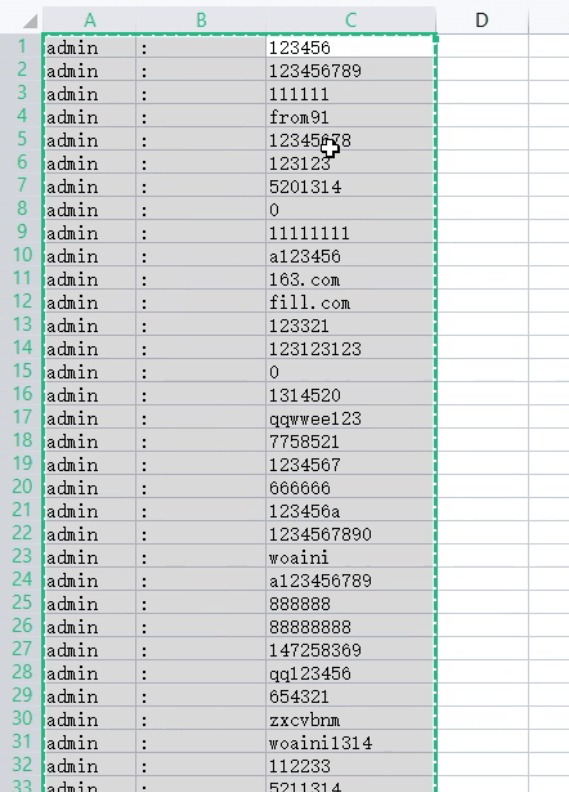
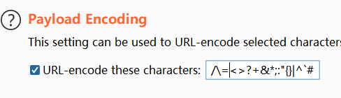
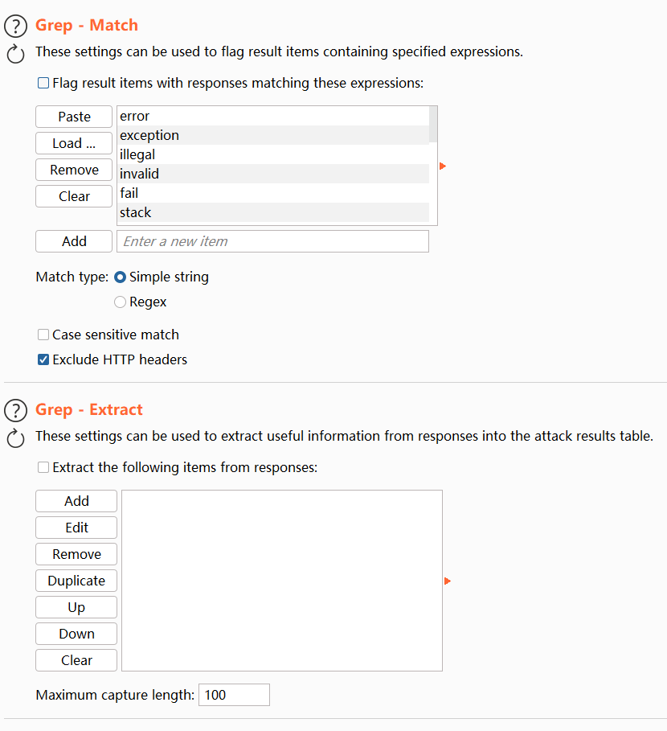

# [CAPTCHA Bypass](https://www.raingray.com/archives/4400.html)

在 Web 枚举账户时会遇到验证码，通过二次验证导致工作无法继续，验证码是爆破中最大的拦路虎。

## 目录

-   [目录](#%E7%9B%AE%E5%BD%95)
-   [图片验证码](#%E5%9B%BE%E7%89%87%E9%AA%8C%E8%AF%81%E7%A0%81)
    -   [常见逻辑错误](#%E5%B8%B8%E8%A7%81%E9%80%BB%E8%BE%91%E9%94%99%E8%AF%AF)
    -   [图片验证码识别](#%E5%9B%BE%E7%89%87%E9%AA%8C%E8%AF%81%E7%A0%81%E8%AF%86%E5%88%AB)
-   [短信验证码](#%E7%9F%AD%E4%BF%A1%E9%AA%8C%E8%AF%81%E7%A0%81)

## 图片验证码

验证码生成方案：

1.  产生随机数
2.  将随机数写入图片
3.  将随机数写入 SESSION
4.  返回图片给前端

```php
<?php

session_start();

$width = !(empty($_GET['width'])) ? $_GET['width'] : '50';
$height = !(empty($_GET['height'])) ? $_GET['height'] : '34';

$image = imagecreate($width, $height);
$bcolor = imagecolorallocate($image, 0, 0, 0); // 验证码图片底色
$fcolor = imagecolorallocate($image, 255, 255, 255); // 验证码颜色

$str = '0123456789';

// 验证码
$rand_str = '';

// 随机取出 4 位数
for ($i = 0; $i < 4; ++$i) {
    $k = mt_rand(1, strlen($str)); // 4
    $rand_str .= $str[$k - 1];
}

// 验证码写入到 SESSION
$_SESSION['verifycode'] = $rand_str;

imagefill($image, 0, 0, $bcolor);
imagestring($image, 7, 7, 10, $rand_str, $fcolor);

header('content-type:image/png');
imagepng($image);
```

验证码验证方案：

1.  检查传输过来的验证码是否为空
2.  检查验证码是否与 SESSION 中存入的验证码一致
3.  验证码比对错误或者其他业务逻辑错误（比如登录、查询等），则滞空验证码，比如 null 或者空字符串。

### 常见逻辑错误

1.  验证错误不重新生成验证码，或者清空验证码。修复思路：在密码错误后将验证码滞空，下次登陆时只要你传来的验证码是空字符串则返回错误，不是空的肯定和空字符串比对产生错误。
    
2.  活取到的验证码响应输出结果
    
3.  验证码有效期过长
    
4.  验证码 4 位数长度过短可以爆破
    
5.  验证码可以重复使用
    
6.  验证码只是判断不为空，随意输入字符不校验具体内容
    
7.  验证码混淆程度不够如四则运算、数字、数字加字符验证码可以被 OCR 识别，可以搞个本地机器学习去解决此问题，成本很低，github 项目：git4woo/reCAPTCHA。像点击、滑动验证码听说部分黑灰产有解决方案，暂时无法搞定。
    
8.  万能验证码，开发为了方便测试设定了某些验证码为固定值，让它永远是正确的不失效。
    
    ```plaintext
    123456
    123123
    000000
    111111
    222222
    333333
    444444
    555555
    666666
    777777
    888888
    999999
    321321
    321123
    123321
    ```
    
9.  有一些是判断账户错了几次密码，在数据库上加错误次数来显示验证码，限制验证错误次数，可以在用户名处加空格绕过，因为加了空格系统认为这是个全新账户，错误验证次数是零。
    
10.  有错误多了就返回 Cookie，这个 Cookie 就是用于标识当前用户需要验证码，把 Cookie 删除即绕过。
    
11.  使用 IP 做限制，每次错误就写错误次数到库里。
    
    PHP 获取 IP 的三种方式（还有其他的比如 CDN IP 头）：
    
    ```php
    if (isset($_SERVER['HTTP_X_FORWARDED_FOR'])) {
    $id = $_SERVER['HTTP_X_FORWARDED_FOR'];
    } elseif (isset($_SERVER['HTTP_CLIENT_IP'])) {
    $id = $_SERVER['HTTP_CLIENT_IP'];
    } else {
    $id = $_SERVER['REMOTE_ADDR'];
    }
    ```
    
    由服务器自主发送的请求头可以伪造：Client-IP，X-Forwarded-For，Cdn-Src-Ip。
    
    无法伪造：REMOTE\_ADDR，获取的是 TCP 连接 HOST。
    
    主要看业务逻辑怎么做，如果没必要取代理或者其他 CDN 头，用 REMOTE\_ADDR 即可。
    
    Chrome 插件：ModHeader 更改请求头。
    
12.  401 验证绕过
    
    使用 Excel 分 3 列，格式化字典，替换 tab 键：
    
    
    
    爆破时要注意取消 URL 编码，防止对等号 URL 编码：
    
    
    
    介绍了 grep 排除错误，这样来确认爆破成功：
    
    
    

### 图片验证码识别

简单验证码识别，不是调 OCR 付费接口就是，本地机器学习。

-   [https://github.com/sml2h3/ddddocr](https://github.com/sml2h3/ddddocr) 识别验证码
-   [https://github.com/Ta0ing/captcha-killer-java8](https://github.com/Ta0ing/captcha-killer-java8) 调接口

## 短信验证码

短信验证码发送逻辑（需要画图写清失败和成功逻辑走向）：

1.  获取参数中手机号，做数字格式校验
2.  生成数字或字母混合验证码
3.  发送验证码
4.  发送成功将验证码和手机号作为 Key:Value 存入 Redis 数据库

短信验证码验证逻辑是：

1.  获取参数中验证码，做格式校验
2.  验证发送参数中验证码和 Redis 中是否一致

大部分绕过逻辑和图片验证码差不多。

稍有不同的是发送验证码可以添加逗号如：

```plaintext
13412341234,13412341111
```

这样可能把验证码一起发送到另一个手机号，后端 API 能够同时向多个手机号发送短信，邮件也是如此。这个逻辑原本是从阿里云短信服务的文档中看到的，是正常对多个手机号发短信，但现实中很多验证码业务逻辑都是向一个手机号发送，利用此功能可能绕过限制。

另一处就是使用多线程并发对同一个手机号发送短信，用于判断对方有没实现锁机制。

最近更新：2023 年 09 月 04 日 14:06:36

发布时间：2022 年 09 月 07 日 22:32:00
