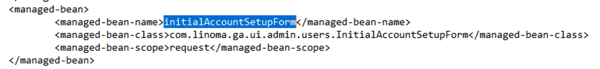
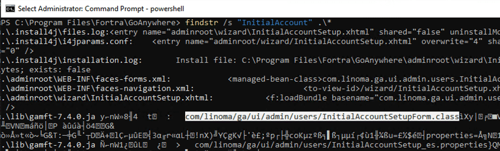
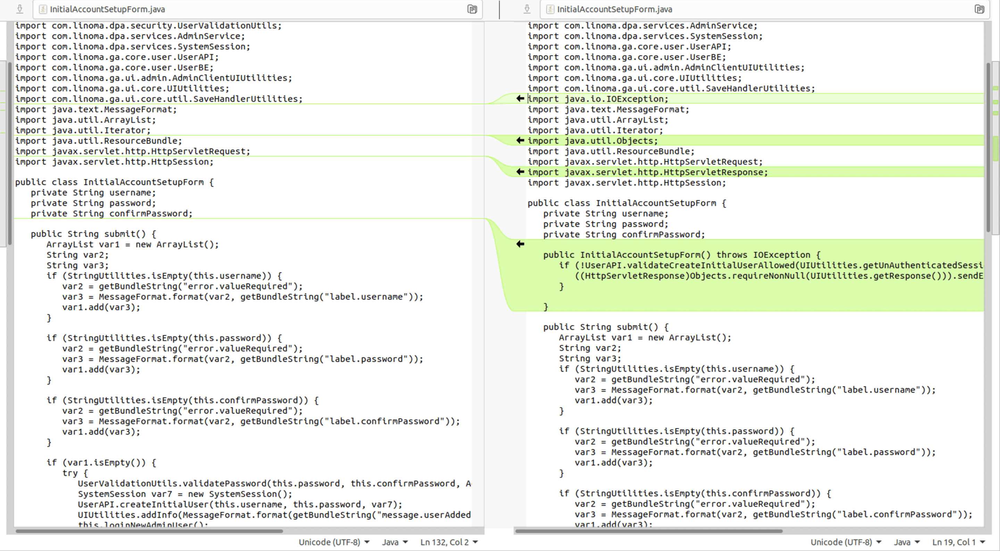
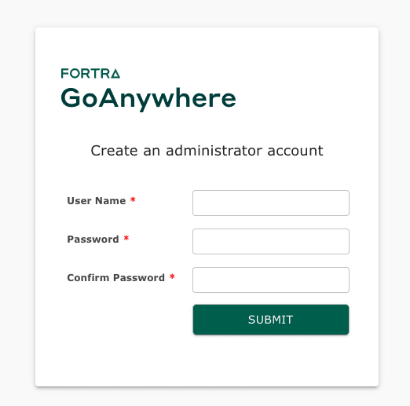
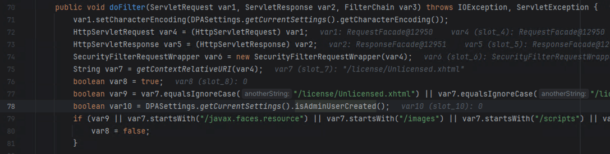
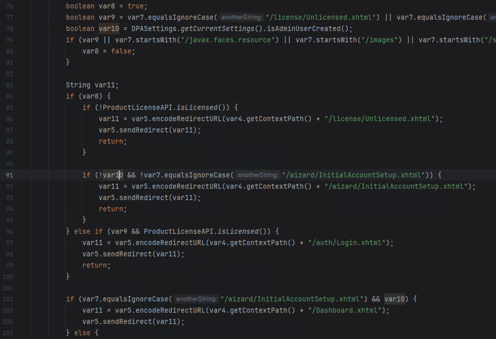
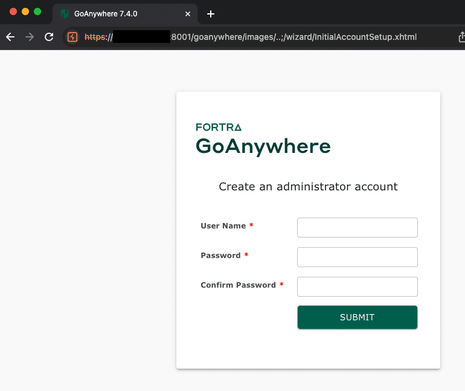
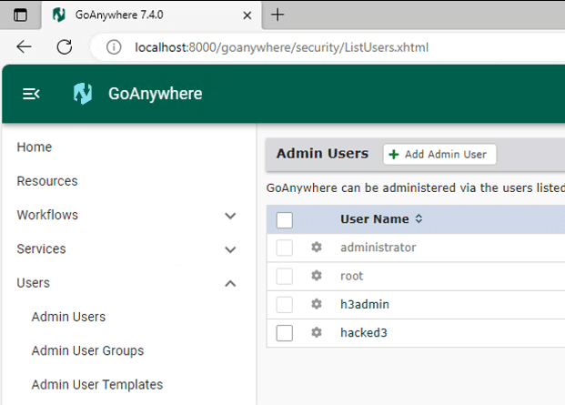
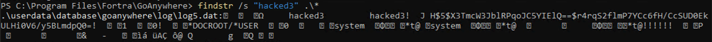

# CVE-2024-0204：Fortra GoAnywhere MFT 身份验证绕过深入 Horizon3.ai --- CVE-2024-0204: Fortra GoAnywhere MFT Authentication Bypass Deep-Dive – Horizon3.ai

# CVE-2024-0204: Fortra GoAnywhere MFT Authentication Bypass Deep-Dive  
CVE-2024-0204：Fortra GoAnywhere MFT 身份验证绕过深度挖掘

by [Zach Hanley](https://www.horizon3.ai/author/zhanley/ "Posts by Zach Hanley") | Jan 23, 2024 | [Blog](https://www.horizon3.ai/category/blog/), [Red Team](https://www.horizon3.ai/category/blog/red-team/)  
饰 Zach 汉利 | 二〇二四年一月二十三日 | 博客，红队

On January 22, 2024 Fortra posted a [security advisory](https://www.fortra.com/security/advisory/fi-2024-001) for their GoAnywhere MFT product. This advisory details an authentication bypass vulnerability, CVE-2024-0204, that allows an unauthenticated attacker to create an administrative user for the application. Customers were made aware of the issue by an internal security advisory post and patch made available on December 4, 2023, in which researchers [malcolm0x](https://twitter.com/malcolmx0x) and [Islam Elrfai](https://twitter.com/IslamRalsaid1) were originally credited with the discovery. In 2023, file transfer applications were a [top target](https://www.horizon3.ai/moveit-transfer-cve-2023-34362-deep-dive-and-indicators-of-compromise/) by threat actors. Our POC can be found [here](https://github.com/horizon3ai/CVE-2024-0204).  
2024 年 1 月 22 日，Fortra 发布了 GoAnywhere MFT 产品的安全公告。此公告详细介绍了身份验证绕过漏洞 CVE-2024-0204，该漏洞允许未经身份验证的攻击者为应用程序创建管理用户。客户通过 2023 年 12 月 4 日发布的内部安全咨询帖子和补丁了解了这个问题，其中研究人员 malcolm 0x 和 Islam Elrfai 最初被认为是这一发现的原因。在 2023 年，文件传输应用程序是威胁行为者的首要目标。我们的 POC 可以在这里找到。

### Finding The Differences 发现差异

The advisory mentions that the endpoint `/InitialAccountSetup.xhtml` can be deleted and the service restarted to mitigate the issue. Looking through the application directories, we find that this endpoint is mapped to the  `com.linoma.ga.ui.admin.users.InitialAccountSetupForm` class  by inspecting the file `GoAnywhere/adminroot/WEB-INF/forms-faces.xml`.  
该公告提到，可以删除端点 `/InitialAccountSetup.xhtml` 并重新启动服务以缓解问题。通过查看应用程序目录，我们发现通过检查文件 `GoAnywhere/adminroot/WEB-INF/forms-faces.xml` ，这个端点被映射到了 `com.linoma.ga.ui.admin.users.InitialAccountSetupForm` 类。

[↓↓↓](https://p7i3u3x3.rocketcdn.me/wp-content/uploads/2024/01/Screenshot-2024-01-23-at-2.03.34%E2%80%AFPM.png)  
  
  Figure 1. Endpoint to Class Mapping  
图 1.端点到类的映射  
  
[↑↑↑](https://p7i3u3x3.rocketcdn.me/wp-content/uploads/2024/01/Screenshot-2024-01-23-at-2.03.34%E2%80%AFPM.png)

Using advanced tooling, we find that the `GoAnywhere/lib/gamft-7.4.0.jar` project defines that class.  
使用高级工具，我们发现 `GoAnywhere/lib/gamft-7.4.0.jar` 项目定义了该类。

[↓↓↓](https://p7i3u3x3.rocketcdn.me/wp-content/uploads/2024/01/Screenshot-2024-01-23-at-2.11.13%E2%80%AFPM.png)  
  
  Figure 2. Finding the InitialAccountSetupForm class  
图 2.查找 InitialAccountSetupForm 类  
  
[↑↑↑](https://p7i3u3x3.rocketcdn.me/wp-content/uploads/2024/01/Screenshot-2024-01-23-at-2.11.13%E2%80%AFPM.png)

Comparing the jar’s for gamft between 7.4.0 and 7.4.1 reveals that several additional checks were added to the initializer for the InitialAccountSetupForm class.  
比较 7.4.0 和 7.4.1 中 gamft 的 jar，可以发现在 InitialAccountSetupForm 类的初始化器中添加了几个额外的检查。

[↓↓↓](https://p7i3u3x3.rocketcdn.me/wp-content/uploads/2024/01/Screenshot-2024-01-23-at-3.26.37%E2%80%AFPM.png)  
  
   
  
[↑↑↑](https://p7i3u3x3.rocketcdn.me/wp-content/uploads/2024/01/Screenshot-2024-01-23-at-3.26.37%E2%80%AFPM.png)

InitialAccountSetupForm.java

When installing GoAnywhere, the application will first direct users to this endpoint to set up a new administrative user.  
安装 GoAnywhere 时，应用程序将首先将用户定向到此端点以设置新的管理用户。

[↓↓↓](https://p7i3u3x3.rocketcdn.me/wp-content/uploads/2024/01/Screenshot-2024-01-23-at-2.23.11%E2%80%AFPM.png)  
  
  Figure 3. Add Administrative User During Install  
图 3.在安装过程中添加管理用户  
  
[↑↑↑](https://p7i3u3x3.rocketcdn.me/wp-content/uploads/2024/01/Screenshot-2024-01-23-at-2.23.11%E2%80%AFPM.png)

After install, requesting the supposed vulnerable endpoint directly did not allow us access to the same page and instead redirects the user to the `/Dashboard.xhtml` endpoint and finally to `/auth/Login.xhtml` because the user is not authenticated.  
安装后，直接请求假定的易受攻击端点不允许我们访问同一页面，而是将用户重定向到 `/Dashboard.xhtml` 端点，最后重定向到 `/auth/Login.xhtml` ，因为用户未经验证。

Finding this behavior in the application leads us to the `com.linoma.dpa.security.SecurityFilter` class. This class is called on all requests and performs the `doFilter()` function, which performs checks for which endpoints are requested and based on the endpoints, user context, and application settings will allow the request to be routed to the correct endpoint.  
在应用程序中发现这种行为将我们引向 `com.linoma.dpa.security.SecurityFilter` 类。该类在所有请求时调用，并执行 `doFilter()` 函数，该函数检查请求的端点，并根据端点、用户上下文和应用程序设置将请求路由到正确的端点。

[↓↓↓](https://p7i3u3x3.rocketcdn.me/wp-content/uploads/2024/01/Screenshot-2024-01-23-at-11.52.58%E2%80%AFAM.png)  
  
  Figure 4. SecurityFilter class  
图 4. SecurityFilter 类  
  
[↑↑↑](https://p7i3u3x3.rocketcdn.me/wp-content/uploads/2024/01/Screenshot-2024-01-23-at-11.52.58%E2%80%AFAM.png)

Inspecting the SecurityFilter class more closely, we find that there are a couple explicit areas that deal with requesting the `/InitialAccountSetup.xhtml` endpoint mentioned in the advisory.  
更仔细地检查 SecurityFilter 类，我们发现有两个显式区域处理咨询中提到的请求 `/InitialAccountSetup.xhtml` 端点。

1.  On line 91, if there is no admin user created already and the path is not `/wizard/InitialAccountSetup.xhtml` then it will properly route you to this setup page.  
    在第 91 行，如果没有创建管理员用户，并且路径不是 `/wizard/InitialAccountSetup.xhtml` ，则它将正确地将您路由到此设置页面。
2.  On line 102, if there is an admin user created already and the path is `/wizard/InitialAccountSetup.xhtml` then redirect to `/Dashboard.xhtml`.  
    在第 102 行，如果已经创建了管理员用户，并且路径为 `/wizard/InitialAccountSetup.xhtml` ，则重定向到 `/Dashboard.xhtml` 。

[↓↓↓](https://p7i3u3x3.rocketcdn.me/wp-content/uploads/2024/01/Screenshot-2024-01-23-at-2.29.52%E2%80%AFPM-1.png)  
  
  Figure 5. InitialAccountSetup logic  
图 5. InitialAccountSetup 逻辑  
  
[↑↑↑](https://p7i3u3x3.rocketcdn.me/wp-content/uploads/2024/01/Screenshot-2024-01-23-at-2.29.52%E2%80%AFPM-1.png)

We considered the patches we observed and this logic, and without a way to pass the `isAdminUserCreated` check we were unsure exactly how this bypass could occur. Instead of using logic, and instead using our spidey senses, we considered if possibly there was a path normalization issue. Classically for Tomcat based applications, there exist path traversal issues when the request contains `/..;/`. Trying to request the supposed vulnerable endpoint now with a request that looks like `https://192.168.1.1:8001/goanywhere/images/..;/wizard/InitialAccountSetup.xhtml` leads to the application now routing us to the setup page again!  
我们考虑了我们观察到的补丁和这种逻辑，如果没有办法通过 `isAdminUserCreated` 检查，我们不确定这种旁路是如何发生的。我们没有使用逻辑，而是使用我们蜘蛛般的感觉，我们考虑是否可能存在路径规范化问题。通常对于基于 Tomcat 的应用程序，当请求包含 `/..;/` 时存在路径遍历问题。现在尝试用一个看起来像 `https://192.168.1.1:8001/goanywhere/images/..;/wizard/InitialAccountSetup.xhtml` 的请求来请求假定的易受攻击的端点，会导致应用程序再次将我们路由到设置页面！

[↓↓↓](https://p7i3u3x3.rocketcdn.me/wp-content/uploads/2024/01/Screenshot-2024-01-23-at-2.43.38%E2%80%AFPM.png)  
  
  Figure 6. Bypassing doFilter() with /..;/  
图 6.使用/..;/来调用 doFilter（）  
  
[↑↑↑](https://p7i3u3x3.rocketcdn.me/wp-content/uploads/2024/01/Screenshot-2024-01-23-at-2.43.38%E2%80%AFPM.png)

Submitting this form again, while also being careful to re-write the form submission request to include the path traversal, we find that a new administrative user has been created.  
再次提交这个表单，同时还要小心地重写表单提交请求以包含路径遍历，我们发现已经创建了一个新的管理用户。

[↓↓↓](https://p7i3u3x3.rocketcdn.me/wp-content/uploads/2024/01/Screenshot-2024-01-23-at-1.39.09%E2%80%AFPM.png)  
  
  Figure 7. Administrative User Added  
图 7.已添加管理用户  
  
[↑↑↑](https://p7i3u3x3.rocketcdn.me/wp-content/uploads/2024/01/Screenshot-2024-01-23-at-1.39.09%E2%80%AFPM.png)

Our proof-of-concept exploit that adds an administrative user can be found on our GitHub.  
我们的概念验证漏洞可以在我们的 GitHub 上找到。

### Indicators of Compromise  
入侵指标

The easiest indicator of compromise that can be analyzed is for any new additions to the `Admin Users` group in the GoAnywhere administrator portal Users -> Admin Users section. If the attacker has left this user here you may be able to observe its last logon activity here to gauge an approximate date of compromise.  
可以分析的最简单的危害指标是 GoAnywhere 管理员门户用户->管理员用户部分中的 `Admin Users` 组的任何新添加。如果攻击者已将此用户留在此处，则您可以在此处观察其最后一次登录活动，以估计受到攻击的大致日期。

Additionally, logs for the database are stored at `\GoAnywhere\userdata\database\goanywhere\log\*.log`. These files contain transactional history of the database, for which adding users will create entries.  
此外，数据库的日志存储在 `\GoAnywhere\userdata\database\goanywhere\log\*.log` 。这些文件包含数据库的事务历史记录，添加用户将为其创建条目。

[↓↓↓](https://p7i3u3x3.rocketcdn.me/wp-content/uploads/2024/01/Screenshot-2024-01-23-at-3.08.21%E2%80%AFPM.png)  
  
  Figure 8. Indicator of User Additions in Database Logs  
图 8.数据库中的用户添加指示符  
  
[↑↑↑](https://p7i3u3x3.rocketcdn.me/wp-content/uploads/2024/01/Screenshot-2024-01-23-at-3.08.21%E2%80%AFPM.png)

##### Sign up for a free trial and quickly verify you’re not exploitable.  
注册免费试用并快速验证您的安全性。

[↓↓↓](https://portal.horizon3ai.com/)  
  
Start Your Free Trial  
开始免费试用  
  
[↑↑↑](https://portal.horizon3ai.com/)

[↓↓↓](https://p7i3u3x3.rocketcdn.me/wp-content/uploads/2022/10/streamlinehq-cog-approved-interface-essential-100.png)  
  
   
  
[↑↑↑](https://p7i3u3x3.rocketcdn.me/wp-content/uploads/2022/10/streamlinehq-cog-approved-interface-essential-100.png)
