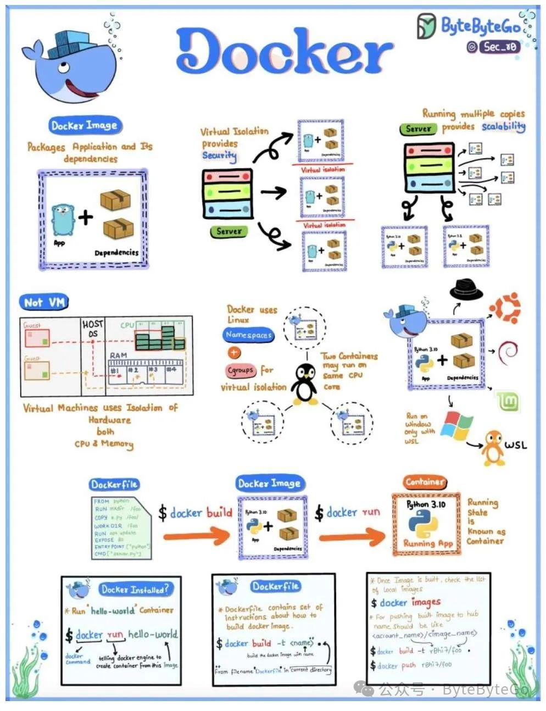

# Docker 是什么？

## 01 什么是 Docker？

Docker 是一个开源平台，可在轻量级、可移植的容器中自动部署、扩展和管理应用程序。

Docker 于 2013 年推出，现已成为应用程序开发、交付和运行阶段的基本工具，通过使用容器简化了创建、部署和运行应用程序的流程。

## 02 容器

容器是轻量级、独立、可执行的软件包，包含运行软件所需的一切，包括代码、运行时、库、环境变量和系统工具。

与包含整个操作系统的传统虚拟机（VM）相比，容器彼此隔离，与主机系统也是隔离的，但它们共享操作系统内核，可以立即启动，使用的计算和内存资源更少。

## 03 Docker 的优势

-   可移植性：Docker 容器封装了应用程序及其依赖关系。这可确保跨环境的一致性。
    
-   安全性：利用 Linux 命名空间 (namespace) 和控制组 (cgroup)，Docker 可为容器内的应用程序提供强大的隔离功能。
    
-   效率：与虚拟机不同，容器共享主机操作系统内核，使其轻量级。
    

## 04 Docker 的关键组件

-   Dockerfile 文件：包含命令的脚本，用于组装 Docker 映像，定义其中的内容。
    
-   映像 (image)：用于创建 Docker 容器的只读模板。映像包含应用程序及其依赖项。
    
-   容器：从 Docker 镜像启动的运行实例。
    

## 05 为什么 Docker 被广泛使用？

Docker 的容器化方法简化了应用程序的部署。开发人员可获得可移植性、一致性和效率，使其成为现代软件交付的重要组成部分。

早期的 PaaS 平台的底层，其实也应用了容器化的技术来隔离资源。但是 Docker 创新性地将程序所有依赖一起打包，简化了运行环境管理的繁琐步骤，使得其在社区广泛流行。
