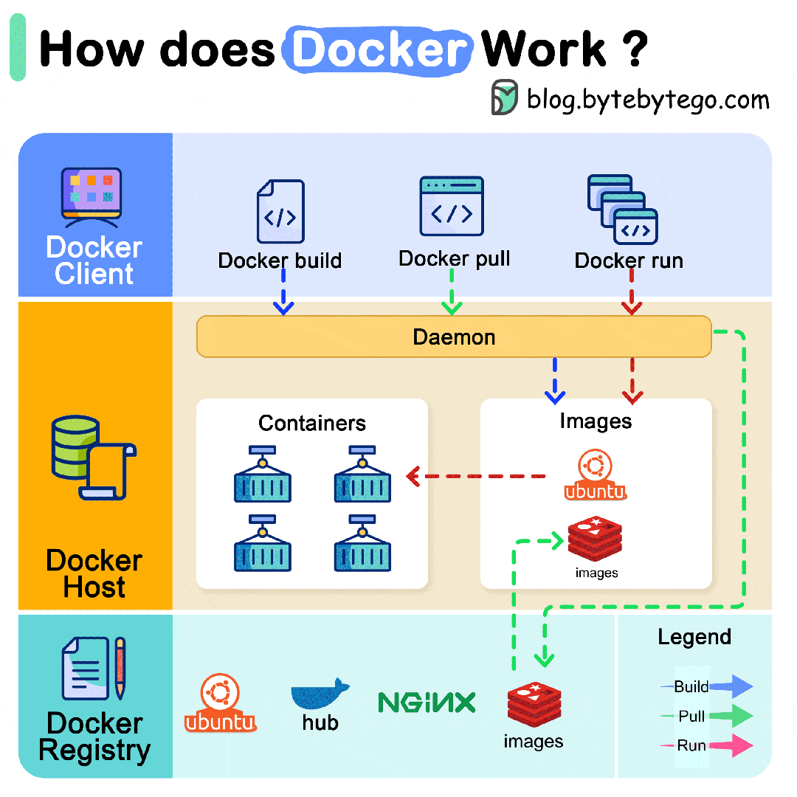
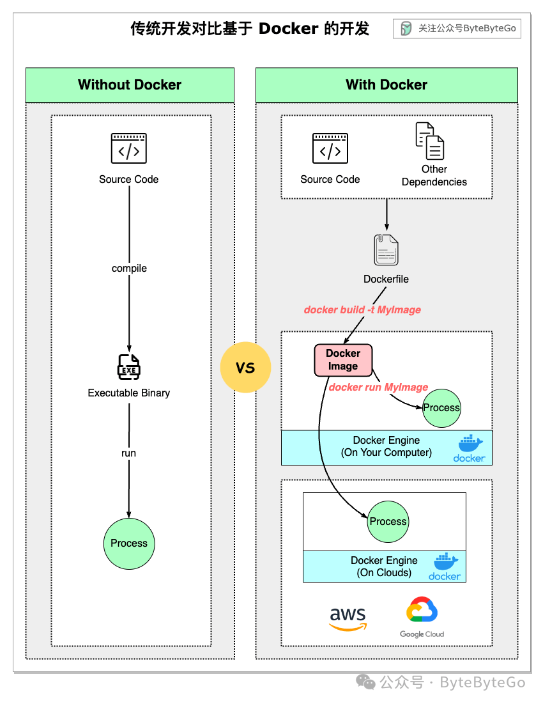

# Docker 是怎么工作的？

Docker 是如何工作的？

下图展示了 Docker 的架构，以及当我们运行 "docker build"、"docker pull "和 "docker run "时它是如何工作的。

Docker 架构由 3 个部分组成：

## Docker 客户端

Docker 客户端与 Docker 管理进程对话。

## Docker 主机

Docker 管理进程监听 Docker API 请求，并管理 Docker 对象，如镜像、容器、网络和卷。

## Docker 注册表

Docker 注册表存储 Docker 镜像。Docker Hub 是任何人都可以使用的公共注册表。

让我们以 "docker run "命令为例来看看整个工作过程。

1.  Docker 从注册表中提取映像。
    
2.  Docker 创建一个新容器。
    
3.  Docker 为容器分配一个读写文件系统。
    
4.  Docker 创建一个网络接口，将容器连接到默认网络。
    
5.  Docker 启动容器。
    

有了 Docker，我们可以快速开发、打包和运行应用程序。下图对比了**传统开发和基于 Docker 的开发部署流程**。

开发人员可以在本地编写代码，然后构建 Docker 镜像并将其推送到开发环境。这样，开发工作就可以在团队内部共享。测试会在开发环境中自动运行。

镜像是一个**只读模板**，包含创建 Docker 容器的说明。我们使用 Dockerfile 来定义创建镜像和运行镜像的步骤。

当发现 bug 或需要改进时，上述过程可以增量运行。

当开发测试完成后，Docker 镜像会被推送到生产环境（通常在云上）。

与不使用 Docker 的传统开发方式相比，Docker 是**相当轻量级和快速的**，因为每次我们进行更改时，只需重建 Dockerfile 中已更改的部分。
