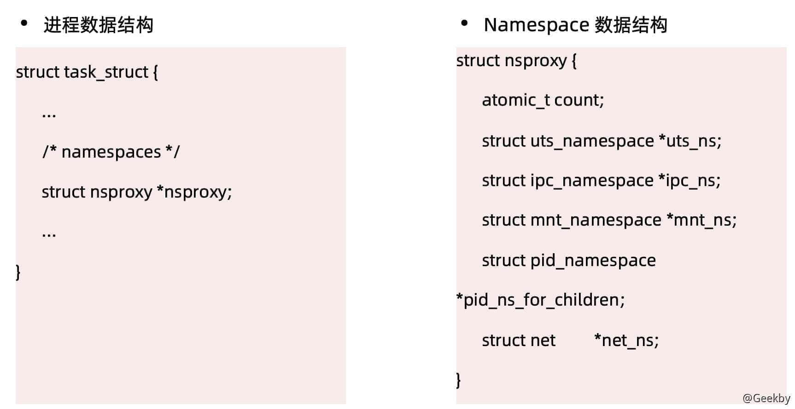
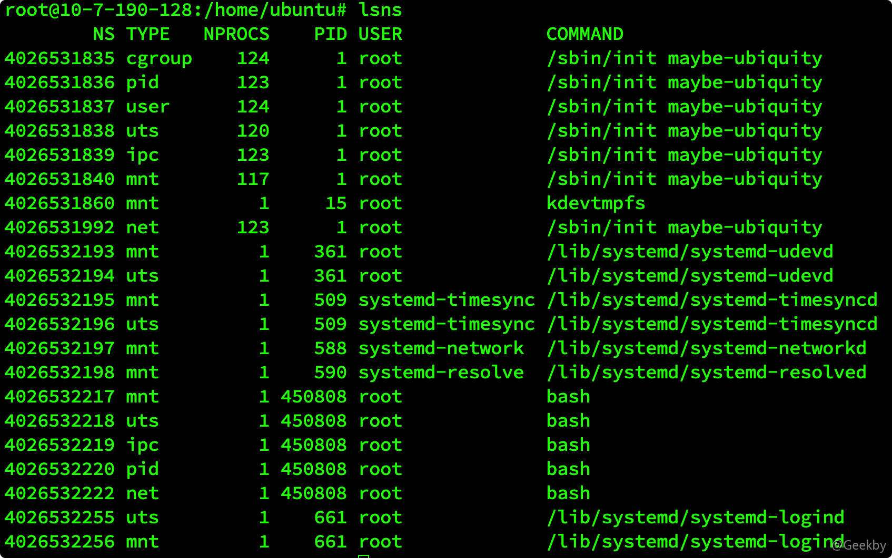
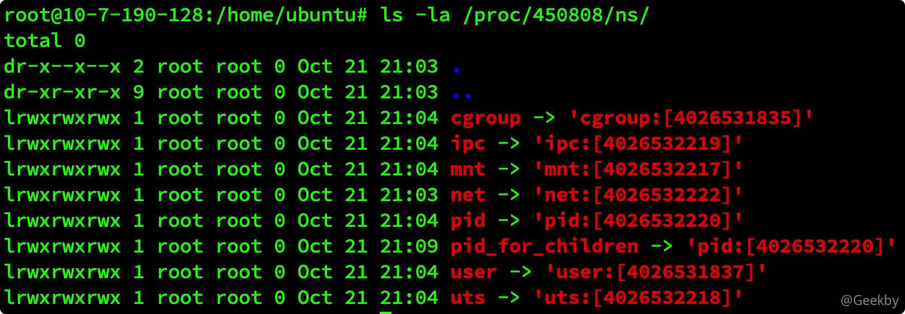
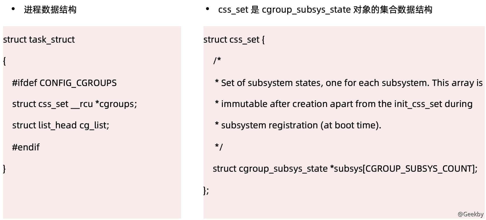
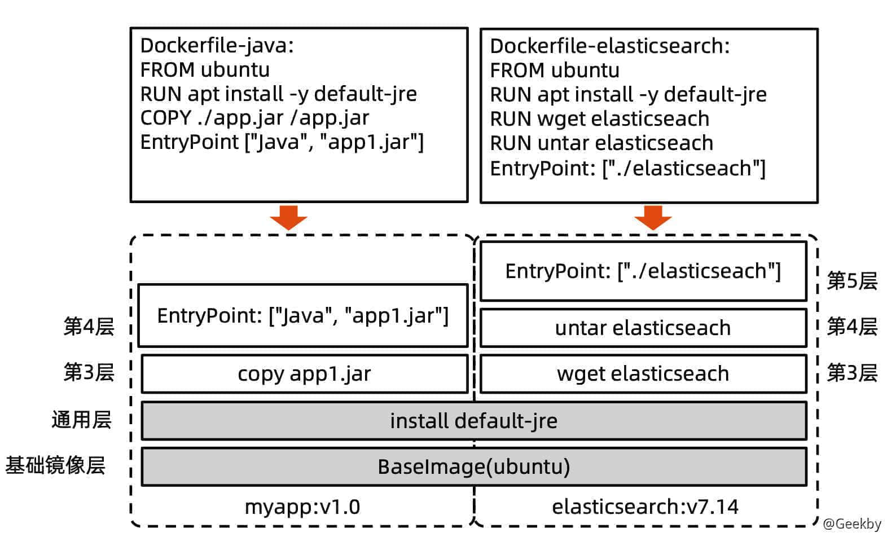
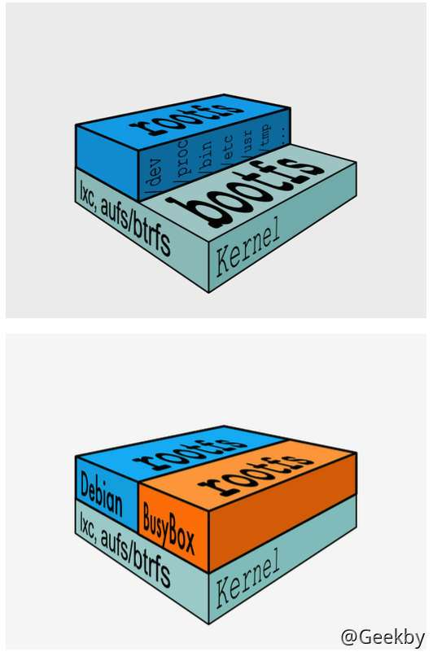
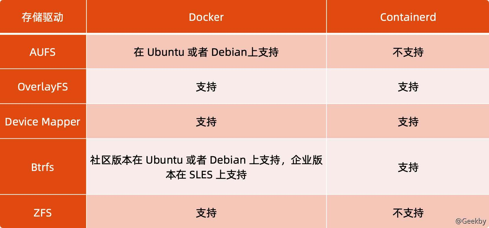
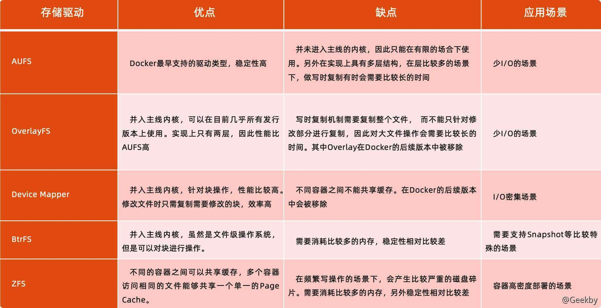
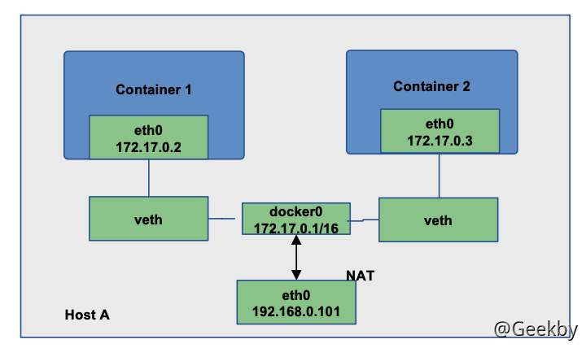
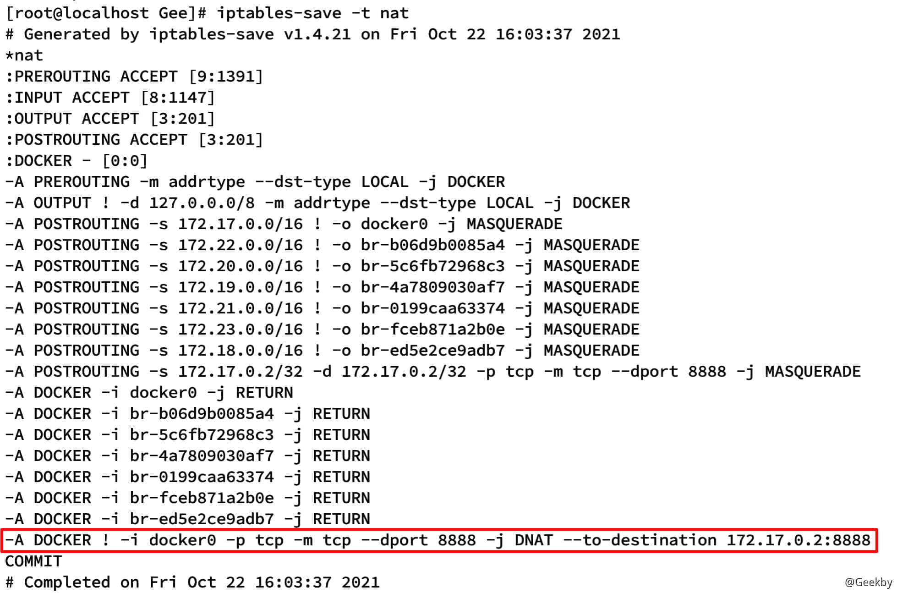

# [](#docker-%E6%A0%B8%E5%BF%83%E6%8A%80%E6%9C%AF)Docker 核心技术

## [](#1-%E8%83%8C%E6%99%AF)1 背景

> Docker 是一个开源的应用容器引擎，基于 Go 语言开发。Docker 可以让开发者打包他们的应用以及依赖包到一个轻量级、可移植的容器中，然后发布到任何流行的 Linux 机器上，也可以实现虚拟化。容器是完全使用沙箱机制，相互之间不会有任何接口，更重要的是容器性能开销极低。

-   基于 Linux 内核的 Cgroup，Namespace，以及 Union FS 等技术，对进程进行封装隔离，属于操作系统 层面的虚拟化技术，由于隔离的进程独立于宿主和其它的隔离的进程，因此也称其为容器。
-   最初实现是基于 LXC，从 0.7 以后开始去除 LXC，转而使用自行开发的 Libcontainer，从 1.11 开始，则 进一步演进为使用 runC 和 Containerd。
-   Docker 在容器的基础上，进行了进一步的封装，从文件系统、网络互联到进程隔离等等，极大的简化了容器的创建和维护，使得 Docker 技术比虚拟机技术更为轻便、快捷。

### [](#11-docker-%E4%B8%8E%E8%99%9A%E6%8B%9F%E6%9C%BA%E7%9A%84%E5%8C%BA%E5%88%AB)1.1 Docker 与虚拟机的区别


Docker 有着比虚拟机更少的抽象层。由于 docker 不需要 Hypervisor 实现硬件资源虚拟化，运行在 docker 容器上的程序直接使用的都是实际物理机的硬件资源。因此在 CPU、内存利用率上 docker 将会在效率上有优势。

Docker 利用的是宿主机的内核，而不需要 Guest OS。因此，当新建一个容器时，docker 不需要和虚拟机一样重新加载一个操作系统内核。引导、加载操作系统内核是一个比较费时费资源的过程，当新建一个虚拟机时，虚拟机软件需要加载 Guest OS，这个新建过程是分钟级别的。而 docker 由于直接利用宿主机的操作系统，则省略了这个过程，因此新建一个 docker 容器只需要几秒钟。另外，现代操作系统是复杂的系统，在一台物理机上新增加一个操作系统的资源开销是比较大的，因此，docker 对比虚拟机在资源消耗上也占有比较大的优势。事实上，在一台物理机上我们可以很容易建立成百上千的容器，而只能建立几个虚拟机。

-   性能对比 
    
-   容器主要特性
    


### [](#12-%E5%AE%B9%E5%99%A8%E6%93%8D%E4%BD%9C)1.2 容器操作

-   启动：docker run
    
    -   \-it 交互
    -   \-d 后台运行
    -   \-p 端口映射
    -   \-v 磁盘挂载
-   启动已终止容器
    
    -   `docker start`
-   停止容器
    
    -   `docker stop`
-   查看容器进程
    
    -   `docker ps`
-   查看容器细节
    
    -   `docker inspect [containerid]`
-   进入容器
    
    -   `docker attach`
    -   `PID=$(docker inspect --format "{{ .State.Pid }}" [container])`
    -   `nsenter --target $PID --mount --uts --ipc --net --pid`

### [](#13-dockerfile)1.3 Dockerfile

-   cat Dockerfile

|     |     |     |
| --- | --- | --- |
| ```plain<br>1<br>2<br>3<br>``` | ```dockerfile<br>FROM ubuntu<br>ENV MY_SERVICE_PORT=80<br>ADD bin/amd64/httpserver /httpserver ENTRYPOINT /httpserver<br>``` |

-   将 Dockerfile 打包成镜像

|     |     |     |
| --- | --- | --- |
| ```plain<br>1<br>2<br>``` | ```bash<br>docker build -t cncamp/httpserver:${tag} . <br>docker push geekby/httpserver:v1.0<br>``` |

-   运行容器

|     |     |     |
| --- | --- | --- |
| ```plain<br>1<br>``` | ```bash<br>docker run -d geekby/httpserver:v1.0<br>``` |

### [](#14-docker-%E5%BC%95%E6%93%8E%E6%9E%B6%E6%9E%84)1.4 Docker 引擎架构


## [](#2-namespcce)2 Namespcce

### [](#21-%E8%83%8C%E6%99%AF)2.1 背景

Linux Namespace 是一种 Linux Kernel 提供的资源隔离方案。

-   系统可以为进程分配不同的 Namespace
-   并保证不同的 Namespace 资源独立分配、进程彼此隔离，即不同的 Namespace 下的进程互不干扰

Linux 内核代码中 Namespace 的实现如下：



### [](#22-%E7%B1%BB%E5%88%AB)2.2 类别


#### [](#221-%E8%BF%9B%E7%A8%8B%E7%BC%96%E5%8F%B7---pid)2.2.1 进程编号 - PID

当启动了多个 container，然后在每个 container 内部用 `ps` 命令看一下，会发现它们都有一个 PID 为 1 的进程。不同用户的进程就是通过 PID namespace 隔离开的，且不同的 namespace 中可以有相同的 PID。有了 PID namespace，每个 namespace 中的 PID 能够相互隔离。

#### [](#222-%E7%BD%91%E7%BB%9C%E8%AE%BE%E5%A4%87---network)2.2.2 网络设备 - Network

在每个 network space 内部，可以有独立的网络设备（虚拟的或者真实的）、IP 地址、路由表和防火墙规则等。其中的应用所 bind 的端口也是 per-namespace 的，比如 http 默认使用的是 80 端口，使用 network space 后，同一 host 上的各个 container 内部就都可以运行各自的 web server。

Docker 默认采用 veth 的方式将 container 中的虚拟网卡同 host 上的一个 `docker bridge: docker0` 连接在一起。

#### [](#223-%E8%BF%9B%E7%A8%8B%E9%97%B4%E9%80%9A%E4%BF%A1---ipc)2.2.3 进程间通信 - IPC

利用这个 space，进程间的通信（**I**nter **P**rocess **C**ommunication）就被限定在了同一个 space 内部，即一个 container 中的某个进程只能和同一 container 中的其他进程通信。

container 的进程间交互实际上还是 host 上具有相同 Pid namespace 中的进程间交互，因此需要在 IPC 资源申请时加入 namespace 信息 - 每个 IPC 资源有一个唯一的 32 位 ID。

#### [](#224-%E6%96%87%E4%BB%B6%E7%B3%BB%E7%BB%9F---mount)2.2.4 文件系统 - Mount

mnt namespace 允许不同 namespace 的进程看到的文件结构不同，这样每个 namespace 中的进程所看到的文件目录就被隔离开了。

#### [](#225-%E4%B8%BB%E6%9C%BA%E5%9F%9F%E5%90%8D---uts)2.2.5 主机域名 - UTS

由于多个 container 是共享 OS 内核的，因而像 UTS 里的 os type 和 os release 等信息是不可能更改的，但是每个 container 可以有自己独立的 host name 和 domain name，以便于标识和区分（比如可以通过主机名来访问网络中的机器），这就是 UTS namespace 的作用。

#### [](#226-%E7%94%A8%E6%88%B7%E6%8E%A7%E5%88%B6---usr)2.2.6 用户控制 - USR

每个 container 可以有不同的 user 和 group id, 也就是说可以在 container 内部用 container 内部的用户执行程序而非 Host 上的用户。

### [](#23-linux-%E5%AF%B9-namespace-%E7%9A%84%E6%93%8D%E4%BD%9C%E6%96%B9%E6%B3%95)2.3 linux 对 namespace 的操作方法

-   clone

在创建新进程的系统调用时，可以通过 flags 参数指定需要新建的 Namespace 类型。

clone 函数原型：

|     |     |     |
| --- | --- | --- |
| ```plain<br>1<br>``` | ```c<br>int clone(int (*fn)(void *), void *child_stack, int flags, void *arg)<br>``` |

-   sets

该系统调用可以让调用进程加入某个已经存在的 Namespace 中：

|     |     |     |
| --- | --- | --- |
| ```plain<br>1<br>``` | ```c<br>int setns(int fd, int nstype)<br>``` |

-   unshare

该系统调用可以将调用进程移动到新的 Namespace 下：

|     |     |     |
| --- | --- | --- |
| ```plain<br>1<br>``` | ```c<br>int unshare(int flags)<br>``` |

### [](#24-%E5%85%B3%E4%BA%8E-namespace-%E7%9A%84%E5%B8%B8%E7%94%A8%E6%93%8D%E4%BD%9C)2.4 关于 namespace 的常用操作

-   查看当前系统的 namespace：
    -   `lsns -t [type]`



-   查看进程的 namespace：
    -   `ls -la /proc/[pid]/ns/`



-   进入某 namespace 运行命令：
    -   `nsenter -t [pid] -n ip addr`


## [](#3-cgroup)3 Cgroup

### [](#31-%E8%83%8C%E6%99%AF)3.1 背景

> Cgroups (Control Groups) 是 Linux 下用于对一个或一组进程进行资源控制和监控的机制

-   可以对诸如 CPU 使用时间、内存、磁盘 I/O 等进程所需的资源进行限制;
-   不同资源的具体管理工作由相应的 Cgroup 子系统 (Subsystem) 来实现 ;
-   针对不同类型的资源限制，只要将限制策略在不同的的子系统上进行关联即可 ;
-   Cgroups 在不同的系统资源管理子系统中以层级树 (Hierarchy) 的方式来组织管理：每个 Cgroup 都可以包含其他的子 Cgroup，因此子 Cgroup 能使用的资源除了受本 Cgroup 配置的资源参数限制，还受到父 Cgroup 设置的资源限制。

Linux 内核代码中 Cgroups 的实现：



### [](#32-%E7%B1%BB%E5%88%AB)3.2 类别

cgroups 实现了对资源的配额和度量

-   blkio：这个子系统设置限制每个块设备的输入输出控制。例如：磁盘，光盘以及 USB 等等
-   cpu：这个子系统使用调度程序为 cgroup 任务提供 CPU 的访问
-   cpuacct：产生 cgroup 任务的 CPU 资源报告
-   cpuset：如果是多核心的 CPU，这个子系统会为 cgroup 任务分配单独的 CPU 和内存
-   devices：允许或拒绝 cgroup 任务对设备的访问
-   freezer：暂停和恢复 cgroup 任务
-   memory：设置每个 cgroup 的内存限制以及产生内存资源报告
-   net\_cls：标记每个网络包以供 cgroup 方便使用
-   ns：名称空间子系统
-   pid：进程标识子系统

#### [](#321-cpu-%E5%AD%90%E7%B3%BB%E7%BB%9F)3.2.1 cpu 子系统

-   cpu.shares：可出让的能获得 CPU 使用时间的相对值。
-   cpu.cfs\_period\_us：用来配置时间周期长度，单位为 us(微秒)。
-   cpu.cfs\_quota\_us：用来配置当前 Cgroup 在 cfs\_period\_us 时间内最多能使用的 CPU 时间数，单位为 us(微秒)。
-   cpu.stat：Cgroup 内的进程使用的 CPU 时间统计。
-   nr\_periods：经过 cpu.cfs\_period\_us 的时间周期数量。
-   nr\_throttled：在经过的周期内，有多少次因为进程在指定的时间周期内用光了配额时间而受到限制。
-   throttled\_time：Cgroup 中的进程被限制使用 CPU 的总用时，单位是 ns(纳秒)。

示例

利用 cgroup cpu 子系统控制资源访问

在 cgroup cpu 子系统目录中创建目录结构：

|     |     |     |
| --- | --- | --- |
| ```plain<br>1<br>2<br>3<br>``` | ```bash<br>cd /sys/fs/cgroup/cpu<br>mkdir cpudemo<br>cd cpudemo<br>``` |

运行如下代码：

|     |     |     |
| --- | --- | --- |
| ```plain<br>1<br>2<br>3<br>4<br>5<br>6<br>7<br>8<br>9<br>``` | ```go<br>package main<br>func main() {<br>	go func(){<br>		for {<br>		}<br>	}()<br>	for {<br>	}<br>}<br>``` |

执行 top 查看 CPU 使用情况，CPU 占用 200%：


再通过 cgroup 限制 cpu：

|     |     |     |
| --- | --- | --- |
| ```plain<br>1<br>2<br>3<br>4<br>5<br>6<br>7<br>``` | ```bash<br>cd /sys/fs/cgroup/cpu/cpudemo<br><br># 把进程添加到 cgroup 进程配置组<br>echo ps -ef\|grep poc\|grep -v grep\|awk '{print $2}' > cgroup.procs<br><br># 设置 cpuquota<br>echo 10000 > cpu.cfs_quota_us<br>``` |


执行 top 查看 CPU 使用情况，CPU 占用变为 10%：


删除分组：

|     |     |     |
| --- | --- | --- |
| ```plain<br>1<br>``` | ```bash<br>cgdelete -g cpu:cpudemo<br>``` |

#### [](#322-memory-%E5%AD%90%E7%B3%BB%E7%BB%9F)3.2.2 Memory 子系统

-   memory.usage\_in\_bytes：
    -   cgroup 下进程使用的内存，包含 cgroup 及其子 cgroup 下的进程使用的内存
-   memory.max\_usage\_in\_bytes：
    -   cgroup 下进程使用内存的最大值，包含子 cgroup 的内存使用量。
-   memory.limit\_in\_bytes
    -   设置 Cgroup 下进程最多能使用的内存。如果设置为 -1，表示对该 cgroup 的内存使用不做限制。
-   memory.oom\_control
    -   设置是否在 Cgroup 中使用 OOM(Out of Memory)Killer，默认为使用。当属于该 cgroup 的进程使用的内存超过最大的限定值时，会立刻被 OOM Killer 处理。

## [](#4-%E6%96%87%E4%BB%B6%E7%B3%BB%E7%BB%9F)4 文件系统

### [](#41-%E8%83%8C%E6%99%AF)4.1 背景

docker 的创新点：Union FS 运用到文件系统中

-   将不同目录挂载到同一个虚拟文件系统下 (unite several directories into a single virtual filesystem) 的文件系统
    
-   支持为每一个成员目录 (类似 Git Branch) 设定 readonly、readwrite 和 whiteoutable 权限
    
-   文件系统分层，对 readonly 权限的 branch 可以逻辑上进行修改 (增量地，不影响 readonly 部分的)
    
-   通常 Union FS 有两个用途，一方面可以将多个 disk 挂到同一个目录下，另一个更常用的就是将一个 readonly 的 branch 和一个 writeable 的 branch 联合在一起。
    



### [](#42-docker-%E7%9A%84%E6%96%87%E4%BB%B6%E7%B3%BB%E7%BB%9F)4.2 Docker 的文件系统

典型的 Linux 文件系统组成：

-   Bootfs(boot file system)
    
    -   Bootloader - 引导加载 kernel，
    -   Kernel - 当 kernel 被加载到内存中后 umount bootfs。
-   rootfs (root file system)
    
    -   `/dev`，`/proc`，`/bin`，`/etc` 等标准目录和文件。
    -   对于不同的 linux 发行版，bootfs 基本是一致的，但 rootfs 会有差别。



#### [](#421-%E5%90%AF%E5%8A%A8%E8%BF%87%E7%A8%8B%E7%9A%84%E5%B7%AE%E5%BC%82)4.2.1 启动过程的差异

**Linux 的启动：**

在启动后，首先将 rootfs 设置为 `readonly`，进行一系列检查，然后将其切换为`readwrite`供用户使用。

**Docker 的启动：**

初始化时也是将 rootfs 以 readonly 方式加载并检查，然而接下来利用 `union mount` 的方式将一个 `readwrite` 文件系统挂载在 `readonly` 的 rootfs 之上。并且允许再次将下层的 FS 设定为 `readonly` 并向上叠加。这样一组 `readonly` 和一个 `writeable` 的结构构成了一个 container 的运行时态，每一个 FS 被称作为一个 FS 层。

#### [](#423-%E5%85%B3%E4%BA%8E%E5%86%99%E6%93%8D%E4%BD%9C)4.2.3 关于写操作

由于镜像具有共享特性，所以对容器可写层的操作需要依赖存储驱动提供的写时复制和用时分配机制，以此来支持对容器可写层的修改，进而提高对存储和内存资源的利用率。

-   写时复制

写时复制，即 `Copy-on-Write`。一个镜像可以被多个容器使用，但是不需要在内存和磁盘上做多个拷贝。在需要对镜像提供的文件进行修改时，该文件会从镜像的文件系统被复制到容器的可写层的文件系统进行修改，而镜像里面的文件不会改变。不同容器对文件的修改都相互独立、互不影响。

-   用时分配

按需分配空间，而非提前分配，即当一个文件被创建出来后，才会分配空间。

#### [](#424-%E5%AE%B9%E5%99%A8%E5%AD%98%E5%82%A8%E9%A9%B1%E5%8A%A8)4.2.4 容器存储驱动





#### [](#245-overlayfs)2.4.5 OverlayFS

OverlayFS 也是一种与 AUFS 类似的联合文件系统，同样属于文件级的存储驱动，包含了最初的 Overlay 和更新更稳定的 overlay2。

Overlay 只有两层：`upper` 层和 `lower` 层，Lower 层代表镜像层，upper 层代表容器可写层。


示例

|     |     |     |
| --- | --- | --- |
| ```plain<br> 1<br> 2<br> 3<br> 4<br> 5<br> 6<br> 7<br> 8<br> 9<br>10<br>11<br>12<br>``` | ```bash<br>mkdir upper lower merged work<br>echo "from lower" > lower/in_lower.txt<br>echo "from upper" > upper/in_upper.txt<br>echo "from lower" > lower/in_both.txt<br>echo "from upper" > upper/in_both.txt<br><br>sudo mount -t overlay overlay -o lowerdir=`pwd`/lower,upperdir=`pwd`/upper,workdir=`pwd`/work `pwd`/merged<br><br>cat merged/in_both.txt<br>rm merged/in_both.txt<br>rm merged/in_lower.txt<br>rm merged/in_upper.txt<br>``` |

## [](#5-%E7%BD%91%E7%BB%9C)5 网络

在 Docker 中提供了多种网络模式：

-   Null(–net=None)
    
    -   把容器放入独立的网络空间但不做任何网络配置;
    -   用户需要通过运行 `docker network` 命令来完成网络配置。
-   Host
    
    -   使用主机网络名空间，复用主机网络。
-   Container
    
    -   重用其他容器的网络。
-   Bridge(–net=bridge)
    
    -   使用 Linux 网桥和 iptables 提供容器互联，Docker 在每台主机上创建一个名叫 `docker0` 的网桥，通过 `veth pair` 来连接该主机的每一个 EndPoint。

### [](#51-%E9%BB%98%E8%AE%A4%E6%A8%A1%E5%BC%8F---%E7%BD%91%E6%A1%A5%E5%92%8C-nat)5.1 默认模式 - 网桥和 NAT



-   创建 nginx 镜像，映射端口 `8888:8888`
    -   `docker run -p 8888:8888 -d nginx`
-   显示网桥
    -   `brctl show`


-   nsenter 查看对应容器网络命名空间


-   主机上的 iptables 配置
    -   `iptables-save -t nat`



### [](#52-null-%E6%A8%A1%E5%BC%8F)5.2 Null 模式

Null 模式是一个空实现，可以通过 Null 模式启动容器并在宿主机上通过命令为容器配置网络。

示例

创建 Null 模式容器，手动配置容器网络

|     |     |     |
| --- | --- | --- |
| ```plain<br> 1<br> 2<br> 3<br> 4<br> 5<br> 6<br> 7<br> 8<br> 9<br>10<br>11<br>12<br>13<br>14<br>15<br>16<br>17<br>18<br>19<br>20<br>21<br>22<br>23<br>24<br>25<br>26<br>27<br>28<br>29<br>30<br>31<br>32<br>33<br>34<br>35<br>36<br>37<br>38<br>39<br>40<br>41<br>42<br>43<br>44<br>45<br>46<br>47<br>48<br>49<br>50<br>51<br>52<br>53<br>54<br>55<br>56<br>57<br>58<br>59<br>60<br>61<br>62<br>63<br>64<br>``` | ````bash<br>### create network ns<br>```<br>mkdir -p /var/run/netns<br>find -L /var/run/netns -type l -delete<br>```<br>### start nginx docker with non network mode<br>```<br>docker run --network=none  -d nginx<br>```<br>### check corresponding pid<br>```<br>docker ps\|grep nginx<br>docker inspect <containerid>\|grep -i pid<br><br>"Pid": 876884,<br>"PidMode": "",<br>"PidsLimit": null,<br>```<br>### check network config for the container<br>```<br>nsenter -t 876884 -n ip a<br>```<br>### link network namespace<br>```<br>export pid=876884<br>ln -s /proc/$pid/ns/net /var/run/netns/$pid<br>ip netns list<br>```<br>### check docker bridge on the host <br>```<br>brctl show<br>ip a<br>4: docker0: <BROADCAST,MULTICAST,UP,LOWER_UP> mtu 1500 qdisc noqueue state UP group default<br>    link/ether 02:42:35:40:d3:8b brd ff:ff:ff:ff:ff:ff<br>    inet 172.17.0.1/16 brd 172.17.255.255 scope global docker0<br>       valid_lft forever preferred_lft forever<br>    inet6 fe80::42:35ff:fe40:d38b/64 scope link<br>       valid_lft forever preferred_lft forever<br>```<br>### create veth pair<br>```<br>ip link add A type veth peer name B<br>```<br>### config A<br>```<br>brctl addif docker0 A<br>ip link set A up<br>```<br>### config B<br>```<br>SETIP=172.17.0.10<br>SETMASK=16<br>GATEWAY=172.17.0.1<br><br>ip link set B netns $pid<br>ip netns exec $pid ip link set dev B name eth0<br>ip netns exec $pid ip link set eth0 up<br>ip netns exec $pid ip addr add $SETIP/$SETMASK dev eth0<br>ip netns exec $pid ip route add default via $GATEWAY<br>```<br>### check connectivity<br>```<br>curl 172.17.0.10<br>```<br>```` |
