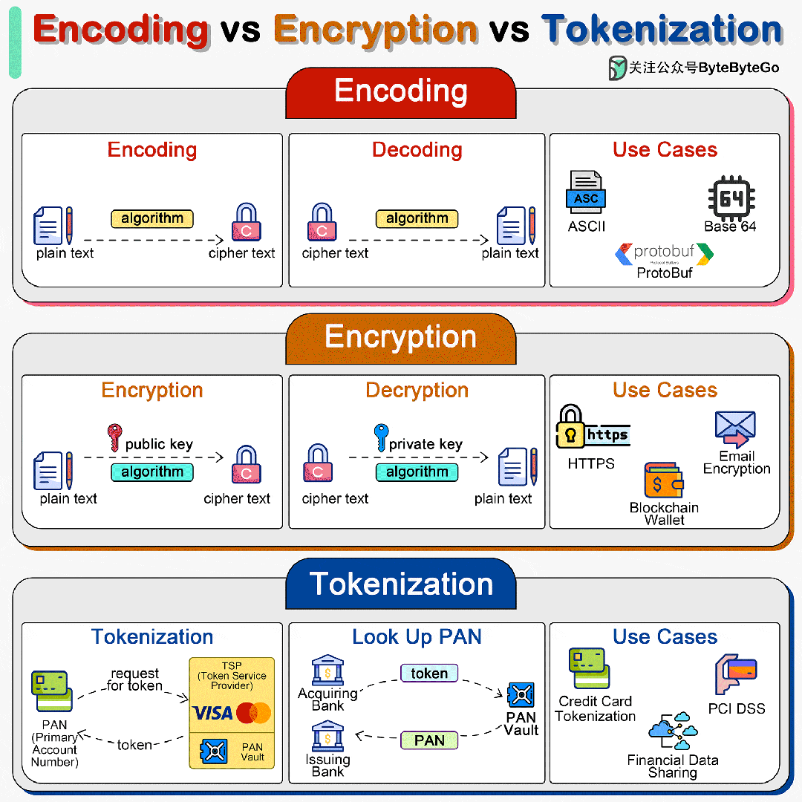

# Encoding, Encryption, Tokenization 傻傻分不清楚

今天来聊聊编码 (Encoding), 加密 (Encryption) 和 令牌化 (Tokenization) 的区别。

编码、加密和标记化是三种不同的流程，它们以不同的方式处理数据，用于不同的目的，包括数据传输、安全性和合规性。

在系统设计中，我们需要选择正确的方法来处理敏感信息。

## 编码

编码使用一种易于逆转的方案将数据转换成不同的格式。例如，Base64 编码可将二进制数据编码为 ASCII 字符，从而使数据更容易在专为处理文本数据而设计的媒体上传输。

编码并不是为了确保数据安全。**编码后的数据可以使用相同的方案轻松解码，无需密钥**。

## 加密

加密涉及使用密钥转换数据的复杂算法。加密可以是对称加密（使用相同的密钥进行加密和解密），也可以是非对称加密（使用公开密钥进行加密，使用私人密钥进行解密）。

加密的目的是利用算法和密钥将可读数据（明文）转换为不可读格式（密文），从而保护数据的机密性。**只有拥有正确密钥的人才能解密并访问原始数据**。

## 令牌化

令牌化是用令牌替代敏感数据的过程。**原始数据和令牌之间的映射被安全地存储在令牌库中**。这些令牌可用于各种系统和流程，而不会暴露原始数据，从而降低了数据泄露的风险。

令牌化通常用于**保护信用卡信息**、个人识别码和其他敏感数据。令牌化具有很高的安全性，因为令牌不包含原始数据的任何部分，因此无法通过逆向工程泄露原始数据。它对于遵守 PCI DSS 等法规特别有用。
