# Hello: I’m your ADCS server and I want to authenticate against you – Decoder's Blog

In my exploration of all the components and configurations related to the Windows Active Directory Certification Services (ADCS), after the “deep dive” in [Cert Publishers](https://decoder.cloud/2023/11/20/a-deep-dive-in-cert-publishers-group/) group, I decided to take a look at the “**Certificate Service DCOM Access**” group.  
在探索与 Windows Active Directory 认证服务（ADCS）相关的所有组件和配置时，在 Cert Publishers 组中进行了“深入研究”之后，我决定看看“证书服务 DCOM 访问”组。

This group is a built-in local security group and is populated by the special **NT AUTHORITY\\Authenticaterd Users** identity group, which represents every Domain user account that can successfully log on to the domain, whenever the server assumes the role of a Certification Authority (CA) server by installing the Active Directory Certification Services (ADCS) role.  
此组是一个内置的本地安全组，由特殊的 NT 身份验证\\Authenticaterd 用户身份组填充，该身份组表示每当服务器通过安装 Active Directory 证书服务（ADCS）角色承担证书颁发机构（CA）服务器角色时，可以成功登录到域的每个域用户帐户。

The “DCOM Access” is somewhat intriguing; it evokes potential vulnerabilities and exploitation 😉  
“DCOM Access”有点耐人寻味;它唤起了潜在的漏洞和漏洞利用。

But let’s start from the beginning. What’s the purpose of this group? MS says: “*Members of this group are allowed to connect to Certification Authorities in the enterprise*“.  
但让我们从头开始。这个组织的目的是什么？MS 说：“允许此组的成员连接到企业中的证书颁发机构”。

In simpler terms, this group can enroll certificates via DCOM. Thus, it’s logical that all authenticated users and computers have access to the specific application.  
简而言之，该组可以通过 DCOM 注册证书。因此，所有经过身份验证的用户和计算机都可以访问特定的应用程序是合乎逻辑的。

Each time a user or computer enrolls or auto enrolls a certificate, it contacts the DCOM interfaces of the **CertSrv Request** application which are exposed through the [MS-WCCE](https://learn.microsoft.com/en-us/openspecs/windows_protocols/ms-wcce/446a0fca-7f27-4436-965d-191635518466) protocol, the Windows Client Certificate Enrollment Protocol.  
每次用户或计算机注册或自动注册证书时，它都会联系 CertSrv 请求应用程序的 DCOM 接口，这些接口通过 MS-WCCE 协议（Windows 客户端证书注册协议）公开。

There is also a specific set of interfaces for Certificate Services Remote Administration Protocol described in [MS-CSRA](https://learn.microsoft.com/en-us/openspecs/windows_protocols/ms-csra/40e74714-14bf-4f97-a264-35efbd63a813).  
MS-CSRA 中还描述了证书服务远程管理协议的一组特定接口。

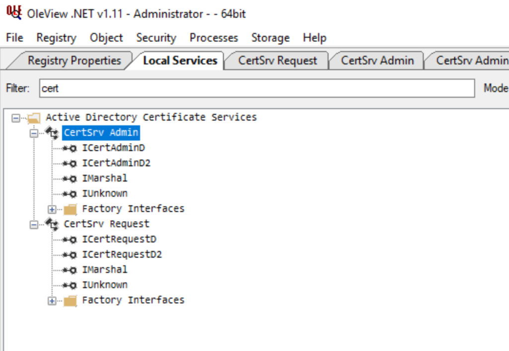

I won’t delve into the specifics of these interfaces. Maybe there are interesting interfaces to explore and abuse, but for now, my focus was drawn to the activation permissions of this DCOM server.  
我不会深入研究这些接口的细节。也许有一些有趣的接口可以探索和滥用，但现在，我的重点是这个 DCOM 服务器的激活权限。

The **DCOMCNFG** tool provides us a lot of useful info.  
DCOMCNFG 工具为我们提供了很多有用的信息。

At the computer level, the Certificate Service DCOM Access group is “limited” to Local and Remote Launch permissions:  
在计算机级别，证书服务 DCOM 访问组“限于”本地和远程启动权限：

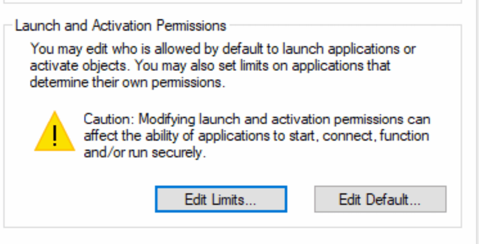

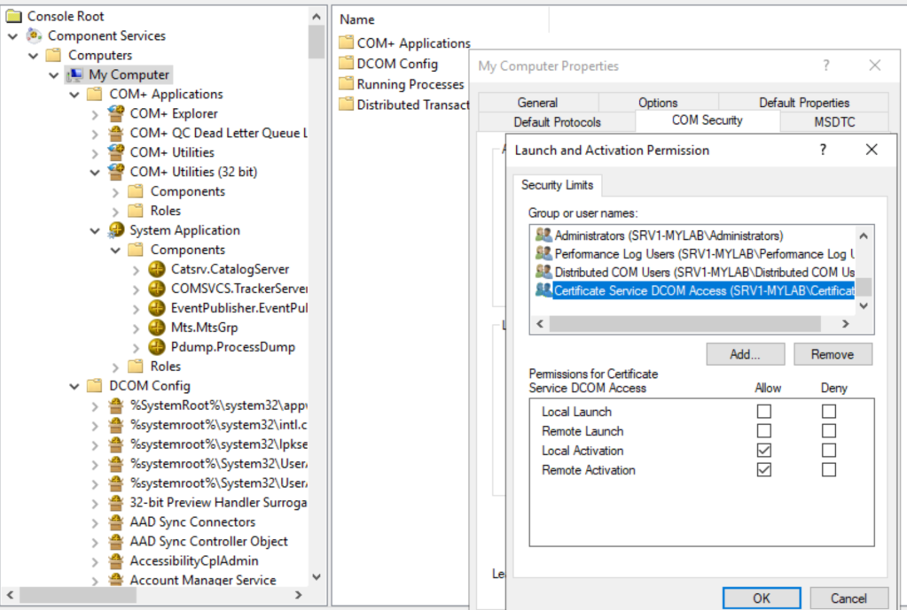

This does not mean that this group can activate all the DCOM objects, we have to look at the specific application, CertSrv Request in our case:  
这并不意味着这个组可以激活所有的 DCOM 对象，我们必须看看具体的应用程序，在我们的例子中是 CertSrv 请求：

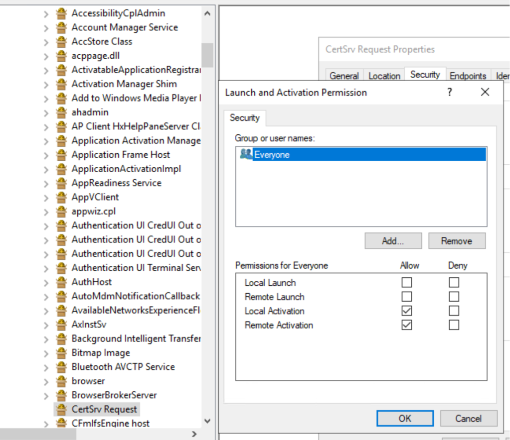

Everyone can activate from remote this DCOM server. To be honest, I would have expected to find the Certificate Service DCOM Access group here instead of Everyone, given that this group is limited to Local Launch and Local Activation permissions:  
每个人都可以从远程激活此 DCOM 服务器。老实说，我希望在这里找到证书服务 DCOM 访问组而不是 Everyone，因为该组仅限于本地启动和本地激活权限：

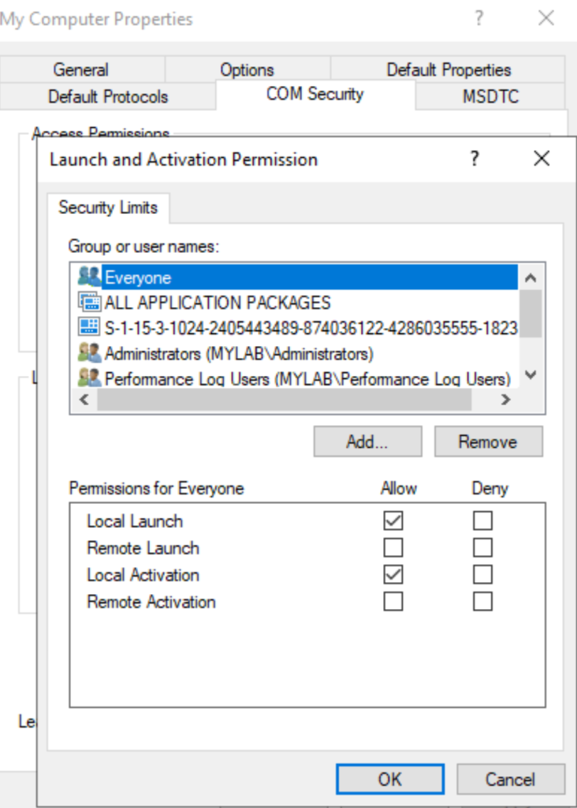

Maybe some kind of combined permissions and nested memberships are also evaluated.  
也许某种组合权限和嵌套成员资格也会被评估。

There’s another interesting aspect as well: from what I observed, the **Certificate Service DCOM Access** group is one of the few groups, along with **Distributed COM Users** and **Performance Log Users**, that are granted **Remote Activation** permissions.  
还有另一个有趣的方面：据我观察，证书服务 DCOM 访问组是少数几个被授予远程激活权限的组之一，沿着还有分布式 COM 用户和性能日志用户。

Let’s take a look at identity too:  
让我们也来看看身份：

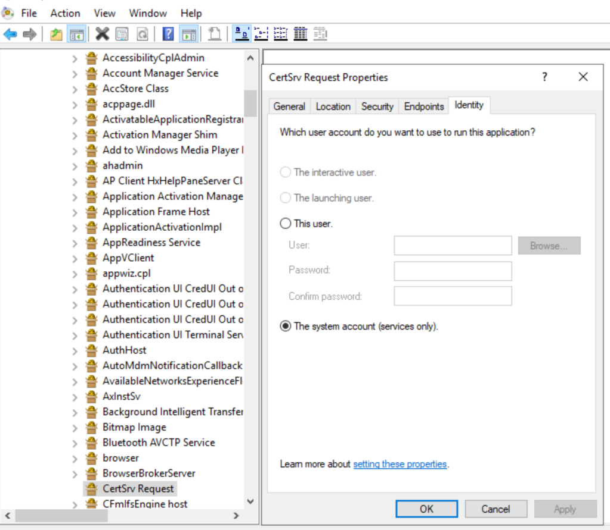

This DCOM application impersonates the SYSTEM account, which is what we need because it represents the highest local privileged identity.  
此 DCOM 应用程序模拟 SYSTEM 帐户，这正是我们所需要的，因为它代表最高的本地特权身份。

So, we have a privileged DCOM server running that can be activated remotely by any authenticated domain user. This seems prone to our loved **\*potato** exploits, don’t you think?  
因此，我们有一个特权 DCOM 服务器运行，可以由任何经过身份验证的域用户远程激活。这似乎倾向于我们的爱 \* 土豆探险，你不觉得吗？

In summary, most of these exploits rely on abusing a DCOM activation service, running under a highly privileged context, by unmarshalling an IStorage object and reflecting the NTLM authentication back to a local RPC TCP endpoint to achieve local privilege escalation.  
总之，大多数这些攻击依赖于滥用 DCOM 激活服务，在高度特权的上下文中运行，通过解组 IStorage 对象并将 NTLM 身份验证反映回本地 RPC TCP 端点来实现本地特权提升。

There are also variants of this attack that involve relaying the NTLM (and Kerberos) authentication of a user or computer to a remote endpoint using protocols such as LDAP, HTTP, or SMB, ultimately enabling privilege escalation up to Domain Admin. And this is what @splinter\_code and I did in our [RemotePotato0](https://labs.sentinelone.com/relaying-potatoes-dce-rpc-ntlm-relay-eop/).  
此攻击还有一些变体，涉及使用 LDAP、HTTP 或 SMB 等协议将用户或计算机的 NTLM（和 NTFS）身份验证中继到远程端点，最终使权限升级到域管理员。这就是@splinter\_code 和我在我们的 RemotePotato 0 中所做的。

But this scenario is different, as a low-privileged domain user, we want to activate a remote DCOM application running under a high-privileged context and force it to authenticate against a remote listener running on our machine so that we can capture and relay this authentication to another service.  
但是这个场景是不同的，作为一个低特权域用户，我们希望激活一个在高特权上下文下运行的远程 DCOM 应用程序，并强制它对我们机器上运行的远程侦听器进行身份验证，以便我们可以捕获并将此身份验证中继到另一个服务。

We will (hopefully) get the authentication of the remote computer itself when the DCOM application is running under the SYSTEM or Network Service context.  
当 DCOM 应用程序在 SYSTEM 或 Network Service 上下文中运行时，我们将（希望）获得远程计算机本身的身份验证。

Sounds great! l Now, what specific steps should we take to implement this?  
听起来不错！l 现在，我们应该采取什么具体步骤来实施这一点？

Well, it is much simpler than I initially thought 🙂  
嗯，这比我最初想象的要简单得多。

Starting from the original [JuicyPotato](https://decoder.cloud/2018/08/10/juicy-potato/) I made some minor changes:  
从最初的 JuicyPotato 开始，我做了一些小的修改：

-   Set up a redirector (socat) on a Linux machine on port 135 to redirect all traffic on our attacker machine on a dedicated port (ex: 9999). *You certainly know that we can no longer specify a custom port for Oxid Resolution* 😉 .  
    在 Linux 机器上的端口 135 上设置重定向器（socat），将攻击者机器上的所有流量重定向到专用端口（例如：9999）。您肯定知道我们不能再为 Oxid Resolution 1000 指定自定义端口。
-   In JuicyPotato code:  JuicyPotato 代码：
    -   Initialize a [COSERVERINFO](https://learn.microsoft.com/en-us/windows/win32/api/objidlbase/ns-objidlbase-coserverinfo) structure and specify the IP address of the remote server where we want to activate the DCOM object (the ADCS server)  
        初始化一个 COSERVERINFO 结构并指定我们要激活 DCOM 对象的远程服务器（ADCS 服务器）的 IP 地址
    -   Initialize a [COAUTHIDENTITY](https://learn.microsoft.com/en-us/windows/win32/api/wtypesbase/ns-wtypesbase-coauthidentity) and populate the username, password, and domain attributes.  
        初始化一个 CONDITION IDENTITY 并填充用户名、密码和域属性。
    -   Assign the COAUTHIDENTITY to the COSERVERINFO structure  
        将 COSERVERINFO IDENTITY 分配给 COSERVERINFO 结构
    -   In IStorageTrigger::Marshallfinterface specify the redirector IP address  
        在 Icons Trigger：：Marshallfinterface 中，指定重定向器 IP 地址
    -   In CoGetInstanceFromIStorage() pass the the COSERVERINFO structure:  
        在 CoGetInstanceFromIStorage（）中传递 COSERVERINFO 结构：

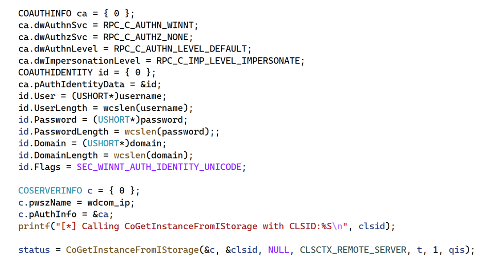

And yes it worked 🙂 Dumping the NTLM messages received on our socket server we can see that we get an authentication type 3 message from the remote CA server (SRV1-MYLAB):  
是的，它工作了，转储在我们的套接字服务器上接收到的 NTLM 消息，我们可以看到我们从远程 CA 服务器（SRV 1-MYLAB）获得了一个身份验证类型 3 消息：

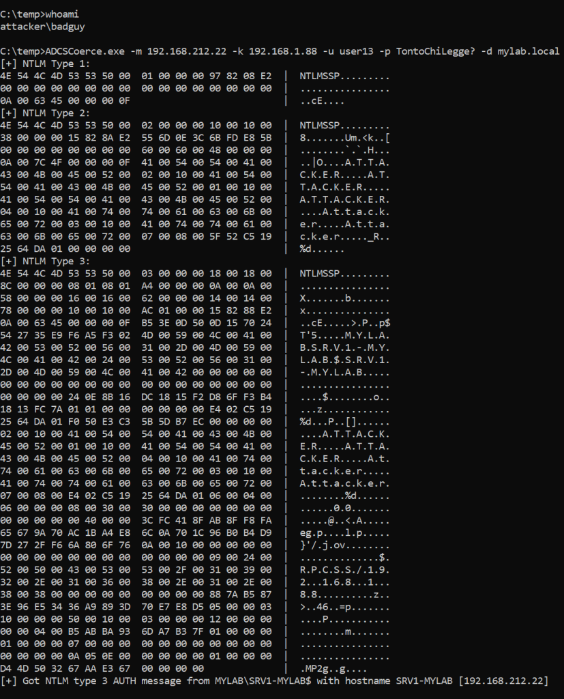

The network capture highlights that the Remote Activation requested by our low-privileged user was successful:  
网络捕获突出显示了我们的低权限用户请求的远程激活成功：

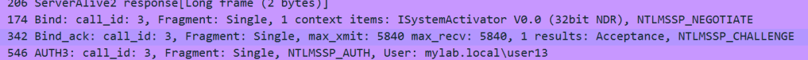

The final step is to forward the NTLM authentication to an external relay, such as [ntlmrelayx](https://github.com/fortra/impacket), enabling authentication to another service as the CA computer itself.  
最后一步是将 NTLM 身份验证转发到外部中继（如 ntlmrelayx），从而启用对 CA 计算机本身的另一个服务的身份验证。

Last but not least, since we have an RPC Client authenticating, we must encapsulate and forward the authentication messages using a protocol already implemented and supported in ntlmrelayx, such as HTTP.  
最后但并非最不重要的一点是，由于我们有一个 RPC 客户端进行身份验证，因此我们必须使用 ntlmrelayx 中已经实现和支持的协议（如 HTTP）封装和转发身份验证消息。

I bet that now the fateful question arises:  
我敢打赌，现在出现了致命的问题：

*Ok, regular domain users can coerce the authentication of an ADCS server from remote, intercept the authentication messages, and relay it, but is this really useful?  
好吧，普通的域用户可以从远程强制 ADCS 服务器的身份验证，拦截身份验证消息，并中继它，但这真的有用吗？*

Well, considering the existence of other unpatched methods to coerce authentication of a Domain Controller, such as [DFSCoerce](https://github.com/Wh04m1001/DFSCoerce), I would argue its utility may be limited.  
嗯，考虑到存在其他未打补丁的方法来强制域控制器的身份验证，如 DFSCoconline，我认为它的实用性可能是有限的。

To complicate matters further, the only protocols that can be relayed, due the the [hardening](https://techcommunity.microsoft.com/t5/windows-it-pro-blog/dcom-authentication-hardening-what-you-need-to-know/ba-p/3657154) MS recently made in DCOM, at the moment are HTTP and SMB (if signing is not required).  
更复杂的是，由于 MS 最近在 DCOM 中进行了强化，目前唯一可以中继的协议是 HTTP 和 SMB（如果不需要签名）。

In my lab, I tested the relay against the HTTP **/CertSrv** endpoint of a CA web enrollment server running on a different machine (guess why?… you cannot relay back to the same machine over the network). With no NTLM mitigations in place, I requested a Machine certificate for the CA server.  
在我的实验室中，我针对运行在不同机器上的 CA Web 注册服务器的 HTTP /CertSrv 端点测试了中继（猜猜为什么？）您不能通过网络中继回同一台机器）。由于没有使用 NTLM 缓解措施，我为 CA 服务器请求了一个计算机证书。

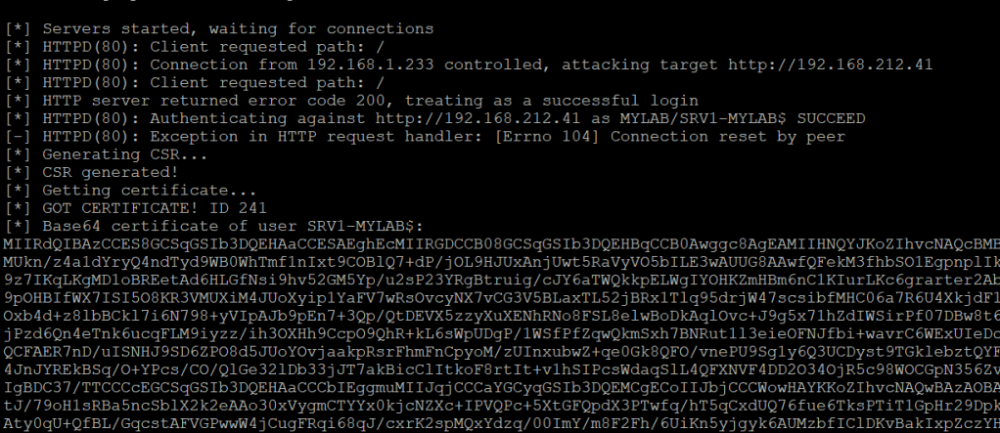

The attack flow is shown below:  
攻击流程如下所示：

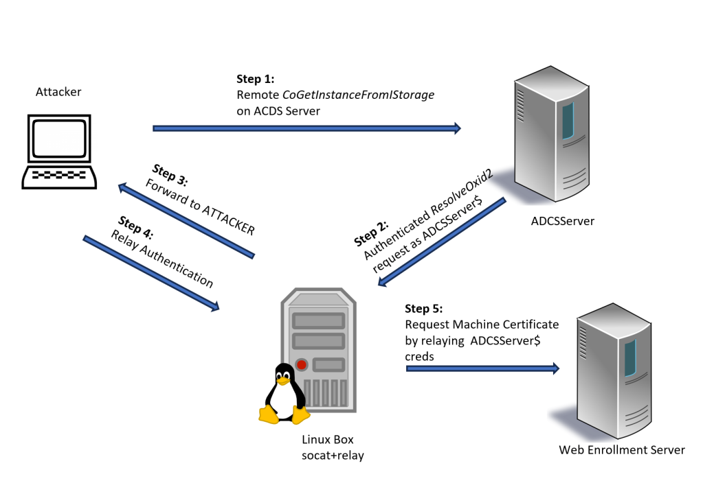

With this certificate, I could then log onto the ADCS server in a highly privileged context. For example, I could back up the private key of the CA, ultimately enabling the forging of certificates on behalf of any user.  
有了这个证书，我就可以在一个高特权的上下文中登录到 ADCS 服务器。例如，我可以备份 CA 的私钥，最终允许代表任何用户伪造证书。

## The POC 的 POC

I rewrote some parts of our old JuicyPotato to adapt it to this new scenario. It’s a quick & dirty fix and somehow limited, but it was more than enough to achieve my goal 🙂  
我重写了我们旧的 JuicyPotato 的一些部分，以适应这个新的场景。这是一个快速和肮脏的解决办法，不知何故有限，但它是绰绰有余，以实现我的目标。

You can get rid of the socat redirector by using our [JuicyPotatoNG](https://github.com/antonioCoco/JuicyPotatoNG) code and implement a fake Oxid Resolver like we did in [RemotePotato0](https://github.com/antonioCoco/RemotePotato0), with the extra bonus that you can also control the SPN and [perform a Kerberos relay](https://github.com/cube0x0/KrbRelay) too… but I’ll leave it up to you 😉  
你可以通过使用我们的 JuicyPotatoNG 代码来摆脱 socat 重定向器，并像我们在 RemotePotato0 中所做的那样实现一个假的 Oxid Resolver，额外的好处是你还可以控制 SPN 并执行一个中继.😉

Source Code: [https://github.com/decoder-it/ADCSCoercePotato/](https://github.com/decoder-it/ADCSCoercePotato/)  
源代码：https://github.com/decoder-it/ADCSCoercePotato/

## Conclusions 结论

While the method I described for coercing authentication may not be groundbreaking, it offers interesting alternative ways to force the authentication of a remote server by abusing the Remote Activation permission granted to regular domain users.  
虽然我描述的强制身份验证方法可能不是突破性的，但它提供了一些有趣的替代方法，可以通过滥用授予常规域用户的远程激活权限来强制对远程服务器进行身份验证。

This capability is only limited to the **Certificate Service DCOM Access** group, which is populated only when the ADCS service is running. However, there could be legacy DCOM applications that grant Remote Activation to everyone.  
此功能仅限于证书服务 DCOM 访问组，该组仅在 ADCS 服务运行时填充。但是，可能存在向所有人授予远程激活的遗留 DCOM 应用程序。

Imagine DCOM Applications running under the context of the “Interactive User” with Remote Activation available to regular users. With cross-session implementation, you could also retrieve the authentication of a logged-in user 😉  
想象一下，DCOM 应用程序在“交互式用户”的上下文中运行，普通用户可以使用远程激活。通过跨会话实现，您还可以检索登录用户的身份验证

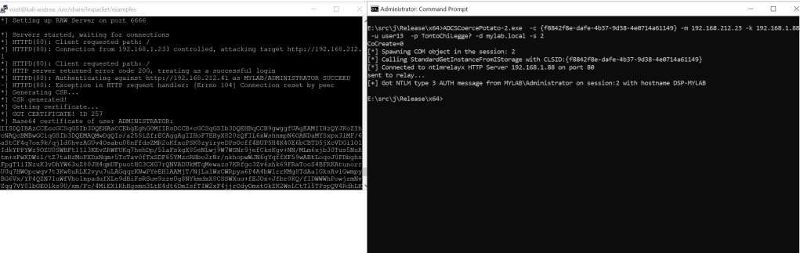

Another valid reason to avoid installing unnecessary services on a Domain Controller, including the ADCS service!  
避免在域控制器上安装不必要的服务的另一个有效理由，包括 ADCS 服务！

That’s all 🙂 这是所有的
