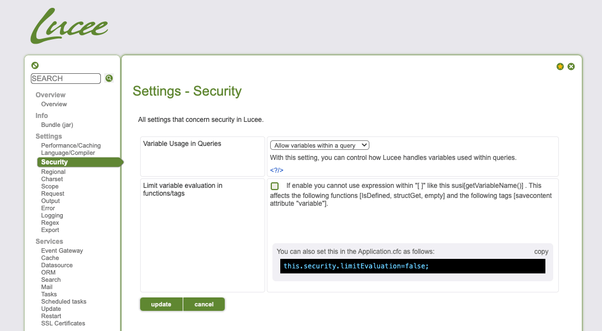

# Hello Lucee! Let us hack Apple again?

Last year we conducted an [in-depth analysis of multiple vulnerabilities within Adobe ColdFusion](https://blog.projectdiscovery.io/adobe-coldfusion-rce/), we derived valuable insights, one of which revolved around CFM and CFC handling, parsing and execution. We wondered if there are any other CFML Servers. Does this ring a bell? Allow us to introduce [Lucee](https://github.com/lucee/Lucee?ref=blog.projectdiscovery.io). We've previously compromised Lucee's Admin panel, showcasing a [pre-auth Remote Code Execution (RCE) on multiple Apple servers](https://httpvoid.com/Apple-RCE.md?ref=blog.projectdiscovery.io) that utilized Lucee as its underlying server.

Our journey led us through multiple attempts, we will delve into our unsuccessful endeavours and, ultimately, our achievement of RCE on Apple’s production server. Notably, our exploitation extended to potentially compromising Lucee's update server, thereby unveiling a classic supply chain attack to compromise any Lucee installation with malicious updates.

### Attempt 1 - Request Handling and REST Mappings

After checking out Lucee's admin panel in our earlier research, we found that it's pretty locked down. There are only four CFM files you can get access while being unauthenticated, so there's not much room for finding bugs there. We need to dig into how Lucee handles requests. We're looking for specific paths, parameters, headers, and so on, to understand how requests are handled.

After reviewing the web.xml file, We set up the JVM debugger via IntelliJ and added Lucee's source code. We plan to start going through the code by putting a breakpoint at Request::exe(). This way, we can step through the code bit by bit and see how Lucee handles requests.

```java
public static void exe(PageContext pc, short type, ...) {
		try {
...

			if (type == TYPE_CFML) pc.executeCFML(pc.getHttpServletRequest().getServletPath(), throwExcpetion, true);
			else if (type == TYPE_LUCEE) pc.execute(pc.getHttpServletRequest().getServletPath(), throwExcpetion, true);
			else pc.executeRest(pc.getHttpServletRequest().getServletPath(), throwExcpetion);
		}
		finally {
...
		}
	}
```

Java

Copy

[core/src/main/java/lucee/runtime/engine/Request.java#L29](https://github.com/lucee/Lucee/blob/f7b88cc49b908dd61e9dfad6a4e567745408182a/core/src/main/java/lucee/runtime/engine/Request.java?ref=blog.projectdiscovery.io#L29)

Another interesting class that deals with Request and Response in Lucee is `core/src/main/java/lucee/runtime/net/http/ReqRspUtil.java`. In this class, there are functions to work with various aspects of the Request, like setting/getting certain headers, query parameters, and the request body, among other things.

While looking into this class, we noticed a call to JavaConverter.deserialize(). As the name suggests, it is a wrapper on readObject() to handle Java Deserialization.

```java
public static Object getRequestBody(PageContext pc, boolean deserialized, ...) {

		HttpServletRequest req = pc.getHttpServletRequest();

		MimeType contentType = getContentType(pc);
		...
				if(deserialized) {
					int format = MimeType.toFormat(contentType, -1);
					obj = toObject(pc, data, format, cs, obj);
				}
		...
		return defaultValue;
	}

public static Object toObject(PageContext pc, byte[] data, int format, ...) {

		switch (format) {
			...
			case UDF.RETURN_FORMAT_JAVA: //5
				try {
					return JavaConverter.deserialize(new ByteArrayInputStream(data));
				}
				catch (Exception pe) {
				}
				break;
		}
```

Java

Copy

It appears that when the request's content/type header is set to`application/java`, we should theoretically end up here, right? Well, we promptly dispatched a `URLDNS` gadget with the required content type. And the result? Drumroll, please... Nothing. Could it be that the `deserialized` condition didn't pass? To investigate, we add a breakpoint on `getRequestbody()` , only to find out that we don't even reach this point.

But why? we traced through the function calls and realized that certain configurations must be in place to satisfy the if/else statements to lead us to the sink. Given the complexity of the stack, let's briefly summarize the key points.

```plain
Request:exe() - Determines the type of request and handles it appropriately.
↓
PageContextImpl:executeRest() - Looks for Rest mappings and executes the RestRequestListener.
↓
RestRequestListener() -- Sets the "client" attribute with the value "lucee-rest-1-0" on the request object.
↓
ComponentPageImpl:callRest() - Examines the "client" attribute; if it's "lucee-rest-1-0", proceeds to execute callRest() followed by _callRest().
↓
ComponentPageImpl:_callRest() - If the rest mapping involves an argument, invokes ReqRspUtil.getRequestBody with the argument deserialized: true.
↓
ReqRspUtil.getRequestBody() - If the deserialized argument is true, triggers the toObject() function, which deserializes the request body based on the provided content type.
↓
toObject() - Java Deserialization on the request body if the content type is "application/java".
↓
JavaConverter.deserialize() - The final step where the Java Deserialization process occurs.
```

To reproduce this RCE, a rest mapping with a function that takes at least one argument must be configured. Deploy below Rest mapping.

```java

component restpath="/java"  rest="true" {
    remote String function getA(String a) httpmethod="GET" restpath="deser" {
        return a;
    }
}
```

Java

Copy


Java Deserialization via REST Mapping On Lucee

Surprisingly, we discovered that Lucee's critical update server utilizes a REST endpoint - [https://update.lucee.org/rest/update/provider/echoGet](https://update.lucee.org/rest/update/provider/echoGet?ref=blog.projectdiscovery.io). This server is pivotal in managing all update requests originating from various Lucee installations.


At the time of finding, this server was vulnerable to our exploit which could have allowed an attacker to compromise the update server, opening the door to a supply chain attack. Acknowledging the severity of the situation, Lucee's maintainers promptly implemented a hotfix to secure their update server, subsequently releasing an updated version of Lucee with the necessary fixes - [CVE-2023-38693](https://dev.lucee.org/t/lucee-critical-security-alert-august-15th-2023-cve-2023-38693/12893?ref=blog.projectdiscovery.io).

However, **our finding did not apply to Apple's host**, as they did not expose any REST mappings. Let's try again!

### Attempt 2 - CFML Expression Interpreter, Cookies and Sessions.

After gaining a more in-depth understanding of the codebase, we began selectively examining classes, and one that caught our attention was `CFMLExpressionInterpreter`. The intriguing nature of this class prompted us to delve into its details. Upon reviewing the class, it became evident that when the constructor's boolean argument, limited, is set to `False` (default is `True`), the method `CFMLExpressionInterpreter.interpret(…)` becomes capable of executing CFML expressions.

Something like CFMLExpressionInterpreter(false).interpret("function(arg)") should let us execute any function of Lucee.

With this insight, we conducted a thorough search within the codebase to identify instances where `CFMLExpressionInterpreter(false)` was initialized, and we discovered several occurrences. One in particular was of interest `StorageScopeCookie` by the name of it seems to be related to cookies.

```java
public abstract class StorageScopeCookie extends StorageScopeImpl {

protected static CFMLExpressionInterpreter evaluator = new CFMLExpressionInterpreter(false);

	protected static Struct  _loadData(PageContext pc, String cookieName, int type, String strType, Log log) {
		String data = (String) pc.cookieScope().get(cookieName, null);
		if (data != null) {
			try {
				Struct sct = (Struct) evaluator.interpret(pc, data);
                ...
                }
          ...
        }
        ...
     }

}
```

Java

Copy

It appears that the `StorageScopeCookie._loadData()` function accepts the cookie name as one of its arguments, retrieves its value from PageContext, and subsequently passes it to interpret().

After a thorough follow of multiple code flows, these three were standing out and seemed like could be called by the Lucee application.

-   sessionInvalidate() -> invalidateUserScope() -> getClientScope() -> ClientCookie.getInstance() -> StorageScopeCookie.\_loadData(…)
-   sessionRotate() -> invalidateUserScope() -> getClientScope() -> ClientCookie.getInstance() -> StorageScopeCookie.\_loadData(…)
-   PageContext.scope() -> getClientScope() -> ClientCookie.getInstance() -> StorageScopeCookie.\_loadData(…)

```java
public final class ClientCookie extends StorageScopeCookie implements Client {

	private static final String TYPE = "CLIENT";

	public static Client getInstance(String name, PageContext pc, Log log) {
		if (!StringUtil.isEmpty(name)) name = StringUtil.toUpperCase(StringUtil.toVariableName(name));
		String cookieName = "CF_" + TYPE + "_" + name;
		return new ClientCookie(pc, cookieName, _loadData(pc, cookieName, SCOPE_CLIENT, "client", log));
	}
}
```

Java

Copy

Upon invoking sessionInvalidate() or sessionRotate(), we successfully accessed ClientCookie.getInstance(), constructing the cookie name as `CF_CLIENT_LUCEE`.


This implies that any application utilizing sessionInvalidate() or sessionRotate() could potentially expose a Remote Code Execution (RCE) vulnerability via the CF\_CLIENT\_LUCEE cookie. Where, "Lucee" represents the application context name, which might vary depending on the deployed application.

Our initial search within the Lucee codebase for the usage of these functions in any unauthenticated CFM file or Component (CFC) yielded no results. Expanding our investigation to Mura/Masa CMS, also deployed by Apple on their Lucee server, we identified two calls. One of these calls was unauthenticated under the logout action.

```java
public function logout() output=false {
      	...
	if ( getBean('configBean').getValue(property='rotateSessions',defaultValue='false') ) {
        ...
			sessionInvalidate();
        ...
```

Java

Copy

core/mura/login/loginManager.cfc#L505

Unfortunately, the successful exploitation of this vulnerability depends on the rotateSessions setting being enabled in Mura/Masa, which is, by default, set to false. Consequently, we are unable to trigger this vulnerability on Apple's deployment.

Feeling a tinge of disappointment, we redirected our focus to the `PageContext.scope()` flow. After a thorough debugging session, it became apparent that the cookie name in this scenario would be `CF_CLIENT_`. More crucially, to exploit this code execution, we would need to enable the Client Management setting from the Lucee admin, which is, by default, disabled. Therefore, once again, we find ourselves unable to trigger this vulnerability on Apple's configuration.


Regardless here's a PoC for the same:


### Attempt 3 - Variable Interpreter, Functions and Mura CMS

After various unsuccessful attempts, an alternative idea struck us. What if we could identify more functions that potentially accept user input as a String and could lead to code execution?

Our attention was drawn to `VariableInterpreter.parse(,,limited)`, which initializes `CFMLExpressionInterpreter(limited)`. It occurred to us that if there are calls to `VariableInterpreter.parse(,,false)`, there might be a way for code execution.

Considering this, We identified some vulnerable sinks in the VariableInterpreter class. If any of the following functions pass user input to parse(), it could serve our purpose:

-   getVariable → VariableInterpreter.parse(,,false)
-   getVariableEL → VariableInterpreter.parse(,,false)
-   getVariableAsCollection → VariableInterpreter.parse(,,false)
-   getVariableReference → VariableInterpreter.parse(,,false)
-   removeVariable → VariableInterpreter.parse(,,false)
-   isDefined → VariableInterpreter.parse(,,false)

To narrow down the search, we investigated classes importing the `VariableInterpreter` class and identified the following suspects:

-   [core/src/main/java/lucee/runtime/PageContextImpl.java](https://github.com/lucee/Lucee/blob/f7b88cc49b908dd61e9dfad6a4e567745408182a/core/src/main/java/lucee/runtime/PageContextImpl.java?ref=blog.projectdiscovery.io#L1912)
-   [core/src/main/java/lucee/runtime/functions/decision/IsDefined.java#L41](https://github.com/lucee/Lucee/blob/f7b88cc49b908dd61e9dfad6a4e567745408182a/core/src/main/java/lucee/runtime/functions/decision/IsDefined.java?ref=blog.projectdiscovery.io#L41)
-   [core/src/main/java/lucee/runtime/functions/struct/StructGet.java#L37](https://github.com/lucee/Lucee/blob/f7b88cc49b908dd61e9dfad6a4e567745408182a/core/src/main/java/lucee/runtime/functions/struct/StructGet.java?ref=blog.projectdiscovery.io#L37)
-   [core/src/main/java/lucee/runtime/functions/struct/StructSort.java#L74](https://github.com/lucee/Lucee/blob/f7b88cc49b908dd61e9dfad6a4e567745408182a/core/src/main/java/lucee/runtime/functions/struct/StructSort.java?ref=blog.projectdiscovery.io#L74)
-   [core/src/main/java/lucee/runtime/functions/system/Empty.java#L34](https://github.com/lucee/Lucee/blob/f7b88cc49b908dd61e9dfad6a4e567745408182a/core/src/main/java/lucee/runtime/functions/system/Empty.java?ref=blog.projectdiscovery.io#L34)
-   [core/src/main/java/lucee/runtime/tag/SaveContent.java#L87](https://github.com/lucee/Lucee/blob/f7b88cc49b908dd61e9dfad6a4e567745408182a/core/src/main/java/lucee/runtime/tag/SaveContent.java?ref=blog.projectdiscovery.io#L87)
-   [core/src/main/java/lucee/runtime/tag/Trace.java#L170](https://github.com/lucee/Lucee/blob/f7b88cc49b908dd61e9dfad6a4e567745408182a/core/src/main/java/lucee/runtime/tag/Trace.java?ref=blog.projectdiscovery.io#L170)

Given the complexity of PageContextImpl, We chose to initially focus on the other classes. Starting with function classes, We tested `StructGet("abc")` and successfully hit the breakpoint at `VariableInterpreter.parse()`. However, attempting the payload used earlier for `CFMLExpressionInterpreter.interpret()` calls didn't execute `imageRead()`.

After reviewing `parse()`, We realized that the payload needed to be modified to `x[imageRead('')]` due to the call being made to `CFMLExpressionInterpreter.interpretPart()` after splitting the string from `[` and it worked. `imageRead()` executed. We can call arbitrary functions from `StrucGet("")`.

This led us to conclude that the following functions allow CFML evaluation, allowing Remote Code Execution (RCE) when they contain user input:

-   StructGet("...")
-   isDefined("...")
-   Empty("...")

We did a quick search in Masa/Mura CMS's codebase, where, despite not finding calls for StructGet() and Empty(), we stumbled upon an abundance of calls for isDefined(). (Cue the happy noises!)

Now, the reason for so many calls is that isDefined(String var), is used to check if a given string is defined as a variable or not. Meaning that isDefined(”url.search”) doesn’t mean our query parameter `search`'s value is being passed here. We’d need a call like isDefined(”#url.search#”) which means our given string will be checked if it is defined as variable or not.

After grepping for `isDefined\(.*#*\)` we came across a few calls, most importantly the call in FEED API at [core/mura/client/api/feed/v1/apiUtility.cfc#L122](https://github.com/MasaCMS/MasaCMS/blob/2ef41b22388ce3e625d4248e994e84ddafc12dfe/core/mura/client/api/feed/v1/apiUtility.cfc?ref=blog.projectdiscovery.io#L122) and in the JSON API both of which could be triggered pre-auth.

```java
function processRequest(){
	try {
		var responseObject=getpagecontext().getresponse();
		var params={};
		var result="";

		getBean('utility').suppressDebugging();

		structAppend(params,url);
		structAppend(params,form);
		structAppend(form,params);
		...
		if (isDefined('params.method') && isDefined('#params.method#')){
			...
		}
	}
}
```

Java

Copy

The `param` struct is populated from both the`url` and `form` structs, which store GET and POST parameters, respectively. Consequently, the `param` struct contains user input. Performing `isDefined("#param.method#")` poses a risk of Remote Code Execution (RCE), when Mura/Masa CMS is deployed on a Lucee server.

And finally: We perform our code execution on Apple!


These findings were reported to both Apple and the Lucee team. Apple fixed the report within 48 hours while Lucie's team notified us that they are aware of this nature and have already implemented a fix by adding an optional setting within the Admin panel:


### Vulnerability Detection

The below template could be used to identify If your Lucee instance is vulnerable to a cookie parsing issue that could lead to Remote Code Execution. We've also added detection template into [nuclei-templates](https://github.com/projectdiscovery/nuclei-templates/pull/9148?ref=blog.projectdiscovery.io) project.

```yaml
id: lucee-rce

info:
  name: Lucee < 6.0.1.59 - Remote Code Execution
  author: rootxharsh,iamnoooob,pdresearch
  severity: critical
  metadata:
    max-request: 1
    shodan-query: http.title:"Lucee"
    verified: true
  tags: lucee,rce,oast

http:
  - raw:
      - |
        GET / HTTP/1.1
        Host: {{Hostname}}
        Cookie: CF_CLIENT_=render('<cfscript>writeoutput(ToBinary("{{base64('{{randstr}}')}}"))</cfscript>');


    matchers:
      - type: dsl
        dsl:
          - contains(body, "{{randstr}}")
          - contains(header, "cfid")
          - contains(header, "cftoken")
        condition: and
```

YAML

Copy

### Applying patch

First and foremost, make sure you're using the latest stable release of Lucee. Then apply the below settings within the Lucee admin panel to disable evaluation of these functions:



  
They also implemented a fix for the cookies that were being parsed as CFML expressions.

[↓↓↓](https://github.com/lucee/Lucee/commit/bd3d2d25625f190a7a3518adcb2bfc7496aff42c?ref=blog.projectdiscovery.io)  
  

limit cookie parsing and add additional env var alias for limit eval… · lucee/Lucee@bd3d2d2

…uation

GitHublucee


  
  
[↑↑↑](https://github.com/lucee/Lucee/commit/bd3d2d25625f190a7a3518adcb2bfc7496aff42c?ref=blog.projectdiscovery.io)

## Conclusion

Our deep dive into Lucee, an alternative CFML server, yielded insightful results and uncovered critical vulnerabilities. We pinpointed vulnerabilities in Lucee's request handling and REST mappings, exposing a critical Java deserialization flaw. The potential impact was substantial, especially considering the vulnerability's potential exploitation of Lucee's vital update server, which could have facilitated supply chain attacks.

Furthermore, our exploration of Lucee's CFML expression interpretation, cookies, and sessions uncovered vulnerabilities that could lead to remote code execution. Exploiting functions like sessionInvalidate(), sessionRotate(), StructGet() and IsDefined(), we identified pathways to remote code execution, particularly within Mura/Masa CMS, a CMS deployed on top of Lucee by Apple.

Promptly following our responsible disclosure to both Apple and the Lucee team, swift action ensued. Apple responded and implemented a fix within 48 hours, swiftly addressing the reported issues and rewarded us with a $20,000 bounty, while Lucee swiftly implemented fixes to shore up the vulnerabilities. This collaborative effort highlights the importance of responsible disclosures and bug bounty programs.
