## Hook Heaps and Live Free（译文）

- - -

在本文中，我们将与读者一起共同探讨 Cobalt Strike、函数挂钩技术和 Windows 堆的相关问题。最后，我们将演示如何绕过 BeaconEye（[https://github.com/CCob/BeaconEye](https://github.com/CCob/BeaconEye)）的检测。

## [0x00 概述](#toc_0x00)

最近，我从 MDSec 实验室看到了很多关于 NightHawk 及其神奇功能的推文。我受到启发，试图在我自己的 dropper 中实现这些功能，之所以这么做，一方面是为了更好地理解它，同时，也是为自己的红队工具箱添加一件更具竞争力的 dropper。为此，我决定从加密堆分配开始下手。

让我们来谈谈为什么要对堆分配进行加密。首先，我们来简单介绍一下栈和堆之间的区别。栈是属于局部作用域的，当函数完成时，栈通常会超出该作用域。这意味着在函数运行期间保存在栈上的内容，在函数返回并完成时从栈中“脱落”；所以，对于想在内存中长期保留的变量来说，这显然不是个好去处。这时候，堆就可以派上用场了。大体来说，堆更像是一个内存长期存储的解决方案。堆上的分配空间会一直留在堆上，直到您手动释放它们为止。不过，如果您不断地将数据分配到堆上而没有释放任何内容，就会导致内存泄漏。

在进行上面的简单介绍之后，让我们看看堆中都是存放了哪些数据。堆有可能包含长期的配置信息，如 Cobalt Strike 的 sacrificial 进程、睡眠时间、回调路径等。了解到这一点，我们很显然希望保护这些数据。但是等等，这里好像并没有真正加密堆字符串。这意味着如果 Cobalt Strike 代理在内存中运行，任何防御方都可以看到它在进程堆空间中的纯文本配置。作为防御者，甚至不需要识别 Cobalt Strike 注入的线程；因为防御方可以直接通过 HeapWalk() ([https://docs.microsoft.com/en-us/windows/win32/api/heapapi/nf-heapapi-heapwalk)遍历所有分配的堆内存](https://docs.microsoft.com/en-us/windows/win32/api/heapapi/nf-heapapi-heapwalk)%E9%81%8D%E5%8E%86%E6%89%80%E6%9C%89%E5%88%86%E9%85%8D%E7%9A%84%E5%A0%86%E5%86%85%E5%AD%98)，并识别一些简单的东西，如"%windir%"，以尝试识别 Cobalt Strike 被注入到哪个线程（显然，这是可以改变的，所以它并不是一个硬指标，但您至少得到了大致的想法。）下面，我们给出示例代码。

```plain
static PROCESS_HEAP_ENTRY entry;
BOOL IdentifyStringInHeap() {
    SecureZeroMemory(&entry, sizeof(entry));
    while (HeapWalk(GetProcessHeap(), &entry)) {
        if ((entry.wFlags & PROCESS_HEAP_ENTRY_BUSY) != 0) {
            // Find str in the allocated space by iterating over its whole size
            // lpData is the pointer and cbData is the size
            findStr("%windir%", entry.lpData, entry.cbData);
        }
    }
}
```

正如你所看到的，这是一个相当令人担忧的想法。因此，既然我们知道了这个问题，我们现在必须大胆地解决它。这就引出了一个问题：具体该怎么做？

我们有几个潜在的解决方案，以及每个解决方案所面临的问题。让我们从独立的 EXE 的情况开始，因为这个问题要简单得多。这个二进制文件是 Cobalt Strike 的 payload。在这种情况下，我们可以非常容易地实现目标，因为唯一用到堆的代码，就是恶意的 payload。使用前面提到的 HeapWalk() 函数，我们可以遍历堆中的每一个分配空间，并对其进行加密。为了防止出错，我们可以在加密堆之前挂起所有线程，然后在加密后再恢复所有线程的运行。

一个重要的注意事项：即使您认为自己的程序是单线程的，Windows 在后台也会提供额外的线程，这些线程为 RPC 和 Wininet 等实用程序执行垃圾收集和其他类型的功能。如果您不挂起这些线程，当它们试图引用加密后的分配空间时，会导致进程崩溃。下面是一个崩溃示例：

[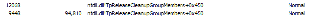](https://storage.tttang.com/media/attachment/2021/12/28/7b4e82c0-4918-4647-9a1b-02c75ae590a2.png)  
Windows 的后台线程

[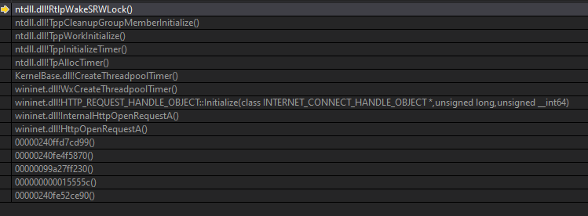](https://storage.tttang.com/media/attachment/2021/12/28/37df500e-fa9e-4e08-be94-809d26603ca3.png)  
wininet.dll 线程崩溃

从理论上讲，这是一个简单的实现！最后，我们要解决的事情是如何在 Cobalt Strike 休眠时调用这一切。其实，解决办法非常简单。

## [ox01 Hooking 技术](#toc_ox01-hooking)

如果我们看一下 Cobalt Strike 二进制文件的 IAT（导入地址表），我们会发现它是利用 Kernel32.dll 的 Sleep 函数来实现其休眠功能的。

[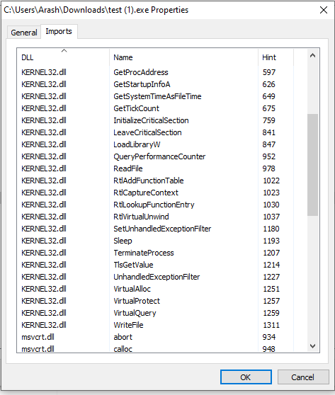](https://storage.tttang.com/media/attachment/2021/12/28/861f2d94-107d-4939-9b01-70976ae5f446.png)

Cobalt Strike 的导入函数（我们最感兴趣的是 Sleep 函数）

接下来，我们需要做的就是在 kernel32.dll 中钩住 Sleep 函数，然后将我们钩住的 Sleep 函数中的行为做如下改动：

```plain
void WINAPI HookedSleep(DWORD dwMiliseconds) {
        DoSuspendThreads(GetCurrentProcessId(), GetCurrentThreadId());
        HeapEncryptDecrypt();
        OldSleep(dwMiliseconds);
        HeapEncryptDecrypt();
        DoResumeThreads(GetCurrentProcessId(), GetCurrentThreadId());
}
```

简单来说，我们要挂起所有线程并运行自己的加密例程，具体如下所示：

```plain
static PROCESS_HEAP_ENTRY entry;
VOID HeapEncryptDecrypt() {
    SecureZeroMemory(&entry, sizeof(entry));
    while (HeapWalk(currentHeap, &entry)) {
        if ((entry.wFlags & PROCESS_HEAP_ENTRY_BUSY) != 0) {
            XORFunction(key, keySize, (char*)(entry.lpData), entry.cbData);
        }
    }
}
```

这将创建一个 PROCESS\_HEAP\_ENTRY 结构体，并且每次调用都会将其清零，然后遍历堆并将数据放入该结构体中。然后，检查当前堆条目的标志，并验证它是否已经被分配，这样我们就能只在分配时进行加密。

然后，我们运行原始来的休眠函数（该函数将被创建为钩子函数的一部分），并在恢复线程之前进行解密。这样我们就可以防止在再次引用分配例程的时候出现崩溃。总的来说，这是一个相当简单的过程。我们还没有介绍钩子技术的威力。

首先，什么是函数挂钩技术呢？函数挂钩意味着我们在进程空间内重新路由对一个函数的调用，如 Sleep()，以在内存中运行我们的任意函数。通过这样做，我们可以改变函数的行为，观察被调用的参数（因为我们指定的函数现在被调用了，所以，可以打印传递给它的参数，等等），甚至可以阻止该函数工作。在许多情况下，这就是 EDR 如何监测和警告可疑行为的工作方式。他们钩住被认为可疑的函数，比如 CreateRemoteThread，并记录所有的参数，以便以后对可疑的调用发出警报。

让我们来看看如何钩住一个函数。实际上，有很多方法可以实现这一点，但我只打算介绍两钟技术，并只深入探讨其中一个。这里要介绍的两种技术是 IAT 挂钩技术（IAT hooking）和蹦床补丁（Trampoline Patching）技术。

## [0x02 IAT 挂钩技术](#toc_0x02-iat)

IAT 挂钩技术的思路很简单。每个进程空间都有一个所谓的导入地址表。这个表包含了一组 DLL，以及二进制文件导入的函数的指针。我们推荐的、也是最稳定的挂钩方式，是浏览导入地址表，先找到要钩取的 DLL，再找到要钩取的函数，然后，覆盖其函数指针，使其指向挂钩函数（hooked function）。每当进程调用该函数时，它就会找到该指针并调用你的函数。如果要将原函数作为挂钩函数的一部分进行调用，则可以存储原指针。这方面的示例代码可以在 ired.team 网站找到：[https://www.ired.team/offensive-security/code-injection-process-injection/import-adress-table-iat-hooking](https://www.ired.team/offensive-security/code-injection-process-injection/import-adress-table-iat-hooking)。

不过，这种方法有优点也有缺点。两个主要的明显的优点是，它的实现非常简单，而且非常稳定。毕竟，你只是改变了函数的调用，仅此而已，你并没有改变任何可能导致系统崩溃的东西。下面，我们来谈谈缺点。

如果代码使用 GetProcAddress() 来解析函数的话，它就不会出现在 IAT 中（虽然我相信你可以通过 EAT 钩子来解决这个问题，但这是另一个问题）。这是一种非常有针对性的挂钩方法，虽然有优点，但如果你想监控更广泛的调用，这就是一把双刃剑（比如可以挂钩 NtCreateThreadEx，而不仅仅是 CreateRemoteThread；但是如果调用的级别较低，可能会错过很多调用）。理论上来说，这也更容易被发现。

这很简单，我就不多说了。这里还有一篇讨论这个问题的文章：[https://guidedhacking.com/threads/how-to-hook-import-address-table-iat-hooking.13555/](https://guidedhacking.com/threads/how-to-hook-import-address-table-iat-hooking.13555/)。

## [0x03 蹦床补丁技术](#toc_0x03)

现在让我们来谈谈蹦床补丁技术。该技术更难实现，更难获得稳定性，而且由于必须解决很多相对的寻址问题，所以，在 x64 下需要很长的时间才能得到普及。值得庆幸的是，已经有人花时间做了一个开源库，以非常稳定的方式完成了所有这些所需的工作：[https://github.com/TsudaKageyu/minhook](https://github.com/TsudaKageyu/minhook)。

但是为了学习，让我们继续考察这种挂钩技术到底是如何工作的，如果愿意的话，大家也可以重新实现自己的钩子。起初，我曾考虑过分享我自己的实现，但我最终认为还是留给读者自己练手较好。相反，我们将对我的实现进行调试，以更好地理解这种补丁机制是如何工作的。

整个想法是这样的：我们将使用 GetProcAddress 和 LoadLibrary 解析函数的基址。然后，我们将解析有效汇编的前 X 个指令，并将其加到至少要有 5 个字节。更具体地说，我们将使用一种非常常见的技术，即使用五字节相对跳转操作码 (E9) 跳转到从函数基址+-2GB 的位置，然后跳转到任意函数。显然，为了使其工作，我们需要覆盖函数的前五个字节。如果我们这样做，并且如果需要再次调用它，就会破坏原来的函数。为了确保可以在需要时解析原函数，我们必须保存第一条指令，该指令稍后将作为蹦床的一部分写入代码洞，而蹦床将为我们运行该指令，然后跳回函数下一条指令。但是，如果第一条指令只有四个字节，那么如果我们写五个字节的话，显然就会破坏第二条指令的第一个操作码。因此，我们需要将前两条指令都存储在蹦床中，这样的话，蹦床将运行前两条指令并跳回第三条指令继续执行。无论这个蹦床在哪里，都将成为被挂钩的原始函数的新指针。所以，原来的函数指针现在是这样的：

```plain
OldFunction = Trampoline -> JMP to original location of function + size of trampoline
```

这个代码洞还能跳转到我们任意函数的位置：在原函数基址处写入的、跳到相对基址五字节处的 jump 指令，将会跳到这里，然后跳转到任意函数，具体如下所示：

```plain
Base of old function jmps -> cave that contains the following assembly 
FF 25 00 00 00 00 [PUSH QWORD PTR]
00 00 00 00 00 00 00 00 [This is an arbitrary pointer to your function, in your C it would be &ArbitraryFunction]
```

这样，我们就可以在调用原函数时运行任意函数，并根据需要调用原函数。

现在，让我们通过调试来考察这一过程。这里，我们将挂钩 MessageBoxa 函数。首先，让我们看看 MessageBoxA 是“干净的”，还是已经被挂钩了。

首先，我们钩住 MessageBoxa，具体代码如下所示：

```plain
Hook("user32.dll", "MessageBoxA", (LPVOID)NewMessageBoxA, (FARPROC*)&OldMessageBoxA);
```

函数 MessageBoxA 位于 user32.dll 中，因此，如果我们想要获得它的基地址，就必须从那里去找。为此，我们需要找到基地址，修补相应代码，向代码洞添加一些代码，解析相对跳转指令，并将蹦床存储在 OldMessageBoxA 函数中。

现在，已经挂钩的 MessageBoxA 函数如下所示：

```plain
int WINAPI HookedMB(HWND hWnd, LPCSTR lpText, LPCSTR lpCaption, UINT uType) {
    return OldMB(hWnd, "HOOKED", lpCaption, uType);
}
```

我们需要匹配返回类型和参数，这里我们将运行原始的 MessageBoxA，但无论如何，我们至少要改一下文本，以最终显示“hooked”。

现在，让我们看看修改前后的样子。

修改前：

[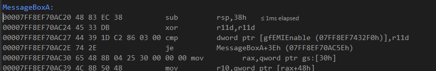](https://storage.tttang.com/media/attachment/2021/12/28/1f70cf6c-0a61-4227-9ff8-0f29d97999cf.png)

[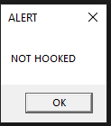](https://storage.tttang.com/media/attachment/2021/12/28/a8ab0889-031c-4e77-987f-9eb70e9e3155.png)

未挂钩的消息框函数打补丁之前显示的内容

修改之后：

[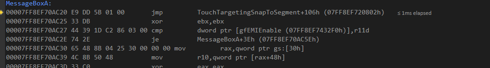](https://storage.tttang.com/media/attachment/2021/12/28/a7a7c0db-7ba1-46c4-bde8-e1874296a0bb.png)

[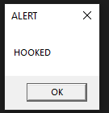](https://storage.tttang.com/media/attachment/2021/12/28/48ac3023-a36e-42ba-8dad-0e4253628768.png)

对已经挂钩的消息框函数打补丁之后显示的内容

因此，消息框 A 是前面提到的问题的一个很好的例子。正如您所看到的，在修改之前的截图中，第一条指令只有四个字节。这意味着我们需要存储前两个指令；然后我们的相对跳转指令继续覆盖前五个。我们不需要更改剩余的字节，因为我们将让蹦床执行我们存储的前两个字节，然后跳回位置 0x00007FF8EF70AC27 处。现在，让我们继续在调试器中查看新的挂钩函数是什么样子的：

[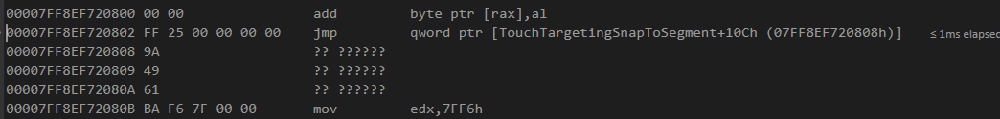](https://storage.tttang.com/media/attachment/2021/12/28/08630219-367a-4488-a615-010fd16b57a2.png)

跳转到已挂钩的函数

这里我们先看到两个 00。我这样做，是为了确保向代码洞中写入多个蹦床时，不会覆盖函数指针尾部的 0000。接下来，我们看到 FF2500000000，这是 JMP QWORD PTR 指令。之后，您将看到八个字节，它们是指向已挂钩的函数的指针！如果执行此指令，我们将看到：

[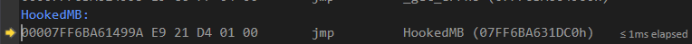](https://storage.tttang.com/media/attachment/2021/12/28/9e412ac7-0cbc-4813-85f7-982e5ff52349.png)

被挂钩的函数中的第一条指令

最后：

[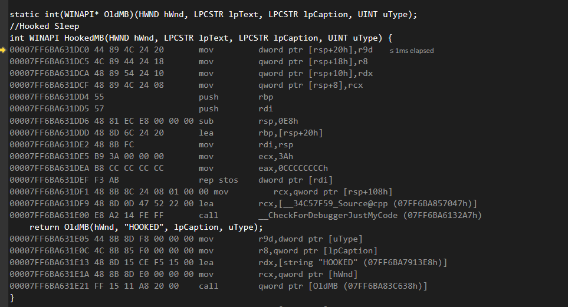](https://storage.tttang.com/media/attachment/2021/12/28/358239b0-c91f-4ac6-a029-20de670fd7c0.png)

被挂钩的函数内部情况

在这里，我们可以看到被挂钩的函数。这个函数一旦运行，就会立即返回原函数，因此让我们继续执行原函数：

[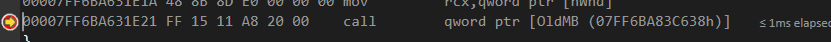](https://storage.tttang.com/media/attachment/2021/12/28/5927d73d-a5bb-42bd-8a0a-5521846a3772.png)

调用原函数

让我们看看这会导致什么：

[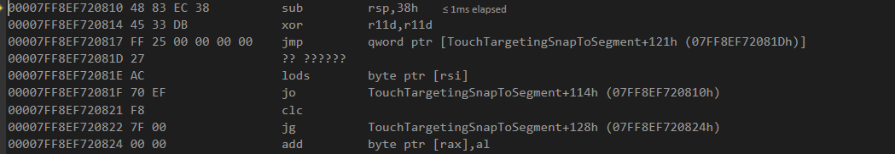](https://storage.tttang.com/media/attachment/2021/12/28/d1eb95af-4bdf-43ff-aa53-b1ba7afd219a.png)

蹦床

如果你看一下这张图，会发现这里正在执行我们覆盖的前两条指令！就在复制的字节之后，我们执行了第二个 JMP QWORD PTR 指令，以便跳转到 OriginalFunction+7 处（因为这个例子中蹦床的大小是 7 个字节）。这将使我们处于第三条指令的起点位置。让我们继续看看。

[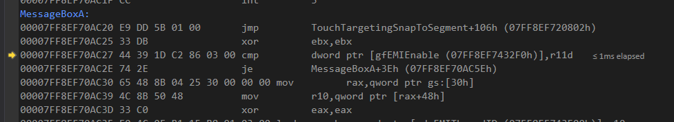](https://storage.tttang.com/media/attachment/2021/12/28/109ec00c-1b79-4488-952c-24f1d031fd76.png)

继续执行

在这里，可以看到我们现在是在 CMP 指令处，从我们离开的地方继续执行。

通过这个过程，可以弄清楚像 minhook 这样的工具是如何工作的。现在，您既可以自己实现它，也可以直接使用像 minhook 这样稳定的东西。如果你觉得自己很喜欢冒险，我可以给你一些免费的、未经优化的代码洞搜索代码，你可以在此基础之上自己搞：

```plain
for (i = 0; i < 2147483652; i ++) { currentByte = (LPBYTE)funcAddress + i; if (memcmp(currentByte, "\x00", 1) == 0) { caveLength += 1; LPBYTE newByteForward = currentByte + 1; if (memcmp(newByteForward, "\x00", 1) == 0) { while (memcmp(newByteForward, "\x00", 1) == 0) { caveLength++; newByteForward++; } } if (caveLength >= totalSize) {
      while (memcmp(currentByte - 1, "\x00", 1) != 0 || memcmp(currentByte - 2, "\x00", 1) != 0) {
        currentByte++;
      }
      // Make sure the section is executable or try again
      MEMORY_BASIC_INFORMATION info;
      VirtualQuery(currentByte, &info, totalSize);
      if (info.AllocationProtect == 0x80 || info.AllocationProtect == 0x20 || info.AllocationProtect == 0x40) {
        break;
      }
      else {
        i += caveLength;
        caveLength = 0;
        continue;
      }
    }
    else {
      i += caveLength;
      caveLength = 0;
      continue;
    }
  }
}
```

## [0x04 将 EXE 放在一起](#toc_0x04-exe)

是时候把所有东西放在一起，看看效果如何了。下面给出具体步骤：

```plain
钩住 Sleep() 函数
在钩住的函数中，挂起所有的线程
使用 HeapWalk() 对所有分配的空间进行加密
通过蹦床函数运行原来的 Sleep() 函数
使用 HeapWalk() 解密所有分配的数据
恢复所有线程
```

我将假设你已经实现了自己的加密、挂钩和全线程暂停函数。这些代码大致是这样的：

```plain
static PROCESS_HEAP_ENTRY entry;
VOID HeapEncryptDecrypt() {
    SecureZeroMemory(&entry, sizeof(entry));
    while (HeapWalk(currentHeap, &entry)) {
        if ((entry.wFlags & PROCESS_HEAP_ENTRY_BUSY) != 0) {
            XORFunction(key, keySize, (char*)(entry.lpData), entry.cbData);
        }
    }
}
static void(WINAPI* OrigianlSleepFunction)(DWORD dwMiliseconds);
void WINAPI HookedSleepFunction(DWORD dwMiliseconds) {
    DoSuspendThreads(GetCurrentProcessId(), GetCurrentThreadId());
    HeapEncryptDecrypt();
    OriginalSleepFunction(dwMiliseconds);
    HeapEncryptDecrypt();
    DoResumeThreads(GetCurrentProcessId(), GetCurrentThreadId());
}

void main()
{
    DoSuspendThreads(GetCurrentProcessId(), GetCurrentThreadId());
    Hook("kernel32.dll", "Sleep", (LPVOID)HookedSleepFunction, (FARPROC*)&OriginalSleepFunction, true);
    if (!OldAlloc) {
        MessageBoxA(NULL, "Hooking RtlAllocateHeap failed.", "Status", NULL);
    }
    DoResumeThreads(GetCurrentProcessId(), GetCurrentThreadId());
    // Sleep is now hooked
}
```

上面的代码很简单，但是显然不包括 implant 代码。您可以通过执行 shellcode 在相同的进程空间中运行 implant 代码，也可以将其转换为 DLL 并将其注入到 beacon 中。由于它使用了 HeapWalk() 函数，所以，它可以加密过去、现在和将来分配的空间，而不会出现任何问题——只需要钩住 Sleep() 函数就可以开始调用。

演示时间到了！下面是具体的演示代码：

[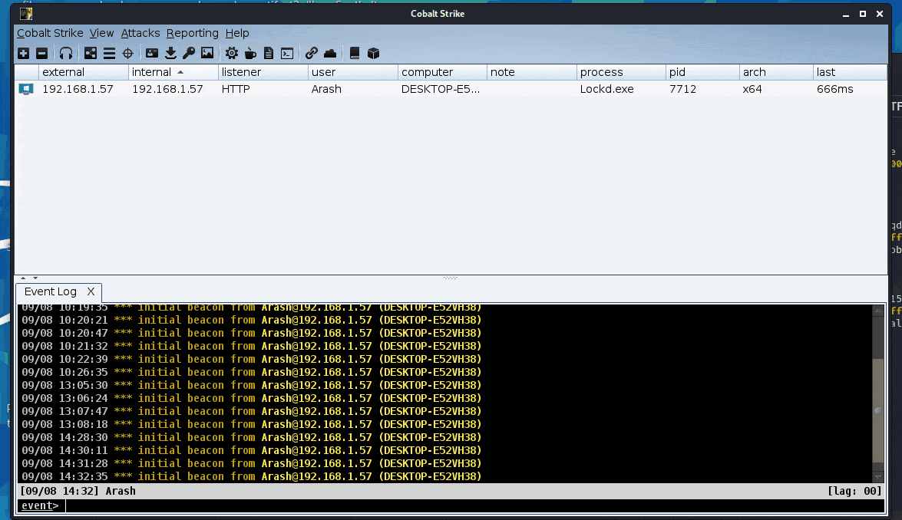](https://storage.tttang.com/media/attachment/2021/12/29/3d36bd82-d9dd-412c-9de9-bb42a5078df9.gif)

EXE HeapWalk() 加密器示例

如你所见，原先的休眠时间为 1，这时 BeaconEye 捕捉到了我们的配置。然后，我们把睡眠休眠时间改为 5，然后开始加密，成功关闭了 BeaconEye。

请记住，由于这将加密所有堆分配，因此，它将不能作为注入线程工作，因为当 Cobalt Strike 处于休眠状态时，它所注入的进程将无法工作。想象一下，注入到 Explorer.exe 中，每次 beacon 休眠时，所有 Explorer 都会冻结。当需要作为线程注入时，这种解决方案显然不是最佳的方法。如果我们想让它作为一个线程工作，我们还有许多活要做。

在这里可以找到一个演示代码：[https://github.com/waldo-irc/LockdExeDemo](https://github.com/waldo-irc/LockdExeDemo)。

## [0x05 针对特定线程的堆加密：注意事项](#toc_0x05)

我们的新设计将不得不与一个独立的线程一起工作。我们将不能挂起其他线程；我们不能锁定堆，因为主进程需要继续运行。这意味着，当我们注入一个 beacon 线程时，我们必须确保所有的加密分配都只来自该线程。如果我们针对适当的线程，我们就可以成功地避免这个问题。那么，我们怎样才能做到这一点呢？

到目前为止，我们的 dropper 已经拥有钩子功能。为了操纵堆，需要用到 Windows 系统中的一个函数子集：

```plain
HeapCreate()
HeapAllocate()
HeapReAllocate()
HeapFree()
HeapDestroy()
```

Windows 系统中的 malloc 和 free 函数位于 msvcrt.dll 库中，它们实际上就是 HeapAllocate 和 HeapFree 函数的高级包装器；而后两者又是 RtlAllocateHeap 和 RtlFreeHeap 函数的高级包装器，它们是 Windows 中最低级别的函数，直接管理堆。

[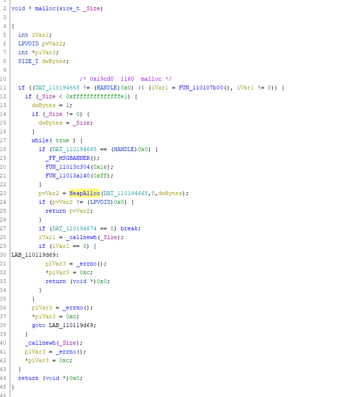](https://storage.tttang.com/media/attachment/2021/12/29/2f32979f-cf34-41ac-8abc-a3ef00dbe132.png)

来自 Ghidra 的截图

这意味着，如果我们将 RtlAllocateHeap、RtlReAllocateHeap 和 RtlFreeHeap 函数都挂钩，我们就可以跟踪 Cobalt Strike 中堆空间中分配和释放的所有内容。这当然是件好事，因为通过组合这三个函数，我们就可以在 map 中进行分配和重新分配，并在调用 free 时从 map 中删除它们。但是，这仍然无法解决我们的线程目标问题，不是吗？

不过，的确存在一个简单的解决办法！事实证明，如果从一个挂钩函数调用 GetCurrentThreadId 函数，实际上可以获得调用线程的线程 id，通过它，就可以注入 beacon，获得其线程 id，并执行类似如下的操作：

```plain
GlobalThreadId = GetCurrentThreadId(); We get the thread Id of our dropper!
HookedHeapAlloc () {
    if (GlobalThreadId == GetCurrentThreadId()) { // If the calling ThreadId matches our initial thread id then continue
        // Insert allocation into a list
    }
}
```

这样做是为了重新分配内存，执行清除操作是为了释放内存，别忘了：现在目标是一个线程！到目前为止，事情看上去很简单。但还记得之前的那个问题，我们不得不挂起其他线程的原因吗？在我们及时解密之前，WININET 和 RPC 调用仍然会试图访问加密的内存。这里有几个选项，但我使用了自认为很有趣的一个。由于加载的 shellcode 既不是有效的 EXE 也不是 DLL，因此，我能够从任何发起调用的对象中分配内存，这些调用源自没有名称的模块。

为了让这个机制起作用，我们需要解析进行函数调用的模块。为此，这可以通过以下代码：

```plain
#include 
#pragma intrinsic(_ReturnAddress)
GlobalThreadId = GetCurrentThreadId(); We get the thread Id of our dropper!
HookedHeapAlloc (Arg1, Arg2, Arg3) {
    LPVOID pointerToEncrypt = OldHeapAlloc(Arg1, Arg2, Arg3);
    if (GlobalThreadId == GetCurrentThreadId()) { // If the calling ThreadId matches our initial thread id then continue

      HMODULE hModule;
      char lpBaseName[256];
    if (::GetModuleHandleExA(GET_MODULE_HANDLE_EX_FLAG_FROM_ADDRESS, (LPCSTR)_ReturnAddress(), &hModule) == 1) {
           ::GetModuleBaseNameA(GetCurrentProcess(), hModule, lpBaseName, sizeof(lpBaseName));
         }
        std::string modName = lpBaseName;
        std::transform(modName.begin(), modName.end(), modName.begin(),
                [](unsigned char c) { return std::tolower(c); });
        if (modName.find("dll") == std::string::npos && modName.find("exe") == std::string::npos) {
                     // Insert pointerToEncrypt variable into a list
        }
    }
}
```

上面的代码用于获取 intrinsic 函数\_ReturnAddress，并利用它与 GetModuleHandleEx 和 GET\_MODULE\_HANDLE\_EX\_FLAG\_FROM\_ADDRESS 标志来识别是哪个模块发起的这个调用。然后，我们可以把它转换成小写的字符串，如果这个字符串不包含 DLL 或 EXE，我们将其插入。有了这个，就获得了一个稳定的分配列表，就可以在休眠时进行加密了。不过，你将需要为挂钩的重新分配函数重复这个过程。

为了执行加密操作，需要遍历这个列表并加密这些分配的内存，但是不能用 HeapWalk() 函数。这将取决于你是否决定使用 map、向量、链接列表或其他数据结构。你可能想把真正的 HeapAlloc 或 ReAlloc 返回的指针存储到数组中，遍历数组并按大小对那里的数据进行加密。上面的例子中的 Arg3 就是存放的内存大小数据（[https://docs.microsoft.com/en-us/windows/win32/api/heapapi/nf-heapapi-heapalloc](https://docs.microsoft.com/en-us/windows/win32/api/heapapi/nf-heapapi-heapalloc)）。

所以，现在我们可以钩住四个不同的函数，根据线程 ID 将分配的内存地址放到一个向量中，然后遍历向量并在休眠时加密每个地址。如果成功，我们应该能够再次绕过 BeaconEye。

现在是演示时间！同样，为了演示的目的，我们不会让休眠时间为 1 或更少。

[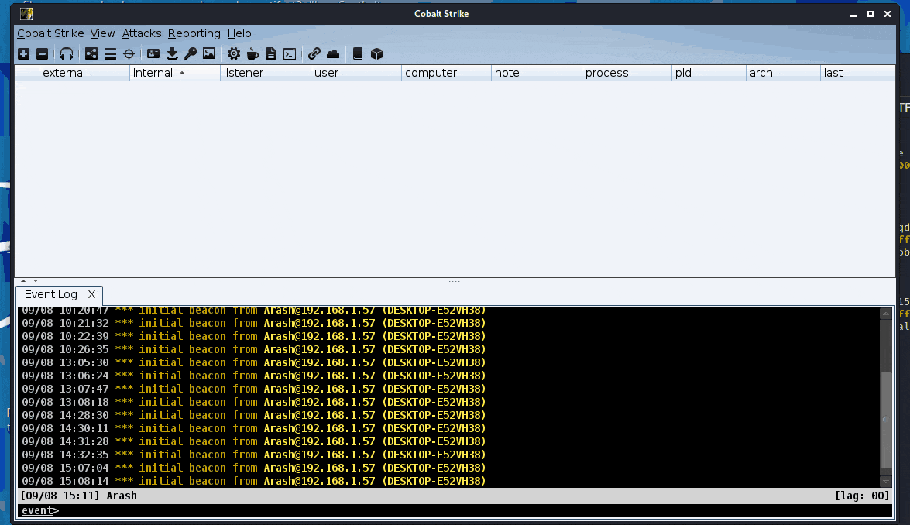](https://storage.tttang.com/media/attachment/2021/12/29/34241543-efb9-45dc-8b4c-f403639199b6.gif)

注入到 cmd.exe 中并绕过 BeaconEye

[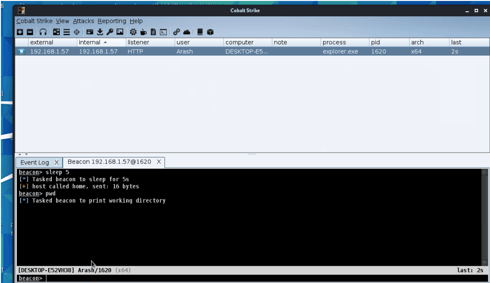](https://storage.tttang.com/media/attachment/2021/12/29/05d2d2b4-e0a8-4780-afc5-d34db3350621.png)

注入到 explorer.exe 中，并且运行稳定

成功了！实际上，我们可以注入到任何进程，并且只加密我们自己线程的堆；该进程不会因为我们的代码进入休眠而崩溃。

## [0x06 其他发现](#toc_0x06)

在实现稳定的堆加密的旅程中，我还发现了三个有趣的东西，下面分别加以介绍。

前两个发现，实际上就是其他的 BeaconEye 绕过方法。与任何工具一样，BeaconEye 也有自己的缺陷。在无意之中，我发现了两钟彻底绕过 BeaconEye 的机制。

第一个机制是用 beacon 注入 explorer.exe，似乎可以完全绕过 BeaconEye，具体如下所示。

[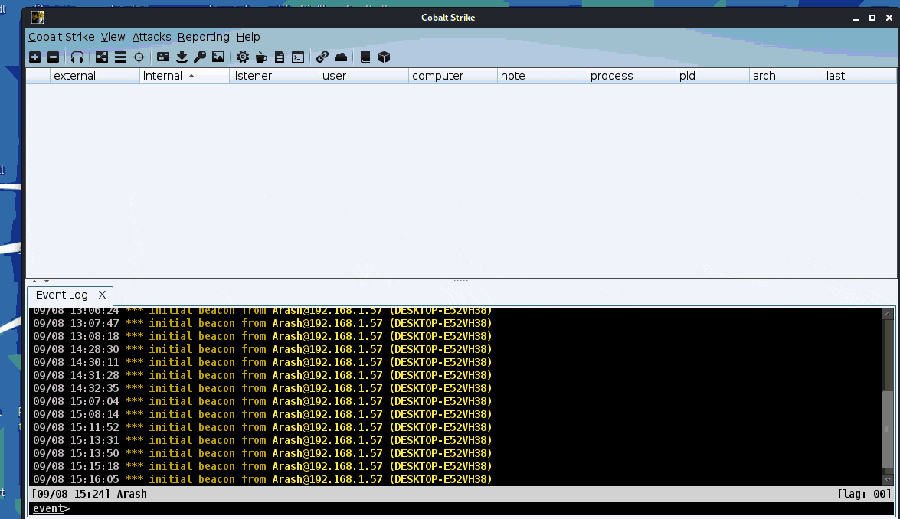](https://storage.tttang.com/media/attachment/2021/12/29/5f2c8492-2ec2-49fa-ae47-9c6842c16313.gif)

基于 Explorer.exe 的 BeaconEye 绕过方法

正如你所看到的，对 cmd.exe 执行注入操作时的确被发现了，但 Explorer.exe 似乎没有得到有效的检查。

此外，通过初始化二进制文件中的相关符号，也能顺利绕过 BeaconEye，具体代码如下所示：

```plain
#include 
#pragma comment(lib, "dbghelp.lib")
SymInitialize(GetCurrentProcess(), NULL, TRUE);
```

请看下面的演示：

[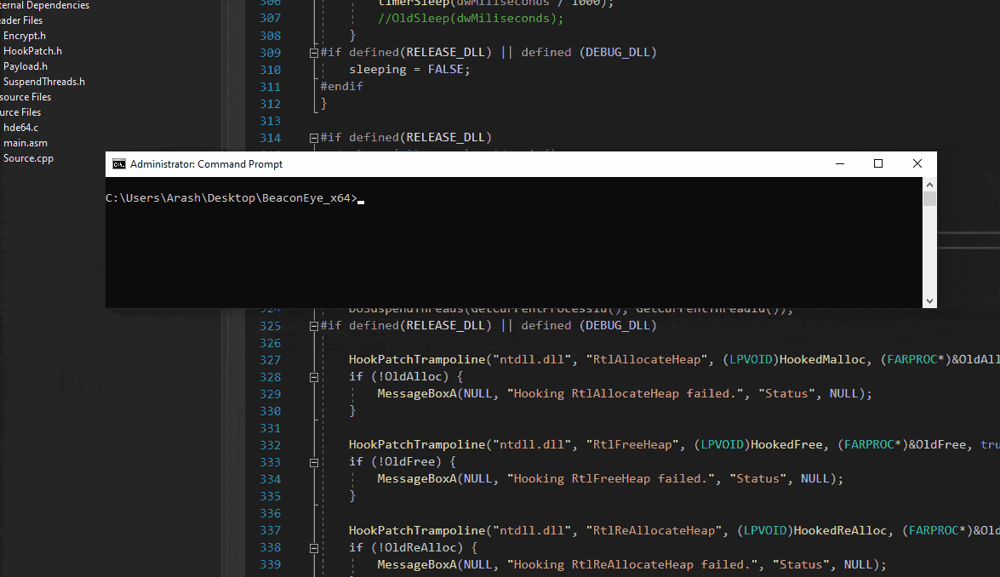](https://storage.tttang.com/media/attachment/2021/12/29/adaea98a-10e4-4af2-88cf-0d1a0304070a.gif)

用符号绕过 BeaconEye

最后，我注意到一些有趣的事情……我不确定其他人是否已经知道，但 Cobalt Strike 在退出时绝对不会清理在堆中分配的内存。这意味着如果你退出一个注入的 Cobalt Strike 线程后，并且进程没有重启，相关配置就会作为一个可提取的证据留在内存中。

最终演示：

[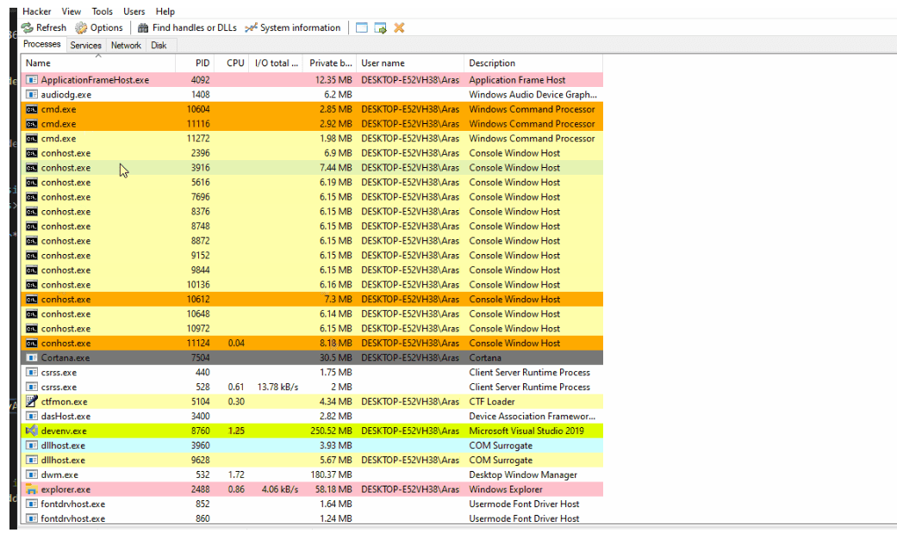](https://storage.tttang.com/media/attachment/2021/12/29/0dd95e4a-0109-4ebb-b60c-436977076b2f.png)

堆中的证据

也许利用本文中所介绍的知识，读者自己就可以设法解决这个问题。

[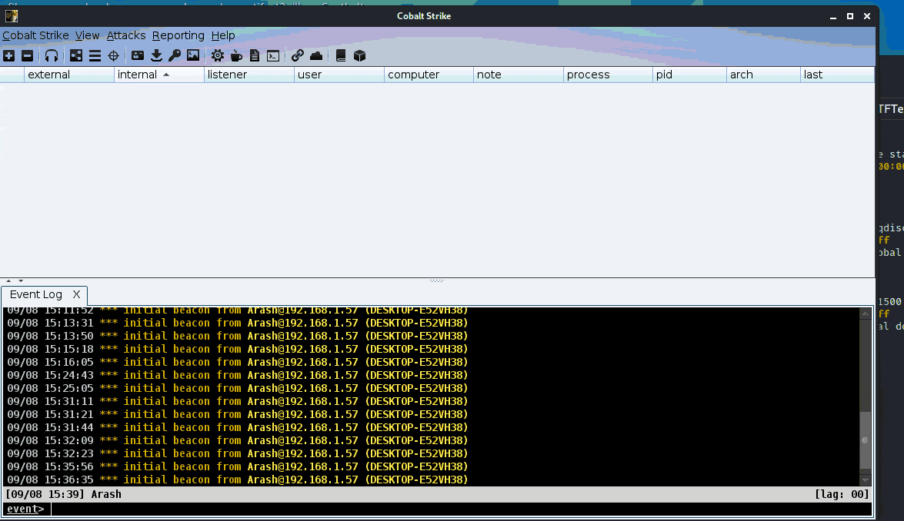](https://storage.tttang.com/media/attachment/2021/12/29/e93da20a-c22d-41e9-867e-729a3f86aa6c.gif)

清理堆

## [0x09 小结](#toc_0x09)

鉴于本人水平有限，本文中难免会出错，欢迎大家请随时指出，我很乐意改正。毕竟学习交流才是本文的主要目标。

文中的演示代码，可以从这里下载：[https://github.com/waldo-irc/LockdExeDemo](https://github.com/waldo-irc/LockdExeDemo)。

在我的下一篇文章中，我想研究一下钩子技术的其他用途，也许它们可以用来做一些更有趣的事情。

原文地址：[https://www.cyberark.com/resources/threat-research-blog/hook-heaps-and-live-free](https://www.cyberark.com/resources/threat-research-blog/hook-heaps-and-live-free)
