# IOT 安全 - 固件提取 - 先知社区

IOT 安全 - 固件提取

- - -

本次案例主要通过说明 STM32 某芯片来讲解大致的固件提取过程，从芯片上直接提取固件可以从以下三个角度来进行。

### 工具准备

工欲善其事必先利其器，接下来介绍固件提取中常用到的部分工具

#### 基础设备

-   FT232

FT232 芯片：从 USB 到串口的桥梁

> FT232 芯片内部集成了 USB 串口引擎（USB Serial Engine，简称 USB-Serial），通过 USB 接口与主机设备通信，同时利用内部的[UART](https://www.techphant.cn/tag/uart)引擎与外部设备进行串口通讯。通过这种方式，FT232 芯片实现了 USB 与串口之间的桥接，为设备提供了灵活的通讯接口。

[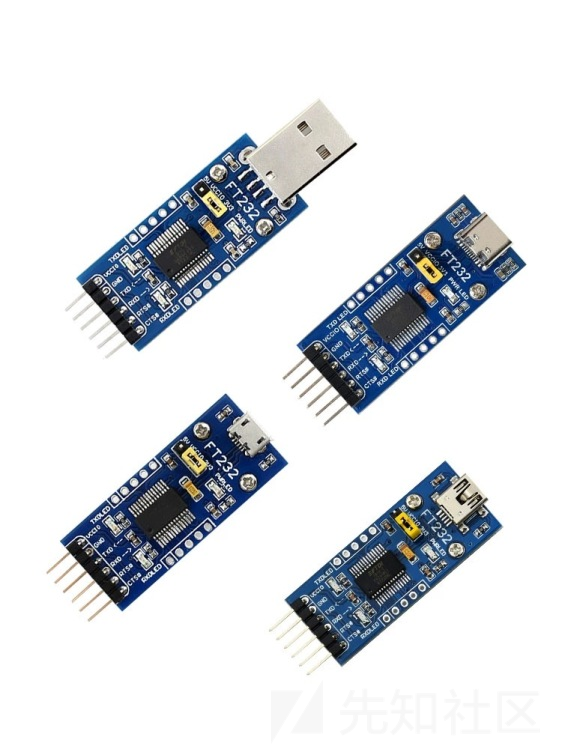](https://xzfile.aliyuncs.com/media/upload/picture/20240229234938-253f1cac-d71a-1.png)

在我们确定好引脚后，通过 FT232 的连接可以直接用 USB 口连接电脑，如下图

[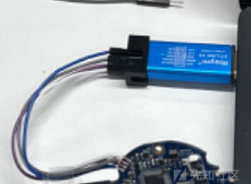](https://xzfile.aliyuncs.com/media/upload/picture/20240229234946-29bc42f0-d71a-1.png)

-   杜邦线

如上图所示，将 FT232 与串口进行连接的线就是杜邦线

> 电子行业中，杜邦线可用于实验板的引脚扩展，增加实验项目等，能够非常牢靠地和[插针](https://baike.baidu.com/item/%E6%8F%92%E9%92%88/6123425?fromModule=lemma_inlink)连接，无需焊接，便于快速进行电路试验。

[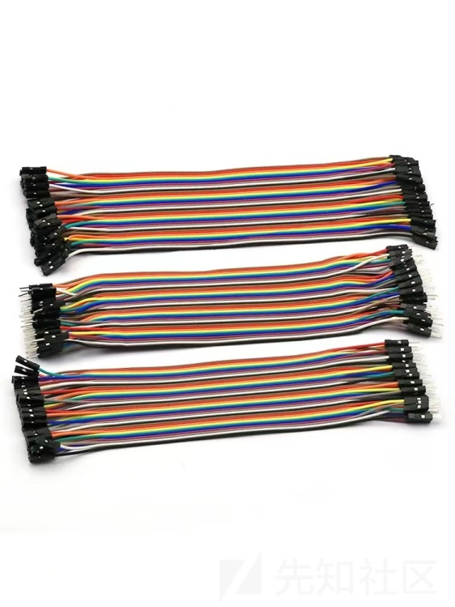](https://xzfile.aliyuncs.com/media/upload/picture/20240229234954-2eb924da-d71a-1.png)

-   万用表

> [万用表](https://www.eefocus.com/baike/1554961.html)是一种多功能电测量仪器，能够用于测量[直流电](https://www.eefocus.com/baike/1534453.html)压、[交流电压](https://www.eefocus.com/baike/1516654.html)、[电阻](https://www.eefocus.com/baike/1568801.html)、[电流](https://www.eefocus.com/tag/%E7%94%B5%E6%B5%81/)、[电容](https://www.eefocus.com/baike/1521588.html)、频率等参数。它在电子、电气、机械等领域中得到了广泛应用，是必备的基础测量工具之一。

在本次的操作中，万用表主要用来寻找 UART 中的四个 pin，分别是 VCC,GND,RX,TX

> VCC：供电 Pin，一般是 3.3V  
> GND：接地 Pin，如果 RX 接收数据有问题，就要接上这个 Pin  
> RX：接收数据 Pin  
> TX：发送数据 Pin

上述的工具属于必备工具（万用表在部分情况下也可以不使用，因为 PIN 脚可以遍历尝试），接下来的连接方式是选择一种或一种以上。

#### 焊烙

在利用串口 UART 进行连接的时候，因为杜邦线无法牢固的连接串口和 FT232，因此需要将芯片上的 PIN 脚和杜邦线的一段进行焊接从而使得连接稳定。该操作需要一定手法和设备，请谨慎操作或者请专业人员操作。

#### 夹/钩

ECU 探针  
除了焊接手法外，也可以用其他的方式进行固定，如下图中利用 ECU 探针和操作台进行连接。

[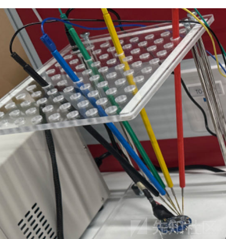](https://xzfile.aliyuncs.com/media/upload/picture/20240229235003-33ceab7a-d71a-1.png)

芯片夹  
芯片通用测试夹测试钩子，适用于 MCU 等精细的固定

[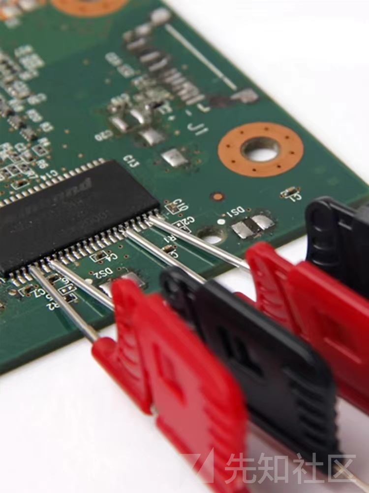](https://xzfile.aliyuncs.com/media/upload/picture/20240229235009-37af5ef6-d71a-1.png)

#### 软件工具

工具 STMlink 和 STM32CubeProgrammer

> [https://blog.csdn.net/weixin\_42880082/article/details/132074136](https://blog.csdn.net/weixin_42880082/article/details/132074136)  
> [https://shequ.stmicroelectronics.cn/thread-634681-1-1.html](https://shequ.stmicroelectronics.cn/thread-634681-1-1.html)

推荐更倾向于 STM32CubeProgrammer

[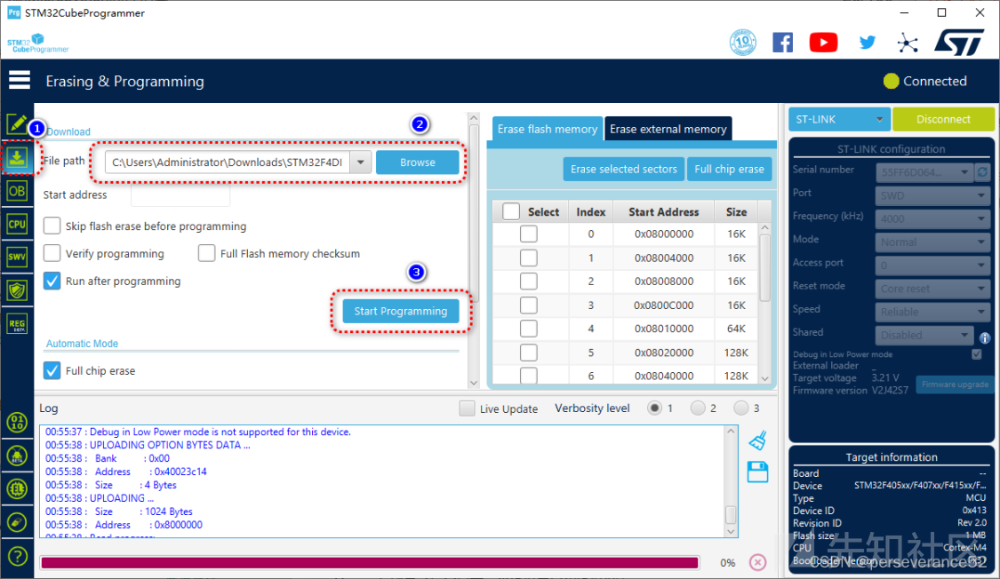](https://xzfile.aliyuncs.com/media/upload/picture/20240229235018-3c9385aa-d71a-1.png)

### 芯片的串口通信接口

> STM32 的串口通信接口有两种，分别是：UART（通用异步收发器）、USART（通用同步异步收发器）。而对于大容量 STM32F10x 系列芯片，分别有 3 个 USART 和 2 个 UART。

本次用到的是 UART，在利用其进行连接时需要先分辨其 4 个 PIN 脚，有的固件给出了标识而有的没有。  
一般 UART 时裸露的并且好辨认，注意虽然我们需要辨别的是 4 个 PIN 脚，但裸露在外的有时候不仅是 4 个可能超过 4 个，因此我们需要掌握识别的方法。  
如果没给我们标注好串口的名称，我们也可以通过万用表去定位每一个引脚。

#### 定位引脚

1、定位 GND  
将万用表调到蜂鸣档，然后将黑表笔接到背面电源焊锡点，红表笔分别触碰 UART 四个引脚的焊接点。发出声响的就是 GND 引脚。  
2、定位 VCC  
给路由器通电，VCC 是供电引脚，路由器的 VCC 电压始终未 3.30 不会发生变化，找到它可以帮助我们排除 RXD、TXD。  
将万用表调整到直流 20V 上。将一只表笔放在 GND 上，测试其他哪只引脚电压为 3.3V, 该引脚就为 VCC。  
3、定位 TXD  
开机会出现数据传输，如果该引脚出现了电压变化，则该引脚是 TXD。黑表笔放到刚刚判断的 GND 引脚上，重启路由器，用红表笔触碰其他两个引脚，电压发生变化的即为 TDX。  
4、定位 RXD  
输入引脚 RXD，每次有外部数据传输到路由器的时候，RXD 的电压都都会发生变化。这里其他 3 个引脚都确定了就剩下一个很容易的确定了 RXD。  
或者确定了其他三个引脚之后，剩下的一个即为 RDX。  
这里备注一个方法，如果在我们无法辨别除了 GND 外的引脚时，可以直接使用排列组合进行遍历，通过是否成功在电脑中弹出提示等其他方法进行判断。  
对于定位后的引脚可以用以下方法与杜邦线连接  
1.使用焊接方法  
2.使用 ECU 探针 + 工作台的方法固定

### 从外部 Flash 提取固件

> 智能设备固件存在 Flash 里，Flash 没有保护固件被非法读取的措施。如果 Flash 和 RAM 集成在 CPU 上，并且开启了加密的话是比较难提取固件的。但如果它用另外一种方式：（Flash 和 RAM、CPU 分别独立）这种情况下可以直接从外部连接 Flash 进行尝试提取

我们反汇编 STM32 底层驱动代码的时候，会牵涉到一些与芯片引脚、电气特性相关的知识。这个时候，就需要查看芯片对应的官方手册。  
一般《Reference manual 参考手册》和《Datasheet 数据手册》这两本手册是我们底层编程常用到。所以，推荐初学者一定要把这两本手册下载来对照学习。  
当然，这里说的两本手册，是针对每一种型号 STM32 都应该具有的，但不同型号的 STM32 对应的手册可能不同，也有可能相同。  
下载 datasheet，请找寻对应版本

> [https://www.st.com/en/microcontrollers-microprocessors/stm32f302cb.html](https://www.st.com/en/microcontrollers-microprocessors/stm32f302cb.html)

下载 reference manual 即参考手册（内含详细内容，精确至标志位）

> [https://www.st.com/resource/en/reference\_manual/rm0365-stm32f302xbcde-and-stm32f302x68-advanced-armbased-32bit-mcus-stmicroelectronics.pdf](https://www.st.com/resource/en/reference_manual/rm0365-stm32f302xbcde-and-stm32f302x68-advanced-armbased-32bit-mcus-stmicroelectronics.pdf)

在芯片上如何查找 Flash，因为芯片上存在很多内容，因此我们需要找到外部独立 Flash 的位置，如果眼睛好可以直接肉眼搜索。有条件可以使用电子显微镜查看。

[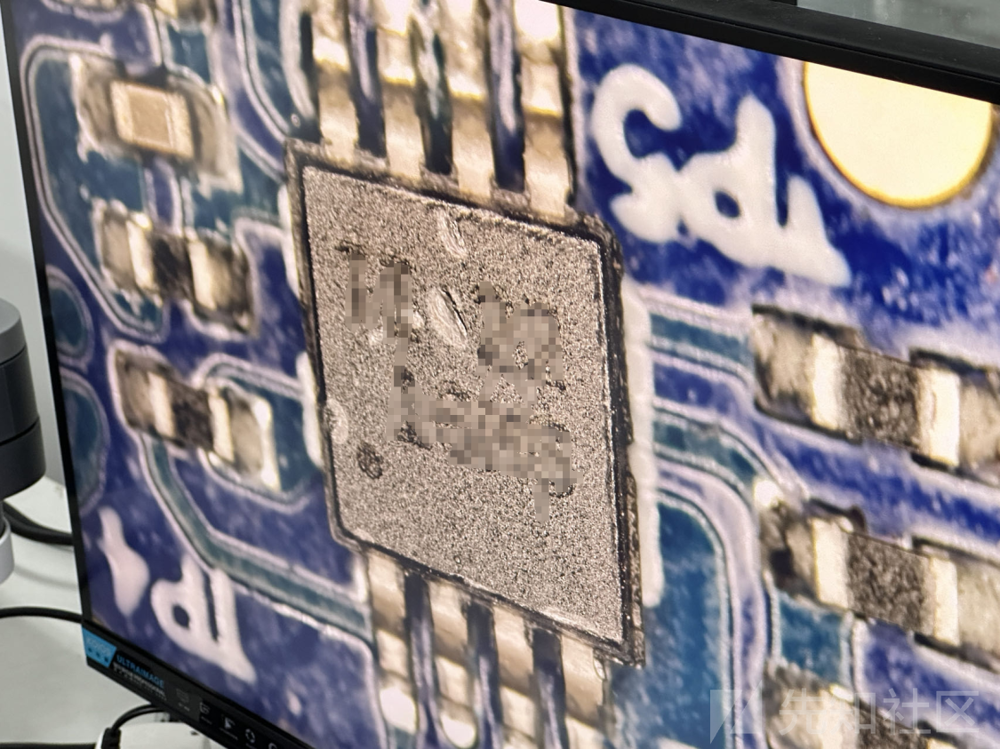](https://xzfile.aliyuncs.com/media/upload/picture/20240229235029-434faa22-d71a-1.png)

使用芯片夹可以实现 SOP、QFP 封装等针脚外露的芯片免拆固件提取，而对 QFN、BGA 等封装方式则无能无力。这里引用一张其他人的图，可以看到电子显微镜对应的内容也存在着一个小黑圆点作为一个方向的标记，

[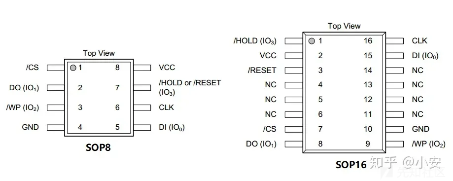](https://xzfile.aliyuncs.com/media/upload/picture/20240229235037-48313524-d71a-1.png)

上图存在八个引脚，对应的应该属于 8 引脚因此对照 SOP8，利用芯片夹进行连接

### 从 MCU 中提取固件

如何没有外置 Flash 而是在 MCU 的内置 Flash 中。这时需要通过调试接口（SWD/JTAG 等）对固件进行提取，也可以进行动态调试。  
对 MCU 上固件进行提取，首先需要根据芯片手册，找到调试接口。有些情况下，调试接口可能会引出。  
利用  
下下载 datasheet，请找寻对应版本

> [https://www.st.com/en/microcontrollers-microprocessors/stm32f302cb.html](https://www.st.com/en/microcontrollers-microprocessors/stm32f302cb.html)

查询引脚位置，在 datasheet 中的 Pinouts and pin description，并且其中的 MCU 又分为 LQFP48、LQFP64 和 LQFP100 后面的数字对应的是他们的引脚数量。

[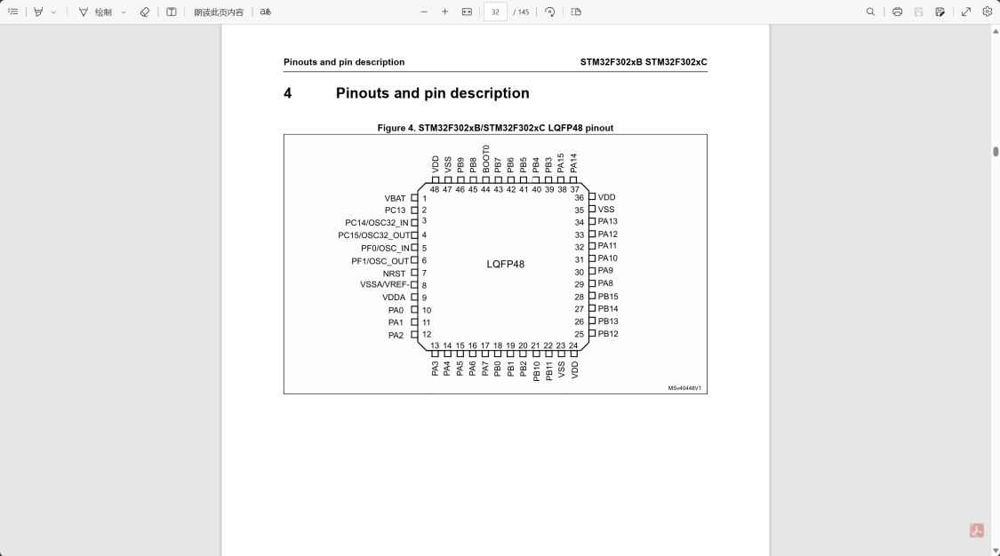](https://xzfile.aliyuncs.com/media/upload/picture/20240229235044-4c2fb506-d71a-1.png)

选择固件对应的内容，接下来查表。

[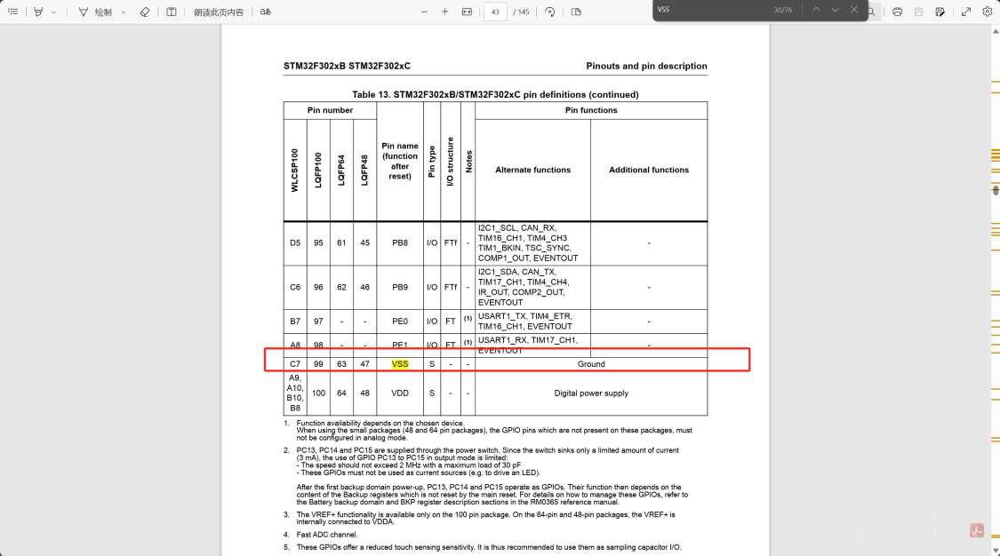](https://xzfile.aliyuncs.com/media/upload/picture/20240229235049-4f6d32ca-d71a-1.png)

[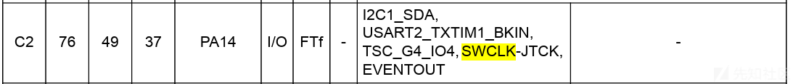](https://xzfile.aliyuncs.com/media/upload/picture/20240229235103-57bc4c54-d71a-1.png)

[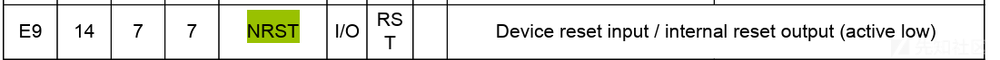](https://xzfile.aliyuncs.com/media/upload/picture/20240229235107-5a11595e-d71a-1.png)

然后利用芯片夹连接

[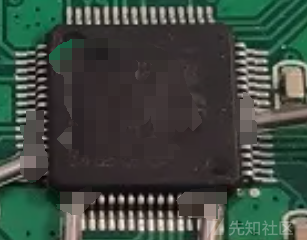](https://xzfile.aliyuncs.com/media/upload/picture/20240229235112-5cdf9042-d71a-1.png)

成功连接后我们利用 STM32CubeProgrammer 软件进行查看首先查看是否开启保护，下图为打勾或者取消勾选表示打开或者未开启，如果是 AA、BB 和 CC 作为等级划分表示如下

> 级别 0：无读保护（0xAA）  
> 读保护级别即设为 0。此时，在所有自举配置（用户 Flash 自举、调试或从 RAM 自举）中，均可执行对 Flash 或备份 SRAM 的读。
> 
> 级别 1：使能读保护  
> 在连接调试功能或从 RAM 或系统存储器自举时，不能对 Flash 或备份 SRAM 进行访问（读取、擦除、编程）。读请求将导致总线错误。
> 
> 级别 2：禁止调试/芯片读保护（慎用）  
> 将 0xCC 写入 RDP 选项字节时，可激活读保护级别 2。设置读保护级别 2 后：  
> — 级别 1 提供的所有保护均有效。  
> — 不再允许从 RAM 或系统存储器自举。  
> — JTAG、SWV（单线查看器）、ETM 和边界扫描处于禁止状态。  
> — 用户选项字节不能再进行更改。  
> — 从 Flash 自举时，允许通过用户代码对 Flash 和备份 SRAM 进行访问（读取、擦除、编程）。  
> 存储器读保护级别 2 是不可更改的。激活级别 2 后，保护级别不能再降回级别 0 或级别 1。

注意：激活级别 1 后，如果将保护选项字节 (RDP) 编程为级别 0，则将对 Flash 和备份 SRAM 执行全部擦除。因此，在取消读保护之前，用户代码区域会清零。特别注意如果直接修改那么固件会有变成板砖的可能！！！

[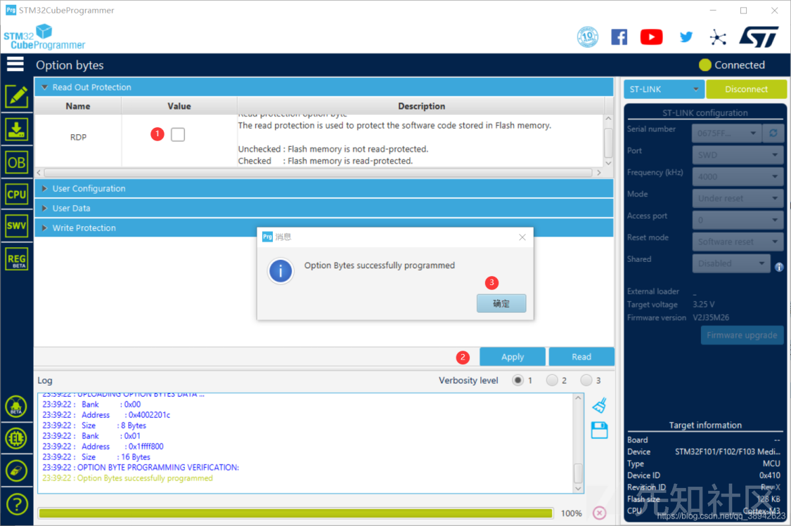](https://xzfile.aliyuncs.com/media/upload/picture/20240229235119-60f9b2f2-d71a-1.png)

但常常连接后发现 RBP 模式是 BB 即开启了读保护导致无从下手，只能另寻它法。
