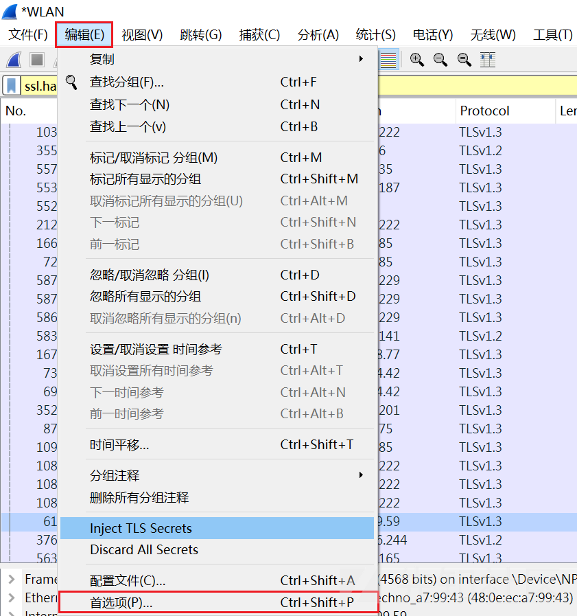
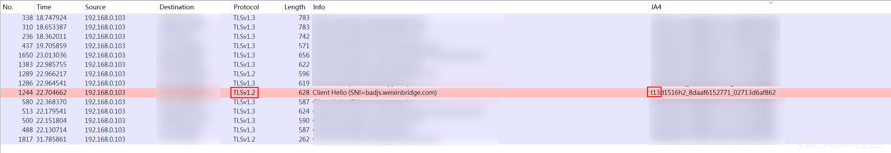
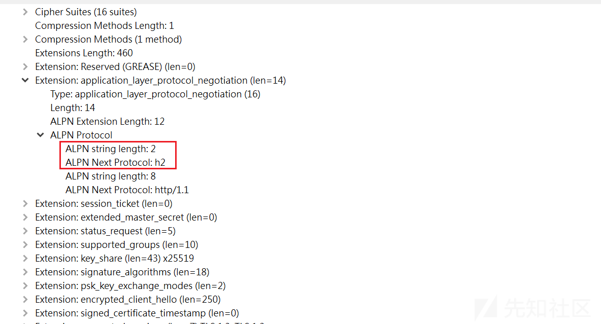
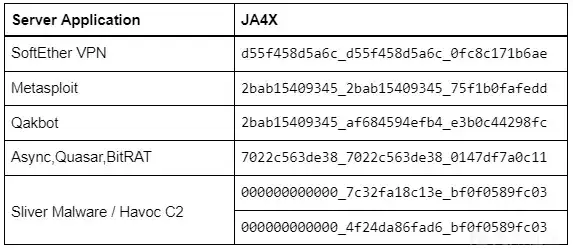

# JA 指纹识全系讲解（下） - 先知社区

JA 指纹识全系讲解（下）

- - -

# JA4+

JA4+ 首发于 2023 年九月，是 JA3/3s 的升级替代，它由早期针对 TLS 流量的指纹升级为多样协议的指纹识别方法，变为了指纹集，这也就是后缀带一个`+`的原因了

截至发稿，JA4+ 指纹集已开源的分支有：JA4、JA4S、JA4H、JA4L、JA4X、JA4SSH、JA4T、JA4TS、JA4TScan，它们应用的场景如下

| JA4+ 分支 | 支持协议 |
| --- | --- |
| JA4 | TLS Client |
| JA4S | TLS Server Response |
| JA4H | HTTP Client |
| JA4L | Light Distance/Location |
| JA4X | X509 TLS Certificate |
| JA4SSH | SSH Traffic |
| JA4T | TCP Client/Server |
| JA4TS | TCP Server Response |
| JA4TScan | Active TCP Server Fingerprint Scanner |

## 在 WireShark 中配置 JA4+

如果想要在 WireShark 中使用 JA4+，需要保证其版本高于或等于`4.2.0`，在 Github 下载 [ja4.dll](https://github.com/FoxIO-LLC/ja4/blob/main/wireshark/binaries/windows/4.2.0/ja4.dll)，完成后将其放入`\Wireshark\plugins\版本\epan`目录  
[](https://xzfile.aliyuncs.com/media/upload/picture/20240229094039-8ab31c5e-d6a3-1.png)

启动 WireShark 后还需要在【编辑】—> 【首选项】中进行配置  
[](https://xzfile.aliyuncs.com/media/upload/picture/20240229094058-965e06b8-d6a3-1.png)

打开首选项中的【外观】—> 【列】，点击`+`号添加一个新的列，类型选择自定义(Custom)，具体配置可参考官方的配置表  
[](https://xzfile.aliyuncs.com/media/upload/picture/20240229094127-a7977658-d6a3-1.png)

假设我们这里添加了 JA4 的规则，打开抓包页面后就会出现一条与 JA4 相关的列  
[](https://xzfile.aliyuncs.com/media/upload/picture/20240229094145-b2535378-d6a3-1.png)

同时也支持以 JA4 指纹作为过滤器  
[](https://xzfile.aliyuncs.com/media/upload/picture/20240229094202-bc5c5126-d6a3-1.png)

目前 WireShark 最新版已经原生支持 JA4 指纹了，如果对系列中的其他分支无需求就不用做上述额外的配置，同时还发现通过插件实现的 JA4 计算存在无法正确获取版本号的问题，导致计算出的 JA4\_a 不同  
[](https://xzfile.aliyuncs.com/media/upload/picture/20240229094221-c814557c-d6a3-1.png)

## JA4+ 与 JA3/3s 的区别

JA4+ 相比对 JA3/3s 来说，有三点较大的变化，分别是：拓展化、模块化、可读化，下面来分别解读一下这三点变化

### 拓展化

拓展化指的是协议层面上的拓展化，早期的 JA 系指纹，都是对 TLS 层的流量进行分析，到了 JA4+ 不止有 TLS，还拓展了 TCP、HTTP、SSH 层面的流量识别，甚至还可以对 TLS 证书和物理位置进行分析

### 模块化

在更早的 JARM 中（前 30 位和后 32 位分开计算），其实我们就可以看到 JA 系指纹模块化的思路了，到了 JA4+ 这一代，彻底将模块化的概念引入了，所有 JA4+ 指纹都有形如 a\_b\_c 这样的结构，它们分别代表指纹的不同部分  
[](https://xzfile.aliyuncs.com/media/upload/picture/20240229094252-da5bc2f6-d6a3-1.png)

模块化最大好处是，使整个指纹不再局限于某一个指标，哪怕再次更新类似 GREASE 的机制，也不会使整个指纹变得不可用，同时，模块化还可以让检测变得更加灵活和细化，例如，可以单独以 JA4\_a 搜索或者使用 JA4\_ab 进行搜索

### 可读化

在早期的 JA 系指纹中，最终产生的指纹都是机器可读的，对人类来说并没有意义，而 JA4+ 的可读化升级使得人类也可以通过指纹中的字符判断指纹的基础信息  
[](https://xzfile.aliyuncs.com/media/upload/picture/20240229094316-e8b7217e-d6a3-1.png)

## JA4

JA4 对标的是早期的 JA3，主要是对 Client Hello 报文实现指纹化，升级之处在于兼容了新的 QUIC（Quick UDP Internet Connections）协议，同时也依然支持之前的 TCP 协议，顺便解决了随机化带来的各种问题  
[](https://xzfile.aliyuncs.com/media/upload/picture/20240229094341-f72edd8c-d6a3-1.png)

### 什么是 QUIC

对于用户侧来说 QUIC 主要解决的是延迟的问题，这里我们主要说一下它和 TCP 的区别，简单来说，QUIC 进行了一次 “资源整合”，它把之前 HTTP/2、TLS、TCP 三者的优势集合起来

由于 QUIC 已经整合了这些内容，那么让它继续工作在 HTTP/2 下会出现许多问题，所以便催生了 HTTP/3，因为 QUIC 本身是要取代 TCP 的，所以它的传输层协议选择的是 UDP  
[](https://xzfile.aliyuncs.com/media/upload/picture/20240229094403-048b1536-d6a4-1.png)

### JA4 计算原理

JA4 计算的是 Client Hello 报文，这里以官方给出的 Chrome JA4 指纹作为样例来进行演示`JA4=t13d1516h2_8daaf6152771_02713d6af862`，分成 JA4\_a、JA4\_b、JA4\_c 三部分，计算的大原则是：**按照规定顺序排列，忽略所有 GREASE 值**

#### JA4\_a

-   `t`：代表 TCP，此位置代表协议，还有`q`，代表 QUIC
-   `13`：代表 TLS Version，这里代表 1.3，更多情况请见下表
    
    ```plain
    0x0304 = TLS 1.3 = “13”  
    0x0303 = TLS 1.2 = “12”  
    0x0302 = TLS 1.1 = “11”  
    0x0301 = TLS 1.0 = “10”  
    0x0300 = SSL 3.0 = “s3”  
    0x0200 = SSL 2.0 = “s2”  
    0x0100 = SSL 1.0 = “s1”
    Unknown = “00”
    ```
    

当我们仔细观察抓到的包时，可以发现有些包 WireShark 显示的是 TLS 1.2 但 JA4\_a 中给出的却是 13，这并不是计算上的错误，是因为 JA4 计算时**实际上读取的是数据包中的最高版本**  
[](https://xzfile.aliyuncs.com/media/upload/picture/20240229094444-1cd5041c-d6a4-1.png)

出现 TLS Version 的部分一共有三个部分，上面出现 13 的原因就是在拓展（Extension）中有一项`supported_version`存在 TLS 1.3  
[](https://xzfile.aliyuncs.com/media/upload/picture/20240229094503-2854b5f8-d6a4-1.png)  
[](https://xzfile.aliyuncs.com/media/upload/picture/20240229094522-33765356-d6a4-1.png)

-   `d`：代表 Domain，这里的判断依据是 SNI Extensions，如果它存在则访问的是域名，不存在则说明访问的是 IP，此时为`i`  
    [](https://xzfile.aliyuncs.com/media/upload/picture/20240229094540-3e823aee-d6a4-1.png)
-   `15`：代表 Cipher Suites 的数量，即便是单数也选择两位输出，例如 6 个就是`06`，最大值显示到`99`，忽略 GREASE 值
-   `h2`：代表 ALPN 值，选取第一个值，更多情况见[官方文档](https://www.iana.org/assignments/tls-extensiontype-values/tls-extensiontype-values.xhtml#alpn-protocol-ids)，若报文中没有此项，则使用`00`  
    [](https://xzfile.aliyuncs.com/media/upload/picture/20240229094600-4a3e0552-d6a4-1.png)

ALPN 主要负责应用层协议的协商，浏览器发送 Client Hello 报文时同时提供两种选项，若服务器支持 HTTP/2 则选择 h2，如果不支持，则从客户端支持的协议列表中选取一个它支持的协议，一般情况下选择 HTTP/1.1，体现在 JA4 指纹中就是`h1`

#### JA4\_b

JA4\_b 的计算根据是 Cipher Suite 值，使用`,`分隔不同字段（忽略 GREASE 值），但是会进行一个从小到大的排序，例如

```plain
1301,1302,1303,c02b,c02f,c02c,c030,cca9,cca8,c013,c014,009c,009d,002f,0035
```

按照从小到大的排序原则处理后，变为

```plain
002f,0035,009c,009d,1301,1302,1303,c013,c014,c02b,c02c,c02f,c030,cca8,cca9
```

对这串数据再进行 SHA256 加密，最终截取加密后字符串（小写）的前 12 位，组成 JA4\_b

```plain
8daaf6152771e33e12d734f9bc6478ed341f16cde27aee3aa36f2402f2c53b44

JA4_b = 8daaf6152771
```

这里排序的意义在于降低 “Cipher Stunting“ 的影响，关于什么是 “Cipher Stunting“ 请见【JA3 优化】部分，但是并不是说顺序不重要，这里是为了保真度所做的取舍，作者给出的原因是，在研究时发现大多数应用使用的是独特的 Cipher，而不是独特的 Cipher Suite 排序（It does but in our research we’ve found that applications and libraries choose a unique cipher list more than unique ordering）

#### JA4\_c

JA4\_c 的计算根据是 Extensions-Type 值，忽略 GREASE 值、SNI 扩展名（0000）、ALPN 扩展名（0010），这里使用的是 Extensions-Type 值的十六进制格式（不含`0x`）  
[](https://xzfile.aliyuncs.com/media/upload/picture/20240229094623-581ef564-d6a4-1.png)  
[](https://xzfile.aliyuncs.com/media/upload/picture/20240229094639-61af1dac-d6a4-1.png)

例如以下原始数据

```plain
001b,0000,0033,0010,4469,0017,002d,000d,0005,0023,0012,002b,ff01,000b,000a,0015
```

经过排序后（从小到大，同时去除`0000`和`0010`）

```plain
0005,000a,000b,000d,0012,0015,0017,001b,0023,002b,002d,0033,4469,ff01
```

这里的排序目的和 JA4\_b 类似，但主要对抗的是 Extension 随机化问题，例如 Google 在 2023 年[更新](https://chromestatus.com/feature/5124606246518784)了 Chrome，主要实现的就是随机化 Extension，避免开发者过于依赖此功能  
[](https://xzfile.aliyuncs.com/media/upload/picture/20240229094657-6c3b76bc-d6a4-1.png)

之后会再读取一个 Extension 中 signature\_algorithms(签名算法) 的值，同样使用`,`作为分隔符  
[](https://xzfile.aliyuncs.com/media/upload/picture/20240229094714-76ba6620-d6a4-1.png)

这里直接使用默认排序

```plain
0403,0804,0401,0503,0805,0501,0806,0601
```

最后将两串字符串合二为一，中间使用`_`分隔，处理后的 Extensions-Type 在前，未处理的 signature\_algorithms 在后

```plain
0005,000a,000b,000d,0012,0015,0017,001b,0023,002b,002d,0033,4469,ff01_0403,0804,0401,0503,0805,0501,0806,0601
```

对这串数据再进行 SHA256 加密，最终截取加密后字符串（小写）的前 12 位，组成 JA4\_c

```plain
e5627efa2ab19723084c1033a96c694a45826ab5a460d2d3fd5ffcfe97161c95

JA4_c = e5627efa2ab1
```

## JA4s（JA4-Server）

JA4s 对标的是 JA3s，主要是对 Server Hello 报文实现指纹化，结构上和 JA4 相同，分成 JA4\_a、JA4\_b、JA4\_c 三部分  
[](https://xzfile.aliyuncs.com/media/upload/picture/20240229094730-803b57f4-d6a4-1.png)

### JA4s 计算原理

#### JA4s\_a

JA4s\_a 基本和 JA4\_a 结构差不多，只是去掉了 SNI Extensions 和 Ciper Suite 的个数，不计算个数的原因是因为在 Server Hello 报文中，Ciper Suite 只有一个（服务端最终在 Client Hello 报文中选择的），作为算子也就没有了意义

#### JA4s\_b

上面我们说到服务端会从 Client Hello 选择一个 Ciper Suite 组成 Server Hello，JA4s\_b 就是这个被选中的 Ciper Suite（去掉`0x`）  
[](https://xzfile.aliyuncs.com/media/upload/picture/20240229094748-8ad6d166-d6a4-1.png)

#### JA4s\_c

JA4s\_c 的计算根据是 Extensions-Type 值，忽略 APLN 拓展名（0010），这点 Blog 中没有提及，但是实践中是这样操作的，至于 SNI 扩展名（0000）在 Server Hello 报文中不可能出现，所以无需考虑  
[](https://xzfile.aliyuncs.com/media/upload/picture/20240229094807-95d4b614-d6a4-1.png)  
[](https://xzfile.aliyuncs.com/media/upload/picture/20240229094824-a02b427c-d6a4-1.png)

之后用`,`分隔 Extensions-Type 值，进行 SHA256，取前 12 位，组成 JA4s\_c

```plain
ff01,000b
SHA256:344b4dce5a5224d9ab24d970214dd88f8bdc9f8af56e3262f798e9cc25385256

JA4s_c = 344b4dce5a52
```

## JA4H（JA4-HTTP）

JA4/4s 还是在之前 JA3 的基础上做了升级，到了 JA4H 以及后面更多的 JA4+ 指纹就已经拓展到其他协议上了，不再仅仅局限于 TLS 的指纹分析

JA4H 只能在 TLS 解密或者 TLS 加密不存在的情况下使用，分为 JA4H\_a、JA4H\_b、JA4H\_c、JA4H\_d 四部分，其中 JA4H\_ab 基于 HTTP 响应标头计算，JA4H\_c 基于 Cookie 计算，JA4H\_d 是用户指纹  
[](https://xzfile.aliyuncs.com/media/upload/picture/20240229094842-aaec2ca8-d6a4-1.png)

### JA4H 计算原理

下面以官方给出的 JA4H 作为分析案例：`ge20cr13enus_974ebe531c03_b66fa821d02c_e97928733c74`

#### JA4H\_a

-   `ge`：代表 GET，此位置代表请求方法，除此以外还有`pu`代表 PUT，`po`代表 POST，核心规则就是取请求方法的前两个字母，适用于所有 HTTP 请求方式
-   `20`：代表 HTTP Version，HTTP 2.0 为`20`，HTTP 1.1 为`11`
-   `c`：代表是否存在 Cookie，有 Cookie 为`c`，没有 Cookie 为`n`
-   `r`：代表是否存在来源地址（Referer），存在为`r`。反之为`n`
-   `13`：代表 HTTP 请求头的个数，忽略 Cookie 和 Referer
-   `enus`：代表 Accept-Language（取前四位字符），若不存在此项则为`0000`

#### JA4H\_b

JA4H\_b 是基于响应标头计算的，按照出现的顺序将其排序进行 SHA256 加密，Cookie 和 Referer 不参与计算，最终取加密后前 12 位组成 JA4H\_b  
[](https://xzfile.aliyuncs.com/media/upload/picture/20240229094900-b5980622-d6a4-1.png)  
[](https://xzfile.aliyuncs.com/media/upload/picture/20240229094920-c1d1ca7c-d6a4-1.png)

#### JA4H\_c

JA4H\_c 是基于网站的 Cookie 字段计算的，同样是按照 HTTP 报文的顺序排列后使用 SHA256 加密，最终取前 12 位组成 JAH\_c（若不存在 Cookie 则输出 12 个 0 占位），在官方的 Python 脚本中给出了两种处理 Cookie 的方法  
[](https://xzfile.aliyuncs.com/media/upload/picture/20240229094937-cbeae034-d6a4-1.png)

#### JA4H\_d

JA4H\_d 在官方 Blog 中被称为 “用户指纹”，其本质还是对 Cookie 的计算，只是加入了用户的 Cookie 值（不包含敏感的个人身份信息），

换句话说，就是将网站的 Cookie 字段和用户唯一的 Cookie 值一起作为算子，依然是按照 HTTP 报文的顺序排列后进行 SHA256 加密后取其前 12 位作为 JA4H\_d（若不存在 Cookie 则输出 12 个 0 占位）  
[](https://xzfile.aliyuncs.com/media/upload/picture/20240229094956-d6f6a940-d6a4-1.png)

## JA4L（JA4-Latency）

JA4L 主要是通过 TCP 或 UDP 流量测量客户端和服务器的物理距离，从应用层面来说，拓展了新的测绘维度，例如可以与 JA4H 指纹配合可以实现对会话劫持和中间人攻击的检测

如果 JA4L 在服务器端运行，它将测量客户端与服务器的距离；如果在客户端运行，它将测量服务器与客户端的距离。如果它在网络接口上运行，它将测量每个设备与网络接口位置的距离  
[](https://xzfile.aliyuncs.com/media/upload/picture/20240229095012-e09c84d8-d6a4-1.png)

### JA4L 计算原理

JA4L 分为两个测量模式，分别是`JA4L-C`代表 Client，`JA4L-S`代表 Server，JA4L 分为 JA4L\_a 和 JA4L\_b 两部分，JA4L\_a 代表单项延迟，单位为微秒（1ms = 1000μs），使用如此小的时间单位是因为负责转发数据包的大多数是底层机器，基本不存在延迟

JA4L\_b 代表 TTL（Time To Live，译为生存时间），简单来说就是规定一个数据包能在网络中最多存在多久（以秒为单位），每经过一次转发就会减 1，若归零时依然没有到达目标主机，就会自动丢失

-   TCP 流量  
    在分析 TCP 流量中的 JA4L 指纹时，是根据其三次握手来确定的，例如通过下图的三次握手数据，可以计算出其两个测量模式的值  
    [](https://xzfile.aliyuncs.com/media/upload/picture/20240229095034-ed634012-d6a4-1.png)

```plain
JA4L-C = {(C-B)/2}_Client TTL

JA4L-S = {(B-A)/2}_Server TTL
```

-   UDP 流量（QUIC）  
    前文我们介绍过 QUIC，作为 TCP 的替代，其传输层协议选择的是 UDP，当计算`JA4L-C`时，使用的是 HandShake 包，当计算`JA4L-S`时，使用的是 Initial 包  
    [](https://xzfile.aliyuncs.com/media/upload/picture/20240229095053-f8e6c602-d6a4-1.webp)

```plain
JA4L-C = {(D-C)/2}_Client TTL

JA4L-S = {(B-A)/2}_Server TTL
```

### 使用 JA4L 测量距离

我们可以使用以下公式对客户端和服务器之间的距离进行测算：  
$$  
D = jc/p  
$$

-   D：Distance，距离
-   j：JA4L\_a
-   c：光速常量，0.128英里/μs或0.206公里/μs
-   p：Propagation delay factor，延迟传播系数

关于延迟传播系数，Blog 给出了两种，对应了恶劣和良好两种情况

-   恶劣地形系数 = 2（山、水周围）
-   良好的地形系数 = 1.5（沿高速公路、海底电缆）

同时也可以使用 TTL 为依据计算延迟传播系数，需要注意的是，这里的 TTL 是连接时产生的（Hop Count，译为跃点计数），而不是完整的 TTL，需要从初始值（例如 Windows 的初始值为 128）减去观察到的 TTL（JA4L\_b），例如当`JA4L-S`为`2449_104`时，跃点计数为 24，则使用 1.8 作为延迟传播系数  
[](https://xzfile.aliyuncs.com/media/upload/picture/20240229095115-05fa21ea-d6a5-1.webp)

使用公式便可以列出以下式子，得出该服务器距离客户端 257.385 公里以内，服务器物理距离只可能比这个数据近，不可能更远，因为从光速是恒定的，如果存在多个 JA4L 值，则应选取最低值进行计算  
$$  
2449x0.206/1.8=257.385  
$$

附：初始值计算表

| JA4L\_b | 初始 TTL 值 |
| --- | --- |
| <64 | 64  |
| 65-128 | 128 |
| \>128 | 155 |

## JA4X（JA4-X.509）

JA4X 主要是对 X.509 TLS 证书进行指纹识别，但是其核心并不是识别证书中的值，而是对生成方式进行归类，因为证书的值是随机的，但是证书的生成方式相对单一，所以对生成方式的归类更为有效

JA4X 也是由 JA4X\_a、JA4X\_b、JA4X\_c 三部分组成的，分别基于 Issuer RDNs、Subject RDNs 和拓展三部分计算而来  
[](https://xzfile.aliyuncs.com/media/upload/picture/20240229095135-11efb85c-d6a5-1.png)

### JA4X 计算原理

[](https://xzfile.aliyuncs.com/media/upload/picture/20240229095152-1bfb43c0-d6a5-1.webp)

#### JA4X\_a

在介绍具体算法前，先介绍 Issuer RDNs，译为颁发者相对专有名称，如果是自签证书，其名称是自己；如果是 CA 证书，则其内容是机构的相关信息

在 JA4X\_a 部分，只对其原始排序的 Issuer RDNs 的字段名（具体的数值不参与计算，这也就是为什么说 JA4X 是根据生成方式进行归类的）进行 SHA256 加密，最终的 JA4X\_a 部分就是由其前 12 位组成

#### JA4X\_b

Subject RDNs 译为主题相对专有名称，标识了证书涉及的实体，对于 SSL/TLS 证书来说，一般涉及其域名、申请单位所在地、电子邮件、邮政编码等等，生成方式与 JA4X\_a 完全一致，只是算子变为 Subject RDNs 的字段名

#### JA4X\_c

这里的 Extensions 并不是之前数据包的 Extensions，而是 X.509 V3 的 Extensions，JA4X\_c 就是对其原始顺序进行 SHA256 加密，取其前 12 位作为 JA4X\_c

## JA4SSH

JA4SSH 是从 SSH 会话流量中提取的指纹，默认情况下每 200 个数据包进行一次指纹计算，分为 JA4SSH\_a、JA4SSH\_b、JA4SSH\_c 三项，它主要是从检测范围的宏观角度提取数据，即使流量是加密的，最终也可以计算出一个流量特征指纹  
[](https://xzfile.aliyuncs.com/media/upload/picture/20240229095212-2848710c-d6a5-1.png)

### JA4SSH 计算原理

#### JA4SSH\_a

JA4SSH\_a 表示的是计算客户端和服务器端的负载长度的众数，简单来说就是最经常出现的负载长度，需要注意的是，这里的长度并不是整个报文的长度，而是 SSH（TCP Payload）部分的长度，可以在 WireShark 中添加以下规则，方便我们观察其长度

```plain
tcp.len
```

[](https://xzfile.aliyuncs.com/media/upload/picture/20240229095236-3613ac16-d6a5-1.png)

在传输数据时，SSH 会根据使用的密码算法和 HMAC 算法将 TCP Payload 填充为指定的长度，这也就是将 Client/Server 的 TCP Payload 长度众数作为算子的原因，这里由于截图限制，无法展示所有报文，可以通过 [Github](https://github.com/FoxIO-LLC/ja4/blob/main/pcap/ssh.pcapng) 获取完整数据包

例如这里就使用了`chacha20-poly1305`加密，当客户端在 SSH 终端中键入一个字符时，该字符会被填充为 36 字节的数据包加密，然后发送到服务器，服务器将在 36 字节数据包中以相同的字符进行响应  
[](https://s2.loli.net/2024/02/27/uUOaWwP5kB1D43r.png)

需要注意的是，Client 和 Server 的 TCP Payload 并不是一直保持相等的，例如，当 SCP 文件传输时， JA4SSH 为`c112s1460_c0s179_c21s0`，表明 Server 端的 TCP Payload 长度已经到达最大值 1460，而 Client 只有 112

#### JA4SSH\_b

JA4SSH\_b 的计算比较简单，就是统计 Client 和 Server 各自发送 SSH 数据的报文个数，在默认情况下，两者相加一定为 200

#### JA4SSH\_c

JA4SSH\_c 代表 Client 和 Server 各自发送的 ACK（Acknowledge character，译为确认字符）消息的个数，当发起方成功的接收到数据，那么会回复一个 ACK 消息，将 ACK 消息的方向和 TCP Payload 长度结合，我们可以分析出流量的行为和异常

例如在 JA4SSH\_a 的例子如果发生在静态环境，则有可能是内网已经被攻破，攻击者正在横向攻击或下载服务器数据

# 参考文献

## JA3

-   [https://ares-x.com/2021/04/18/SSL-%E6%8C%87%E7%BA%B9%E8%AF%86%E5%88%AB%E5%92%8C%E7%BB%95%E8%BF%87](https://ares-x.com/2021/04/18/SSL-%E6%8C%87%E7%BA%B9%E8%AF%86%E5%88%AB%E5%92%8C%E7%BB%95%E8%BF%87)
-   [https://www.tr0y.wang/2020/06/28/ja3/](https://www.tr0y.wang/2020/06/28/ja3/)
-   [https://infosecwriteups.com/demystifying-ja3-one-handshake-at-a-time-c80b04ccb393](https://infosecwriteups.com/demystifying-ja3-one-handshake-at-a-time-c80b04ccb393)
-   [https://medium.com/salesforce-engineering/tls-fingerprinting-with-ja3-and-ja3s-247362855967](https://medium.com/salesforce-engineering/tls-fingerprinting-with-ja3-and-ja3s-247362855967)

## JARM

-   [https://mp.weixin.qq.com/s/CTBO22SuQft1dBoHv2WRQg](https://mp.weixin.qq.com/s/CTBO22SuQft1dBoHv2WRQg)
-   [https://engineering.salesforce.com/easily-identify-malicious-servers-on-the-internet-with-jarm-e095edac525a/](https://engineering.salesforce.com/easily-identify-malicious-servers-on-the-internet-with-jarm-e095edac525a/)

## JA4+

-   [https://github.com/FoxIO-LLC/ja4](https://github.com/FoxIO-LLC/ja4)
-   [https://blog.foxio.io/ja4-network-fingerprinting-9376fe9ca637](https://blog.foxio.io/ja4-network-fingerprinting-9376fe9ca637)
-   [https://www.trisul.org/blog/traffic-analysis-of-secure-shell-ssh/](https://www.trisul.org/blog/traffic-analysis-of-secure-shell-ssh/)
-   [https://www.trisul.org/blog/detecting-ssh-tunnels/](https://www.trisul.org/blog/detecting-ssh-tunnels/)
-   [https://www.cnblogs.com/xiaoxi-jinchen/p/15434662.html](https://www.cnblogs.com/xiaoxi-jinchen/p/15434662.html)
