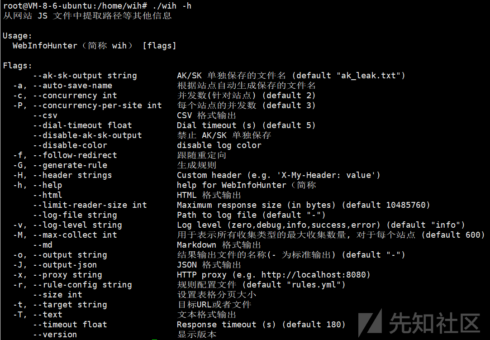
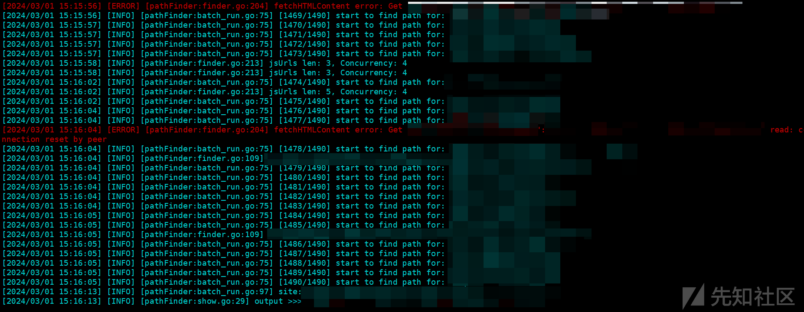
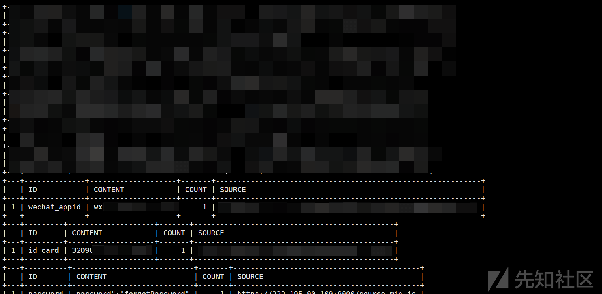
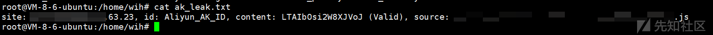

JS 敏感泄露小帮手----WIH 介绍

- - -

# JS 敏感泄露小帮手----WIH 介绍

​ 相信大家对 ARL（Asset Reconnaissance Lighthouse 资产侦察灯塔系统，并不陌生，在最近版本中我发现多了一个功能 WIH（WebInfoHunter），经过一段时间的使用，我发现这个 WIH 确实还挺好用的但是看网上似乎没有多少人介绍过这个工具，于是便有了这篇文章来介绍 ARL---WIH 工具。

​ 这篇文章不涉及 ARL 的基础搭建过程和基础使用过程，如果您之前没有使用过 ARL，详情可以参考官网教程：[https://tophanttechnology.github.io/ARL-doc/system\_install/](https://tophanttechnology.github.io/ARL-doc/system_install/)

​ 在搭建好 ARL 之后我们使用下面的命令将`arl_worker`docker 容器中的 wih 从容器中拖出来单独使用：

```plain
root@VM-8-6-ubuntu:/home# mkdir wih
root@VM-8-6-ubuntu:/home# ls
lighthouse  ubuntu  wih
root@VM-8-6-ubuntu:/home# docker cp arl_worker:/usr/bin/wih /home/wih
Successfully copied 9.87MB to /home/wih
root@VM-8-6-ubuntu:/home# ls
lighthouse  ubuntu  wih
root@VM-8-6-ubuntu:/home# cd wih/
root@VM-8-6-ubuntu:/home/wih# ls
wih
```

[](https://xzfile.aliyuncs.com/media/upload/picture/20240301153814-a9de7140-d79e-1.png)

​ 然后我们就可以自定义他的规则：

```plain
rules:
  # 域名，内置规则
  - id: domain
    enabled: false
  # IP，内置规则
  - id: ip
    enabled: false
  # 路径，内置规则
  - id: path
    enabled: false
  # URL 主机部分为域名，内置规则
  - id: domain_url
    enabled: false
  # URL 主机部分为 IP，内置规则
  - id: ip_url
    enabled: false
  # 邮箱
  - id: email
    enabled: false
    pattern: \b[A-Za-z0-9._\-]+@[A-Za-z0-9.\-]+\.[A-Za-z]{2,61}\b
  # 二代身份证
  - id: id_card
    enabled: true
    pattern: \b([1-9]\d{5}(19|20)\d{2}((0[1-9])|(1[0-2]))(([0-2][1-9])|10|20|30|31)\d{3}[0-9Xx])\b
  # 手机号
  - id: phone
    enabled: false
    pattern: \b1[3-9]\d{9}\b
  # jwt token (不要修改 ID)
  - id: jwt_token
    enabled: true
    pattern: eyJ[A-Za-z0-9_/+\-]{10,}={0,2}\.[A-Za-z0-9_/+\-\\]{15,}={0,2}\.[A-Za-z0-9_/+\-\\]{10,}={0,2}
  # 阿里云 AccessKey ID (不要修改 ID)
  - id: Aliyun_AK_ID
    enabled: true
    pattern: \bLTAI[A-Za-z\d]{12,30}\b
  # 腾讯云 AccessKey ID (不要修改 ID)
  - id: QCloud_AK_ID
    enabled: true
    pattern: \bAKID[A-Za-z\d]{13,40}\b
  # 京东云 AccessKey ID (不要修改 ID)
  - id: JDCloud_AK_ID
    enabled: true
    pattern: \bJDC_[0-9A-Z]{25,40}\b
  # 亚马逊 AccessKey ID
  - id: AWS_AK_ID
    enabled: true
    pattern: '["''](?:A3T[A-Z0-9]|AKIA|AGPA|AIDA|AROA|AIPA|ANPA|ANVA|ASIA)[A-Z0-9]{16}["'']'
  # 火山引擎 AccessKey ID
  - id: VolcanoEngine_AK_ID
    enabled: true
    pattern: \b(?:AKLT|AKTP)[a-zA-Z0-9]{35,50}\b
  # 金山云 AccessKey ID
  - id: Kingsoft_AK_ID
    enabled: true
    pattern: \bAKLT[a-zA-Z0-9-_]{16,28}\b
  # 谷歌云 AccessKey ID
  - id: GCP_AK_ID
    enabled: true
    pattern: \bAIza[0-9A-Za-z_\-]{35}\b
  # 提取 SecretKey, 内置规则
  - id: secret_key
    enabled: true
  # Bearer Token
  - id: bearer_token
    enabled: true
    pattern: \b[Bb]earer\s+[a-zA-Z0-9\-=._+/\\]{20,500}\b
  # Basic Token
  - id: basic_token
    enabled: true
    pattern: \b[Bb]asic\s+[A-Za-z0-9+/]{18,}={0,2}\b
  # Auth Token
  - id: auth_token
    enabled: true
    pattern: '["''\[]*[Aa]uthorization["''\]]*\s*[:=]\s*[''"]?\b(?:[Tt]oken\s+)?[a-zA-Z0-9\-_+/]{20,500}[''"]?'
  # PRIVATE KEY
  - id: private_key
    enabled: true
    pattern: -----\s*?BEGIN[ A-Z0-9_-]*?PRIVATE KEY\s*?-----[a-zA-Z0-9\/\n\r=+]*-----\s*?END[ A-Z0-9_-]*? PRIVATE KEY\s*?-----
  #Gitlab V2 Token
  - id: gitlab_v2_token
    enabled: true
    pattern: \b(glpat-[a-zA-Z0-9\-=_]{20,22})\b
  #Github Token
  - id: github_token
    enabled: true
    pattern: \b((?:ghp|gho|ghu|ghs|ghr|github_pat)_[a-zA-Z0-9_]{36,255})\b
  #腾讯云 API 网关 APPKEY
  - id: qcloud_api_gateway_appkey
    enabled: true
    pattern: \bAPID[a-zA-Z0-9]{32,42}\b
  #微信 公众号/小程序 APPID
  - id: wechat_appid
    enabled: true
    pattern: '["''](wx[a-z0-9]{15,18})["'']'
  #企业微信 corpid
  - id: wechat_corpid
    enabled: true
    pattern: '["''](ww[a-z0-9]{15,18})["'']'
  #微信公众号
  - id: wechat_id
    enabled: true
    pattern: '["''](gh_[a-z0-9]{11,13})["'']'
  # 密码
  - id: password
    enabled: true
    pattern: (?i)(?:admin_?pass|password|[a-z]{3,15}_?password|user_?pass|user_?pwd|admin_?pwd)\\?['"]*\s*[:=]\s*\\?['"][a-z0-9!@#$%&*]{5,20}\\?['"]
  # 企业微信 webhook
  - id: wechat_webhookurl
    enabled: true
    pattern: \bhttps://qyapi.weixin.qq.com/cgi-bin/webhook/send\?key=[a-zA-Z0-9\-]{25,50}\b
  # 钉钉 webhook
  - id: dingtalk_webhookurl
    enabled: true
    pattern: \bhttps://oapi.dingtalk.com/robot/send\?access_token=[a-z0-9]{50,80}\b
  # 飞书 webhook
  - id: feishu_webhookurl
    enabled: true
    pattern: \bhttps://open.feishu.cn/open-apis/bot/v2/hook/[a-z0-9\-]{25,50}\b
  # slack webhook
  - id: slack_webhookurl
    enabled: true
    pattern: \bhttps://hooks.slack.com/services/[a-zA-Z0-9\-_]{6,12}/[a-zA-Z0-9\-_]{6,12}/[a-zA-Z0-9\-_]{15,24}\b
  # grafana api key
  - id: grafana_api_key
    enabled: true
    pattern: \beyJrIjoi[a-zA-Z0-9\-_+/]{50,100}={0,2}\b
  # grafana cloud api token
  - id: grafana_cloud_api_token
    enabled: true
    pattern: \bglc_[A-Za-z0-9\-_+/]{32,200}={0,2}\b
  # grafana service account token
  - id: grafana_service_account_token
    enabled: true
    pattern: \bglsa_[A-Za-z0-9]{32}_[A-Fa-f0-9]{8}\b
  - id: app_key
    enabled: true
    pattern: \b(?:VUE|APP|REACT)_[A-Z_0-9]{1,15}_(?:KEY|PASS|PASSWORD|TOKEN|APIKEY)['"]*[:=]"(?:[A-Za-z0-9_\-]{15,50}|[a-z0-9/+]{50,100}==?)"

# 排除规则，支持字段 id, content, target , source 逻辑为 and，如果是正则匹配，需要使用 regex: 开头
exclude_rules:
    # 排除站点 https://cc.163.com 中 类型为 secret_key 的内容
  - name: "不收集 cc.163.com 的 secret_key" # 排除规则名称，无实际意义
    id: secret_key
    target: regex:cc\.163\.com
    enabled: true

  - name: "不收集 open.work.weixin.qq.com 的 bearer_token"
    id: bearer_token
    target: https://open.work.weixin.qq.com
    content: regex:Bearer\s+
    enabled: true

  - name: "过滤来自首页的内容"
    source_tag: page
    enabled: false
```

​ 然后我们去鹰图上随机下载一些地址，然后导入到`target.txt`中，并运行下列命令：

```plain
./wih -t targets.txt -r wih_rules.yml -a -c 4 -P 4
```

在这个命令中，参数的含义如下：

-   `-t targets.txt`：指定目标 URL 或文件为 `targets.txt`。
-   `-r wih_rules.yml`：指定规则配置文件为 `wih_rules.yml`。
-   `-a`：开启自动生成保存的文件名。
-   `-c 4`：设置并发数为 4。
-   `-P 4`：设置每个站点的并发数为 4。

[](https://xzfile.aliyuncs.com/media/upload/picture/20240301153338-04c8d880-d79e-1.png)

​ 跑完之后结果都在`results`文件夹下，我们进入`results`文件夹下再使用`cat *`:

[](https://xzfile.aliyuncs.com/media/upload/picture/20240301153414-1ac025b2-d79e-1.png)

​ 这里泄露了一个人的完整身份证号等敏感信息。

[](https://xzfile.aliyuncs.com/media/upload/picture/20240301153425-20ea7398-d79e-1.png)

​ 然后如果收集到的 ak 这些更敏感的信息的话，wih 会把他们单独存放在`ak_leak.txt`，然后就可以进行后续利用。

# 参考链接

1.  [https://github.com/TophantTechnology/ARL](https://github.com/TophantTechnology/ARL)
2.  [https://tophanttechnology.github.io/ARL-doc/function\_desc/web\_info\_hunter/](https://tophanttechnology.github.io/ARL-doc/function_desc/web_info_hunter/)
3.  [https://tophanttechnology.github.io/ARL-doc/system\_install/](https://tophanttechnology.github.io/ARL-doc/system_install/)
