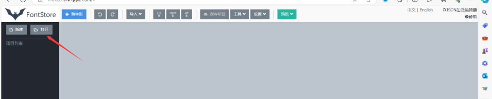

# 【JS 逆向百例】某监管平台，动态字体反爬 + 验证码 + 参数加密，一网打尽~

[↓↓↓](javascript:)  
  
未闻 Code  
  
[↑↑↑](javascript:)

*2024-02-27 21:49* *上海*

  

## 声明

**本文章中所有内容仅供学习交流使用，不用于其他任何目的，不提供完整代码，抓包内容、敏感网址、数据接口等均已做脱敏处理，严禁用于商业用途和非法用途，否则由此产生的一切后果均与作者无关！**

**本文章未经许可禁止转载，禁止任何修改后二次传播，擅自使用本文讲解的技术而导致的任何意外，作者均不负责。**

## 逆向目标

-   网址：aHR0cHM6Ly9qenNjLmpzdC56ai5nb3YuY24vUHVibGljV2ViL2luZGV4Lmh0bWwjLw==
    
-   目标：css 字体反爬，验证码识别，Token 参数逆向
    

## 抓包分析

刷新网页，弹出一个图片码，目测看来是一个简单混淆的图形验证码，这里推荐大家使用 k 哥免费的图片码识别网站或者 ddddocr 也可以：

```plain
地址：https://ocr.kgtools.cn/
```


接下来抓到的是一个图片码验证接口，没有参数加密，这里不做分析，最后抓到的就是查询数据响应的接口，如下：


我们发现响应的数据被做了处理，同时在请求标头中发现一个 Token 参数被做了处理，我们后面再来分析。  

## 验证码鉴权处理

首先是验证码的处理，我们通过抓包发现这属于一个 session 会话，我们首先通过 python 创建一个会话窗口：

```plain
# 创建会话
session = requests.Session()
```

然后将我们抓到的图片码接口与验证接口进行 python 复现，这里比较简单，就不在概述了，复现如下：

```plain
import json
import ddddocr
import requests

ocr = ddddocr.DdddOcr()
# 创建会话
session = requests.Session()

url = '获取图片接口，此处脱敏处理'
headers = {
    # 此处省略
}
# 发送 GET 请求
response = session.get(url, headers=headers)
ocr_result = ocr.classification(response.content)
print(ocr_result)


url = '图片码验证接口'
headers = {
    # 此处省略
}

params={
  "verificationCode": ocr_result
}

# 发送 GET 请求
response = requests.get(url, headers=headers, params=params)
print(response.text)

# 关闭会话
session.close()

# 输出结果：{"code":200,"data":null,"msg":"校验通过"}
```

好了，走到这里，最简单的验证码鉴权处理也就走完了。

## Token 参数逆向

查询接口中存在 Token 参数加密，打开启动器，查看堆栈，这里教大家一个快速定位的办法，发现前俩个是 Ajax 请求，我们从第三个堆栈直接进入：


进入以后，发现这个 Token 并没有进行混淆，直接清晰的可以看到 token 是由 c 赋值，c=Object(E.b)(s).toString()，s 为时间戳：  


进入 Object(E.b) 方法中，我们清晰的发现这是一个由 Webpack 打包的 AES 加密，这里我们可以选择扣代码或者引库复现，引库方案如下：

```plain
var CryptoJS = require('crypto-js')

function tripleAesEncrypt() {
    var key = CryptoJS.enc.Utf8.parse(aesKey),
        iv = CryptoJS.enc.Utf8.parse(aesIv),
        srcs = CryptoJS.enc.Utf8.parse(text),
        // CBC 加密方式，Pkcs7 填充方式
        encrypted = CryptoJS.AES.encrypt(srcs, key, {
            iv: iv,
            mode: CryptoJS.mode.CBC,
            padding: CryptoJS.pad.Pkcs7
        });
    return encrypted.toString();
}

function tripleAesDecrypt() {
    var key = CryptoJS.enc.Utf8.parse(aesKey),
        iv = CryptoJS.enc.Utf8.parse(aesIv),
        srcs = encryptedData,
        // CBC 加密方式，Pkcs7 填充方式
        decrypted = CryptoJS.AES.decrypt(srcs, key, {
            iv: iv,
            mode: CryptoJS.mode.CBC,
            padding: CryptoJS.pad.Pkcs7
        });
    return decrypted.toString(CryptoJS.enc.Utf8);
}

var text = "1708485695567"       // 待加密对象
var aesKey = "255B675CDF21B04F923992E0E9F4A498"   // 密钥，16 倍数
var aesIv = "255B675CDF21B04F"    // 偏移量，16 倍数

var encryptedData = tripleAesEncrypt()
var decryptedData = tripleAesDecrypt()

console.log("加密字符串: ", encryptedData)
console.log("解密字符串: ", decryptedData)
```

与浏览器对比，发现一致，说明这个 AES 没有进行魔改，复现成功：


## 字体反爬认知与逆向解决

### 字体反爬认知与逆向解决

接下来进入本文的重点：`css 字体反爬`，也是一种常见的反爬技术，相信很多爬虫工作者都接触过，这其实不是一种常规的反爬手段，它其实是页面和前端字体文件想配合完成的一个反爬策略。

### 字体反爬背景

最早使用字体反爬技术的有 58 同城、汽车之家、大众点评等等，发展到现在很多主流 APP 也使用了字体反爬技术和爬虫工作者进行对抗，字体反爬从一开始的单纯依靠一个写死的字体文件升级成现在最新动态的字体文件。而字体反爬的功课也有一个开始的解析字体文件做数据映射到现在依靠 KNN 来做动态映射，算是经历了一个又一个光辉的“升级阶段”。

### 字体反爬原理

1.  要利用 font-family 属性，例如设置为 my-font；
    
2.  在 HTML 里面不常见（不可读）的 unicode；
    
3.  在 CSS 字体（my-font）中将其映射到常见（可读）到字体，例如数字；
    

综上我们来总结一下，其实这就是前端工程师利用自定义的字体对网站的内容进行固定替换。

### 难点

某些网站会动态生成 woff，导致我们不能固定一份字体映射关系，需要每次请求动态生成映射，同时这种反爬用自动化非常难的去绕开。

### 本文参数逆向

通过上面基本的介绍，我们已经了解了 css 加密的原理，就是通过 css 样式进行设置的，打开 F12，利用定位元素的功能，随便找一处字体进行定位，我们发现他被设置了 cfg\_kWSxyIw5Pw\_1708486651068 的这个样式：


通过搜索，我们发现全文共有 87 处地方引入或者设置了这个样式：


并且，在上面，他写了这么一段代码：

```plain
@font-face{ font-display:block;    font-family : 'cfg_kWSxyIw5Pw_1708486651068';  src:url('/webserver/publish/tataf/kWSxyIw5Pw_1708486651068.eot');  src:url('/publishserver/OTMcrO0f2/OTMwzmwsc/kWSxyIw5Pw_1708486651068.eot?#iefix') format('embedded-opentype'),url('/publishserver/OTMcrO0f2/OTMwzmwsc/kWSxyIw5Pw_1708486651068.woff') format('WOFF'); }.clz_kWSxyIw5Pw_1708486651068 { font-family: cfg_kWSxyIw5Pw_1708486651068 !important;}
```

我们把他丢进 GPT 询问一下，到底干了些什么事情：


GPT 给出的解释是：主要用于定义字体的 css 样式，并且指定了字体文件的路径（主域名 + 路径+.woff 后缀），然后定义了一个 css 类，并且设置了元素的字体族为 `cfg_kWSxyIw5Pw_1708486651068`，所以它是靠引入外部 woff 文件来给字体设置样式的，同时在外部文件名中，我们发现有时间戳，因此，很大概率它是一个动态 woff 解析。

但是我们怎么知道字体他到底是用的哪个 woff 文件呢？细心的小伙伴已经观察到了，在查询接口返回的时候，他给我们返回这样的一个格式：

```plain
{
    "code": 200,
    "Message": "响应成功！",
    "data": [
        {
            "CORPNAME": "#3hEe1aur4X_1708486651047otltag 敻擁撛摹旧撛支搱揫擡摋搿#FontTag",
            "CORPCODE1": "#3hEe1aur4X_1708486651047otltag 搣斅摏斅擳斅斅掿斅摏斧摏擳旙掿掿搧揻#FontTag",
            "PRJTYPENAME": "#3hEe1aur4X_1708486651047otltag 損旵撛旕摹斳#FontTag",
            "SCDATE": "#3hEe1aur4X_1708486651047otltag 斧擳斧擽 - 擳斧 - 斧斅#FontTag",
            "SUMSCORE": "#3hEe1aur4X_1708486651047otltag 斅掿擳。擳擳#FontTag",
            "CORPCODE": "jgNvGles6ES385Gamw1IzphDtlvBPy5wy4hWl5StTZI="
        }
      .............................
      .............................   此处省略
 }
```

通过观察我们发现字体前面的 `3hEe1aur4X_1708486651047` 不就是我们 woff 文件的文件名吗？所以分析至此，我们目前掌握到的一个流程就是：刷新网页 -> 接口返回混淆字体与相对应的 woff 文件 -> 根据相关文件设置 css 属性。

接下来，我们通过接口返回的参数下载一下对应的 woff 文件，然后打开：

```plain
地址：https://font.qqe2.com/#
```

将我们下载好的 woff 文件进行导入，步骤如下：




对于解析后的文字，官方给定的定义如下：


我们点击浏览，选择 woff 字体：


进入浏览界面，按 F12 进入开发者模式，随便选一个字，查看它的属性：


我们发现，`屋`字其实在浏览器源代码中显示的是`趙`字，那么他的 code 和 name 根据前面的介绍分别表示的是 unicode 编码和字形名称，我猜测他们分别对应俩个汉字，为了验证我们的猜想，我们把他丢进 GPT 去询问一下：


所以，现在就形成了一个在指定 woff 文件下的映射关系，看清楚是指定 woff。在当前 woff 文件下，`趙`字代表的 code 就是 \\8d99（其中 8d99 为编码编码值）代表的 name 就是 uni5C4B（其中 uni 表示它使用的是 Unicode 编码，5C4B 为编码值）。

那么我们应该如何获取 woff 文件中 code 和 name 的映射呢？

这里采用 fontTools 库对我们的 woff 文件进行解析遍历，首先导入本地 woff 文件，然后进行解析，实现如下：

```plain
# 生成 woff 解析字典
def extract_font_data_from_woff(woff_file_path):
    font = TTFont(woff_file_path)
    cmap = font.getBestCmap()
    code_to_name = {}
    for code, name in cmap.items():
        code_to_name[code] = name
    return code_to_name
woff_file_path = '本地下载好的.woff'
unicode_mapping = extract_font_data_from_woff(woff_file_path)
```

最后打印输出：

```plain
{{36035: 'uni5EFA', 36037: 'uni4E2D', 36039: 'bracketleft', 36041: 'd', 36045: 'uni5C71', 36049: 'a', 36051: 'uni7ECD'......此处省略}
```

明显看到，code 被解析成 10 进制的数字，name 是十六进制与其他，那么就可以写一个表达式来判断将他们转为文字，实现如下：

```plain
# 生成映射表
Mapping_tables = {}
for code, mapping in unicode_mapping.items():
    character_key = chr(code)  # 转为汉字
    character_value = chr(int(mapping[3:], 16)) if mapping.startswith('uni') else mapping #如果值中存在 uni 开头，那么把他直接转为汉字
    Mapping_tables[character_key] = character_value
```

最后实现映射的效果如下：


所以，手写一个函数，将我们拿到的网页加密的字体进行映射还原，实现如下：

```plain
# 根据映射表进行还原
def Restore_fonts(word, mapping):
    Restore_text = ""
    for char in word:
        if char in mapping:
            Restore_text += mapping[char]
        else:
            Restore_text += char
    return Restore_text
```

## 结果验证


还原代码如下（实际应用请根据 json 解析自行下载 woff 进行替换）：

```plain
from fontTools.ttLib import TTFont
from loguru import logger
def extract_font_data_from_woff(woff_file_path):
    font = TTFont(woff_file_path)
    cmap = font.getBestCmap()
    code_to_name = {}
    for code, name in cmap.items():
        code_to_name[code] = name
    return code_to_name
def translate_text(text, mapping):
    translated_text = ""
    for char in text:
        if char in mapping:
            translated_text += mapping[char]
        else:
            translated_text += char
    return translated_text


woff_path = '9I1LYtAzbx_1708499111409.woff'
unicode_mapping = extract_font_data_from_woff(woff_path)
Mapping_tables = {}
for code, mapping in unicode_mapping.items():
    character_key = chr(code)
    character_value = chr(int(mapping[3:], 16)) if mapping.startswith('uni') else mapping
    Mapping_tables[character_key] = character_value
Encrypt_text = "橓楳櫋椁橙櫋楣橳椋棡檵楩"
word = translate_text(Encrypt_text, Mapping_tables)
logger.success("加密字体：" + Encrypt_text)
logger.success("还原字体：" + word)
```

  

- - -
