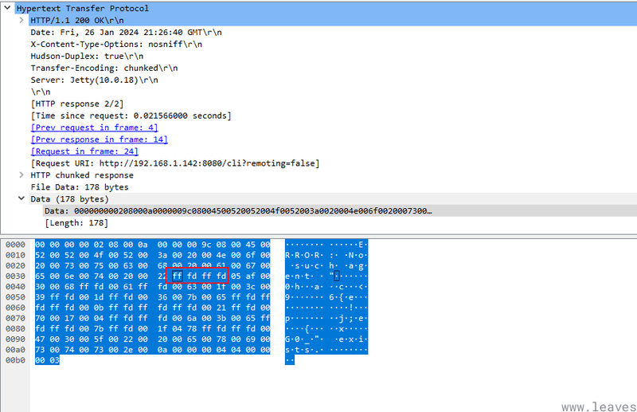

# Jenkins 文件读取漏洞拾遗（CVE-2024-23897）

Jenkins 未授权文件读取漏洞（CVE-2024-23897）今天闹得沸沸扬扬，我也来简单分析一下这个漏洞，并看看这个文件读取如何利用。

首先说的是，由于 Jenkins 存在版本和插件差异，所以利用时可能也有不一样之处，本文内容不一定适用于所有 Jenkins server。我们这里使用 Vulhub 的环境（2.441）来做分析和演示：[https://github.com/vulhub/vulhub/tree/master/jenkins/CVE-2024-23897](https://github.com/vulhub/vulhub/tree/master/jenkins/CVE-2024-23897)

## [0x01 漏洞原理](#0x01)

漏洞的原理比较简单，本文就不以跟代码记流水帐的形式分析代码了，文字描述一下。

Jenkins 提供了一个命令行的接口，用户可以下载一个命令行客户端 jenkins-cli.jar 到本地，并调用该客户端来执行一些 Jenkins 的功能。本来是一个很常见的功能，但设计中神奇的是，用户使用 jenkins-cli.jar 时，命令行是传到服务端解析的，而不是在 jenkins-cli.jar 里解析。

这就导致了一个问题，因为 Jenkins 服务端解析命令行时使用了一个第三方库[args4j](https://github.com/kohsuke/args4j)，这个库实现了 Linux 中一个常见的功能——如果一个参数是以`@`开头，则会被自动认为是一个文件名，文件内容会被读取作为参数。

星球里以前讨论过类似的问题，比如 curl 参数注入中可以利用`@`来读取和上传文件：[https://t.zsxq.com/nAyFuBi](https://t.zsxq.com/nAyFuBi)

PHP5.5 以前，设置 POST 参数时，如果传入的参数值是`@`开头，则也会被认为是文件名，并读取该文件，造成文件读取漏洞。在 PHP 5.5 以后增加了 CURLOPT\_SAFE\_UPLOAD 选项并默认为 true，用以杜绝这个问题：[https://t.zsxq.com/YVbIYny](https://t.zsxq.com/YVbIYny)

回到 Jenkins，因为 Jenkins 是在服务端解析的命令行参数，又支持 args4j 的这个特性，所以造成文件读取漏洞。

要调试该漏洞，只需在 Jenkins 启动时设置一个环境变量“DEBUG=1”，即可开启 JVM 的远程调试端口。如果使用 Vulhub 环境，直接连接 5005 端口进行远程调试，方法曾在这个帖子里介绍过：[https://t.zsxq.com/14N7DfqYr](https://t.zsxq.com/14N7DfqYr)。

## [0x02 Jenkins 权限系统](#0x02-jenkins)

正常情况下，cli 这个功能的权限控制方案和 Jenkins 默认权限方案相同。

Jenkins 有几种鉴权方案：

-   **Anyone can do anything** 没有任何权限认证，匿名用户即可登录后台执行 Groovy 脚本
-   **Legacy Mode** 旧鉴权模式
-   **Logged-in users can do anything** 任意登录的用户可以做任何事，这是默认的权限选项
-   **Matrix-based security** 细颗粒度权限控制，需要安装插件才支持这个鉴权模式

默认安装后是第 3 种方案，非常简单，没有垂直权限的区分，登录后的用户就是管理员，没有登录的用户就是匿名用户。

这种权限方案中，管理员可以设置“匿名用户可读”选项：

[](https://www.leavesongs.com/media/attachment/2024/01/27/12a10308-be07-43a8-a26d-a3470fd88a2b.png)

这个选项在后台的“Manage Jenkins” -> “Security”中管理员可以将其开启或关闭，默认是关闭的。实际测试中，如果我们访问 Jenkins 首页，发现强制跳转到登录页面，或者啥功能都没有直接报权限错误，就说明关闭了“匿名用户读”选项。

如果 Jenkins 系统关闭了匿名用户可读功能，大部分的 cli 命令也就无法调用，会出现"ERROR: anonymous is missing the Overall/Read permission"的错误：

[](https://www.leavesongs.com/media/attachment/2024/01/27/e0c0f4ce-fe80-4404-bf01-762fb959425b.png)

但有 2 个命令例外，就是 help 和 who-am-i。这两个命令是无需任何权限的，所以可以用来读取文件，比如：

[](https://www.leavesongs.com/media/attachment/2024/01/27/459d0e22-6272-47c7-bec6-2bce6b272366.png)

在 Vulhub 环境中，“匿名用户可读”是开启的，某些 Jenkins 版本默认安装时可能也是开启的，但通常管理员会关闭这个功能。另外，大部分企业的 Jenkins 会安装“Matrix-based security”这样的插件来管理权限，也会影响“匿名用户可读”选项的值。总而言之，这个选项的开关取决于管理员是否想让未登录用户看到一些 Jenkins 的任务。

总结一下就是：

-   当 Jenkins 开启了“匿名用户可读”功能，大部分命令都可以被调用
-   当 Jenkins 关闭了“匿名用户可读”功能，只有 help 和 who-am-i 命令可以被调用

> 经过@p1g3 的纠正和长亭的[预警文章](https://mp.weixin.qq.com/s/GSDwEg5fVHwEKatGpuxPog)，其实 Jenkins 中不止只有 help 和 who-am-i 两个命令可以被匿名调用，还有下图中的 6 个写入相关命令。原因和命令使用的加载类有关，我分析代码的时候由于只看了 CLICommand 的代码所以忽略了：  
> [](https://www.leavesongs.com/media/attachment/2024/01/29/9242e8e7-a48d-4a82-9512-e061aa470c57.png)

## [0x03 如何读取想要的内容](#0x03)

前面说了，Jenkins 文件读取漏洞的原理是 args4j 在解析命令行的时候会把`@`后面的字符作为文件名，并读取文件内容作为参数的值。

但是作为攻击者，我们必须想办法让 Jenkins 或 args4j，将读到的文件内容返回给我们，才能最终达到任意文件读取的目的。好在，当我们调用命令行时，如果出错，args4j 就会把错误返回给客户端，而错误信息中就包含文件的内容。

但这里有个问题是，如果我们使用`@`将文件内容加载成命令行参数，则会遇到一个棘手的问题——文件中的空白字符，会分割参数。比如，如果有一个文件内容有 4 行：

```plain
1
2
3
4
```

那么，命令行解析时会变成下面这个样子：

```plain
java -jar jenkins-cli.jar -s http://localhost:8080/ -http help 1 2 3 4
```

此时，1、2、3、4 会变成 help 命令的 4 个参数。而解析命令行时通常只会取前面一些参数，报错也就只会把这些参数报出来，导致我们读取文件的时候只能读到文件的前几行。

比如，使用 help 命令，能读到文件的前 2 行：

[](https://www.leavesongs.com/media/attachment/2024/01/27/5d611a16-879d-4c06-a1a0-169a6142fca9.png)

使用 keep-build 命令，可以读取文件第 3 行：

[](https://www.leavesongs.com/media/attachment/2024/01/27/556d2886-a896-4e0a-8f06-bb60a95592ea.png)

但此时会有一个有趣的问题：如果一个文件只有一行（如/var/jenkins\_home/secret.key 和 /var/jenkins\_home/secrets/master.key），使用help读取就会出现“ERROR: You must authenticate to access this Jenkins.”的错误：

[](https://www.leavesongs.com/media/attachment/2024/01/27/8c780881-d6b5-4c0f-8d22-27636ffeeb72.png)

前面不是说调用 help 命令可以不需要权限吗？实际上，help 命令会先检查命令的参数个数是否正确，后再检查权限，如果我们能让检查命令参数个数的步骤就出错，就能正常返回错误信息了。

所以，可以人为地给 help 命令后增加一个新参数，比如：

```plain
java -jar jenkins-cli.jar -s http://localhost:8080/ -http help 1 "@/var/jenkins_home/secret.key"
```

此时 help 后有两个参数，参数个数太多导致出错，第二个参数被爆出，就是我们要读的文件内容：

[](https://www.leavesongs.com/media/attachment/2024/01/27/1bf81025-bf0b-4a63-8de0-8bbce31c9586.png)

读一两行这种做法终究比较鸡肋，是否有命令可以读取完整文件内容呢？

其实，前面我也说了，如果 Jenkins 开启了“匿名用户可读”选项，则大部分命令都可以被调用，其中包括 connect-node 命令和 reload-job 命令。这俩命令可以用来读取文件全部内容：

[](https://www.leavesongs.com/media/attachment/2024/01/27/087f54dc-363a-4da8-8392-f70454ce2765.png)

## [0x04 了解 Jenkins 敏感文件](#0x04-jenkins)

知道了如何读取文件，那么我们在实战中应该读取哪些文件呢？

如果部署 Jenkins 使用的是官方或 Vulhub 的 Docker 镜像，那么 Jenkins 的数据根目录是在/var/jenkins\_home。但并不是所有人都会使用这个目录作为根目录，如果想读取 Jenkins 相关的文件，必须先知道 Jenkins 的根目录在哪里。

这时可以读取/proc/self/environ 和/proc/self/cmdline，这两个文件中包含的是当前进程的环境变量和 cmd 启动命令行，其中就会包含 Jenkins 的根目录。

[](https://www.leavesongs.com/media/attachment/2024/01/27/2b67ee66-019d-4f8e-a224-20152036eef9.png)

拿到了 Jenkins 的根目录，我们就可以来尝试读取下面这些敏感文件。

-   `/var/jenkins_home/users/*/config.xml`
-   `/var/jenkins_home/secret.key`
-   `/var/jenkins_home/secrets/master.key`
-   `/var/jenkins_home/secrets/org.springframework.security.web.authentication.rememberme.TokenBasedRememberMeServices.mac`

在后面对代码的分析中，我们能慢慢地了解这些文件的具体作用。

## [0x05 读取用户密码](#0x05)

默认未使用第三方登录的 Jenkins 中，用户相关信息是存储在文件中，而 Session 信息是存储在内存中。所以，在拥有文件读取漏洞后，首先想到的就是是否可以读取用户密码。

我们先读取`/var/jenkins_home/users/users.xml`，可以获取用户列表和每个用户信息所在的文件目录：

[](https://www.leavesongs.com/media/attachment/2024/01/27/ae503586-ff52-4b20-8420-047e0236f2fd.png)

我画红框的就是 admin 用户所在目录，我们读取这个目录下的 config 文件：`/var/jenkins_home/users/admin_2676914209327834400/config.xml`：

[](https://www.leavesongs.com/media/attachment/2024/01/27/4b3df8bc-ee6f-4997-a4a3-5c084a4e7143.png)

可见，我们拿到了三个重要信息：

-   用户密码，使用 JBCript 哈希编码
-   用户 Token，使用 sha256 哈希编码
-   用户种子，这个后面会用到

第一个，用户密码是以`#jbcrypt`前缀开头，但实际上调试可发现这就是一个 BCrypt 算法计算出来的 hash 值。我们将这个哈希值前面的`#jbcrypt:`去掉，并将第一个`$2a`改成`$2y`，就成为一个标准的 bcrypt 哈希值了。

由于我们已知管理员的密码是字符串“vulhub”，我们计算一下它是否能对应上这个 bcrypt 哈希值：

[](https://www.leavesongs.com/media/attachment/2024/01/27/5f18529c-9470-4d4e-8476-fcbf3ee4a233.png)

能够对应上，说明算法是 bcrypt。对于这类 hash 值，我们只能硬跑破解，运气好可以跑出来明文。

第二个，用户 Token。这个值并不是每个用户都有，通常只有用户生成了 Token 才会有。而且储存在文件中的 Token 是原始 Token 经过 sha256 后的结果，无法还原出原始 Token，所以利用不了。

第三个，用户种子，这个值在 Remember-Me Cookie 中会用到。

## [0x06 Remember-Me Cookie 是怎么工作的？](#0x06-remember-me-cookie)

那么，说到 Remember-Me Cookie，Jenkins 的 Remember-Me Cookie 是怎么工作的呢？

remember-me Cookie 的生成与校验是在`hudson.security.TokenBasedRememberMeServices2#makeTokenSignature`函数中，这个函数代码很简单：

[](https://www.leavesongs.com/media/attachment/2024/01/27/bc02dce4-92c3-4e85-b646-1e12dacaf1db.png)

可以看见，由用户名、Token 过期时间戳、userSeed、Key 四个部分拼接组成的字符串，被使用`Mac.mac`函数签名以后，成为最后的 Token。

这里就带来几个问题：

-   userSeed 是什么？
-   Key 是什么？
-   `Mac.mac`函数是什么算法？

我们在函数尾下断点，可以发现 Key 就是`/var/jenkins_home/secret.key`的内容：

[](https://www.leavesongs.com/media/attachment/2024/01/27/30902d18-6175-4f7a-8b43-e827d9d62e38.png)

这里的 userSeed 是前面读取的用户种子，Key 是前面读取的 secret.key 文件的值，这两个值都可以通过漏洞读取到。

跟进`Mac.mac`函数后可以发现，最后实际上是使用了`javax.crypto.Mac`来计算 hmac，hmac 算法使用的 salt 来自于下面这个函数：

[](https://www.leavesongs.com/media/attachment/2024/01/27/d83da0b1-3581-47ec-b231-838143484c3c.png)

可见，这里首先从`/var/jenkins_home/secrets/org.springframework.security.web.authentication.rememberme.TokenBasedRememberMeServices.mac`文件中读取出一个密文，并使用 AES 解密，解密时使用的密钥来自于`masterKey`。

这个`masterKey`的名字好像比较熟悉？确实就和前面读取的`/var/jenkins_home/secrets/master.key`有关。master.key 文件的内容，使用`Util.toAes128Key`转换成适合 AES128 算法长度的 Key，就是 AES 密钥：

[](https://www.leavesongs.com/media/attachment/2024/01/27/a2de788c-23be-4856-8615-4374a09ab680.png)

所以，最后所有的敏感文件作用都屡清楚了：

-   `/var/jenkins_home/users/*/config.xml` 保存所有用户的信息，包括密码、种子、Token 等
-   `/var/jenkins_home/secret.key` 保存 Remember-Me Cookie 中的一部分
-   `/var/jenkins_home/secrets/master.key` 作为 AES 解密密钥
-   `/var/jenkins_home/secrets/org.springframework.security.web.authentication.rememberme.TokenBasedRememberMeServices.mac` 作为计算 hmac 签名时的 Key

这里面，前三个文件都可以直接读取，但读取第四个文件时我遇到了问题。

## [0x07 二进制文件读取问题](#0x07)

第四个文件是一个二进制文件，我们对文件读取的数据包抓包，可以拿到最原始的返回数据：

[](https://www.leavesongs.com/media/attachment/2024/01/27/088bbfab-44eb-4485-a133-15c5615257e6.png)

可见，这个返回数据里有大量的`ef bf bd`，这就是 UTF-8 字符集无法识别时的“占位符”。我曾在星球里分享过 Burpsuite 发包时遇到过类似问题：[https://t.zsxq.com/NzfuJ2r](https://t.zsxq.com/NzfuJ2r)，可以复习一下。

也就是说，读取二进制文件时会因为非 UTF-8 字符集的问题导致有大量字符被“占位符”替代，无法读到完整的 hmac salt。

官方漏洞通告里也提到了这个问题：

> For example, attempting to read random binary data using UTF-8, roughly half of all bytes will be replaced with a placeholder for an illegal value. For 32 byte random binary secrets, as commonly used in Jenkins for [HMAC-SHA256](https://en.wikipedia.org/wiki/HMAC), this would require attackers to correctly guess on average 16 bytes, which is infeasible. In contrast, with the encoding Windows-1252, only 5 out of 256 possible values are illegal and would be replaced with a placeholder.

在 UTF-8 字符集情况下，32 字节长度的二进制字符可能有 16 个字节都是占位符；而如果是 Windows-1252 字符集，则 256 个字符中只有 5 个字符是占位符。

而正常来说，Linux 系统下部署的 Jenkins 都是默认的 UTF-8 字符集，而部分 Windows 下部署的 Jenkins 可能会是其他字符集。如果按照 16:32 这个比例来看，当前环境是根本无法正确读到二进制文件的。

那么，是否有办法在客户端设置字符集呢？

我在抓 cli 请求包的时候，关注到协议中是存在一个字符集的设置的：

[](https://www.leavesongs.com/media/attachment/2024/01/27/dd7ddcc4-57a0-4524-bb83-5ada9af8b2c2.png)

阅读代码可以发现，这个字符集可以通过 Java 客户端的`file.encoding`来配置。我尝试将其设置为 UTF-16BE：

```plain
java -Dfile.encoding=UTF-16BE -jar jenkins-cli.jar -s http://localhost:8080/ -http who-am-i "@/var/jenkins_home/secrets/org.springframework.security.web.authentication.rememberme.TokenBasedRememberMeServices.mac"
```

此时再抓包查看返回：

[](https://www.leavesongs.com/media/attachment/2024/01/27/a8a7a365-2043-4b47-9d95-2a0847eed880.png)

可以发现，返回的错误信息确实变成 UTF-16 编码了，但其中仍然包含大量`fd ff`这样的占位符，并不能实现读取二进制文件内容的目标。

我尝试了[Java 中其他的编码](https://docs.oracle.com/javase/8/docs/technotes/guides/intl/encoding.doc.html)，都是相同的问题。我们看下 args4j 中解析`@`符号的代码，可以发现其使用的是`new BufferedReader(new FileReader(f))`来读取文件：

[](https://www.leavesongs.com/media/attachment/2024/01/27/4d8db3cb-e128-4a57-bbfa-2512f724cb58.png)

查看[`FileReader`函数的文档](https://docs.oracle.com/en/java/javase/18/docs/api/java.base/java/io/FileReader.html#%3Cinit%3E(java.io.File))可以看出，如果其构造函数不传入第二个参数，会使用默认的 charset 打开文件。而默认 charset 就是当前服务端的`file.encoding`设置。因为这部分代码在 args4j 中，在读取文件的时候就已经使用 UTF-8 编码，导致二进制信息的丢失，后续客户端传入的 charset 是什么都不会影响返回结果中的占位符了。

那么实际上伪造 remember-me 这条路就死了，就像官方漏洞通告里说的，目标环境需要支持读取二进制文件（比如默认字符集是 Windows-1252 的 Windows 系统）。

## [0x08 总结](#0x08)

分析了这么多，大概核心的内容都已经说明了。总结一下，CVE-2024-23897 漏洞的利用有下面两个比较核心的限制：

-   是否开启“匿名用户可读”选项
-   服务端字符集是否兼容读取二进制文件

第一个问题的结果会影响攻击者是否能够读取文件的全文，包括用户的密码等信息；第二个问题的结果影响攻击者是否能够伪造任意用户的 remember-me Cookie。

当然，还是最开始说的，本文仅限于 Vulhub 环境中的 Jenkins 版本（2.441）。其他环境的 Jenkins 的相关细节会有许多不同，比如，旧版本 Jenkins 用户密码是加密而不是哈希，可以利用诸如[jenkins-decrypt](https://github.com/bstapes/jenkins-decrypt)这样的工具来解密密码，还可以利用一些插件来进一步攻击。这部分细节就留给大家自行深入研究了。
