# JetBrains TeamCity 鉴权绕过浅析 - 先知社区

JetBrains TeamCity 鉴权绕过浅析

- - -

## CVE-2023-42793

-   影响版本：**2023.05.3 and below**
-   补丁分析  
    主要是针对 `RequestInterceptors` 这个类做的，在 `myPreHandlingDisabled` 字段通过反射添加了一个路由 `/RPC2` 接着在 `myPreHandlingDisabled` 中的 `myMatchingPaths` 字段中移除掉所有路径满足 `/**/RPC2` 。  
    [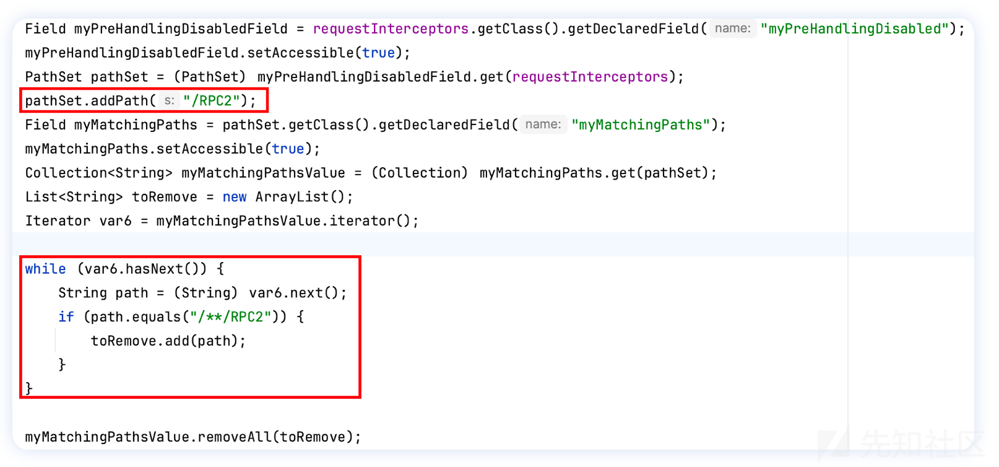](https://xzfile.aliyuncs.com/media/upload/picture/20240306103228-c657f01e-db61-1.png)
-   代码审计  
    因此问题肯定是出在了 `RequestInterceptors` 这里，根据 [What is Spring Boot Request Interceptor and How to Use It? | by Ahmet Emre DEMİRŞEN | Medium](https://medium.com/@aedemirsen/what-is-spring-boot-request-interceptor-and-how-to-use-it-7fd85f3df7f7) 可知这个类用于在请求过程中作鉴权的，其最先被执行的是 `preHandle` 方法  
    [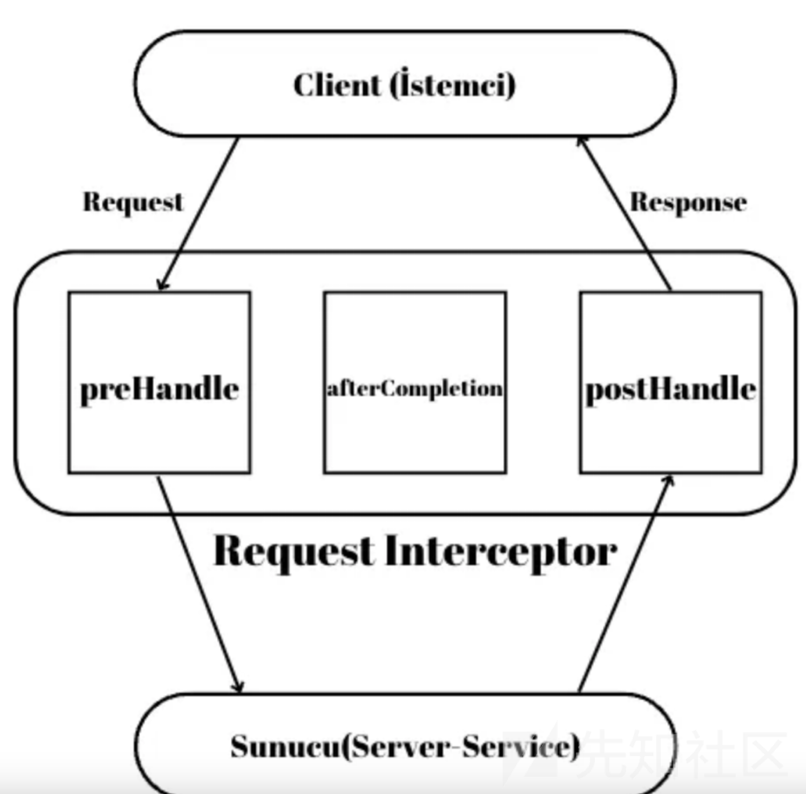](https://xzfile.aliyuncs.com/media/upload/picture/20240306103351-f804e194-db61-1.png)  
    分析代码看到这里会先执行一个 `requestPreHandlingAllowed` 如果返回 false 的话直接放行。  
    [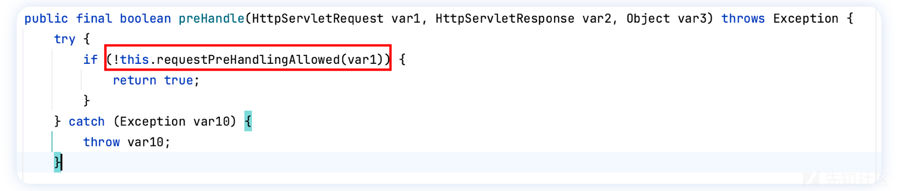](https://xzfile.aliyuncs.com/media/upload/picture/20240306103406-01108bb2-db62-1.png)  
    跟进会先判断访问的是否为 JSP 页面，之后这里会调用 `myPreHandlingDisabled` 字段去做路径匹配，我们注意到了一个 `/**/RPC2`  
    [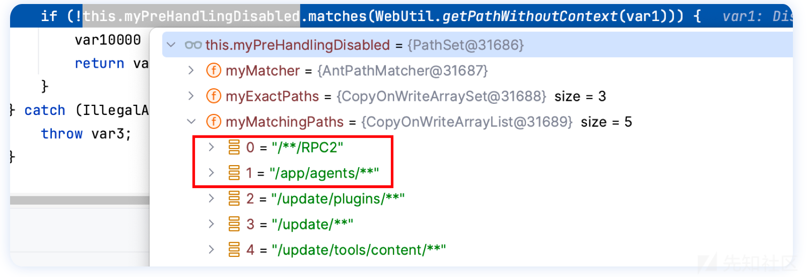](https://xzfile.aliyuncs.com/media/upload/picture/20240306103422-0ab60b10-db62-1.png)  
    这个路径是在类初始化的时候创建并添加到 `myPreHandlingDisabled` 字段中去的  
    [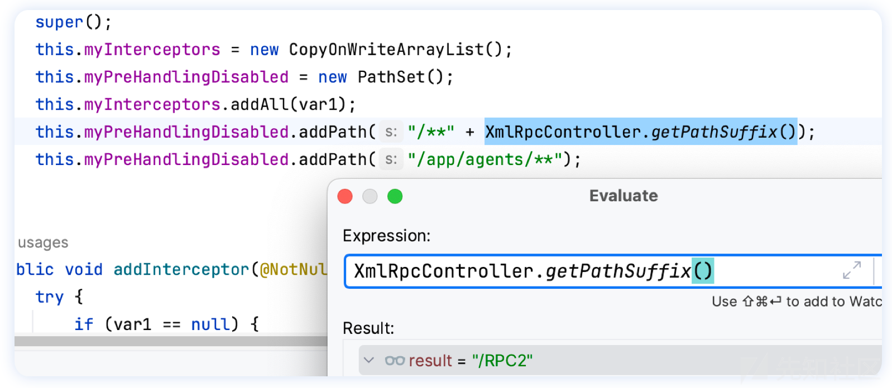](https://xzfile.aliyuncs.com/media/upload/picture/20240306103440-154e9b00-db62-1.png)  
    有了这个路径，那么我们访问以前以 `/RPC` 作为后缀的 url 均不会被鉴权。  
    而恰好 jetbrains.buildServer.server.rest.request.UserRequest#createToken(java.lang.String, java.lang.String, java.lang.String) 可以通过 path 变量来创建 token (这里的作用也就是可以创建指定用户的 token，用户指定通过 userLocator ，对于 admin 默认为 `id:1`)，我们直接 name 位置设置为 `RPC2` 便可以绕过鉴权。  
    [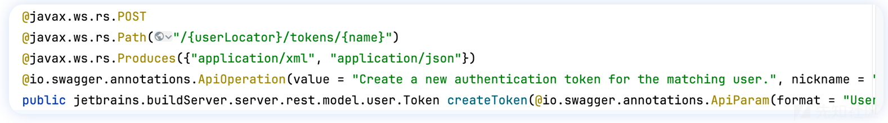](https://xzfile.aliyuncs.com/media/upload/picture/20240306103523-2eeaed52-db62-1.png)
-   复现  
    [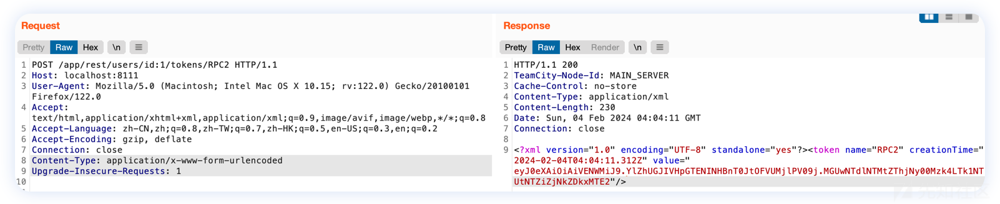](https://xzfile.aliyuncs.com/media/upload/picture/20240306103633-58a38262-db62-1.png)  
    [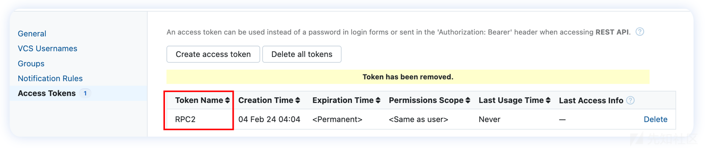](https://xzfile.aliyuncs.com/media/upload/picture/20240306103643-5e608362-db62-1.png)  
    [JetBrains TeamCity RCE - CVE-2023-42793 (projectdiscovery.io)](https://blog.projectdiscovery.io/cve-2023-42793-vulnerability-in-jetbrains-teamcity/) 提供了一种 RCE 的方式，也就是利用获取到的 admin token 开启 debug API，触发配置重载过程中 RCE  
    [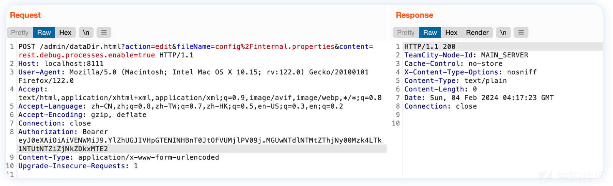](https://xzfile.aliyuncs.com/media/upload/picture/20240306103725-77c79bf6-db62-1.png)  
    之后去掉 Content-Type 字段之后就可以 RCE 了  
    [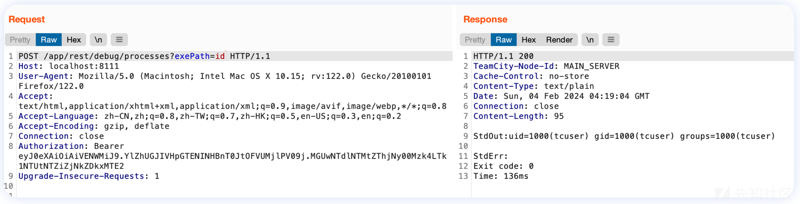](https://xzfile.aliyuncs.com/media/upload/picture/20240306103739-7ffedece-db62-1.png)

## CVE-2024-27198

-   影响版本：before 2023.11.4
-   补丁 [https://download-cdn.jetbrains.com/teamcity/plugins/internal/security\_patch\_2024\_02.zip](https://download-cdn.jetbrains.com/teamcity/plugins/internal/security_patch_2024_02.zip)  
    用了三种反编译工具结果都不太清楚，可能是 JDK 版本过高的缘故，师傅们可以研究研究
-   代码分析  
    分析版本: 2023.11.3  
    以绕过授权端点 `/app/rest/server` 为例子  
    [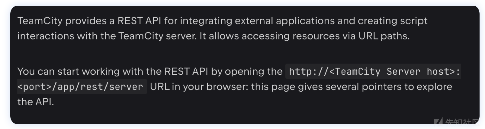](https://xzfile.aliyuncs.com/media/upload/picture/20240306104158-1a81167e-db63-1.png)  
    teamcity 业务请求的分发处位于 `jetbrains.buildServer.controllers.BaseController` 首先看如果发送一个需要授权的请求
    
    ```plain
    curl --noproxy '*' -v "http://127.0.0.1:8111/profile.html"
    ```
    
    `jetbrains.buildServer.controllers.BaseController#handleRequestInternal`  
    [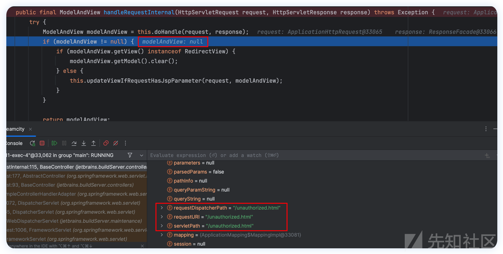](https://xzfile.aliyuncs.com/media/upload/picture/20240306104355-60226bd8-db63-1.png)  
    可以看到在这里会跳转至 `/unauthorized.html` 未授权页面，同时无法获取到模型视图参数。这是因为 web.xml 当作配置了 error-page ，当 401 时就会跳转到 `/unauthorized.html`  
    [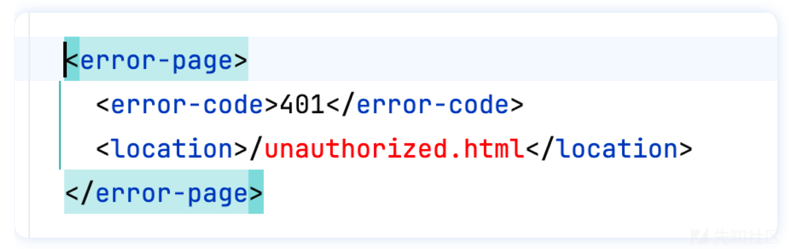](https://xzfile.aliyuncs.com/media/upload/picture/20240306104425-71f363f8-db63-1.png)  
    但如果我们修改为不存在的 uri：
    
    ```plain
    curl --noproxy '*' -v "http://127.0.0.1:8111/xxx"
    ```
    
    `jetbrains.buildServer.controllers.BaseController#handleRequestInternal` 可以看到这里面是可以获取到模型视图参数的  
    [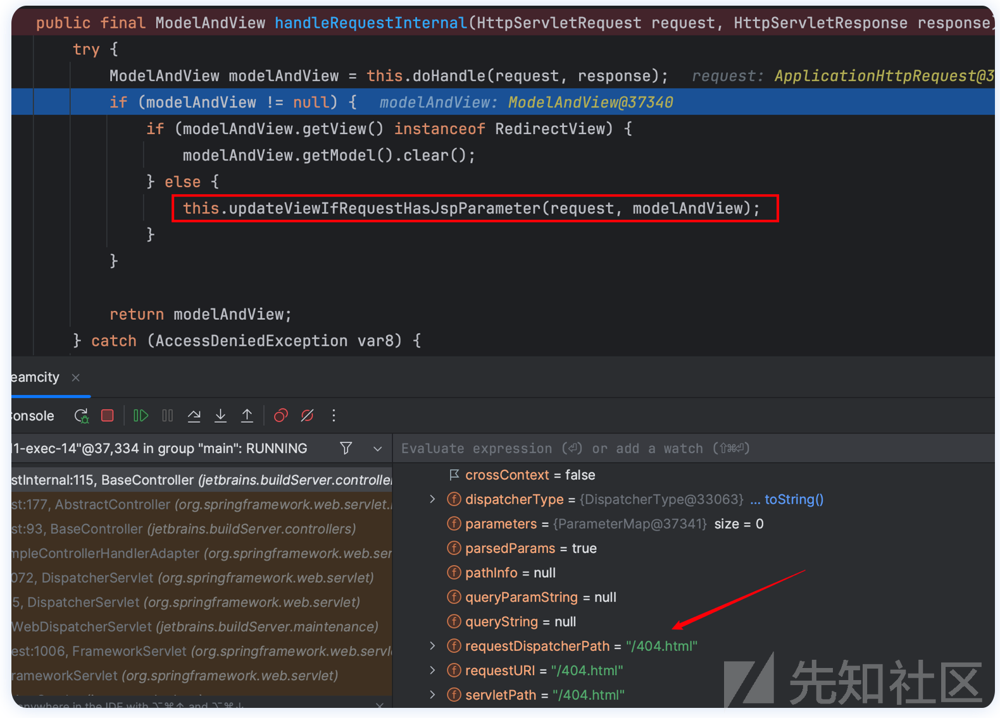](https://xzfile.aliyuncs.com/media/upload/picture/20240306104507-8b13aa00-db63-1.png)  
    原因在于不存在的路由导致 error-code 404 会分发至 PageNotFoundController 处理，并为模型视图设置视图名为 `404.jsp`  
    [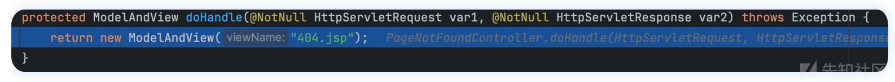](https://xzfile.aliyuncs.com/media/upload/picture/20240306104551-a5616258-db63-1.png)  
    跟入 `updateViewIfRequestHasJspParameter` ，里面有个获取外部参数的操作 `getJspFromRequest`  
    [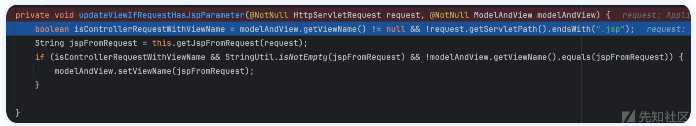](https://xzfile.aliyuncs.com/media/upload/picture/20240306104610-b0c3e328-db63-1.png)  
    跟进 `jetbrains.buildServer.controllers.BaseController#getJspFromRequest` 这里会取出 `jsp` 参数，如果 `.jsp` 结尾或者内容不包含`admin/` 则不会返回 null，同时如果和默认视图名 `404.jsp` 不同的话则会将其设置为视图作为最终返回的内容。  
    [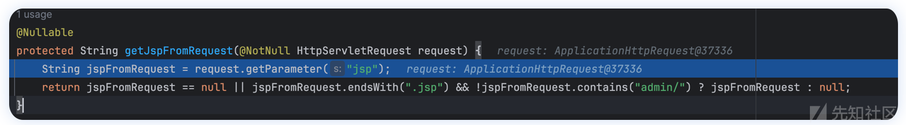](https://xzfile.aliyuncs.com/media/upload/picture/20240306104625-b971fbd6-db63-1.png)  
    payload 修改为：
    
    ```plain
    curl --noproxy '*' -ik "http://127.0.0.1:8111/xxxx?jsp=/app/rest/server;.jsp"
    ```
    
    随后视图渲染 `org.springframework.web.servlet.DispatcherServlet#resolveViewName` 得到 `JstlView` 类型的 `view`  
    [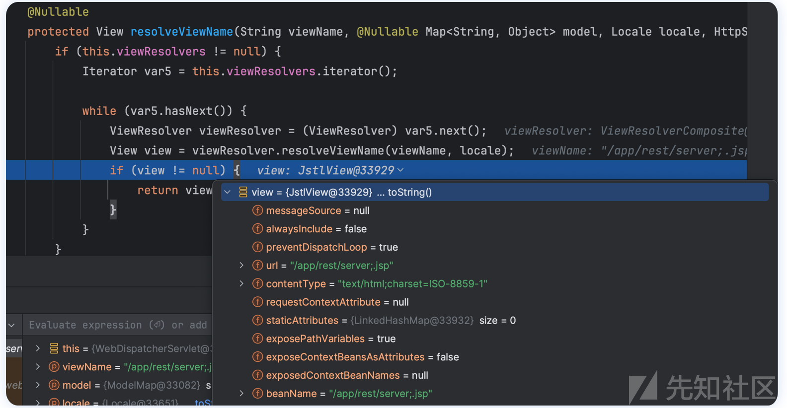](https://xzfile.aliyuncs.com/media/upload/picture/20240306104712-d564d174-db63-1.png)  
    对于 jsp 文件的视图渲染，根据官方文档可知会作 dispatch 处理，也就是会将当前的 `viewName` 当作 url 请求进行处理  
    [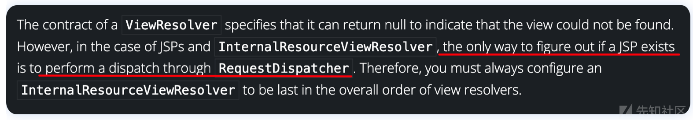](https://xzfile.aliyuncs.com/media/upload/picture/20240306104735-e31baa40-db63-1.png)  
    随后在执行获取视图路径的 `RequestDispatcher` 过程中，会对 path 作如下处理（位于 `org.apache.catalina.core.ApplicationContext#getRequestDispatcher`）其中 `stripPathParams` 方法会将 uri 中出现 `;` 及其之后的部分去除，因此最后请求 path 变为了 `/app/rest/server` ，进而绕过鉴权  
    [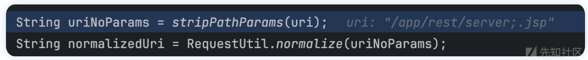](https://xzfile.aliyuncs.com/media/upload/picture/20240306104757-f0333eb4-db63-1.png)  
    **补充：为什么后面的 dispatch 请求就可以绕过鉴权？**  
    我们之前知道鉴权处是在 `jetbrains.buildServer.controllers.interceptors.RequestInterceptors#preHandle` 方法当中，可以看到这里会根据当前应用请求获取一个 Stack 类，根据 `size` 以及请求 uri 的变化次数可以大概猜到这里应该表示的是请求处理栈。  
    [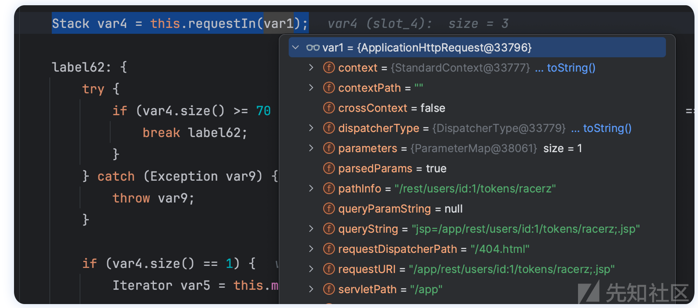](https://xzfile.aliyuncs.com/media/upload/picture/20240306104958-387a6292-db64-1.png)  
    拦截器只会在栈空间为 1 的时候起作用，但我们当时请求的是个不存在的 uri，所以自然始终是返回 true 的  
    [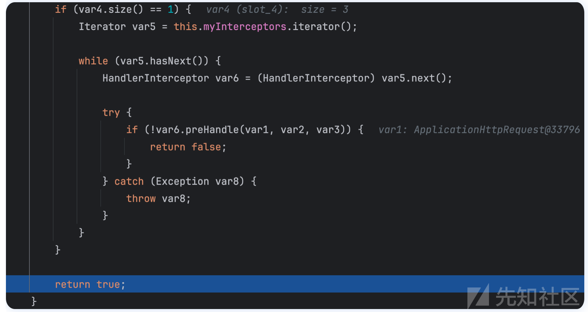](https://xzfile.aliyuncs.com/media/upload/picture/20240306105013-4169d1d0-db64-1.png)
-   利用  
    和之前的漏洞一样，我们也可以通过 `/app/rest/users/id:1/tokens/{name}` 获取管理员 token
    
    ```plain
    curl --noproxy '*' -ik "http://127.0.0.1:8111/xxxx?jsp=/app/rest/users/id:1/tokens/racerz;.jsp" -X POST
    ```
    
    [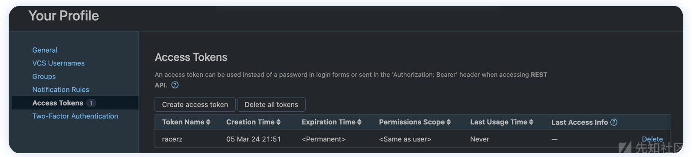](https://xzfile.aliyuncs.com/media/upload/picture/20240306105049-56a247f8-db64-1.png)

### 总结

可能是 Java 版本过高的缘故，分析代码过程中部分核心位置反编译失败导致无法理清逻辑（后续值得研究一下反编译的问题）。不过目前针对 CVE-2024-27198 漏洞利用思路的猜想是：spring 支持当出现 error code 时通过配置 location （渲染视图位置）来响应错误页面，这实际上是做了二次 dispatch 请求. 而 teamcity 的鉴权操作并未对这种类似嵌套的请求作处理，同时视图名又可控，可覆盖默认的配置，导致可以以未授权的方式请求授权页面。(CVE-2024-27199 应该就是另外通过目录穿越的方式来控制第二次 dispatch 的位置)  
[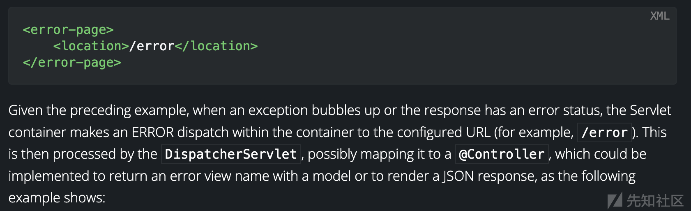](https://xzfile.aliyuncs.com/media/upload/picture/20240306105214-897f21dc-db64-1.png)

## 参考

\[1\] [CVE-2023-42793 JetBrains TeamCity 权限绕过 - Y4er的博客](https://y4er.com/posts/cve-2023-42793-jetbrains-teamcity-auth-bypass-rce/)  
\[2\] [vulhub/teamcity/CVE-2023-42793/README.zh-cn.md at master · vulhub/vulhub (github.com)](https://github.com/vulhub/vulhub/blob/master/teamcity/CVE-2023-42793/README.zh-cn.md)  
\[3\] [Source Code at Risk: Critical Code Vulnerability in CI/CD Platform TeamCity | Sonar (sonarsource.com)](https://www.sonarsource.com/blog/teamcity-vulnerability/)  
\[4\] [JetBrains TeamCity RCE - CVE-2023-42793 (projectdiscovery.io)](https://blog.projectdiscovery.io/cve-2023-42793-vulnerability-in-jetbrains-teamcity/)  
\[5\] [CVE-2024-27198 and CVE-2024-27199: JetBrains TeamCity Multiple Authentication Bypass Vulnerabilities (FIXED) | Rapid7 Blog](https://www.rapid7.com/blog/post/2024/03/04/etr-cve-2024-27198-and-cve-2024-27199-jetbrains-teamcity-multiple-authentication-bypass-vulnerabilities-fixed/)  
\[6\] [https://docs.spring.io/spring-framework/reference/web/webmvc/mvc-servlet/exceptionhandlers.html](https://docs.spring.io/spring-framework/reference/web/webmvc/mvc-servlet/exceptionhandlers.html)
