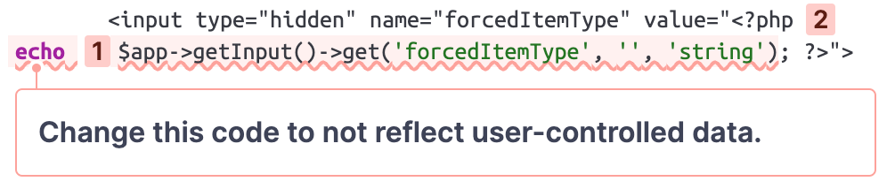
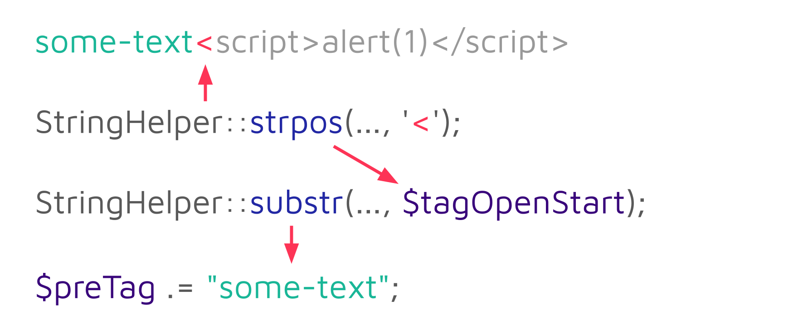
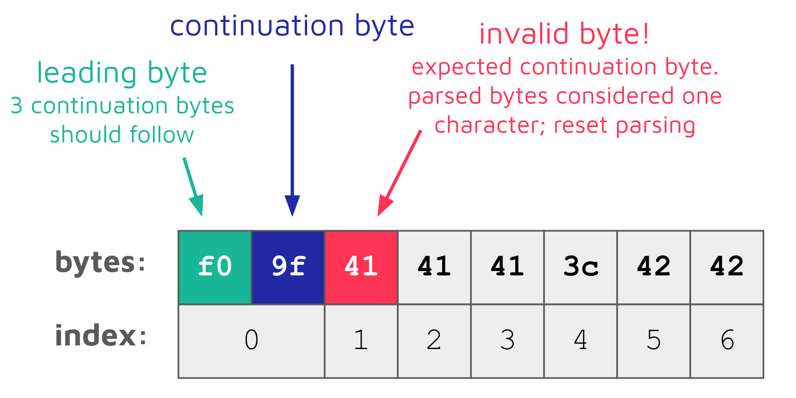
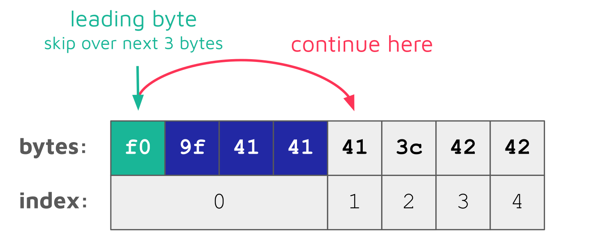
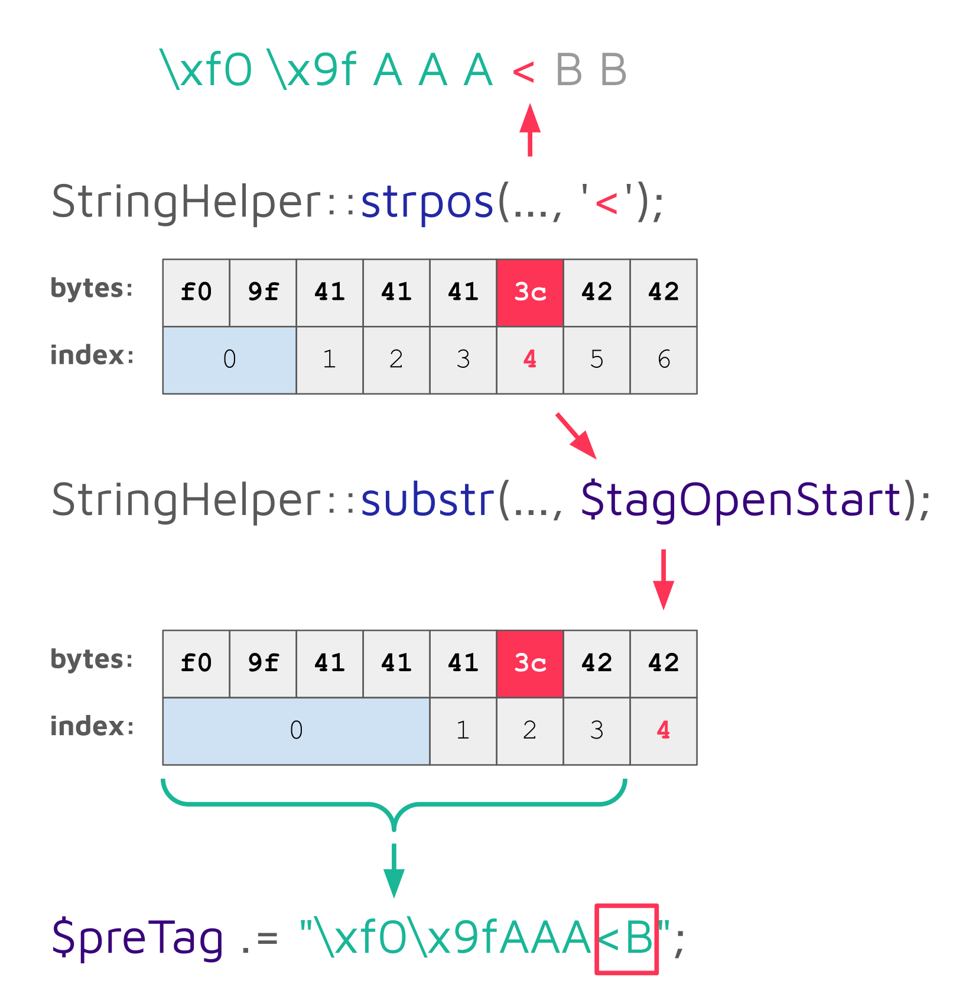

# Joomla：PHP Bug 引入多个 XSS 漏洞

## Key Information 密钥信息

-   Sonar’s Vulnerability Research Team has discovered an issue that led to multiple XSS vulnerabilities in the popular Content Management System [Joomla](https://www.joomla.org/ "Joomla").  
    Sonar 的漏洞研究团队发现了一个问题，导致流行的内容管理系统 Joomla 中存在多个 XSS 漏洞。
-   The issue discovered with the help of [SonarCloud](https://sonarcloud.io/ "SonarCloud") affects Joomla’s core filter component and is tracked as [CVE-2024-21726](https://cve.mitre.org/cgi-bin/cvename.cgi?name=2024-21726 "CVE-2024-21726").  
    在 SonarCloud 的帮助下发现的问题影响了 Joomla 的核心过滤器组件，并被跟踪为 CVE-2024-21726。
-   Attackers can leverage the issue to gain remote code execution by tricking an administrator into clicking on a malicious link.  
    攻击者可以利用这个问题，通过欺骗管理员点击恶意链接来获得远程代码执行。
-   The underlying PHP bug is an inconsistency in how PHP’s mbstring functions handle invalid multibyte sequences.  
    潜在的 PHP 错误是 PHP 的 mbstring 函数处理无效多字节序列的方式不一致。
-   The bug was fixed with PHP versions 8.3 and 8.4, but not backported to older PHP versions.  
    这个错误在 PHP 8.3 和 8.4 版本中得到了修复，但没有反向移植到更早的 PHP 版本。
-   Joomla released a [security announcement](https://developer.joomla.org/security-centre/929-20240205-core-inadequate-content-filtering-within-the-filter-code.html "security announcement") and published [version 5.0.3/4.4.3](https://www.joomla.org/announcements/release-news/5904-joomla-5-0-3-and-4-4-3-security-and-bug-fix-release.html "version 5.0.3/4.4.3"), which mitigates the vulnerability.  
    Joomla 发布了一个安全公告，并发布了 5.0.3/4.4.3 版本，该版本缓解了该漏洞。

## Joomla

Joomla is a free and open-source Content Management System (CMS) used for building websites and online applications. Roughly [2% of all websites](https://w3techs.com/technologies/overview/content_management "2% of all websites") use Joomla, which makes it one of the most popular CMSs with millions of deployments worldwide.  
Joomla 是一个免费的开源内容管理系统（CMS），用于构建网站和在线应用程序。大约有 2% 的网站使用 Joomla，这使其成为最受欢迎的 CMS 之一，全球有数百万的部署。

  

The widespread usage of Joomla and the fact that most deployments are publicly accessible makes it a valuable target for threat actors. Just recently, Joomla was targeted in an [attack against different organizations](https://thehackernews.com/2023/12/new-hacker-group-gambleforce-tageting.html "attack against different organizations") via an [improper access control vulnerability (CVE-2023-23752)](https://nvd.nist.gov/vuln/detail/CVE-2023-23752 "improper access control vulnerability (CVE-2023-23752)").  
Joomla 的广泛使用以及大多数部署都可以公开访问的事实使其成为威胁行为者的重要目标。就在最近，Joomla 通过不正确的访问控制漏洞（CVE-2023-23752）针对不同的组织进行了攻击。

  

In this article, we dive into an interesting XSS issue detected by [SonarCloud](https://sonarcloud.io/ "SonarCloud"), which led us down the rabbit hole to the discovery of a bug in PHP. We will explain how an inconsistency in PHP’s mbstring functions can be leveraged by attackers to bypass Joomla’s input sanitization introducing multiple XSS vulnerabilities.  
在本文中，我们深入探讨了 SonarCloud 检测到的一个有趣的 XSS 问题，它使我们进入了兔子洞，发现了 PHP 中的一个 bug。我们将解释攻击者如何利用 PHP 的 mbstring 函数中的不一致性来绕过 Joomla 的输入清理，从而引入多个 XSS 漏洞。

## Impact 影响

Joomla versions 5.0.2/4.4.2 and below are prone to multiple XSS vulnerabilities. Attackers tricking an administrator into clicking on a malicious link can gain remote code execution (RCE):  
Joomla 5.0.2/4.4.2及以下版本容易出现多个XSS漏洞。攻击者诱骗管理员点击恶意链接可以获得远程代码执行（RCE）：

按钮

Sonar

5290 位订阅者

[Joomla: Multiple XSS Vulnerabilities, detected with SonarCloud](https://www.youtube.com/watch?v=4HmGMSWry_c)

稍后观看

分享

[↓↓↓](https://www.youtube.com/watch?v=4HmGMSWry_c&embeds_referring_euri=https%3A%2F%2Fwww.sonarsource.com%2F&feature=emb_imp_woyt)  
  

前往平台观看：

  
  
[↑↑↑](https://www.youtube.com/watch?v=4HmGMSWry_c&embeds_referring_euri=https%3A%2F%2Fwww.sonarsource.com%2F&feature=emb_imp_woyt)

  

Joomla [version 5.0.3/4.4.3](https://www.joomla.org/announcements/release-news/5904-joomla-5-0-3-and-4-4-3-security-and-bug-fix-release.html "version 5.0.3/4.4.3") mitigates the issue regardless of the PHP version. The underlying PHP bug was fixed with PHP versions 8.3 and 8.4, but not backported to older PHP versions.  
Joomla 版本 5.0.3/4.4.3 缓解了这个问题，无论 PHP 版本如何。PHP 8.3 和 8.4 版本修复了底层的 PHP 错误，但没有反向移植到旧的 PHP 版本。

  

**We strongly recommend updating Joomla to the latest version as well as keeping your PHP version up-to-date.  
我们强烈建议您将 Joomla 更新到最新版本，并保持 PHP 版本最新。**

## Technical Details 技术细节

In our continuous effort to help secure open-source projects and improve our Clean Code solution, we regularly scan open-source projects via [SonarCloud](https://sonarcloud.io/ "SonarCloud") and evaluate the findings. When scanning Joomla, SonarCloud reported an interesting XSS issue:  
在我们不断努力帮助保护开源项目并改进我们的 Clean Code 解决方案的过程中，我们定期通过 SonarCloud 扫描开源项目并评估结果。在扫描 Joomla 时，SonarCloud 报告了一个有趣的 XSS 问题：




[↓↓↓](https://sonarcloud.io/project/issues?resolved=false&types=VULNERABILITY&id=SonarSourceResearch_joomla-blogpost&open=AY3LbRnWdEw9LdiT4b6d "View this issue on SonarCloud")  
  
View this issue on SonarCloud  
在 SonarCloud 上查看此问题  
  
[↑↑↑](https://sonarcloud.io/project/issues?resolved=false&types=VULNERABILITY&id=SonarSourceResearch_joomla-blogpost&open=AY3LbRnWdEw9LdiT4b6d "View this issue on SonarCloud")

  

This small code snippet is taken from a settings page on the admin panel. According to the raised issue, the query parameter `forcedItemType` is reflected in the output, which introduces an XSS vulnerability.  
这个小代码片段取自管理面板上的设置页面。根据提出的问题，查询参数 `forcedItemType` 反映在输出中，这引入了 XSS 漏洞。

  

Please notice that the third argument of the `get` method used to retrieve the query parameter is set to `string`. This value determines which filters should be applied to the query parameter. Under the hood, the `get` method uses the `Joomla\Filter\InputFilter` class to sanitize potentially malicious input, which should prevent an XSS attack.  
请注意，用于检索查询参数的 `get` 方法的第三个参数被设置为 `string` 。此值确定应将哪些筛选器应用于查询参数。在后台， `get` 方法使用 `Joomla\Filter\InputFilter` 类来清理潜在的恶意输入，这应该可以防止 XSS 攻击。

  

The filter logic is [quite complex](https://github.com/joomla-framework/filter/blob/3.x-dev/src/InputFilter.php#L308-L514 "quite complex") and uses a method called `cleanTags` to remove all HTML tags that are not explicitly allowed. For query parameters, no tags are allowed at all.  
过滤器逻辑相当复杂，使用一个名为 `cleanTags` 的方法来删除所有不被显式允许的 HTML 标记。对于查询参数，根本不允许使用任何标记。

  

Thus, for the following example input:  
因此，对于以下示例输入：

```xml
some-text<script>alert(1)</script>
```

…, the `<script>` tags are removed, which results in this output:  
...， `<script>` 标记被删除，这将导致以下输出：

```xml
some-textalert(1)
```

The `cleanTags` method performs this sanitization by determining the position of any opening tags (`<`) and then removing all data following until and including the corresponding closing tag (`>`):  
`cleanTags` 方法通过确定任何开始标记（ `<` ）的位置，然后删除所有数据，直到并包括相应的结束标记（ `>` ）来执行此清理：


The characters **before** an opening tag (e.g., `some-text` in the example above) are extracted by determining the offset of the opening tag (`$tagOpenStart`) via [`StringHelper::strpos`](https://github.com/joomla-framework/string/blob/3.x-dev/src/StringHelper.php#L147 "StringHelper::strpos") and then using [`StringHelper::substr`](https://github.com/joomla-framework/string/blob/3.x-dev/src/StringHelper.php#L189 "StringHelper::substr") to extract it:  
开始标记之前的字符（例如，通过经由#2 #确定开始标签（#1 #）的偏移量，然后使用#3 #来提取它：

```php
// Is there a tag? If so it will certainly start with a '<'.
$tagOpenStart = StringHelper::strpos($source, '<');
while ($tagOpenStart !== false) {
    // Get some information about the tag we are processing
    $preTag .= StringHelper::substr($postTag, 0, $tagOpenStart);
```

For the example string `some-text<script>alert(1)</script>`, the first call to `StringHelper::substr` returns the string `some-text`, which is appended to the `$preTag` variable:  
对于示例字符串 `some-text<script>alert(1)</script>` ，对 `StringHelper::substr` 的第一次调用返回字符串 `some-text` ，该字符串被追加到 `$preTag` 变量：




On the second iteration, the string `alert(1)` is added:  
在第二次迭代中，添加字符串 `alert(1)` ：


The `$preTag` variable used to collect all sanitized substrings is later returned as the final result:  
用于收集所有清理过的子字符串的 `$preTag` 变量稍后将作为最终结果返回：

```php
    // ... 
    return $preTag;
}
```

The `StringHelper::strpos` and `StringHelper::substr` methods are just wrappers around the respective PHP [mbstring](https://www.php.net/manual/en/book.mbstring.php "mbstring") functions [`mb_strpos`](https://www.php.net/manual/en/function.mb-strpos.php "mb_strpos") and [`mb_substr`](https://www.php.net/manual/en/function.mb-substr.php "mb_substr").  
`StringHelper::strpos` 和 `StringHelper::substr` 方法只是包装了各自的 PHP mbstring 函数 `mb_strpos` 和 `mb_substr` 。

  

When determining if this sanitization is safe, we noticed that both PHP functions, `mb_strpos,` and `mb_substr`, handle invalid UTF-8 sequences differently. When `mb_strpos` encounters a [UTF-8 leading byte](https://en.wikipedia.org/wiki/UTF-8#Encoding "UTF-8 leading byte"), it tries to parse the following continuation bytes until the full byte sequence is read. If an invalid byte is encountered, all previously read bytes are considered one character, and the parsing is started over again at the invalid byte:  
在确定这种清理是否安全时，我们注意到两个 PHP 函数 `mb_strpos,` 和 `mb_substr` 处理无效的 UTF-8 序列的方式不同。当 `mb_strpos` 遇到一个 UTF-8 前导字节时，它会尝试解析后面的后续字节，直到读取完整的字节序列。如果遇到无效字节，则所有先前读取的字节都被视为一个字符，并且从无效字节重新开始解析：




Thus, the following call to `mb_strpos` returns the index `4`:  
因此，以下对 `mb_strpos` 的调用返回索引 `4` ：

```php
mb_strpos("\xf0\x9fAAA<BB", '<'); // 4
```

This index is the position of the opening angle bracket `<` (`3c`) character within the string.  
该索引是左尖括号 `<` （ `3c` ）字符在字符串中的位置。

  

`mb_substr`, on the other hand, skips over continuation bytes when encountering a leading byte:  
另一方面，当遇到前导字节时， `mb_substr` 跳过连续字节：




This means that for `mb_substr,` the first four bytes are considered one character and the opening angle bracket `<` (`3c`) character has the index `2`. Thus, the following call to `mb_substr` returns `"\xf0\x9fAAA<B"` when using the index returned by `mb_strpos` :  
这意味着对于 `mb_substr,` ，前四个字节被认为是一个字符，并且左尖括号 `<` （ `3c` ）字符具有索引 `2` 。因此，当使用 `mb_strpos` 返回的索引时，以下对 `mb_substr` 的调用返回 `"\xf0\x9fAAA<B"` ：

```php
mb_substr("\xf0\x9fAAA<BB", 0, 4); // "\xf0\x9fAAA<B"
```

Because of this inconsistency between both functions, Joomla’s sanitization extracts not only the text before an opening angle bracket but also the opening angle bracket itself and the following character when encountering this invalid UTF-8 byte sequence:  
由于这两个函数之间的这种不一致性，Joomla 的清理不仅提取了开头尖括号之前的文本，而且在遇到这种无效的 UTF-8 字节序列时还提取了开头尖括号本身和以下字符：




An attacker can insert multiple invalid UTF-8 sequences, which effectively offset the index returned by `StringHelper::strpos` way beyond the opening angle bracket and thus include arbitrary HTML tags in the sanitized output. This completely bypasses the sanitization applied by Joomla. Since this issue affects Joomla’s core filter functionality, which is used all over the whole code base, this leads to multiple XSS vulnerabilities.  
攻击者可以插入多个无效的 UTF-8 序列，这些序列实际上将 `StringHelper::strpos` 返回的索引偏移到左尖括号之外，从而在经过清理的输出中包含任意 HTML 标记。这完全绕过了 Joomla 应用的消毒。由于这个问题影响了 Joomla 的核心过滤功能，这是在整个代码库中使用，这导致了多个 XSS 漏洞。

  

One of the resulting XSS vulnerabilities can for example be leveraged by an attacker to craft a malicious link. When an administrator clicks on this link, the injected JavaScript payload can be used to [customize a template](https://book.hacktricks.xyz/network-services-pentesting/pentesting-web/joomla#rce "customize a template") and insert arbitrary PHP code. Thus, an attacker can gain remote code execution (RCE) by tricking an administrator into clicking on the malicious link.  
例如，攻击者可以利用其中一个 XSS 漏洞来创建恶意链接。当管理员单击此链接时，注入的 JavaScript 有效负载可用于自定义模板和插入任意 PHP 代码。因此，攻击者可以通过欺骗管理员点击恶意链接来获得远程代码执行（RCE）。

### Patch 贴片

Joomla addressed the issue by replacing the usage of the mbstring functions with PHP’s regular string functions:  
Joomla 通过将 mbstring 函数的使用替换为 PHP 的常规字符串函数来解决这个问题：

```diff
// Is there a tag? If so it will certainly start with a '<'.
- $tagOpenStart = StringHelper::strpos($source, '<');
+ $tagOpenStart = strpos($source, '<');

while ($tagOpenStart !== false) {
    // Get some information about the tag we are processing
-    $preTag .= StringHelper::substr($postTag, 0, $tagOpenStart);
+    $preTag .= substr($postTag, 0, $tagOpenStart);
```

The difference between these functions is that PHP’s regular string functions are not multibyte aware and operate on single bytes. Since multibyte awareness is not required for the applied sanitization, these functions should be preferred.  
这些函数之间的区别在于 PHP 的常规字符串函数不支持多字节，而是对单个字节进行操作。由于所应用的清理不需要多字节感知，因此应首选这些函数。

  

We also reported the inconsistent behavior of the mbstring functions to the PHP maintainers, since we consider it as unintended. The PHP maintainers provided a patch, which makes the behavior consistent by not skipping over continuation bytes when encountering a leading byte. Unfortunately, the issue was not classified as security-relevant, which means that the patch is not backported to older versions of PHP.  
我们还向 PHP 维护人员报告了 mbstring 函数的不一致行为，因为我们认为这是无意的。PHP 维护人员提供了一个补丁，它通过在遇到前导字节时不跳过延续字节来使行为保持一致。不幸的是，这个问题并没有被归类为安全相关，这意味着这个补丁并没有被移植到旧版本的 PHP。

  

More background information on the behavior of the PHP mbstring functions and the patch can be found in the excellent explanation from Alex Dowad in the related [commit message](https://github.com/php/php-src/pull/12913 "commit message").  
关于 PHP mbstring 函数行为和补丁的更多背景信息可以在 Alex Dowad 在相关提交消息中的精彩解释中找到。

## Timeline 时间轴

|     |     |
| --- | --- |
| **Date 日期** | **Action 行动** |
| 2023-11-22 | We report the vulnerability to the Joomla! Security Strike Team  <br>我们将漏洞报告给 Joomla！安全突击队 |
| 2023-11-28 | The Joomla! Security Strike Team confirms our findings.  <br>Joomla！安全突击队确认了我们的发现 |
| 2023-12-01 | We report the inconsistent mbstring function behavior to the  <br>我们将不一致的 mbstring 函数行为报告给  <br>PHP maintainers.  PHP 维护人员。 |
| 2023-12-10 | The PHP maintainers provide a patch, which is applied to  <br>PHP 维护人员提供了一个补丁，  <br>PHP 8.3 and 8.4.  <br>PHP 8.3 和 8.4。 |
| 2024-02-20 | Joomla releases version 5.0.3/4.4.3, which mitigates the issue  <br>Joomla 发布了 5.0.3/4.4.3 版本，缓解了这个问题  <br>regardless of the PHP version.  <br>不管是什么 PHP 版本。 |
| 2024-02-20 | Coordinated release of security announcement by Joomla and Sonar.  <br>由 Joomla 和 Sonar 协调发布安全公告。 |
| 2024-02-23 | Full technical details added.  <br>添加了完整的技术细节。 |

## Summary 总结

In this article, we explained how SonarCloud led us to an interesting XSS finding in the popular CMS Joomla. During our analysis of the issue, we discovered an inconsistency in how PHP’s mbstring functions handle invalid multibyte sequences. Attackers could leverage this behavior to bypass the sanitization performed by Joomla’s core filter leading to multiple XSS vulnerabilities.  
在本文中，我们解释了 SonarCloud 如何在流行的 CMS Joomla 中发现一个有趣的 XSS。在我们分析这个问题的过程中，我们发现 PHP 的 mbstring 函数处理无效多字节序列的方式不一致。攻击者可以利用这种行为来绕过 Joomla 的核心过滤器执行的清理，从而导致多个 XSS 漏洞。

  

Finally, we would like to thank the Joomla! Security Strike Team for quickly responding to our notification, collaborating on a corresponding patch, and informing all users.  
最后，感谢 Joomla！安全打击团队快速响应我们的通知，合作开发相应的补丁，并通知所有用户。

  

Also, thanks a lot to [Alex Dowad](https://github.com/alexdowad "Alex Dowad") for quickly addressing the issue from the PHP side!  
另外，非常感谢 Alex Dowad 从 PHP 方面快速解决了这个问题！

## Related Blog Posts 相关博客文章

-   [↓↓↓](https://www.sonarsource.com/blog/wordpress-core-unauthenticated-blind-ssrf/ "WordPress Core - Unauthenticated Blind SSRF")  
      
    WordPress Core - Unauthenticated Blind SSRF  
    WordPress 核心 - 未经认证的盲人 SSRF  
      
    [↑↑↑](https://www.sonarsource.com/blog/wordpress-core-unauthenticated-blind-ssrf/ "WordPress Core - Unauthenticated Blind SSRF")
    
-   [↓↓↓](https://www.sonarsource.com/blog/wordpress-object-injection-vulnerability/ "WordPress < 5.8.3 - Object Injection Vulnerability")  
      
    WordPress < 5.8.3 - Object Injection Vulnerability  
    WordPress < 5.8.3 -对象注入漏洞  
      
    [↑↑↑](https://www.sonarsource.com/blog/wordpress-object-injection-vulnerability/ "WordPress < 5.8.3 - Object Injection Vulnerability")
    
-   [↓↓↓](https://www.sonarsource.com/blog/grav-cms-code-execution-vulnerabilities/ "Grav CMS 1.7.10 - Code Execution Vulnerabilities")  
      
    Grav CMS 1.7.10 - Code Execution Vulnerabilities  
    Grav CMS 1.7.10 -代码执行漏洞  
      
    [↑↑↑](https://www.sonarsource.com/blog/grav-cms-code-execution-vulnerabilities/ "Grav CMS 1.7.10 - Code Execution Vulnerabilities")
    
-   [↓↓↓](https://www.sonarsource.com/blog/ghost-admin-takeover/ "Ghost CMS 4.3.2 - Cross-Origin Admin Takeover")  
      
    Ghost CMS 4.3.2 - Cross-Origin Admin Takeover  
    Ghost CMS 4.3.2 -跨域管理员接管  
      
    [↑↑↑](https://www.sonarsource.com/blog/ghost-admin-takeover/ "Ghost CMS 4.3.2 - Cross-Origin Admin Takeover")
